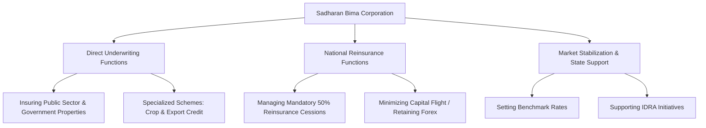

### (a)

#### Role of Private Insurance Companies in the Economic Development of Bangladesh

Private insurance companies play a transformative role in driving the economic development of Bangladesh by acting as financial stabilizers, mobilizers of domestic savings, and catalysts for capital formation. Their contributions can be analyzed through the following core economic dimensions:

- **Mobilization of Savings and Capital Formation:** Private life insurance companies collect micro-premiums from thousands of individual policyholders spread across both urban and rural areas. By pooling these scattered items of small savings, they create substantial investable funds. These long-term capital resources are subsequently channeled into government securities, infrastructure bonds, and capital markets, bridging the national investment gap.
- **Risk Mitigation and Business Continuity:** Industries, manufacturing plants, and service sectors are perpetually exposed to uncertainties such as fire, machinery breakdown, and operational liabilities. Private non-life insurance companies underwrite these commercial risks. By promising financial compensation in the event of a disaster, they provide entrepreneurs with the confidence to undertake high-risk, high-return industrial projects, safeguarding business continuity and employment.
- **Facilitating International and Domestic Trade:** International trade is a primary driver of the Bangladeshi economy, especially through the Ready-Made Garments (RMG) sector. Private insurance providers issue essential marine hull, cargo, and aviation policies. Without these risk-transfer mechanisms, commercial banks would not open Letters of Credit (LCs), effectively halting import-export transactions.
- **Employment Generation:** The private insurance sector is a major source of employment in Bangladesh. It provides direct professional opportunities for thousands of executives, underwriters, actuaries, and loss assessors, alongside generating extensive indirect employment for a vast network of insurance agents operating nationwide.
- **Reduction of Burden on Government Finances:** By offering health, accident, and life insurance products, private insurers reduce the socio-economic burden on the state. In the event of industrial mishaps or personal tragedies, private insurance claims absorb the financial shock, minimizing the need for direct government relief and rehabilitation spending.

### (b)

#### Functions of Sadharan Bima Corporation in the Insurance Industry

Sadharan Bima Corporation (SBC) is the sole state-owned non-life insurance and reinsurance corporation operating in Bangladesh. Established under the Insurance Corporations Act of 1973, it holds a unique, dual-functional status within the country's financial architecture, serving both as a direct insurer and the national reinsurer.

The principal functions of Sadharan Bima Corporation are detailed below:

- **Underwriting Public Sector Risks:** By statutory mandate, SBC is responsible for underwriting 100% of all non-life insurance policies related to public sector properties, government departments, statutory bodies, and state-owned enterprises. It also retains 50% of this public sector business and distributes the remaining 50% equally among private non-life insurance companies.
- **Acting as the National Reinsurer:** SBC serves as the central clearinghouse for reinsurance within Bangladesh. By law, all private non-life insurance firms operating in the country must cede a mandatory percentage (currently 50%) of their total reinsurable risks to SBC. SBC handles the management, evaluation, and settlement of these domestic reinsurance pools.
- **Conservation of Foreign Exchange:** Prior to the establishment of SBC, domestic risks had to be heavily reinsured with foreign corporations, resulting in a continuous outflow of hard currency. SBC retains a substantial portion of national risk within domestic borders, preventing capital flight and conserving the foreign exchange reserves of Bangladesh.
- **Implementation of Socio-Economic Insurance Schemes:** SBC designs and manages specialized, non-commercial insurance products aimed at vulnerable segments of the population. These include the _Crop Insurance Scheme_ to safeguard farmers against natural calamities, and the _Export Credit Guarantee Scheme (ECGS)_, which protects local exporters from default risks associated with foreign buyers.
- **Market Stabilization and Technical Leadership:** SBC plays a vital role in stabilizing premium rates and maintaining market discipline. It frequently provides technical expertise, historical loss data, and risk-assessment frameworks to the Insurance Development and Regulatory Authority (IDRA) and private insurers to foster structural stability across the industry.

### (c)

#### Problems and Prospects of Insurance Business in Bangladesh

The insurance sector in Bangladesh faces a notable paradox: despite the country's rapid GDP growth, national insurance penetration remains among the lowest in South Asia. Resolving this requires understanding both the deep-seated challenges and the emerging drivers within the industry.

#### Key Problems Facing the Insurance Sector

|**Category**|**Specific Challenge**|**Impact on the Industry**|
|---|---|---|
|**Public Trust & Image**|Trust Deficit & Delayed Claims|Persistent delays in settling valid claims have created an adverse public perception, discouraging voluntary insurance uptake.|
|**Market Discipline**|Unethical Competition|Intense rivalries among excessive numbers of private players lead to illegal commission practices and undercutting of standard tariffs.|
|**Human Capital**|Lack of Professional Actuaries|A severe shortage of qualified actuaries and skilled risk-management professionals restricts innovative product design and accurate pricing.|
|**Regulatory Framework**|Weak Enforcement Capabilities|Although the IDRA enforces compliance guidelines, institutional resource constraints limit its capacity to curb systemic market manipulation.|
|**Socio-Cultural Barriers**|Religious Misconceptions|Misunderstandings surrounding the compatibility of traditional insurance contracts with religious values limit penetration in conservative rural markets.|

#### Future Prospects of the Insurance Sector

> [!info] Emerging Growth Drivers
> The structural transformation of the economy of Bangladesh offers several key growth vectors for forward-looking insurers:
>
> - **The Demographic Dividend and Middle-Class Expansion:** The continuous expansion of a consumerist middle-class population with growing disposable income represents a massive untapped market for individual life, health, and pension insurance products.
> - **Mega Infrastructure Developments:** Massive state-backed infrastructure undertakings—including deep-sea ports, economic zones, metro rail networks, and nuclear power plants—generate substantial demand for high-value engineering and non-life insurance policies.
> - **Takaful (Islamic Insurance) Expansion:** Given the demographic profile of Bangladesh, Shariah-compliant insurance structures (Takaful) possess immense growth potential. Standardizing and expanding these operations can successfully draw millions of faith-conscious citizens into the formal financial fold.
> - **Insurtech and Digital Intermediation:** The proliferation of mobile financial services (MFS) like bKash and Nagad enables the distribution of micro-insurance products directly to remote rural populations, bypassing costly traditional agent networks and lowering administrative expenses.
> - **Climate Risk Management:** As a nation highly vulnerable to climate change, the demand for structured crop insurance, flood protection covers, and catastrophe bonds is set to grow exponentially, backed by international development initiatives.
