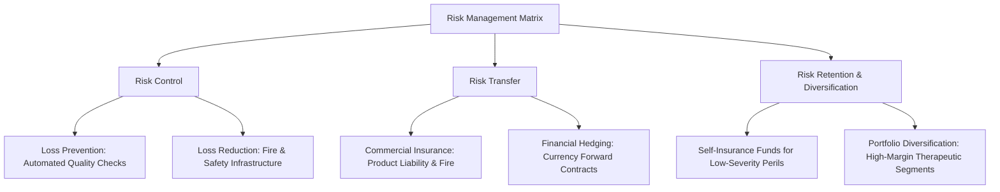

### (a)

#### The Cost of Risk and Real-Time Example

Yes, it is fundamentally true that **"risk is costly."** Risk imposes a heavy economic burden on individuals, corporations, and society as a whole, even if an actual physical or financial loss never materializes. The overall economic cost of risk can be broken down into three distinct components:

1. **The Cost of Loss Control:** Capital spent explicitly to prevent or reduce potential losses (e.g., security systems, fire compliance, quality control mechanisms).
2. **The Cost of Loss Financing:** Outlays required to arrange for funds to cover potential losses, such as purchasing commercial insurance premiums or paying transaction fees for financial derivatives.
3. **The Cost of Residual Uncertainty:** The presence of unmitigated risk creates anxiety and fear, which leads to inefficient allocation of resources. Companies often completely forgo highly profitable, innovative projects simply because the perceived risk is too high.

##### Real-Time Proof / Example

Consider the **Ready-Made Garment (RMG) sector in Bangladesh**. Following global compliance mandates, a typical factory faces severe occupational safety and supply chain disruption risks. To manage this risk, the factory must invest millions of Taka in advanced automated fire hydrant systems, structural building reinforcements, and extensive worker training programs (**Cost of Loss Control**). Furthermore, they must pay substantial annual premiums to insurance companies to secure fire and business interruption coverage (**Cost of Loss Financing**).
Even if the factory never experiences a single fire incident over a decade, hundreds of thousands of dollars remain tied up in risk management rather than being deployed into factory expansion or wage increases. Hence, the mere _existence_ of risk drains economic value, proving that risk is inherently costly.

### (b)

#### Risk Analysis for ABC Pharmaceutical Limited

#### (b\_i)

##### Factors Affecting Risk in a Pharmaceutical Company

As the newly appointed Chief Executive Officer of ABC Pharmaceutical Limited, an analysis of the operational, regulatory, and market landscape reveals several critical risk factors that have contributed to the dramatic decrease in company turnover:

- **Supply Chain and API Dependency:** Pharmaceutical manufacturing in Bangladesh relies heavily on importing over 80% to 90% of its Active Pharmaceutical Ingredients (APIs) from international markets (e.g., India and China). This exposes the company to severe foreign exchange rate volatility, global supply chain bottlenecks, and import tariff fluctuations.
- **Stringent Regulatory Compliance:** The pharmaceutical industry is governed by uncompromising regulatory standards set by the Directorate General of Drug Administration (DGDA) in Bangladesh, alongside international frameworks like the World Health Organization's Good Manufacturing Practices (WHO-GMP). Any failure to meet these standards can result in immediate factory closure or product bans.
- **Product Liability and Quality Control Failures:** The risk of chemical formulation errors, batch contamination, or unknown adverse drug reactions (ADRs) presents a continuous threat. A single defective product line can trigger massive product recalls, catastrophic legal lawsuits, and permanent brand erosion.
- **High Research and Development (R\&D) Risks:** Developing generic alternatives or bioequivalent formulations demands significant upfront capital investments with long gestation periods and highly uncertain therapeutic or market success.
- **Intense Market Competition and Price Controls:** The domestic pharmaceutical market features intense competition among top-tier local manufacturers. Furthermore, government-imposed price ceilings on essential medicines restrict the corporate capacity to pass rising raw-material costs onto consumers, squeezing profit margins.

#### (b\_ii)

##### Risk Management Methods to Maximize Profitability

To reverse the downward trend in turnover and maximize shareholder wealth, the management team must systematically implement a robust combination of risk management methods:

- **Loss Prevention and Reduction (Risk Control):** ABC Pharma must invest in automated, high-precision cleanroom sensors and rigorous multi-stage laboratory quality assurance protocols. This minimizes the frequency of sub-standard batches (loss prevention) and limits waste, directly lowering production costs and boosting turnover.
- **Risk Transfer via Commercial Insurance:** The company must secure comprehensive **Product Liability Insurance**, **Fire Insurance**, and **Business Interruption Insurance**. This transfers the catastrophic financial exposures of potential lawsuits or manufacturing plant closures to third-party insurers, stabilizing corporate cash flows.
- **Financial Hedging (Risk Financing):** To insulate corporate profits from currency fluctuations during API sourcing, the finance department must actively utilize derivative instruments such as **foreign exchange forward contracts**. This locks in predictable import costs and secures profit margins.
- **Risk Retention (Self-Insurance):** For highly predictable, low-severity losses (such as minor laboratory equipment breakdowns), the firm should establish an internal self-insurance fund. This avoids paying the administrative loading fees associated with commercial insurance, conserving cash for dividend distributions.
- **Product Line and Market Diversification:** Management should diversify its product portfolio into high-margin specialized segments (e.g., oncology, biologics, or specialized vaccines) and aggressively pursue geographic diversification by expanding export channels to unregulated or semi-regulated international markets.

### (c)

#### Operational Hazard Analysis for XYZ Bank Ltd.

> [!info] Case Context: XYZ Bank Ltd. (Agrabad Branch)
>
> - **Financial Position (as of 31/12/2017):** Deposits: Tk. 2,500.00 crore | Advances: Tk. 2,000.00 crore
> - **Profit Profile:** Actual Profit: Tk. 80.00 crore | Target Deficit: Tk. 70.00 crore below target
> - **Primary Operational Bottleneck:** Internal officials' Moral and Morale Hazards

##### 1. Definition and Application of the Hazards

- **Moral Hazard:** This refers to dishonesty, fraudulent tendencies, or severe character defects in individuals that deliberately increase the frequency or severity of a loss.
  - _Banking Example:_ In the Agrabad branch, moral hazard manifests when loan officers intentionally engage in insider lending, accept unlawful kickbacks to approve financially unviable credit facilities, or manipulate financial statements to clear non-performing loans (NPLs).
- **Morale Hazard (Attitudinal Hazard):** This refers to carelessness, negligence, or complete indifference to a loss because of an underlying structural safety net (such as secure state-owned employment or lack of strict accountability).
  - _Banking Example:_ In this state-owned branch, morale hazard manifests as employees arriving late, demonstrating extreme apathy toward customer service, performing superficial credit appraisals, and failing to aggressively pursue loan recoveries because their fixed government salary is guaranteed regardless of branch performance.

##### 2. How Controlling These Hazards Will Increase Branch Profitability

Controlling these two behavioral hazards directly repairs the branch's financial leaks, clearing the path to recover the Tk. 70.00 crore profit deficit:

- **Impact of Eliminating Moral Hazard:** By implementing rigorous internal controls, strict dual-authorization lines for loan approval, and surprise internal audits, the branch can eradicate unauthorized or fraudulent credit extensions. Given the branch's massive advance portfolio of **Tk. 2,000.00 crore**, reducing bad loans and defaults by a mere 3.5% directly saves the branch Tk. 70.00 crore in asset write-offs, immediately achieving the missing profit target.
- **Impact of Eliminating Morale Hazard:** By introducing transparent performance-based incentive frameworks, strict Key Performance Indicators (KPIs), and clear disciplinary pathways, management can transform worker indifference into proactive productivity. Energized employees will dramatically improve client service, accelerating deposit mobilization across the **Tk. 2,500.00 crore** market base and optimizing loan recovery cycles, which rapidly scales up the branch's interest income.

### (d)

#### Hedging in Loss Financing and Core Systems

##### How Hedging Helps to Control Loss Financing

Hedging acts as an effective, proactive risk financing tool designed to neutralize or offset speculative financial losses before they derail corporate liquidity. Unlike traditional insurance, which compensates for pure risks (like fire or theft), hedging targets market risks (such as interest rate hikes, commodity price shifts, or currency movements).
By establishing an equal and opposite position in a financial derivative, any loss suffered in the physical cash market is offset by a corresponding gain in the derivative asset. This stabilizes corporate cash flows, removes the volatility from financial planning, and eliminates the need to hold large, non-earning liquid cash reserves (retention) or secure expensive, emergency credit lines to finance unexpected market shocks.

##### Four Widely Used Types of Hedging Systems

| **Hedging System**       | **Operational Mechanism and Definition**                                                                                                                                                                                                                                                                                                                            |
| ------------------------ | ------------------------------------------------------------------------------------------------------------------------------------------------------------------------------------------------------------------------------------------------------------------------------------------------------------------------------------------------------------------- |
| **1. Forward Contracts** | A non-standardized, private agreement between two counter-parties to buy or sell an underlying asset at a fixed, predetermined price on a specified future date. These are traded over-the-counter (OTC) and are highly customizable for specific corporate transactions (e.g., an importer locking in a future USD/BDT rate).                                      |
| **2. Futures Contracts** | A highly standardized derivative contract traded on an organized, regulated financial exchange to buy or sell an asset at a predetermined price in the future. These contracts feature daily mark-to-market adjustments and are backed by a central clearinghouse, which virtually eliminates counterparty default risk.                                            |
| **3. Options Contracts** | A financial derivative that grants the buyer the contractual right, **but not the obligation**, to buy (Call Option) or sell (Put Option) an underlying asset at a specified strike price within a set time frame. The buyer pays an upfront premium to the seller, effectively capping the total downside risk while keeping the upside potential completely open. |
| **4. Swaps**             | A private agreement between two institutional parties to exchange periodic financial streams or cash flows over a specific duration based on an underlying asset or rate. The most common varieties include **Interest Rate Swaps** (exchanging floating-rate interest liabilities for fixed-rate payments) and **Currency Swaps**.                                 |
