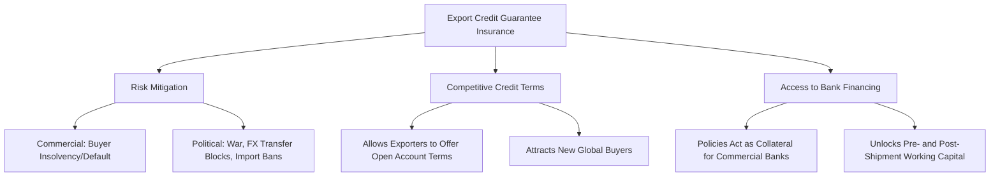

### (a)

#### Problems Facing Insurance Companies in Bangladesh

As the President of the Bangladesh Insurance Association (BIA), an address regarding the contemporary challenges facing the insurance sector in Bangladesh would focus on the following systemic, regulatory, and cultural bottlenecks:

- **Severe Lack of Public Trust and Awareness:** The insurance penetration rate in Bangladesh remains among the lowest in South Asia. A widespread negative perception persists due to historical delays, complex bureaucratic hurdles, and instances of default or non-settlement of legitimate claims by certain insurers, which deters the general public from purchasing policies.
- **Unhealthy and Unethical Market Competition:** The industry suffers from aggressive, non-technical price undercutting and the practice of offering excessive commissions to agents or intermediaries to secure business. This violates the regulatory caps established by the Insurance Development and Regulatory Authority (IDRA) and severely erodes the profitability and premium reserves of companies.
- **Shortage of Skilled Human Capital and Actuaries:** There is an acute scarcity of qualified actuaries, certified underwriters, and professional risk surveyors within the country. This deficiency hinders scientifically sound premium pricing, precise risk assessment, and efficient claim management.
- **Inadequate Product Innovation and Diversification:** Most insurance firms rely heavily on traditional, generic life products or standard commercial fire and marine policies. There is a lack of modern, demand-driven products such as micro-insurance for rural populations, agricultural crop insurance, cyber liability insurance, and weather-indexed products.
- **Slow Adoption of Digital Technology:** Manual processing of documentation, underwriting, and claim verification remains prevalent. The limited integration of Insurtech (Insurance Technology) solutions restricts operational efficiency, transparency, and accessible distribution channels.

### (b)

#### The Roles of Private Insurance Companies in Bangladesh

Private insurance companies are integral to fostering macroeconomic stability and financial development in Bangladesh. Their primary roles include:

- **Risk Mitigation for the Commercial and Industrial Sectors:** Private non-life insurers underwrite a massive volume of risks associated with the country's driving economic sectors, particularly the Ready-Made Garments (RMG) industry, textiles, and manufacturing. By covering hazards like fire, industrial accidents, and marine transit losses, they ensure business continuity.
- **Capital Formation and Infrastructure Investment:** By mobilizing small, fragmented savings from households via life insurance premiums and collecting corporate risk premiums, private insurers accumulate significant long-term investable funds. These funds are channeled into government bonds, commercial banking deposits, and national equity markets, driving national capital formation.
- **Employment Generation:** The private insurance sector acts as a large-scale employer. It provides direct professional employment to thousands of corporate officers, underwriters, and claim adjusters, alongside generating indirect livelihood opportunities for hundreds of thousands of independent insurance agents and surveyors nationwide.
- **Facilitating International Trade:** International trade requires robust risk coverage. Private insurers provide essential marine cargo, hull, and transit liability policies that satisfy the legal and commercial requirements of global shipping, letter of credit (L/C) opening banks, and foreign buyers.
- **Relieving the Fiscal Burden on the State:** By providing private health, accident, and life insurance policies, these companies absorb financial shocks that would otherwise fall upon citizens or require emergency state welfare expenditures and disaster relief allocations.

### (c)

#### Progress of Sadharan Bima Corporation (SBC) in the Bangladesh Insurance Industry

Sadharan Bima Corporation (SBC) occupies a unique and historic position as the sole state-owned non-life insurance and reinsurance corporation in Bangladesh. Its progress, role, and current standing can be evaluated across several dimensions:

- **Institutional Market Anchor and Reinsurance Monopoly:** By statutory mandate, SBC acts as the primary domestic reinsurer. Private non-life insurance companies in Bangladesh are legally required to cede a fixed percentage (historically up to 50%) of their total reinsurance business to SBC. This mechanism enables the country to retain substantial premium capital domestically, preventing the flight of foreign currency reserves to overseas reinsurance markets.
- **Exclusive Insurer of State-Owned Assets:** SBC holds a consolidated position as the exclusive underwriter for all public properties, government enterprises, statutory bodies, and mega national infrastructure projects (e.g., major power plants, bridges, and rail networks). This ensures stable, state-backed revenue generation.
- **Financial Performance and Contribution to National Exchequer:** Over the decades, SBC has consistently demonstrated structural profitability and asset growth. It contributes significantly to national development through corporate taxes, premium taxes, and dividends paid directly to the government.
- **Market Stabilizer During Catastrophes:** SBC serves as a financial backstop for the national insurance ecosystem. During periods of global macroeconomic shocks or large-scale domestic industrial catastrophes, SBC provides critical underwriting liquidity and capacity when international commercial reinsurers harden their terms.
- **Areas Requiring Modernization:** While SBC has achieved substantial scale, its progress faces challenges related to public-sector bureaucracy, slower technological integration relative to international reinsurance benchmarks, and the necessity to deploy advanced predictive risk-modeling systems.

### (d)

#### The Role of Export Credit Guarantee Insurance (ECGI) in Increasing Export Volume

Export Credit Guarantee Insurance (ECGI) acts as a specialized financial instrument designed to safeguard domestic exporters against losses arising from cross-border trade transactions. It plays a vital role in expanding a nation's export volumes through the following mechanisms:

- **Mitigation of Commercial and Political Risks:** International trade exposes exporters to severe uncertainties. ECGI protects the exporter against **commercial risks** (such as foreign buyer insolvency, protracted default, or refusal to accept goods) and **political risks** (such as sudden civil war, changes in foreign import regulations, or foreign exchange transfer delays imposed by the host country).
- **Enabling Competitive Credit Terms:** In highly competitive global markets, foreign buyers prefer trading on open account terms or deferred payment structures rather than strict, expensive Letters of Credit (L/Cs). Backed by an ECGI policy, an exporter can confidently extend flexible credit terms to foreign buyers without fearing non-payment, thereby capturing larger market shares and entering untested international markets.
- **Unlocking Access to Trade Finance:** Commercial banks are often hesitant to provide working capital financing against unsecured foreign receivables. When an exporter holds an ECGI policy, the policy can be assigned to the financing bank as a form of high-quality collateral. This facilitates the acquisition of pre-shipment and post-shipment export financing, resolving liquidity constraints and allowing the exporter to fulfill larger order volumes.
