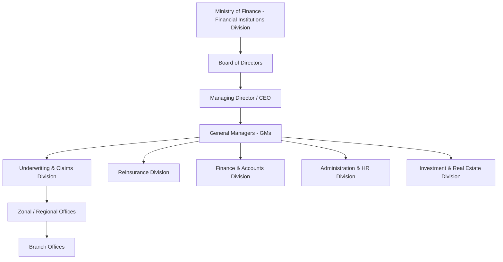

### (a)

#### History of Life Insurance Business in Bangladesh

The evolution of the life insurance sector in Bangladesh can be divided into distinct historical phases:

- **Pre-Independence Era (British & Pakistani Period):** Prior to 1971, the insurance business in the region was conducted by a mix of foreign and Pakistani private enterprises. Around 49 general and life insurance companies operated throughout East Pakistan, but the market lacked localized regulatory oversight and structural alignment with regional development goals.
- **Post-Independence Nationalization (1972):** Following the liberation of Bangladesh, the government nationalized the entire insurance industry in 1972 under the Insurance Corporations Act (Presidential Order No. 95). This intervention aimed to safeguard public savings and canalize resources toward national reconstruction. It resulted in the formation of two state-run entities: Surma Jiban Bima Corporation (for life insurance) and Rupsa Sadharan Bima Corporation (for general insurance).
- **Consolidation of State Monopolies (1973):** In 1973, the structural framework was streamlined. Surma Jiban Bima Corporation was reorganized into **Jiban Bima Corporation (JBC)**, which was granted a state monopoly over the life insurance business, acting as the sole insurer for over a decade.
- **De-nationalization and Private Sector Entry (1984–1985):** To drive market competitiveness, efficiency, and penetration, the government enacted the Insurance Corporations (Amendment) Ordinance in 1984. This opened up the market to private capital. National Life Insurance Company Limited was established in 1985 as the country's first private life insurance provider.
- **Modern Regulatory Framework (2010–Present):** To replace the legacy Insurance Act of 1938, the government introduced the **Insurance Act 2010** and established the **Insurance Development and Regulatory Authority (IDRA)**. This modernizing step separated regulatory supervision from commercial operations, creating a structured compliance landscape for the private insurers currently active in the country.

### (b)

#### Key Role Played by Private Insurance Companies in the Economic Development of Bangladesh

Private insurance companies contribute substantially to the macroeconomic landscape of Bangladesh through several mechanisms:

- **Mobilization of Savings and Capital Formation:** Private insurers aggregate micro-savings from millions of policyholders across urban and rural areas via regular premium collections. This continuous collection forms a large pool of long-term investable capital that is funneled into government treasury bills, corporate bonds, and secondary equity markets.
- **Risk Mitigation and Social Stability:** By offering diverse life, health, and pension coverage, private insurers insulate families and breadwinners from sudden, catastrophic financial shocks due to premature death or illness. This stabilization preserves household purchasing power and reduces the burden on state social safety nets.
- **Employment Generation:** The expansion of private life and non-life insurers has created extensive direct and indirect employment. It supports thousands of corporate professional roles—such as underwriters, claims adjusters, auditors, and IT specialists—alongside a vast network of independent agents and brokers throughout the country.
- **Synergy with the Banking Sector:** Insurance companies maintain significant long-term fixed deposits with private and commercial banks. This liquidity helps the banking system sustain institutional reserve requirements and underwrite commercial loans for industrial development.
- **Financial Market Deepening:** As institutional investors, private insurance companies add structural depth, liquidity, and stability to national stock exchanges (DSE and CSE), balancing market volatility and supporting corporate equity issuance.

### (c)

#### Organizational Structure of Sadharan Bima Corporation (SBC)

Sadharan Bima Corporation (SBC) is the premier state-owned general insurance and reinsurance corporation in Bangladesh. Its organizational hierarchy is structured to ensure operational accountability, public transparency, and professional management of both primary commercial general insurance and sovereign reinsurance functions.

##### Core Structural Components

- **Ministry Oversight:** SBC operates under the administrative jurisdiction of the Financial Institutions Division (FID) of the Ministry of Finance, Government of Bangladesh.
- **Board of Directors:** The apex policy-making body of the corporation. It consists of a Chairman and Directors appointed by the government from relevant cadres, including financial regulators, civil servants, and business experts. The board defines strategic directives and ensures statutory compliance.
- **Managing Director & CEO:** The executive head responsible for day-to-day administration, institutional operations, execution of board resolutions, and overall corporate performance.
- **Functional Divisions (Headed by General Managers):**
  - _Underwriting & Claims:_ Manages risk assessment, policy pricing, and verification across fire, marine, motor, and aviation lines, while processing and settling public and private claims.
  - _Reinsurance Division:_ Handles the mandatory domestic reinsurance cessions from private general insurance companies operating in Bangladesh and manages retrocession arrangements with international reinsurers.
  - _Finance & Accounts:_ Oversees revenue accounting, premium collections, statutory budgeting, and internal financial audits.
  - _Investment & Real Estate:_ Manages the deployment of SBC’s surplus funds into high-yield financial portfolios and manages its real estate assets.
- **Field Network:** Operationalized across the country via Zonal Offices, Regional Offices, and a network of localized Branch Offices to deliver underwriting and claims services directly to retail and institutional clients.

### (d)

#### Key Obstacles Liable for the Poor Performance of the Insurance Sector in Bangladesh

The development, penetration, and performance of the insurance sector in Bangladesh face several persistent constraints:

- **Deficit of Public Trust and Awareness:** A large segment of the population remains unaware of the long-term economic benefits of insurance, frequently viewing it as an unproductive expense. This issue is compounded by legacy public skepticism regarding industry reliability and corporate transparency.
- **Protracted Claims Settlement Processes:** Delays in verifying and settling valid insurance claims due to bureaucratic inefficiencies, manual documentation processing, or liquidity issues within weaker insurers damage the industry's reputation and discourage renewals.
- **Acute Shortage of Technical Talent and Actuaries:** The sector suffers from a structural deficit of qualified risk managers, professional underwriters, and certified actuaries. This deficit hampers data-driven risk pricing, long-term financial modeling, and scientific product formulation.
- **Unhealthy Market Competition and Infractions:** Intense market fragmentation has driven some private insurers to engage in aggressive premium undercutting and pay unauthorized, inflated commissions to agents to secure business. This inflates operational management expenses and strains corporate profitability.
- **Regulatory Compliance and Enforcement Gaps:** While the Insurance Development and Regulatory Authority (IDRA) sets benchmarks, its oversight capacity is constrained by manual data reporting practices and resource limitations, which affects its ability to eliminate market malpractice uniformly.
- **Limited Innovation and Product Homogeneity:** The industry remains heavily reliant on traditional, rigid insurance products. There is a lack of modern, high-demand alternatives such as micro-insurance, weather-indexed crop insurance, health-tech products, or comprehensive digital-first policy issuance platforms.
