# Chapter 1

### 1. Definition of Business Ethics

Business ethics is the study of business situations, activities, and decisions where issues of right and wrong are addressed.

It is important to note that 'right' and 'wrong' in this context refer to choices that are morally acceptable or unacceptable, rather than decisions that are merely commercially successful, operationally efficient, or legally compliant. Business ethics, therefore, evaluates the moral dimensions of organizational activities, commercial practices, and managerial decision-making, extending from individual choices to global systemic impacts.

### 2. Relationship between Business Ethics and the Law

The relationship between business ethics and the law is often misunderstood as being identical; however, they are distinct concepts that overlap in significant ways. The law can be understood as the codification of a society's baseline moral beliefs and values into formal rules, regulations, and prescriptions.

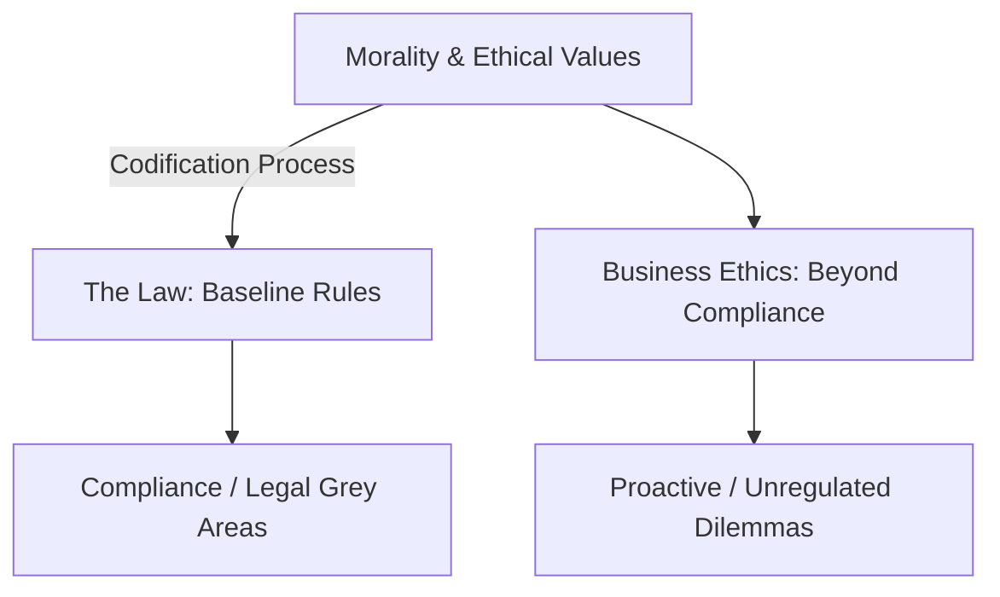
```mermaid
graph TD
    A[Morality & Ethical Values] -->|Codification Process| B[The Law: Baseline Rules]
    B --> C[Compliance / Legal Grey Areas]
    A --> D[Business Ethics: Beyond Compliance]
    D --> E[Proactive / Unregulated Dilemmas]
```

The definition of law and its relationship with business ethics can be broken down into the following key dimensions:

- **The Law as a Moral Baseline:** The law represents a society's institutionalized consensus on what constitutes acceptable behavior. It establishes the mandatory minimum standards that organizations must follow to avoid civil or criminal penalties.
- **The Inadequacy of Solely Relying on Law:** Law alone is insufficient for guiding ethical business conduct due to several fundamental limitations:
  - **The Grey Areas of Law:** The law is rarely definitive in every possible situation. It contains ambiguities, loopholes, and interpretative gaps that corporate lawyers can exploit, meaning an action can be technically legal but highly unethical.
  - **Lag Time (Reactive Nature):** The law is inherently reactive. It typically changes only after a major societal shift, corporate scandal, or technological breakthrough occurs. Business ethics must be proactive to address novel dilemmas (e.g., data privacy, AI ethics) before specific laws are codified.
  - **Global Variations and Jurisdiction:** Laws are bound by national and territorial jurisdictions, whereas modern business operations are global. Multi-national corporations frequently operate in developing countries where environmental and labor laws are weak or non-existent. In such contexts, business ethics provides the necessary guidance where local laws fail to protect stakeholders.
  - **Absence of Legal Precedent:** For many complex managerial decisions—such as organizational restructuring, choosing between suppliers, or prioritizing stakeholder claims—there are no legal rules prescribing the "correct" course of action. These decisions rely entirely on ethical judgment.

### 3. Distinction between Ethics, Morality, and Ethical Theory

To analyze organizational behavior rigorously, a precise distinction must be made between morality, ethics, and ethical theory:

- **Morality:** Morality refers to the core beliefs, values, and norms about what is right and wrong, good and bad, that govern human behavior within a specific society, culture, or group. It serves as the everyday, practical guide that individuals use to determine how they should act. Morality is lived experience and culturally embedded.
- **Ethics:** Ethics is the systematic study, reflection, and philosophical analysis of morality. It acts as a critical framework used to investigate, challenge, and clarify existing moral beliefs and rules. While morality tells us _what_ we should do, ethics investigates _why_ we should do it and whether the underlying moral assumptions are justified.
- **Ethical Theory:** Ethical theories are the formalized, codified systems of principles and rules that provide a structured approach to resolving ethical dilemmas. These theories are developed by philosophers to offer consistent, rational bases for making moral judgments. They are categorized broadly into:
  - _Consequentialist / Teleological Theories:_ Evaluating the morality of an action based entirely on its outcomes or consequences (e.g., Utilitarianism, Egoism).
  - _Non-consequentialist / Deontological Theories:_ Evaluating the morality of an action based on duties, rights, and intrinsic principles, regardless of the consequences (e.g., Kantian Ethics, Rights-Based Ethics).

### 4. Importance of Business Ethics as an Academic Subject and Practical Management Issue

The evaluation of business ethics must be split into its dual roles as an academic discipline and an active, practical management imperative.

##### As an Academic Subject

- **Interdisciplinary Framework:** It provides students and researchers with analytical tools from philosophy, sociology, economics, and management to unpack complex organizational dilemmas.
- **Critical Examination of Capitalism:** It allows for a systematic critique of standard economic assumptions (such as unrestrained shareholder maximization) and evaluates the broader role of corporations in society.
- **Understanding Business Power:** As corporations have grown to rival national governments in terms of revenue and global influence, academia must study how this power is wielded and what responsibilities accompany it.

##### As a Practical Management Issue

- **Risk and Crisis Management:** Unethical behavior leads to corporate scandals, lawsuits, heavy regulatory fines, and catastrophic reputational damage (e.g., Enron, Volkswagen’s emissions scandal). Managing ethics proactively mitigates these existential risks.
- **Stakeholder Demands:** Consumers, investors, and employees are increasingly conscious of corporate behavior. Ethical practices directly influence brand loyalty, consumer trust, and access to capital (such as ESG-driven investments).
- **Employee Attraction and Retention:** Organizations that demonstrate strong ethical values and corporate citizenship find it easier to recruit, motivate, and retain top talent, particularly among younger generations who seek meaningful work aligned with their personal values.
- **Cost Reduction:** Proactive ethics management minimizes internal misconduct, fraud, theft, and whistleblowing disputes, which drastically reduces legal compliance costs and improves operational efficiency.

### 5. Ethical Challenges in Different Types of Organisations

Ethical issues manifest differently depending on the ownership structure, funding mechanisms, and core objectives of an organization.

|**Organisation Type**|**Core Focus / Objective**|**Primary Ethical Challenges**|
|---|---|---|
|**Private Sector (Corporations)**|Profit maximization, shareholder value, market share growth.|Executive remuneration, financial misrepresentation, worker exploitation, negative externalities (pollution), balancing shareholder demands against broader stakeholder rights.|
|**Public Sector (Government Bodies)**|Public service delivery, policy implementation, societal welfare.|Bureaucratic inertia, corruption, conflicts of interest, misappropriation of public funds, transparency vs. national security, equitable distribution of public resources.|
|**Civil Society (NGOs / Charities)**|Advocacy, social/environmental causes, humanitarian aid.|Mission drift (altering goals to secure funding), transparency in fund allocation, accountability to beneficiaries vs. wealthy donors, integrity of marketing campaigns.|
|**Small and Medium Enterprises (SMEs)**|Survival, localized operations, entrepreneurial growth.|Resource poverty (lack of formal ethics officers/codes), informality leading to nepotism, severe vulnerability to market shocks, reliance on personal relationships over objective policies.|

### 6. Globalisation as a Critical Context for Business Ethics

Globalisation is defined as a progressive process where geographical distance becomes less important for establishing and maintaining cross-border economic, political, and socio-cultural relations. It represents a critical, transformative context for business ethics due to the following structural shifts:

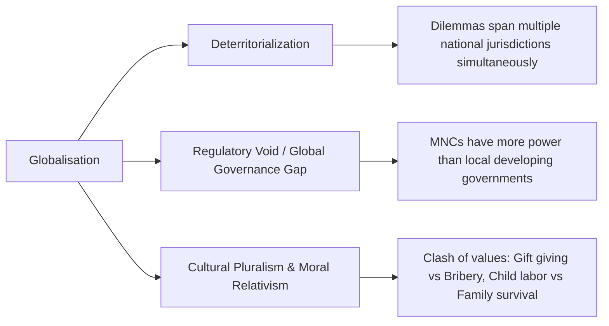
```mermaid
graph LR
    A[Globalisation] --> B[Deterritorialization]
    A --> C[Regulatory Void / Global Governance Gap]
    A --> D[Cultural Pluralism & Moral Relativism]
    
    B --> E[Dilemmas span multiple national jurisdictions simultaneously]
    C --> F[MNCs have more power than local developing governments]
    D --> G[Clash of values: Gift giving vs Bribery, Child labor vs Family survival]
```

- **Deterritorialization:** Economic activities are no longer tied to specific physical territories. Supply chains, data flows, and capital transactions span across multiple nations instantaneously, meaning an ethical decision made in one country can have immediate, unintended human rights or environmental impacts in another.
- **The Regulatory Void (Global Governance Gap):** While economic activities have become globalized, legal and political systems remain largely nation-based. Multinationals operate in a vacuum where global trade bodies (WTO, IMF) prioritize market liberalization over social regulations. This enables corporations to engage in "regulatory arbitrage"—moving production to countries with the weakest labor, safety, and environmental standards.
- **Cultural Pluralism and Moral Relativism:** Globalisation forces organizations to operate across diverse cultural landscapes. This introduces severe ethical friction when home-country values clash with host-country traditions. Managers face dilemmas concerning gender equality, fair wages, safety standards, and intellectual property rights, forcing them to navigate the fine line between ethical imperialism (forcing one's own values on others) and moral relativism (blindly accepting local practices, even if harmful).

### 7. International Perspectives on Business Ethics

The conceptualization and implementation of business ethics vary drastically across major regions due to underlying historical, cultural, legal, and institutional differences.

##### North American Perspective

- **Core Focus:** Strongly individualistic framework focusing on individual accountability, personal integrity, and corporate misconduct.
- **Governance Model:** Shareholder-centric, where the primary responsibility of management is to maximize value for stock owners within the bounds of the law.
- **Mechanism:** Highly formalized, transactional, and legalistic, relying heavily on explicit codes of conduct, compliance programs, and corporate litigation.

##### European Perspective

- **Core Focus:** Institutionalized and collective framework embedded within a social democracy model. Ethics is viewed as a structural negotiation between broad social groups (unions, state, corporations).
- **Governance Model:** Stakeholder-centric, recognizing that employees, communities, suppliers, and the environment have legitimate institutional rights that must be balanced alongside capital owners.
- **Mechanism:** Less reliant on individual corporate codes and more reliant on state regulation, codetermination laws (e.g., workers on boards), and comprehensive social welfare frameworks.

##### Asian Perspective

- **Core Focus:** Relational, collective, and network-based ethics deeply influenced by philosophical and religious traditions such as Confucianism, Hinduism, or Shintoism.
- **Governance Model:** High emphasis on social harmony, paternalism, and long-term mutual obligation over short-term quarterly financial gains.
- **Mechanism:** Operates through implicit, trust-based networks and informal relationships (e.g., _Guanxi_ in China, _Keiretsu_ in Japan, _Chaebol_ in South Korea), where business choices are constrained by duty to the collective family, community, or nation rather than purely abstract legal rules.

### 8. The Triple Bottom Line of Sustainability

The concept of sustainability has evolved beyond narrow environmental preservation to become a central goal of modern business ethics. This evolution is operationalized via the **Triple Bottom Line (TBL)** framework, popularized by John Elkington, which argues that corporate performance must be measured across three separate, interdependent dimensions rather than standard financial accounting metrics alone.

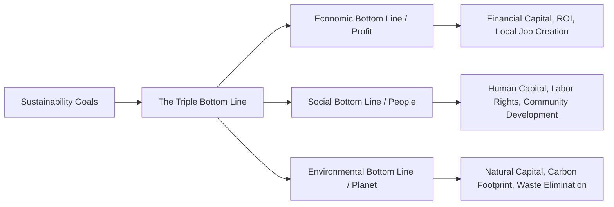
```mermaid
graph LR
    Sub[Sustainability Goals] --> TBL[The Triple Bottom Line]
    TBL --> P1[Economic Bottom Line / Profit]
    TBL --> P2[Social Bottom Line / People]
    TBL --> P3[Environmental Bottom Line / Planet]
    
    P1 --> E1[Financial Capital, ROI, Local Job Creation]
    P2 --> E2[Human Capital, Labor Rights, Community Development]
    P3 --> E3[Natural Capital, Carbon Footprint, Waste Elimination]
```

- **The Economic Bottom Line (Profit):** This refers to the traditional financial performance of the firm, but with an ethical expansion. It looks beyond immediate corporate net profit to evaluate the long-term economic impact of the organization on the economic system itself. This includes local wealth creation, job security, tax contributions to public infrastructure, avoiding predatory pricing, and maintaining long-term financial viability without relying on state bailouts.
- **The Social Bottom Line (People):** This dimension measures the corporate impact on human capital and society. It requires organizations to conduct business in a manner that benefits and supports employees, the community, and consumers. Ethical issues under this pillar include ensuring fair living wages, guaranteeing safe working conditions, eradicating child or forced labor throughout the global supply chain, promoting diversity, and investing in localized community development programs.
- **The Environmental Bottom Line (Planet):** This dimension addresses the preservation of natural capital and ecological balance. It mandates that businesses minimize their ecological footprint and preserve the environment for future generations. Key operational practices include reducing carbon emissions, eliminating toxic waste, adopting circular economy manufacturing models, utilizing renewable energy sources, and ensuring that the consumption of finite natural resources does not exceed nature’s capacity for regeneration.

# Chapter 2

### 1. The Role of Normative Ethical Theory for Ethical Decision-Making in Business

Normative ethical theories are distinct from descriptive ethical theories. While descriptive theories seek to explain _how_ and _why_ business professionals actually make certain decisions (what is), normative ethical theories prescribe _how_ business professionals _ought_ to make decisions (what should be). They provide the systematic, rational, and philosophical frameworks necessary to determine whether a specific business action, policy, or strategy is morally right or wrong.
In the context of corporate decision-making, these theories serve three essential functions:

- **Analytical Frameworks:** They help managers structure complex business problems by identifying the core moral issues at stake, stripping away irrelevant data, and highlighting the values that conflict with one another.
- **Justification Mechanisms:** They provide a rigorous, universally understood language that corporations can use to defend their choices to critical stakeholders, regulators, and the general public, moving arguments beyond mere subjective opinion or personal intuition.
- **Strategic Guidance:** They offer proactive principles that guide policy creation, code of conduct design, and corporate governance models before crises occur.

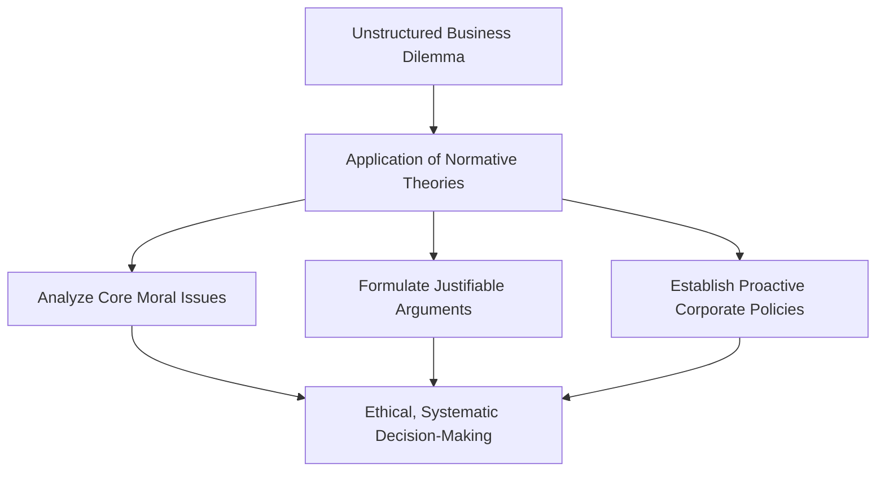
```mermaid
graph TD
    A[Unstructured Business Dilemma] --> B[Application of Normative Theories]
    B --> C[Analyze Core Moral Issues]
    B --> D[Formulate Justifiable Arguments]
    B --> E[Establish Proactive Corporate Policies]
    C & D & E --> F[Ethical, Systematic Decision-Making]
```

### 2. International Differences in Perspectives on Normative Ethical Theory

The acceptance, interpretation, and application of normative ethical theories are deeply influenced by regional histories, institutional arrangements, and cultural traditions. While modern business ethics relies heavily on a common philosophical vocabulary, the practical emphasis shifts across global regions:

##### North American Perspectives

The North American business landscape tends to favor highly individualistic and rule-based normative approaches. There is a strong preference for **Deontological frameworks (Rights and Duties)** translated into explicit corporate codes of conduct, compliance manuals, and legalistic protections for individual properties and rights. Concurrently, **Utilitarianism** is heavily embedded in the region’s corporate mindset through its alignment with economic efficiency, cost-benefit analyses, and the maximization of shareholder value as the primary social good.

##### European Perspectives

European traditions place a far greater emphasis on collective responsibility, social democracy, and institutional frameworks. Rather than focusing on individual actions, European business ethics leans toward **Justice theories** and **Discourse Ethics**. There is an institutional expectation that ethical choices must be hammered out through structured dialogue between social partners (the state, labor unions, and industry associations). European corporate governance models prioritize balancing a wide array of stakeholder claims over raw shareholder utility.

##### Asian Perspectives

In many Asian contexts, particularly East Asia, traditional Western modernist frameworks based on abstract universal rules or utility calculations are less dominant. Instead, the focus shifts toward **Virtue Ethics**, heavily shaped by philosophical systems such as Confucianism, Taoism, or Buddhism. Morality is viewed through the lens of relational duties, character development, long-term mutual obligations, and the preservation of societal harmony (_Guanxi_ in China or _Wa_ in Japan). Ethical behavior is determined by the character of the decision-maker and their commitment to collective welfare, rather than adherence to formal, abstract codes.

### 3. Western Modernist Ethical Theories

Western modernist ethical theories represent the traditional canon of business ethics philosophy. Developed primarily during the Enlightenment, these theories assume that human beings are rational agents capable of discovering universal moral principles through reason. They are broadly divided into consequentialist (teleological) and non-consequentialist (deontological) perspectives.

##### Utilitarianism

- **Core Philosophy:** Formulated by Jeremy Bentham and refined by John Stuart Mill, utilitarianism is a consequentialist theory. It states that an action is morally right if it results in the greatest amount of good (utility, pleasure, happiness) for the greatest number of people affected by that action. It is often summarized as the "greatest happiness principle."
- **Business Application:** This theory forms the underlying rationale for market economies and standard business tools such as cost-benefit analysis, risk assessment, and environmental impact assessments. A manager applying utilitarianism calculates all the positive benefits and negative harms of an option for all affected stakeholders; the path that yields the highest net utility is selected.
- **Critiques and Limitations:**
  - _The Measurement Problem:_ It is exceptionally difficult to quantify, compare, and assign an objective value to non-monetary human experiences like health, happiness, or psychological well-being.
  - _The Tyranny of the Majority:_ Utilitarianism focuses on the aggregate outcome, meaning it can justify severe harm or injustice to a minority group if the net benefits to the majority are large enough (e.g., exploiting low-wage supply chain workers to provide cheap goods to millions of consumers).

##### Ethics of Duty

- **Core Philosophy:** Developed by Immanuel Kant, the ethics of duty is a deontological (non-consequentialist) framework. Kant argued that the morality of an action is determined entirely by the intrinsic nature of the action itself and the motive of the actor, regardless of the consequences. Actions must be performed out of a sense of duty, guided by the **Categorical Imperative**. Kant provided three formulations of this imperative:
  1. _Consistency (Universalizability):_ Act only according to that maxim whereby you can at the same time will that it should become a universal law. If everyone did this action, would society still function? (e.g., if every business lied in their contracts, the concept of a contract would collapse).
  2. _Human Dignity:_ Act in such a way that you treat humanity, whether in your own person or in the person of any other, never merely as a means to an end, but always at the same time as an end.
  3. _Autonomy (Kingdom of Ends):_ Act as if you were through your maxims a law-making member of a hypothetical universal kingdom of ends, where everyone respects each other's moral autonomy.
- **Business Application:** Kantian ethics provides a foundational basis for absolute rules in business, including employee rights, consumer safety guarantees, strict honesty in marketing, and the enforcement of contracts. It dictates that companies cannot exploit employees as mere cogs or economic instruments to generate corporate profit.
- **Critiques and Limitations:**
  - _Rigidity:_ The theory allows for no exceptions. For example, Kantianism holds that lying is always wrong, even if telling a lie could prevent significant, catastrophic harm.
  - _Conflicting Duties:_ It provides little guidance when two valid moral duties clash, such as a duty to keep a professional secret versus a duty to protect public safety.

##### Rights and Justice

- **Rights Theory:** Grounded in the philosophy of John Locke, this perspective asserts that individuals possess natural, inalienable entitlements (such as the right to life, liberty, property, and free speech) that must be respected by all entities, including corporations. In business, this underpins product liability laws, workplace safety regulations, and data privacy protections.
- **Justice Theory:** Most prominently articulated by John Rawls in his _Theory of Justice_, this approach focuses on how the benefits and burdens of a society or organization are distributed among its members. Rawls proposed that a just society should be designed behind a **Veil of Ignorance**, where no one knows their social standing, wealth, gender, or intelligence in advance. This thought experiment yields two core principles:
  1. _The Liberty Principle:_ Each person has an equal right to the most extensive basic liberties compatible with similar liberties for others.
  2. _The Difference Principle:_ Social and economic inequalities are permissible only if they work to the maximum benefit of the least advantaged members of society and are attached to positions open to all under fair equality of opportunity.

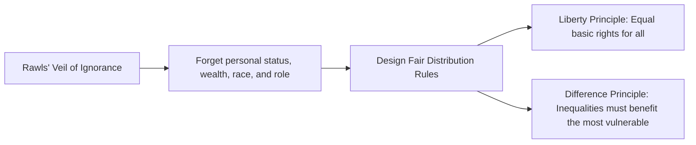
```mermaid
graph LR
    A[Rawls' Veil of Ignorance] --> B[Forget personal status, wealth, race, and role]
    B --> C[Design Fair Distribution Rules]
    C --> D[Liberty Principle: Equal basic rights for all]
    C --> E[Difference Principle: Inequalities must benefit the most vulnerable]
```

- **Business Application:** Justice theory demands fair executive-to-worker pay ratios, equitable promotion tracks, and non-discriminatory hiring processes. It challenges corporations to evaluate whether their strategies inadvertently deepen structural societal inequalities.

### 4. Alternative Ethical Theories

Alternative ethical theories emerged largely as a critique of Western modernist philosophies. Critics argue that modernist approaches are overly abstract, rationalistic, rigid, and disconnected from the real, messy, and relational contexts of human life.

##### Virtue Ethics

- **Core Philosophy:** Originating from Aristotle, virtue ethics shifts the moral question from "What should I _do_?" to "What kind of person should I _be_?". It emphasizes the cultivation of an individual's moral character, habits, and practical wisdom (_phronesis_). Virtues are seen as the balanced middle point (the "Golden Mean") between two vices of excess and deficiency (e.g., courage is the mean between cowardice and recklessness).
- **Business Application:** Virtue ethics focuses heavily on the moral development of business leaders and the creation of an ethical corporate culture. It suggests that a truly virtuous manager will naturally make ethical choices because of their deeply ingrained character, rather than because they are following a checklist or computing utility scores. It looks at long-term character traits like integrity, fairness, honesty, and humility.
- **Critiques and Limitations:** -
  - _Lack of Specific Action Guidance:_ It provides no clear rules or formula for resolving concrete, immediate dilemmas.
  - _Cultural Relativity:_ What constitutes a "virtue" can vary significantly between different societies and historical eras.

##### Feminist Ethics (Ethics of Care)

- **Core Philosophy:** Developed by Carol Gilligan and Nel Noddings, Feminist Ethics rejects the modernist focus on abstract, universal rules and detached rationality. It posits that morality is fundamentally rooted in the concrete relationships, networks, and responsibilities we have toward specific human beings. It values empathy, compassion, responsiveness to vulnerability, and the preservation of relational connections over sterile logic and individual rights.
- **Business Application:** This theory shifts corporate attention toward deep stakeholder engagement, employee well-being, psychological safety, and collaborative supply chain partnerships. It encourages managers to look at the unique, contextual details of a situation and prioritize caring for those who are most vulnerable or dependent on the firm's decisions.
- **Critiques and Limitations:**
  - _Risk of Parochialism / Partiality:_ By prioritizing close relationships, it can lead to favoritism or nepotism, potentially ignoring the rights of distant strangers who are also affected by the business.
  - _Lack of Clear Boundaries:_ It can be difficult to determine exactly how far a corporation's boundary of care should extend into communities or global networks.

##### Discourse Ethics

- **Core Philosophy:** Formulated by Jürgen Habermas, discourse ethics is a procedural theory. It states that rather than individuals figuring out what is right in isolation, the morality of a norm or decision must be determined through a democratic process of actual communication. For a norm to be valid, it must withstand the scrutiny of a rational dialogue held within an **Ideal Speech Situation**, where:
  1. All affected parties have an equal right to participate.
  2. All participants have equal freedom to voice their opinions, critique assumptions, and introduce new ideas.
  3. There is a complete absence of coercion, power imbalances, or manipulation; only the "force of the better argument" prevails.
- **Business Application:** Discourse ethics provides a robust conceptual blueprint for corporate social reporting, multi-stakeholder initiatives (e.g., the Forest Stewardship Council), community consultations before major industrial projects, and democratic conflict-resolution processes within organizations.
- **Critiques and Limitations:**
  - _Idealistic and Impractical:_ True power symmetry is exceptionally rare in the corporate world. Companies almost always hold significant resource and information advantages over consumers or local communities.
  - _Time and Resource Constraints:_ Engaging in exhaustive, uncoerced dialogue with every single stakeholder group is incredibly time-consuming and can paralyze corporate decision-making.

##### Postmodernism

- **Core Philosophy:** Postmodernism, associated with thinkers like Zygmunt Bauman and Jean-François Lyotard, completely rejects the "grand narratives" or universal moral blueprints offered by modernist philosophies. It emphasizes that the moral world is inherently ambiguous, fragmented, and emotionally driven. Postmodernism encourages individuals to move past cold, institutional rules and reconnect with their raw, inner **moral impulse**—the immediate, pre-rational feeling of gut-level responsibility for another human being.
- **Business Application:** This perspective encourages employees and managers to look beyond rigid, bureaucratic compliance programs and formal corporate codes of conduct, which often serve merely to shield organizations from legal liability. It challenges professionals to question institutionalized corporate dogma, listen to their personal conscience, and acknowledge the ethical ambiguities present in daily corporate life.
- **Critiques and Limitations:**
  - _Moral Relativism / Nihilism:_ By dismantling universal standards, it offers no stable ground for declaring specific corporate actions (like fraud or human rights abuses) universally wrong.
  - _Paralysis:_ It offers critique and deconstruction but provides very few constructive, concrete tools for building stable organizational policies.

### 5. Conducting a Pluralist Business Ethics Evaluation

Because every single normative ethical theory has its own inherent blind spots and limitations, relying on just one framework can result in skewed, incomplete, or dangerous business decisions. Therefore, modern business ethics advocates for **Pragmatic Pluralism**—an evaluative approach that systematically applies multiple normative frameworks to a single complex dilemma to achieve a comprehensive, well-rounded moral assessment.

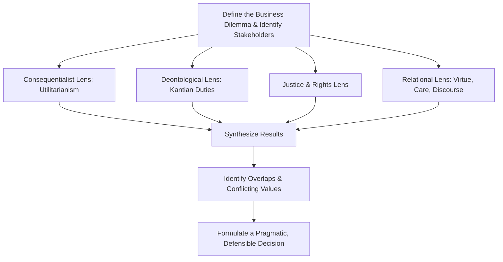
```mermaid
graph TD
    Step1[Define the Business Dilemma & Identify Stakeholders] --> Step2[Consequentialist Lens: Utilitarianism]
    Step1 --> Step3[Deontological Lens: Kantian Duties]
    Step1 --> Step4[Justice & Rights Lens]
    Step1 --> Step5[Relational Lens: Virtue, Care, Discourse]
    
    Step2 --> Summary[Synthesize Results]
    Step3 --> Summary
    Step4 --> Summary
    Step5 --> Summary
    
    Summary --> Step6[Identify Overlaps & Conflicting Values]
    Step6 --> Step7[Formulate a Pragmatic, Defensible Decision]
```

To conduct a structured pluralist evaluation, a manager or analyst proceeds through the following sequential stages:

##### Step 1: Contextualize and Map Stakeholders

Clearly define the business dilemma, gather all relevant technical data, and identify every internal and external stakeholder group who will be impacted by the decision.

##### Step 2: Apply the Consequentialist Lens (Utilitarianism)

- Calculate the projected positive outcomes and negative harms for all identified stakeholders.
- Determine which option maximizes aggregate utility or economic efficiency, while systematically identifying any vulnerable minorities being marginalized by the aggregate calculation.

##### Step 3: Apply the Deontological Lens (Ethics of Duty)

- Evaluate the core maxims behind each choice. Ask if these actions could be universalized without logical contradiction.
- Screen options to ensure no stakeholder group is being exploited or treated _merely_ as a financial tool to achieve corporate goals.

##### Step 4: Apply the Rights and Justice Lens

- Check if any options violate fundamental, inalienable human, labor, or civil rights.
- Assess the distribution of benefits and burdens. Ensure the chosen path does not disproportionately dump negative externalities (e.g., pollution, job losses) onto the least advantaged or most vulnerable stakeholders.

##### Step 5: Apply Alternative Lenses (Virtue, Care, and Discourse)

- _Virtue:_ Evaluate how the choice reflects upon the character of the organization. Does this action align with core corporate virtues like integrity, honesty, and stewardship?
- _Care & Discourse:_ Examine the specific web of relationships. Have the affected parties been given an opportunity to participate in an open, transparent dialogue? Does the solution demonstrate empathy and preserve essential community networks?

##### Step 6: Synthesis and Practical Resolution

- Compare the results derived from each lens. Look for areas of moral convergence where multiple theories point toward the same course of action.
- Where the theories conflict (e.g., utility dictates laying off workers, but duty and care dictate protecting them), the pluralist framework forces managers to consciously weigh competing values, acknowledge moral trade-offs, and construct a nuanced, transparently defended decision that mitigates harms to the greatest extent possible.

# Chapter 3

### 1. Why Ethical and Unethical Decisions get Made in the Workplace

Descriptive business ethics seeks to understand, describe, and predict how individuals actually behave when faced with real-world moral dilemmas, contrasting with normative ethics which dictates how individuals _ought_ to behave. Decisions in the workplace are not made in a vacuum; instead, they represent the final outcome of a continuous interaction between the psychological makeup of the decision-maker (individual influences) and the structural environment of the organization (situational influences).
Unethical decisions rarely occur simply because an organization has hired inherently malicious individuals (often referred to as the "bad apple" argument). More frequently, systemic workplace pressures, performance-at-all-costs metrics, authority dynamics, and fragmented bureaucratic structures push otherwise ethical employees into compromised choices. Conversely, ethical decisions occur when an individual's internal moral values are supported by explicit organizational guardrails, transparent communication lines, and a corporate culture that values stakeholder integrity alongside financial viability.

### 2. Characteristics of a Decision with Ethical Content

A workplace decision possesses ethical content when it moves beyond a purely technical, financial, or operational calculation and enters the moral domain. A decision is defined as having ethical content if it meets the following four criteria:

- **Significant Impact on Others:** The decision-maker's choices have the capacity to inflict harm or confer benefits on internal or external stakeholders (such as employees, consumers, suppliers, local communities, or the natural environment) regarding their welfare, rights, or justice.
- **Availability of Alternative Choices:** True moral content requires choice and managerial autonomy. If an employee is completely constrained by absolute physical or structural impossibility with zero alternatives, the action lacks moral character because volition is absent.
- **Perceived Moral Relevance by the Actor:** The decision-maker must possess the cognitive awareness that the issue at hand is not merely a routine business procedure but one that carries moral weight, triggering an internal evaluation of right versus wrong.
- **Presence of Conflicting Ethical Values:** The decision involves competing, legitimate ethical duties or stakeholder claims that cannot be satisfied simultaneously, forcing the actor to navigate trade-offs (e.g., maximizing immediate shareholder dividends versus protecting long-term employee job security).

### 3. Basic Ethical Decision-Making Model and Key Elements of Influences

The fundamental model utilized in descriptive business ethics is built upon James Rest’s four-stage framework, which outlines the sequential psychological steps an individual goes through when facing an ethical issue. This progression is constantly acted upon by individual and situational factors.

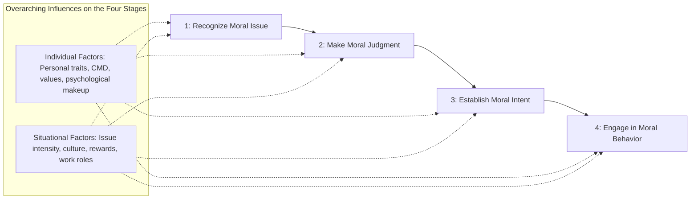
```mermaid
graph LR
    A[1: Recognize Moral Issue] --> B[2: Make Moral Judgment]
    B --> C[3: Establish Moral Intent]
    C --> D[4: Engage in Moral Behavior]
    
    subgraph Influences [Overarching Influences on the Four Stages]
        Ind[Individual Factors: Personal traits, CMD, values, psychological makeup]
        Sit[Situational Factors: Issue intensity, culture, rewards, work roles]
    end
    
    Ind -.-> A & B & C & D
    Sit -.-> A & B & C & D
```

The four sequential stages consist of:

1. **Recognize Moral Issue:** The decision-maker identifies that a specific situation contains a moral dilemma and that their subsequent choice will impact the well-being or rights of others.
2. **Make Moral Judgment:** The actor evaluates the available alternative courses of action and utilizes cognitive reasoning to determine which option is morally right or wrong.
3. **Establish Moral Intent:** The individual weighs the moral judgment against competing organizational or personal goals (such as financial rewards, career advancement, or peer acceptance) and decides whether they intend to act on their ethical conclusion.
4. **Engage in Moral Behavior:** The final step where the actor transforms internal intent into external action, executing the ethical choice despite prevailing obstacles.

### 4. Critical Evaluation of the Role of Individual Differences in Shaping Ethical Decision-Making

Individual differences represent the unique personal traits and internal attributes that a decision-maker brings to an ethical scenario. While critical to early business ethics research, evaluation demonstrates that individual factors are highly conditional and often overridden by intense workplace pressures.

##### Demographic and Biographical Factors

- **Age and Experience:** Empirical research provides mixed results, but general trends indicate that older, more managerially experienced employees tend to exhibit higher levels of moral sensitivity and a greater capacity to resist corporate misconduct. This is attributed to life experience and greater financial or career security.
- **Gender:** Early psychological theories suggested structural differences in moral reasoning between genders. However, contemporary business ethics research demonstrates that within organizational settings, gender is a weak predictor of ethical action, as uniform corporate training, socialization, and role expectations largely homogenize decision-making behavior.
- **Nationality and Culture:** National origin and cultural socialization heavily shape an individual’s foundational values, particularly along dimensions such as individualism versus collectivism. An actor from a highly individualistic culture may prioritize explicit personal rights, whereas an actor from a collectivistic culture may prioritize relational harmony and loyalty. Globalization inside multinational corporations can sometimes temper these cultural variations.

##### Psychological and Cognitive Factors

- **Cognitive Moral Development (CMD):** Formulated by Lawrence Kohlberg, CMD dictates that individuals progress through three distinct levels of moral reasoning, with each level altering how they judge a workplace dilemma:
  1. _Pre-conventional Level:_ The individual defines right and wrong strictly by direct personal consequences, such as avoiding physical punishment or gaining immediate tangible rewards.
  2. _Conventional Level:_ The individual defines morality based on the expectations of immediate peer groups, organizational leaders, and codified societal laws. The vast majority of adult corporate employees operate at this level, making them highly susceptible to organizational peer pressure and corporate compliance mandates.
  3. _Post-conventional Level:_ The individual evaluates choices using autonomous, self-chosen universal ethical principles (such as human dignity, justice, and rights) and is willing to disobey corporate orders or societal laws if they conflict with these principles. Only a small percentage of employees consistently operate at this level.
- **Locus of Control:** This personality trait measures the degree to which individuals believe they possess agency over their life outcomes:
  - _Internal Locus of Control:_ Individuals believe that their choices and actions directly determine their outcomes. These employees are statistically more likely to take personal responsibility for their choices and stand up against unethical corporate directives.
  - _External Locus of Control:_ Individuals believe that their outcomes are determined by external forces, fate, luck, or powerful authority figures. These employees are highly prone to unethical compliance, as they view themselves as passive agents with little personal responsibility.
- **Personal Values and Integrity:** Personal values represent an individual’s enduring beliefs about what is intrinsically worthwhile. Integrity is the operational measure of how consistently an individual’s external workplace behavior aligns with their stated internal values. High personal integrity acts as a primary buffer against organizational corruption, though severe situational pressure can erode this resistance over time.

### 5. Critical Evaluation of the Role of Situational Influences on Ethical Decision-Making

Situational influences are external variables embedded within the decision context or the nature of the issue itself. Critical evaluation demonstrates that situational factors are often the most dominant drivers of workplace behavior, frequently forcing individuals to act against their personal moral beliefs.

##### Issue-Based Factors

- **Moral Intensity:** Developed by Thomas Jones, this framework asserts that the characteristics of the ethical issue itself dictate how aggressively an actor will engage the decision-making model. Moral intensity consists of six dimensions:
  1. _Magnitude of Consequences:_ The total sum of harms or benefits inflicted on victims or beneficiaries (e.g., selling a drug that causes death has a higher magnitude than selling a drug that causes mild nausea).
  2. _Social Consensus:_ The degree of agreement within a group or society that the proposed act is clearly right or wrong (e.g., high social consensus exists against corporate embezzlement, while low social consensus may exist around tax avoidance strategies).
  3. _Probability of Effect:_ The joint probability that the action will take place and that the predicted harm or benefit will actually materialize.
  4. _Temporal Immediacy:_ The length of time between the present moment and the onset of the consequences (immediate layoffs trigger higher moral awareness than long-term environmental degradation delayed by decades).
  5. _Proximity:_ The structural, psychological, social, or physical closeness that the decision-maker feels toward the affected stakeholders.
  6. _Concentration of Effect:_ An inverse function of the number of people affected by a given amount of harm (e.g., defrauding a single vulnerable supplier out of \$100,000 has a higher concentration of effect than overcharging one million retail customers by ten cents each).

> [!info] Moral Framing
> The linguistic terms used to describe a decision can alter its perceived moral intensity. When managers use clinical, technical, or financial jargon (e.g., describing massive worker layoffs as "resource optimization" or chemical pollution as "permissible effluent discharge"), they strip the issue of its moral content. This phenomenon, known as **moral muteness**, causes individuals to bypass ethical evaluation entirely, treating a highly moral issue as a routine technical problem.

##### Context-Based Factors

- **Organizational Culture:** The shared values, beliefs, formal policies, and informal norms that dictate "the way things are done around here." A culture that exclusively rewards short-term financial outputs while ignoring the methods used to achieve them creates structural pressure on employees to cut ethical corners.
- **Authority and Obedience:** Derived from foundational social psychology, research shows that corporate employees possess an intense, institutionalized tendency to obey commands issued by legitimate organizational superiors. If a high-ranking executive issues a directive to alter financial books or ignore safety protocols, submissive organizational compliance often overrides personal conscience.
- **Bureaucracy and Rationalization:** Modern bureaucratic structures fragment complex business decisions into isolated, highly specialized tasks. This extreme division of labor leads to a **dilution of responsibility**, where no single employee feels personally accountable for the final, aggregate ethical outcome. Furthermore, individuals utilize rationalization techniques (such as the denial of personal responsibility, denial of injury, or appealing to higher loyalties like company survival) to neutralize guilt.
- **Work Roles:** Expected behaviors and identities tied to specific professional positions within a firm. When an individual steps into a work role (e.g., a "aggressive corporate restructuring officer" or "loyal legal counsel"), they often suspend their personal identity, adopting a specialized, professional persona that permits behaviors they would find morally unacceptable in their private life.
- **Peer Groups and Social Norms:** Daily employee conduct is heavily governed by the informal norms of immediate working teams. If a peer group widely normalizes minor misconduct (such as exaggerating billable hours or accepting inappropriate supplier gifts), new employees will rapidly conform to these social norms to ensure workplace acceptance and avoid social isolation.

### 6. Points of Leverage for Improving Ethical Decision-Making in Business

Organizations can utilize structural points of leverage derived from the descriptive framework to intervene in the individual and situational paths that drive workplace behavior, shifting outcomes toward ethical decision-making.

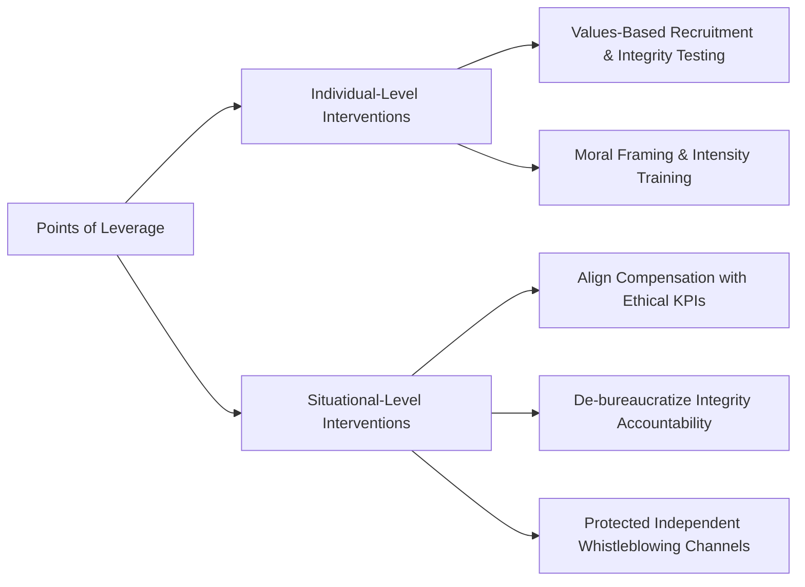
```mermaid
graph LR
    A[Points of Leverage] --> B[Individual-Level Interventions]
    A --> C[Situational-Level Interventions]
    
    B --> B1[Values-Based Recruitment & Integrity Testing]
    B --> B2[Moral Framing & Intensity Training]
    
    C --> C1[Align Compensation with Ethical KPIs]
    C --> C2[De-bureaucratize Integrity Accountability]
    C --> C3[Protected Independent Whistleblowing Channels]
```

- **Leverage Point 1: Integrated Ethical Recruitment and Selection:** Corporations can alter the internal makeup of their workforce by shifting recruitment criteria away from purely technical skills. Integrating standardized integrity testing, values-alignment interviews, and situational judgment metrics allows human resource departments to assess an applicant’s locus of control and cognitive moral development stage before hiring.
- **Leverage Point 2: Training in Explicit Moral Framing:** To combat moral muteness, organizational training programs must move beyond teaching legal compliance checklists. Training must explicitly teach employees to use moral language when analyzing business problems, artificially heightening moral awareness by mapping out the direct stakeholder proximity and magnitude of consequences associated with daily corporate decisions.
- **Leverage Point 3: Operationalizing the Code of Conduct:** Codes of conduct must transform from static, legalistic documents designed to shield the firm from regulatory liability into active, value-focused decision tools. A leveraged code must provide concrete, sector-specific case scenarios and explicit decision trees that guide employees through the moral judgment and intent-formation phases.
- **Leverage Point 4: Structural Realignment of Reward Systems:** This represents the most powerful situational point of leverage. Organizations must aggressively dismantle performance metrics that look exclusively at financial outputs. Performance-evaluation structures and executive bonus matrices must explicitly include ethical Key Performance Indicators (KPIs), ensuring that employees are financially and professionally penalized for achieving revenue targets through ethical shortcuts.
- **Leverage Point 5: Structural Accountability to Counter Bureaucratic Dilution:** To neutralize the fragmentation of responsibility common in large bureaucracies, organizations must implement clear sign-off protocols that assign personal, non-transferable accountability to specific managers for the ethical and environmental impacts of corporate projects across the entire product lifecycle.
- **Leverage Point 6: Independent and Protected Reporting Channels:** To counter the pressures of authority figures and peer groups, organizations must implement robust whistleblowing infrastructure. This includes third-party hosted, anonymous reporting hotlines, independent corporate ombudsmen operating outside traditional executive reporting hierarchies, and strict, legally enforced non-retaliation policies to give employees a safe mechanism to execute their moral intent.

# Chapter 4

### 1. The Nature, Evolution, and Scope of Business Ethics Management

##### Nature of Business Ethics Management

Business ethics management refers to the collective, systematic efforts within an organization to manage ethical issues through formal policies, structural programs, codes of practice, and informal cultural interventions. It moves beyond the passive assumption that ethical behavior is simply an innate personal trait of individual employees. Instead, it recognizes that organizational environments actively shape behavior, meaning that ethical outcomes must be planned, monitored, and organized just like any other strategic corporate objective.

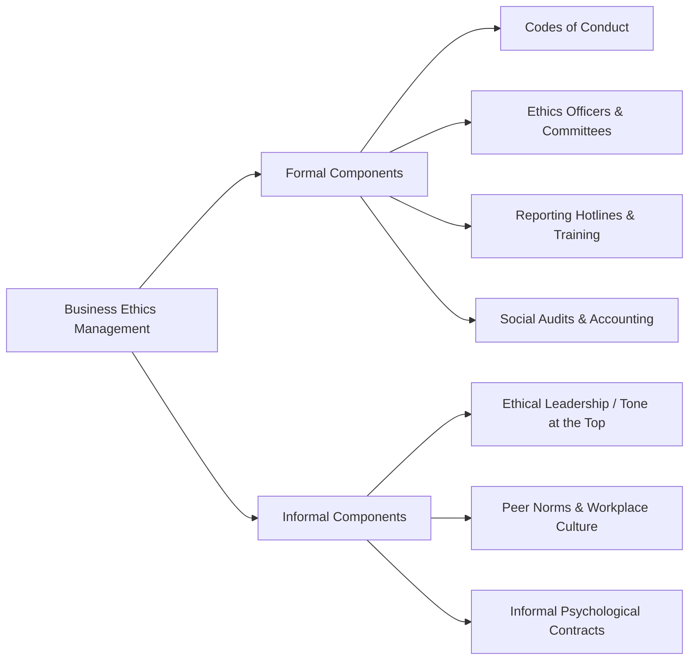
```mermaid
graph LR
    A[Business Ethics Management] --> B[Formal Components]
    A --> C[Informal Components]
    
    B --> B1[Codes of Conduct]
    B --> B2[Ethics Officers & Committees]
    B --> B3[Reporting Hotlines & Training]
    B --> B4[Social Audits & Accounting]
    
    C --> C1[Ethical Leadership / Tone at the Top]
    C --> C2[Peer Norms & Workplace Culture]
    C --> C3[Informal Psychological Contracts]
```

##### Evolution of Business Ethics Management

The management of business ethics has evolved significantly over the past several decades, transitioning through three distinct phases:

1. **Compliance Orientation (1970s–1980s):** Initially triggered by corporate financial scandals and emerging environmental legislation, the early focus was legalistic and reactive. The goal was to prevent illegal actions, minimize regulatory penalties, and shield the corporation from liability. Programs were designed by legal departments and focused on strict rule enforcement.
2. **Values-Based Orientation (1990s–2000s):** Organizations discovered that strict rule enforcement alone could not anticipate every ethical dilemma. The focus shifted toward articulating core organizational values, inspiring positive ethical commitment, and cultivating an internal corporate culture where employees were encouraged to exercise personal moral judgment aligned with corporate ideals.
3. **Corporate Citizenship and Political CSR Era (2010s–Present):** Modern business ethics management has expanded beyond internal operations. In an era of globalization, hyper-connectivity, and weakening nation-state regulations, corporations are viewed as political actors and global citizens. Management now focuses on systemic sustainability, protection of human rights across global supply chains, multi-stakeholder governance, and addressing macro-level societal challenges.

##### Scope of Business Ethics Management

The scope of business ethics management encompasses both formal and informal mechanisms across internal operations and external relationships. It is not limited to an internal human resources function; rather, its scope covers:

- **Internal Workplace Governance:** Designing nondiscriminatory hiring procedures, ensuring physical safety, protecting employee data privacy, and managing whistleblowing infrastructure.
- **Supply Chain Oversight:** Implementing codes of conduct for global suppliers, auditing factory working conditions, and eliminating forced labor.
- **Marketplace Integrity:** Ensuring truth in marketing, protecting consumer data, and eliminating predatory pricing or bribery.
- **Ecological Stewardship:** Managing carbon emissions, transition strategies to a circular economy, and reducing waste externalities.

### 2. Managing the Overall Social Role vs. Individual Employee Behaviour

Historically, corporate ethics programs focused strictly on policing the individual behavior of employees to prevent localized fraud, theft, or misconduct (the "bad apple" paradigm). However, contemporary organizations increasingly focus on managing their overall institutional social role within society due to several structural reasons:

- **The Shift to Corporate Character:** Stakeholders (including consumers, institutional investors, and NGOs) rarely judge a firm based solely on isolated employee actions. They judge the firm as a single institutional actor. Systemic corporate choices—such as a company's tax avoidance strategy, its lobbying activities, or its long-term carbon footprint—define its reputation. Managing these macro-level impacts requires a holistic approach to the firm's societal role rather than simple employee compliance.
- **Corporate Social Performance (CSP) and Materiality:** Under modern environmental, social, and governance (ESG) frameworks, firms are evaluated on their total impact across natural and human ecosystems. A firm might have employees who comply fully with individual internal codes, yet the firm's core business model could still generate negative societal externalities, such as driving displacement in local communities or contributing to systemic resource depletion.
- **The Rise of Political Corporate Social Responsibility (Political CSR):** Due to globalization, multinational corporations frequently operate in weak governance zones where national governments fail to provide basic public goods or enforce labor laws. In these contexts, corporations step into a political role, acting as quasi-governmental administrators of human rights, public health, and education. This shift requires managing the firm's overall socio-political footprint rather than just regulating individual worker conduct.

### 3. Critical Examination of Codes of Ethics

##### Definition and Types of Codes

A code of ethics is a formal, written document that outlines the moral standards, values, and behavioral expectations that guide an organization’s decisions and operations. Codes typically operate at four distinct levels:

|**Code Level**|**Primary Purpose / Scope**|
|---|---|
|**Corporate Codes**|Developed by an individual firm to define its specific values, internal rules, and responsibilities toward its stakeholders.|
|**Professional Codes**|Established by professional bodies (e.g., ACCA for accountants, IEEE for engineers) to govern the conduct of individual practitioners, overriding specific corporate mandates if they conflict.|
|**Sector Codes**|Industry-wide agreements (e.g., the Equator Principles in banking) designed to establish common ethical baselines and prevent competitive disadvantages.|
|**International / Global Codes**|Broad, transnational frameworks (e.g., the United Nations Global Compact) providing universal human rights, labor, and environmental standards for global commerce.|

##### Effectiveness and Advantages of Codes

When implemented correctly, codes of ethics provide clear organizational benefits:

- **Clarifying Organizational Values:** They offer a clear blueprint of what the company stands for, translating abstract philosophical ideals into clear behavioral guidelines for employees and newcomers.
- **Legal and Regulatory Risk Mitigation:** Under many legal frameworks (such as the US Federal Sentencing Guidelines), having a formal, operational code of ethics reduces corporate liability and financial fines if an individual employee commits a legal infraction.
- **Stakeholder Signaling:** Codes act as a transparent message to external stakeholders—including investors, consumers, and suppliers—demonstrating the organization’s commitment to ethical practices and corporate citizenship.

##### Critiques, Limitations, and Causes of Failure

Despite their popularity, codes of ethics are frequently critiqued for failing to drive actual ethical behavior:

> [!critique] The Window-Dressing Critique (Greenwashing)
> Many corporate codes are written primarily by public relations or legal departments to serve as administrative shields. They are used to project an image of responsibility to the public while the company's underlying reward systems continue to incentivize unethical financial performance.

- **Suppression of Moral Autonomy:** From a Kantian perspective, highly rigid, legalistic compliance codes can reduce an employee's moral reasoning. Instead of evaluating _why_ an action is right or wrong, employees focus on checking boxes or finding loopholes in the text, suspending their personal conscience.
- **The Enforcement Gap:** A code is ineffective if it lacks clear operational enforcement. If senior executives violate the code without consequences while lower-level staff are penalized, the document loses its legitimacy and fosters organizational cynicism.
- **Vagueness and Ambiguity:** Many codes rely on generic phrases such as "we act with integrity" or "we respect our communities" without providing specific guidance on how to resolve concrete dilemmas, such as choosing between short-term profitability and long-term environmental protection.

### 4. Critical Examination of Stakeholder Relationships and Partnerships

##### Evolution of Stakeholder Interaction

The theory and practice of how corporations interact with their stakeholders has undergone a structural transformation. Historically, relations between corporations and external stakeholders (such as environmental NGOs or civil society organizations) were **adversarial**, characterized by public boycotts, litigation, and media battles. Over time, interactions transitioned through a **neutral** stage focused on corporate transparency and arms-length monitoring. Today, modern practice prioritizes **collaborative stakeholder partnerships** or Multi-Stakeholder Initiatives (MSIs).

```mermaid
graph LR
    A[Adversarial Stage] -->|Litigation, Boycotts, Protests| B[Neutral Monitoring]
    B -->|Transparency, Disclosures, Compliance| C[Collaborative Partnerships]
    C -->|Multi-Stakeholder Initiatives, Co-regulation| D[Shared Value Governance]
```

##### Types and Practice of Contemporary Partnerships

Modern stakeholder partnerships involve complex alliances between corporations, civil society groups, and sometimes state bodies to tackle issues that no single entity can resolve alone. Examples include the Forest Stewardship Council (FSC), the Marine Stewardship Council (MSC), and the Fair Labor Association (FLA). These partnerships allow companies to co-create sustainable standards, access local community knowledge, and secure a "social license to operate."

##### Critical Challenges and Power Asymmetries in Partnerships

While partnerships are celebrated in corporate sustainability literature, a critical evaluation reveals several structural issues:

- **Power Imbalances:** Corporations often possess massive financial, logistical, and legal resources that dwarf those of local community groups or NGOs. This asymmetry can allow corporations to dominate the partnership agenda, steering outcomes away from systemic structural changes and toward minor operational adjustments.
- **Co-optation of Civil Society:** When NGOs enter formal financial and strategic partnerships with major corporations, they risk losing their critical independence. They may become financially dependent on corporate funding, which can compromise their willingness to publicly critique corporate misconduct.
- **The Accountability Deficit:** Multi-stakeholder partnerships create private governance structures that operate outside democratic frameworks. Unlike national regulations enacted by elected governments, these partnerships are accountable primarily to their internal members, raising questions about transparency and public legitimacy.

### 5. The Role of Social Accounting, Auditing, and Reporting Tools

##### Core Definitions of SAAR Tools

To assess and manage ethical performance, organizations rely on the tripartite framework of Social Accounting, Auditing, and Reporting (SAAR):

- **Social Accounting:** The formal process of identifying, measuring, and tracking an organization’s social, ethical, and environmental impacts over time. It expands standard financial accounting to include non-financial data, such as carbon emissions, employee diversity metrics, and supply chain working hours.
- **Social Auditing:** The systematic, independent evaluation and verification of the social accounting data collected by the organization. Audits are performed by external third parties (e.g., specialized auditing firms or independent NGOs) to ensure accuracy and prevent data manipulation.
- **Social Reporting:** The public disclosure of audited social and environmental performance data, usually compiled into an annual Corporate Social Responsibility (CSR), ESG, or Sustainability Report.

##### The Social Accounting Cycle

The implementation of SAAR operates as a continuous, iterative cycle designed to embed accountability into corporate operations.

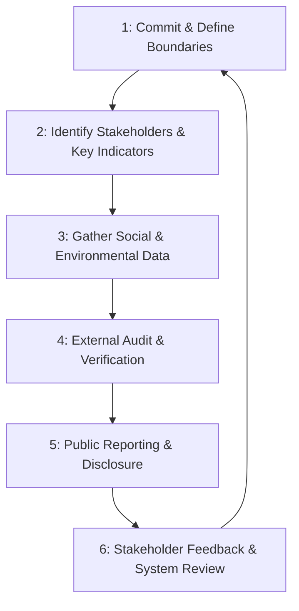
```mermaid
graph TD
    Step1[1: Commit & Define Boundaries] --> Step2[2: Identify Stakeholders & Key Indicators]
    Step2 --> Step3[3: Gather Social & Environmental Data]
    Step3 --> Step4[4: External Audit & Verification]
    Step4 --> Step5[5: Public Reporting & Disclosure]
    Step5 --> Step6[6: Stakeholder Feedback & System Review]
    Step6 --> Step1
```

##### Critical Evaluation of Reporting Standards (e.g., GRI)

The contemporary gold standard for social reporting is the **Global Reporting Initiative (GRI)**, alongside the **Sustainability Accounting Standards Board (SASB)** and **Integrated Reporting (IR)** frameworks. These standards provide standardized indicators to make corporate disclosures comparable across industries. However, critical limitations persist:

- **Managerial Discretion and Cherry-Picking:** Unlike financial accounting standards (e.g., IFRS), which carry strict statutory penalties for misrepresentation, social reporting remains largely voluntary or loosely regulated in many jurisdictions. This allows firms to selectively disclose positive initiatives while downplaying or omitting systemic negative impacts.
- **Focus on Outputs Over Outcomes:** Social reports frequently focus on easily quantifiable operational metrics (such as the number of hours employees spent in ethics training or the dollar amount given to charity) rather than measuring real-world outcomes (such as whether systemic workplace discrimination was eliminated or local biodiversity actually restored).

### 6. Organizing for the Management of Business Ethics

Managing business ethics effectively requires establishing clear organizational roles, governance structures, and formal lines of accountability. Organizations structure these responsibilities through several primary mechanisms:

##### Ethics Officers and Compliance Officers

Organizations appoint dedicated executives to manage the day-to-day operations of the ethics infrastructure. The responsibilities of an Ethics Officer include administering the code of conduct, managing anonymous whistleblowing hotlines, coordinating employee training programs, and conducting internal compliance investigations. A key structural challenge is where this role reports: if the officer reports strictly to the corporate legal department, the focus tends to remain narrow and legalistic; if they report directly to the Chief Executive Officer (CEO) or the Board of Directors, the role gains greater strategic authority.

##### Ethics Committees

An ethics committee is a cross-functional panel of senior executives drawn from multiple departments, typically including Human Resources, Legal, Risk Management, Internal Audit, and Operations. This committee meets regularly to review serious allegations of internal misconduct, interpret policy guidelines in ambiguous situations, evaluate code effectiveness, and oversee broader corporate governance strategies.

##### External Advisory Boards

Some progressive corporations establish independent panels of external experts, including academics, human rights advocates, sustainability specialists, and community leaders. These boards do not possess formal fiduciary voting power, but they serve as an external sounding board, challenging executive leadership assumptions and providing objective guidance on macro-level ethical dilemmas.

##### Centralized vs. Decentralized Ethics Structures

Organizations must decide how to distribute ethical accountability across their operations:

|**Structural Approach**|**Operational Method**|**Primary Advantages**|**Primary Disadvantages**|
|---|---|---|---|
|**Centralized Structure**|Ethics management is concentrated within a dedicated corporate headquarters department that dictates uniform policies worldwide.|Ensures high policy consistency, clear corporate control, and unambiguous reporting lines.|Can lead to rigid bureaucracy that fails to understand local cultural nuances or sector-specific realities.|
|**Decentralized Structure**|Ethical accountability is embedded directly into regional operations and business units, allowing local managers to tailor ethics programs.|Provides high operational flexibility and rapid response times to unique, localized stakeholder issues.|Risks inconsistent standards across global locations, potentially watering down core corporate commitments.|

# Chapter 5

### 1. The Nature of Shareholder Relations to the Corporation

The relationship between shareholders and the modern corporation is defined by legal, financial, and organizational frameworks. Legally, shareholders do not own the corporation’s physical or intellectual assets; instead, they own **shares of stock**, which represent a fractional equity stake in the corporate entity. The corporation itself is recognized as a distinct legal person (_legal personality_) capable of owning property, entering contracts, and incurring debt independently of its investors.
The structural foundation of this relationship is explained by **Agency Theory**, first popularized by economists Adolf Berle and Gardiner Means, and later formalised by Michael Jensen and William Meckling. In modern, publicly traded firms, there is a fundamental **separation of ownership and control**:

- **The Principals (Shareholders):** They supply the financial capital but are too numerous, dispersed, and operationally distant to manage the day-to-day business affairs. They act as the residual claimants, bearing the financial risk of the business.
- **The Agents (Managers/Directors):** They are hired by shareholders to deploy capital, design strategy, and control daily operations.
  This separation creates a natural **agency problem** driven by two core dynamics:

1. **Information Asymmetry:** Managers possess deep, real-time knowledge of the company's operational realities, financial health, and strategic vulnerabilities, whereas shareholders must rely primarily on periodic, backward-looking financial disclosures.
2. **Divergent Goals:** While shareholders generally seek the long-term maximization of their investments (share price appreciation and dividends), managers may prioritize personal wealth, prestige, job security, or corporate expansion (_empire-building_), even if these actions dilute shareholder value.
   Consequently, the company-shareholder relationship requires continuous management through monitoring systems, legal guardrails, and executive incentive structures designed to minimize **agency costs**—the expenses incurred by principals to sustain governance oversight and align manager behaviors with owner interests.

### 2. Rights and Duties of Shareholders in Corporate Governance

Corporate governance structures define the legal boundaries of the company-shareholder relationship by balancing investor rights against their lack of direct operational control.

#### Rights of Shareholders

- **Financial Rights:** Shareholders are entitled to a share of corporate profits distributed as dividends. In the event of liquidation, they hold a residual claim on remaining assets after all creditors, bondholders, and employees have been fully compensated.
- **Governance and Voting Rights:** Shareholders exercise democratic control over key structural decisions. They have the right to vote at Annual General Meetings (AGMs) to elect or remove board directors, approve external auditors, and authorize major corporate transitions such as mergers, acquisitions, or changes to the corporate charter.
- **Information Rights:** Investors possess a legal right to inspect corporate books under specific parameters and receive verified, audited financial statements (such as annual reports) to evaluate managerial performance.
- **Litigation Rights (Derivative Suits):** If corporate directors engage in systemic fraud, self-dealing, or gross negligence that damages the company, shareholders have the right to initiate derivative lawsuits on behalf of the corporation against those directors.

#### Duties of Shareholders

Traditionally, the dominant legal characteristic of equity investment is **limited liability**. Shareholders are not personally responsible for the debts, legal infractions, or tort liabilities of the corporation; their financial risk is strictly capped at the capital they invested to buy their shares.
Historically, this meant that shareholders owed zero fiduciary duties to the corporation, its workers, or society. However, modern corporate governance recognizes emerging ethical and regulatory duties:

- **Duties of Controlling Shareholders:** In companies with concentrated ownership, dominant or majority shareholders owe a legal and ethical duty of fairness to _minority shareholders_, meaning they cannot use their voting power to extract private benefits that disadvantage smaller investors.
- **Stewardship Duties of Institutional Investors:** Large asset managers (such as pension funds and insurance firms) hold vast portions of global equity. Under modern regulatory frameworks (like national Stewardship Codes), these institutional investors have a fiduciary duty to actively monitor investee companies, cast informed proxy votes, and engage boards on long-term systemic risks, rather than acting as passive, short-term stock traders.

### 3. International Differences in Corporate Governance Models

Corporate governance frameworks vary globally, reflecting regional financial histories, legal traditions, and cultural views on the ultimate purpose of a corporation.
\[Image comparing unitary and two-tier board structures]

#### The Anglo-American Model (Market-Based / Outsider System)

Dominant in the United States, United Kingdom, Canada, and Australia, this model prioritizes **Shareholder Primacy**—the philosophical belief that the primary purpose of the corporation is to maximize financial returns for equity investors.

- **Ownership Structure:** Highly dispersed among millions of retail and institutional investors.
- **Board Structure:** A **unitary (one-tier) board of directors** consisting of both executive directors (internal managers) and non-executive/independent directors who oversee management.
- **Market Characteristics:** Strong reliance on liquid capital markets. If management underperforms, shareholders simply sell their stock (_the Wall Street Walk_). Governance is heavily policed by an active **market for corporate control**, where underperforming firms face the threat of hostile takeovers by corporate raiders.

#### The Continental European Model (Network-Based / Insider System)

Prevalent in Germany, France, Scandinavia, and parts of Southern Europe, this model is rooted in **Stakeholder Capitalism** (often called the Rhineland model), which views the firm as a social institution that must balance the interests of shareholders, employees, suppliers, and local communities.

- **Ownership Structure:** Highly concentrated, with large blocks of shares held by commercial banks, founding families, or holding companies.
- **Board Structure:** A formal **two-tier board system**:
  1. _Management Board (Vorstand):_ Composed entirely of executives managing daily operations.
  2. _Supervisory Board (Aufsichtsrat):_ Composed of non-executives who monitor the management board. Under formal policies of **co-determination** (_Mitbestimmung_), up to half of the supervisory board seats are legally allocated to employee representatives and labor union nominees.
- **Market Characteristics:** Illiquid capital markets with rare hostile takeovers. Conflicts are resolved through long-term institutional dialogue and consensus rather than equity market pressures.

#### The Asian Model (Family/State-Led or Alliance-Based)

Predominant in East Asia, this model blends traditional collective cultural values with state-directed economic strategies.

- **Japan (The Keiretsu Model):** Characterized by complex, interlocking networks of cross-shareholding among corporate alliances, typically clustered around a core commercial bank (e.g., Mitsubishi or Sumitomo). Boards are populated by internal executives who climb company ranks over a lifetime of employment, prioritizing group stability, market share, and relational loyalty over immediate return-on-equity.
- **South Korea (The Chaebol Model):** Large, diversified, multi-industry conglomerates (e.g., Samsung, Hyundai) controlled by dominant founding families despite holding minority equity stakes. Control is maintained via circular shareholding chains across subsidiaries, leading to high strategic agility but frequent ethical challenges regarding dynastic succession and the oppression of minority shareholders.
- **State-Owned Enterprises (SOEs - e.g., China):** The national government or state-owned asset vehicles remain the controlling shareholder. The corporate governance mandate balances commercial profitability with national strategic goals, employment stability, and political alignment.

### 4. Ethical Problems Arising from the Company–Shareholder Relationship

The separation of ownership from control, combined with market pressures for financial performance, creates structural friction points that lead to recurring ethical problems.

#### Executive Compensation and Pay-Performance Disconnect

The structural use of stock options and equity-based bonuses to align managerial interests with shareholders has contributed to an widening executive pay gap. CEOs are frequently compensated with tens of millions of dollars while real worker wages stagnate.
Ethically, many compensation structures suffer from a **pay-for-performance disconnect**, where executives receive massive golden parachutes or bonuses even when their strategic choices destroy long-term corporate value or result in mass layoffs. This incentivizes managers to focus on short-term accounting metrics rather than sustainable organizational health.

#### Insider Trading

Insider trading occurs when individuals with a fiduciary duty to a corporation buy or sell securities based on material, non-public information. This practices violates core ethical principles:

- _Fairness:_ It creates an unlevel playing field where corporate insiders profit at the direct expense of uninformed market participants.
- _Rights:_ It violates the property rights of the corporation by misappropriating confidential data for personal enrichment.
- _Market Integrity:_ It undermines public trust in the allocative efficiency and honesty of financial markets.

#### Financial Mismanagement and Accounting Frauds

To maintain high stock prices and protect personal equity bonuses, executives face structural pressures to engage in earnings management or financial statement manipulation. Historic scandals (e.g., Enron, WorldCom, Satyam, Wirecard) demonstrate how managers can use off-balance-sheet vehicles, artificial revenue recognition, and aggressive accounting loopholes to hide structural losses.
These actions deceive shareholders, erase billions in retirement savings, and cause systemic damage to market stability.

#### Short-Termism (Quarterly Capitalism)

Perhaps the most widespread systemic ethical issue is **short-termism**—the intense focus by corporate executives on meeting quarterly earnings guidance issued to Wall Street analysts. To prevent immediate stock sell-offs, managers often postpone vital long-term research and development (R\&D), defer infrastructure safety upgrades, cut employee training budgets, and externalize environmental costs. This satisfies short-term investor demands while undercutting the long-term viability of the firm and its stakeholders.

### 5. Ethical Implications of Globalization for Company–Shareholder Relations

Globalization has transformed financial markets, decoupling corporations from national boundaries and creating unique ethical challenges in how companies interact with global shareholders.

#### Regulatory Arbitrage and Capital Flight

In a globalized economy, capital is highly mobile, while physical labor and local communities are geographically fixed. Corporations seeking to maximize shareholder returns often engage in **regulatory arbitrage**—shifting production, labor contracts, or supply chains to developing countries with weak environmental protections, low wages, and absent human rights enforcements.
This creates a moral dilemma: managers justify these strategies under the banner of shareholder primacy (lowering costs to boost returns), yet they make shareholders complicit in global exploitation, child labor, and environmental degradation.

#### Dispersed Global Ownership and the Proximity Gap

As global equity markets integrate, a shareholder in New York or London can effortlessly buy shares in a mining corporation operating in Peru or an agricultural firm in Indonesia. This geographical and psychological **proximity gap** isolates global investors from the real-world consequences of their capital.
Dispersed shareholders often evaluate their global portfolios through automated financial metrics, remaining blind to the localized pollution, indigenous displacement, or worker exploitation generated by the companies they invest in.

#### Sovereign Wealth Funds (SWFs) and Geopolitical Corporate Governance

Globalization has accelerated the rise of Sovereign Wealth Funds—state-owned investment funds managed by governments (e.g., Norway’s GPFG, China Investment Corporation, Saudi Arabia’s PIF) that acquire equity stakes in foreign public corporations.
This introduces complex ethical dynamics into corporate governance. If a foreign state fund gains significant voting power in a Western technology, defense, or infrastructure corporation, concerns arise regarding whether that shareholder will prioritize standard financial metrics or use its corporate influence to advance geopolitical agendas, potentially compromising national security or human rights values.

### 6. Shareholder Democracy, Activism, and Responsible Investment

Stakeholders and reformist investors use various market mechanisms to steer corporate behavior toward ethical outcomes.

#### Shareholder Democracy

Shareholder democracy is the principle that equity owners should have a meaningful voice in corporate governance, mirroring democratic political processes. This is exercised via voting on resolutions and electing directors at AGMs.

- **Critical Evaluation:** In practice, true shareholder democracy is often an illusion. Retail investors rarely participate, choosing to delegate votes or ignore proxies. The voting landscape is dominated by a few massive institutional asset managers (e.g., BlackRock, Vanguard, State Street) and proxy advisory firms (e.g., ISS, Glass Lewis), concentrating immense corporate voting power in few hands. Furthermore, corporate managers often design proxy rules to block or dilute grassroots shareholder resolutions.

#### Shareholder Activism

Shareholder activism occurs when investors intentionally buy equity stakes in a corporation to use their formal governance rights to pressure management into changing policies. This includes both financial activists (seeking operational restructuring or asset sales) and **ethical/social activists** (NGOs, religious groups, or green funds pushing for social or environmental reforms).

- **Critical Evaluation:** Social activism has successfully forced major multinational corporations to disclose carbon footprint data, audit supply chains for forced labor, and diversify board rooms. However, its efficacy is constrained. Activist resolutions are frequently _non-binding_ (advisory), meaning management can legally ignore them even if they pass. Additionally, aggressive hedge fund activists often launch counter-campaigns, pressuring firms to abandon sustainability goals in favor of short-term share buybacks or cost-cutting measures.

#### Responsible Investment (SRI and ESG)

Sustainable, Responsible, and Impact (SRI) investment involves explicitly integrating Environmental, Social, and Governance (ESG) criteria into the financial analysis of stocks. It has evolved from basic **negative screening** (refusing to invest in "sin stocks" like tobacco, firearms, and gambling) to **positive screening** (actively investing in top ESG performers) and **themed investing** (funding clean technology or renewable energy).

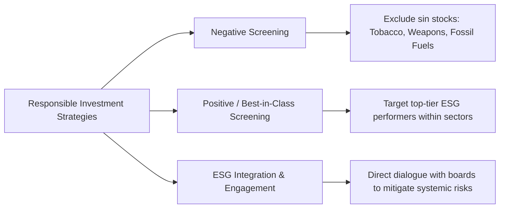
```mermaid
graph LR
    A[Responsible Investment Strategies] --> B[Negative Screening]
    A --> C[Positive / Best-in-Class Screening]
    A --> D[ESG Integration & Engagement]
    
    B --> B1[Exclude sin stocks: Tobacco, Weapons, Fossil Fuels]
    C --> C1[Target top-tier ESG performers within sectors]
    D --> D1[Direct dialogue with boards to mitigate systemic risks]
```

- **Critical Evaluation:** While ESG investing directs capital toward progressive initiatives, it faces structural critiques:
  - _Greenwashing:_ Financial institutions frequently relabel traditional funds as "ESG-aligned" to charge higher management fees without changing their underlying investment allocations.
  - _Inconsistent Metrics:_ ESG rating providers (e.g., MSCI, Sustainalytics) use subjective, proprietary methodologies that often conflict, allowing a company to score highly on one index while being flagged for labor abuses on another.
  - _Risk Mitigation vs. Ethics:_ Most corporate ESG integration is designed to evaluate how environmental or social issues _pose a financial risk to the company's profits_, rather than assessing the company's real ethical impact on the planet or society.

### 7. Sustainability Indices and Alternative Forms of Ownership

To drive deep structural transitions toward global sustainability, organizations rely on specialized market indices or move away from traditional investor-owned corporate designs entirely.

#### Sustainability Indices

Sustainability indices—such as the **Dow Jones Sustainability Index (DJSI)** or the **FTSE4Good Index Series**—track the financial performance of public companies that meet strict sustainability criteria. Inclusion in these indices provides companies with a status symbol that attracts capital from ESG-mandated institutional funds.

- **Critical Evaluation:** While these indices incentivize companies to track and report non-financial data, they suffer from a **"best-in-class" paradox**. Instead of excluding inherently unsustainable industries (such as oil and gas or fast fashion), indices often include the highest-scoring companies _within_ those sectors. Consequently, an oil major can win inclusion by reducing its operational drilling emissions, even though its core product remains a primary driver of global climate change. Furthermore, validation heavily relies on self-reported corporate surveys, which can reward sophisticated corporate public relations over substantive field performance.

#### Alternative Forms of Ownership

Because the mandate of public, investor-owned corporations is structurally bound to capital maximization, alternative ownership models offer frameworks that naturally integrate ethical and sustainable values into their core operational designs.

|**Ownership Model**|**Structural Mechanism**|**Advantages for Sustainability**|**Primary Governance Challenges**|
|---|---|---|---|
|**Cooperatives & Mutuals**|Owned and democratically controlled by their workers, consumers, or members (e.g., credit unions, agricultural co-ops).|Prioritizes long-term member value, fair employment, and local community stability over capital extraction.|Slower capital accumulation; potential strategic inertia due to consensus-based democratic voting.|
|**Family-Owned Businesses**|Controlled by a founding family across multiple generations.|Operates with a multi-decade stewardship horizon, shielding the firm from quarterly stock market pressures.|Vulnerable to family nepotism, internal succession disputes, and lack of external governance oversight.|
|**Social Enterprises & B-Corporations**|Legally structured entities (e.g., Benefit Corporations) with a statutory mandate to pursue a triple bottom line.|Directors are legally protected and required to balance social purpose against financial profit.|Managing operational trade-offs when mission goals conflict with financial survival during market downturns.|

# Chapter 6

### 1. The Specific Role of Employees as a Stakeholder

In stakeholder theory, employees occupy a unique and pivotal position. Unlike external stakeholders—such as consumers, suppliers, or local communities—employees are **internal stakeholders** who form the operational core of the firm. They do not merely interact with the corporation; they inhabit it, dedicating a substantial portion of their lives, energy, and identity to its survival and success.

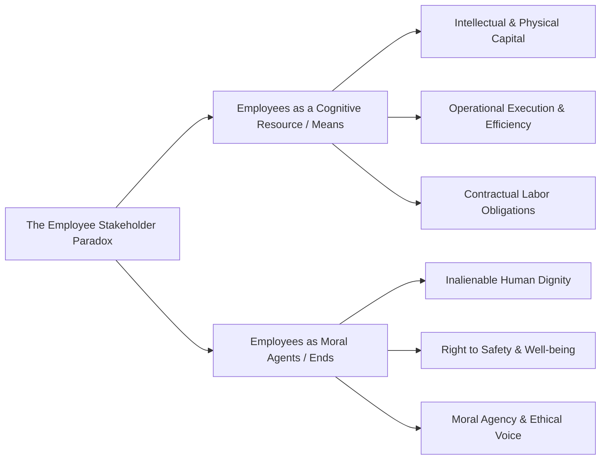
```mermaid
graph LR
    A[The Employee Stakeholder Paradox] --> B[Employees as a Cognitive Resource / Means]
    A --> C[Employees as Moral Agents / Ends]
    
    B --> B1[Intellectual & Physical Capital]
    B --> B2[Operational Execution & Efficiency]
    B --> B3[Contractual Labor Obligations]
    
    C --> C1[Inalienable Human Dignity]
    C --> C2[Right to Safety & Well-being]
    C --> C3[Moral Agency & Ethical Voice]
```

The specific role of employees can be understood through a dual lens:

- **Employees as a Resource (The Tool View):** Economically and operationally, employees provide the human capital, intellectual property, operational execution, and frontline customer management required to generate corporate value. Without their cooperation, the firm's physical and financial capital remains inert.
- **Employees as Human Beings (The Kantian View):** Ethically, employees are not merely "human resources" or production inputs to be optimized or discarded for shareholder utility. Under Immanuel Kant’s categorical imperative, employees are **ends in themselves**, possessing inalienable human dignity, moral agency, and fundamental rights that corporations are morally bound to respect.
  This dual identity creates a fundamental structural tension within management: balancing the firm's objective to maximize labor productivity and cost efficiency against the ethical obligation to respect the psychological, physical, and economic well-being of the workforce.

### 2. Main Employee Rights and Duties

The ethical and legal framework governing the workplace is structured as a reciprocal relationship of rights and duties. Rights protect the vulnerability of the employee against corporate power asymmetries, while duties ensure the employee acts responsibly to preserve the firm’s viable operations.

#### Main Employee Rights

- **Right to Freedom from Discrimination:** The right to equal opportunities regarding hiring, promotion, compensation, and termination, completely insulated from arbitrary biases based on race, gender, age, religion, sexual orientation, or disability.
- **Right to a Healthy and Safe Working Environment:** Moving beyond basic physical safety (e.g., protective equipment, structural integrity), modern ethics expands this right to include **psychological safety**—freedom from workplace bullying, sexual harassment, toxic corporate cultures, and chronic stress induced by unreasonable work intensification.
- **Right to Fair Compensation (The Living Wage):** The right to receive a wage that goes beyond statutory minimums to provide a dignified standard of living, enabling the worker to secure adequate housing, nutrition, healthcare, and education for their family within their specific socioeconomic context.
- **Right to Workplace Privacy:** Protection against invasive corporate surveillance, such as continuous electronic keystroke tracking, indiscriminate email monitoring, algorithmic webcam policing, and arbitrary drug testing, unless a direct, unambiguous link to operational safety can be demonstrated.
- **Right to Due Process and Fair Treatment:** The right to transparent grievance mechanisms, objective performance evaluations, and protection against arbitrary or retaliatory dismissal.
- **Right to Freedom of Association:** The right to form or join trade unions and engage in collective bargaining to balance the structural power advantage held by corporate employers.
- **Right to Freedom of Speech and Conscience (Whistleblowing):** The right to speak out against systemic corporate illegalities, environmental infractions, or public safety violations without facing career retaliation, blacklisting, or legal harassment.

#### Main Employee Duties

- **Duty to Execute the Employment Contract:** The basic obligation to perform assigned tasks with reasonable competence, care, diligence, and efficiency during contracted working hours.
- **Duty of Loyalty and Obedience:** The duty to protect the legitimate commercial interests of the employer and follow lawful, ethical managerial directives. This duty is **conditional**; an employee is never morally obligated to obey directives that require breaking the law, falsifying accounts, or deceiving stakeholders.
- **Duty to Maintain Confidentiality:** The obligation to safeguard proprietary corporate data, intellectual property, client profiles, and trade secrets from unauthorized external exposure, both during and after the term of employment.
- **Duty to Avoid Conflicts of Interest:** The responsibility to refrain from activities where personal financial interests or external relationships compromise objective professional judgment (e.g., accepting inappropriate supplier gifts, self-dealing, or working for direct market competitors simultaneously).

### 3. Globalization and Managing Employees Across Diverse Contexts

Globalization has disconnected corporations from their traditional geographic borders, allowing multinational corporations (MNCs) to manage global workforces spread across completely different national, legislative, and cultural environments. This geographic dispersion raises significant ethical dilemmas.

#### Regulatory Arbitrage and the "Race to the Bottom"

MNCs frequently exploit variations in global labor regulations by shifting low-skilled manufacturing and supply chain operations to developing countries where worker protections are weak or non-existent. This leads to **regulatory arbitrage**, where firms maximize profit by operating in jurisdictions that allow low wages, hazardous factory conditions, long working hours, and restricted union rights.
The ethical challenge lies in determining whether an MNC is exploiting systemic poverty or acting as an engine of economic development, especially when conditions in their factories, though substandard by Western metrics, outperform local agrarian alternatives.

#### The Dialectic: Ethical Imperialism vs. Cultural Relativism

When managing employees globally, executives face a choice between two extreme philosophical positions:

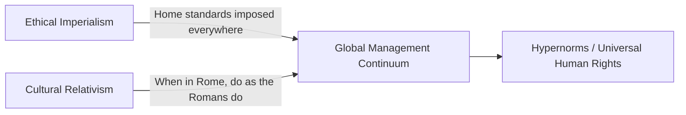
```mermaid
graph LR
    A[Ethical Imperialism] -->|Home standards imposed everywhere| B[Global Management Continuum]
    C[Cultural Relativism] -->|When in Rome, do as the Romans do| B
    B --> D[Hypernorms / Universal Human Rights]
```

- **Ethical Imperialism (Absolutism):** The conviction that home-country ethical standards and regulations must be applied uniformly across all global operations. For instance, enforcing strict Western work-hour limits or anti-nepotism policies in a collectivistic society can disrupt deeply embedded local kinship economies and mutual support systems, inadvertently causing social alienation.
- **Cultural Relativism:** The stance that "when in Rome, do as the Romans do," asserting that no culture's ethics are superior to another. This position can be used by managers to rationalize complicity in severe moral wrongs—such as paying bribes, ignoring child labor, or enforcing gender segregation in countries where such practices are structurally institutionalized.
  To resolve this impasse, contemporary business ethics relies on Thomas Donaldson’s framework of **Hypernorms**—universal, non-negotiable human rights (such as the right to life, physical safety, and freedom from coercion) that must be upheld globally, while allowing a "moral space" for local cultural traditions regarding non-essential workplace customs.

#### Exploitation inside Tiered Global Supply Chains

Many ethical infractions do not occur within an MNC's direct corporate entities but inside their outsourced, multi-tiered networks of independent global suppliers. Under pressure from MNCs to hit low price points and tight delivery deadlines, independent suppliers in developing countries frequently resort to forced labor, falsified safety records, and sweatshop conditions.
MNCs historically deflected moral responsibility by citing independent contractual boundaries. Today, public scrutiny holds the lead brand morally accountable for the working conditions across their entire upstream value chain.

### 4. Corporate Citizenship and Managing Human Rights

The concept of **Extended Corporate Citizenship** recognizes that in a globalized world, corporations are not merely private business entities; they act as powerful social and political institutions. When nation-states lack the regulatory capacity or political will to protect their citizens—particularly in failed states, conflict zones, or authoritarian regimes—the responsibility to safeguard human rights often falls onto corporations.

#### The UN Guiding Principles Framework

The universally accepted operational baseline for managing human rights in business is the United Nations "Protect, Respect, and Remedy" framework (The Ruggie Principles):

1. **The State Duty to Protect:** Governments must use policy, legislation, and adjudication to shield individuals from human rights abuses committed by business enterprises.
2. **The Corporate Responsibility to Respect:** Corporations must act with **due diligence** to avoid infringing upon the rights of others and address adverse human rights impacts with which they are involved.
3. **Access to Remedy:** Both states and corporations must provide accessible, effective grievance mechanisms (both judicial and non-judicial) to ensure victims of corporate human rights abuses can seek real redress.

#### Operationalizing Human Rights Management

Good corporate citizenship requires firms to systematically embed human rights protections into their internal human resource management systems:

- **Human Rights Due Diligence (HRDD):** Proactively mapping out, assessing, and mitigating the real and potential human rights impacts of business operations before entering a new market or launching a new product line.
- **Supply Chain Interventions:** Mandating strict supplier codes of conduct, backed by unannounced, independent third-party factory audits, and providing financial and technical support to suppliers to help them improve their working environments.
- **Security Force Alignment:** In extractive industries (e.g., oil, gas, mining) operating in high-conflict areas, corporate citizens must ensure that private or public security forces hired to protect corporate assets do not engage in human rights abuses against local communities or striking workers, aligning operations with the _Voluntary Principles on Security and Human Rights_.

### 5. Implications for Sustainability of Firms’ Relationships with Employees

Under the Triple Bottom Line framework (Economic, Social, Environmental), sustainability cannot be achieved through environmental metrics alone; it requires the long-term preservation and regeneration of the human and social capital embedded within the workforce.

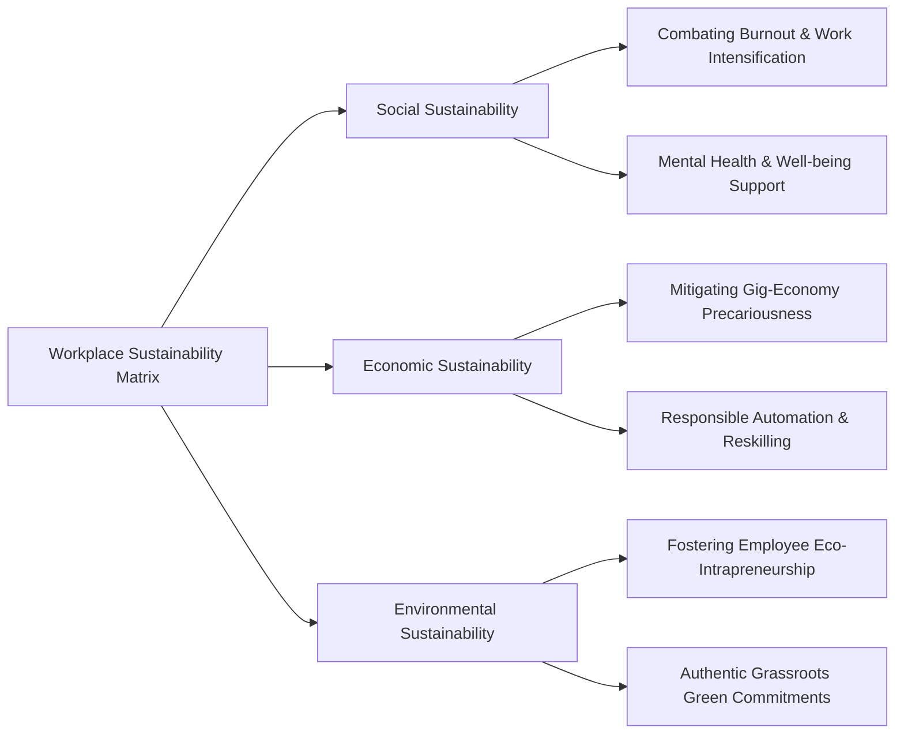
```mermaid
graph LR
    A[Workplace Sustainability Matrix] --> B[Social Sustainability]
    A --> C[Economic Sustainability]
    A --> D[Environmental Sustainability]
    
    B --> B1[Combating Burnout & Work Intensification]
    B --> B2[Mental Health & Well-being Support]
    
    C --> C1[Mitigating Gig-Economy Precariousness]
    C --> C2[Responsible Automation & Reskilling]
    
    D --> D1[Fostering Employee Eco-Intrapreneurship]
    D --> D2[Authentic Grassroots Green Commitments]
```

#### Social Sustainability: Human Resource Regenerativity

Traditional corporate frameworks often treat human labor as an exhaustible asset, driving performance through extreme work intensification, permanent connectivity, and hyper-competitive performance metrics. This approach leads to burnout, chronic mental health crises, and the erosion of social networks outside work.
**Social sustainability** requires firms to transition toward regenerative HR practices: safeguarding long-term worker health, supporting work-life balance, investing in lifelong training, and maintaining a diverse workplace that supports the human capital of the surrounding society over generations.

#### Economic Sustainability: The Changing Landscape of Employment

The rise of the gig economy, algorithmic management, automated zero-hour contracts, and widespread outsourcing has transformed the nature of employment. While these mechanisms optimize short-term corporate flexibility and lower direct liabilities, they shift systemic economic risks entirely onto individual workers.
A lack of job security, retirement benefits, and healthcare coverage creates socioeconomic precariousness. Sustainable employee relations require corporations to navigate these structures responsibly, balancing automation and flexibility with investments in workforce reskilling and economic safety nets.

#### Environmental Sustainability Integration

Employees are often the primary drivers of an organization's environmental performance. When a firm establishes authentic, transparent relationships with its workers, it can leverage employee engagement to drive green initiatives from the bottom up.
Fostering **eco-intrapreneurship** allows employees to innovate carbon-reduction strategies, minimize factory waste, and design sustainable products. Conversely, if a firm forces employees to engage in corporate greenwashing, it creates internal ethical dissonance, damaging morale, organizational trust, and long-term retention.

# Chapter 7

### 1. The Stake of Consumers in Corporations

In stakeholder theory, consumers are classified as vital external stakeholders. Their relationship with the corporation is built on a fundamental economic transaction: they exchange financial capital for the goods and services produced by the firm. However, the nature of their stake extends far beyond a simple transaction; it encompasses physical, economic, and informational dependency.

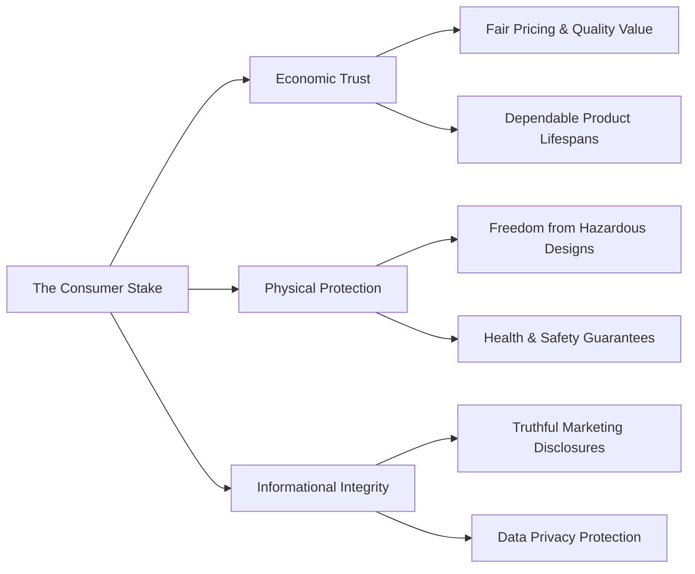
```mermaid
graph LR
    A[The Consumer Stake] --> B[Economic Trust]
    A --> C[Physical Protection]
    A --> D[Informational Integrity]
    
    B --> B1[Fair Pricing & Quality Value]
    B --> B2[Dependable Product Lifespans]
    
    C --> C1[Freedom from Hazardous Designs]
    C --> C2[Health & Safety Guarantees]
    
    D --> D1[Truthful Marketing Disclosures]
    D --> D2[Data Privacy Protection]
```

The consumer stake is traditionally framed around the **Consumer Bill of Rights**, first articulated by US President John F. Kennedy in 1962 and later expanded by the United Nations. These rights outline the core expectations that define the consumer’s stake:

- **The Right to Safety:** Consumers have a legitimate stake in expecting that products will not cause injury, illness, or death when used as intended or under reasonably foreseeable conditions.
- **The Right to Be Informed:** Consumers require accurate, transparent data regarding the composition, origins, proper use, and risks of products to exercise rational, autonomous purchasing decisions.
- **The Right to Choose:** Consumers depend on competitive markets to prevent monopolistic exploitation, ensuring access to a variety of products at fair prices.
- **The Right to Be Heard:** This involves access to reliable channels for grievance redress, product returns, and consumer advocacy if a firm fails to deliver on its contractual promises.

#### The Power Asymmetry

The core ethical challenge in business-consumer relations stems from a profound **power asymmetry**. Individual consumers generally lack the technical expertise to evaluate complex products (such as pharmaceuticals, advanced electronics, or financial derivatives) and do not possess the legal resources of multinational corporations. Consequently, the consumer's stake is highly vulnerable, requiring corporate responsibility, consumer advocacy movements (_consumerism_), and statutory regulations to protect it.

### 2. Ethical Issues and Problems in Business–Consumer Relations

Ethical challenges in business-consumer relations can be systematically evaluated across the traditional dimensions of the marketing mix—the **4 Ps** (Product, Price, Promotion, Place)—alongside contemporary challenges in data governance.

|**Marketing Dimension**|**Core Ethical Issue**|**Operational Manifestation**|
|---|---|---|
|**Product**|**Safety & Quality Failures**|Selling products with latent manufacturing defects (e.g., exploding batteries, contaminated foodstuffs).|
||**Planned Obsolescence**|Artificially shortening a product's operational lifespan to force premature replacement cycles.|
|**Price**|**Price Gouging**|Raising the price of essential items (e.g., fuel, water, medication) during a crisis or disaster.|
||**Deceptive Pricing**|Using hidden fees, confusing contract terms, or artificial discounts to obscure the actual cost.|
|**Promotion**|**Deceptive Advertising**|Making unverified, exaggerated claims (_puffery_) or omitting critical health and safety warnings.|
||**Targeting the Vulnerable**|Directing manipulative marketing at groups unable to make fully rational choices, like children or the elderly.|
|**Place**|**Exclusionary Distribution**|Deliberately denying or limiting access to essential services (_redlining_) in low-income neighborhoods.|

#### Product Safety: Negligence vs. Strict Liability

When a product harms a consumer, the ethical evaluation hinges on two distinct legal and moral doctrines:

- **Due Care (Negligence):** This view holds that manufacturers are morally responsible only if they fail to take reasonable precautions to prevent defects. If a firm adheres to all industry safety regulations, any subsequent accident is viewed as an unavoidable risk borne by the user.
- **Strict Product Liability:** This framework argues that the manufacturer is responsible for any injury caused by a defective product, regardless of whether the firm exercised due care or followed regulatory standards. This is justified on utilitarian grounds: the corporation is best positioned to absorb the financial costs of injuries, distribute those risks through insurance, and build safer designs.

#### Contemporary Ethical Dilemma: Behavioral Micro-Targeting and Privacy

In the modern digital economy, data has emerged as a major front for consumer ethics. Tech companies and retailers continuously track consumer digital footprints, purchasing records, and biometric data.
Ethical concerns arise when firms use **surveillance capitalism** to build predictive behavioral profiles. These profiles allow companies to launch hyper-targeted advertisements that exploit individual psychological vulnerabilities (such as insecurity, addiction, or political anxieties). This distorts autonomous consumer decision-making and violates basic rights to personal data privacy.

### 3. Impact of Globalization on Responsibilities Towards Consumers

Globalization has separated production from consumption, introducing deep supply chain distances and regulatory disparities that reshape corporate responsibilities toward global consumers.

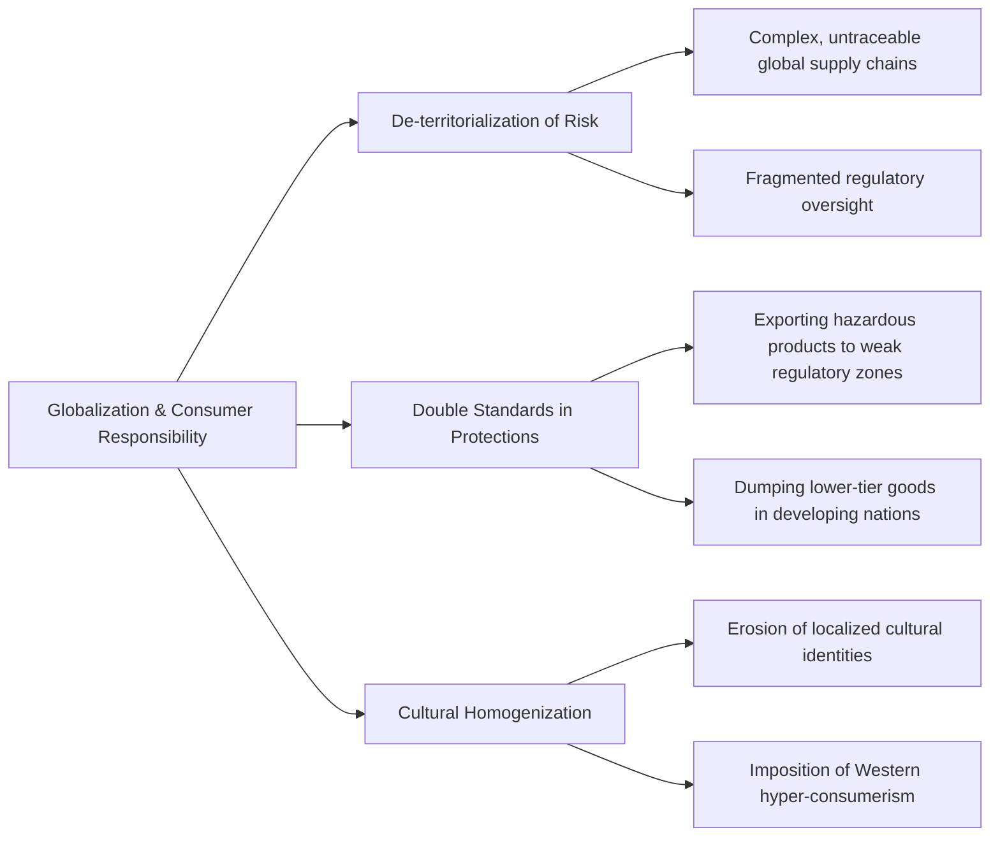
```mermaid
graph LR
    A[Globalization & Consumer Responsibility] --> B[De-territorialization of Risk]
    A --> C[Double Standards in Protections]
    A --> D[Cultural Homogenization]
    
    B --> B1[Complex, untraceable global supply chains]
    B --> B2[Fragmented regulatory oversight]
    
    C --> C1[Exporting hazardous products to weak regulatory zones]
    C --> C2[Dumping lower-tier goods in developing nations]
    
    D --> D1[Erosion of localized cultural identities]
    D --> D2[Imposition of Western hyper-consumerism]
```

#### De-territorialization of Risk

In a globalized marketplace, a product may be designed in the United States, manufactured using chemical compounds sourced from China, assembled in Vietnam, and sold to a consumer in Germany. This fragmentation creates a **de-territorialization of risk**. If a product turns out to be toxic or defective, tracing accountability across multiple legal jurisdictions becomes exceedingly difficult for consumers, reducing their access to reliable legal remedies.

#### Regulatory Arbitrage and Double Standards

Multinational corporations (MNCs) frequently face the temptation to exploit differing national consumer protection standards. When a specific chemical, pesticide, or pharmaceutical component is banned in a highly regulated Western market due to health concerns, some firms continue to sell those same formulations in developing nations with weaker regulatory frameworks.
From a Kantian perspective, this represents a severe ethical double standard, as it treats the health and safety of consumers in developing nations as less valuable than that of consumers in wealthier countries.

#### Cultural Imperialism and Western Hyper-Consumerism

Global marketing campaigns by massive multinational brands can act as instruments of **cultural homogenization** (often described as _McDonaldization_). By deploying massive advertising budgets, global brands can displace local products, traditions, and dietary habits, replacing them with a standardized, resource-intensive Western hyper-consumerist lifestyle. This transition can lead to unintended social and public health consequences, such as rising obesity rates or high personal debt in emerging economies.

### 4. Arguments for More Responsible Marketing Practices

The pursuit of more responsible corporate marketing is justified by powerful philosophical and economic arguments that challenge the traditional assumption of unrestricted consumer choice.

#### 1. The Critique of Consumer Sovereignty (The Dependence Effect)

The standard economic defense of advertising rests on the concept of **consumer sovereignty**—the idea that consumers have independent, pre-existing needs, and marketing simply provides information to help them satisfy those needs efficiently.
However, social critics like John Kenneth Galbraith argue that modern marketing often reverses this relationship through the **Dependence Effect**. Instead of satisfying existing desires, aggressive advertising explicitly _creates_ artificial desires for luxury, status, or unnecessary consumption. Because these artificial needs are manufactured by the corporation to drive sales, marketing can manipulate rather than serve the consumer.

#### 2. The Kantian Imperative: Respecting Autonomy

Under Kantian ethics, human beings must always be treated as ends in themselves, never merely as a means to an financial end.
Deceptive marketing, psychological manipulation, and hidden pricing violate this imperative. By using false claims or emotional vulnerabilities to induce a sale, corporations bypass the consumer’s rational capacity. Responsible marketing practices ensure that advertisements present truthful, complete information, respecting the consumer's right to make autonomous, informed choices.

#### 3. The Utilitarian Argument: Eliminating Market Failures

From a utilitarian perspective, the optimal allocation of resources in a market depends on perfect information. Irresponsible marketing practices—such as concealing product risks, price fixing, or fabricating green credentials—create severe **information asymmetries**.
These asymmetries lead to market failures where consumers waste capital on low-quality, hazardous, or inefficient products. Responsible marketing reduces transaction costs, minimizes physical and financial harm, builds institutional trust, and maximizes overall societal utility.

### 5. Ethical Consumption and Positive Social Change

Ethical consumption occurs when consumers intentionally use their purchasing power to express moral, social, or environmental values. It shifts the consumer's role from a passive economic actor to an active **citizen-consumer** who votes economically with their wallet.

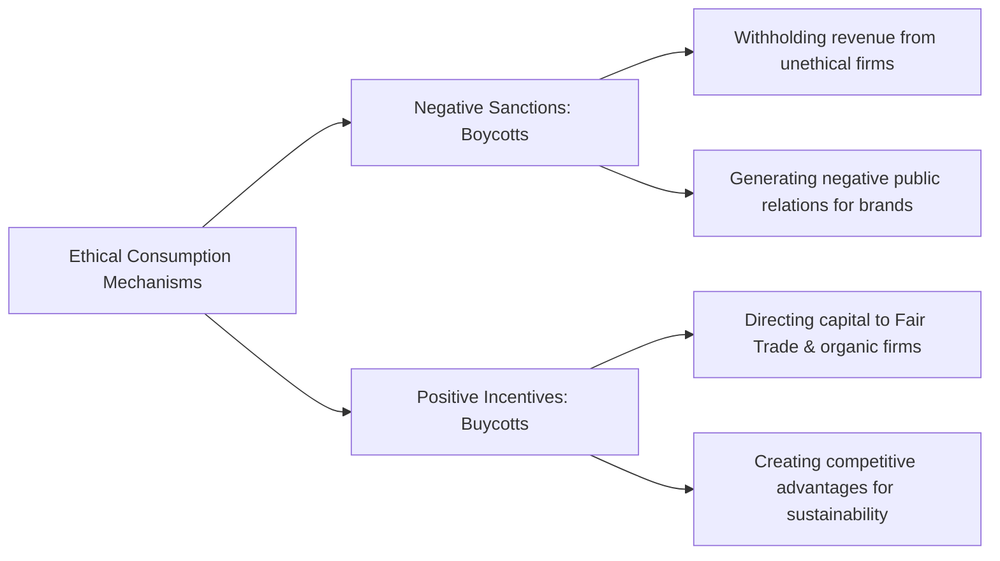
```mermaid
graph LR
    A[Ethical Consumption Mechanisms] --> B[Negative Sanctions: Boycotts]
    A --> C[Positive Incentives: Buycotts]
    
    B --> B1[Withholding revenue from unethical firms]
    B --> B2[Generating negative public relations for brands]
    
    C --> C1[Directing capital to Fair Trade & organic firms]
    C --> C2[Creating competitive advantages for sustainability]
```

#### Mechanisms of Ethical Consumption

- **Ethical Boycotts (Negative Sanctions):** The deliberate refusal to purchase products from a specific corporation due to its objectionable policies, such as environmental destruction, complicity with authoritarian regimes, or sweatshop labor. Historically, high-profile boycotts (e.g., campaigns against Nike over factory labor conditions or Shell over oil disposal plans) have forced major MNCs to reform their corporate practices.
- **Ethical Buycotts (Positive Incentives):** The intentional purchase of a product explicitly because of its ethical credentials, even if it carries a premium price. Examples include buying **Fair Trade** coffee to guarantee living wages for global farmers, selecting certified cruelty-free cosmetics, or purchasing organic agricultural goods.

#### Driving Corporate Structural Reform

Ethical consumption changes the market dynamics for corporations by transforming ethical behavior from an administrative cost into a clear **competitive advantage**. When a critical mass of consumers demands sustainability, firms are incentivized to restructure their global operations to protect their market share. This pressure drives changes like auditing supply chains, eliminating single-use plastics, and committing to carbon reduction targets.

### 6. Challenges Posed by Sustainable Consumption

While ethical and sustainable consumption is an important tool for positive change, it faces several structural, psychological, and systemic challenges that limit its real-world effectiveness.

#### The Attitude-Behavior Gap (The Green Gap)

One of the most persistent challenges in sustainable consumption is the significant disconnect between consumer intent and actual behavior, often called the **attitude-behavior gap**.
In marketing surveys, a high percentage of consumers express deep concern for environmental sustainability and state they prefer to buy eco-friendly products. However, at the point of sale, actual market share metrics for sustainable products often remain very low. When making real purchases, immediate personal considerations—such as lower prices, convenience, brand loyalty, and product performance—frequently override abstract ethical intentions.

#### The Rebound Effect (Jevons Paradox)

The **rebound effect** is a structural challenge where efficiency gains from sustainable consumption are offset by behavioral changes that increase overall resource use.

> [!example] The Rebound Effect
> A consumer purchases a highly fuel-efficient hybrid or electric vehicle to reduce their environmental footprint. However, because the cost per mile driven drops significantly, the consumer feels comfortable driving much longer distances or moving further away from work. Ironically, this behavioral shift can negate the initial resource savings, maintaining or even increasing total energy consumption.

#### Greenwashing and Information Overload

As sustainability has grown popular, many corporations have engaged in **greenwashing**—using deceptive marketing to project an eco-friendly image while making no substantive changes to their underlying business operations.
Firms deploy vague terms like "all-natural," "eco-conscious," or "biodegradable" without clear third-party verification. This practice creates severe information overload and confusion for consumers. Confronted with a confusing array of competing eco-labels and conflicting corporate claims, many consumers develop cynicism and choice paralysis, ultimately abandoning sustainable alternatives altogether.

#### Systemic Limitation: The Paradox of the Growth Paradigm

The most fundamental challenge to sustainable consumption is systemic. Most corporate efforts focus on _sustainable consumer choices_—substituting a conventional product with a slightly greener alternative (e.g., buying a recycled plastic water bottle instead of a standard one).
However, true ecological sustainability requires a structural reduction in the total volume of consumption (_dematerialization_). This creates a direct paradox with the core institutional structure of the modern corporation, which depends on continuous quantitative growth, expanded manufacturing output, and short product replacement cycles to satisfy financial markets.

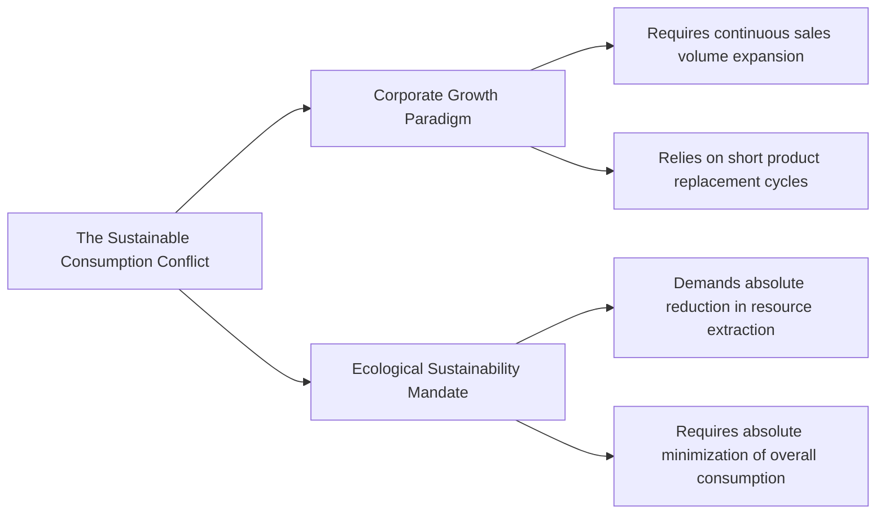
```mermaid
graph LR
    A[The Sustainable Consumption Conflict] --> B[Corporate Growth Paradigm]
    A --> C[Ecological Sustainability Mandate]
    
    B --> B1[Requires continuous sales volume expansion]
    B --> B2[Relies on short product replacement cycles]
    
    C --> C1[Demands absolute reduction in resource extraction]
    C --> C2[Requires absolute minimization of overall consumption]
```

# Chapter 8

### 1. The Specific Role of Suppliers and Competitors as Stakeholders

In modern business ethics, an organization's stakeholder ecosystem is split into vertical value chain relationships (suppliers) and horizontal marketplace relationships (competitors). Both groups possess distinct stakes that directly influence a firm’s operational continuity, market reputation, and long-term viability.

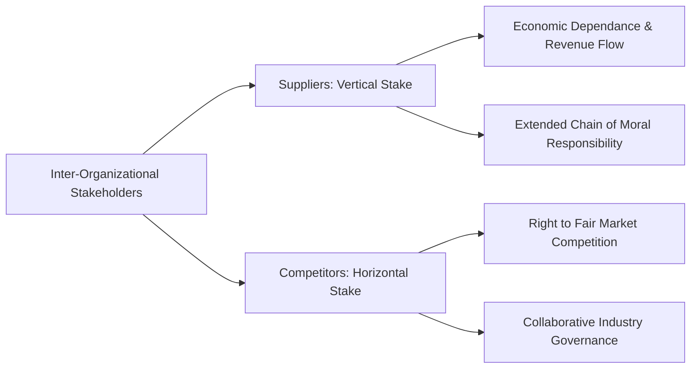
```mermaid
graph LR
    A[Inter-Organizational Stakeholders] --> B[Suppliers: Vertical Stake]
    A --> C[Competitors: Horizontal Stake]
    
    B --> B1[Economic Dependance & Revenue Flow]
    B --> B2[Extended Chain of Moral Responsibility]
    
    C --> C1[Right to Fair Market Competition]
    C --> C2[Collaborative Industry Governance]
```

#### Suppliers as Stakeholders

Suppliers provide the necessary raw materials, intermediate components, technology, and specialized services that allow a purchasing organization to create its final products.

- **Economic and Operational Interdependence:** Suppliers commit physical, financial, and human capital to meet the specifications of the buying company. Their primary stake is economic: they rely on the buyer for steady revenue, fair contract terms, and timely payments to remain solvent.
- **The Extended Chain of Responsibility:** As highlighted by Crane and Matten, the relationship between a firm and its suppliers is vertical. Modern stakeholder theory views a firm's ethical footprint as inclusive of its suppliers. If a supplier utilizes sweatshop labor or dumps toxic waste, the purchasing corporation is increasingly held morally accountable by civil society, establishing an _extended chain of responsibility_.

#### Competitors as Stakeholders

Competitors are organisations that offer similar products or services within the same target market. While classical economics frames competitors purely as market adversaries, stakeholder theory identifies them as vital stakeholders linked by a shared horizontal relationship.

- **The Right to Fair Play:** A competitor’s primary stake is the right to **fair competition**. This means all market actors must follow shared rules, avoid underhanded market manipulation, and compete honestly on price, quality, and innovation.
- **Mutual Industry Legitimacy:** Competitors share a collective stake in maintaining the institutional reputation and consumer trust of their shared industry. When one firm engages in systemic fraud or severe corner-cutting, it can trigger widespread public scepticism that harms every competitor in that sector.

### 2. Ethical Issues and Problems in Dealings with Suppliers and Competitors

Ethical dilemmas in inter-organisational relationships often stem from structural power imbalances or attempts to bypass normal market mechanisms.

|**Stakeholder Category**|**Core Ethical Issue**|**Description & Operational Impact**|
|---|---|---|
|**Suppliers (Vertical)**|**Exploitation of Buyer Power**|Large corporations forcing vulnerable suppliers into razor-thin profit margins or demanding retro-active price discounts.|
||**Delayed Payments**|Intentionally delaying payments to suppliers to optimize the buyer's cash flow, which can push smaller suppliers into bankruptcy.|
||**Conflicts of Interest & Bribery**|Procurement managers accepting personal gifts, luxury trips, or financial kickbacks to award supply contracts, bypassing objective quality metrics.|
|**Competitors (Horizontal)**|**Collusion and Cartels**|Competitors secretly agreeing to fix high prices, rig bids, or divide territories among themselves, exploiting consumers and breaking antitrust laws.|
||**Predatory Pricing**|Temporarily pricing goods far below cost to deliberately bankrupt smaller competitors, with the intent of raising prices once a monopoly is secured.|
||**Industrial Espionage**|Using illicit tactics (such as network hacking, stealing intellectual property, or hiring double-agents) to obtain a rival’s trade secrets.|

### 3. Critical Evaluation of the Ethical Challenges of Global Business Networks

The forces of globalization have transformed traditional linear supply chains into decentralized, highly complex **global business networks**. While these networks maximize cost efficiency, they also introduce severe systemic ethical challenges.

```mermaid
graph LR
    A[Global Business Networks] --> B[Regulatory Arbitrage]
    A --> C[Visibility & Sub-Contracting Blindspots]
    A --> D[Cultural & Ethical Relativism]
    
    B --> B1[Exploiting weak environmental & labor laws abroad]
    C --> C1[Loss of traceability across multiple tiers of suppliers]
    D --> D1[Navigating varying local norms on gift-giving and sourcing]
```

#### The Problem of Regulatory Arbitrage

Global networks cross multiple national jurisdictions, often creating a **regulatory vacuum**. Multinational corporations (MNCs) can leverage their mobility to practice regulatory arbitrage—outsourcing manufacturing to developing countries where environmental, safety, and labor laws are weak or poorly enforced. This allows firms to reduce compliance costs by shifting human and ecological risks onto vulnerable local communities.

#### Fragmentation of Visibility and Sub-Contracting

As production networks grow and split into multiple tiers, principal corporations often lose clear oversight of their extended operations. A Tier-1 supplier might quietly sub-contract work to unauthorized Tier-2 or Tier-3 facilities that run dangerous workspace environments or use forced labor. This complex chain makes accountability diffuse; when a disaster occurs (such as a factory fire or toxic spill), corporations often claim ignorance, exposing how global networks can obscure clear lines of moral responsibility.

#### Cultural Disparities and Differing Norms

Operating globally forces organizations to navigate differing regional traditions and business norms. Practices that are categorized as institutionalized bribery or favoritism under strict Western compliance frameworks (such as the US Foreign Corrupt Practices Act or UK Bribery Act) may be treated as normal relationship-building customs elsewhere. Resolving these ethical gaps without resorting to cultural imperialism or compromising core human rights principles remains a major challenge for global network managers.

### 4. Corporate Influence on Supplier and Competitor Social and Environmental Choices

Because large buying firms wield massive economic power, they can act as private regulators, driving social and environmental change through their business relationships.

#### Supplier Codes of Conduct and Ethical Sourcing

Many major corporations mandate that all active vendors sign and follow a strict **Supplier Code of Conduct**. These binding agreements establish baseline expectations for:

- Prohibiting child, forced, or bonded labor.
- Guaranteeing safe, hygienic working environments and maximum weekly working hours.
- Minimizing local environmental damage, including proper chemical storage and wastewater treatment.
  To back up these codes, corporations use independent third-party auditing firms to conduct regular, unannounced site inspections, making compliance a prerequisite for keeping the business contract.

#### From Compliance to Capacity Building

Leading corporate citizens have realized that merely policing suppliers through audits can lead to evasive behavior or falsified record-keeping. As a result, many are shifting from compliance-only models toward long-term **capacity building**. This involves investing in technical training, offering financial assistance for eco-efficient upgrades, and providing long-term contract stability to help suppliers meet rigorous sustainability benchmarks.

#### Influencing Competitors Through Industry Coalitions

Firms can also reshape market standards by collaborating with competitors in shared industry coalitions (e.g., the Sustainable Apparel Coalition or the Electronic Industry Citizenship Coalition). By working together to establish uniform, industry-wide standards for chemical elimination, material tracing, or fair wages, competitors eliminate the risk of being undercut on price by less responsible actors, elevating the ethical baseline of the entire sector.

### 5. Sustainability Implications in Supplier and Competitor Relationships

Achieving macro-level sustainability requires moving beyond single-company changes toward systemic coordination across entire inter-organizational networks.

```mermaid
graph LR
    A[Linear Economy] -->|Take-Make-Waste| B[High Ecological Depletion]
    C[Industrial Ecosystems] -->|Waste-to-Input Integration| D[Circular Sustainability]
```

#### Industrial Ecology and Circular Networks

A major theme in Crane and Matten’s analysis of sustainable business relationships is the shift toward **industrial ecology**. Instead of treating a factory as an isolated system that consumes resources and dumps waste, industrial ecology structures business networks to mimic natural ecosystems.
This requires high-trust partnerships where the waste heat, byproducts, or discarded materials of one firm serve as direct inputs for a nearby supplier or competitor, effectively "closing the loop" of production.

#### The "Co-opetition" Paradigm for Sustainability

True environmental sustainability presents systemic challenges—such as decarbonizing global shipping lines, building recycling infrastructure, or finding alternatives to persistent single-use plastics—that carry too much financial risk or technical difficulty for any single firm to tackle alone.
This reality requires **co-opetition**: a framework where fierce marketplace competitors actively collaborate on pre-competitive environmental problems. By co-investing in green R\&D and establishing shared circular infrastructure, competitors can accelerate systemic sustainability transformations while continuing to compete openly on product design and customer service.

# Chapter 9

### 1. The Role of Civil Society Organizations (CSOs) as Stakeholders

In contemporary business ethics, **Civil Society Organizations (CSOs)**—often referred to as the "Third Sector" alongside the state and the market—include non-governmental organizations (NGOs), pressure groups, charities, faith-based organizations, community associations, and trade unions. CSOs do not hold a direct financial stake or statutory regulatory authority over corporations. Instead, their stake is grounded in **moral, social, and environmental interests**, acting as representatives for causes or communities that lack a direct voice in market transactions.

```mermaid
graph LR
    A[Civil Society Stakeholder Influence] --> B[Direct Influence]
    A --> C[Indirect Influence]
    
    B --> B1[Shareholder Activism & Resolution Tabling]
    B --> B2[Targeted Consumer Boycotts]
    B --> B3[Litigation & Court Challenges]
    
    C --> C1[Shaping Public Opinion & Brand Perceptions]
    C --> C2[Lobbying Governments for Stricter Regulation]
    C --> C3[Altering Market Norms & Industry Standards]
```

#### Direct Stakeholder Roles

- **Economic Disruptors (Boycotts and Direct Action):** CSOs can directly impact a firm's financial baseline by organizing consumer boycotts, blocking distribution channels, or staging protests at corporate facilities to halt operations.
- **Shareholder Activists:** Many modern CSOs purchase nominal shares in public corporations to gain entry to Annual General Meetings (AGMs). This enables them to table resolutions on climate risk, human rights disclosures, or executive pay, directly confronting corporate boards.
- **Legal Litigants:** CSOs use strategic litigation to hold corporations accountable, filing lawsuits on behalf of marginalized communities affected by industrial pollution, wage theft, or human rights violations.

#### Indirect Stakeholder Roles

- **Agenda Setters and Public Educators:** CSOs shape the social context of business by launching public awareness campaigns. By exposing corporate misconduct (e.g., deforestation in supply chains), they shift consumer preferences and alter market demand.
- **Surrogate Regulators via Government Lobbying:** When corporations resist voluntary reform, CSOs lobby national and international legislative bodies. They provide research, draft policy templates, and mobilize voters to force statutory regulations on industries.
- **Gatekeepers of Corporate Legitimacy:** In an era focused on Environmental, Social, and Governance (ESG) metrics, CSOs assess corporate behavior. Their endorsements or condemnations can influence institutional investors, credit rating agencies, and top-tier employment candidates.

### 2. Ethical Analysis of CSO Tactics

To achieve their goals, CSOs deploy tactics across a wide spectrum, ranging from adversarial confrontation to collaborative partnership. Analyzing these methods through normative ethical frameworks reveals complex moral dynamics.

|**CSO Tactic**|**Operational Examples**|**Utilitarian Evaluation (Ends)**|**Kantian/Deontological Evaluation (Means)**|
|---|---|---|---|
|**Confrontational / Disruptive Action**|Public shaming campaigns, factory blockades, hacktivism, unsanctioned product tracking.|**Mixed Utility:** Can create short-term economic harm and job losses. However, it often yields long-term utility by forcing firms to end widespread social or environmental harms.|**Problematic Means:** Can violate property rights, disrupt individual liberties, or use corporate employees as mere tools for media attention. Often justified as a defense of basic human dignity.|
|**Information Leverage / Whistleblowing**|Leaking internal documents, investigative journalism, corporate greenwashing exposes.|**High Utility:** Eliminates information asymmetries in the market. This allows consumers and investors to allocate resources more efficiently based on accurate facts.|**Strong Moral Duty:** Aligns with the duty of truth-telling and transparency. It respects the autonomy of external stakeholders by providing accurate data for decision-making.|
|**Collaborative / Market-Based Engagement**|Joint policy design, voluntary certification programs, advisory council participation.|**Optimized Utility:** Minimizes conflict costs and creates stable, practical improvements within industry frameworks.|**Respects Autonomy:** Treats corporate managers as rational agents capable of moral growth, fostering mutual respect and shared problem-solving.|

#### The Ethics of Asymmetry and CSO Legitimacy

Critics often question the ethical foundations of aggressive CSO tactics, raising concerns over **accountability and legitimacy**. Unlike democratically elected governments or market-voted corporations, CSOs are self-appointed and primarily accountable to their donors or internal leadership.
However, business ethicists generally justify disruptive CSO tactics by pointing out the extreme **power asymmetry** in global markets. When multi-billion dollar multinational corporations (MNCs) operate in regions with weak regulatory oversight, confrontational civil actions are often the only viable check against corporate overreach.

### 3. Globalization and the Evolving Role of Civil Society

Globalization has fundamentally reshaped how civil society interacts with corporations, shifting operations from a national focus to highly integrated, cross-border networks.

#### Addressing the Global Governance Vacuum

As multinational corporations expanded across borders, they outgrew the regulatory reach of individual nation-states. By shifting operations to countries with lax labor and environmental laws, MNCs created a global governance vacuum.
In response, civil society has transformed into a **Transnational Civil Society**. Global NGOs (e.g., Greenpeace, Amnesty International, Oxfam) step in as transnational watchdogs, monitoring corporate behavior across complex jurisdictional boundaries.

```mermaid
graph LR
    A[Globalized Market Dynamics] --> B[MNC Geographic Dispersion]
    A --> C[Transnational CSO Networks]
    
    B --> B1[Supply chain outsourcing to developing nations]
    B --> B2[Exploitation of weak national regulatory systems]
    
    C --> C1[Real-time digital exposure of localized infractions]
    C --> C2[Leveraging brand vulnerability in wealthy consumer markets]
```

#### De-territorialization and Information Leverage

Modern globalization relies heavily on digital connectivity. This allows local environmental or labor infractions to be recorded and transmitted instantly to a global audience.
CSOs use this connectivity to bypass local restrictions, targeting an MNC's brand identity in its wealthy home consumer markets. For example, a local land rights dispute in a developing nation can quickly escalate into a global social media campaign, threatening the parent company's brand equity worldwide.

#### Critiques of Global Civil Society: Western Bias and Imperialism

The global expansion of civil society has drawn criticism regarding uneven representation:

- **The Northern Bias:** Many of the most powerful and well-funded global NGOs are headquartered in the Global North (Western Europe and North America).
- **Ethical Imperialism:** These well-funded organizations sometimes impose Western social priorities or environmental standards on developing countries without considering local economic needs, potentially undermining local economic self-determination.
- **Resource Imbalances:** Local Southern CSOs, which are closest to the actual social harms, often find themselves sidelined or dependent on the funding and agendas of larger Northern organizations.

### 4. Business–Civil Society Relationships and Corporate Responsibility

The structural relationship between business and civil society has shifted over time, directly influencing how corporate responsibility is understood and practiced.

```mermaid
graph LR
    A[Adversarial Confrontation] --> B[Transactional Philanthropy]
    B --> C[Collaborative Governance]
```

#### 1. The Adversarial Relationship (Conflict Model)

In this traditional configuration, business and civil society act as permanent opponents. CSOs operate externally as watchdogs, using exposure and pressure to force compliance.

- **Impact on Responsibility:** This model frames corporate responsibility as a **defensive obligation** or a risk-mitigation strategy. The corporation focuses on avoiding fines, lawsuits, and public relations crises, yielding a reactive, compliance-driven approach to CSR.

#### 2. The Transactional Relationship (Philanthropy Model)

This model shifts the dynamic from open conflict to arms-length interaction, typically through corporate philanthropy, grants, and charity sponsorships. CSOs act as beneficiaries of corporate financial success.

- **Impact on Responsibility:** This framework treats corporate responsibility as an **add-on activity** financed by corporate profits. It rarely alters the core business model, leaving underlying supply chains or environmental practices unchanged while providing public relations benefits.

#### 3. The Collaborative Relationship (Alliance Model)

The modern era is defined by collaborative partnerships, where corporations and CSOs co-create standards, verification systems, and community development programs.

- **Impact on Responsibility:** This model transforms corporate responsibility into **Collaborative Governance**. Responsibility is embedded into core business strategies, treating sustainability challenges as shared systemic problems that require inter-sectoral coordination.

### 5. The Role of Civil Society in Advancing Corporate Sustainability

Civil society plays a critical role in advancing corporate sustainability, helping firms move past short-term public relations fixes toward deep, long-term systemic change across the Triple Bottom Line.

```mermaid
graph LR
    A[CSO Driving Corporate Sustainability] --> B[Market Standardization]
    A --> C[Verification & Auditing]
    A --> D[Promoting the Circular Economy]
    
    B --> B1[Establishing third-party eco-labels: FSC, MSC]
    C --> C1[Conducting field audits to eliminate greenwashing]
    D --> D1[Partnering to restructure industrial waste patterns]
```

#### Standard-Setting and Co-Regulation Certification Schemes

One of civil society's most significant contributions to sustainability is the creation of independent, third-party certification systems. When international regulatory bodies fail to agree on binding sustainability treaties, CSOs collaborate with progressive business leaders to build market-driven standards.

> [!tip] Prominent Cross-Sector Sustainability Alliances
>
> - **The Forest Stewardship Council (FSC):** Developed by environmental CSOs and timber firms to protect biodiversity through sustainable forestry management.
> - **The Marine Stewardship Council (MSC):** Co-founded by the WWF and Unilever to combat global overfishing by certifying sustainably managed fisheries.
> - **The Fairtrade Certification System:** Established by a network of civil society groups to ensure fair wages and safe working conditions for agricultural producers in developing economies.

These certification frameworks use clear eco-labels to reduce information asymmetries. This allows consumers and institutional investors to reward sustainable corporate behavior, making sustainability a measurable market advantage.

#### Eradicating Greenwashing via Independent Verification

As corporations increasingly adopt sustainability language, civil society acts as a safeguard against **greenwashing**. CSOs conduct independent field research and social audits to verify corporate claims. By publicly exposing discrepancies between corporate commitments and operational realities, CSOs maintain the credibility of market-wide sustainability standards.

#### Elevating Systemic and Ecological Resilience

Finally, CSOs push companies to think beyond individual organizational borders, encouraging them to address broader ecosystem health and systemic social issues. They help businesses transition from linear production systems toward circular economic models.
By bringing local ecological insights and social perspectives into global corporate boardrooms, civil society ensures that sustainability initiatives protect the long-term human and natural systems on which all economic operations depend.

# Chapter 10

### 1. Specific Stake of Governments and the Concept of "Double Agency"

Under Crane and Matten's business ethics framework, governments are not merely external observers; they are critical stakeholders with a complex, structural relationship with corporations. The government’s stake is multi-layered, encompassing economic, social, and legal dimensions.

#### The Specific Stake of Governments

- **Economic Stability and Revenues:** Governments rely on corporations to generate tax revenues (corporate income tax, payroll tax, VAT) to fund infrastructure, defense, and public services. They also depend on corporations to provide employment for citizens.
- **Legal and Structural Enforcement:** Governments act as the authors and guardians of the legal framework. They have a vested stake in ensuring that businesses operate within the rule of law, uphold property rights, honor contracts, and maintain fair competition.
- **Societal Well-being:** Governments are ultimately responsible for preserving public goods (clean air, public safety, national security) and protecting citizens from industrial externalities.

#### The "Double Agency" Dilemma

The defining characteristic of the government's relationship with business is its **Double Agency**. The state must act simultaneously as an agent for two distinct, and often conflicting, principals:

```mermaid
graph LR
    A[The State / Government] --> B[Agency 1: Representative of Society]
    A --> C[Agency 2: Promoter of Business]
    
    B --> B1[Regulates markets]
    B --> B2[Protects citizens and public goods]
    B --> B3[Corrects negative externalities]
    
    C --> C1[Promotes economic growth]
    C --> C2[Attracts foreign direct investment]
    C --> C3[Ensures international competitiveness]
    
    B1 <-->|Inherent Structural Tension| C1
```

1. **Agent of Society (The Regulatory Role):** In this role, the government is tasked by its citizens to police corporate behavior. It must impose restrictions, mandates, and taxes to correct market failures, prevent monopolistic exploitation, ensure workplace safety, and curb environmental degradation.
2. **Agent of Business (The Promotional Role):** Concurrently, the government acts as a facilitator for corporate success. To ensure economic growth, maintain high employment levels, and prevent capital flight, the government must cultivate a competitive business environment. This involves offering subsidies, building infrastructure, protecting intellectual property, and lowering bureaucratic hurdles.
   This double agency creates an inherent structural tension: aggressively regulating corporations to protect society can undermine economic competitiveness, while deregulating to appease business can harm public welfare and ecological systems.

### 2. Ethical Issues and Problems in Business–Government Relations

Ethical dilemmas in business-government relations typically arise when corporations attempt to manipulate state power to serve private interests at the expense of the public good.

|**Ethical Issue**|**Operational Definition**|**Ethical Concerns & Systemic Problems**|
|---|---|---|
|**Lobbying & Special Interest Influence**|Direct efforts by corporate groups to shape legislation and administrative decisions.|Creates an unequal playing field. Wealthy multi-national corporations can purchase asymmetric access to lawmakers, drowning out the voices of underfunded civil society groups and ordinary citizens.|
|**Political Contributions & Campaign Financing**|Corporations providing financial backing to political parties or candidates.|Leads to institutional corruption, where policy decisions may be transactional rewards for campaign donations, weakening democratic integrity.|
|**The "Revolving Door" Phenomenon**|The movement of personnel between regulatory bodies and the private corporations they are responsible for regulating.|Generates severe conflicts of interest. Regulators may ease enforcement to secure lucrative corporate jobs later, while corporate executives bring insider political networks directly into private boardrooms.|
|**Regulatory Capture**|A failure state where a regulatory agency becomes dominated by the very industry it was created to oversee.|The agency begins prioritizing industry profits and shielding established firms from competition, rather than protecting consumer safety or environmental health.|
|**Bribery and Extortion**|Illicit financial exchanges to secure government procurement contracts or bypass legal enforcement.|Subverts the rule of law, undermines market efficiency, and diverts public funds into corrupt channels, particularly in developing economies.|

### 3. Impact of Globalization on Business–Government Relations

Globalization has transformed business-government dynamics by uncoupling economic corporate operations from fixed national borders, while governments remain bound by territorial boundaries.

```mermaid
graph LR
    A[Globalization Elements] --> B[Regulatory Arbitrage]
    A --> C[Erosion of the Tax Base]
    A --> D[Supranational Governance]
    
    B --> B1[MNCs shift to low-regulation zones]
    C --> C1[Transfer pricing & tax havens cut state revenue]
    D --> D1[WTO/IMF override domestic environmental policies]
```

#### Regulatory Arbitrage and the "Race to the Bottom"

Because multi-national corporations (MNCs) can easily relocate capital, production facilities, and supply networks, they hold significant leverage over individual nation-states. Governments often find themselves forced into a competitive **"race to the bottom,"** lowering environmental standards, weakening labor rights, and weakening corporate tax rates to attract or retain foreign investment.

#### Fragmentation and Erosion of the National Tax Base

Through cross-border financial mechanisms like transfer pricing, profit shifting, and offshore tax havens, MNCs can systematically minimize their tax liabilities globally. This hollows out the government’s tax base, leaving states with fewer resources to fund the social safety nets and infrastructure that citizens rely on.

#### The Rise of Supranational Governance

Globalization has shifted significant regulatory power from democratically elected national governments to unelected, technocratic supranational bodies such as the World Trade Organization (WTO), the International Monetary Fund (IMF), and the World Bank. These organizations often prioritize free trade and capital mobility over domestic social or environmental protection policies, sparking questions about democratic accountability.

### 4. The Changing Role of Business and CSOs in Regulation

As globalization limits the regulatory capacity of individual nation-states, the traditional top-down "command-and-control" regulatory model has shifted toward a broader network of **global governance**. In this new landscape, corporations and Civil Society Organizations (CSOs) are moving from passive rule-followers to active rule-makers.

#### The Shift from Government to Governance

- **Self-Regulation (Private Governance):** Industries frequently establish voluntary codes of conduct and standards to police themselves without direct state intervention (e.g., the Responsible Care initiative in the chemical sector). While flexible, self-regulation is often criticized for lacking independent enforcement mechanisms and being used defensively to stave off binding state laws.
- **Co-Regulation:** This involves collaborative regulatory approaches where the state sets broad policy goals, but delegates the design and implementation of specific rules to industry associations and specialized bodies.
- **Multi-Stakeholder Initiatives (MSIs):** To fill global regulatory vacuums, hybrid public-private governance networks have emerged that completely bypass traditional state structures. These initiatives unite businesses, CSOs, and global institutions to establish market-driven standards.

> [!note] Examples of Multi-Stakeholder Initiatives
>
> - **The UN Global Compact:** A voluntary initiative based on CEO commitments to implement universal sustainability principles on human rights, labor, environment, and anti-corruption.
> - **The Extractive Industries Transparency Initiative (EITI):** A global standard to ensure open and accountable management of oil, gas, and mineral resources, fighting corruption by requiring disclosure of payments.

#### Critical Evaluation of Private Governance

While these collaborative frameworks can adapt quickly and bridge international governance gaps, they face a significant **democratic deficit**. Unlike elected governments, neither corporate executives nor CSO leaders are democratically accountable to the general public, raising long-term concerns about fairness, representation, and the protection of fundamental human rights.

### 5. The Role of Governmental Regulation in Achieving Corporate Sustainability

While voluntary commitments and market initiatives are valuable, strong government regulation remains the essential baseline for achieving macro-level sustainability across the Triple Bottom Line. Governments can deploy several distinct regulatory tools to enforce and encourage sustainable business practices:

```mermaid
graph LR
    A[Regulatory Portfolio] --> B[Command-and-Control]
    A --> C[Market-Based Instruments]
    A --> D[Mandatory Transparency]
    
    B --> B1[Statutory bans, caps & standards]
    C --> C1[Taxes, cap-and-trade incentives]
    D --> D1[Forced ESG audit disclosures]
```

#### 1. Command-and-Control Regulations

This traditional approach relies on direct statutory bans, limits, and standards. Governments establish absolute limits on pollution, mandate specific emission-control technologies, or completely ban hazardous substances (such as PFAS or ozone-depleting chemicals). This creates a firm, non-negotiable legal floor that applies uniformly to all market competitors.

#### 2. Market-Based Instruments (Internalizing Externalities)

Market-based regulation uses economic incentives and corrections to align corporate self-interest with ecological realities:

- **Pigouvian Taxes (e.g., Carbon Taxes):** Imposing financial penalties directly on negative environmental externalities, forcing companies to internalize the true social and ecological costs of production.
- **Cap-and-Trade Systems (Emissions Trading Schemes):** Creating artificial markets for pollution rights. The government sets an overall cap on emissions and issues tradable allowances, rewarding eco-efficient firms that can sell surplus credits and penalizing heavy polluters.
- **Subsidies and Tax Incentives:** Redirecting state capital to de-risk investments in clean energy infrastructure, electric vehicle adoption, and circular economy systems.

#### 3. Mandatory Transparency and Information Disclosures

Governments increasingly use informational regulation to shift market behavior, such as mandating comprehensive ESG disclosures (e.g., the EU's Corporate Sustainability Reporting Directive). By forcing corporations to systematically audit and publish their carbon footprints, supply chain labor conditions, and resource use, governments give institutional investors, consumers, and CSOs the reliable data they need to reward sustainable enterprises and penalize poor performers.

#### 4. Green Public Procurement

As major consumers within national economies, governments can shape markets through their purchasing choices. By mandating strict energy efficiency, zero-waste, and fair-trade standards for all state procurement contracts, governments create immediate economies of scale for sustainable innovations, turning public spending into a tool for industrial transformation.
