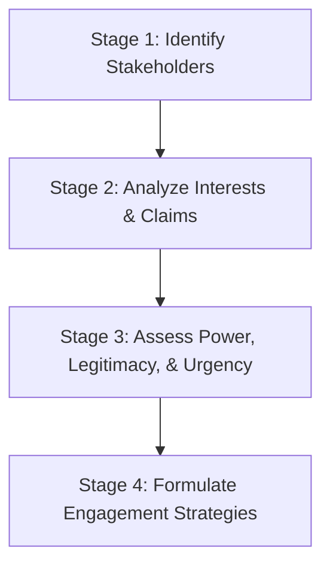

### (a)

#### Definition and Importance of Business Ethics

**Business Ethics** is defined as the study of business situations, activities, and decisions where issues of right and wrong are addressed. It systematically evaluates the moral standards and ethical principles applied within commercial environments to guide the behavioral patterns of both individuals and corporate entities.

#### Why Ethics Matters in Business

- **Power and Influence of Business:** Modern corporations wield immense economic, political, and social power. Ethical frameworks ensure that this power is exercised responsibly and prevents the exploitation of vulnerable stakeholder groups.
- **Potential for Social Impact:** Business activities can result in significant societal harm (e.g., environmental degradation, exploitation of labor, financial fraud) or substantial social benefits (e.g., sustainable development, technological innovation, equitable wealth distribution).
- **Evolving Stakeholder Expectations:** Consumers, employees, and institutional investors increasingly demand that corporate strategies align with broader ethical values. Neglecting these expectations can trigger consumer boycotts, divestments, and severe reputational damage.
- **Financial Performance and Risk Mitigation:** Strong organizational ethics protect brand equity, lower transaction costs by fostering trust, and drastically reduce the severe risks associated with regulatory fines, civil litigations, and compliance failures.
- **Employee Retention and Workplace Morale:** Operating an ethical workplace enhances mutual trust, lowers rates of internal misconduct, boosts employee morale, and serves as a critical driver for attracting and retaining top-tier professional talent.

### (b)

#### Distinguishing Ethics from Law and Feelings

While ethical decision-making overlaps with legislative frameworks and human emotional responses, it remains distinct from both.

#### Ethics is Not Synonymous with Law

- **Minimum vs. Aspirational Standards:** The law represents the codification of the baseline, minimum standards of conduct required by a society to maintain order. Ethics, conversely, prescribes aspirational guidelines that explore what _should_ be done for optimal moral outcomes, moving beyond mere legal compliance.
- **Unethical but Legal Actions:** An action can be completely legal but highly unethical. For example, a corporation shifting profits to offshore tax havens to bypass domestic corporate taxes may be entirely legal under existing tax loopholes, yet it violates the ethical principle of contributing fairly to the societal infrastructure that supports it.
- **Ethical but Illegal Actions:** An action can be illegal but ethically justifiable. Historical figures participating in civil rights movements frequently broke segregation laws to fight for racial equality, acting ethically correct despite violating statutory laws.
- **Regulatory Lags:** Legislative systems are historically reactive, lagging behind rapid technological and societal transformations (e.g., algorithmic bias in artificial intelligence or deep-water drilling safety rules). Ethical reasoning must proactively step in where clear legal boundaries have yet to be established.

#### Ethics is Different from Feelings

- **Subjectivity vs. Objectivity:** Feelings provide vital psychological impulses, but they are subjective, volatile, and highly individualized. An executive's internal feelings are not a standardized benchmark for determining organizational right from wrong.
- **Unreliable Moral Guides:** Emotions can frequently misguide decision-makers. For instance, a manager might feel intense personal anxiety about terminating an underperforming employee due to personal liking, yet keeping that employee is ethically unfair to the rest of the team who must absorb the unfulfilled workload.
- **Requirement for Rational Verification:** Ethical frameworks require objective analysis, universal moral philosophies (e.g., utilitarianism, deontology), and systemic consistency. It moves beyond visceral emotional reactions by demanding rational, justifiable proof for moral judgments.

### (c)

#### Stakeholder Management Approach

The **Stakeholder Management Approach** is a strategic framework in business ethics asserting that an organization must balance and integrate the interests of all individuals or groups who can affect or are affected by the achievement of the firm's objectives. This approach challenges classical shareholder primacy by establishing that a corporation owes moral duties not just to its owners, but also to its employees, customers, suppliers, local communities, and the natural environment.

#### Stages of Stakeholder Analysis

To manage stakeholder relations effectively, organizations systematically engage in stakeholder analysis through the following stages:

- **Stage 1: Identify the Stakeholders:** The organization maps out all potential entities impacted by its operations. This involves dividing them into _primary stakeholders_ (without whom the business cannot survive, such as shareholders, employees, customers, and suppliers) and _secondary stakeholders_ (who influence or are influenced by the business but do not engage in direct economic transactions, such as civil society organizations, media, and trade associations).
- **Stage 2: Analyze Stakeholder Interests and Claims:** Management uncovers the specific expectations, needs, legal rights, and moral claims of each identified group. For instance, employees expect fair wages and psychological safety, while suppliers look for transparent procurement processes and timely contractual payouts.
- **Stage 3: Assess Stakeholder Attributes (Power, Legitimacy, and Urgency):** Utilizing the Mitchell, Agle, and Wood salience typology, stakeholders are evaluated based on three variables:
  - _Power:_ The stakeholder's capacity to bring about its desired outcomes using coercive, utilitarian, or normative means.
  - _Legitimacy:_ The societal perception that the stakeholder's claim is valid, proper, and appropriate within a socially constructed system.
  - _Urgency:_ The degree to which the stakeholder's claim calls for immediate managerial attention due to time-sensitivity or critical importance.
- **Stage 4: Formulate and Implement Stakeholder Strategies:** The business designs operational strategies tailored to the mix of attributes identified. _Definitive stakeholders_ (possessing power, legitimacy, and urgency) are prioritized immediately, whereas _latent stakeholders_ (possessing only one attribute) are systematically monitored or kept informed to prevent future conflict.
