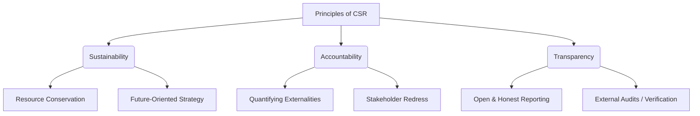

### (a)

#### The Transformation of Social Problems into Economic Opportunities

The quote, originally attributed to management theorist Peter Drucker, represents a paradigm shift in how corporate social responsibility (CSR) and the purpose of business are viewed. Rather than seeing social challenges as external burdens, regulations, or philanthropic cost centers, this philosophy argues that the ultimate social responsibility of business is to leverage its core competencies to solve societal problems profitably.

> [!info] Core Concept
> True sustainability and corporate impact occur when social needs are integrated into a business's core strategy, transforming liabilities into wealth-generating assets.

The statement can be broken down into several foundational dimensions:

- **Turning Social Problems into Economic Opportunities:** Traditional businesses treat societal challenges (e.g., environmental degradation, resource scarcity, health issues) as problems for governments or NGOs. However, modern CSR frameworks view these as unmet market needs. For example, the challenge of climate change has birthed the multi-billion-dollar renewable energy sector, transforming an ecological crisis into a commercial opportunity.
- **Conversion into Productive Capacity:** When a firm addresses a social issue, it invests in infrastructure, innovation, and production networks. Developing affordable housing or clean water solutions requires building supply chains and logistics, which expands the industrial and productive capabilities of the region.
- **Fostering Human Competence:** To solve complex social problems, companies must invest in human capital. This involves training local workforces, developing technical skills, and enhancing managerial capabilities. Consequently, the local labor pool undergoes upskilling, elevating the overall intellectual and technical competency of society.
- **Generation of Well-Paid Jobs:** By operationalizing social solutions into scalable business models, permanent employment opportunities are created. These are not temporary charitable jobs, but sustainable corporate positions that offer competitive wages, health benefits, and career advancement.
- **Creation of Wealth:** Ultimately, a business that runs profitably while solving a social issue generates sustainable wealth for shareholders (through returns on investment) and stakeholders (through taxes paid to governments, local economic multipliers, and improved quality of life).

### (b)

#### Social and Economic Drivers of Modern Corporate Social Responsibility

The heightened contemporary interest in Corporate Social Responsibility is driven by a combination of evolving social expectations and shifting economic realities. These interconnected factors have made CSR an institutional mandate rather than a voluntary option.

#### Social Context

- **The Information Revolution and Increased Transparency:** Advancements in digital technology, social media, and investigative journalism mean that corporate actions are under constant public scrutiny. Unethical practices, environmental violations, or labor exploitation anywhere in the supply chain can be exposed globally within minutes, forcing corporations to proactively manage their social impacts.
- **Shifting Consumer Expectations:** Modern consumers, particularly Millennials and Gen Z, are increasingly values-driven. They demonstrate a high preference for ethical, fair-trade, and green products, and are willing to boycott brands that violate human rights or damage the environment.
- **Empowerment of Civil Society and NGOs:** Civil Society Organizations (CSOs) and non-governmental organizations have grown significantly in power, sophistication, and coordination. They act as public watchdogs, staging boycotts, filing litigations, and shifting public opinion, which forces companies to engage in CSR to maintain their social license to operate.
- **Employee Value Realignment:** The war for talent has shifted toward purpose-driven work. Top-tier professionals prefer working for organizations that demonstrate strong ethical frameworks and societal commitment. Companies utilize CSR as a strategic tool for employee recruitment, retention, and engagement.

#### Economic Context

- **Globalization and the Rise of Corporate Power:** Multinational Corporations (MNCs) now command economic resources that surpass the GDPs of many developing nations. With this unprecedented concentration of economic power, public and regulatory pressure has intensified for corporations to take responsibility for the global externalities they create.
- **Risk Mitigation and Brand Equity Protection:** From a financial perspective, CSR acts as an insurance policy for a company's reputation. Intangible assets, such as brand value and goodwill, account for a massive share of market capitalization. A robust CSR profile mitigates the financial fallout from operational crises.
- **Investor Demands and the ESG Framework:** Institutional investors, sovereign wealth funds, and asset managers now heavily rely on Environmental, Social, and Governance (ESG) criteria to allocate capital. Firms with poor CSR practices face higher costs of capital, disinvestment, and lower credit ratings, making sustainability a core financial metrics requirement.
- **Resource Scarcity and Supply Chain Resilience:** Climate change and ecological degradation pose direct economic risks to corporate supply chains (e.g., water shortages, agricultural disruptions). Investing in environmental sustainability is therefore a matter of long-term economic survival and operational continuity.

### (c)

#### Foundational Principles of Corporate Social Responsibility

To implement effective CSR policies that withstand public and academic scrutiny, corporations rely on specific structural principles. The three most widely recognized principles of CSR (as formulated by Crowther and Aras) provide a benchmark for evaluating corporate performance.

#### 1. Sustainability

This principle dictates that an organization must conduct its operations in a manner that ensures resource availability is not compromised for future generations. It requires calculating the rate of resource consumption and ensuring that actions taken today do not lead to systemic depletion or permanent environmental degradation over time.

#### 2. Accountability

Accountability involves an explicit recognition by the organization that its operations affect the external environment and its diverse stakeholders.

- The firm assumes full ownership of both its positive and negative externalities (e.g., pollution, traffic congestion, or community displacement).
- It implies a commitment to measure, quantify, and report these impacts to external parties, along with providing mechanisms for remediation or compensation.

#### 3. Transparency

Transparency requires that all corporate reports, disclosures, and communications provide an open, accurate, and unambiguous representation of the company's performance.

- It ensures that negative impacts or operational failures are not obscured or heavily masked by public relations spin.
- True transparency allows stakeholders to independent verify corporate assertions through open access to data, ESG metrics, and third-party verified audits.
