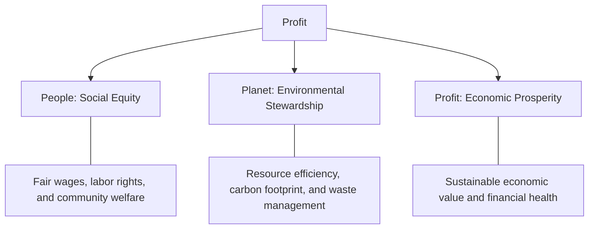
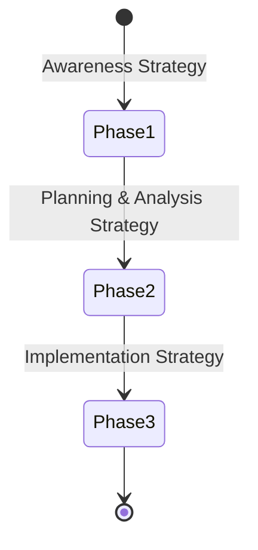
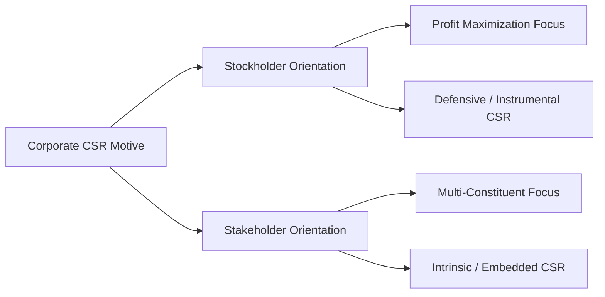
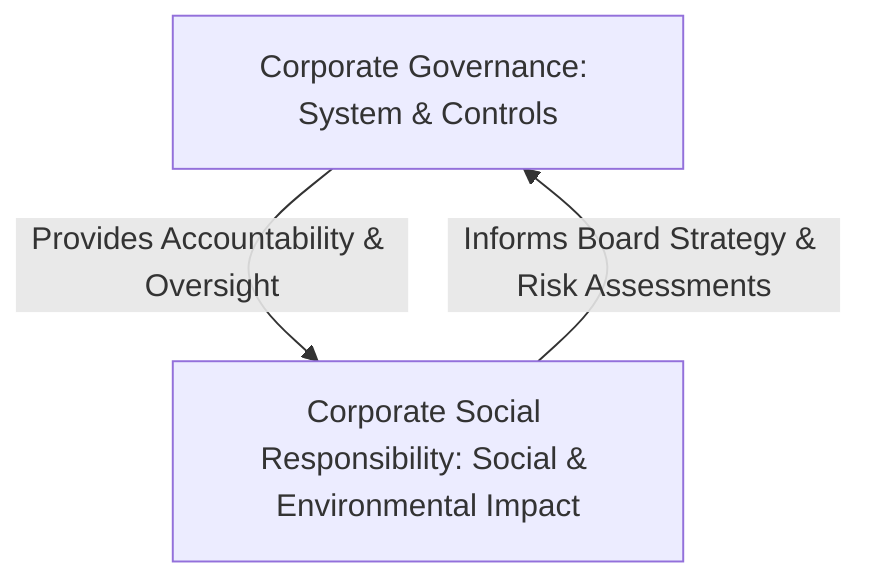

### (a)

#### Elucidate Triple Bottom Line of Corporate Social Responsibility

The **Triple Bottom Line (TBL)** is a sustainability framework conceptualized by John Elkington in 1994. It challenges the traditional focus on a single financial bottom line by asserting that a corporation’s ultimate success should be measured through three interconnected dimensions: **People**, **Planet**, and **Profit**.

- **People (Social Bottom Line):** This covers how a business impacts human capital and society. It dictates that an organization must implement fair, safe, and beneficial labor practices not only for its employees but also for the community and region where it operates. Key aspects include ensuring fair wages, eliminating workplace discrimination, ensuring occupational health, and contributing to local social equity.
- **Planet (Environmental Bottom Line):** This monitors the ecological footprint of corporate activities. A business operating under the TBL framework actively endeavors to minimize its negative ecological impact or maximize regenerative practices. It requires systematic reporting on energy consumption, raw material sourcing, waste reduction, greenhouse gas emissions, and toxic byproduct management.
- **Profit (Economic Bottom Line):** This represents the traditional economic value generated by the organization. However, within the TBL framework, "profit" goes beyond a company's internal net gains. It encompasses the broader economic impact and sustainable financial value the business creates for the surrounding economic ecosystem, including wealth distribution, job generation, and local tax contributions.

### (b)

#### Strategies in Adopting CSR Under the Ackerman Model

Robert Ackerman's model outlines a phased approach to how corporate entities progressively integrate social responsiveness into their operations. Rather than treating CSR as an overnight checklist, this model breaks down organizational adoption into three distinctive operational strategies or phases:

- **Phase 1: Awareness Strategy (Identification of the Issue):** Top management recognizes a growing social or environmental issue that directly affects corporate reputation or survival. At this baseline stage, the strategy is primarily discursive. The board or CEO issues policy statements acknowledging the dilemma, indicating to internal and external stakeholders that the company intends to act on the matter.
- **Phase 2: Planning and Analysis Strategy (Staff Specialization):** The corporate strategy transitions from corporate policy into specialized planning. The firm hires technical consultants or assigns dedicated staff specialists to analyze the core socio-environmental parameters. These specialists evaluate data, project long-term costs, and build technical strategies to institutionalize the social concern.
- **Phase 3: Implementation Strategy (Integration into Operations):** The responsibility is transferred from specialized staff units directly down to line managers and regular operational personnel. The social strategy becomes embedded into regular business workflows. Budgets are deployed, key performance metrics are assigned, and social performance is routinely assessed alongside standard commercial metrics.

### (c)

#### Organization's Adoption of CSR: Stockholder vs. Stakeholder Orientation

An organization's motive and operational approach to Corporate Social Responsibility depend heavily on whether its primary alignment lies with classical **Stockholder Theory** or contemporary **Stakeholder Theory**.

- **Stockholder-Oriented Adoption:**
  - **Core Philosophy:** Rooted in the ideas of economists like Milton Friedman, this perspective maintains that the primary duty of managers is to maximize shareholder wealth within the boundaries of legal and ethical customs.
  - **CSR Motive:** CSR is viewed defensively or instrumentally. The company approaches social initiatives primarily to mitigate regulatory risks, prevent litigation, or protect the corporate brand.
  - **Strategic Outcome:** Social initiatives are evaluated through cost-benefit analysis. The firm engages in CSR activities only if they yield direct or indirect financial benefits to the owners, treating ethical investments as instruments for profit optimization.
- **Stakeholder-Oriented Adoption:**
  - **Core Philosophy:** Derived from Edward Freeman's framework, this approach views the company as an ecosystem accountable to multiple constituents—such as employees, consumers, suppliers, local communities, and ecological entities—who can affect or are affected by the company's targets.
  - **CSR Motive:** The organization's motive is relational and intrinsic. It values social responsibility as a foundational ethical duty rather than a marketing tactic.
  - **Strategic Outcome:** The business alters its operating model to balance competing stakeholder interests. Rather than maximizing profits at the expense of others, it pursues a strategy of value optimization, treating stakeholders as ends rather than means to a financial end.

### (d)

#### Corporate Governance and its Link to Corporate Social Responsibility

> [!info] **Definition of Corporate Governance**
> Corporate Governance refers to the internal system of rules, guidelines, compliance policies, and organizational procedures by which corporations are directed, monitored, and controlled. It sets up the balance of power among the board of directors, management, shareholders, and other primary institutional stakeholders.

The link between Corporate Governance and Corporate Social Responsibility is characterized by an operational synergy where governance serves as the structure and CSR serves as the manifestation of corporate citizenship.

- **Accountability Structure:** Corporate governance provides the internal control systems, board oversight committees (e.g., sustainability or ethics committees), and auditing structures required to monitor CSR performance. Without strong governance, CSR initiatives risk becoming superficial public relations exercises lacking systemic accountability.
- **Strategic Alignment:** Governance defines how corporate objectives are shaped. When governance frameworks prioritize ethical risk management, they naturally embed CSR metrics—such as carbon accounting, fair labor practices, and supply chain transparency—into corporate strategic decisions.
- **Long-Term Value Creation:** Excellent corporate governance balances management's performance expectations with long-term survival. CSR supports this by addressing external risks (such as environmental depletion or community conflict), ensuring the business maintains its social license to operate over time.
