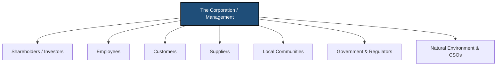
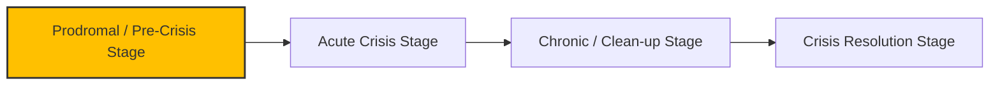

### (a)

#### Definition of Stakeholder Theory and Stakeholder Management Approach

Stakeholder theory, pioneered by R. Edward Freeman, challenges the traditional shareholder-primacy model which argues that a corporation's sole responsibility is to maximize profits for its owners. Instead, stakeholder theory posits that an organization is an open, interconnected system consisting of various groups and individuals who can affect or are affected by the achievement of the firm's objectives.
These stakeholders are generally classified into two categories:

- **Primary Stakeholders:** Those whose ongoing participation is critical to the survival and continuous operation of the business (e.g., shareholders, employees, customers, suppliers, and local communities).
- **Secondary Stakeholders:** Those who influence or are affected by the organization but are not engaged in direct economic transactions essential to its survival (e.g., the media, trade associations, civil society organizations, and regulatory bodies).
  The **Stakeholder Management Approach** is the operationalization of this theory. It refers to the structured managerial frameworks, strategic practices, and communication processes employed by an organization to identify its stakeholders, analyze their expectations and relative power, and integrate their diverse interests into the core corporate decision-making process. Rather than managing stakeholders defensively as external constraints, this approach seeks to build cooperative relationships and optimize value creation across the entire stakeholder ecosystem.

#### Rationale for Utilizing a Stakeholder Management Approach in Business Ethics

The adoption of a stakeholder management approach is crucial for business ethics due to several key philosophical and practical reasons:

1. **Moral Agency and Human Dignity (Kantian Ethics):** From an ethical standpoint, stakeholders are not merely means to an economic end (profit for shareholders); they are individuals and groups with intrinsic moral rights and dignity. A stakeholder approach aligns with Kant's categorical imperative by treating employees, customers, and communities as ends in themselves, ensuring their rights are respected during strategic deliberations.
2. **Mitigation of Negative Externalities:** Unregulated corporate activities frequently create negative externalities—such as environmental pollution, worker exploitation, or deceptive product marketing—where the costs of production are shifted onto society. Stakeholder management forces companies to internalize these social and environmental costs by giving a voice to affected parties, making corporate conduct more responsible and transparent.
3. **Distributive and Procedural Justice:** Business organizations utilize a wide array of societal resources (infrastructure, public education, natural ecosystems). Therefore, the distribution of wealth, opportunities, and risks generated by the firm must be managed fairly. Stakeholder theory provides a framework for distributive justice by ensuring that benefits are shared equitably and that stakeholder groups are granted fair procedural representation in organizational decisions.
4. **Long-Term Sustainability and Value Creation (Enlightened Self-Interest):** Ethical failures—such as treating employees unfairly or misleading consumers—ultimately erode social capital, damage corporate reputation, invite restrictive government regulation, and provoke consumer boycotts. A stakeholder management approach builds trust and loyalty, minimizing systemic risks and generating sustainable, long-term economic and ethical value.

### (b)

#### Personal and Professional Response to an Emerging Crisis at the Prodromal Stage

The **prodromal stage** represents the pre-crisis or warning phase within a crisis life cycle. It is the critical window where early warning signs, operational anomalies, or ethical violations first manifest. Although the issue has not yet escalated into a public scandal, legal liability, or catastrophic failure, it contains the distinct potential to do so if left unaddressed.

#### Emotional and Cognitive Evaluation

If I discovered a potential crisis emerging at the prodromal stage within my organization, my initial reaction would involve several key professional and psychological realities:

- **Professional Urgency and Vigilance:** I would experience a heightened sense of alert and urgency. Recognizing that a small, controllable issue could compound into a severe corporate catastrophe triggers a protective stance over organizational assets and human well-being.
- **Ethical Responsibility:** Rather than experiencing passive indifference, I would feel an acute moral obligation to act. This stems from the understanding that remaining silent during the prodromal stage makes an employee complicit in whatever damage subsequently occurs.
- **Constructive Concern:** While there might be apprehension regarding how management will receive the news, the primary cognitive focus would be on systematic risk mitigation and factual verification.

#### Corrective Action Plan

Faced with an emerging pre-crisis, I would pursue a structured, non-reactive course of action:

1. **Objective Fact-Finding and Documentation:** Before making any allegations, I would systematically gather verifiable data, internal logs, financial records, or quality reports confirming the issue. This ensures that the problem is framed clearly and backed by empirical evidence, eliminating ambiguity.
2. **Impact and Severity Assessment:** I would conduct an analytical assessment to determine the potential scope of harm. I would evaluate how the issue affects public safety, data privacy, regulatory compliance, employee welfare, and corporate viability.
3. **Formulation of Containment and Remedial Solutions:** I would collaborate with technical experts or trusted internal colleagues to draft practical, actionable mitigation strategies. Presenting a problem alongside viable structural solutions is significantly more effective than presenting an isolated complaint.

#### Communication Strategy: What to Say, to Whom, and Why

##### What I Would Say

The communication must be explicit, objective, and solution-focused. I would state:

> "We have identified a specific, systemic operational anomaly \[insert details, e.g., product defect, data vulnerability, or regulatory non-compliance] that is currently in its early stages. Based on our preliminary risk assessment, if this issue is not corrected within a specific timeframe, it carries a high probability of escalating into a critical failure, posing severe risks to customer safety, legal liability, and our brand reputation. We have compiled the supporting technical data along with three immediate, actionable containment options to rectify this matter effectively before it worsens."

##### To Whom I Would Say It

- **Primary Channel:** I would first present this findings package directly to my immediate supervisor or department head, respecting the internal organizational hierarchy and allowing them the opportunity to lead the corrective response.
- **Secondary Escalation Channel:** If the immediate supervisor proves unresponsive, attempts to minimize the severity of the data, or is actively complicit in concealing the hazard, I would escalate the reporting to the designated Compliance Officer, the Risk Management Committee, internal legal counsel, or utilize the company’s internal, secure, and anonymous ethical hotline.

##### Why I Would Say It to Them

- **To Utilize Institutional Authority:** Executive management and compliance officers possess the formal power, budget authority, and resource access needed to execute wide-ranging systemic interventions, halt faulty assembly lines, recall products, or modify corporate policies.
- **To Honor the Duty of Loyalty Safely:** Reporting internally first fulfills the professional duty of loyalty to the organization, giving the company a valuable opportunity to self-correct and manage its vulnerabilities responsibly before external public damage occurs.
- **To Minimize Remediation Costs and Harms:** Resolving an issue during the prodromal stage is vastly cheaper, less disruptive, and more ethically sound than managing a full-scale acute crisis, protecting external stakeholders from harm and safeguarding the corporation's foundational integrity.
