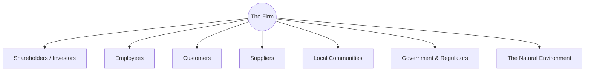

### (a)

#### Individual Factors in Ethical Decision Making

Individual factors represent the unique traits and characteristics that a decision-maker brings into an ethical dilemma. Among these, demographic and cultural attributes play a critical role in shaping moral perception, evaluation, and intent.

- **Age:**
  - **Moral Maturity:** According to Lawrence Kohlberg’s stages of moral development, cognitive moral reasoning typically develops and matures with age and life experience. Older individuals often possess a more established framework for ethical decision-making, moving from pre-conventional (self-interest) to conventional (social expectations) or post-conventional (universal principles) reasoning.
  - **Generational Differences:** Different age cohorts (e.g., Boomers, Gen X, Millennials, Gen Z) display distinct workplace values. Younger generations may place a higher emphasis on corporate social responsibility and environmental sustainability, influencing what they perceive as an ethical issue compared to older generations who might focus more on traditional organizational loyalty and compliance.
- **Gender:**
  - **Ethical Orientation:** Research suggests subtle differences in how genders approach ethical problems. Carol Gilligan’s work highlights that women may lean toward an _ethic of care_ (focusing on relationships, empathy, and avoiding harm), while men may emphasize an _ethic of justice_ (focusing on rules, rights, and objective principles).
  - **Ethical Sensitivity:** Numerous empirical studies indicate that female business students and professionals often exhibit higher ethical sensitivity and lower tolerance for questionable business practices than their male counterparts, though organizational socialization frequently narrows these gaps over time.
- **National and Cultural Characteristics:**
  - **Cultural Dimensions:** Geert Hofstede's cultural framework provides deep insight into how nationality affects ethics. For instance, individuals from _high collectivist_ cultures (e.g., Asian nations) prioritize group harmony, loyalty, and the welfare of the collective, making them more sensitive to decisions affecting stakeholders. Conversely, those from _individualistic_ cultures (e.g., Western nations) focus heavily on personal autonomy, rights, and individual achievement.
  - **Power Distance and Ethical Voice:** In cultures with _high power distance_, employees are less likely to question unethical directives from superiors due to deep-rooted respect for hierarchy. In _low power distance_ cultures, individuals feel more empowered to speak up, whistle-blow, or challenge authoritative ethical misconduct.

### (b)

#### Components of Business Ethics Management

Business ethics management refers to the formal and informal structures, systems, and processes designed to prevent, detect, and address unethical behavior within an organization. The core components include:

1. **Mission and Values Statements:** Clearly articulated foundational ideals that define the core principles and purpose of the organization.
2. **Codes of Ethics / Codes of Conduct:** Written documents specifying the standards of behavior, legal expectations, and moral responsibilities governing employee actions.
3. **Ethics Officers, Managers, or Committees:** Designated personnel or governing bodies responsible for overseeing compliance, updating policies, and coordinating ethics programs.
4. **Ethics Training and Communication Programs:** Systematic education sessions aimed at reinforcing code standards, developing ethical decision-making skills, and discussing realistic dilemmas.
5. **Reporting and Communication Channels:** Secure, confidential, and anonymous mechanisms (such as hotlines, ombudspersons, or digital dropboxes) that allow employees to seek advice or report misconduct without fear of retaliation.
6. **Auditing, Monitoring, and Evaluation Systems:** Continuous internal and external assessment procedures to evaluate compliance, identify vulnerabilities, and measure the effectiveness of the ethics program.
7. **Reward and Disciplinary Systems:** Accountability mechanisms that systematically reward ethical excellence and transparently penalize misconduct to reinforce the corporate culture.

### (c)

#### Classifications and Types of Ethical Codes

A code of ethics is an open statement of organizational values, rules, and expectations. These codes can be classified comprehensively both by their structural scope (level of operation) and by their fundamental management orientation.

##### Classification by Scope and Level

- **Organizational / Corporate Codes of Conduct:** These are specific to an individual firm. They outline the distinct corporate culture, policies, and behavior expected from employees within that company (e.g., Google's former "Don't be evil" policy or formal corporate handbooks).
- **Professional Codes of Ethics:** Established by professional associations to govern the conduct of individuals practicing in specific fields, regardless of their employer. Examples include codes for accountants (e.g., AICPA, ACCA), engineers (e.g., IEEE), or medical practitioners.
- **Industry Codes of Ethics:** Formulated collectively by a group of competing firms within a single industry sector to establish level baseline standards and maintain public trust (e.g., the chemical industry's _Responsible Care_ initiative or banking sector compacts).
- **International / Global Codes of Ethics:** Broad, transnational frameworks that address global issues like human rights, environmental protection, and labor standards across borders (e.g., the United Nations Global Compact or the Caux Round Table Principles).

##### Classification by Operational Focus

- **Compliance-Based Codes:** Focused primarily on strictly preventing illegal or rule-breaking behavior. They are heavily driven by legal frameworks, specific "dos and don'ts," strict monitoring, and explicit penalties for non-compliance.
- **Value-Based (Inspirational) Codes:** Driven by core philosophical principles and shared organizational aspirations. Rather than merely stating what is forbidden, they encourage active ethical excellence, corporate citizenship, and value alignment.

### (d)

#### Central Idea of Stakeholder Theory

The central idea of Stakeholder Theory—pioneered prominently by R. Edward Freeman in 1984—is that a business corporation does not exist solely to maximize wealth for its legal shareholders (the stockholder view); rather, it is fundamentally accountable to a much wider network of constituents known as **stakeholders**.

> [!info] Definitional Concept
> A **stakeholder** is defined as any individual, group, or institution that can affect or is affected by the achievement of the organization's objectives.

##### Key Tenets of the Theory

- **Principle of Interdependence:** The long-term survival, viability, and success of an organization depend heavily on the health and cooperation of its relationships with all key stakeholders. Neglecting one group (e.g., exploiting employees or deceiving customers) ultimately damages the entire corporate ecosystem.
- **Intrinsic Value:** Stakeholders are not mere instruments or resources to be used for the ultimate financial benefit of shareholders. Each group possesses legitimate claims and intrinsic value, meaning their rights and interests must be managed and respected as an end in themselves.
- **Managerial Responsibility:** The primary role of corporate executives is to balance, reconcile, and integrate these diverse and sometimes conflicting interests into a coherent business strategy, creating sustainable value for all participants rather than pursuing short-term shareholder maximization.
