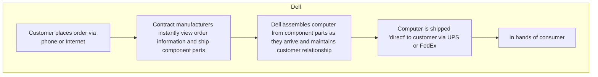

# Entrepreneurship Development (BCC 208)

## Chapter 1: Introduction to Entrepreneurship

### 2024 Examination - Question 1

- **[[ED 2024 Exam Q1#a|(a)]]** Define entrepreneur, corporate entrepreneurship, and entrepreneurship. **\[03]**

- **[[ED 2024 Exam Q1#b|(b)]]** Discuss the qualities of a successful entrepreneur. **\[04]**

- **[[ED 2024 Exam Q1#c|(c)]]** Explain the steps of the entrepreneurial process. **\[08]**

### 2023 Examination - Question 1

- **[[ED 2023 Exam Q1#a|(a)]]** Define Entrepreneurship. "Entrepreneurs Are Born, Not Made"—is it a myth or reality? Explain. **\[04]**

- **[[ED 2023 Exam Q1#b|(b)]]** Briefly explain the steps of the entrepreneurial process. **\[05]**

- **[[ED 2023 Exam Q1#c|(c)]]** Case Analysis:

  > \[!example] Case Study: Arif Hossain (Sylhet, Bangladesh)
  >
  > Arif Hossain, from Sylhet, Bangladesh, grew up in a modest farming family. Despite financial struggles, his parents emphasized the importance of education. After completing his business administration degree, Arif developed an interest in entrepreneurship, seeing it as a way to solve local challenges.
  >
  > Returning to his hometown, Arif noticed farmers struggled to sell their products due to limited market access while urban consumers sought high-quality organic food. He saw an opportunity to create a business connecting farmers to urban markets and promoting organic farming. This led to Green Harvest, a company designed to support farmers and meet the growing demand for organic products. Arif began by researching organic farming and the needs of farmers and consumers. He designed a business model in which farmers received training and resources like seeds and organic fertilizers in exchange for selling their products to Green Harvest. Arif set up a processing and packaging unit to ensure quality, marketing the products through social media and partnerships with urban grocery stores.
  >
  > In the beginning, Arif faced resistance. Farmers were skeptical about organic farming due to fears of reduced yields, while consumers questioned the authenticity of organic products. Arif tackled these challenges by offering workshops for farmers and sharing the transparency of farming practices with consumers. Within a year, Green Harvest gained recognition. More farmers joined the network, demand grew, and the business expanded, employing over 50 people. Green Harvest benefited farmers, consumers, and the environment, showing how entrepreneurship can create economic and social change. **\[2+2+2=06]**

  **Required:**

  - **[[ED 2023 Exam Q1#c_i|i.]]** Explain why educated people like Arif Hossain choose to start their businesses.
  - **[[ED 2023 Exam Q1#c_ii|ii.]]** How did Green Harvest affect farms and the farming business?
  - **[[ED 2023 Exam Q1#c_iii|iii.]]** What entrepreneurial traits did Arif exhibit?

### 2022 Examination - Question 1

- **[[ED 2022 Exam Q1#a|(a)]]** Define Entrepreneur and Entrepreneurship. "All you need is money to be an entrepreneur." Is it a myth or reality? Explain. **\[05]**

- **[[ED 2022 Exam Q1#b|(b)]]** Do you agree with the notion that entrepreneurs are born and not made? Explain your answer. **\[04]**

- **[[ED 2022 Exam Q1#c|(c)]]** Briefly explain the skills and abilities required to execute a business idea effectively. **\[06]**

### 2022 Examination - Question 2

- **[[ED 2022 Exam Q2#a|(a)]]** Case Analysis:

  > \[!example] Case Study: Rajesh & GreenFields
  >
  > Rajesh grew up in a rural village in Uttarpradesh, India where traditional customs and social hierarchies dictated life choices and opportunities. As a member of a marginalized community, Rajesh faced discrimination and limited access to education and economic resources. Unable to sustain itself in the middle of severe caste discrimination, Rajesh's family shifted to a village in a nearby state. Unable to enter mainstream job-oriented occupations, Rajesh decided to become an entrepreneur.
  >
  > At that time, the state government was promoting organic farming to foster healthier ecosystems by avoiding synthetic pesticides, herbicides, and fertilizers, which help to reduce chemical pollution. Conventional farmers were facing several challenges in adopting organic farming. Rajesh established a social enterprise called "GreenFields" dedicated to promoting organic farming techniques and empowering local farmers. His sufferings in early life led to his commitment to social justice, environmental sustainability, and community empowerment. His enterprise aimed to provide training, resources, and market access to smallholder farmers while promoting ecological resilience and food security. At the initial stage, Rajesh faced severe problems in financing GreenFields. Gradually he learnt the preparation of a financial plan that outlines sources of funding, budget allocation, and financial milestones for achieving profitability.

  **Required:**

  - **[[ED 2022 Exam Q2#a_i|i.]]** What are the different entrepreneurial schools of thought? **\[04]**
  - **[[ED 2022 Exam Q2#a_ii|ii.]]** Explain Rajesh's entrepreneurial journey using the macro views of entrepreneurial schools of thought. **\[04]**
- **[[ED 2022 Exam Q2#b|(b)]]** Complete the following table:

  |**Generation**|**Born between or after**|
  |---|---|
  |Baby Boomers||
  |Gen-Y||
  |Gen-X||
  |Gen-Z||
  |Gen Alpha||

  What are the generational differences in entrepreneurial activity? Which generation group are you in? Do you think your generation has a better opportunity to become entrepreneurs than the generations of the pre-internet world?
- **[[ED 2022 Exam Q2#c|(c)]]** What are the components of a university-based entrepreneurship ecosystem? Are you studying in an entrepreneurial university? Explain your answer. **\[03]**

### 2022 Examination - Question 3

- **[[ED 2022 Exam Q3#a|(a)]]** Case Analysis:

  > \[!example] Case Study: Sarah's Renewable Energy Startup
  >
  > Sarah is a driven and ambitious individual with a passion for innovation and problem-solving. With a background in engineering and a keen interest in sustainability, Sarah aspires to launch her renewable energy startup to address environmental challenges and promote clean energy solutions. Sarah begins her entrepreneurial journey by conducting market research, developing a business plan, and seeking funding for her startup. Along the way, she encounters numerous challenges, including funding rejections, technical setbacks, and market uncertainties.
  >
  > Despite these obstacles, Sarah demonstrates resilience, perseverance, and adaptability, leveraging her psychological characteristics to navigate challenges and pursue her entrepreneurial vision. She embraces experimentation and iteration, viewing failures as learning opportunities for refining her ideas and approaches. She embraces ambiguity and uncertainty, adapting her strategies and approaches in response to changing market dynamics and emerging challenges. She cultivates self-awareness, recognizing her strengths, weaknesses, and limitations, and seeking feedback and support from mentors and peers.

  **Required:**

  - **[[ED 2022 Exam Q3#a_i|i.]]** What are the key psychological characteristics and traits exhibited by Sarah that contribute to her entrepreneurial success? **\[2.5]**
  - **[[ED 2022 Exam Q3#a_ii|ii.]]** How can entrepreneurs cultivate and strengthen their psychological characteristics for entrepreneurial success? **\[2.5]**
- **[[ED 2022 Exam Q3#b|(b)]]** Case Analysis:

  > \[!example] Case Study: Innovation at Google
  >
  > Creativity has several different manifestations in Google. And one of the obvious loci of creativity at Google is called Google Labs, where a number of new ideas are incubated, a process whereby Google welcomes users' thoughts about new ideas. Based on those comments, they can determine whether to develop the ideas further or start on new ones. It was in these labs that many creative ideas, such as Google Maps and Google Glass, were developed.
  >
  > Google also has the belief that ideas come from anywhere. So, on top of Google platforms, developers from around the world are invited to work with the Google App Engine, Android and the Google Web Toolkit. They are given the opportunity to create, even though they are not themselves Google employees. Another aspect of the priority given by Google to creativity is the company's adherence to a '20% time philosophy', which encourages employees to allocate 20% of their worktime to developing side-projects and to working cross-functionally with other teams. Googlers are thus more empowered to think freely and implement new ideas and thoughts of benefit to the organisation as a whole.

  **Required:**

  - **[[ED 2022 Exam Q3#b_i|i.]]** From the above case, discuss the characteristics of firms with higher entrepreneurial intensity. **\[2.5]**
  - **[[ED 2022 Exam Q3#b_ii|ii.]]** How does Google differ from a conservative firm? **\[2.5]**
- **[[ED 2022 Exam Q3#c|(c)]]** What are the four specific areas of risk that entrepreneurs face? How can an entrepreneur deal with stress? **\[05]**

### 2021 Examination - Question 1

- **[[ED 2021 Exam Q1#a|(a)]]** Define the term: 'corporate entrepreneurship'. Name some organizations with high entrepreneurial intensity. **\[3]**

- **[[ED 2021 Exam Q1#b|(b)]]** Do entrepreneurs suffer more from mental disorders than other people? Answer the question considering the dark side of entrepreneurship. **\[4]**

- **[[ED 2021 Exam Q1#c|(c)]]** Case Analysis:

  > \[!example] Case Study: Islam's Generational Shift
  >
  > Islam is a successful first-generation entrepreneur who migrated from a remote village of Sonagazi, Noakhali to Chittagong City. He started out as a mechanic in Chittagong and dreamed of building a better future for his next generation. Islam was thrifty and disciplined. Although in a low-status occupation, he was very proud of how hard he worked. He took a few attempts with calculated risk and that paid off until he could open his own garage and he now runs a successful franchise business of several dozen oil and lube operations, where he trains other mechanics.
  >
  > Islam is a classical entrepreneur, but how should he teach his children? Does he encourage them to follow his lead and create financial success as entrepreneurs? The chances are he won't. Fewer than one in five do. Instead, Islam wants his children to have a 'better' life. He encourages them to spend many years at university. He wants his children to become physicians, lawyers, accountants, executives and so on. But in encouraging them so, Islam essentially discourages his children from becoming entrepreneurs. He unknowingly has them postpone their entry into the labor market until they have finished the finest education. And, of course, he encourages them to reject his lifestyle of thrift and the self-imposed environment of scarcity and instead to be consumers of material goods.
  >
  > Islam defines 'better' as having better 'stuff': finer homes, new cars, quality clothing and costly foods. What he doesn't include are the elements that were the foundation stones of his own success: hard work, risk taking and perseverance. Islam does not realize that being well educated but having a materialistic mentality has certain economic drawbacks. What Islam's well-educated children often learn by the time they are adults is to be the grand consumers of material goods. And at the same time, they are also underperformers as entrepreneurs. They are the opposite of their father; the blue-collar, successful business owner. They are part of the high-consuming, self-employment-postponing generation, and what's worse they still live at home enjoying the old man's wealth! **\[8]**

  **Required:**

  - **[[ED 2021 Exam Q1#c_i|i.]]** In your own experience, what are the social and cultural reasons that Islam's children are underachievers?
  - **[[ED 2021 Exam Q1#c_ii|ii.]]** Do you know people who are like Islam's children? Are you like them?
  - **[[ED 2021 Exam Q1#c_iii|iii.]]** What would you recommend 'to kick some sense' into their heads?

### 2021 Examination - Question 2

- **[[ED 2021 Exam Q2#b|(b)]]** How does cultural diversity affect entrepreneurship development? Explain your answer from a theoretical background. **\[4]**

- **[[ED 2021 Exam Q2#d|(d)]]** What are the basic principles of the entrepreneurship cycle? **\[3]**

### 2020 Examination - Question 1

- **[[ED 2020 Exam Q1#a|(a)]]** Define entrepreneur and entrepreneurship. **\[3]**

- **[[ED 2020 Exam Q1#b|(b)]]** Explain the major tasks of an entrepreneur. **\[5]**

- **[[ED 2020 Exam Q1#c|(c)]]** What are the essential characteristics of an entrepreneur? Explain in brief. **\[4]**

- **[[ED 2020 Exam Q1#d|(d)]]** Differentiate between an entrepreneur and an intrapreneur. **\[3]**

### 2019 Examination - Question 1

- **[[ED 2019 Exam Q1#a|(a)]]** Give two definitions each of 'entrepreneur' and 'entrepreneurship'. **\[2]**

- **[[ED 2019 Exam Q1#b|(b)]]** Discuss the qualities of a successful entrepreneur. **\[5]**

### 2019 Examination - Question 2

- **[[ED 2019 Exam Q2#a|(a)]]** What do you mean by entrepreneurial stress? What are the causes of entrepreneurial stress? How would you deal with this stress? **\[10]**

- **[[ED 2019 Exam Q2#b|(b)]]** State the needs and objectives of entrepreneurship development programs. **\[5]**

### 2019 Examination - Question 3

- **[[ED 2019 Exam Q3#a|(a)]]** Name the Psychological theories of entrepreneurship development. Discuss the 'Achievement Motivation Theory' of ED. **\[6]**

- **[[ED 2019 Exam Q3#b|(b)]]** What do you mean by locus of control? State the 'locus of control theory' of ED. **\[6]**

- **[[ED 2019 Exam Q3#c|(c)]]** Briefly discuss the 'Social Cohesion Theory' of ED. **\[3]**

### 2019 Examination - Question 6

- **[[ED 2019 Exam Q6#a|(a)]]** What is the entrepreneurship development cycle? Briefly discuss the activities included in the ED cycle. **\[11]**

## Chapter 2: Recognizing Opportunities and Generating Ideas

### 2024 Examination - Question 2

- **[[ED 2024 Exam Q2#a|(a)]]** Briefly explain the difference between opportunity and ideas. **\[02]**

- **[[ED 2024 Exam Q2#b|(b)]]** Identify and describe techniques entrepreneurs use to generate ideas. **\[05]**

### 2023 Examination - Question 2

- **[[ED 2023 Exam Q2#a|(a)]]** Briefly explain the difference between opportunity and idea. **\[02]**

- **[[ED 2023 Exam Q2#b|(b)]]** Identify and describe techniques entrepreneurs use to generate ideas. **\[05]**

### 2021 Examination - Question 4

- **[[ED 2021 Exam Q4#a|(a)]]** Identify the challenges in new product development. **\[4]**

### 2020 Examination - Question 2

- **[[ED 2020 Exam Q2#a|(a)]]** What is the difference between an opportunity and an idea? **\[3]**

- **[[ED 2020 Exam Q2#b|(b)]]** Describe the three general approaches entrepreneurs use to identify opportunities. **\[6]**

- **[[ED 2020 Exam Q2#c|(c)]]** Explain how to use the techniques to generate new business ideas. **\[6]**

## Chapter 3: Feasibility Analysis

### 2024 Examination - Question 3

- **[[ED 2024 Exam Q3#a|(a)]]** Explain the role of feasibility analysis in developing successful business ideas. **\[02]**

- **[[ED 2024 Exam Q3#b|(b)]]** Mention the four main components of a properly conducted feasibility analysis. **\[02]**

- **[[ED 2024 Exam Q3#c|(c)]]** Point out some methods used for an effective product/service feasibility analysis. **\[03]**

- **[[ED 2024 Exam Q3#d|(d)]]** You have just come up with an idea for a smart reusable water bottle that tracks hydration. How would you creatively test product desirability without spending much money? **\[02]**

- **[[ED 2024 Exam Q3#e|(e)]]** Case Analysis:

  > \[!example] Case Study: Tariq's Solar Cold Storage
  >
  > Tariq, a young entrepreneur from Rangpur, noticed that farmers in his area lose a large portion of their vegetable harvest due to lack of proper storage facilities. Most rely on selling produce immediately after harvest, often at low prices. Inspired by renewable energy solutions, Tariq proposes building solar-powered cold storage units that allow farmers to preserve vegetables longer and sell when prices are higher.
  >
  > He prepares a feasibility analysis. In the product/service test, farmers show interest but worry about rental costs. For the market feasibility, he finds many small farmers but limited awareness of solar technology. Organizational feasibility looks promising since an NGO is willing to provide technical support. Financial feasibility remains challenging because the upfront investment is high, though microfinance institutions show partial interest. Tariq wonders: Should he launch this idea now, or refine it further before scaling? **\[06]**

  **Required:**

  - **[[ED 2024 Exam Q3#e_i|i.]]** Which part of Tariq's feasibility analysis seems most critical to decide before launching? Why?
  - **[[ED 2024 Exam Q3#e_ii|ii.]]** How could Tariq use low-cost experiments to test farmers' willingness to pay?
  - **[[ED 2024 Exam Q3#e_iii|iii.]]** What "fatal flaw" could still threaten this business, even if everything looks feasible?

### 2023 Examination - Question 3

- **[[ED 2023 Exam Q3#a|(a)]]** Define feasibility analysis and explain its importance briefly. **\[04]**

- **[[ED 2023 Exam Q3#b|(b)]]** Imagine, after graduation, you want to start a restaurant at your university campus. What factors should you consider in conducting a market feasibility analysis for your business? How can you assess the financial feasibility? **\[06]**

### 2022 Examination - Question 4

- **[[ED 2022 Exam Q4#a|(a)]]** Gym Venture Scenario:

  > \[!info] Scenario: Female-Only Gym Venture
  >
  > You are planning to start a 'Female only Gym' inside or near the Chittagong University campus. The Gym will have the following advantages, among others: Privacy and comfort, developing a supportive community, tailored workouts and classes, fostering self-esteem to the female students, safety concerns, reducing gender stereotypes in society, health and hygiene support.

  **Required:**

  - **[[ED 2022 Exam Q4#a_i|i.]]** Prepare a concept statement for 'Female only Gym'. **\[06]**
  - **[[ED 2022 Exam Q4#a_ii|ii.]]** Briefly explain how you will conduct organizational and financial feasibility analysis for your new venture. **\[04]**

### 2021 Examination - Question 4

- **[[ED 2021 Exam Q4#b|(b)]]** Discuss the steps in conducting marketing research. **\[6]**

### 2021 Examination - Question 5

- **[[ED 2021 Exam Q5#a|(a)]]** You are planning to open a restaurant near the CU Railway Station targeting the students of CU. Your target customer will be those students who either earn a good amount (more than Tk. 20,000) or received the same from their parents. Prepare a concept statement for the restaurant. Briefly write how you would use the concept statement to conduct a buying intention survey. **\[6]**

### 2020 Examination - Question 3

- **[[ED 2020 Exam Q3#a|(a)]]** What is feasibility analysis? **\[3]**

- **[[ED 2020 Exam Q3#b|(b)]]** When to conduct a feasibility analysis? **\[3]**

- **[[ED 2020 Exam Q3#c|(c)]]** Discuss different forms of feasibility analysis. **\[9]**

## Chapter 4: Writing a Business Plan

### 2024 Examination - Question 2 (Continued)

- **[[ED 2024 Exam Q2#c|(c)]]** Define business plan. Explain the two primary reasons for writing a business plan. **\[03]**

- **[[ED 2024 Exam Q2#d|(d)]]** Suppose one of your friends wants to start a business. Give him a guideline for writing a business plan. **\[05]**

### 2024 Examination - Question 4

- **[[ED 2024 Exam Q4#b|(b)]]** Mention 2 reasons for writing a business plan. Who reads the plan and what are they looking for when doing so? **\[03]**

- **[[ED 2024 Exam Q4#c|(c)]]** Briefly point out the main contents of a business plan. **\[04]**

- **[[ED 2024 Exam Q4#d|(d)]]** Case Analysis:

  > \[!example] Case Study: EcoPack Bangladesh
  >
  > Rafiq, a young entrepreneur from Dhaka, noticed the growing problem of plastic waste in urban areas. He decided to launch EcoPack Bangladesh, a startup producing biodegradable packaging materials for local restaurants and e-commerce businesses. After conducting preliminary market research, Rafiq identified that many small businesses were willing to pay slightly more for eco-friendly packaging if it helped them appeal to environmentally conscious customers.
  >
  > Rafiq drafted a business plan outlining his mission, target market, and value proposition. He included a marketing strategy focusing on social media campaigns and partnerships with eco-conscious brands. Operationally, he planned to source raw materials from a supplier and establish a small production facility near Dhaka. The financial section projected initial investment requirements of BDT 15 lacs, break-even within 18 months, and a net profit margin of 12% by year two. To secure funding Rafiq prepared an executive summary highlighting both environmental impact and potential financial returns. However, potential challenges included competition from imported packaging products, fluctuating raw material costs, and convincing traditional businesses to switch from plastic. **\[06]**

  **Required:**

  - **[[ED 2024 Exam Q4#d_i|i.]]** Identify the key components of Rafiq's business plan.
  - **[[ED 2024 Exam Q4#d_ii|ii.]]** How does Ecopack's value proposition address a market need in Bangladesh?
  - **[[ED 2024 Exam Q4#d_iii|iii.]]** How can a strong business plan help Rafiq secure funding from investors?

### 2023 Examination - Question 2 (Continued)

- **[[ED 2023 Exam Q2#c|(c)]]** Define the business plan. Explain the two primary reasons for writing a business plan. **\[03]**

- **[[ED 2023 Exam Q2#d|(d)]]** Suppose one of your friends wants to start a business. Give him a guideline for writing a business plan. **\[05]**

### 2022 Examination - Question 5

- **[[ED 2022 Exam Q5#a|(a)]]** Write your understanding of a business plan. What are the advantages of preparing a business plan for a new venture? **\[04]**

- **[[ED 2022 Exam Q5#b|(b)]]** Briefly explain the differences among a summary business plan, a full business plan, and an operational business plan. **\[05]**

- **[[ED 2022 Exam Q5#c|(c)]]** If you are developing a completely new product or service, what type of information should you include in your business plan regarding the status of the development efforts? **\[04]**

- **[[ED 2022 Exam Q5#d|(d)]]** Who reads the business plan? **\[02]**

### 2021 Examination - Question 5

- **[[ED 2021 Exam Q5#b|(b)]]** What are the differences between a full business plan and an operational plan? Describe the red flags in writing business plans. **\[05]**

### 2020 Examination - Question 4

- **[[ED 2020 Exam Q4#b|(b)]]** Explain the difference among a summary business plan, a full business plan, and an operational business plan. **\[3]**

### 2019 Examination - Question 7

- **[[ED 2019 Exam Q7#a|(a)]]** What is a business plan? State the importance of a business plan. **\[7]**

## Chapter 5: Developing an Effective Business Model

### 2024 Examination - Question 4 (Continued)

- **[[ED 2024 Exam Q4#a|(a)]]** What is the best time for a firm to develop its business model? **\[02]**

### 2023 Examination - Question 6

- **[[ED 2023 Exam Q6#b|(b)]]** Describe the key aspects of standard business models and disruptive business models. **\[06]**

### 2023 Examination - Question 7

- **[[ED 2023 Exam Q7#a|(a)]]** Case Analysis:

  > \[!example] Case Study: TOMS Shoes - A Business with Purpose
  >
  > TOMS Shoes, founded by Blake Mycoskie in 2006, is a prime example of a business with a strong social mission. The idea for TOMS originated during a trip to Argentina, where Blake noticed that many children were walking barefoot, leading to health risks and infections. Moved by the children's plight, Blake decided to create a company that would sell shoes and give back to those in need.
  >
  > The result was TOMS Shoes, a brand that adopted the "One for One" business model: for every pair of shoes sold, TOMS would donate a pair to a child in need. This business model combined commerce with a meaningful social impact, setting TOMS apart from traditional footwear companies. The "One for One" model quickly captured the attention of socially-conscious consumers who wanted to make a difference through their purchases. TOMS provided an opportunity for people to contribute to a greater cause without having to make additional charitable donations. As a result, TOMS became an instant success, with its shoes meeting a practical need and fulfilling a desire to help others.
  >
  > In the following years, TOMS expanded its mission, diversifying its product line and introducing eyewear and coffee. Each product was tied to a different giving initiative—TOMS eyewear helped restore sight to people in developing countries, while the company's coffee sales supported clean water projects. This expansion allowed TOMS to reach new markets while using its platform to support critical global causes.
  >
  > However, TOMS faced criticism over time. Critics argued that simply donating shoes could create dependency and disrupt local economies. In response, TOMS adapted its strategy by focusing on job creation, sustainable practices, and partnerships with local artisans to ensure its positive and long-lasting impact. TOMS Shoes is a powerful example of how a business can thrive while staying true to its purpose. TOMS has shown that companies can play a key role in addressing global challenges by blending profit with social impact. **\[3+3+3=09]**

  **Required:**

  - **[[ED 2023 Exam Q7#a_i|i.]]** How does TOMS Shoes integrate social responsibility into its business model?
  - **[[ED 2023 Exam Q7#a_ii|ii.]]** What criticisms did TOMS face in its efforts to make a positive social impact?
  - **[[ED 2023 Exam Q7#a_iii|iii.]]** How did TOMS respond to criticism about its "One for One" business model?

### 2021 Examination - Question 5

- **[[ED 2021 Exam Q5#c|(c)]]** The following figure shows Dell's approach to selling PCs versus Traditional Manufacturers'. Based on the figure, describe the concept of business model innovation. **\[4]**

### 2020 Examination - Question 4

- **[[ED 2020 Exam Q4#a|(a)]]** What is a business model? Identify the two potential fatal flaws of a business model. **\[4]**

- **[[ED 2020 Exam Q4#c|(c)]]** Discuss the four major components of a business model. **\[8]**

## Chapter 6: Entrepreneurship Development through Small Business

### 2024 Examination - Question 7

- **[[ED 2024 Exam Q7#a|(a)]]** Case Analysis:

  > \[!example] Case Study: The Ahmed Family Handicraft Business
  >
  > The Ahmed family has been running a traditional handicraft business in Kushtia for over 30 years. Initially started by the father, the business specialized in producing hand-woven nakshi kantha and jute-based products, which became popular among local buyers and tourists. With time, the second generation—two sons and a daughter—joined the venture. However, conflicts have arisen regarding the business's future direction.
  >
  > The father prefers to maintain the traditional model, focusing on loyal local customers. On the other hand, the younger members want to modernize operations—introducing e-commerce, targeting international markets, and adopting professional management practices. Disagreements over succession planning, profit-sharing, and decision-making have created tension.
  >
  > Additionally, the business faces broader challenges common in Bangladesh's entrepreneurial landscape: limited access to financing, bureaucratic barriers in exports, lack of modern infrastructure, and competition from cheap machine-made imports. Despite these hurdles, the Ahmed family recognizes that innovation, professionalization, and a clear strategic plan are vital for long-term survival and growth. **\[08]**

  **Required:**

  - **[[ED 2024 Exam Q7#a_i|i.]]** What strategic management approaches could help the Ahmed family balance tradition and modernization?
  - **[[ED 2024 Exam Q7#a_ii|ii.]]** How can succession planning be effectively handled in a Bangladeshi family business context?
  - **[[ED 2024 Exam Q7#a_iii|iii.]]** What are the key challenges of entrepreneurship development in Bangladesh reflected in this case?
  - **[[ED 2024 Exam Q7#a_iv|iv.]]** Suggest strategies the family can adopt to expand internationally while preserving their cultural identity.

### 2022 Examination - Question 4 (Continued)

- **[[ED 2022 Exam Q4#b|(b)]]** What are the causes of small business failure? Draw a funding matrix to show a balanced debt-equity ratio for the business. **\[05]**

### 2021 Examination - Question 3

- **[[ED 2021 Exam Q3#a|(a)]]** What are the personnel management problems faced by small entrepreneurs in Bangladesh? Suggest some remedies for them. **\[5]**

- **[[ED 2021 Exam Q3#c|(c)]]** What are the causes of small business failure? **\[5]**

### 2019 Examination - Question 4

- **[[ED 2019 Exam Q4#a|(a)]]** What are the secrets of success of small businesses? **\[4]**

- **[[ED 2019 Exam Q4#b|(b)]]** Explain the symptoms of small business failure and contrast these symptoms with the symptoms of large-scale business failure. **\[6]**

- **[[ED 2019 Exam Q4#c|(c)]]** Do you see any evidence of the increasing or decreasing importance of small businesses in a country like Bangladesh? Explain. **\[5]**

## Chapter 7: Ethical, Legal and Financing Issues

### 2024 Examination - Question 5

- **[[ED 2024 Exam Q5#a|(a)]]** What are the prerequisites for building a strong ethical culture in a firm? **\[03]**

- **[[ED 2024 Exam Q5#b|(b)]]** Briefly discuss the 4 main financial objectives of an entrepreneurial firm. **\[04]**

- **[[ED 2024 Exam Q5#c|(c)]]** What is a forecast? What factors does a firm use to create its forecasts of future income and expenses? **\[03]**

- **[[ED 2024 Exam Q5#e|(e)]]** Why do firms prepare pro forma balance sheets? **\[02]**

### 2024 Examination - Question 6 (Continued)

- **[[ED 2024 Exam Q6#c|(c)]]** Define intellectual property. What are the four key forms of intellectual property? **\[03]**

- **[[ED 2024 Exam Q6#d|(d)]]** Case Analysis:

  > \[!example] Case Study: Nusrat's Heritage Threads
  >
  > Nusrat, a young entrepreneur from Dhaka, launched an online fashion brand named Heritage Threads, inspired by traditional Jamdani weaving. To stand out, she developed unique fusion designs blending Jamdani patterns with modern cuts. Soon after her business gained popularity, a larger fashion house copied several of her designs and marketed them under a similar brand name, confusing customers.
  >
  > Nusrat was frustrated as she invested heavily in design, brand identity, and online marketing. She realized she had not formally registered her brand name, logo, or applied for design protection. With sales declining due to imitation, Nusrat sought advice on how to protect her creations through intellectual property rights. She wanted to know whether trademarks, copyrights, or design patents would apply in her case and how these protections could help her business survive in a highly competitive Bangladeshi fashion market. **\[06]**

  **Required:**

  - **[[ED 2024 Exam Q6#d_i|i.]]** What forms of intellectual property protection are most relevant to Nusrat's business?
  - **[[ED 2024 Exam Q6#d_ii|ii.]]** How can trademark registration help protect Heritage Threads?
  - **[[ED 2024 Exam Q6#d_iii|iii.]]** What steps should Nusrat take immediately to safeguard her brand and designs?

### 2023 Examination - Question 4

- **[[ED 2023 Exam Q4#a|(a)]]** Case Analysis:

  > \[!example] Case Study: Alacritech vs. Microsoft
  >
  > Alacritech, a start-up firm, accused Microsoft of violating two of its patents on technology designed to improve the speed of network-connected computers. Initially, Alacritech shared its technology with Microsoft, hoping the company would license it. However, Microsoft declined and later introduced a similar technology called Chimney. After Alacritech's second attempt to license the technology was rejected, it filed a lawsuit claiming patent infringement.
  >
  > Microsoft argued that its technology was developed independently. The U.S. District Court in San Francisco issued a preliminary injunction preventing Microsoft from selling products with the disputed technology. Eventually, the case was settled out of court, with Microsoft agreeing to license Alacritech's technology. **\[03+02=05]**

  **Required:**

  - **[[ED 2023 Exam Q4#a_i|i.]]** Define patent. Why is securing and enforcing patents important for start-ups like Alacritech?
  - **[[ED 2023 Exam Q4#a_ii|ii.]]** Why did Alacritech file a lawsuit against Microsoft?

- **[[ED 2023 Exam Q4#b|(b)]]** Define trade secrets with an example. **\[02]**

- **[[ED 2023 Exam Q4#c|(c)]]** Define intellectual property. How does it differ from other properties like land, buildings, etc.? **\[05]**

- **[[ED 2023 Exam Q4#d|(d)]]** Define copyright. What is protected by copyright? **\[03]**

### 2023 Examination - Question 6 (Continued)

- **[[ED 2023 Exam Q6#a|(a)]]** What are the ethical considerations in entrepreneurship development? **\[06]**

### 2022 Examination - Question 6

- **[[ED 2022 Exam Q6#a|(a)]]** Case Analysis:

  > \[!example] Case Study: Dhaka Commercial Evictions
  >
  > The government's drive to force commercial establishments out of residential areas in Dhaka has not only created fears of job loss but also raised questions as to how those establishments operated with government clearance when rules clearly say they cannot. The Rajdhani Unnayan Kartripakkha (Rajuk) has been closing down businesses that have been running in residential areas for years. Dhaka North City Corporation (DNCC) and Dhaka South City Corporation (DSCC) have also warned businesses, which do not operate in Rajuk-approved commercial buildings or in commercial areas, that their trade licences would be cancelled.
  >
  > The DSCC is giving businesses a seven-day deadline to move out. A staggering 18,000 businesses in the capital, 13,500 of them under the DNCC, could lose their trade licences, according to data from the two city corporations. The High Court declared all commercial operations in Dhanmondi Residential Area illegal, with the exception of authorised commercial establishments on Mirpur Road, Satmasjid Road, Dhanmondi Road-2 and Dhanmondi Road-27. It directed the authorities to remove those establishments. The Appellate Division upheld the HC verdict. Utility service providers, like Dhaka Electric Supply Company (Desco), have started issuing notices on commercial establishments in residential areas seeking their occupancy certificates.
  >
  > Most of these businesses -- restaurants, hotels, guesthouses and various retailers -- are in Dhanmondi, Gulshan, Banani and Uttara. The number of guesthouses and hotels would be about 500, according to an estimate of a hotel and restaurant owners' association. They all face closure unless they relocate to commercial areas.
  >
  > However, businesses asked why government agencies, such as the city corporations, utility service providers and VAT offices, issued them trade licences, supplied electricity and provided other services at commercial rates when they were not allowed to do business in residential areas in the first place. Some questioned Rajuk's silence when the business establishments started running in its residential neighbourhoods. The businesspeople think that, "It was the duty of the government agencies to stop the opening of any commercial entities at the very beginning. People may have a tendency to violate rules but there are authorities to enforce the law."

  **Required:**

  - **[[ED 2022 Exam Q6#a_i|i.]]** Which side do you agree with in this case - Government or businesspeople? Explain your answer. **\[03]**
  - **[[ED 2022 Exam Q6#a_ii|ii.]]** If you started a business, how would you go about determining the proper licenses and permits to obtain, and whether there are additional government regulations that affect the product or service you plan to offer? Relate your answer to the above case. **\[04]**

- **[[ED 2022 Exam Q6#b|(b)]]** Discuss the actions founders can take to establish a strong ethical culture in their entrepreneurial ventures.

- **[[ED 2022 Exam Q6#c|(c)]]** Discuss the steps entrepreneurs can take to avoid legal disputes and complications.

### 2021 Examination - Question 6

- **[[ED 2021 Exam Q6#a|(a)]]** Suppose you, as an owner, are struggling to tackle the legal complexities of your start-up business. What are some of the more important criteria you will consider when selecting a consultant lawyer for your new firm? **\[5]**

### 2020 Examination - Question 5

- **[[ED 2020 Exam Q5#a|(a)]]** What do you mean by a founder's agreement? **\[3]**

- **[[ED 2020 Exam Q5#b|(b)]]** Describe how to create a strong ethical culture in an entrepreneurial venture. **\[5]**

- **[[ED 2020 Exam Q5#c|(c)]]** Discuss the four major forms of intellectual property. **\[7]**

## Chapter 8: Building a New Venture Team and Getting Funding

### 2024 Examination - Question 5 (Continued)

- **[[ED 2024 Exam Q5#d|(d)]]** Define liability of newness. How can a new venture overcome the liability of newness? **\[03]**

### 2024 Examination - Question 6

- **[[ED 2024 Exam Q6#a|(a)]]** Why do startup firms need capital investments? Will they be able to sustain themselves without capital investment? **\[03]**

- **[[ED 2024 Exam Q6#b|(b)]]** What are the sources of personal financing available to entrepreneurs? **\[03]**

### 2023 Examination - Question 5

- **[[ED 2023 Exam Q5#b|(b)]]** Imagine you want to start a business. As an entrepreneur, explain the sources from where you can arrange funds to start or grow your business. **\[07]**

### 2023 Examination - Question 6 (Continued)

- **[[ED 2023 Exam Q6#c|(c)]]** State the elements of a new venture team. **\[03]**

### 2022 Examination - Question 7

- **[[ED 2022 Exam Q7#a|(a)]]** Describe a new-venture team and discuss the primary elements that form such a team.

- **[[ED 2022 Exam Q7#b|(b)]]** What are the common mistakes made in putting together a new-venture team?

### 2021 Examination - Question 4 (Continued)

- **[[ED 2021 Exam Q4#c|(c)]]** What problems do small firms face in financing? Explain briefly. **\[5]**

### 2020 Examination - Question 6

- **[[ED 2020 Exam Q6#a|(a)]]** Why do most new ventures need financing or funding? **\[3]**

- **[[ED 2020 Exam Q6#b|(b)]]** Discuss the primary elements of a new venture team. **\[5]**

### 2019 Examination - Question 5

- **[[ED 2019 Exam Q5#a|(a)]]** Some entrepreneurs do not like to seek new venture financing because they feel that venture capitalists are greedy. In your opinion, is this true? Do these capitalists want too much? **\[7]**

- **[[ED 2019 Exam Q5#b|(b)]]** In a new-venture evaluation, what are the four stages through which a proposal typically goes? Describe each in detail. **\[8]**

### 2019 Examination - Question 7 (Continued)

- **[[ED 2019 Exam Q7#b|(b)]]** What is debt finance? Discuss the merits and demerits of debt financing for BMRE of an industry. **\[8]**

## Chapter 9: Managing and Growing an Entrepreneurial Firm

### 2023 Examination - Question 3 (Continued)

- **[[ED 2023 Exam Q3#c|(c)]]** Explain the internal and external growth strategy for entrepreneurial firms. **\[05]**

### 2022 Examination - Question 7 (Continued)

- **[[ED 2022 Exam Q7#c|(c)]]** Is it possible for a firm to grow too fast? What are the warning signs that a business is growing too fast?

- **[[ED 2022 Exam Q7#d|(d)]]** Discuss the six most common reasons firms pursue growth.

### 2021 Examination - Question 6 (Continued)

- **[[ED 2021 Exam Q6#b|(b)]]** Briefly discuss the stages in the organizational life cycle. **\[5]**

- **[[ED 2021 Exam Q6#c|(c)]]** What are the steps involved in setting up a franchise system? Differentiate between a product and trademark franchise and a business format franchise with appropriate examples. **\[5]**

### 2021 Examination - Question 7

- **[[ED 2021 Exam Q7#a|(a)]]** Based on the article given below, explain the reasons for business failure. Cite specific examples.

- **[[ED 2021 Exam Q7#b|(b)]]** Is it possible for a firm to grow too fast? If so, what are the potential downsides? Did you find any such case in the story below? Explain the case.

- **[[ED 2021 Exam Q7#c|(c)]]** Is it possible for something to be an enticing business idea but a poor business? Explain your answer with an appropriate example from the article below. **\[15]**

  > \[!info] Article Text Reference: Failures in the Bangladeshi Market & Global Context
  >
  > In the age of mass digitalization, BTCL launched a locally assembled laptop branded as Doel. It was assumed that Doel would capture the entire market of Bangladesh. But Bangladeshi locally assembled laptop Doel failed in marketing competition with HP, Asus and other globally recognized brands. The consumers of Bangladesh are habituated to buy at lower prices, but when it comes to the question of electric equipment, they like to purchase the one of higher quality in spite of premium pricing. This is cent percent true for products like laptops. If you offer someone a laptop of low configuration, he will rather buy a mobile of better configuration with the same price. If you think consumers compromise with brand quality in all cases, you are wrong. 'One size fits all' is a mass marketing concept which has become backdated recently.
  >
  > Walton offered mobile phones and laptops, but because of poor branding, both mobile and laptop lines of Walton did not survive the market competition. Sometimes market leaders also fail for lack of strong succession. If a father cannot leave behind him a strong successor, all fall like a game of cards. The best example is Otobi. Inspired by global brand IKEA, Hatil, Otobi, and many entrepreneurs came to the market of Bangladesh. But failure to retain business by the son of Nitun Kundu, owner of Otobi, caused it to become a bankrupt organization at the day end. Instead of emphasizing company strength, owners of Otobi emphasized business diversification and through fund diversion they tried to revolutionize the power sector. Consequently, both the power sector and home furnishing businesses failed together and now Otobi is in an existential crisis. It would have been better for Otobi to invest more on its house furnishing business instead of the power sector with its retained earnings and bank loans.
  >
  > It is not possible for a global brand to gain popularity in all countries of the world in the same ratio. The common case study is of Starbucks' failure in Australia. In spite of becoming the market leader in the USA and many European countries, Starbucks was below the benchmark compared to coffee shops like Gloria Jean's. Because Starbucks expanded so fast in Australia from the beginning of the year 2000, it did not even get sufficient time to understand Australian customers' appetite. The coffee culture is historical in Australia, but it was a different type of coffee than the one Starbucks offered, since Starbucks failed to understand consumer behavior in Australia. When you fail to understand consumer behavior of some place, the business is bound to meet with failure.
  >
  > When Cell Bazar, an online shopping and delivery service, went into rebranding as Ekhanei.com, it started to lose its market share. Consumers in Bangladesh, especially in Dhaka, were so much acquainted with the name Cell Bazar that the new name just confused them. Again, the way Ekhanei.com tried to rebrand itself was a blunder. Instead of understanding the existing customer base, they tried to bring unnecessary change, mistakenly considering it innovation. Online marketing companies like Bikroy.com, which emerged as a startup and competitor of Cell Bazar, occupied their market share gradually and later became the market leader. At one point of time, the online sale shop Ekhanei.com was shut down with sudden notice. From this marketing failure, the learning is that it is not always the first mover who retains the major market share for long. The world of marketing is not for the first mover, but for the fast mover.
  >
  > Now come to the telecom sector of Bangladesh. Why did all other telecom operators crush before Grameen Phone one by one? Instead of focusing on the reason for Grameen Phone's success story, let us make an autopsy on the failures of its competitors. In spite of becoming the first telecom operator in Bangladesh, City Cell failed to get customers' trust and brand loyalty due to shortsightedness. The case study of CCD, the famous Indian coffee brand, teaches us that if you divert your funds elsewhere from the core business (here coffee sales) while you run it with a bank loan, a day may come when you will be debt-ridden with huge bank loans and the diverted fund will be of no use to save you.
  >
  > This Indian local Coffee brand CCD case study is also applicable to City Cell mobile, which diverted all their earnings elsewhere while they took huge bank loans to run the telecom company, ultimately resulting in huge bankruptcy. Even their internet-based data business under the banner of Zoom failed to recover the company ultimately. On the other hand, Warid Telecom Bangladesh, a subsidiary of Warid Telecom Pakistan, tried to play the best by strong investment in marketing and branding, but Warid Telecom's sudden acquisition by Indian Airtel demanded rebranding and repositioning with huge and fresh investment. Rebranding is also time-consuming after a new entry. Starting afresh, Airtel invested no less than Grameen Phone for branding through newspapers and television advertisements. But Airtel failed to ensure similar network strength and service quality like Grameen Phone.
  >
  > Neither Airtel nor Robi were in a position to invest equally on tower building for network expansion like Grameen Phone. Besides, while Airtel was being defeated in every step by Ambani Group's Telecom called Jio in India, Grameen Phone's parent company Telenor led the global telecom market with desperate success. Grameen Phone inherited and exploited the success of Telenor as a brand image while Airtel failed to fight back with Jio in India. Robi also had the option to revolutionize with 3G and 4G technology, where they also left no significant footprint.
  >
  > Do you know why many globally reputed foreign banks are losing market share in Bangladesh? They failed to explore financial inclusion and financial deepening, which many local banks have been doing successfully by branding credit cards, home loans, auto loans, and app-based service offers etc. The paradigm shift from corporate to retail and SMS banking is something which foreign banks did not address positively.
  >
  > Lastly, international coffee chains like Barista, Gloria Jean's, and the oldest Nescafe's failure before tea companies like Lipton or Ispahani is due to inadequate addressing of Bangladeshi consumers' taste level through branding. Equal branding, marketing, and Public Relations (PR) of coffee by concerned investors like tea investors might have shifted many tea lovers into coffee lovers, just like the paradigm shift from landline phones into mobile phones which took place in the 1990s and onward in Bangladesh. These coffee investors mainly overlooked the growing purchasing capacity of the people of Bangladesh who are already ready for a taste shift.
  >
  > Therefore, changing the signboard, logo, and theme color of an organization is not enough for branding or rebranding unless market penetration and expansion are prudent and judicious. If branding or rebranding gives the wrong message or insufficient message to consumers, the result becomes a disaster rather than a blessing.

### 2020 Examination - Question 6 (Continued)

- **[[ED 2020 Exam Q6#c|(c)]]** Describe the internal and external strategies for firms' growth. **\[7]**

## Chapter 10: Contemporary Issues in Entrepreneurship

### 2024 Examination - Question 7 (Continued)

- **[[ED 2024 Exam Q7#b|(b)]]** Case Analysis:

  > \[!example] Case Study: Shahnaz & Women Empowerment in Rangpur
  >
  > In recent years, Bangladesh has witnessed a remarkable rise in women entrepreneurs, contributing significantly to the economy and social development. One inspiring example is Shahnaz, who started a small handicraft business in Rangpur with just a few thousand taka. Initially, she faced challenges such as limited access to finance, lack of family support, and difficulty in reaching larger markets. However, through perseverance and training from a local NGO, she expanded her business, now employing 25 women from her community.
  >
  > Her enterprise produces eco-friendly products such as jute bags, handmade home décor, and traditional crafts, which are sold both locally and internationally. Shahnaz has become a role model, empowering women by providing employment opportunities and encouraging others to pursue entrepreneurship. Despite her success, challenges remain: accessing larger capital, competing with machine-made cheap imports, and navigating bureaucratic barriers. Yet, stories like hers highlight the resilience of women entrepreneurs in Bangladesh who not only uplift their families but also strengthen the nation's socio-economic fabric. **\[07]**

  **Required:**

  - **[[ED 2024 Exam Q7#b_i|i.]]** What challenges do women entrepreneurs like Shahnaz commonly face in Bangladesh?
  - **[[ED 2024 Exam Q7#b_ii|ii.]]** How did training and NGO support contribute to Shahnaz's success?
  - **[[ED 2024 Exam Q7#b_iii|iii.]]** In what ways can women-led enterprises impact communities and the broader economy?
  - **[[ED 2024 Exam Q7#b_iv|iv.]]** What policy measures could further encourage women entrepreneurship in Bangladesh?

### 2023 Examination - Question 5 (Continued)

- **[[ED 2023 Exam Q5#a|(a)]]** Would you prefer to be a social entrepreneur, a commercial entrepreneur with social values, or a sustainable entrepreneur? Explain. **\[04]**

- **[[ED 2023 Exam Q5#c|(c)]]** State the problems and constraints faced by the entrepreneurs of Bangladesh. **\[04]**

### 2023 Examination - Question 7 (Continued)

- **[[ED 2023 Exam Q7#b|(b)]]** Case Analysis:

  > \[!example] Case Study: Anika Rahman & "Crafted by Her"
  >
  > Anika Rahman, a young entrepreneur from Dhaka, Bangladesh, grew up in a family where education and independence were highly valued. She noticed a gap in the local market for affordable, high-quality handmade accessories, particularly those crafted by women in rural Bangladesh. Many of these artisans struggled to access wider markets and often depended on middlemen who took a large portion of their earnings.
  >
  > Determined to make a difference, Anika launched "Crafted by Her," an e-commerce platform connecting skilled women artisans from rural Bangladesh with urban consumers. Anika's vision was to create a sustainable business that not only provided unique, handmade accessories but also empowered women by giving them a direct avenue to sell their products at fair prices. The platform allowed customers to purchase handmade jewelry, bags, and home décor items while the artisans were paid fair wages for their work.
  >
  > Anika faced numerous challenges in starting her business. As a woman in a male-dominated business environment, she struggled to secure initial funding from investors. Building trust with rural artisans, many unfamiliar with e-commerce, also required significant effort. Anika overcame these challenges by partnering with local women's groups, organizing workshops to educate artisans about online selling, and investing her savings into the initial stages of the business.
  >
  > Over time, "Crafted by Her" gained popularity for its unique products and social mission. The platform expanded to include artisans from different regions of Bangladesh, helping to support hundreds of women financially. Anika's business provided women with a source of income and helped them gain recognition for their craftsmanship, boosting their confidence and social standing within their communities. Anika Rahman's story is a prime example of how women entrepreneurs in Bangladesh can use innovation to create businesses that succeed financially and have a lasting social impact. **\[03+03=06]**

  **Required:**

  - **[[ED 2023 Exam Q7#b_i|i.]]** What challenges did Anika face while building her business, and how did she overcome them?
  - **[[ED 2023 Exam Q7#b_ii|ii.]]** How does Anika's business contribute to Bangladesh's economic and social development?

### 2021 Examination - Question 2 (Continued)

- **[[ED 2021 Exam Q2#a|(a)]]** "Digital social media explore opportunities for women entrepreneurship in Bangladesh". Explain from a critical perspective. **\[4]**

- **[[ED 2021 Exam Q2#c|(c)]]** Identify and explain the technical aspects that stimulate entrepreneurship development. **\[4]**

### 2021 Examination - Question 3 (Continued)

- **[[ED 2021 Exam Q3#b|(b)]]** What are the government and non-government supporting institutions for entrepreneurship development in Bangladesh? Elaborate on the function of the SME Foundation and BSCIC regarding entrepreneurship development. **\[5]**

### 2020 Examination - Question 7

- **[[ED 2020 Exam Q7#a|(a)]]** What are the problems affecting entrepreneurial development in Bangladesh? What roles can trade associations play in solving these problems? **\[6]**

- **[[ED 2020 Exam Q7#b|(b)]]** Why is training and development needed for entrepreneurial success? What types of training do the entrepreneurs of Bangladesh receive regularly? **\[5]**

- **[[ED 2020 Exam Q7#c|(c)]]** Identify the role and scope of social media for small entrepreneurial development. **\[4]**

### 2019 Examination - Question 1 (Continued)

- **[[ED 2019 Exam Q1#c|(c)]]** Discuss the importance of entrepreneurship development in Bangladesh. **\[5]**

- **[[ED 2019 Exam Q1#d|(d)]]** State the individual problems of entrepreneurship development. **\[3]**

### 2019 Examination - Question 6 (Continued)

- **[[ED 2019 Exam Q6#b|(b)]]** Discuss the goals and objectives of the Bangladesh Small and Cottage Industries Corporation (BSCIC). **\[4]**
