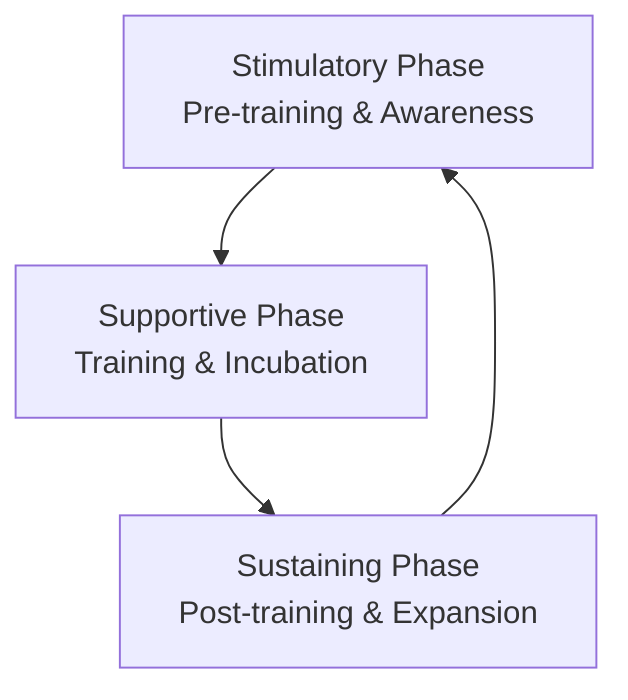

### (a)

#### The Entrepreneurship Development (ED) Cycle and Its Activities

The **Entrepreneurship Development (ED) Cycle** refers to a systematic, continuous, and multi-phased process designed to identify, motivate, train, and support individuals to help them transition into successful entrepreneurs. It serves as a structured institutional framework used by promotional bodies and support agencies to nurture entrepreneurship and accelerate industrial growth within an economy.
The ED cycle is broadly classified into three primary phases or sets of activities:

##### 1. Stimulatory Phase (Pre-training Activities)

This foundational phase focuses on generating widespread awareness, developing an entrepreneurial climate, and identifying potential candidates with business acumen. The key activities include:

- **Entrepreneurial Awareness Campaigns:** Organizing motivation camps, seminars, workshops, and publicity drives to educate the public about entrepreneurship as a viable and rewarding career alternative.
- **Opportunity Identification:** Assisting prospective entrepreneurs in scanning the local and international environment to pinpoint lucrative business opportunities, market gaps, and viable product concepts.
- **Selection of Potential Entrepreneurs:** Utilizing structured interviews, psychological evaluations (testing for achievement motivation, risk tolerance, and problem-solving capacities), and group discussions to select individuals with genuine entrepreneurial intent.
- **Program Resource Mapping:** Coordinating with financial, educational, and technical institutions to secure the curriculum and materials required for training.

##### 2. Supportive Phase (Training and Execution Activities)

Once potential entrepreneurs are selected, this phase focuses on equipping them with the practical capabilities, skills, and infrastructural inputs necessary to successfully launch their business ventures. The primary activities include:

- **Entrepreneurship Development Programs (EDPs):** Delivering formal training that builds core managerial competencies, including financial planning, operations management, human resource management, and marketing strategies.
- **Business Plan and Project Report Formulation:** Guiding trainees through data collection and market research to draft detailed, viable business plans suitable for institutional evaluation and funding.
- **Legal and Regulatory Compliance:** Assisting entrepreneurs in navigating government procedures, including business registration, securing trade licenses, obtaining Tax Identification Numbers (TIN), Value Added Tax (VAT) registration, and environmental clearances.
- **Infrastructural and Financial Linkages:** Facilitating allocations of industrial plots or factory sheds, establishing utility connections (electricity, gas, water), and arranging access to institutional finance, seed capital, or venture credit.

##### 3. Sustaining Phase (Post-training & Follow-up Activities)

The final phase ensures that newly established enterprises survive initial market friction, achieve continuous growth, and successfully withstand competitive pressures over the long term. The main activities include:

- **Post-Training Counseling and Follow-up:** Providing ongoing mentorship and diagnostic support to resolve unexpected operational bottlenecks or cash flow challenges during the startup phase.
- **Market Access and Linkages:** Helping new firms market their outputs by organizing industrial fairs, establishing buyer-seller meets, and creating supply-chain linkages with larger corporations or export bodies.
- **Modernization and BMRE Support:** Assisting growing enterprises with Balance, Modernization, Rehabilitation, and Expansion (BMRE) schemes to integrate updated technologies and optimize production capacity.
- **Rehabilitation of Sick Units:** Offering institutional diagnostics and financial restructuring blueprints to salvage ventures facing insolvency or operational stagnation.

### (b)

#### Goals and Objectives of Bangladesh Small and Cottage Industries Corporation (BSCIC)

The **Bangladesh Small and Cottage Industries Corporation (BSCIC)**, established via a legislative act in 1957, operates as the prime institutional body under the Ministry of Industries. It is responsible for the holistic development, growth, and promotion of micro, small, and cottage industries (SCIs) across Bangladesh.
The primary goals and objectives of BSCIC include the following:

- **Balanced Rural Industrialization:** Fostering the proliferation of small and cottage industries away from urban centers into rural, semi-urban, and economically underdeveloped regions to achieve geographically balanced economic development.
- **Mass Employment Generation:** Maximizing self-employment and wage-employment opportunities, particularly for the rural youth, unemployed demographics, and marginalized populations, thereby directly contributing to poverty alleviation.
- **Development of Industrial Estates:** Planning, establishing, and managing dedicated **BSCIC Industrial Estates** nationwide. These estates provide critical infrastructural resources—such as developed plots, uninterrupted electricity, gas, water supply, waste disposal facilities, and internal roads—to reduce the initial capital outlays for new entrepreneurs.
- **Socio-Economic Empowerment of Women:** Executing target-oriented training modules, skill development programs, and specialized microcredit facilities explicitly designed to integrate women into the mainstream industrial workforce and corporate landscape.
- **Preservation and Promotion of Cultural Heritage:** Supporting, modernizing, and expanding traditional handicrafts, handlooms, and cottage-level arts (such as Nakshi Kantha, traditional pottery, Jamdani, and jute-based crafts) to protect national heritage while enhancing their market export value.
- **Technical, Managerial, and Advisory Consultancy:** Delivering comprehensive pre-investment and post-investment advisory services, compiling industrial product profiles, imparting modern technological know-how, and providing diagnostic business counseling to existing and prospective industrial owners.
