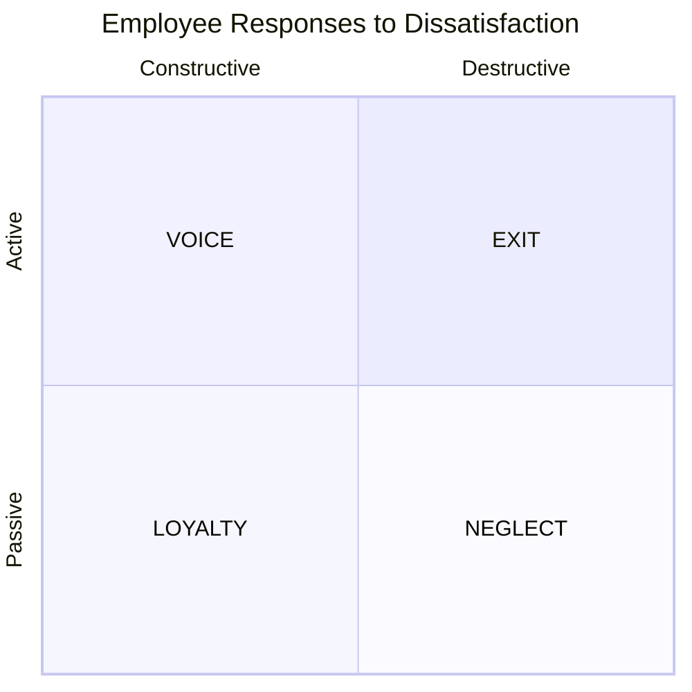
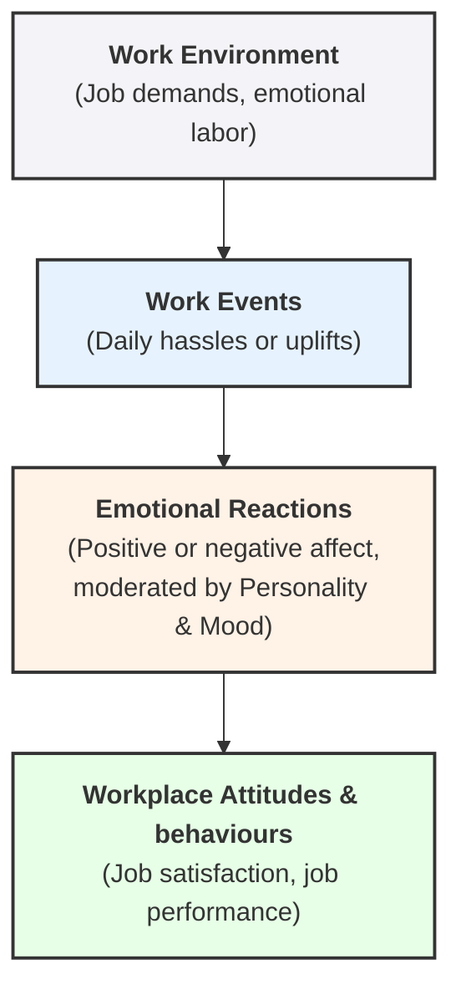
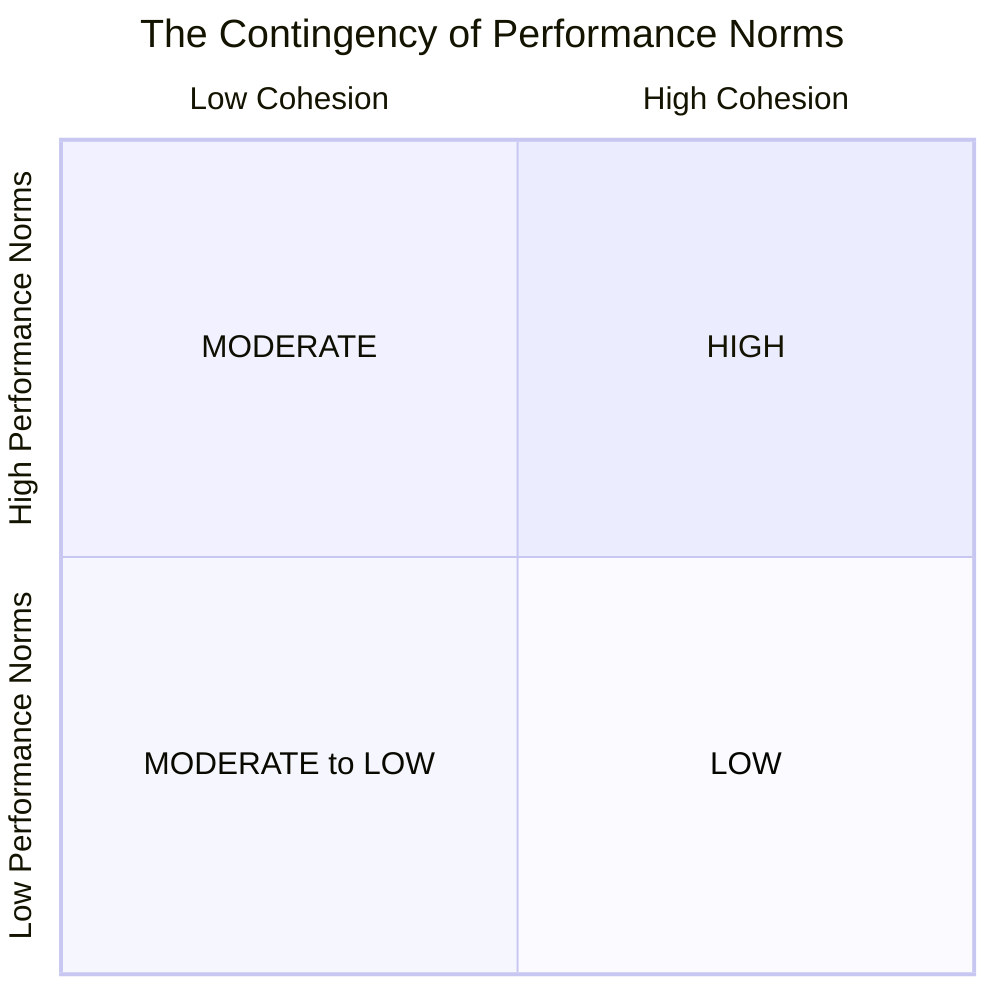
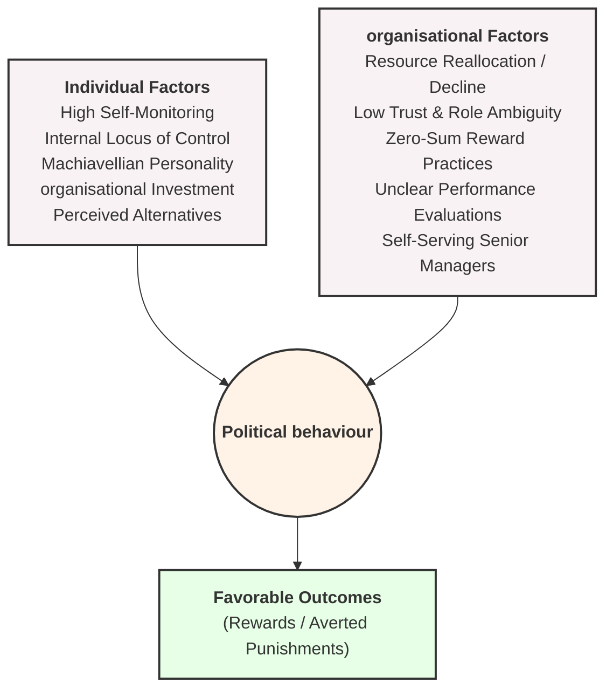

# Chapter 1: What Is Organisational Behaviour ?

## 1-1: Define Organisational Behaviour  (OB).

- **Field of Study:** Organisational Behaviour  (OB) is a distinct field of study that investigates the impact that individuals, groups, and structure have on behaviour within organisations.
- **Core Purpose:** The primary goal of applying this foundational knowledge is to directly improve an organisation's overall effectiveness.
- **Employment-Related Focus:** OB focuses specifically on employment-related situations, examining real-world behaviours in the context of core workplace topics such as job attitudes, motivation, leadership, and group dynamics.
- **Behavioural Outcomes:** The discipline measures and seeks to manage crucial organisational outcomes, including task performance, absenteeism, employee turnover, citizenship behaviour, and productivity.

> [!INFO] _The Importance of Interpersonal Skills:_
> Developing managers' interpersonal skills is critical because it helps organisations attract and keep high-performing employees, creates a pleasant and psychologically safe workplace, and directly translates into superior economic performance and lower turnover.

## 1-2: Show the value of systematic study to OB.

- **Predictability of behaviour:** Underlying OB is the core belief that human behaviour is generally not random; instead, consistencies can be identified to accurately predict future actions.
- **Scientific Evidence:** Systematic study involves examining clear relationships, attempting to attribute causes and effects, and drawing conclusions based entirely on rigorous scientific evidence gathered under controlled conditions.
- **Evidence-Based Management (EBM):** EBM complements systematic study by requiring managers to base critical business decisions on the best available scientific evidence rather than making decisions "on the fly".
- **Limitations of Intuition:** Relying strictly on "gut feelings" or intuition often works with incomplete information and leaves managers vulnerable to overestimating their own knowledge and falling prey to popular business fads.
- **Data-Driven Judgements:** Empirical data indicates that judgements backed by data algorithms are roughly 10 percent more accurate than a human's purely intuitive decisions.
- **The Role of Big Data and AI:** Advanced technologies, machine learning, and big data analysis allow modern organisations to predict behavioural trends, assess structural risks, and mitigate catastrophic failures with objective, real-time metrics.

## 1-3: Identify the major behavioural science disciplines that contribute to OB.

OB is an applied behavioural science built upon the distinct contributions of several core disciplines, categorised by their primary units of analysis:

### Individual Level (Micro Analysis)

- **Psychology:** The science that seeks to measure, explain, and sometimes change human and animal behaviour. It contributes heavily to understanding learning, personality, perception, training, leadership effectiveness, motivation, job satisfaction, and workplace stress.

### Group and organisational Levels (Macro Analysis)

- **Social Psychology:** An area of psychology blending concepts from psychology and sociology to focus on the direct influence of people on one another. It provides major insights into implementing change, communication patterns, building trust, and navigating power and conflict.
- **Sociology:** The study of people in relation to their social environment or overarching culture. It aids OB through the structural evaluation of group behaviours in formal, complex organisations, formal organisation theory, communication dynamics, and corporate politics.
- **Anthropology:** The specialized study of global societies to learn about human beings and their various activities. This discipline helps explain differences in fundamental values, cultural attitudes, and cross-cultural behaviours across distinct geographic borders.

## 1-4: Demonstrate why few absolutes apply to OB.

- **Human Complexity:** Human beings are inherently complex and completely diverse, which limits our ability to make simple, universal generalizations about behaviour.
- **Situational Variations:** Two distinct individuals will often react entirely differently when placed in the exact same situation; similarly, a single individual's behaviour changes across shifting contexts.
- **Contingency Variables:** Because universal laws do not exist for human actions, OB concepts must utilize contingency variables, which are situational factors that moderate the direct relationship between two or more variables.
- **The Formulaic Approach:** Rather than establishing definitive declarations, OB principles state that $x$ leads to $y$, but only under specific environmental or situational conditions defined by $z$.

## 1-5: Identify managers' challenges and opportunities in applying OB concepts.

- **Workforce Diversity and Inclusion:** Managers must transition from merely recognizing a heterogeneous workforce to actively building inclusive spaces that support workers of varying gender identities, ages, races, ethnicities, and sexual orientations.
- **Continuing Globalization:** Economic interdependence requires managers to successfully adapt to foreign expatriate assignments, master cross-cultural communication, and comprehend unique international legal and banking regulations.
- **Technology and Social Media:** The emergence of artificial intelligence, machine learning, and an "always-on" remote work culture requires managers to intentionally combat employee burnout, high stress, and severe work-life balance conflicts.
- **Ethical Dilemmas and Choices:** Intense market competition pressures workers to cut corners, requiring management to cultivate strong ethical cultures and climates to eliminate counterproductive work behaviours (CWB).
- **Corporate Social Responsibility (CSR):** Modern employees demand authentic alignment with the "triple bottom line" (people, planet, and revenue), which serves to boost positive employee attitudes and long-term financial performance.
- **Fostering Positive Work Environments:** Positive organisational scholarship urges managers to focus strictly on unlocking potential and building human strengths, engagement, and resilience rather than obsessing over limitations.
- **Navigating the Gig Economy:** The rise of independent contractors and temporary freelance arrangements creates challenges for managers in tracking career path uncertainty, job insecurity, and relational separation.

## 1-6: Compare the three levels of analysis in this text's OB model.

The overarching OB model features a clear hierarchical skeleton where **Inputs** lead directly to **Processes**, which subsequently dictate organisational **Outcomes** across three separate, escalating tiers:

| **Level of Analysis**    | **Inputs (Nouns that set the stage)**                   | **Processes (Verbs/actions that occur)**                                      | **Outcomes (Key variables to explain/predict)**                                              |
| ------------------------ | ------------------------------------------------------- | ----------------------------------------------------------------------------- | -------------------------------------------------------------------------------------------- |
| **Individual Level**     | Diversity Personality Values                      | Emotions and moods Motivation Perception Decision making             | Attitudes and stress Job performance Citizenship behaviour (OCB) Withdrawal behaviour |
| **Group Level**          | Group structure Group roles Team responsibilities | Communication Leadership Power and politics Conflict and negotiation | Team performance                                                                             |
| **organisational Level** | Structure Culture                                    | Human resource management Change practices                                 | Productivity (effectiveness/efficiency) Survival                                          |

## 1-7: Describe the key employability skills gained from studying OB that are applicable to other majors or future careers.

A foundational course in OB directly expands seven critical employability skills highly valued by hiring managers across all fields of study:

- **Critical Thinking & Creativity:** Purposeful, goal-directed thinking utilized to define and solve complex problems, form sound judgments, and generate novel, highly useful ideas.
- **Communication:** The effective execution of oral, written, and nonverbal skills across diverse contexts, encompassing active listening and the strategic application of communication technology.
- **Collaboration:** Restructuring individual efforts to actively work together as a unified team, constructing meaning and shared knowledge via dialogue and mutual negotiation to yield an interdependent product.
- **Self-Management:** The mental ability to intentionally and strategically regulate one's personal behaviours, workplace effort, and emotional expressions via self-control and monitoring to systematically accomplish targeted goals.
- **Social Responsibility:** Harmonizing core business operations with structural sets of guiding ethical principles, corporate social responsibility, and the absolute elimination of unethical economic or social actions.
- **Leadership:** Maximizing the behavioural capacity to positively influence an organized group toward the successful achievement of an established vision or overarching set of goals.
- **Career Management:** Cultivating a thorough understanding of the professional context, impression management, personal branding, and networking to transition between jobs fluidly.

# Chapter 2: Diversity, Equity, and Inclusion in organisations

## 2-1: Describe the two major forms of workplace diversity.

Workforce diversity represents the heterogeneous characteristics that make up organisations, work groups, and teams. It manifests at two primary levels:

- **Surface-level diversity**: Differences in easily perceived characteristics, such as gender, race, ethnicity, or age. These traits do not necessarily reflect how people think or feel but can easily activate stereotypes and assumptions among employees.
- **Deep-level diversity**: Differences in deeper characteristics such as values, personality, and work preferences. These characteristics become progressively more important for determining interpersonal similarity and cooperation as individuals get to know one another better.

Surface-level diversity is primarily driven by biographical characteristics, which are objective and easily obtained from human resources records. Core biographical characteristics include:

- **Race and Ethnicity**: Race is defined as the heritage people use to identify themselves, while ethnicity encompasses an overlapping set of cultural characteristics. Due to systemic racism, minorities frequently experience higher levels of workplace discrimination, lower interview ratings, less pay, and fewer promotions.
- **Age**: With the global aging of the workforce and the outlawing of mandatory retirement, age diversity is increasingly critical. While stereotypes depict older workers as inflexible or unmotivated by technology, research reveals virtually no relationship between age and job performance. Furthermore, job satisfaction typically increases with age due to rising pay and benefits.
- **Gender Identity and Sexual Orientation**: Gender identity reflects a person's deeply held internal sense of gender, which may not match their biological sex at birth. Sexual orientation describes enduring physical, emotional, or romantic attraction patterns. Neither characteristic impacts leadership capacity or job performance, yet biases persist through the "glass ceiling" and the "glass cliff"—where women are disproportionately selected for precarious crisis-management leadership positions set up for failure.

## 2-2: Demonstrate how workplace prejudice and discrimination undermines organisational effectiveness.

Effectively managing diversity requires identifying and eliminating negative attitudes and actions within the workplace:

- **Prejudice**: An attitude representing broad, generalized feelings toward a group or its members designed to maintain structural hierarchies between groups.
- **Implicit Bias**: Prejudice that is hidden completely outside of an individual’s conscious awareness, which can covertly skew hiring decisions and performance evaluations.
- **Discrimination**: The behavioural manifestation of prejudice, consisting of actions that create, maintain, or reinforce advantages for certain groups over others.

### Forms of Workplace Discrimination

organisations and individuals can display discrimination through multiple formats:

- **Discriminatory Policies or Practices**: Corporate actions or mandates that deny equal opportunities or rewards for equal performance, such as targeting highly-paid older workers during corporate layoffs.
- **Sexual Harassment**: Unwanted sexual advances or verbal/physical conduct of a sexual nature that fosters a hostile or offensive working environment.
- **Intimidation, Mockery, and Insults**: Overt bullying, threats, exclusions, negative stereotypes, or targeted jokes directed at minoritized employees.
- **Exclusion and Incivility**: Covert styles of discrimination where certain groups are left out of job opportunities, mentoring, or social events, or are treated with intentional disrespect (e.g., cutting off women attorneys while speaking).

### Disparate Impact vs. Disparate Treatment

- **Disparate Impact**: Occurs when neutral or unintentional employment practices (such as reviewing unstructured candidate social media profiles) result in an unaligned, discriminatory effect on legally protected groups.
- **Disparate Treatment**: Occurs when employment practices are intentionally implemented to have a direct, discriminatory effect on a protected group.

### Impacts on organisational Effectiveness

Unfair discrimination directly damages corporate performance:

- Employees who perceive discrimination suffer from higher workplace stress, felt injustice, negative job attitudes, and poor physical and psychological health.
- organisations experience minimized productivity, reduced organisational citizenship behaviours (OCB), elevated workplace conflict, higher employee turnover, and increased organisational risk-taking behaviour.

## 2-3: Explain how four major theoretical perspectives contribute to our understanding of workplace diversity.

- **Social Categorization**: The cognitive process through which individuals make sense of the world by using heuristics to group people into social categories based on shared characteristics. This process creates a distinct psychological division between the "ingroup" ("us") and the "outgroup" ("them"). It sparks ingroup favoritism and outgroup derogation, which can fragment teams and depress performance.
- **Stereotyping, Stereotype Threat, and Stigma**:
  - _Stereotyping_ involves judging someone entirely based on the perception of the group to which they belong.
  - _Stereotype Threat_ describes the psychological anxiety individuals experience when they fear being judged or treated negatively based on a specific group stereotype. This threat can deplete working memory ("brain drain"), induce self-handicapping, cause underperformance on tests, or lead to overcompensation.
  - _Stigma_ represents concealable, non-visible attributes that convey a devalued identity in certain social contexts (such as hidden sexual orientation or working in "dirty work" occupations like debt collection).
- **System Justification and Social Dominance**:
  - _System Justification Theory_ proposes that individuals often accept, rationalize, or justify systemic inequalities, prejudice, and discrimination because of a psychological belief in a fair world or due to feelings of low personal control.
  - _Social Dominance Theory_ asserts that prejudice is driven by complex group hierarchies where a dominant group holds exclusive privilege. Individuals with a high Social Dominance Orientation (SDO) strongly support these hierarchies, judge low-status individuals harshly, and are attracted to non-diverse, high-status organisations.
- **Intersectionality and the Cultural Mosaic**:
  - _Intersectionality_ emphasizes that human identities are not merely the sum of independent traits, but multiplicative combinations that interact to create unique systemic experiences. For example, minority women face a "double jeopardy" where multiple activated stereotypes result in compounding harassment or leadership penalties.
  - _Cultural Mosaic Theory_ views individuals as a complex collection of multiple geographical, biographical, and associative "tiles" (e.g., age, location, and employer) that influence daily workplace interactions. Emphasizing this multicultural, mosaic-based framework reduces stereotyping and builds support for diversity policies.

## 2-6: Describe how organisations manage diversity effectively.

- **Diversity Management Definition**: Incorporating evidence-based strategies to manage and leverage workforce diversity, expanding into a holistic focus on Diversity, Equity, and Inclusion (DEI).
  - _Diversity_ enhances the representation of marginalized groups.
  - _Equity_ provides fair access to opportunities while eliminating structural barriers and establishing multicultural meritocracies.
  - _Inclusion_ builds environments where all unique voices are actively valued, welcomed, and consulted.
- **Theoretical Paradigms**:
  - _Common Ingroup Identity Model_: Fosters inclusion by cognitively reframing workers' psychological focus from divisive categories ("us" and "them") to an overarching shared identity ("we").
  - _Contact Hypothesis_: Proposes that increasing structured, high-quality interaction between diverse individuals reduces prejudice and discrimination over time.
- **Diversity Management Practices**:
  - _Leading for Diversity_: Leaders must embrace humility, champion diversity as a resource, promote positive intergroup interactions, and use "oppositional courage" to dismantle exclusionary barriers.
  - _Diversity Recruitment and Staffing_: Targeting job advertisements to underrepresented populations and utilizing structured, objective selection protocols to eliminate implicit bias and minimize disparate impact.
  - _Diversity Training and Development_: Implementing tailored educational programs that detail equal employment opportunity laws, demonstrate how diversity enhances customer service capabilities, and utilize goal setting to motivate real-world application.
- **Cultures and Climates for Diversity**:
  - _Diversity Culture_ reflects an organisation’s deep-seated values prioritizing inclusion.
  - _Diversity Climate_ describes the shared perceptions among employees that corporate diversity policies are actively enforced. A strong diversity climate boosts customer satisfaction, employee retention, and overall financial performance.
- **Core Challenges**: organisations must actively overcome _tokenism_ (such as "twokenism"—hiring exactly two minoritized individuals simply to conform to peer standards), mitigate perceived inauthenticity ("all talk"), and navigate complex external structural or geopolitical barriers.

# Chapter 3: Job Attitudes

## 3-1: Contrast the three components of an attitude.

Attitudes are judgments or evaluative statements—either favorable or unfavorable—about objects, people, or events that reflect how an individual feels about something. They consist of three closely related components, frequently referred to as the "ABCs of attitudes":

- **Cognitive Component**: The opinion or belief segment of an attitude. It provides the evaluative description or belief about an attitude target (e.g., "My supervisor is unfair").
- **Affective Component**: The emotional or feeling segment of an attitude. It represents the immediate emotional reaction driven by the cognitive evaluation (e.g., "I dislike my supervisor!").
- **behavioural Component**: An intention to behave in a certain way toward someone or something. It describes the resulting active intent or action taken based on the belief and feeling (e.g., "I'm looking for other work; I've complained about my supervisor").

> **Key Distinction**: While these components can be separated for analysis, they are highly intertwined. In organisational settings, a cognitive evaluation sets the stage for an instantaneous affective feeling, which then directly shapes a behavioural intention.

## 3-2: Summarize the relationship between attitudes and behaviour.

- **Attitudes Typically Predict behaviour**: Early organisational research assumed a direct link where attitudes cause people to behave in certain ways (e.g., dissatisfied employees looking for alternative work).
- **Moderating Variables**: The strength of the attitude-behaviour relationship is not absolute and is changed by several powerful characteristics:
  - **Importance**: Attitudes that reflect fundamental values, self-interest, or identification with valued groups show a strong relationship to behaviour.
  - **Correspondence**: The degree of specificity matching between the attitude and the behaviour.
  - **Accessibility**: Attitudes that are easily accessed by memory are far more likely to predict behaviour.
  - **Social Pressures**: Powerfully restrictive organisational social pressures can cause discrepancies, overriding an individual's internal attitudes.
  - **Direct Experience**: The attitude-behaviour relationship is significantly stronger if the attitude stems from direct personal experience.
- **behaviour Predicting Attitudes (Cognitive Dissonance)**: In some instances, behaviour can predict future attitudes when individuals change what they say to avoid contradicting what they do. This stems from **cognitive dissonance**, which is any perceived incompatibility between two or more attitudes or between behaviour and attitudes. Because inconsistency is uncomfortable, individuals alter their attitudes or behaviours, or develop rationalizations to minimize the dissonance. The motivation to reduce dissonance depends on the importance of the elements, the degree of personal control over them, and the rewards involved.

## 3-3: Compare the major job attitudes.

OB  focuses on a narrow set of positive or negative evaluations that employees hold about their work environment.

|**Job Attitude**|**Core Definition**|**Key Characteristics & Workplace Outcomes**|
|---|---|---|
|**organisational Identification**|The extent to which employees define themselves by the same characteristics that define their organisation.|Forms the basis for attitude formation. High identification can occasionally prompt unethical behaviours on behalf of the firm.|
|**Job Satisfaction**|A positive feeling about one's job resulting from an evaluation of its characteristics.|One of the most vital attitudes tracked; individuals with high satisfaction hold positive feelings about their work.|
|**Job Involvement**|The degree to which people psychologically identify with their jobs and consider performance vital to self-worth.|Highly involved employees care deeply about the specific work they do and tend to be more satisfied overall.|
|**Psychological Empowerment**|Employees' belief in the degree to which they influence their work environment, competence, job meaningfulness, and autonomy.|Strongly predicts job attitudes and strain. It moderately predicts performance, creativity, and organisational citizenship behaviours (OCBs).|
|**organisational Commitment**|The degree to which an employee identifies with a particular organisation and its goals, wishing to maintain membership.|Traditionally comprised of **affective** (emotional attachment), **normative** (obligation), and **continuance** (economic cost of leaving) components; lowers work withdrawal.|
|**Perceived organisational Support (POS)**|The degree to which employees believe an organisation values their contributions and cares about their well-being.|Heavily influenced by fairness and support. POS is highly valued in low-power-distance countries (like the U.S.) compared to high-power-distance cultures (like China).|
|**Employee Engagement**|The degree of enthusiasm, passion, and deep connection ("heart and soul") an employee feels for the job.|Combines facets of satisfaction and commitment. Highly engaged units achieve higher customer satisfaction, productivity, and lower turnover.|

_Note on Distinctiveness_: While these major attitudes overlap significantly and share statistical relationships (often due to an employee's underlying personality), they can still be reliably differentiated as distinct concepts.

## 3-4: Identify the two approaches for measuring job satisfaction.

Managers and researchers utilize two popular approaches to assess employee job satisfaction:

- **The Single Global Rating Method**: This approach relies on a response to one comprehensive question, such as, "All things considered, how satisfied are you with your job?" Respondents circle or mark a number on a scale (e.g., from 1 to 5, ranging from "highly satisfied" to "highly dissatisfied"). It is simple and highly efficient.
- **The Summation of Job Facets Method**: This is a more sophisticated, multi-item approach that identifies key elements of a job, such as the type of work, skills required, supervision quality, present pay, promotion opportunities, culture, and relationships with coworkers. Employees rate each individual facet on a standardized scale, and these individual ratings are added up to calculate an overall job satisfaction score.

> **Methodological Validity**: While intuition suggests the summation method should be more accurate, research shows both methods are essentially equal in validity. The simplicity of the single global rating works just as well as the complex summation method, though the facet summation method helps managers better zero in on operational problems to handle them accurately.

## 3-5: Summarize the main causes of job satisfaction.

- **Job Conditions**: The intrinsic nature of the work itself is a vital predictor. Interesting jobs that provide training, variety, independence, control, interdependence, feedback, and positive social interactions with coworkers outside of work foster high satisfaction. Conversely, toxic or discriminatory work environments severely degrade satisfaction.
- **Managerial Interaction and Cultural Fit**: High-quality exchange between leaders and employees heavily predicts satisfaction, particularly in individualistic Western cultures. "Fitting in" with the overall organisation and job matters highly in North America, while fitting in with one's immediate team or supervisor is more critical in East Asia.
- **Personality and Core Self-Evaluations (CSEs)**: Employees with positive CSEs—who believe in their inner worth and basic competence—are consistently more satisfied with their jobs. Intelligent individuals who match their curiosity with complex tasks, and people whose personal interests align perfectly with their job demands, also show higher satisfaction.
- **Pay and Income**: Pay correlates with job satisfaction and overall happiness only up to the point where an individual achieves a standard level of comfortable living. Once a comfortable living standard is secured, the relationship between average pay levels and job satisfaction is remarkably weak; money motivates people, but it does not necessarily make them happy.

## 3-6: Identify four outcomes of job satisfaction.

- **Job Performance**: Happy workers are highly likely to be productive workers. Individuals with higher job satisfaction perform better, and organisations with more satisfied employees tend to be more effective overall.
- **organisational Citizenship behaviour (OCB)**: Satisfied employees are moderately more likely to engage in OCBs, which include speaking positively about the company, helping coworkers, and voluntarily exceeding typical job expectations out of a sense of trust and coworker support.
- **Customer Satisfaction**: Frontline employees in service industries who possess high job satisfaction directly increase customer satisfaction, customer loyalty, and repeat business.
- **Life Satisfaction**: Because work forms an integral part of life and provides personal meaning, an individual's job satisfaction directly spills over into and dictates their overall life satisfaction and personal happiness.

## 3-7: Identify four employee responses to job dissatisfaction.

The **exit-voice-loyalty-neglect framework** categorises employee responses to dissatisfaction along two distinct dimensions: active vs. passive and constructive vs. destructive.

- **Exit (Active / Destructive)**: behaviour actively directed toward leaving the organisation. This response includes looking for a new job position or resigning completely. Management measures this via individual terminations and collective turnover rates.
- **Voice (Active / Constructive)**: Active and constructive attempts to improve the existing workplace conditions. This response includes suggesting solutions, discussing issues directly with superiors, and participating in formal union activities or grievance procedures.
- **Loyalty (Passive / Constructive)**: Passively but optimistically waiting for workplace conditions to improve. It manifests as defending the organisation against external criticism and trusting management to ultimately "do the right thing".
- **Neglect (Passive / Destructive)**: Passively allowing workplace conditions to progressively worsen. This is exhibited through chronic absenteeism, continuous lateness, reduced discretionary effort, and an increased rate of operational errors.

# Chapter 4: Emotions and Moods

## 4-1: Differentiate between emotions and moods.

- **Affect** serves as an umbrella term that covers a broad range of feelings that individuals experience, encompassing both emotions and moods.
- **Emotions** are intense, discrete, and short-lived feeling experiences that are typically caused by a specific, identifiable event. They last for seconds or minutes and are usually accompanied by distinct facial expressions.
- **Moods** are longer-lived and less intense feelings that generally lack a specific contextual stimulus or clear cause. They can last for hours or days and are not typically indicated by distinct facial expressions.

|**Feature**|**Emotions**|**Moods**|
|---|---|---|
|**Cause**|Caused by a specific event.|Cause is often general and unclear.|
|**Duration**|Very brief (seconds or minutes).|Last longer than emotions (hours or days).|
|**Specificity**|Specific and numerous (e.g., anger, fear, sadness).|General (two main dimensions: positive and negative affect).|
|**Expression**|Usually accompanied by distinct facial expressions.|Generally not indicated by distinct expressions.|

- **The Affective Circumplex** categorises emotions by their degree of positivity and negativity. Positive affect (PA) consists of emotions like excitement and elation at the high end, while negative affect (NA) consists of nervousness and anxiety at the high end.
- **Positivity Offset** refers to the universal tendency of most individuals to experience a mildly positive mood at zero input, meaning when nothing in particular is going on.
- **Basic and Moral Emotions** complicate this distinction; researchers identify six universal basic emotions (anger, fear, sadness, happiness, disgust, surprise), while moral emotions are those driven by instant judgments of right and wrong, such as sympathy, guilt, or moral anger.

## 4-2: Identify the sources of emotions and moods.

- **Personality:** Affect contains a built-in trait component, meaning individuals have natural tendencies to experience certain moods more frequently. Additionally, people vary in **affect intensity**, which governs how deeply they experience the same emotions.
- **Time of Day:** Positive affect typically rises after sunrise, peaks in the late morning (10:00 a.m. to noon), and declines until early evening, before rising again until midnight. Negative affect fluctuates less but generally increases over the course of the day.
- **Day of the Week:** In Western cultures, positive affect peaks over the weekend (Friday, Saturday, Sunday) and bottoms out on Monday. Conversely, in cultures like Japan, positive affect is actually higher on Mondays than on Fridays or Saturdays.
- **Weather:** An extensive body of evidence shows weather has little to no direct effect on mood for most people. The belief that weather dictates mood is a product of an **illusory correlation**, which occurs when people associate two events that have no actual connection.
- **Stress:** A constant diet of low-level stressful work events gradually worsens employee moods over time. Highly stressful or emotionally charged situations often trigger a natural response to physically or mentally disengage.
- **Social Interactions:** Interacting with others affects emotional states; positive social interactions lift moods, while lukewarm interactions can induce boredom. Frequent, highly volatile positive and negative interactions can cause an emotional roller coaster, creating bittersweet feelings toward a person.
- **Sleep:** Sleep length and quality significantly impact mood, emotional control, and decision-making capabilities. Reduced sleep impairs job satisfaction and increases fatigue-related health risks, while an increase in sleep length has been linked to increased wages.
- **Exercise:** Consistent research confirms that "sweat therapy" works; exercise enhances positive moods, shortens recovery time from negative experiences, and reduces perceptions of fatigue.
- **Gender Identity:** Actual differences in emotional displays across genders are trivial and largely driven by social upbringing and stereotypes. However, workplace stereotypes persist: women's expressions are often incorrectly attributed to their personality (dispositional), while men's expressions are viewed as situational.

## 4-3: Show the impact emotional labor has on employees.

- **Emotional Labor** is an employee's expression of organisationally desired emotions during interpersonal transactions at work. It is an essential component of effective job performance in many service and professional roles.
- **Felt vs. Displayed Emotions:** Felt emotions are an individual's actual, internal feelings. Displayed emotions are those required by the organisation and considered appropriate for a given job role.
- **Surface Acting vs. Deep Acting:**
  - _Surface Acting_ involves hiding one's true inner feelings and faking emotional expressions in response to display rules. This deals purely with displayed emotions, is highly exhausting, and is associated with increased stress, emotional exhaustion at home, work-family conflict, and job burnout.
  - _Deep Acting_ involves actively trying to modify true, internal feelings based on organisational display rules. This deals with felt emotions and has a positive relationship with job satisfaction, job performance, and better customer treatment.
- **Emotional Dissonance:** This refers to the chronic disparity and inconsistency between the emotions employees genuinely feel and the emotions they project. Long-term emotional dissonance serves as a powerful predictor for severe job burnout, alcohol abuse, declines in performance, and lashing out at coworkers.
- **Individual and Demographic Variations:** Emotional labor impacts employees differently based on individual traits:

> The experience of emotional labor is fundamentally more taxing for introverts compared with extroverts. Surface acting is more strongly related to emotional exhaustion and negative affect for introverted individuals, while extroverts are better equipped to handle service demands due to their sociability. Furthermore, racial stereotypes add to this burden; research indicates Black service providers face higher customer service standards due to racial bias and must exert significantly more emotional labor (such as deep acting) to be perceived as warm compared to White coworkers.

## 4-4: Describe affective events theory.

- **Core Premise:** Affective Events Theory (AET) proposes that employees react emotionally to things that happen to them at work, and these immediate emotional reactions subsequently influence their long-term workplace attitudes and behaviours, such as job satisfaction and performance.

- **The Role of Context and Traits:** Work events act as triggers for positive or negative emotional reactions. An employee's underlying personality and baseline mood predetermine the intensity with which they respond to these triggers.
- **Accumulation Effect:** AET emphasizes that managers and employees must not ignore minor emotional events because even small, low-level negative hassles accumulate over time to drive down performance and satisfaction.
- **Remote Work Dynamics:** Modern applications of AET show that virtual environments create unique affective events; a quick, productive Zoom meeting serves as a positive event, whereas technical connection issues and audio glitches serve as negative affective events that damage daily motivation.

## 4-5: Describe emotional intelligence.

- **Emotional Intelligence (EI)** is defined as a person's underlying ability to detect, understand, and manage emotional cues and information.
- **The Cascading Model of EI:** Research structures emotional intelligence as a sequential, cascading series of abilities driven by underlying individual traits:
  1. **Perceive Emotions in Self and Others:** Driven by _Conscientiousness_, this is the baseline ability to accurately identify emotional cues.
  2. **Understand the Meaning of Emotions:** Driven by _Cognitive Ability_, this is the capacity to comprehend why emotions occur and what they signify.
  3. **Regulate Emotions:** Driven by _Emotional Stability_, this is the final ability to actively adjust and align emotions to suit the context.
- **Workplace Value:** Hiring managers highly value EI over raw IQ, noting that high-EI employees stay calm under pressure, resolve conflicts effectively, grow better mentoring relationships, and earn higher long-term salaries. It serves as a strong differentiator for successful leadership.
- **Downsides and Criticisms:** EI has notable limitations and ethical controversies in business selection processes:
  - _Measurement Ambiguity:_ Critics argue that EI tests often overlap too heavily with standard personality and cognitive tests, making it unclear what they are uniquely measuring.
  - _Physiological and Task Costs:_ Self-focused EI can decrease stress but carries internal physiological costs, and other-focused EI sometimes only weakly explains actual task performance in demanding contexts.
  - _Faking and Manipulation:_ Individuals with high EI are often highly adept at recognizing desirable answers, meaning they can easily fake personality tests during hiring screenings.
  - _Cultural Bias:_ Emotional displays and interpretations vary globally, meaning an EI test designed for one culture can easily misread or penalize candidates from another culture.

## 4-6: Identify strategies for emotion regulation.

- **Emotion Regulation** is the conscious or unconscious process of identifying and modifying the specific emotions that you feel.
- **Individual and Environmental Influences:** Highly neurotic individuals struggle heavily with emotion regulation, often feeling their moods are entirely beyond control. Low self-esteem individuals are less likely to try to regulate their sad moods because they feel they do not deserve to be in a good mood. Additionally, demographic and racial diversity in a workgroup naturally pushes employees to regulate their emotions more consciously to fit in.
- **The Cost of Regulation:** Actively changing how you feel requires significant effort and can be deeply exhausting. Misapplied regulation can backfire: trying to force yourself out of fear can cause you to over-focus on the threat, making the fear stronger. High levels of customer incivility necessitate intense regulation, leading directly to employee exhaustion unless interrupted by positive customer interactions.
- **Primary Regulation Techniques:**
  - _Emotional Suppression:_ Involves completely blocking or suppressing initial emotional responses to a situation. It facilitates practical, analytical thinking during a short-term crisis but is generally toxic and ineffective if used as an everyday, long-term technique, harming health and relationships.
  - _Cognitive Reappraisal:_ Involves consciously reframing one's outlook on an emotional situation. It is highly effective in environments where an employee cannot control the objective source of stress (e.g., reframing a job loss as a new career opportunity). However, it can cause mental fatigue and can be misused to suppress healthy feelings of guilt or shame, leading people to commit unethical behaviours.
  - _Social Sharing (Venting):_ Involves the open expression of emotions to others rather than keeping them bottled up. Its effectiveness depends entirely on the listener; if the listener responds with support and validation, the venter's anger drops, but if the listener ignores the venting or is the offender themselves, the negative emotions intensify.

## 4-7: Apply concepts about emotions and moods to specific OB issues.

- **The Selection Process:** Companies utilize EI testing to hire for high-interaction roles. Selecting team members predisposed to positive moods is vital because positive emotions spread across a team via a **contagion effect**, particularly from charismatic leaders.
- **Decision Making:** Positive emotions and moods enhance problem-solving skills, enabling individuals to find superior, well-balanced solutions. Conversely, depressed moods lead to decision stagnation, while angry emotional states cause people to make riskier, more aggressive choices.
- **Creativity:** People in positive moods produce more ideas and are viewed as more original because positive affect makes thinking flexible and open. However, full understanding requires dividing feelings into _activating_ moods (anger, elation) and _deactivating_ moods (sorrow, serenity). Activating moods—even negative ones like anger or worry—can spark creative focus, whereas deactivating moods suppress creativity. Fatigue can also free the mind to discover novel solutions.
- **Motivation:** Positive moods heighten an employee's expectations of success, causing them to work harder and perform better, which creates a reinforcing cycle: performance leads to positive feedback, which further elevates mood and motivation.
- **Leadership:** Effective leaders use emotional content to secure buy-in for organisational change. While sharing positive emotions generates optimism and cooperation, leader displays of sadness can increase a follower's analytical performance on detail-oriented tasks. Controlled expressions of leader anger can increase worker effort, but excessive intensity triggers retaliatory behaviour, employee turnover, and silences workplace communication.
- **Negotiation:** Anger can act as a selective tool in negotiation, forcing opponents to make concessions if they believe the angry party will not budge. However, anger backfires completely if the negotiator lacks objective structural power or information. Feeling genuine anger or regret impairs a negotiator's long-term performance and damages future cooperative relationships.
- **Customer Service:** Through **emotional contagion**, customers catch the genuine, authentic positive moods of service workers, resulting in increased trust, customer loyalty, and longer shopping times. If a customer treats an employee unfairly, the resulting emotional dissonance makes high-quality service difficult to sustain unless management steps in to foster a positive environment.
- **Work-Life Conflict:** Positive and negative moods experience a **spillover effect** between settings. A good day at work leads to a better mood at home that evening, while a partner's negative workday mood easily spills over to their spouse at night.
- **Unethical Workplace behaviours:** Negative emotions drive severe counterproductive work behaviours (CWBs). Envy causes employees to actively undermine colleagues and steal credit for achievements. Anger correlates strongly with aggressive CWBs (such as verbal or physical abuse and production deviance), whereas sadness does not.
- **Safety and Injury at Work:** Negative moods create anxiety and direct cognitive distractions, making employees far less capable of coping with hazards. Fearful or homesick workers are highly prone to panicking, freezing, or disregarding safety precautions because they hold pessimistic views about their workplace environment.

# Chapter 5: Personality and Individual Differences

## 5-2: Describe personality, the way it is measured, and the factors that shape it.

- **Defining Personality**:
  - Personality is the sum of ways in which an individual reacts to and interacts with the world around them.
  - When an individual frequently exhibits enduring characteristics across many situations and over time, they are labeled personality traits.
  - Culture influences personality descriptions; for example, unique traits focusing on interpersonal relatedness emerge in Chinese contexts alongside a relative absence of openness traits.
- **Measuring Personality**:
  - **Self-Report Surveys**: The most common method where individuals evaluate themselves on various factors. A major problem is that applicants often "fake" or inflate responses toward desirable traits when the results are used for hiring decisions.
  - **Observer-Ratings Surveys**: Independent assessments completed by a coworker or trained observer. While strongly correlated with self-reports, observer ratings are better predictors of job success than self-ratings alone.
  - **Artificial Intelligence and Machine Learning**: Advanced technology is used to select informative questions, detect test faking, and evaluate personality through language used on social media or in personal essays.
- **Factors Shaping Personality**:
  - Personality is shaped by both nature and nurture, reflecting a continuous interaction between individual predispositions and situational contexts.
  - While personality traits remain relatively stable over time with some daily variations, the expression of these traits is heavily accelerated or suppressed by the strength of environmental situations.

## 5-3: Describe the strengths and weaknesses of the Myers-Briggs Type Indicator (MBTI) personality framework, the Big Five Model, and the Dark Triad.

### Myers-Briggs Type Indicator (MBTI)

- **Description**: A 100-question assessment classifying people into 16 personality types based on four pairs: Extroverted (E) vs. Introverted (I), Sensing (S) vs. Intuitive (N), Thinking (T) vs. Feeling (F), and Judging (J) vs. Perceiving (P).
- **Strengths**: It is the most widely used assessment tool globally, satisfies a deep desire for self-knowledge in a simple way, and features highly appealing, nonjudgmental, and positive feedback for all types.
- **Weaknesses**: It was developed unscientifically based on subjective neo-Freudian theories by Carl Jung without empirical data support. It suffers from poor validity, lacks capabilities to predict job performance, forces people into strict binary categories with no in-between, and often yields different results when retaken.

### The Big Five Personality Model

- **Description**: A highly supported framework proposing five basic dimensions of human personality:
  - _Conscientiousness_: Measure of personal consistency and reliability (responsible, organized, dependable).
  - _Emotional Stability_: Ability to withstand stress (calm, self-confident, secure).
  - _Extroversion_: Relational approach to the social world (gregarious, assertive, sociable).
  - _Openness to Experience_: Range of interests and fascination with novelty (creative, curious).
  - _Agreeableness_: An individual's propensity to defer to others (cooperative, warm, trusting).
- **Strengths**: Backed by an impressive body of empirical research, scores remain highly stable over time, and it serves as an excellent tool for predicting real-life behaviour and workplace performance. Conscientiousness is the single strongest overall predictor of job performance.
- **Weaknesses**: Extreme conscientiousness can lead to pathological perfectionism, diminished task performance, reduced creativity, and an inability to help others due to hyper-focus on individual tasks. Agreeableness can lead to lower career earnings due to a lack of self-assertion.

### The Dark Triad

- **Description**: A constellation of three socially undesirable, non-clinical traits:
  - _Machiavellianism_: Pragmatic, emotionally distant, and believes that ends justify means.
  - _Narcissism_: Arrogant, possesses a grandiose sense of self-importance, requires excessive admiration, and lacks empathy.
  - _Psychopathy_: Displays a lack of concern for others and a complete lack of guilt or remorse when actions cause harm.
- **Strengths**: Traits can offer short-term or contextual advantages. Machs manipulate effectively and win short-term political gains. Narcissists can be charismatic, highly adaptable in complex decision-making, and are frequently chosen for leadership positions. High psychopathy can aid individuals in gaining organisational power using hard influence tactics.
- **Weaknesses**: High levels harm financial performance and derail careers. High Machs lose long-term gains because they are heavily disliked and are less motivated by corporate social responsibility (CSR). Narcissism is a major predictor of counterproductive work behaviours (CWBs) in individualistic cultures, increases manager turnover, and causes leaders to ignore critical feedback. Psychopathy correlates with workplace bullying and verbal threats without remorse.

## 5-6: Demonstrate the relevance of intellectual and physical abilities to OB.

- **Ability Defined**: Ability represents an individual's current capacity to perform the various tasks required by a specific job. It is split into intellectual and physical dimensions.
- **Intellectual Abilities**:
  - These are the capacities needed to perform mental activities such as thinking, reasoning, and problem-solving.
  - High cognitive ability corresponds directly with superior job performance, higher earnings, and rapid promotions, particularly within highly complex jobs. It does not, however, increase job satisfaction.
  - High-performing individuals with extreme cognitive abilities can be victimized, bullied, or mistreated by peers due to intense workplace envy.
  - Intellectual ability is evaluated via seven distinct dimensions: Number aptitude, verbal comprehension, perceptual speed, inductive reasoning, deductive reasoning, spatial visualization, and memory. These dimensions are highly correlated and form a global factor known as General Mental Ability (GMA).
  - Relevance to HR: Tools like the 12-minute Wonderlic Ability Test provide cheap, valid intelligence data for hiring, but managers must monitor these tests closely as they can lead to disparate impact against underrepresented groups.
- **Physical Abilities**:
  - Valuable for jobs requiring physical prowess, stamina, or manual dexterity.
  - Research identifies nine basic physical abilities grouped into three core factors:
    - _Strength Factors_: Dynamic strength, trunk strength, static strength, and explosive strength.
    - _Flexibility Factors_: Extent flexibility and dynamic flexibility.
    - _Other Factors_: Body coordination, balance, and stamina.
  - Relevance to HR: High employee performance is achieved when a job's physical requirements match the exact capacity of the worker. Using these tests can present severe discrimination concerns, as men tend to score higher than women on strength dimensions, necessitating targeted physical fitness training programs to balance qualifications safely.

## 5-7: Contrast terminal and instrumental values.

- **Values and Value Systems**:
  - Values represent relatively stable and enduring basic convictions that specific actions or outcomes are morally, socially, or personally preferable to others.
  - They contain a judgmental element containing content attributes (what is important) and intensity attributes (how important it is). Ranking values by intensity establishes an individual's value system.
- **Terminal vs. Instrumental Values**:
  - **Terminal Values**: Desirable end-states of existence; the ultimate lifetime goals that a person would like to achieve.
  - **Instrumental Values**: Preferable modes of behaviour; the specific means or pathways utilized to achieve terminal values.
- **Generational Values**:
  - Workers are often segmented into cohorts: Baby Boomers (optimism, hard work, loyalty), Generation Xers (flexibility, skepticism, work-life balance), Millennials (competition, achievement, uniqueness), and Generation Zers (diversity, entrepreneurship, creativity).
  - Critical Analysis: These classifications completely lack solid research support and are frequently overblown or methodologically flawed. Major value-defining historical events tend to alter the values of _all_ living people simultaneously rather than affecting single generations. However, generational categories remain dangerous in OB because managers apply them as stereotypes, creating ageist or discriminatory workplace climates.

# Chapter 6: Perception and Individual Decision Making

## 6-1: Explain the factors that influence perception.

> **Perception:** A process by which individuals organize and interpret their sensory impressions to give meaning to their environment. People's behaviour is based on their perception of what reality is, not on reality itself.

The factors that influence and shape perception can reside in three distinct categories:

- **The Perceiver:** Personal characteristics heavily influence interpretation, including attitudes, motives, interests, past experiences, personality, and expectations. For example, supervisors who are early risers may erroneously perceive employees who start work early as more conscientious.
- **The Target:** Characteristics of the target being observed affect what is perceived. This includes attributes like novelty, motion, sounds, size, background, proximity, and physical attractiveness or perceived passion. We frequently group similar or close objects together, which can lead to implicit stereotyping.
- **The Situation (Context):** The environment and timing under which an object or event is seen matters. Elements like location, light, heat, time, or a team setting create situational norms that sway how performance or actions are evaluated.

## 6-2: Describe attribution theory.

> **Attribution Theory:** An attempt to explain the ways we judge people differently, depending on the meaning we attribute to a behaviour. It focuses on determining whether an individual's behaviour is internally or externally caused.

When observing behaviour, we look for three distinct determining factors to decide if it was caused internally (under personal control) or externally (forced by the situation):

|**Factor**|**Description**|**High vs. Low Implication**|
|---|---|---|
|**Distinctiveness**|Whether an individual displays different behaviours in different situations.|**High distinctiveness** points to an **external** attribution; **low distinctiveness** points to an **internal** attribution.|
|**Consensus**|Whether everyone facing a similar situation responds in the same way.|**High consensus** points to an **external** attribution; **low consensus** points to an **internal** attribution.|
|**Consistency**|Whether the person responds the same way over time.|**High consistency** points to an **internal** attribution; **low consistency** points to an **external** attribution.|

### Errors and Biases in Attribution

- **Fundamental Attribution Error:** The tendency to underestimate the influence of external factors and overestimate the influence of internal or personal factors when making judgments about the behaviour of others.
- **Self-Serving Bias:** The tendency for individuals to attribute their own successes to internal factors (like ability or effort) while putting the blame for failures on external factors (like bad luck or traffic).

### Common Shortcuts in Judging Others

To process information quickly, individuals rely on cognitive shortcuts that often lead to perceptual errors:

- **Selective Perception:** Interpreting what one sees based on one's own interests, background, experience, and attitudes.
- **Halo Effect:** Drawing a general impression about an individual on the basis of a single characteristic.
- **Contrast Effects:** Evaluating a person's characteristics based on comparisons with other people recently encountered who rank higher or lower on the same traits.
- **Stereotyping:** Judging someone entirely on the basis of one's perception of the group to which that person belongs.

## 6-3: Explain the link between perception and decision making.

Individuals in organisations make **decisions** by choosing from among two or more alternatives. This process occurs as a direct reaction to a **problem**, which is a discrepancy between a current state and a desired state.

The link between perception and decision making relies on the following dynamics:

- **Problem Identification:** Awareness that a problem even exists is entirely a perceptual issue. One manager may perceive a 2 percent decline in quarterly sales as an urgent crisis, while another manager may perceive it as acceptable.
- **Information Processing:** Every decision requires the screening, interpretation, and evaluation of data. Perceptions dictate which data are filtered out as irrelevant and which are highlighted as important, directly affecting the final outcome.

## 6-4: Contrast the rational model of decision making with bounded rationality and intuition.

organisations utilize different approaches to navigate choices, ranging from highly analytical structures to emotional, rapid choices.

### Decision-Making Approaches

- **The Rational Model:** Characterized by making consistent, value-maximizing choices within specified constraints. It assumes complete information, unbiased identification of all options, and a choice with the highest mathematical utility.
- **Bounded Rationality:** A simplified process of making decisions by perceiving and interpreting the essential features of problems without capturing their full complexity. Instead of optimizing, individuals **satisfice**—seeking solutions that are merely sufficient or "good enough" to avoid facing an **intractable problem**.
- **Intuition:** An unconscious process created out of distilled experience. It occurs outside conscious thought, relies on holistic associations, operates rapidly, and is affectively charged (engaging emotions).

### Comparison Table

|**Feature**|**Rational Model**|**Bounded Rationality**|**Intuitive Decision Making**|
|---|---|---|---|
|**Information Processing**|Complete, objective, and unbiased.|Limited, simplified, and selective.|Nonconscious, fast, holistic links.|
|**Goal**|Optimal choice / Maximize utility.|Satisficing / "Good enough" option.|Fast hypothesis generation.|
|**Cognitive Effort**|Extremely high; intensive analysis.|Reduced; drops complexity.|Low; relies on gut feelings.|

### Common Biases and Errors in Decision Making

- **Overconfidence Bias:** Overestimating our own abilities or the accuracy of others' performance.
- **Anchoring Bias:** A tendency to fixate on initial information, failing to adequately adjust for subsequent data.
- **Confirmation Bias:** Seeking out information that reaffirms past choices and current views while discounting contradictory evidence.
- **Availability Bias:** Basing judgments primarily on information that is readily available or vivid in memory.
- **Escalation of Commitment:** Persisting with a losing decision even when clear evidence indicates it is wrong.
- **Randomness Error:** Believing that one can predict or control the outcome of purely random events.
- **Risk Aversion:** The tendency to prefer a sure moderate gain over a riskier outcome with a potentially higher payoff.
- **Hindsight Bias:** Falsely believing, after an outcome is known, that we would have accurately predicted it beforehand.
- **Outcome Bias:** Judging the quality of a decision based solely on the desirability of its final outcome rather than the process used.

# Chapter 8: Motivation: From Concepts to Applications

## 8-1: Describe how the job characteristics model (JCM) motivates through job design.

Job design specifies the way elements in a job are organized to influence employee effort. The job characteristics model (JCM) provides a framework for this by describing any job through five core dimensions:

- **Skill Variety:** The degree to which a job requires a variety of different activities, using distinct skills and talents.
- **Task Identity:** The degree to which a job requires completion of a whole and identifiable piece of work.
- **Task Significance:** The degree to which a job has a substantial, direct impact on the lives or work of other people.
- **Autonomy:** The degree to which a job provides substantial freedom, independence, and discretion in scheduling work and determining the procedures to complete it.
- **Feedback:** The degree to which carrying out work activities results in the individual obtaining direct and clear information about the effectiveness of their performance.

These core dimensions combine to influence critical psychological states. Skill variety, task identity, and task significance combine to create the _experienced meaningfulness_ of the work. Autonomy leads to an _experienced responsibility_ for work outcomes, while feedback provides _knowledge of the actual results_ of the activities.

When these critical psychological states are present, they drive high internal work motivation, high-quality work performance, high job satisfaction, and low rates of absenteeism and turnover. This model operates most effectively for individuals with high growth-need strength, who are more likely to experience and respond positively to these psychological states.

To mathematically represent a job's overall structural capacity to motivate, the core dimensions can be combined into a predictive index known as the Motivating Potential Score (MPS):

$MPS = \left(\frac{\text{Skill Variety} + \text{Task Identity} + \text{Task Significance}}{3}\right) \times \text{Autonomy} \times \text{Feedback}$

To achieve a high motivating potential score, a job must score highly on both autonomy and feedback, and be high on at least one of the three dimensions that establish experienced meaningfulness.

## 8-2: Compare the main ways jobs can be redesigned.

organisations utilize several structural variations to redesign work, combat over-routinization, and enhance employee satisfaction:

- **Job Rotation:** Also known as cross-training, this involves the periodic shifting of an employee from one task to another with similar skill requirements at the same organisational level. It reduces employee boredom, increases motivation, and provides the organisation flexibility to adapt to changing order volumes. However, its drawbacks include increased training costs, temporary productivity drops for the newly rotated role, work group disruptions, and a heavier time investment from supervisors answering questions.
- **Job Enrichment:** This practice adds high-level responsibilities to a job to expand a sense of purpose, direction, meaning, and intrinsic motivation. Distinct from job enlargement (which merely adds more tasks), enrichment deepens employee responsibility and has proven effective at reducing employee turnover and increasing organisational productivity.
- **Relational Job Design:** This approach shifts the design spotlight from the employee to the beneficiaries of their work, such as customers, clients, or patients. By arranging firsthand interactions, sharing customer stories, or sharing visual evidence of their impact, managers can make the beneficiaries emotionally vivid to employees. This perspective-taking fosters higher commitment, job performance, and prosocial motivation.

## 8-3: Explain how specific alternative work arrangements can motivate employees.

Alternative work arrangements adjust the traditional environment to accommodate a diverse workforce and offer employees greater structural control:

- **Flextime:** This arrangement requires employees to work a specific number of hours per week but allows them to vary their hours within designated limits around a common core business hours period. Flextime boosts employee morale, reduces commuting challenges, and allows individuals to align work hours with their natural energy cycles. It has a strong relationship with reduced absenteeism. However, if overutilized, it can undermine goal accomplishment, and it is not universally applicable to all job roles.
- **Job Sharing:** This allows two or more individuals to split a traditional full-time position. It allows organisations to acquire skilled workers (like retirees or parents with young children) who are unavailable full-time, and it enhances employee motivation and satisfaction by offering unique scheduling flexibility. Conversely, it can be limited by the difficulty of finding compatible partners and can incur high administrative, training, and coordination costs.
- **Telecommuting:** This refers to working from home or another location outside the physical workplace. Telecommuting increases job satisfaction, performance, and reduces role stress and work-family conflict—particularly when utilized more than 2.5 days a week. On the downside, telecommuting can cause feelings of social isolation, reduce coworker relationship quality, lead to social loafing in team settings, and leave employees vulnerable to an "out of sight, out of mind" effect regarding raises and promotions.

## 8-4: Describe how employee involvement measures can motivate employees.

Employee involvement and participation (EIP) is a process that leverages employee input to expand autonomy and control, thereby increasing commitment to organisational success.

- **Participative Management:** This form is characterized by joint decision-making, where subordinates share a significant degree of decision-making power with their immediate superiors. It enhances motivation through trust and commitment and mitigates the negative effects of job insecurity. For validity, followers must trust their leaders, and leaders must avoid coercive tactics.
- **Representative Participation:** This system redistributes power by including a small group of employee representatives in organisational decision-making through setups like works councils or board representatives. While it aims to put labor on equal footing with management, it operates as a less direct motivational tool and is generally surpassed by direct participation methods, as motivation only increases if employees feel their interests genuinely make a difference.
- **Cultural Considerations:** EIP programs must be carefully tailored to local and national norms to avoid backfiring. In high-power-distance cultures like India, employees may react negatively to managers attempting to empower them. In transitional cultures like China, workers accepting traditional values show minimal benefit from participative decision-making, whereas less traditional workers achieve higher satisfaction and performance.

## 8-5: Demonstrate how different types of extrinsic pay programs can influence employee motivation.

organisations build competitive compensation strategies by balancing internal equity (the worth of a job to the firm) with external equity (industry competitiveness). Variable-pay programs (pay-for-performance) tie a portion of an employee's compensation to individual, unit, or organisational performance metrics:

- **Piece-Rate Pay:** Workers are compensated with a fixed sum for each unit of production completed. Pure piece-rate offers no base salary. It directly produces higher effort and productivity, but its chief limitation is financial risk, which can alienate risk-averse or lower-performing workers. It can also incentivize employees to sacrifice quality for output speed.
- **Merit-Based Pay:** This plan adjusts salary based on individual performance appraisal ratings. While it allows individuals to perceive a strong relationship between performance and rewards, it is limited by its reliance on annual performance appraisals, which are often subjective and susceptible to demographic discrimination or bias.
- **Bonuses:** Bonuses reward recent performance rather than historical performance and are not cumulative like merit pay. They are highly motivating and flexible for firms to cut during bad economic times, but they leave employee compensation vulnerable to fluctuations, which can trigger stress if employees begin to count on them as fixed income.
- **Profit-Sharing Plans:** These organisation-wide programs distribute compensation based on an established formula designed around a company’s overall profitability. They are linked to higher organisational commitment, firm profitability, and a heightened sense of psychological ownership among employees.
- **Employee Stock Ownership Plans (ESOPs):** These are benefit plans through which employees acquire company stock, often at below-market prices. ESOPs increase satisfaction, innovation, and firm performance, but they only motivate employees if individuals psychologically experience ownership, trust management, and are kept regularly informed about the business.

# Chapter 9: Foundations of Group behaviour

## 9-1: Distinguish between the different types of groups.

- **Definition of a Group**: A group consists of two or more interacting and interdependent individuals who have come together to achieve specific objectives.
- **Formal Groups**: These are defined by the organisation's structural layout, featuring designated work assignments and established tasks. The behaviours within these groups are directly stipulated by and aimed toward achieving organisational goals (e.g., an airline flight crew).
- **Informal Groups**: These groups are neither structurally defined nor organisationally determined. They emerge naturally within the work environment to fulfill social needs or connect employees around common interests (e.g., colleagues from different departments meeting regularly for coffee).
- **Social Identity Theory**: This perspective explains that individuals invest emotionally in a group's successes or failures because their self-esteem becomes tied to the status of the group.
- **Types of Work Identification**:
  - _Relational Identification_: Connecting with others in the organisation specifically because of the roles shared.
  - _Collective Identification_: Connecting with the overarching, aggregate characteristics of the broader group.
- **Ingroups vs. Outgroups**: Social categorization often causes individuals to see members of their own group as the "ingroup" and others as the "outgroup". This can result in ingroup favoritism, where managers or employees unconsciously discriminate by treating members of their own identity group preferentially.

## 9-2: Describe the stages of group development.

Groups generally pass through five distinct stages of development:

1. **Forming:** Characterized by a great deal of uncertainty about the group's purpose, structure, and leadership.
2. **Storming:** Characterized by intragroup conflict as members resist the constraints the group imposes on individuality and battle over control.
3. **Norming:** The stage where close relationships develop, and the group demonstrates cohesiveness and a strong sense of group identity.
4. **Performing:** The structure is fully functional and accepted. Group energy moves from getting to know each other to performing the task at hand.
5. **Adjourning:** For temporary groups, this final stage is focused on wrapping up activities and preparing to disband rather than high task performance.

## 9-3: Show how role requirements change in different situations.

- **Role**: A set of expected behaviour patterns attributed to an individual who occupies a given position within a social unit.
- **Role Perception**: An individual's personal view of how they are supposed to act in a given scenario, which is built from surrounding stimuli like family, media, or coworkers.
- **Role Expectations**: How _others_ believe a person should act in a specific context.
  - _The Psychological Contract_: In the workplace, expectations are governed by this unwritten agreement between employees and employers, establishing mutual obligations (e.g., management treating workers fairly, and employees showing a good attitude and loyalty).
  - _Breach of Contract_: If management fails to meet these psychological expectations, it results in negative performance, counterproductive work behaviour (CWB), employee dissatisfaction, and higher turnover.
- **Role Conflict**: A situation where an individual faces divergent role expectations, making compliance with one role inherently difficult to reconcile with another (e.g., a professor expected to be both a full-time researcher and an excellent teacher simultaneously).
- **Interrole Conflict**: Occurs when the behavioural expectations of separate groups to which an individual belongs clash directly, such as when family/parental responsibilities collide with rigid work assignments.

## 9-4: Demonstrate how norms exert influence on an individual's behaviour.

- **Norms**: Acceptable standards of behaviour shared by group members that explicitly dictate what they ought or ought not to do under certain circumstances. They must be accepted universally by the group to retain long-term influence.
- **Influence on Emotions**: Norms dictate how individuals interpret shared group emotions. They can amplify the power of group pressure, such as when coworkers express open incivility or anger toward someone who violates a health norm by coming to the office sick.
- **Influence on Conformity**: Group members naturally adjust their behaviour to match group standards out of a desire for acceptance.
  - _Asch Studies_: Solomon Asch demonstrated that when confronted with a majority giving an obviously incorrect answer regarding line lengths, 75% of subjects conformed at least once by giving a wrong answer they knew was incorrect.
  - _Reference Groups_: Individuals do not conform to all groups, but rather to their reference groups—significant groups where they define themselves as members or explicitly wish to belong.
- **Influence on Productivity (The Hawthorne Studies)**: Historic research proved that physical environments (like lighting levels) are secondary to social group dynamics. In the bank wiring observation room, workers established an informal norm governing a "fair output" that overrode individual financial incentives. Members enforced penalties against "rate-busters" (working too fast) and "chiselers" (working too slowly) via ridicule and physical pressure.
- **Negative Norms & Workplace Deviance**: Voluntary behaviour that violates organisational norms and threatens the well-being of the firm or its members (e.g., lying, sexual harassment, property sabotage, or gossiping) flourishes heavily when supported by negative group norms ("bad barrels" creating "bad apples").

## 9-5: Show how status and size differences affect group performance.

### Status Dynamics

- **Status**: A socially defined position or rank assigned to groups or group members by others.
- **Status Characteristics Theory**: Proposes that status hierarchies within groups are derived from three distinct sources:
  1. The power a person wields over others.
  2. A person's capacity to contribute significantly to the group's goals.
  3. An individual's personal characteristics (e.g., intelligence, friendly personality).
- **Impact on Norms**: High-status individuals are uniquely capable of resisting conformity pressures and disregarding group rewards. However, they are also more prone to justifying unethical behaviour as necessary.
- **Impact on Group Interactions**: High-status members are more assertive, speak out more, criticize more, and interrupt others. Lower-status members participate less, which can reduce overall performance if their unique expertise is suppressed.
- **Status Inequity**: Perceptions of an unfair status hierarchy generate resentment, poorer individual health, conflict, and higher turnover intentions among lower-ranked members.

### Size Dynamics

- **Large Groups (Twelve or more members)**: Highly effective for fact-finding, gathering diverse input, or generating wide-ranging ideas.
- **Small Groups (Around seven members)**: Superior for action-oriented tasks, swift execution, and maximizing individual productivity.
- **Social Loafing**: The documented tendency for individuals to expend less effort when working collectively than when working alone.
  - _Causes_: A diffusion of responsibility because individual output is clouded, or a belief that other group members are acting as free riders.
  - _Prevention Strategies_: Managers can minimize social loafing by setting explicit group goals, increasing intergroup competition, using peer evaluations, selecting highly motivated group-oriented members, and basing rewards on unique, identifiable contributions.

## 9-6: Describe how cohesion is related to group effectiveness.

- **Cohesion**: The shared bond that drives group members to interact closely and stay motivated to remain within the group.
- **The Contingency of Performance Norms**: Cohesion does not automatically increase productivity. Its relationship with group effectiveness is entirely dependent on the group's performance-related norms:

||**High Performance Norms**|**Low Performance Norms**|
|---|---|---|
|**High Cohesion**|**High Productivity**: The group is closely aligned and driven toward high-quality output.|**Low Productivity**: The group is highly unified in working _against_ or below management's goals.|
|**Low Cohesion**|**Moderate Productivity**: Members work hard individually due to norms, but lack coordinated team synergy.|**Moderate to Low Productivity**: The group lacks both the motivation to work together and individual standards for output.|

- **Ways to Encourage Cohesion**: To actively increase group cohesiveness, managers can make the group smaller, encourage agreement with overarching goals, increase the time members spend together, stimulate competition with external groups, award incentives to the collective unit rather than individuals, or physically isolate the group.

## 9-7: Contrast the strengths and weaknesses of group decision making.

### Strengths of Group Decision Making

- **Complete Information**: Groups aggregate individual resources, bringing more total knowledge and complete information into the decision-making process.
- **Diversity of Views**: Heterogeneity among members opens up a wider range of alternative solutions and approaches to consider.
- **Higher Solution Acceptance**: Members who participate directly in making a decision are far more likely to support it enthusiastically and convince others to accept it.

### Weaknesses of Group Decision Making

- **Time Consumption**: Reaching a collective group agreement takes significantly more hours than an individual decision maker would require.
- **Conformity Pressures**: The desire to be accepted can squash overt disagreements, forcing members to settle for subpar solutions.
- **Dominance of the Few**: Group discussion can easily be hijacked by a small minority of vocal members, whose ideas may be unreliable or of low ability.
- **Ambiguous Responsibility**: Accountability is heavily diluted across the collective group, unlike an individual choice where the responsible party is clear.

### Core Decision-Making Pitfalls

- **Groupthink**: A phenomenon where conformity pressures become so intense that the norm for consensus completely overrides the realistic, critical appraisal of minority, unusual, or unpopular opinions.
- **Groupshift (Group Polarization)**: A shifting dynamic where group discussion causes members to exaggerate their initial predispositions, pushing the final collective decision toward a much more extreme version (either significantly riskier or more cautious) than individuals would have chosen alone.

### Decision-Making Techniques

| **Technique**               | **Description**                                                                                                                        | **Strengths & Weaknesses**                                                                                                |
| --------------------------- | -------------------------------------------------------------------------------------------------------------------------------------- | ------------------------------------------------------------------------------------------------------------------------- |
| **Interacting Groups**      | Standard face-to-face meetings relying on verbal and nonverbal communication.                                                          | Good for building cohesiveness, but high pressure for conformity and self-censorship.                                     |
| **Brainstorming**           | An idea-generation process that actively encourages any and all alternatives while strictly withholding all criticism.                 | Develops cohesion and reduces judgment, but is inefficient due to _production blocking_ (people talking over each other). |
| **Nominal Group Technique** | A highly structured method where members are physically present but operate independently to record and pool judgments systematically. | Highly efficient; permits formal meetings without restricting independent thought, routinely outperforming brainstorming. |

# Chapter 10: Understanding Work Teams

## 10-1: Contrast groups and teams.

- **Work Group**: A collection of two or more interacting and interdependent individuals who come together to achieve specific objectives. They interact primarily to share information and make decisions to help each member perform within their respective area of responsibility. There is no requirement or structural opportunity to engage in collective work requiring joint effort, meaning the group's performance is merely the summation of individual contributions without positive synergy.
- **Work Team**: A targeted subset of a work group whose individual efforts result in a level of performance that is greater than the sum of those individual inputs. They generate positive synergy through coordinated effort. Teams are dynamic, adaptive systems where members focus heavily on the processes or actions of "teaming" rather than remaining static entities.

|**Feature**|**Work Groups**|**Work Teams**|
|---|---|---|
|**Goal**|Share information|Collective performance|
|**Synergy**|Neutral (sometimes negative)|Positive|
|**Accountability**|Individual|Individual and mutual|
|**Skills**|Random and varied|Complementary|

## 10-2: Contrast the five types of team arrangements.

- **Problem-Solving Teams**: Teams typically composed of employees from the same department who meet for a few hours each week to discuss methods of improving quality, efficiency, and the work environment. They rarely have the authority to implement their suggestions unilaterally.
- **Self-Managed Work Teams**: Groups of employees who perform highly related or interdependent jobs and take on supervisory responsibilities such as planning work, scheduling, assigning tasks, making operating decisions, and evaluating peers. Their effectiveness is highly contingent on whether team-promoting behaviours are rewarded and whether high psychological safety exists to handle internal conflicts.
- **Cross-Functional Teams**: Teams made up of employees from about the same hierarchical level but from different functional work areas who come together to accomplish a specific task. They are effective for exchanging information and coordinating complex projects, but they face high leadership ambiguity, long early development stages, and complex trust-building needs.
- **Virtual Teams**: Teams that use technology to unite physically dispersed members to achieve a common goal. They lack standard in-person social cues, requiring managers to actively establish digital trust, closely monitor progress so members do not "disappear," and publicize the team's achievements so they do not become invisible to the wider organisation.
- **Multiteam Systems**: A collection of two or more interdependent teams that share a superordinate goal, functioning effectively as a "team of teams". They perform better when utilizing "boundary spanners" to handle coordination across units, and require decentralized planning balanced with shared system-wide identities to prevent interteam conflict.

## 10-3: Identify the characteristics of effective teams.

The key components of team effectiveness are organized into three general categories: context, composition, and processes/states.

### Context

- **Adequate Resources**: Effective teams rely on external organisational support, including timely information, proper equipment, adequate staffing, encouragement, and administrative assistance.
- **Leadership and Structure**: Members must agree on who does what and ensure everyone shares the workload. High-performing teams typically feature transformational, empowering leaders who avoid playing favorites.
- **Culture and Climate**: Teams possess unique climates; a shared sense of vision, fair and just policies, and a nonthreatening environment for open collaboration significantly boost financial and innovation performance.
- **Performance Evaluation and Reward Systems**: organisations must utilize hybrid performance systems that combine individual incentives with group rewards to reinforce collective commitment and team effort.
- **Crises and Extreme Contexts**: Under extreme stress, effective teams rely on fluid underlying structures called "team scaffolds" to establish clear role accountabilities while remaining highly adaptable.

### Composition

- **Abilities of Members**: Team performance relies on a balance of technical expertise and core skills, specifically conflict resolution, collaborative problem-solving, communication, goal setting, and planning skills.
- **Personality of Members**: Conscientious members sense when peers need backing up; high agreeableness and emotional stability help teams navigate task conflicts productively, while openness fosters creativity.
- **Allocation of Roles**: Effective managers understand individual strengths, filling positive team roles (such as Producer, Innovator, Organizer, or Motivator) while explicitly avoiding negative roles (such as Dominator, Critic, Shirker, or Detractor).
- **Diversity and Cultural Differences**: Described through organisational demography, diverse teams may suffer from initial communication friction or conflict, but over time they exhibit lower conformity, fewer errors, and superior creative output.
- **Team Size**: Keeping teams small is critical to prevent social loafing and coordination losses; experts recommend utilizing the minimum number of people required to complete a task, ideally between 5 and 9 members.
- **Member Preferences**: High-performing teams are intentionally staffed with individuals who explicitly prefer working as part of a group rather than working alone.

### Processes and States

- **Common Plan and Purpose**: Teams must analyze their mission, establish specific strategies, and maintain _reflexivity_—the willingness to collectively reflect on and adjust the master plan when necessary.
- **Mental Models**: Members must share accurate knowledge about key elements within their task environment to coordinate accurately under acute stress.
- **Transactive Memory Systems**: A shared understanding of "who knows what" ensures tasks are efficiently assigned to the most skilled members.
- **Team Conflict**: Dysfunctional relationship conflict must be minimized, but moderate levels of initial task conflict (disagreements over task content) stimulate healthy critical assessment and team creativity.
- **Social Loafing**: Effective teams undermine individual coasting tendencies by holding members both individually and jointly accountable for the team's goals and purpose.
- **Emergent States**: Positive collective attitudinal and motivational states—including team efficacy (collective confidence), strong team identity, deep cohesion, and mutual trust—serve as excellent predictors of performance.

## 10-4: Explain how organisations can create effective teams.

- **Selecting (Hiring)**: Managers should verify that candidates fulfill both technical and team-role requirements. Beyond evaluating individual personality traits during hiring, organisations can engage in _cluster hiring_—the selection of an already-existing, well-formed team to bypass the normal growing pains of team formation.
- **Training**: Training specialists conduct targeted exercises to help teams develop core collaboration skills, navigate conflict management, build shared mental models, and establish transactive memory systems.
- **Rewarding**: The corporate reward architecture must be reworked to incentivize cooperative efforts rather than competitive ones. Promotions, pay raises, and small-group incentives should recognize cooperative contributions (such as training new colleagues or sharing information), while utilizing experience-based intrinsic rewards to build camaraderie.

## 10-5: Decide when to use individuals instead of teams.

- **Cost-Benefit Analysis**: Teamwork inherently demands significantly more time, increased communication, frequent meetings, and conflict management overhead than individual work; therefore, the benefits of teamwork must explicitly outweigh these distinct resource costs.
- **The Three Tests**: Management should apply three specific tests to determine if a task is better suited for an individual or a team:
  1. _Can the work be done better by more than one person?_ High complexity and the absolute need for diverse perspectives indicate that a team is appropriate.
  2. _Does the work create a common purpose or set of goals for the people in the group that is more than the aggregate of individual goals?_ The objective must mandate collective responsibility.
  3. _Are the members of the group truly interdependent?_ Using teams is only logical when tasks feature high interdependence, meaning the success of the whole relies fundamentally on the success of each individual (e.g., a highly coordinated soccer team vs. a bowling group where scores are merely aggregated).

# Chapter 12: Leadership

## 12-1: Summarize the conclusions of trait theories of leadership.

Trait theories of leadership focus on personal qualities and characteristics (personality, social, physical, or intellectual attributes) that differentiate leaders from nonleaders. These theories predict two distinct outcomes: leadership emergence and leadership effectiveness. Recent research using machine learning and AI reinforces that while traits are important predictors, leadership behaviour is ultimately a function of both traits and the situation (the person-situation approach).

The key conclusions based on the Big Five, proactive, and Dark Triad personality frameworks include:

- **Extroversion:** This is the strongest predictor of the motivation to lead and leadership emergence. It predicts transformational and consideration styles, though its effectiveness is driven by agentic facets (assertiveness, boldness) rather than affiliative ones (warmth, sociability). Being "too bold" or "too warm" can hinder emergence.
- **Conscientiousness & Openness:** Conscientiousness moderately predicts leader effectiveness and follower satisfaction, while serving as the strongest predictor of overall group performance. Openness to experience is a modest predictor of effectiveness and follower voice.
- **Proactive Personality:** Proactivity is highly valuable during specific organisational cycles, such as leadership transitions, helping followers identify with new agendas and engage behaviourally.
- **Dark Triad Traits:** Normative, midrange scores on Machiavellianism, narcissism, or psychopathy can occasionally assist leadership emergence, but high scores undermine trust and effectiveness, particularly when followers work closely enough to observe exploitative behaviour.
- **Emotional Intelligence (EI):** High EI allows leaders to leverage empathy, sensing follower needs and effectively displaying context-appropriate emotions. People high in EI are significantly more likely to emerge as leaders.

**Core Summary Conclusion:** Traits can successfully predict leadership, but they do a significantly better job of predicting who will _emerge_ as a leader rather than distinguishing between effective and ineffective leaders.

## 12-4: Describe the positive leadership styles and relationships.

Positive leadership frameworks explore how contemporary leaders build high-quality exchange relationships, motivate, and capture follower attention.

### Charismatic Leadership

Followers make attributions of heroic or extraordinary leadership capabilities when observing values-driven, symbolic, or emotion-laden behaviours. Charismatic leaders influence others by articulating an appealing, long-term vision accompanied by a formal vision statement, establishing high performance expectations, and shaping a cooperative culture. Followers effectively "catch" the projected emotions. However, a dark side exists: narcissistic charismatic leaders can unethically leverage their influence to distort fairness perceptions or prioritize personal gain over corporate welfare.

### Full Range Leadership Model

This model maps leadership along a continuum of effectiveness and engagement:

1. **Laissez-Faire:** Passive avoidance and abdication of responsibility. It is highly destructive, provoking role conflict, employee neglect, and toxic work environments.
2. **Transactional Leadership:** Guides followers toward goals by clarifying role/task structures and executing contingent rewards (rewards for effort) or management by exception (intervening only when errors occur).
3. **Transformational Leadership:** Inspires followers to transcend self-interest for the organisation via the "four I's": _Idealized Influence, Inspirational Motivation, Intellectual Stimulation, and Individualized Consideration_. It functions effectively via five mechanisms (attitudinal, motivational, identification, social exchange, and justice enhancement), outperforming purely transactional approaches.

## 12-7: Identify the challenges and opportunities to our understanding of leadership.

The contemporary practice of leadership contains distinct environmental challenges and strategic development opportunities:

### Leadership Challenges

- **Attribution Theory of Leadership:** This concept argues that leadership is merely a retrospective attribution people assign to individuals to make sense of cause-and-effect outcomes. Followers romanticize leaders, viewing them as entirely responsible for extreme organisational success or failure regardless of reality. Consequently, projecting the polished _appearance_ of a leader can occasionally matter more than tangible accomplishments.
- **Demographic Stereotyping:** Follower attributions suffer from structural biases, such as equating leadership with historical masculinity or specific racial assumptions, which contributes to the under-emergence of minority backgrounds.
- **Neutralizers and Substitutes:** In many environments, formal leader actions are rendered irrelevant. _Substitutes_ (such as intensive professional training, rigid formalized rules, or intrinsically satisfying tasks) completely replace the operational need for structural leadership. _Neutralizers_ (such as a total employee indifference to rewards) actively block a leader’s behavioural style from influencing employee outcomes.

### Leadership Opportunities

- **Scientific Identification and Selection:** organisations utilize valid competency mapping to place executives. Tests identify core traits (extroversion, conscientiousness, openness) while matching situational-specific experience to localized demands.
- **Training and Development:** Utilizing thorough organisational needs analyses, structured leadership programs, and executive coaching, firms can actively transfer interpersonal, cross-cultural, and behavioural skills back to the active workplace.
- **Leaders as Mentors:** Senior leaders create valuable corporate continuity by acting as mentors to protégés. Executing career functions (visible assignments, sponsoring promotions) and psychosocial functions (coaching, role-modeling), mentoring deepens trust and passes informal corporate wisdom down through organisational layers.

# Chapter 13: Power and Politics

## 13-1: Contrast leadership and power.

Power and leadership are closely intertwined concepts in OB , yet they differ significantly across three primary dimensions:

- **Goal Compatibility:** Power does not require goal compatibility between parties, relying purely on a state of dependence to function. Leadership, conversely, requires a degree of congruence or alignment between the goals of the leader and those being led.
- **Direction of Influence:** Power primarily focuses on downward influence over followers, minimizing the significance of lateral and upward relationships. Leadership places a balanced emphasis on all directions, valuing lateral and upward relationships alongside downward ones.
- **Research and Practical Focus:** Power research emphasizes tactical choices and compliance-gaining mechanisms. In contrast, leadership research focuses heavily on style, supportive behaviours, and the extent to which decision-making should be shared.

## 13-2: Explain the three bases of formal power and the two bases of personal power.

Power stems from multiple sources, which are broadly categorised into formal power (position-based) and personal power (character-based).

### Formal Power

Formal power is derived from an individual's structural position or hierarchical status within an organisation.

|**Base of Formal Power**|**Definition & Dynamic**|
|---|---|
|**Coercive Power**|Depends on the target’s fear of negative consequences or retaliation resulting from non-compliance. This includes the threat of demotion, termination, unfavorable assignments, or the strategic withholding of key information.|
|**Reward Power**|Built on the ability to distribute positive benefits or resources that others find valuable. These can be financial (raises, bonuses) or nonfinancial (recognition, preferred shifts, or promotions).|
|**Legitimate Power**|Represents formal authority to control and utilize organisational resources based entirely on structural hierarchy. It relies on systemic acceptance of the position's authority by organisational members.|

### Personal Power

Personal power originates from an individual's unique personal characteristics and capabilities, independent of formal authority.

- **Expert Power:** Influence that is directly tied to possessing specialized skills, technical expertise, or specific knowledge that the group relies on to achieve its goals.
- **Referent Power:** Influence driven by a target's identification with, admiration for, or emotional attraction to a person. It develops from charisma, likability, and personal traits, and is heavily demonstrated in modern peer-to-peer influencer marketing.

> Personal power—particularly referent power—tends to act as an especially strong motivator for employee performance and loyalty, whereas coercive approaches frequently backfire and degrade leader effectiveness.

## 13-3: Explain the role of dependence in power relationships.

Dependence is the fundamental operational mechanism of power: the greater party B's dependence on party A, the more power party A holds over party B. When an individual controls a resource that others require but cannot easily access elsewhere, they gain immediate leverage. Conversely, as soon as alternative options or self-reliance increase, the power-holder's leverage diminishes.

Dependence is created and amplified through three key resource characteristics:

- **Importance:** A resource must be valued or deemed necessary by others; if nobody desires or requires what you control, it cannot generate dependence.
- **Scarcity:** When the supply of a resource or form of labor is low relative to its demand, those who control it occupy a significantly stronger bargaining position.
- **Nonsubstitutability:** The fewer viable substitutes available for a specific resource, the more absolute power the controlling individual or group commands.

## 13-4: Identify influence tactics and their contingencies.

Individuals translate abstract bases of power into specific behavioural actions using nine distinct influence tactics:

- **Legitivation:** Relying on formal hierarchical authority or aligning a request with official company policies and rules.
- **Rational Persuasion:** Using logical arguments, factual data, and concrete evidence to demonstrate that a request is reasonable.
- **Inspirational Appeals:** Building emotional commitment by targeting a person's core values, needs, hopes, and aspirations.
- **Consultation:** Increasing target buy-in and support by actively involving them in deciding how the plan will be executed.
- **Exchange:** Rewarding the target with explicit benefits, favors, or reciprocal advantages in return for compliance.
- **Personal Appeals:** Asking for compliance based on established friendship, personal bonds, or mutual loyalty.
- **Ingratiation:** Deploying flattery, praise, or friendly, supportive behaviour before delivering a formal request.
- **Pressure:** Utilizing repeated demands, warnings, or explicit threats to force compliance.
- **Coalitions:** Enlisting the external aid or collective support of others to persuade the target to agree.

### Tactical Contingencies

The success of these behaviours depends on the direction of influence, target characteristics, and the ordering of the approach:

- **Directional Fit:** Rational persuasion is uniquely versatile, proving highly effective across upward, downward, and lateral attempts. Inspirational appeals function best as a downward tactic with subordinates, while ingratiation excels primarily as a lateral or downward strategy.
- **Sequencing:** Effectiveness increases when starting with "softer" tactics that leverage personal power (e.g., consultation, personal appeals) before graduating to "harder" formal power tactics (e.g., exchange, coalitions, pressure) if initial attempts fail.
- **Audience Traits:** Intrinisically motivated, reflective individuals with high self-esteem respond far better to soft tactics. Action-oriented, extrinsically motivated individuals are more likely to comply with hard tactics.

## 13-5: Identify the causes and consequences of abuse of power.

### Causes of Power Abuse

Abuse occurs when individual psychological vulnerabilities interact with accommodating environmental factors.

- **Individual Factors:** A strong personal need for power, a tendency to react defensively to competence threats, and dark personality traits like Machiavellianism significantly accelerate corruption.
- **Environmental Factors:** organisations experiencing low trust, a lack of clear accountability, or systems that protect toxic hierarchies create safe havens for abusive behaviour.

### Consequences of Power Abuse

- **Cognitive and behavioural Distortions:** Gaining power often liberates individuals to focus inward, causing them to place outsized weight on their own self-interest. It leads power-holders to "objectify" others as mere instruments to achieve personal goals, promotes overconfident decision-making, and triggers hostile reactions to status threats.
- **Sexual Harassment:** Sexual harassment is fundamentally an abuse of unequal power dynamics. It flourishes in supervisor-subordinate dyads where large formal power differentials exist, controls to detect abuse are weak, and whistleblowers lack protection from retaliation.

## 13-6: Describe how politics work in organisations.

When organisational members convert their systemic power into active behaviour, they engage in politics. Political behaviour consists of activities that fall entirely outside an individual's specified formal job requirements but are executed to influence the distribution of advantages and disadvantages within the company.

### The Drivers of organisational Politics

Politics are an inescapable reality of organisational life due to three core factors:

1. **Divergent Interests:** organisations are made up of individuals and coalitions with fundamentally different values, goals, and personal interests.
2. **Resource Scarcity:** Limited pools of budgets, promotions, physical space, and salary increases create automatic, competitive zero-sum scenarios.
3. **Fact Ambiguity:** Most performance data and operational facts are highly open to interpretation. This vast, ambiguous middle ground allows individuals to deploy political influence to frame reality to support their own goals.

### The Grapevine as a Political Conduit

The grapevine—the informal communication network of an organisation—serves as a primary vehicle for transmitting political information, executing political will, and navigating corporate hierarchies. Highly networked individuals use small talk and casual gossip to build central positions, build social pressure, and gauge the political landscape.

## 13-7: Identify the causes, consequences, and ethics of political behaviour.

### Factors Contributing to Political behaviour

- **Individual Drivers:** High self-monitors are deeply sensitive to social cues and naturally skilled at conformity. Those with an internal locus of control proactively manipulate situations in their favor, while Machiavellian traits align seamlessly with using political maneuvering for self-interest. Furthermore, individuals with numerous alternative job options feel more insulated against the risks of political backlash.
- **organisational Drivers:** Reallocating or reducing resources forces defensive politicking. High role ambiguity allows political actions to go unnoticed, while zero-sum reward practices—which treat rewards as a fixed pie where one person's gain is another's loss—directly incentivize making peers look bad while maximizing personal visibility.

### Consequences of Political behaviour

For employees who are unskilled in or reluctant to play political games, a highly political environment yields severely negative outcomes:

- Decreased overall job satisfaction and lowered morale.
- Increased levels of clinical anxiety and workplace stress.
- Elevated rates of employee turnover intentions.
- Reduced objective performance, driven by perceptions that the environment is fundamentally unfair and demotivating.

> **The Moderating Role of Understanding:** When an employee possesses a clear understanding of _why_ and _how_ decisions are made, high organisational politics can actually increase performance, as they perceive the political environment as an opportunity rather than a direct threat.

# Chapter 14: Conflict and Negotiation

## 14-1: Describe the three types of conflict and the three loci of conflict.

### Types of Conflict

Conflict is defined as a process that begins when one party perceives that another party has negatively affected, or is about to negatively affect, something the first party cares about. Contemporary perspectives categorise conflict based on whether its effects are constructive or destructive:

- **Functional Conflict:** Supports the goals of the group, challenges the status quo, furthers new ideas, and improves performance.
- **Dysfunctional Conflict:** Hinders group performance, fosters negative emotions, and creates destructive interpersonal dynamics.

To understand what a conflict is about, researchers classify disagreements into three distinct types:

- **Relationship Conflict:** Focuses entirely on interpersonal relationships. In work settings, relationship conflicts are almost always dysfunctional, deeply exhausting for workers, and strongly deplete trust, cohesion, and job satisfaction.
- **Task Conflict:** Relates to the content and goals of the work. Moderate levels of task conflict may be optimal in decision-making teams, but high levels can degenerate into relationship conflict, reduce trust, and increase deviant workplace behaviour.
- **Process Conflict:** Centers on how the work gets done, often involving delegation and roles. It has a strong negative effect on team trust and can quickly devolve into relationship conflict if a member feels marginalized or perceives others as shirking.

### Views of Conflict

- **Traditional View:** All conflict is harmful, destructive, and must be avoided at all costs.
- **Interactionist View:** A harmonious, peaceful group is prone to becoming static; thus, a minimum level of conflict is absolutely necessary to keep the group viable, self-critical, and creative.
- **Managed-Conflict View:** Focuses not on eliminating or encouraging conflict, but rather on managing it productively to minimize its dysfunctional effects on relationships.

### Loci of Conflict

The locus of conflict refers to the framework or environment where the conflict physically occurs among individuals:

- **Dyadic Conflict:** Conflict that occurs strictly between two people.
- **Intragroup Conflict:** Conflict that takes place within a single group or team. For intragroup task conflict to yield positive performance, the team must have a supportive climate where mistakes are not penalized.
- **Intergroup Conflict:** Conflict that occurs between different groups or teams. Managing intergroup conflict is highly dependent on power and status, and individuals who occupy peripheral roles in their own group networks are often the best suited to resolve it.

## 14-2: Outline the conflict process.

The conflict process is composed of five distinct stages:

### Stage I: Potential Opposition or Incompatibility

This initial stage involves the appearance of antecedent conditions or sources that create opportunities for conflict to arise. These conditions are grouped into three general categories:

- **Communication:** Potential conflict increases with too little or too much communication, as well as via structural communication barriers, apprehension, or cross-cultural discrepancies.
- **Structure:** Structural elements include group size, specialization, role clarity, leadership styles, and reward systems. The potential for conflict is greatest when groups are large, specialized, younger, and experience high turnover.
- **Personal Variables:** Includes individual personality traits (such as high disagreeableness or neuroticism), values, and emotions carried into the workplace.

### Stage II: Cognition and Personalization

In this stage, the potential conditions from Stage I become actualized as the conflict is defined by the parties involved:

- **Perceived Conflict:** The basic awareness by one or more parties that a conflict condition exists. This does not necessarily mean it is personalized.
- **Felt Conflict:** The point at which individuals become emotionally involved, causing them to experience internal anxiety, tension, frustration, or hostility.

### Stage III: Intentions

Intentions act as an intervening variable between people's perceptions/emotions and their actual behaviour. Based on dimensions of assertiveness and cooperativeness, there are five conflict-handling intentions:

- **Competing:** Assertive and uncooperative; seeking to satisfy one's own interests regardless of the impact on others.
- **Collaborating:** Assertive and cooperative; seeking a mutually beneficial win-win solution that fully satisfies all parties.
- **Avoiding:** Unassertive and uncooperative; the desire to withdraw from or suppress the conflict via silence or exit.
- **Accommodating:** Unassertive and cooperative; the willingness to place an opponent's interests above one's own to maintain a relationship.
- **Compromising:** Mid-range assertiveness and cooperativeness; a scenario where each party is willing to give up something to reach a solution.

### Stage IV: Behaviour

This is the stage where conflicts become visible through overt statements, actions, and reactions made by the conflicting parties. Conflict exists on a dynamic intensity continuum, ranging from minor misunderstandings or overt questioning at the lower (functional) levels, up to assertive verbal attacks, threats, and physical attacks at the upper (dysfunctional) levels.

### Stage V: Outcomes

The action-reaction interplay results in consequences:

- **Functional Outcomes:** Occur when low-to-moderate levels of conflict stimulate creativity, foster self-evaluation, improve decision quality, and increase group performance.
- **Dysfunctional Outcomes:** Occur when conflict reduces group cohesiveness, halts communication, fosters infighting, and threatens the group's survival.

## 14-3: Contrast distributive and integrative bargaining.

Negotiation or bargaining strategies generally follow two distinct approaches, which vary across several core characteristics:

|**Bargaining Characteristic**|**Distributive Bargaining**|**Integrative Bargaining**|
|---|---|---|
|**Goal**|Get as much of the pie as possible.|Expand the pie so that both parties are satisfied.|
|**Motivation**|Win-lose (Zero-sum conditions).|Win-win.|
|**Focus**|Positions ("I can't go beyond this point.").|Interests ("Can you explain why this is important?").|
|**Interests**|Opposed.|Congruent.|
|**Information Sharing**|Low; sharing data allows the other party to take advantage.|High; sharing allows both parties to find mutual satisfaction.|
|**Duration of Relationship**|Short term.|Long term.|

### Strategy Dynamics

- **Distributive Tactics:** Negotiators focus on a "fixed pie" and try to optimize outcomes using initial anchors. Making a precise first offer serves as a strong anchoring bias that favors the offeror. Negotiators may also deploy multiple equivalent simultaneous offers (MESOs) to signal flexibility while capturing value. Hardline approaches maximize economic returns, while softline approaches preserve relationships.
- **Integrative Tactics:** Negotiators build long-term relationships and leave the table feeling victorious. For integrative bargaining to succeed, organisations require psychologically safe, open environments where information is shared candidly. Utilizing silent pauses between offers helps communicate deliberate thinking and collaborative intent.

## 14-4: Apply the five steps of the negotiation process.

The negotiation process consists of five sequential steps that can be applied to organisational scenarios:

1. **Preparation and Planning:** This is considered the most crucial phase. Negotiators must research the history of the conflict, clarify their own goals, and assess the hidden interests of the opposition. Crucially, they must determine their **BATNA** (Best Alternative to a Negotiated Agreement), which establishes the lowest acceptable value they will accept before walking away.
2. **Definition of Ground Rules:** The parties establish procedural logistics, including who will conduct the negotiation, where it will occur, what time constraints apply, and what specific issues are on the table. Initial proposals or demands are exchanged during this phase.
3. **Clarification and Justification:** Rather than being confrontational, this step serves as an educational opportunity. Both parties explain, amplify, bolster, and justify their original demands by presenting supporting documentation and strategic framing.
4. **Bargaining and Problem Solving:** This is the core give-and-take phase where both parties actively make concessions to hash out an agreement. Negotiators must manage the emotional tone of the relationship here, as collaborative concessions build long-term job satisfaction.
5. **Closure and Implementation:** The final step involves formalizing the agreement. For major corporate or labor disputes, this requires hammering out a specific, legally binding formal contract. In simpler situations, closure may just consist of a handshake or verbal confirmation.

## 14-7: Assess the roles and functions of third-party negotiations.

When direct negotiations reach a total stalemate, parties can turn to three basic third-party intervention roles to guide a solution:

- **Mediator:** A neutral, noncoercive third party who facilitates a negotiated solution using reasoning, persuasion, and suggestions for alternatives. Mediation boasts high success rates (such as the EEOC's 72.1% settlement rate) but is highly situational; it is only effective under moderate levels of conflict intensity and requires that both parties remain motivated to resolve the dispute.
- **Arbitrator:** A third party who possesses the formal authority to dictate a binding agreement. Arbitration can be voluntary or compulsory by law, and its primary advantage is that it _always_ guarantees a settlement. The distinct downside is that if the arbitrator's decision is too heavy-handed, the losing party will feel defeated and dissatisfied, causing the underlying conflict to resurface later.
- **Conciliator:** A trusted, informal third party who provides a communication link between the negotiator and the negotiation partner. Conciliators are typically agreeable individuals who engage in fact-finding, interpret messages, and persuade disputants to reach an agreement. Unlike arbitrators, they lack the formal authority to mandate an agreement, meaning disputes can remain entirely unsolved if the core parties refuse to communicate civilly.

# Chapter 16: organisational Culture and Change

## 16-6: Discuss how change operates both within and outside organisations.

- **External Forces for Change**: Macro-environmental shifts that catalyze organisational adjustment include:
  - **Nature of the Workforce**: Increasing cultural diversity, an aging global population, and shifting immigration or outsourcing rates.
  - **Technology**: Accelerated computing power, mobile handheld device capabilities, and the pervasive growth of social networking platforms.
  - **Economic Shocks**: Major financial sector collapses, housing market volatility, and global recessions.
  - **Competition**: Aggressive global rivals, market consolidations, and shifting governmental commerce regulations.
  - **Social Trends**: Environmental sustainability awareness, liberalized employee attitudes, and constant connectivity demands.
  - **World Politics**: Opening of new international markets and global crises.
- **Internal Operations of Change**: Can occur as spontaneous, unplanned events or as **planned change**, which represents proactive, intentional, and goal-oriented efforts to improve organisational adaptability and alter employee behaviour. Planned change is led by **change agents** who assume the responsibility for managing transformation activities.
- **Sources of Change Resistance**:
  - **Individual Sources**: Rooted in core human characteristics, including habit reliance, high safety/security needs, economic fears regarding performance standards, fear of the unknown, and selective information processing to keep perceptions intact.
  - **organisational Sources**: Imbedded structural setups, including structural inertia (built-in stability mechanisms), a limited focus of change that fails to address interdependent subsystems, group inertia constraints, threats to specialized expertise, and threats to long-established power relationships.
- **Overcoming Resistance Tactics**: Change agents can manage resistance using eight distinct interventions: clear stakeholder communication, collaborative participation, building emotional support and commitment, developing positive supervisor-subordinate relationships, implementing changes with strict procedural fairness, utilizing manipulation and cooptation, selecting candidates with personalities predisposed to accept change, and applying direct coercion.

## 16-7: Compare the four main approaches to managing organisational change.

- **Lewin's Three-Step Model**: Argues successful organisational change follows three sequential phases:
  1. **Unfreezing**: Breaking the equilibrium of the status quo by either increasing driving forces (motivating behaviour away from the current state) or decreasing restraining forces (hindering movement from equilibrium).
  2. **Movement**: Actively executing the transition to a newly desired end state.
  3. **Refreezing**: Stabilizing the new change permanently to ensure employees do not revert to historical behaviours.
- **Kotter's Eight-Step Plan**: Provides a more granular, sequential roadmap to prevent common manager execution mistakes, breaking down Lewin's framework into eight explicit steps:
  - _Unfreezing Phase_: (1) Establish a sense of urgency; (2) Form a powerful guiding coalition; (3) Create a strategic vision; (4) Communicate the vision widely.
  - _Movement Phase_: (5) Empower others by removing structural barriers; (6) Plan for and reward short-term wins; (7) Consolidate improvements to make adjustments.
  - _Refreezing Phase_: (8) Reinforce changes by explicitly demonstrating the link between new behaviours and corporate success.

# Chapter 18: Stress and Health in organisations

## 18-1: Describe how the stress process unfolds in the workplace.

The stress process is a foundational element of OB  that operates through an additive sequence of antecedents and consequences. It can be broken down into three distinct phases:

- **Stressors**: These are the underlying environmental, organisational, or personal conditions or events that an individual perceives as challenging or threatening.
- **Stress**: This is the subjective, generally unpleasant perception and appraisal of those incoming stressors.
- **Strain**: This represents the psychological, physiological, and behavioural consequences that manifest as a result of experiencing stress.

#### Types of Stressors

Workplace stressors generally fall into two primary classifications:

|**Stressor Type**|**Definition & Characteristics**|**Examples**|**Impact on Work**|
|---|---|---|---|
|**Challenge Stressors**|Stressors associated with workload, pressure to complete tasks, and time urgency.|Heavy workloads, tight deadlines, job responsibility.|Can increase motivation, employee engagement, and overall performance in supportive work environments.|
|**Hindrance Stressors**|Stressors that keep an individual from reaching their goals.|Red tape, office politics, job responsibility confusion, interpersonal conflict.|Strongly correlates with increased strain, decreased job satisfaction, safety compliance issues, and withdrawal.|

#### Core Sources of Stressors

Stressors are additive in nature—they build up sequentially, meaning minor individual factors can accumulate into a high total stress load. These factors stem from three main buckets:

- **Environmental Stressors**: External uncertainties such as economic recessions (which spark job insecurity anxiety) and political unrest or climate changes.
- **organisational Stressors**: Factors within the company including task demands (job layout, autonomy levels), role demands (role conflict, role overload, and role ambiguity), and interpersonal demands (bullying, incivility, or sexual/racial harassment from coworkers or bosses).
- **Personal Stressors**: Outside issues that "spill over" into work life, specifically family issues, personal financial problems, and poor sleep quality.

#### The Concept of Eustress and Performance

- **Eustress**: A healthy, positive, and constructive appraisal of stressors where stress acts as a mechanism to help individuals rise to the occasion and achieve maximum performance.
- **The Inverted-U Model**: This classic framework proposes that low to moderate stress levels stimulate the body and improve performance intensity, whereas high stress levels place impossible demands on a person, causing a performance drop. However, empirical support for this model is limited, as individual differences, moods, and organisational context shift the curve.

## 18-2: Discuss how sleep, illness, and injury affect physical health at work.

Physical health acts as both a primary strain outcome and a driver of broader organisational metrics like productivity, withdrawal, and interpersonal relationships.

#### The Role of Sleep

- **Cognitive Depletion**: Sleep deprivation severely harms memory, cognitive task performance, and baseline attendance.
- **Workplace Misbehaviour**: A lack of quality sleep diminishes self-control and worsens mood, leading to an uptick in counterproductive work behaviours (CWBs) and a reduction in safety behaviours.
- **Stressor Cycles**: Workplace stressors like role conflict, poor leadership, and unfinished tasks directly degrade sleep quality, creating a compounding negative loop over the workweek.

#### Illness, Injury, and Presenteeism

- **Presenteeism**: The act of working while ill or injured.
- **Negative Consequences**: Presenteeism slows down systemic work processes, lowers overall team productivity, and drastically escalates the risk of spreading contagious diseases to coworkers.
- **Drivers of Presenteeism**: Employees typically go to work sick due to organisational pressures, strict or coercive supervisor monitoring, fear of losing sick leave, a deep love for their job, or a systemic organisational culture that discourages staying home.

#### Personal and Work Risk Factors

> Workplace stressors and unhealthy work behaviours present a physical risk factor for illness equivalent to secondhand smoke.

When overextended by hindrance stressors, employees regularly adopt poor physiological coping mechanisms. This includes skipping lunch, choosing unhealthy convenient foods, neglecting sleep, and increasing cigarette or alcohol consumption. These actions trigger objective metabolic risk factors, including increases in body mass index (BMI), cholesterol levels, and insulin resistance, which heighten the long-term risk for cardiovascular and immune system diseases.

## 18-6: Describe individual and organisational approaches to managing stress at work.

Stress management requires a dual approach that leverages individual coping skills alongside systemic organisational policies to convert distress into manageable demands.

#### Individual Approaches

Employees can take personal responsibility for stress recovery and prevention through several evidence-based tactics:

- **Time Management Skills**: Utilizing lists, calendars, and project software to organize and prioritize tasks while setting realistic goals. Procrastination is minimized by focusing on immediate, digestible goals. Note: Working longer or faster are considered poor time management skills that worsen stress.
- **Physical Fitness**: Engaging in noncompetitive physical exercise (walking, swimming, running) to decrease adverse physiological responses, clear rumination, and buffer the effects of poor sleep. Even short microbreaks or low-intensity walks in a park during lunch can lift moods.
- **Resilience Building**: Cultivating emotional resilience (emotion regulation, social connection), resilient thinking (optimistic, flexible perspectives), and deliberate recovery behaviour.
- **Relaxation and Mindfulness**: Practicing meditation, deep breathing, and mindfulness—defined as receptively paying attention to and being aware of the present moment, events, and experiences. This technique reduces anxiety, chronic pain, and depression relapses by decreasing automatic negative thoughts.
- **Social Support Networks**: Actively seeking out friends, family, or managers for **emotional support** (an objective perspective) or **instrumental support** (direct assistance with a heavy workload).

#### organisational Approaches

Management controls the structural task and role demands that initiate stress, and can intervene using the following approaches:

- **Job (Re)design**: Restructuring jobs to offer higher autonomy, task variety, meaningful work, and consistent feedback to hand control back to the employee. This includes facilitating job crafting or creating idiosyncratic deals to fit employee needs.
- **Remote Work & Telecommuting Options**: Shifting jobs to virtual formats to remove commuting stress. However, organisations must consciously limit _workplace telepressure_—the structural expectation to be on-call 24/7—to prevent "Zoom fatigue" and protect recovery boundaries.
- **Enabling Recovery Experiences**: Encouraging the active use of vacation days and providing formal employee **sabbaticals** (extended voluntary leaves lasting weeks or months) to help employees build a positive self-identity away from work demands.
- **Wellness Programs**: Implementing formal, organisationally supported employee assistance programs (EAPs) focusing on total physical and mental health. These programs provide workshops for smoking cessation, weight loss, exercise habits, and psychological reframing. Successful wellness initiatives save significant health care costs, reduce workers' compensation claims, and lower company turnover rates.
