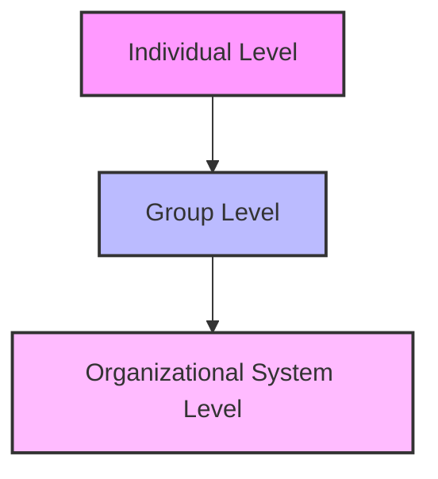

### (a)

#### Importance of interpersonal skills in organizations with examples

Developing managers' interpersonal skills is critical because it helps organizations attract and retain high-performing employees. In today's highly competitive business environment, technical skills alone are insufficient for managerial success. Interpersonal skills, often referred to as "people skills," enable managers to communicate effectively, lead teams, resolve conflicts, and motivate staff.
**Key Reasons for the Importance of Interpersonal Skills:**

- **Enhanced Employee Retention:** Quality of supervision and supportive relationships are primary factors in employee retention. High-performing individuals often leave supervisors, not organizations.
- **Improved Job Performance and Job Satisfaction:** When managers demonstrate strong interpersonal skills, employees experience lower stress, higher job satisfaction, and a more pleasant working environment, which translates to superior job performance.
- **Fostering Corporate Social Responsibility:** Interpersonal skills promote empathy and inclusive behaviors, creating a psychologically safe work culture.
- **Better Financial Performance:** Organizations known for strong interpersonal relationships and positive work environments consistently exhibit superior financial outcomes and market value.
  **Example:**
  Consider a project team facing a major bottleneck because two senior developers have differing views on software architecture. A manager lacking interpersonal skills might autocratically enforce a decision, creating resentment, lower morale, and potential project delays. Conversely, a manager with strong interpersonal skills will schedule a collaborative session, practice active listening, validate both perspectives, and guide the team toward an integrative solution. This resolves the technical issue while simultaneously boosting team cohesion and trust.

### (b)

#### Major behavioral science disciplines that contribute to Organizational Behavior

Organizational Behavior (OB) is an applied behavioral science built on contributions from several behavioral and social disciplines. The predominant areas are psychology, social psychology, sociology, and anthropology.

|**Discipline**|**Unit of Analysis**|**Primary Contributions to OB**|
|---|---|---|
|**Psychology**|Individual|Learning, motivation, personality, emotions, perception, training, leadership effectiveness, job satisfaction, individual decision-making, performance appraisal, attitude measurement, employee selection, work design, and work stress.|
|**Social Psychology**|Group|Behavioral change, attitude change, communication, group processes, group decision-making, power, conflict, and trust.|
|**Sociology**|Group / Organizational System|Organizational culture, formal organization theory and structure, organizational technology, communications, power, conflict, intergroup behavior, bureaucratic theory, and organizational change.|
|**Anthropology**|Organizational System / Global|Comparative values, cross-cultural analysis, organizational culture, organizational environments, and differences between national cultures.|

**Summary of Contributions:**

1. **Psychology:** Seeks to measure, explain, and sometimes change the behavior of humans. It focuses entirely on the **individual** level of analysis.
2. **Social Psychology:** A branch of psychology that blends concepts from both psychology and sociology, focusing on the influence of people on one another. Its major focus is at the **group** level.
3. **Sociology:** Studies people in relation to their social environment or culture. It shifts the focus from the individual toward the **group** and **organizational system** levels.
4. **Anthropology:** Studies societies to learn about human beings and their activities. It helps understand differences in fundamental values, attitudes, and behaviors across different cultures and organizations at the **system** level.

### (c)

#### Three levels of the Organizational Behavior model

The standard Organizational Behavior model progresses from a basic to a more comprehensive view of organizational realities by moving through three distinct levels of analysis: **Individual**, **Group**, and **Organizational System**. Each level builds upon the previous one.

1. **Individual Level:**
   - **Focus:** The building blocks of any organization are individual employees.
   - **Key Variables:** At this level, OB studies characteristics that people bring with them when they enter the workplace. These include biographical traits, personality characteristics, personal values, attitudes, emotions, moods, perception, individual decision-making, and intrinsic motivation.
2. **Group Level:**
   - **Focus:** Behavior changes when individuals work in groups or teams compared to when they work alone.
   - **Key Variables:** This level addresses how individuals interact with each other. It includes the study of group dynamics, team design, communication patterns, leadership styles, power dynamics, political behavior, conflict management, and negotiation strategies.
3. **Organizational System Level:**
   - **Focus:** Organizational behavior reaches its highest level of sophistication when we add formal structure and culture to our understanding of individual and group behavior.
   - **Key Variables:** This level studies the organization as a whole system. It covers organizational culture, organizational structure and design, human resource policies and practices (such as training, selection, and performance evaluation), and organizational change and stress management.
