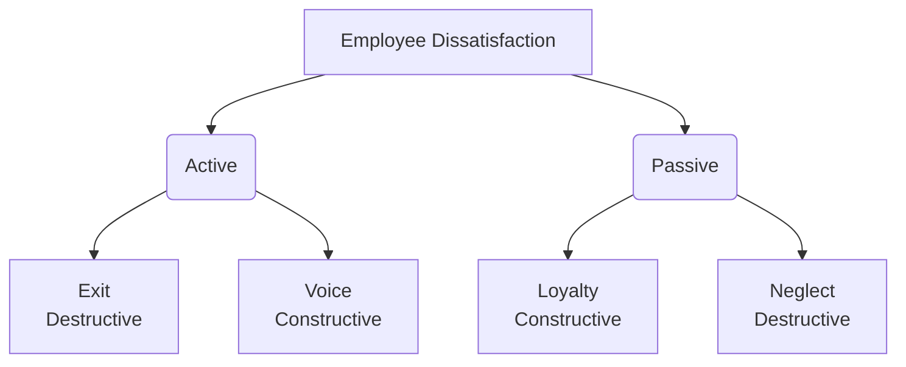

### (a)

#### Does behavior always follow from attitudes? Why or why not? Discuss the factors that affect whether behavior follows from attitudes.

No, behavior does not always follow from attitudes. Early research in organizational behavior assumed that attitudes and behavior were causally linked in a straight line: if you know an individual's attitude, you can predict their behavior. However, subsequent research challenged this notion, proving that the relationship is highly complex and contingent upon several moderating variables.

- **Why Behavior May Diverge from Attitudes:** Leon Festinger argued that the relationship between attitudes and behavior is often reversed—that behavior can actually shape attitudes due to **Cognitive Dissonance**. This refers to any incompatibility or inconsistency that an individual might perceive between two or more of their attitudes, or between their behavior and their attitudes. Because contradictions are uncomfortable, individuals seek a stable state where there is minimum dissonance. When dissonance occurs, people alter either their attitudes or their behaviors to restore consistency, or they rationalize the discrepancy.
- **Factors That Affect the Attitude-Behavior Relationship (Moderating Variables):** The most powerful moderators of the attitude-behavior relationship determine whether an individual's stated internal attitude will translate into actual external behavior:
  - **Importance of the Attitude:** Attitudes that reflect fundamental values, self-interest, or identification with individuals or groups an individual values tend to show a strong relationship to behavior. Important attitudes have greater psychological weight and are less likely to be compromised by external factors.
  - **Correspondence (Specificity):** Specific attitudes predict specific behaviors much better than general attitudes predict specific behaviors. For example, asking an employee about their general attitude toward "organizational sustainability" is a poor predictor of whether they will turn off their computer at night. Asking them specifically about their attitude toward "the corporate computer shut-down policy" will yield a far more accurate behavioral prediction.
  - **Accessibility:** Attitudes that are easily remembered and frequently activated are more likely to guide behavior. If an attitude is top-of-mind, an individual acts on it quickly; if it is latent or buried, behavior is more likely to be influenced by immediate situational cues.
  - **Social Pressures:** Social norms and organizational pressures can override internal personal attitudes. An employee may strongly dislike a specific corporate software tool (negative attitude), but because management and peers mandate and monitor its use (high social pressure), they will continue to use it efficiently (contradictory behavior).
  - **Direct Experience:** Attitudes formed through direct personal experience are stronger predictors of behavior than those acquired second-hand. When an employee has personally experienced a toxic manager, their attitude toward management becomes firmly anchored, leading to a much higher likelihood of behavioral outcomes like quitting or filing complaints.

### (b)

#### Identify and analyze four employee responses to dissatisfaction.

When employees are dissatisfied with their jobs, their responses can be mapped across a framework defined by two dimensions: constructive/destructive and active/passive. This is known as the **Exit-Voice-Loyalty-Neglect (EVLN)** model.
The four distinct employee responses are analyzed below:

- **1. Exit (Active, Destructive):**
  - **Analysis:** This response directs behavior toward leaving the organization altogether. It includes looking for a new position as well as actively resigning from the current job.
  - **Impact:** This is highly disruptive and costly for organizations due to turnover costs, loss of institutional knowledge, and the resources required to recruit and train replacements.
- **2. Voice (Active, Constructive):**
  - **Analysis:** This response involves actively and constructively attempting to improve existing working conditions. It includes suggesting improvements, discussing problems openly with supervisors, participating in organizational problem-solving sessions, and undertaking forms of union activity to protect worker rights.
  - **Impact:** This is the most beneficial response for management, as it provides critical feedback and allows the organization to correct structural or cultural errors before talent departs.
- **3. Loyalty (Passive, Constructive):**
  - **Analysis:** This response means passively but optimistically waiting for conditions to improve. Employees demonstrating loyalty will speak up for the organization in the face of external criticism and trust the organization and its management to eventually "do the right thing."
  - **Impact:** While it maintains organizational stability in the short term, prolonged passive loyalty without management intervention can morph into deep-seated dissatisfaction or burnout if conditions fail to improve.
- **4. Neglect (Passive, Destructive):**
  - **Analysis:** This response involves passively allowing conditions to worsen. It manifests as chronic absenteeism or lateness, reduced day-to-day effort, an increased rate of workplace errors, and a deliberate withdrawal of discretionary effort.
  - **Impact:** Neglect is dangerous because it is subtle and can go unnoticed by management for long periods. It erodes overall team productivity, damages service or product quality, and can poison the performance culture of surrounding team members.

### (c)

#### How do organizations manage diversity effectively?

Effective diversity management involves making everyone within the workforce more aware of and sensitive to the needs and differences of others, transforming diversity from a potential source of conflict into a competitive advantage. Organizations achieve this through a multi-layered, strategic approach:

- **1. Attracting, Selecting, Developing, and Retaining Diverse Employees:**
  - **Targeted Recruitment:** Organizations can target recruiting messages to specific underrepresented demographic groups. This involves advertising in publications or networks geared toward specific minorities, women, veterans, or disabled individuals.
  - **Objective Selection Systems:** To eliminate hiring bias, organizations must ensure that selection tools are valid, fair, and objective. Implementing blind resume reviews, structured interviews, and diverse interview panels ensures that applicants are evaluated solely on job-related qualifications rather than demographic similarities to the recruiters.
  - **Inclusive Development Programs:** Clear, transparent promotion and developmental opportunities must be available to all. Mentorship programs that pair high-potential minority employees with senior executives help dismantle glass ceilings and increase retention among diverse talent pools.
- **2. Leveraging Diversity in Groups and Teams:**
  - **Compositional Strategy:** Managers must design teams that explicitly leverage different perspectives. While demographic diversity can sometimes lead to initial communication barriers, it brings a wider array of creative solutions to complex problems.
  - **Establishing Common Goals:** To overcome surface-level friction in diverse teams, managers must emphasize higher-order organizational goals and professional identities. Emphasizing shared objectives helps group members focus on task-related qualities rather than demographic differences.
- **3. Implementing Comprehensive Diversity Programs:**
  - **Legal Framework Education:** Effective organizations design training initiatives that explicitly teach managers about the legal framework governing equal employment opportunity and encourage fair treatment regardless of demographic characteristics.
  - **Market Alignment Awareness:** Programs should teach the workforce how a diverse team can better understand and serve a diverse customer base. Showing employees that market success depends on cultural competence builds internal buy-in for diversity initiatives.
  - **Fostering Personal Development:** Rather than focusing on simplistic compliance rules, impactful diversity programs emphasize personal development and shift corporate culture. They focus on uncovering unconscious biases, developing cross-cultural communication skills, and bringing out the unique skills and perspectives of every individual worker.
