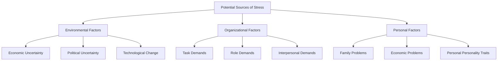

### (a)

#### Distributive and Integrative Bargaining

Bargaining strategies differ significantly in their goals, motivations, focus, and long-term relationship impacts. The table below outlines the core differences between distributive and integrative bargaining:

|**Bargaining Characteristic**|**Distributive Bargaining**|**Integrative Bargaining**|
|---|---|---|
|**Goal**|Get as much of the pie as possible (Win-Lose)|Expand the pie so that both parties are satisfied (Win-Win)|
|**Motivation**|Win-Lose|Win-Win|
|**Focus**|Positions ("I can't go beyond this point")|Interests ("Explain to me why this is important to you")|
|**Interests**|Opposed|Congruent or complementary|
|**Information Sharing**|Low (Sharing information only allows the other party to take advantage)|High (Sharing information allows each party to find creative solutions)|
|**Duration of Relationship**|Short-term|Long-term|

### (b)

#### Five Bases of Power

Power is divided into two general groupings—formal and personal—each containing specific bases of power (Coercive, Reward, Legitimate, Expert, and Referent).

#### Similarities

- **Core Objective:** All five bases serve as mechanisms to influence, alter, or control the behavior, attitudes, or beliefs of individuals or groups within an organization.
- **Dependence-Driven:** The effectiveness of every power base relies entirely on the concept of dependency; the target must perceive that the power holder controls resources or attributes that are valuable, scarce, and non-substitutable.
- **Coexistence:** Managers and leaders rarely rely on a single base; multiple power bases can operate simultaneously within the same individual.

#### Differences

- **Source of Origin:** Formal power is derived from structural position (Coercive, Reward, Legitimate), whereas personal power stems from an individual's unique characteristics, skills, or interpersonal dynamics (Expert, Referent).
- **Target Employee Response:**
  - **Coercive Power** (fear of negative results/punishment) typically results in **resistance**.
  - **Reward Power** (compliance to achieve positive benefits) and **Legitimate Power** (authority based on structural hierarchy) generally result in **compliance**.
  - **Expert Power** (influence based on specialized expertise/knowledge) and **Referent Power** (influence based on admiration and identification with a person) consistently result in high levels of employee **commitment**.
- **Organizational Effectiveness:** Research shows that personal sources of power (Expert and Referent) are the most consistently effective drivers of employee performance, organizational commitment, and job satisfaction, whereas formal powers (especially Coercive power) can degrade organizational climate.

### (c)

#### Definition and Potential Sources of Stress

#### Definition of Stress

Stress is defined as a dynamic condition in which an individual is confronted with an opportunity, a demand, or a resource related to what the individual desires and for which the outcome is perceived to be both uncertain and important.

#### Potential Sources of Stress

- **Environmental Factors:**
  - _Economic Uncertainty:_ Changes in the business cycle create anxieties over job security.
  * _Political Uncertainty:_ Political instability or structural shifts within a region can induce macro-level anxieties.
  * _Technological Change:_ Innovations can make an employee's skills obsolete, necessitating rapid adaptation.
- **Organizational Factors:**
  - _Task Demands:_ Pressures related to an employee's job design, working conditions, and physical layout (e.g., excessive workload, tight deadlines).
  - _Role Demands:_ Pressures resulting from the specific role an individual plays in the organization, including **Role Conflict** (contradictory expectations), **Role Ambiguity** (unclear expectations), and **Role Overload** (too many tasks).
  - _Interpersonal Demands:_ Pressures created by other employees, such as a lack of social support, poor relationships with supervisors, or workplace bullying.
- **Personal Factors:**
  - _Family Problems:_ Marital difficulties, relationship breakdowns, or difficulties with children.
  - _Economic Problems:_ Financial mismanagement or commitments that exceed the individual's earning capacity.
  - _Personal Personality Traits:_ Inherent individual predispositions, such as high neuroticism or a Type A personality profile, which heighten susceptibility to stressors.
