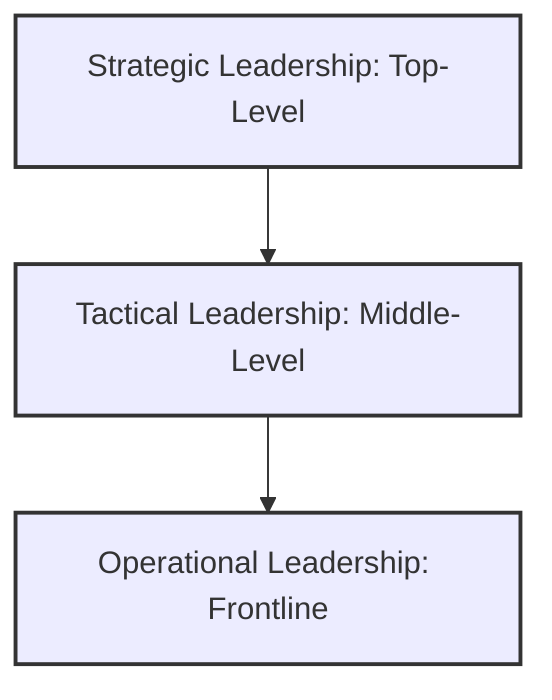

### (a)

#### Definition of Leading and Organizational Leadership Profile

**Understanding the "Leading" Function**
Leading is a foundational function of management that involves influencing, motivating, and directing individuals and groups toward the achievement of organizational goals. While planning sets the direction and organizing creates the structure, leading energizes human capital to execute plans effectively. It encompasses several key activities:

- **Influencing and Motivating:** Inspiring employees to exert discretionary effort by aligning personal aspirations with corporate objectives.
- **Directing and Communicating:** Providing clear guidance, setting performance standards, and establishing feedback loops to eliminate operational ambiguity.
- **Conflict Resolution:** Managing interpersonal and intergroup friction to preserve organizational cohesion.
- **Creating Vision:** Articulating a compelling future state that guides behavioral norms and strategic alignment.

#### Developing a Leadership Profile of the Organization

An organizational leadership profile outlines the specific competencies, styles, and behaviors required across hierarchical levels to support strategy execution and cultivate a healthy corporate culture.

##### 1. Core Competency Framework

A comprehensive leadership profile is anchored in three primary categories of competencies:

|**Competency Domain**|**Key Behavioral Elements**|**Relevance to Organizational Success**|
|---|---|---|
|**Cognitive & Strategic**|Visionary thinking, pattern recognition, business acumen, and proactive decision-making.|Ensures the organization anticipates market disruption and maintains long-term viability.|
|**Interpersonal & Relational**|Active listening, empathy, conflict management, and cross-cultural communication.|Enhances team cohesion, builds trust, and fosters psychological safety.|
|**Execution & Operational**|Accountability, delegation, resource optimization, and performance monitoring.|Drives the practical translation of corporate strategy into daily operational milestones.|

##### 2. Leadership Tier Profile Mapping

Different levels of the organization require varying distributions of leadership attributes:

- **Strategic Tier (Executive Level - CEO, VPs):**
  - _Focus:_ Macro-environment, cultural stewardship, and long-range planning.
  - _Primary Style:_ Transformational leadership.
  - _Key Metric:_ Market positioning, sustainable growth, and talent pipeline health.
- **Tactical Tier (Middle Management - Directors, Department Heads):**
  - _Focus:_ Bridge strategy and execution, break down silos, and allocate resources.
  - _Primary Style:_ Situational and collaborative leadership.
  - _Key Metric:_ Cross-functional efficiency, project delivery, and department retention.
- **Operational Tier (Frontline Managers - Supervisors, Team Leads):**
  - _Focus:_ Direct tasks, resolve immediate operational friction, and coach employees.
  - _Primary Style:_ Transactional (for compliance) paired with Servant leadership (for motivation).
  - _Key Metric:_ Daily/weekly output quality, immediate safety metrics, and employee morale.

##### 3. Desired Cultural Leadership Attributes

To remain competitive, the standard leadership profile enforces specific cultural behavioral markers:

- **Agility & Adaptability:** Leaders must comfortably pilot teams through ambiguity and change.
- **Inclusivity:** Actively seeking out and leveraging diverse perspectives to cultivate innovation.
- **Ethical Stewardship:** Aligning every operational action with compliance frameworks and high ethical codes.

### (b)

#### Noted Traits of a Leader

The trait theory of leadership argues that certain inherent or developed characteristics predispose individuals to be effective leaders. Modern Organizational Behavior synthesizes these traits primarily through the lens of personality dimensions, cognitive capacities, and ethical baselines.

#### 1. Personality Traits (The Big Five Framework)

Research indicates that specific dimensions of the Big Five personality model strongly correlate with leadership emergence and effectiveness:

- **Extraversion:** This is consistently identified as the most predictive trait for leadership emergence. Extraverted individuals are assertive, energetic, and socially confident, which assists them in naturally commanding attention and rallying groups.
- **Conscientiousness:** Highly conscientious leaders are disciplined, structured, organized, and deeply responsible. They show high levels of persistence, ensuring plans are carried through to completion.
- **Openness to Experience:** Leaders who score high here are creative, curious, and strategically flexible. They are willing to challenge the status quo, which is vital for organizational innovation and navigating change.

#### 2. Cognitive and Task-Related Traits

Beyond personality, effective leaders exhibit specific cognitive and situational attributes:

- **High Core Self-Evaluations (CSE):** Leaders with positive core self-evaluations possess strong self-esteem, self-efficacy, and an internal locus of control. They believe in their ability to influence outcomes and remain steady during crises.
- **Cognitive Ability and Knowledge of the Business:** While raw intelligence helps leaders solve complex strategic problems, deep domain expertise ensures they make technically sound, informed decisions that earn the respect of subordinates.

#### 3. Character and Integrity Traits

- **Integrity:** The systematic alignment of actions with stated moral values. Integrity builds corporate trust and ensures followers feel secure under their directive.
- **Desire to Lead:** An intrinsic motivation to accept responsibility, influence others, and guide group outcomes, rather than simply holding authority for status.

### (c)

#### Emotional Intelligence (EI) for Leaders

Emotional Intelligence (EI) refers to a leader's capacity to recognize, understand, manage, and influence their own emotions as well as the emotions of others. While high cognitive intelligence ($IQ$) and technical competence act as baseline entry requirements for leadership roles, Emotional Intelligence is the critical differentiator that drives top-tier performance and team retention.

#### The Five Dimensions of Leadership Emotional Intelligence

Daniel Goleman’s framework outlines how EI directly impacts managerial capabilities:

##### 1. Self-Awareness

- _Explanation:_ The foundational ability of a leader to understand their own moods, emotions, and behavioral drivers, along with their precise impact on team dynamics.
- _Leadership Impact:_ A self-aware leader recognizes when stress is clouding their judgment, allowing them to pause rather than projecting frustration onto subordinates.

##### 2. Self-Regulation

- _Explanation:_ The capacity to control or redirect disruptive impulses, emotional outbursts, and moods. It is the ability to think critically before acting.
- _Leadership Impact:_ In high-stakes situations, self-regulated leaders project an atmosphere of calm authority. They manage crises systematically without creating panic.

##### 3. Motivation (Intrinsic Motivation)

- _Explanation:_ A deep-seated passion to pursue organizational goals for reasons that go beyond external rewards like money, title, or prestige.
- _Leadership Impact:_ These leaders display high energy, remain optimistic during setbacks, and remain deeply committed to organizational growth, which naturally inspires similar resilience across the workforce.

##### 4. Empathy

- _Explanation:_ The skill of diagnosing the emotional composition of other people and treating them according to their emotional reactions.
- _Leadership Impact:_ In an era of remote work and diverse teams, empathetic leaders understand employee burnout, read unspoken team anxieties, and adjust workloads or support systems before productivity plummets.

##### 5. Social Skills (Relationship Management)

- _Explanation:_ Proficiency in managing relationships, building extensive professional networks, finding common ground, and establishing rapport.
- _Leadership Impact:_ This dimension translates emotional insight into behavioral influence. Leaders with high social skills are masters of persuasion, change management, and building psychological safety across cross-functional units.
