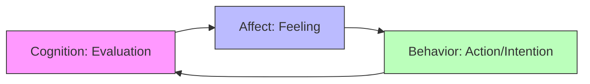

### (a)

#### What causes job satisfaction? For most people, is pay or the work itself more important?

#### Causes of Job Satisfaction

Job satisfaction is a complex, multidimensional construct influenced by several critical factors within the organizational environment:

- **The Work Itself (Job Conditions):** The nature of the tasks, including variety, autonomy, skill utilization, and feedback, represents the strongest predictable driver of satisfaction. Jobs that provide cognitive challenge and personal control foster higher intrinsic motivation.
- **Core Self-Evaluations (CSEs):** Individual personality plays a significant role. Employees with high core self-evaluations—who believe in their inner worth and basic competence—are fundamentally more satisfied with their jobs than those with negative self-evaluations.
- **Corporate Social Responsibility (CSR):** An organization's commitment to positive social and environmental impact increasingly drives employee satisfaction, particularly among younger generations who seek alignment between personal values and corporate actions.
- **Compensation and Benefits (Pay):** While compensation provides financial security, its relationship with long-term job satisfaction is conditional.

#### Pay vs. The Work Itself

For most individuals, **the work itself** is significantly more important for sustaining long-term job satisfaction than pay.

|**Factor**|**Impact on Job Satisfaction**|**Dynamics**|
|---|---|---|
|**Pay / Compensation**|**Threshold Effect**|Pay is highly correlated with satisfaction only at lower socioeconomic levels where basic needs are unmet. Once individuals reach a comfortable standard of living (a specific financial baseline), the correlation between pay and job satisfaction drops dramatically.|
|**The Work Itself**|**Intrinsic Motivation**|Intrinsic rewards derived from meaningful, challenging work, autonomy, and supportive relationships consistently outrank extrinsic financial rewards once basic financial security is achieved.|

> [!info] **Conclusion**
> While money can prevent dissatisfaction and motivate individuals to accept positions, it possesses limited capacity to generate sustained, positive job satisfaction. The intrinsic value of the work itself remains the dominant predictor of job fulfillment.

### (b)

#### What are the main components of attitudes? Are these components related or unrelated?

#### The Three Main Components of Attitudes

Attitudes are evaluative statements—either favorable or unfavorable—concerning objects, people, or events. They are structurally comprised of three closely interconnected components, often referred to as the **ABC Model of Attitudes**:

- **Cognitive Component (Belief):** The opinion, knowledge, or structural belief segment of an attitude. It sets the stage for the evaluation by providing factual or perceived information.
  - _Example:_ "My supervisor gave a promotion to a coworker who deserved it less than me. My supervisor is unfair."
- **Affective Component (Feeling):** The emotional or feeling segment of an attitude, which is measured by physiological indicators or verbal statements of feelings. It represents the emotional core of the attitude.
  - _Example:_ "I dislike my supervisor!"
- **Behavioral Component (Action):** An intention to behave in a certain way toward someone or something based on the underlying cognitive and affective evaluation.
  - _Example:_ "I'm looking for other work; I've complained about my supervisor to anyone who would listen."

#### Relationship Between the Components

The components of attitudes are **highly related and deeply intertwined**, rather than independent or unrelated.
In an organizational environment, cognition and affect are practically inseparable. A structural shift or experience in one component rapidly initiates changes in the others.

- **Cognitive-Affective Link:** When an employee perceives an injustice (Cognition), it instantly triggers a negative emotional reaction (Affect).
- **Affective-Behavioral Link:** This emotional response directly drives a tangible behavioral intention, such as looking for a alternative job (Behavior).
  Because these dimensions reinforce each other, attempting to isolate them in practical management is difficult; they function together as a unified system determining individual response patterns.

### (c)

#### What are the evidences for and against the existence of emotional intelligence?

Emotional Intelligence (EI) refers to a person's ability to detect, express, and manage emotional cues and information. The construct remains highly debated within organizational behavior, supported by distinct empirical and theoretical arguments on both sides.

#### Evidence For the Existence of EI

- **Intuitive Appeal:** There is a strong, widespread consensus that street smarts, social competence, and emotional sensitivity matter just as much as cognitive intellect ($IQ$) in navigating everyday life and workplace dynamics.
- **Predicts Criteria That Matter:** Empirical data demonstrates that high levels of EI correlate with superior job performance across various industries. For instance, individuals with strong emotional capabilities are better suited to manage interpersonal stress, lead teams, and excel in roles requiring high emotional labor (such as sales or customer service).
- **Biologically Based:** Neurological research provides physiological support for EI. Brain imaging shows that emotional expression and regulation are linked to specific neural pathways, such as the prefrontal cortex, proving that emotional governance is a distinct neurological ability independent of standard IQ.

#### Evidence Against the Existence of EI

- **Vague Construct and Lack of Definition:** Critics argue that EI is a poorly defined concept. Different researchers define it as a cognitive ability, a personality trait, or a set of behavioral competencies. This shifting definition makes it difficult to establish exactly what EI is.
- **Measurement and Psychometric Issues:** Many EI assessments rely on self-report measures (e.g., "I am good at reading people's expressions"). These metrics are vulnerable to social desirability bias and faking, compromising their validity and reliability as objective scientific testing tools.
- **Lack of Incremental Validity (Overlapping Concepts):** Skeptics assert that EI does not offer unique value when predicting performance. They argue that EI is merely a combination of existing concepts: standard cognitive intelligence ($IQ$) mixed with well-established Big Five personality traits like Conscientiousness and Emotional Stability (Neuroticism). Once these traditional variables are statistically controlled, EI provides very little unique predictive power.
