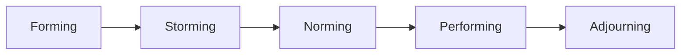

### (a)

#### The growing popularity of teams in organizations

Organizations have turned to teams because they are generally more flexible and responsive to changing events than traditional departments or other forms of permanent groupings. Teams have the capability to quickly assemble, deploy, refocus, and disband. This agility is critical in modern, dynamic business environments where market conditions and competitive pressures shift rapidly.
Several key factors explain the pervasive shift toward team-based structures:

- **Synergy and Enhanced Performance:** Teams typically outperform individuals when the tasks being performed require multiple skills, judgment, and a diversity of experience. By pooling complementary talents, teams generate a collective output that is greater than the sum of individual inputs.
- **Effective Resource Utilization:** Teams allow organizations to better utilize employee talents. Managers have found that teams are more effective at problem-solving and handling complex, multidimensional projects because they pull together varied organizational expertise.
- **Increased Employee Motivation and Engagement:** Teams facilitate employee participation in operating decisions. This democratization of the workplace increases employee involvement, fosters a sense of ownership, boosts morale, and enhances organizational commitment.
- **Facilitation of Knowledge Sharing:** Working in teams breaks down traditional departmental silos. It encourages cross-functional communication, allowing information and best practices to flow freely across different areas of the organization.

### (b)

#### Conditions under which work performed by individuals is preferred over teams

Teamwork takes more time and often more resources than individual work. It increases communication demands, requires conflict management, and involves running meetings. Therefore, the benefits of using teams must exceed these structural costs.
To determine whether a task is better suited for an individual rather than a team, organizations look at three distinct tests:

- **Complexity and Need for Diverse Perspectives:** Can the work be done better by more than one person? If the task is simple, routine, and does not require a variety of inputs, it is more efficiently performed by an individual. Teams are preferred only when the work is highly complex and demands multiple skills or viewpoints.
- **Common Purpose or Aggregate Goals:** Does the work create a common purpose or set of goals for the people in the group that is more than the simple aggregate of individual goals? If the task merely involves summing up independent outputs (e.g., individual sales agents meeting independent quotas), a team structure adds unnecessary overhead without adding value.
- **Interdependence of Members:** Are the members of the group interdependent? Teams make sense when the success of the whole depends on the success of each member, and the success of each member depends on the success of others. If individuals can execute their tasks completely independent of one another, individual assignments are preferred.

### (c)

#### The five stages of group development

The five-stage group-development model (Tuckman's model) conceptualizes the lifecycle of a group as shifting through a standard sequence of growth phases.

- **1. Forming Stage:** This initial stage is characterized by a great deal of uncertainty regarding the group’s purpose, structure, and leadership. Members operate as independent individuals and are "testing the waters" to determine what types of behaviors are acceptable. This stage is complete when members have begun to think of themselves as part of a group.
- **2. Storming Stage:** This phase is defined by intragroup conflict. Members accept the existence of the group but resist the constraints it imposes on their individuality. Furthermore, there is often conflict over who will control the group and drive its direction. This stage is complete when a relatively clear hierarchy of leadership emerges within the group.
- **3. Norming Stage:** In this stage, close relationships develop and the group demonstrates strong cohesiveness. There is a clear sense of group identity and camaraderie. This phase is complete when the group structure solidifies and the group has assimilated a common set of expectations or norms regarding what constitutes correct member behavior.
- **4. Performing Stage:** At this point, the structural framework of the group is fully functional, stabilized, and accepted. Group energy has advanced from getting to know and understand each other to executing the task at hand. For permanent work groups, performing is the final stage of development.
- **5. Adjourning Stage:** For temporary committees, teams, task forces, and similar groups that have a limited scope of work, this is the wrapping-up phase. The group prepares to disband. High task performance is no longer the top priority; instead, attention is directed toward wrapping up activities, documenting results, and separating. Members' reactions vary, ranging from euphoria over achievements to depression over the loss of camaraderie.
