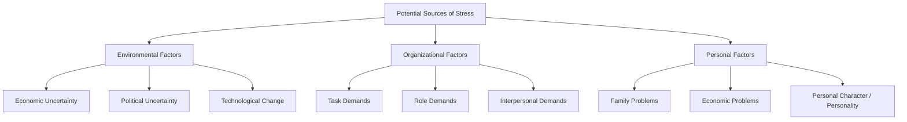

### (a)

#### The Steps of the Conflict Process

The conflict process can be understood as a journey consisting of five distinct stages: potential opposition or incompatibility, cognition and personalization, intentions, behavior, and outcomes.

- **Stage I: Potential Opposition or Incompatibility:** This initial step involves the presence of conditions that create opportunities for conflict to arise. These conditions do not necessarily lead directly to conflict, but they serve as necessary prerequisites. They generally fall into three core categories:
  - _Communication:_ Semantic difficulties, misunderstandings, and "noise" in the communication channels can all stimulate conflict. Both too little and too much communication can lay the groundwork for opposition.
  - _Structure:_ This includes variables such as the size of the group, degree of specialization in the tasks assigned to group members, jurisdictional clarity, member-goal compatibility, leadership styles, reward systems, and the degree of dependence between groups.
  - _Personal Variables:_ Personal variables encompass personality, emotions, and values. Certain personality types—for example, individuals who are highly authoritarian or dogmatic—show a greater tendency to experience conflict.

- **Stage II: Cognition and Personalization:** If the conditions defined in Stage I negatively affect something that one party cares about, then the potential for opposition or incompatibility becomes actualized in the second stage. This is where conflict issues tend to be defined:
  - _Perceived Conflict:_ This is the awareness by one or more parties of the existence of conditions that create opportunities for conflict to arise. It does not mean that the conflict is personalized.
  - _Felt Conflict:_ Emotional involvement in a conflict that creates anxiety, tenseness, frustration, or hostility. This is the point where individuals become emotionally invested.

- **Stage III: Intentions:** Intentions intervene between people’s perceptions and emotions and their overt behavior. They are decisions to act in a given way during a conflict. Using two dimensions—cooperativeness (the degree to which one party attempts to satisfy the other party's concerns) and assertiveness (the degree to which one party attempts to satisfy his or her own concerns)—five conflict-handling intentions can be identified:
  - _Competing:_ A desire to satisfy one's interests, regardless of the impact on the other party to the conflict.
  - _Collaborating:_ A situation in which the parties to a conflict each desire to satisfy fully the concerns of all parties.
  - _Compromising:_ A situation in which each party to a conflict is willing to give up something to reach a resolution.
  - _Avoiding:_ The desire to withdraw from or suppress a conflict.
  - _Accommodating:_ The willingness of one party in a conflict to place the opponent’s interests above his or her own.

- **Stage IV: Behavior:** This is where the conflict becomes visible. The behavior stage includes the statements, actions, and reactions made by the conflicting parties. These conflict behaviors are usually overt attempts to implement each party's intentions. It can be viewed as a dynamic continuum ranging from minor disagreements or misunderstandings to overt efforts to destroy the other party.

- **Stage V: Outcomes:** The interplay between the conflict behaviors and the conflict-handling intentions results in consequences. These outcomes can be functional if the conflict results in an improvement in the group's performance, or dysfunctional if it hinders group performance.
  - _Functional Outcomes:_ Conflict is constructive when it improves the quality of decisions, stimulates creativity and innovation, encourages interest and curiosity among group members, provides the medium through which problems can be aired and tensions released, and fosters an environment of self-evaluation and change.
  - _Dysfunctional Outcomes:_ Uncontrolled opposition breeds discontent, which acts to dissolve common ties and eventually leads to the destruction of the group. Among the more undesirable consequences are a retardation of communication, reductions in group cohesiveness, and the subordination of group goals to the primacy of infighting among members.

### (b)

#### Define Stress and Identify its Potential Sources

**Definition of Stress:**
Stress is a dynamic condition in which an individual is confronted with an opportunity, a demand, or a resource related to what the individual desires and for which the outcome is perceived to be both uncertain and important. It is an adaptive response, mediated by individual characteristics, that is a consequence of any external action, situation, or event that places special physical or psychological demands upon a person.

**Potential Sources of Stress:**
The sources of stress can be categorized into three major sets of factors: environmental, organizational, and personal.

- **Environmental Factors:** Just as environmental uncertainty influences the design of an organization’s structure, it also influences stress levels among employees in that organization. The main types of environmental uncertainties are:

  - _Economic Uncertainty:_ Changes in the business cycle create economic anxieties. When the economy is contracting, people become increasingly anxious about their job security.

  - _Political Uncertainty:_ Political threats and changes can induce stress, particularly in unstable political climates or in heavily regulated industries.

  - _Technological Change:_ Because new innovations can make an employee’s skills and experience obsolete in a short period of time, technological change is an environmental stressor.

- **Organizational Factors:** There are no shortage of factors within the organization that can cause stress. Pressures to avoid errors or complete tasks in a limited time period, a demanding boss, and unpleasant co-workers are a few examples. These factors are categorized as:

  - _Task Demands:_ These relate to a person’s job. They include the design of the individual’s job (its variety, degree of autonomy, automation), working conditions, and the physical work layout.

  - _Role Demands:_ These relate to pressures placed on a person as a function of the particular role he or she plays in the organization. Role conflicts create expectations that may be hard to reconcile or satisfy. Role overload occurs when the employee is expected to do more than time permits. Role ambiguity means job expectations are not clearly understood.

  - _Interpersonal Demands:_ These are pressures created by other employees. Lack of social support from colleagues and poor interpersonal relationships can cause considerable stress, especially among employees with a high social need.

- **Personal Factors:** The typical employee works about 40 to 50 hours a week. The experiences and problems that people encounter during those other 110-plus nonwork hours can spill over to the job. Therefore, the final category of stressors consists of personal life factors:

  - _Family Problems:_ Difficulties in marriages, relationship breakdowns, and difficulties with children are examples of personal relationships that create stress for employees and spill over into the workplace.

  - _Economic Problems:_ Financial dilemmas created by overextended commitments or poor budgeting are another set of personal stressors that consume an employee's focus and raise stress levels.

  - _Personal Character (Personality):_ An individual's inherent personality traits, such as a predisposition to experience negative emotions or an inability to cope well with change, significantly affect how heavily external demands translate into felt stress.

### (c)

#### How You Can Manage Your Stress

Stress management can be approached through individual strategies and organizational strategies. An individual can take personal responsibility for reducing their stress levels through targeted behavioral techniques.

**Individual Approaches to Managing Stress:**

- **Time-Management Techniques:** Many people are poor at managing their time, which results in unnecessary pressure. An effective application of time management can mitigate this. Well-known time-management principles include:

  - Making daily lists of activities to be accomplished.

  - Prioritizing activities by importance and urgency.

  - Scheduling activities according to the priorities set.

  - Knowing your daily cycle and handling the most demanding parts of your job during the high-energy hours when you are most alert and productive.

  - Avoiding interruptions and minimizing distractions.

- **Physical Exercise:** Noncompetitive physical exercise, such as aerobics, walking, jogging, swimming, and riding a bicycle, has long been recommended by physicians as a successful way to deal with excessive stress levels. Exercise increases physical endurance, strengthens the cardiovascular system, and provides a mental diversion from work-related pressures.

- **Relaxation Training:** Individuals can teach themselves to reduce tension through relaxation techniques such as meditation, deep breathing, and biofeedback. The objective is to reach a state of deep physical relaxation, which lowers heart rate, blood pressure, and deeply felt physical tension. Taking a few minutes each day to practice deep relaxation helps release built-up psychological stressors.

- **Expanded Social Support Networks:** Having friends, family, or colleagues to talk to provides an important outlet when stress levels rise. Expanding your social support network gives you people with whom you can share your feelings and look for advice. A strong support network acts as a buffer against the negative impacts of high stress.

**Organizational Approaches to Managing Stress (Brief Context):**

While individuals can deploy personal coping mechanisms, organizations can also assist by improving selection and placement procedures, using realistic goal-setting, redesigning jobs to give employees more autonomy, increasing formal organizational communication, and establishing corporate wellness programs.
