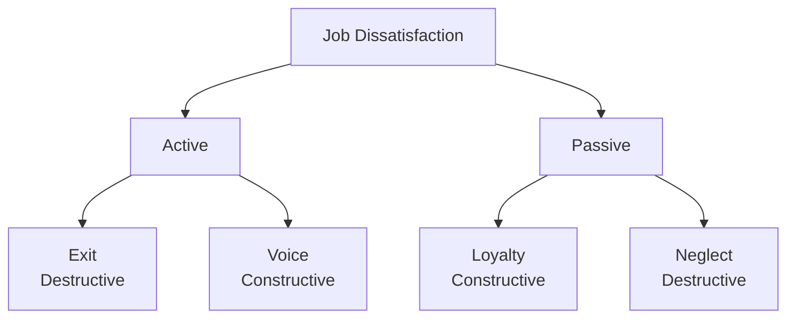

### (a)

#### "Attitude isn't everything, but it's close"

In the study of Organizational Behavior (OB), attitudes are evaluative statements—either favorable or unfavorable—about objects, people, or events. They reflect how one feels about something. The statement _"Attitude isn't everything, but it's close"_ highlights the profound, pervasive impact that employee attitudes have on organizational performance, while acknowledging that other structural and individual variables also play a role.

- **Why it is NOT "Everything":** Attitudes do not exist in a vacuum. Employee performance and workplace outcomes are also determined by factors such as **individual ability**, **organizational constraints** (e.g., lack of resources or tools), **job design**, and **macroeconomic conditions**. An employee may possess an exceptionally positive attitude but still underperform if they lack the required technical skills or institutional support.
- **Why it is "Close" to everything:** Attitudes are highly predictive of critical workplace behaviors. They consist of three tightly interrelated components:
  - **Cognitive Component:** The opinion or belief segment of an attitude.
  - **Affective Component:** The emotional or feeling segment.
  - **Behavioral Component:** An intention to behave in a certain way toward someone or something.
    When employees hold positive attitudes (such as high job satisfaction and organizational commitment), companies experience significantly higher productivity, superior customer service, and elevated Organizational Citizenship Behaviors (OCBs). Conversely, negative attitudes can lead to widespread withdrawal behaviors, systemic drops in morale, and workplace deviance. Therefore, managing attitudes is one of the most critical levers a manager can pull to drive organizational success.

### (b)

#### Impact of Job Satisfaction and Dissatisfaction

When employees have clear feelings toward their jobs, their responses directly shape the organization's culture, efficiency, and bottom line. The consequences of liking or disliking a job can be analyzed through performance metrics and the classic **Exit-Voice-Loyalty-Neglect (EVLN) framework**.

#### When Employees Like Their Jobs (High Job Satisfaction)

- **Higher Job Performance:** Satisfied employees are more motivated, focused, and productive. The data consistently demonstrates that happy workers are highly productive workers.
- **Increased Organizational Citizenship Behavior (OCB):** Satisfied employees are more likely to go above and beyond their formal job descriptions, help coworkers, and speak positively about the company.
- **Enhanced Customer Satisfaction:** Frontline employees who like their jobs are more upbeat, helpful, and responsive, which directly translates to increased customer loyalty and retention.
- **Reduced Absenteeism and Turnover:** When employees find fulfillment in their work, they are significantly less likely to miss days or seek employment elsewhere, reducing costly recruitment cycles.

#### When Employees Dislike Their Jobs (Job Dissatisfaction)

The framework framework details how employees respond to dissatisfaction along two dimensions: Constructive/Destructive and Active/Passive.

> [!info] The EVLN Framework
>
> - **Exit (Active, Destructive):** The employee directs behavior toward leaving the organization. This includes looking for a new position, interviewing, or resigning.
> - **Voice (Active, Constructive):** The employee actively and constructively attempts to improve conditions. This includes suggesting solutions, discussing problems with superiors, or participating in union activities.
> - **Loyalty (Passive, Constructive):** The employee passively but optimistically waits for conditions to improve. They trust management to do the right thing and defend the organization against external criticism.
> - **Neglect (Passive, Destructive):** The employee passively allows conditions to worsen. This manifests as chronic absenteeism or lateness, reduced daily effort, a higher error rate, and a general withdrawal of attention.

### (c)

#### Emotional Intelligence (EI): Definition and Evidence

**Emotional Intelligence (EI)** is defined as an individual's ability to detect and manage emotional cues and information. It is structurally understood via a cascading model consisting of three core dimensions:

1. **Conscientiousness:** Perceiving emotions in oneself and others.
2. **Cognitive Ability:** Understanding the meaning of these emotions.
3. **Emotional Stability:** Regulating emotions appropriately to suit the situation.

#### The Case For the Existence of EI (Arguments In Favor)

- **Intuitive Appeal:** There is a strong intuitive consensus that street smarts, social awareness, and interpersonal savvy are vital for navigating workplace dynamics and leadership.
- **Predicts Criteria That Matter:** Ample empirical evidence shows that high EI predicts strong job performance, effective leadership, and superior cross-cultural adaptation. Individuals who can read emotions manage conflicts more effectively.
- **Biologically Based:** Neurological research indicates that EI is distinct from standard biological intelligence measures. Damage to the prefrontal cortex and emotional centers of the brain uniquely impairs emotional processing while leaving standard IQ intact, proving EI is a distinct neurological capability.

#### The Case Against the Existence of EI (Arguments Opposed)

- **Vague and Hard to Measure:** Critics argue that EI is a slippery concept because different researchers focus on completely varying definitions—some view it as a cognitive capability, while others view it as a collection of positive personality traits.
- **Measurement Validity Concerns:** Because EI is frequently measured using self-report surveys (e.g., "Rate your ability to understand others"), it is highly susceptible to social desirability bias and lacks the rigorous, objective testing standards of traditional IQ.
- **Low Incremental Validity (Personality Overlap):** Many organizational psychologists argue that EI is simply a repackaged concept. When researchers control for standard cognitive ability and the **Big Five** personality traits (specifically Emotional Stability and Extraversion), EI provides very little unique, incremental predictive power for job performance.
