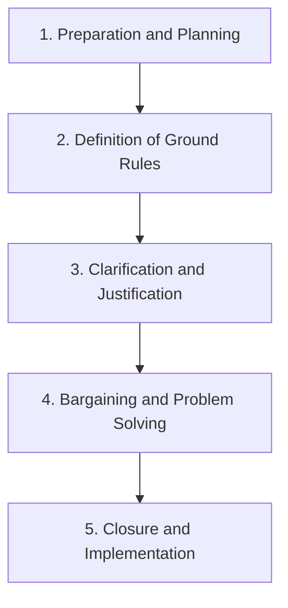
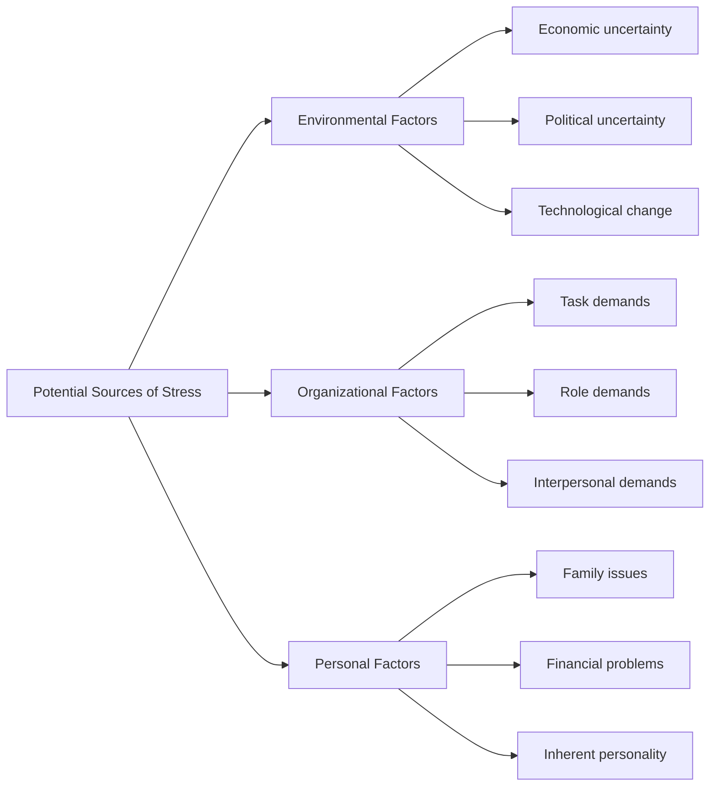
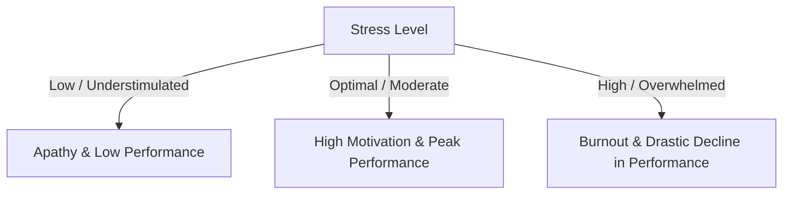

### (a)

#### Definition of Negotiation and the Five Steps in the Negotiation Process

**Negotiation** is defined as a process in which two or more parties exchange goods or services and attempt to agree on the exchange rate for them. It is a decision-making process among interdependent parties who do not share identical preferences, aimed at reaching a mutually acceptable agreement.
The negotiation process consists of five distinct steps:

1. **Preparation and Planning:** Before negotiation begins, parties must thoroughly gather information, identify goals, understand the nature of the conflict, and assess the other party's goals. A critical component of this stage is determining your **BATNA** (Best Alternative to a Negotiated Agreement), which defines the lowest value acceptable to you.
2. **Definition of Ground Rules:** Once planning is complete, the parties establish the rules and procedures for the negotiation itself. This includes determining who will do the negotiating, where it will take place, what time constraints will apply, and what specific issues will be limited to. During this phase, the parties also exchange their initial proposals or demands.
3. **Clarification and Justification:** When initial positions have been exchanged, both parties explain, amplify, clarify, bolster, and justify their original demands. This step is an opportunity for educating and informing each other on why the issues are important and how each side arrived at their initial demands.
4. **Bargaining and Problem Solving:** This is the essence of the negotiation process—the actual give-and-take where both parties attempt to hash out an agreement. Concessions will need to be made by both sides to reach a consensus.
5. **Closure and Implementation:** The final step in the negotiation process is formalizing the agreement that has been worked out and developing any procedures necessary for implementing and monitoring it. This may involve a formal contract, a handshake, or a written summary of understandings.

### (b)

#### Definition of Stress and its Potential Sources

**Stress** is a dynamic condition in which an individual is confronted with an opportunity, constraint, or demand related to what he or she desires and for which the outcome is perceived to be both uncertain and important.
There are three main categories of potential sources of stress:

- **Environmental Factors:** Unpredictability in the external environment can cause significant stress.
  - _Economic Uncertainty:_ Changes in the business cycle create anxiety over job security.
  - _Political Uncertainty:_ Political instability or geopolitical shifts can induce stress.
  - _Technological Change:_ Rapid technological advances can make an employee's skills obsolete, creating a constant pressure to adapt.
- **Organizational Factors:** Pressures that stem directly from within the workplace environment.
  - _Task Demands:_ Relate to an employee's job design (e.g., working conditions, physical layout, assembly line speed, and workload).
  - _Role Demands:_ Pressures placed on a person as a function of the particular role he or she plays in the organization. This includes **role conflicts** (conflicting expectations), **role overload** (too much work), and **role ambiguity** (unclear expectations).
  - _Interpersonal Demands:_ Pressures created by other employees, such as a lack of social support, poor relationships with colleagues, or workplace bullying.
- **Personal Factors:** Problems that employees experience in their private lives that spill over into their work performance.
  - _Family Issues:_ Marital difficulties, relationship breakdowns, or difficulties with children.
  - _Financial Problems:_ Mismanagement of personal finances or living beyond economic means.
  - _Personality Characteristics:_ Inherent traits such as high neuroticism or Type A behavioral patterns can predispose individuals to experience higher stress levels.

### (c)

#### How Stress Affects Organizational Performance

Stress affects organizational performance through physiological, psychological, and behavioral dimensions. The relationship between stress and performance is traditionally explained using the **Inverted-U Model** (Yerkes-Dodson Law).

- **Low to Moderate Stress Levels:** Act as a positive catalyst (**Eustress**). It stimulates the body and mind, increasing alertness, motivation, and the cognitive capacity to react. At this optimal level, stress enhances employee performance.
- **High or Prolonged Stress Levels:** Transition into negative stress (**Distress**). It overwhelms the individual’s coping mechanisms, leading to a severe decline in performance due to operational impairments.
  The detrimental consequences of high stress on organizational performance include:
- **Reduced Productivity and Task Errors:** Excessive cognitive load diminishes concentration, hinders memory retention, and disrupts decision-making accuracy, resulting in lower output and quality.
- **Absenteeism and Presenteeism:** Employees under extreme stress suffer from psychological burnout or physical illnesses (e.g., hypertension, chronic migraines), causing them to miss work frequently or attend without being mentally engaged.
- **Increased Turnover Rates:** High workplace stress levels lead directly to low job satisfaction and organizational commitment, forcing valuable human capital to resign. This drives up recruitment and training costs.
- **Disrupted Workplace Dynamics:** Highly stressed individuals often exhibit behavioral symptoms such as irritability, rapid or aggressive speech, and cooperation breakdowns, leading to interdepartmental friction and toxic work cultures.
