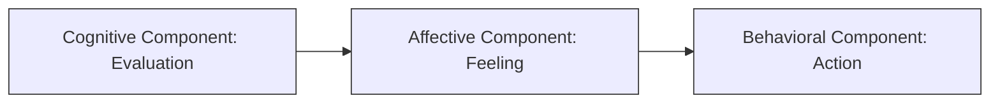

### (a)

> [!example] Case Scenario
> In an organization, a worker is talking with another worker about his supervisor. "My supervisor gave a promotion to a coworker who deserved it less than me. My supervisor is unfair. I dislike my supervisor! I'm looking for other work: I've complained about my supervisor to anyone who would listen."

#### (a\_i)

##### Importance of Attitudes at the Organizational Level

Attitudes are evaluative statements—either favorable or unfavorable—concerning objects, people, or events. They reflect how an individual feels about something within their environment. At the organizational level, understanding and monitoring employee attitudes is critical for several key reasons:

- **Predictor of Work Behaviors:** Attitudes serve as the foundational psychological metrics that drive visible behaviors. Negative attitudes often serve as early indicators of deeper workplace disruptions before they manifest into tangible damage.
- **Impact on Performance:** Employees with positive job attitudes are significantly more productive, engaged, and committed to organizational goals.
- **Reduction of Withdrawal Behaviors:** Favorable organizational attitudes help minimize costly negative outcomes, including high employee turnover, frequent absenteeism, and mental disengagement.
- **Organizational Citizenship Behavior (OCB):** Positive attitudes foster discretionary behaviors where employees go above and beyond their formal job duties, helping coworkers and supporting the broader organizational culture.
- **Mitigation of Counterproductive Work Behavior (CWB):** Negative attitudes can foster toxic work environments, leading to deviance, low morale, theft, or explicit insubordination.

#### (a\_ii)

##### Relationship Between the Three Components of an Attitude

An attitude is not a single isolated concept; it consists of three closely intertwined components: **cognition**, **affect**, and **behavior**. In an organizational setting, these components are deeply interrelated, often occurring almost simultaneously.
Using the provided case scenario, the relationship and flow between these three components can be mapped directly:

- **Cognitive Component (Evaluation):** This represents the belief, opinion, or knowledge segment of an attitude. It sets the stage for the structural perception of fairness or unfairness.
  - _Case Application:_ _"My supervisor gave a promotion to a coworker who deserved it less than me. My supervisor is unfair."_
- **Affective Component (Feeling):** This is the emotional or feeling segment of an attitude, which is directly triggered by the cognitive evaluation.
  - _Case Application:_ _"I dislike my supervisor!"_
- **Behavioral Component (Action):** This represents an intention to behave or act in a certain way toward someone or something, resulting directly from the underlying thoughts and feelings.
  - _Case Application:_ _"I'm looking for other work: I've complained about my supervisor to anyone who would listen."_

The scenario illustrates how these components are inseparable: the cognitive evaluation of an unfair promotion immediately fuels the affective feeling of dislike, which directly drives the behavioral actions of complaining and seeking alternative employment.

### (b)

#### Employee Involvement Programs and Employee Motivation

**Employee Involvement and Participation (EIP)** is defined as a participative process that uses the input of employees to increase their commitment to organizational success. By involving workers in decisions that affect them and increasing their autonomy and control over their work lives, organizations foster a environment where employees become more motivated, committed, productive, and satisfied.
The two primary forms of employee involvement programs are:

1. **Participative Management:** A process in which subordinates share a significant degree of decision-making power with their immediate superiors.
2. **Representative Participation:** A system where workers participate in organizational decision-making through a small group of representative employees (such as work councils or board representatives), redistributing power within the organization.
   **How Employee Involvement Programs Increase Employee Motivation:**

- **Link to Job Characteristics Model (JCM):** EIP programs directly enhance **autonomy**. By providing employees with horizontal control over daily operational decisions, it deepens their experienced responsibility for work outcomes, substantially driving intrinsic motivation.
- **Link to Theory X and Theory Y:** These programs align closely with **Theory Y** assumptions, which presuppose that employees are naturally responsible, creative, and capable of self-direction when given proper organizational latitude.
- **Link to Two-Factor Theory (Motivation-Hygiene Theory):** Employee involvement acts as an **intrinsic motivator** by offering responsibility, growth, recognition, and a sense of personal achievement, which are essential for long-term psychological engagement.
- **Psychological Ownership:** Giving employees a strategic voice fosters a sense of ownership over organizational outcomes, turning passive compliance into active, motivated commitment.

### (c)

#### Causes of Job Satisfaction and the Role of Pay vs. The Work Itself

Job satisfaction describes a positive feeling about a job, resulting from an evaluation of its characteristics.
**Main Causes of Job Satisfaction:**

- **The Work Itself:** The intrinsic nature of tasks, including job variety, autonomy, independence, and the level of intellectual challenge.
- **Core Self-Evaluations (CSE):** Personal psychological design. Individuals with positive core self-evaluations—who believe in their inner worth and basic competence—are inherently more satisfied with their work.
- **Social Context:** Workplace interactions, including supportive supervisors, transparent leadership, and functional relationships with coworkers.
- **Corporate Social Responsibility (CSR):** An organization's positive impact on the community and environment, which gives employees a sense of purpose.
- **Pay and Benefits:** The financial remuneration and security package offered by the company.
  **Pay vs. The Work Itself:**
  For most people, **the work itself** is significantly more important for long-term job satisfaction than pay.
  While financial compensation is critical for individuals who are struggling financially or living in developing socioeconomic conditions, its correlation with sustainable job satisfaction changes once a baseline threshold is reached:
- **The Limit of Pay:** Once an employee earns a comfortable living wage that secures their baseline financial needs, additional increases in salary have virtually zero relationship with long-term job satisfaction. Pay motivates people to accept jobs, but it does not necessarily keep them satisfied within those roles.
- **The Power of Intrinsic Rewards:** The intrinsic nature of the work itself provides ongoing fulfillment. Employees seek meaning, growth opportunities, and autonomy. Challenging and engaging work maintains interest and psychological well-being over time, making it the primary driver of sustained job satisfaction.
