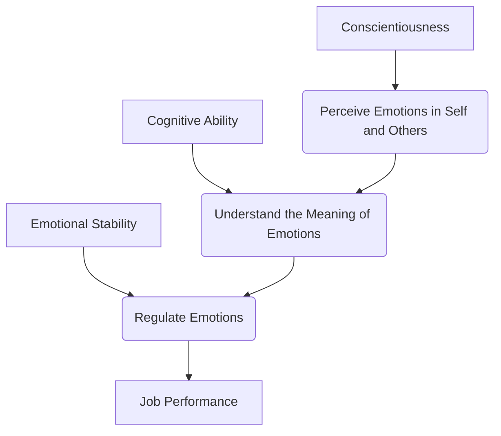

### (a)

#### What are the differences between emotions and moods? What are the basic emotions and moods?

##### Differences Between Emotions and Moods

The table below highlights the structural and behavioral distinctions between emotions and moods:

|**Characteristic**|**Emotions**|**Moods**|
|---|---|---|
|**Cause**|Caused by a specific, identifiable event or stimulus.|Cause is often general, vague, or unclear.|
|**Duration**|Very brief in nature (lasts for seconds or minutes).|Longer-lasting than emotions (can persist for hours or days).|
|**Specificity**|Specific and numerous (e.g., anger, fear, sadness, joy).|General affect dimensions (either positive affect or negative affect).|
|**Expression**|Usually accompanied by distinct facial expressions.|Generally not indicated by distinct, observable facial expressions.|
|**Nature**|Action-oriented; they move a person to immediate behavior.|Cognitive-oriented; they influence how a person thinks or processes data.|

##### Basic Emotions and Moods

- **Basic Emotions:** Although human emotional experiences are vast, contemporary researchers generally agree on six universal, cross-cultural basic emotions:
  - Anger
  - Fear
  - Sadness
  - Happiness
  - Disgust
  - Surprise
- **Basic Moods:** Moods are broadly classified into two major dimensions known as **Positive Affect** and **Negative Affect**:
  - **Positive Affect:** A mood dimension consisting of positive emotions such as excitement, alertness, and joy at the high end, and boredom, depression, or fatigue at the low end.
  - **Negative Affect:** A mood dimension consisting of nervousness, stress, and anxiety at the high end, and serenity, relaxation, and calmness at the low end.

### (b)

#### Researchers suggest "Emotional Intelligence (EI) plays an important role in job performance." Briefly explain this argument on the basis of Cascading Model.

The **Cascading Model of Emotional Intelligence (EI)** illustrates a sequential, step-by-step framework through which specific underlying individual traits and emotional abilities combine to ultimately drive an employee's job performance.

##### The Sequential Mechanism of the Cascading Model

1. **Ability to Perceive Emotions:** At the foundational entry point of the cascade, an individual's level of **Conscientiousness** dictates their dedication to perceiving emotions. Employees who are conscientiously aware are superior at accurately detecting and reading emotional cues within themselves and their colleagues.
2. **Ability to Understand Emotions:** Once emotions are perceived, the data flows down to the comprehension stage. This capability is fundamentally supported by **Cognitive Ability**. Employees with higher cognitive capacity can successfully process what these emotional cues signify, model how emotions change over time, and accurately trace the source of organizational tensions.
3. **Ability to Regulate Emotions:** At the final tier of the skill set, individuals must manage the understood emotions. Backed by **Emotional Stability**, employees engage in conscious emotion regulation. This capability allows individuals to control counterproductive emotional outbursts, maintain exceptional composure, and suppress destructive reactions under high workplace stress.

> [!info] **Impact on Performance**
> Because emotion regulation sits at the bottom of this sequential cascade, an breakdown at any upper stage (perception or understanding) disrupts the chain. When functioning optimally, the ability to regulate emotions flows directly into superior **Job Performance**, making the employee highly resilient, socially adept, and effective in high-pressure team dynamics.

### (c)

#### You can usually improve a friend's mood by sharing a funny video clip, giving the person a small bag of candy, or even offering a pleasant beverage. But what can companies do to improve employees' moods?

Companies cannot always utilize personal tokens of affection to manage employee moods, but they can implement specific, evidence-based organizational interventions to systematically elevate the positive affect of their workforce:

- **Leverage Emotional Contagion in Selection and Leadership:** Emotions are naturally transferable between individuals. Organizations can hire managers and team members who naturally project positive affect and display enthusiasm. A manager's positive energy naturally cascades down to uplift the collective mood of their subordinate group.
- **Optimize the Physical Work Environment:** Designing workplace setups that maximize natural light exposure, provide ergonomic seating, maintain optimal thermal comfort, and provide dedicated rest zones can significantly prevent cognitive fatigue and sustain long-term positive employee moods.
- **Incorporate Humour and Milestone Celebrations:** Encouraging a balanced workplace culture where clean humor is welcomed, and where small team achievements, birthdays, or project milestones are actively celebrated, provides an immediate release of workplace tension and fosters high morale.
- **Provide Micro-Rewards and Tangible Appreciation:** Organizations can institutionalize spontaneous appreciation tokens. This includes providing healthy communal snacks, premium coffee bars, or unexpected verbal/written praise from upper leadership to replicate the mood-boosting effects of micro-gifts.
- **Enhance Job Architecture (Autonomy and Variety):** Redesigning work roles using the Job Characteristics Model to include high task variety and autonomy keeps employees engaged. Giving workers control over their workflows breaks routine monotony, preventing boredom and sustaining a state of active interest.
