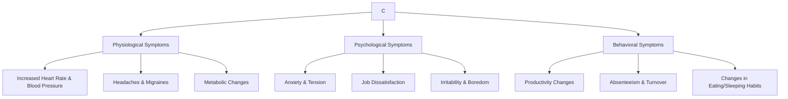

### (a)

#### What is power? How is leadership different from power?

**Power** refers to a capacity that an individual or group (A) has to influence the behavior of another individual or group (B), so that B acts in accordance with A’s wishes. The core fundamental of power is **dependence**: the greater B's dependence on A, the greater A's power in the relationship.
The key differences between **Leadership** and **Power** are outlined below:

|**Feature**|**Leadership**|**Power**|
|---|---|---|
|**Goal Compatibility**|Requires a substantial level of congruence and compatibility between the goals of the leader and the followers.|Does not require goal compatibility; it merely requires the **dependence** of the target.|
|**Direction of Influence**|Focuses heavily on **downward influence** on followers, minimizing lateral or upward influence patterns.|Focuses on tactics across all directions: **downward, upward, and laterally**.|
|**Research Emphasis**|Emphasizes leadership styles, traits, behavioral dynamics, and relationship-building with followers.|Emphasizes **tactics for gaining compliance** and managing dependencies within the structure.|

### (b)

#### What are the differences between distributive and integrative bargaining? Explain them with the help of suitable examples.

Bargaining strategies differ significantly based on their goals, motivation, focus, and relationship outcomes.

|**Bargaining Characteristic**|**Distributive Bargaining**|**Integrative Bargaining**|
|---|---|---|
|**Bargaining Goal**|Get as much of the pie as possible (**Win-Lose**)|Expand the pie so that both parties are satisfied (**Win-Win**)|
|**Motivation**|Win-Lose (Zero-sum game)|Win-Win (Positive-sum game)|
|**Interests**|Opposed to one another|Aligned or congruent with one another|
|**Information Sharing**|Low (Sharing info only allows the other party to take advantage)|High (Sharing info allows both parties to find creative solutions)|
|**Relationship Duration**|Short-term focused|Long-term focused|

> [!example] Example of Distributive Bargaining
> **Salary Negotiation:** An applicant is negotiating their starting salary with a hiring manager. Every dollar more that the applicant secures is a dollar less for the company's department budget. The interests are directly opposed, information about minimum acceptable limits is hidden, and the focus is purely on slice distribution.
> [!example] Example of Integrative Bargaining
> **Supplier-Manufacturer Partnership:** A smartphone manufacturer wants a lower component cost from a supplier, but the supplier cannot lower prices without hurting margins. Through high information sharing, they realize that modifying the delivery schedule allows the supplier to lower its warehouse overhead. The supplier passes these savings onto the manufacturer. Both parties achieve a win-win outcome while strengthening their long-term supply chain relationship.

### (c)

#### What forces act as sources of resistance to change?

Sources of resistance to change reside in basic human characteristics and organizational structural mechanics. They are broadly categorized into **Individual Sources** and **Organizational Sources**.

#### Individual Sources of Resistance

- **Habit:** To cope with life's complexities, individuals rely on habits or programmed responses. When confronted with change, this tendency to respond in accustomed ways becomes a source of resistance.
- **Security:** People with a high need for security are likely to resist change because it threatens their feeling of safety and introduces instability.
- **Economic Factors:** Changes in job tasks or established work routines can arouse economic fears if individuals are concerned they won't be able to perform up to new standards, reducing their pay.
- **Fear of the Unknown:** Change substitutes ambiguity and uncertainty for the known, which creates anxiety among employees.
- **Selective Information Processing:** Individuals shape their world through their perceptions. They selectively process information to keep their perceptions intact, ignoring data that challenges their established view.

#### Organizational Sources of Resistance

- **Structural Inertia:** Organizations have built-in mechanisms (such as selection processes, formalized regulations, and training programs) to maintain stability. When change is introduced, this structural inertia acts as a counterweight to sustain organizational equilibrium.
- **Limited Focus of Change:** Organizations consist of a number of interdependent subsystems. One cannot be changed without affecting the others. Limited systemic changes tend to get nullified by the larger unchanged framework.
- **Group Inertia:** Even if individuals want to change their behavior, group norms may act as a constraint or barrier to adopting organizational modifications.
- **Threat to Expertise:** Changes in organizational patterns may threaten the specialized expertise of specialized groups or technical departments.
- **Threat to Established Power Relationships:** Any redistribution of decision-making authority or institutional realignment can threaten long-established power dynamics within the organization.

### (d)

#### What are the consequences of stress?

Stress shows itself in a number of ways. The consequences of stress can be categorized into three general types: **Physiological**, **Psychological**, and **Behavioral** symptoms.

#### 1. Physiological Symptoms

Most early research on stress focused on health and medical conditions. Stress can create changes in metabolism, increase heart and breathing rates, increase blood pressure, bring on severe headaches, and trigger cardiovascular complications.

#### 2. Psychological Symptoms

Stress reveals itself through psychological states, impacting an employee's emotional well-being. This includes tension, chronic anxiety, irritability, boredom, procrastination, and direct declines in job satisfaction.

#### 3. Behavioral Symptoms

Behavioral consequences of stress include observable actions and changes in standard conduct. This includes changes in baseline productivity, increased absenteeism, elevated employee turnover, changes in eating habits, increased smoking or alcohol consumption, rapid speech, and severe sleep disorders.
