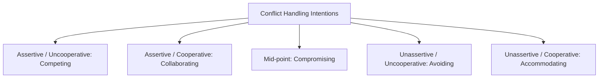

### (a)

#### Levels of Conflict and Conflict Management in Organizations

In organizational behavior, conflict is defined as a process that begins when one party perceives that another party has negatively affected, or is about to negatively affect, something that the first party cares about. Conflict can be analyzed across different structural levels and managed using distinct strategic interventions.

#### 1. Levels of Conflict (Loci of Conflict)

Conflict typically manifests across three primary levels within an organization:

- **Dyadic Conflict:** Conflict that occurs directly between two individuals. This often stems from personality clashes, interpersonal friction, or differing individual work styles.
- **Intragroup Conflict:** Conflict that occurs within a single workgroup, team, or department. It frequently involves disagreements over team goals, role assignments, or the specific processes required to complete a task.
- **Intergroup Conflict:** Conflict that occurs between different groups, departments, or divisions within an organization (e.g., friction between the marketing team and the production department over product delivery timelines). Intergroup conflict is often intense due to resource scarcity, divergent departmental goals, and "in-group vs. out-group" biases.

> [!info] **Alternative Classification: Types of Conflict**
> Within these levels, conflict can be categorized as **Task Conflict** (content and goals of the work), **Relationship Conflict** (interpersonal incompatibilities), or **Process Conflict** (how the work gets done).

#### 2. How an Effective Manager Handles Conflicting Situations

An effective manager can use conflict-management techniques to resolve dysfunctional friction or leverage functional conflict. Managers draw on the **Five Conflict-Handling Intentions** (derived from the Thomas-Kilmann conflict mode instrument), balanced along two dimensions: _cooperativeness_ (the degree to which one party attempts to satisfy the other party's concerns) and _assertiveness_ (the degree to which one party attempts to satisfy their own concerns).

- **Collaborating (Win-Win Approach):**
  - _Action:_ The manager brings both parties together to openly integrate their insights, investigate assumptions, and find a mutually satisfying solution that addresses all concerns fully.
  - _Best Used:_ When both sets of concerns are too important to be compromised, or when gaining commitment through consensus is vital.
- **Compromising (Middle Ground):**
  - _Action:_ The manager directs a negotiation process where each party gives up something of value, ensuring a fair distribution of concessions with no clear winner or loser.
  - _Best Used:_ When goals are important but not worth the disruption of more assertive approaches, or to achieve temporary settlements to complex issues under time pressure.
- **Accommodating (Smoothing):**
  - _Action:_ The manager encourages one party to place the opponent’s interests and relationship above their own, sacrificing individual desires to maintain harmony.
  - _Best Used:_ When the issue is much more important to the other party, when building social credits for later issues, or when harmony and stability are vital.
- **Competing (Forcing):**
  - _Action:_ The manager uses formal authority, mandates, or power to enforce a resolution that satisfies one party's desires at the complete expense of the other.
  - _Best Used:_ On vital issues where unpopular actions are necessary (e.g., cost-cutting, enforcing safety rules) or during emergencies when fast, decisive action is critical.
- **Avoiding (Withdrawal):**
  - _Action:_ The manager suppresses the conflict, postpones dealing with it, or physically withdraws from the conflicting parties to let passions cool.
  - _Best Used:_ When an issue is trivial, when more important issues are pressing, or when the potential disruption outweighs the benefits of resolution.

### (b)

#### Key Players in the Change Process and Approaches to Resistance

Organizational change involves shifting individuals, teams, and the structural apparatus from a current state to a desired future state. Managing this process successfully requires identifying key organizational actors and implementing systematic approaches to reduce resistance.

#### 1. Key Players in the Change Process

The change ecosystem relies on three essential roles acting in unison:

- **Change Agents:** These are the catalysts responsible for managing and implementing the operational aspects of the change activities. Change agents can be internal managers, specialized HR personnel, or external management consultants hired for their objective expertise. They diagnose problems, formulate action plans, and motivate the workforce through the transition.
- **Change Sponsors:** Typically top-level executives, CEOs, or board members who possess the structural authority to initiate, fund, and legitimize the change initiative. Without active, visible championship from a change sponsor, initiatives lack the institutional authority needed to overcome systemic inertia.
- **Change Targets:** The employees, teams, and supervisors who are directly impacted by the change and must alter their daily habits, behaviors, skills, or work processes. Their acceptance or rejection ultimately determines the success or failure of the change.

#### 2. Approaches to Deal with Resistance to Change

Managers and change agents can deploy several distinct strategic interventions to mitigate employee resistance, ranging from structural support to authoritative pressure:

|**Approach**|**Description / Application**|**Advantages**|**Drawbacks**|
|---|---|---|---|
|**Education and Communication**|Communicating the explicit logic behind the change through presentations, memos, and individual discussions to clear up misinformation or poor communication.|Fosters long-term alignment; helps employees see the necessity of change.|Can be time-consuming if large numbers of people are involved.|
|**Participation and Involvement**|Bringing potential resistors directly into the design and decision-making process of the change initiative before it is fully launched.|Reduces resistance substantially; utilizes the insights of targets to design better systems.|Potential for poor solutions if participants are unqualified; highly time-consuming.|
|**Building Support and Commitment**|Providing structural and emotional scaffolding such as employee counseling, new skills training, adjustment periods, or short-term paid leave.|Reduces emotional anxiety, skill-deficiency fears, and burnout during transition.|Expensive; takes significant operational time and resources.|
|**Implementing Changes Fairly**|Ensuring high procedural justice by applying criteria consistently, explaining outcomes transparently, and minimizing organizational bias.|Enhances trust in leadership; minimizes negative perceptions of change even if the outcome is painful.|Requires pre-existing institutional trust and rigorous management discipline.|
|**Manipulation and Co-optation**|Using covert attempts to influence others (manipulation), or "buying off" a resistance leader by giving them a key role in the change design purely to secure their endorsement (co-optation).|Can be a quick, relatively inexpensive way to neutralize influential resistant elements.|Can backfire disastrously if the targets realize they are being used, destroying managerial credibility.|
|**Coercion**|The application of direct threats, force, or authoritative penalties upon resistors (e.g., threats of transfer, blocked promotions, negative performance evaluations, or termination).|Highly effective when speed is essential and survival of the firm is on the line.|Destroys morale; fosters severe, long-term resentment and future passive-aggressive resistance.|
