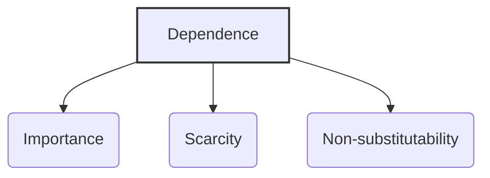

### (a)

#### Causes and consequences of political behavior

Political behavior in organizations consists of activities that are not required as part of an individual’s formal role but that influence, or attempt to influence, the distribution of advantages and disadvantages within the organization. The emergence of political behavior is driven by an interaction of individual and organizational factors, leading to specific psychological and behavioral consequences.

#### Causes of Political Behavior

##### 1. Individual Factors

Certain personality traits, needs, and qualities can encourage individuals to engage in political maneuvering:

- **High Self-Monitors:** Individuals who are highly sensitive to social cues and possess a high capacity to conform their behavior to external expectations. They are more skilled at political behaviors and more likely to utilize them.
- **Internal Locus of Control:** Employees who believe they have the power to control their own environment and destiny are more proactive in taking political actions to steer outcomes in their favor.
- **High Machiavellianism:** Individuals with a "Mach" personality are characterized by a pragmatic, emotionally distant approach, believing that the ends justify the means. They willingly manipulate situations for personal gain.
- **Organizational Investment:** An individual’s expectation of future returns from the organization influences their political involvement. If they have invested heavily in the company (e.g., time, specialized skills), they have more to lose and are more likely to use politics to protect their standing.
- **Perceived Job Alternatives:** If an individual has ample external employment opportunities, they are more willing to risk engaging in high-stakes internal political behavior.

##### 2. Organizational Factors

Organizational cultures and structural characteristics play a significant role in fostering political behavior:

- **Reallocation of Resources:** When organizational resources (such as budgets, space, or promotions) decline or shift, competition increases, and employees use political behavior to safeguard their interests.
- **Role Ambiguity:** When employee roles and expectations are poorly defined, the boundaries of proper behavior are unclear. This allows individuals to engage in political activities with a low risk of detection.
- **Unclear Performance Evaluation Systems:** If performance appraisals are subjective or focus on single outcomes rather than holistic contributions, employees divert energy toward managing impressions and playing politics rather than doing objective work.
- **Zero-Sum Reward Practices:** When rewards are structured as a win-lose proposition (where one person's gain is strictly another person's loss), employees are heavily incentivized to use political tactics to ensure their own success at the expense of others.
- **Self-Serving Senior Managers:** When employees witness top executives practicing political gamesmanship, a culture of politics is legitimized, encouraging lower-level staff to emulate those behaviors.

#### Consequences of Political Behavior

For the vast majority of employees who lack high political skills or do not wish to engage in workplace politics, the consequences are overwhelmingly negative:

- **Decreased Job Satisfaction:** When an environment is perceived as highly political, employees feel that merit is secondary to connections, leading to widespread disillusionment and lowered morale.
- **Increased Anxiety and Stress:** Constantly navigating shifting alliances, hidden agendas, and systemic favoritism creates a high-stress workspace where employees feel psychologically unsafe.
- **Increased Turnover:** High-performing individuals who refuse to participate in political games or feel unfairly bypassed often choose to leave the organization, resulting in a loss of valuable talent.
- **Reduced Performance:** When employees perceive the workplace as unfair and politically charged, their motivation drops, leading to lower productivity. Energy that should be spent on organizational goals is instead wasted on defensive behaviors or counter-maneuvering.

### (b)

#### How the different bases of power influence leadership effectiveness, and ethical considerations

Power refers to the capacity that an individual ($A$) has to influence the behavior of another ($B$) so that $B$ acts in accordance with $A$’s wishes. This power can be categorized into formal power and personal power, each influencing leadership effectiveness in distinct ways.

#### Bases of Power and Their Influence on Leadership Effectiveness

##### 1. Formal Power Bases

Formal power is grounded in an individual's structural position within an organization:

- **Legitimate Power:** This is the formal authority to control and use organizational resources based on structural position. While it ensures basic compliance, it rarely inspires extraordinary effort or true commitment.
- **Reward Power:** This relies on the leader's control over positive reinforcement, such as promotions, pay raises, or desirable work shifts. It is effective for short-term compliance, but its influence fades if the rewards dry up or lose value.
- **Coercive Power:** This depends on the fear of negative outcomes, such as demotion, suspension, or termination. Coercive power is highly detrimental to long-term leadership effectiveness. It fosters fear, resentment, and resistance, sabotaging employee engagement and performance.

##### 2. Personal Power Bases

Personal power stems from an individual’s unique characteristics and expertise, independent of their official title:

- **Expert Power:** This is influence wielded as a result of specialized expertise, unique skills, or technical knowledge. Leaders with high expert power are highly effective because employees trust their judgment and voluntarily follow their guidance.
- **Referent Power:** This develops out of admiration for a leader who possesses desirable traits or charisma. If employees like, respect, and identify with a leader, they will actively modify their behavior to mirror the leader’s expectations.

> [!info] **Impact on Effectiveness:** > Research consistently shows that **personal sources of power (expert and referent power) are the most effective drivers of leadership success.** They are positively related to employee satisfaction, organizational commitment, and high performance. Formal power bases—specifically coercive power—frequently backfire by triggering employee resistance.

#### Ethical Considerations in Utilizing Power

Leaders must continuously evaluate the ethical dimensions of how they leverage their power bases. Three primary criteria serve as a framework for ethical decision-making:

- **The Criterion of Utilitarianism:** Does the exercise of power result in the greatest good for the greatest number of people? If a leader utilizes power solely to protect their own position or reward a small group of sycophants at the expense of the collective unit, the behavior is unethical.
- **The Criterion of Rights:** Does the leader's action respect the fundamental rights of the individuals involved? Forcing compliance through coercive power that demeans employees, breaches their privacy, or suppresses their right to free speech violates ethical boundaries.
- **The Criterion of Justice:** Is the power being applied equitably and fairly? An ethical leader ensures that rewards and discipline are administered impartially based on objective standards, rather than using legitimate or reward power to favor specific individuals arbitrarily.

### (c)

#### The role of dependence in power relationships

The most crucial aspect of power is that it is a function of dependence. This dynamic is best understood through the **General Dependence Postulate**, which states:
$\text{The greater } B\text{'s dependence on } A\text{, the more power } A\text{ has over } B.$
When an individual or department possesses a resource that others require but cannot easily replicate, they create dependence and, consequently, hold power over those who need it. Independence reduces the power of others to dictate behavior.

#### Determinants of Dependence

Dependence within an organization is created and sustained by three specific characteristics of the resource in question:

##### 1. Importance

To create dependence, the resource controlled must be vital to the organization's survival or success. If a department controls a resource that nobody cares about or that does not impact organizational performance, it does not generate dependency. For example, during a critical legal audit, the legal compliance team gains immense power because their performance determines whether the company survives regulatory penalties.

##### 2. Scarcity

If a resource is abundant, possessing it does not create power. However, if a resource is rare, individuals who control it command high levels of dependence. This applies to physical assets, budgets, and specialized talent. For instance, if an organization relies on an old legacy software system and only one engineer knows how to maintain it, that engineer holds significant power due to the extreme scarcity of their skill set.

##### 3. Non-substitutability

The fewer viable alternatives or substitutes available for a resource, the more power is concentrated in the hands of whoever controls it. If an employee performs a function that cannot be outsourced, automated, or easily learned by another staff member, their level of non-substitutability is exceptionally high. Management must accommodate their preferences because losing them would cause a severe disruption to operations.
