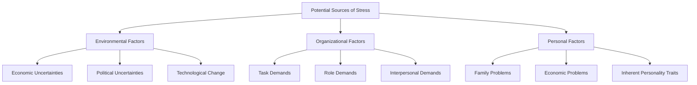

### (a)

#### Definition and Steps of the Negotiation Process

Negotiation is a process in which two or more parties exchange goods or services and attempt to agree on the exchange rate for them. Within an organizational context, negotiation is a critical tool for resolving conflicts, establishing terms of employment, structuring partnerships, and driving collective decision-making.
The negotiation process consists of five distinct steps:

1. **Preparation and Planning**
   Before any negotiation begins, parties must conduct extensive research and strategic analysis. This step involves defining the nature of the conflict, understanding the history leading to the negotiation, identifying the individuals involved, and clarifying goals. A critical component of this phase is determining your **BATNA** (Best Alternative to a Negotiated Agreement), which represents the lowest acceptable value you will take before walking away. Understanding the opposing party's potential goals and BATNA is equally crucial to establishing a strategic advantage.
2. **Definition of Ground Rules**
   Once preparation is complete, the parties must establish the procedural rules and guidelines that will govern the negotiation. Key procedural questions addressed during this phase include:
   - Who will conduct the negotiation?
   - Where will the meetings take place?
   - What time constraints or deadlines will apply?
   - To what specific issues will the negotiation be limited?
   - What procedure will be followed if an impasse is reached?
     During this phase, parties also exchange their initial proposals, demands, or positions.
3. **Clarification and Justification**
   After exchanging initial positions, both parties explain, amplify, clarify, bolster, and justify their original demands. This step is not intended to be confrontational; rather, it serves as an educational opportunity for both sides to understand each other’s underlying interests, the significance of the issues, and how each party arrived at their initial proposals. Parties may provide documentation or data to support their positions.
4. **Bargaining and Problem Solving**
   This phase is the core of the negotiation process, where the actual give-and-take occurs to hammer out an agreement. Both parties engage in discussions to resolve differences, make concessions, and compromise. The focus shifts toward finding a mutually acceptable solution, utilizing either distributive bargaining (win-lose) or integrative bargaining (win-win) strategies to create value and satisfy the core interests of both sides.
5. **Closure and Implementation**
   The final step in the negotiation process involves formalizing the agreement that has been worked out and developing procedures necessary for its implementation and monitoring. For formal organizational or legal matters, this requires drafting specific contract language. For smaller-scale internal negotiations, closure may culminate in a formal written summary, an email confirmation, or a handshake.

### (b)

#### Definition and Potential Sources of Stress

Stress is a dynamic condition in which an individual is confronted with an opportunity, a demand, or a resource related to what the individual desires, and for which the outcome is perceived to be both uncertain and important.
The potential sources of stress can be categorized into three primary factors:

#### 1. Environmental Factors

Uncertainties in the external environment can significantly influence organizational operations and individual stress levels. These include:

- **Economic Uncertainties:** Changes in the business cycle create anxiety over job security, salary cuts, and layoffs.
- **Political Uncertainties:** Political instability, regulatory shifts, or civil unrest can disrupt organizational continuity and cause systemic stress.
- **Technological Change:** Rapid innovations can render an employee's skills and knowledge obsolete in a short period, creating a persistent fear of replacement.

#### 2. Organizational Factors

Pressures stemming directly from within the workplace are a primary driver of employee stress. They are categorized as:

- **Task Demands:** Factors related to an employee's job design, working conditions, physical layout, and work quotas. Accelerated workloads and unreasonable deadlines fall into this category.
- **Role Demands:** Pressures relating to the function an individual occupies within the organization. This manifests as _role conflict_ (contradictory expectations), _role overload_ (too many responsibilities to handle efficiently), and _role ambiguity_ (unclear job expectations).
- **Interpersonal Demands:** Pressures created by other employees. A lack of social support from peers, poor relationship dynamics, or working under an abrasive, micromanaging supervisor can escalate stress.

#### 3. Personal Factors

Because individuals carry their private lives into their work domains, personal problems represent a major source of stress:

- **Family Problems:** Relationship difficulties, marital conflicts, or caregiving responsibilities for children or elderly relatives.
- **Economic Problems:** Financial mismanagement, personal debt, or unmanageable living expenses that distract and overwhelm the employee.
- **Inherent Personality Traits:** An individual’s dispositional makeup, such as a high level of neuroticism or a highly competitive Type A personality, which influences how intensely they perceive and react to stressors.

### (c)

#### Effects of Stress on Organizational Performance

Stress affects organizational performance through an **inverted-U relationship**. The impact varies depending on whether the experienced stress is low, moderate, or high.

- **Low to Moderate Levels of Stress (Functional Stress):** At low-to-moderate levels, stress can act as a positive motivator. It stimulates the body and mind, increasing alertness, cognitive capacity, and the motivation to react to challenges. This type of stress helps employees work harder, increases energy, boosts performance, and helps individuals meet critical organization deadlines.
- **High Levels of Stress (Dysfunctional Stress):** When stress exceeds a manageable threshold and becomes chronic or excessive, it acts as a destructive force that degrades performance.
  High stress impairs performance through three primary categories of symptoms:

|**Symptom Category**|**Direct Effects on the Individual**|**Consequent Impact on Organizational Performance**|
|---|---|---|
|**Physiological**|Increased blood pressure, elevated heart rate, tension headaches, fatigue, and chronic illnesses.|High rates of unscheduled absenteeism, physical incapacitation, and elevated healthcare/insurance costs for the firm.|
|**Psychological**|Anxiety, depression, decreased job satisfaction, irritability, emotional exhaustion, and burnout.|Reduced focus, lack of concentration, poor decision-making quality, and a breakdown in workplace collaboration.|
|**Behavioral**|Changes in productivity, rapid changes in eating/sleeping habits, increased smoking/alcohol consumption, rapid speech, and restlessness.|Increased error rates, lower total output quality, workplace accidents, and a substantial increase in voluntary employee turnover.|

Ultimately, when dysfunctional stress spreads across an organization, overall productivity drops, team cohesion fractures, customer service quality declines, and the company incurs substantial costs due to the need to continuously replace and retrain departing talent.
