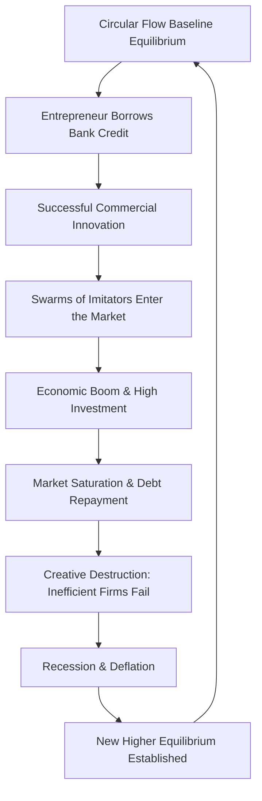

### (a)

#### Schumpeterian Theory of Economic Development and Its Criticisms

Joseph Schumpeter's theory of economic development, primarily outlined in his seminal work _The Theory of Economic Development_ (1911), shifts the focus of economic growth away from traditional static equilibrium analyses and places structural, dynamic changes at the center. Unlike classical economists who emphasized capital accumulation and population growth, Schumpeter argued that development is driven by internal, discontinuous, and revolutionary changes in economic life.

##### Core Components of the Schumpeterian Model

###### 1. The Circular Flow (The Stationary State)

Schumpeter begins with the concept of the "circular flow," a state of perfect macroeconomic equilibrium where economic activity repeats itself rhythmically year after year.

- **Characteristics**: In this state, there are no structural changes, no net investments, no savings, and profits are zero (except for wages of management and ground rent). Demand perfectly matches supply, and every producer knows their market behavior based on historical experience.
- **Function**: It serves as the baseline from which real economic development departs.

###### 2. Development as a Discontinuous Change

Schumpeter defines development as the execution of new combinations that disrupt the equilibrium of the circular flow. It is a spontaneous and discontinuous change in the channels of the flow, disturbance of equilibrium, which alters and displaces the equilibrium state previously existing.

###### 3. Innovation and the Five Forms of New Combinations

Development is driven by **innovation**, which is distinctly different from invention. An invention is the discovery of new scientific or technical knowledge, whereas an innovation is the commercial application of that knowledge. Schumpeter classifies innovation into five distinct categories:

1. **Introduction of a new good**: Launching a product that consumers are not yet familiar with, or a new quality of a good.
2. **Introduction of a new method of production**: Implementing a production process not yet tested by experience in the branch of manufacture concerned.
3. **Opening of a new market**: Entering a market into which the particular branch of manufacture of the country has not previously entered, whether or not this market has existed before.
4. **Conquest of a new source of supply**: Securing a new source of raw materials or semi-manufactured goods, irrespective of whether this source has to be created or already exists.
5. **Carrying out of the new organization of any industry**: Structural restructuring, such as the creation of a monopoly position or the breaking up of a monopoly position.

###### 4. The Role of the Entrepreneur

The entrepreneur is the central figure in Schumpeter’s theory. They are not merely managers, capitalists, or investors; they are visionaries who possess the capability and psychological drive to execute "new combinations."

- **Motivations**: Schumpeter identifies three non-hedonistic motives for entrepreneurs:
  - The desire to found a private kingdom or dynasty.
  - The will to conquer, the impulse to fight, to prove oneself superior to others.
  - The joy of creating, of getting things done, or simply of exercising one's energy and ingenuity.

###### 5. Credit Creation and the Role of Banks

Because the circular flow assumes no savings or surplus funds, entrepreneurs cannot finance their innovations out of existing capital. Therefore, bank credit creation is an indispensable condition for development.

- Banks provide newly created money (fiat credit) to the entrepreneur.
- This credit allows the entrepreneur to bid resources away from the traditional channels of the circular flow and divert them toward innovative, high-yield configurations.

##### The Cyclical Growth Process: The Process of Creative Destruction

Economic development is not a smooth, linear progression; it occurs through cyclical fluctuations. Schumpeter explains this using a wave-like process:

- **The Boom (Prosperity Phase)**: When an exceptional pioneer successfully innovates, supernormal profits are realized. This breaks open new pathways, and a "swarm" of secondary imitators follows. Investment surges, demand for inputs rises, incomes expand, and the economy undergoes a vigorous boom.
- **The Bust (Recession Phase)**: As the new products flood the market, competition intensifies, and supernormal profits vanish. Simultaneously, entrepreneurs begin to repay their bank loans out of profits, causing credit contraction.
- **Creative Destruction**: Old, obsolete firms operating within the old circular flow cannot compete with the lower costs or superior products of the innovators and are liquidated. This cleansing process, termed **"Creative Destruction,"** forces the economy into a recession until it settles into a new, structurally advanced equilibrium position at a higher level of productive capacity.

##### Criticisms of the Schumpeterian Theory

While highly influential in describing the dynamic nature of capitalism, Schumpeter's model faces significant criticisms, particularly regarding its realism and its applicability to modern global contexts:

1. **Overemphasis on the Entrepreneur**: Schumpeter views the entrepreneur as an isolated, heroic figure. In modern corporate capitalism, innovation is institutionalized and handled by large R\&D departments, teams, and state-funded laboratories rather than lone individuals.
2. **Exaggerated Reliance on Bank Credit**: The model assumes that all initial innovations are financed solely through inflationary bank credit. It overlooks the critical roles played by corporate retained earnings, equity financing, venture capital, and public fiscal interventions.
3. **Inapplicability to Less Developed Countries (LDCs)**: The theory is highly tailored to advanced capitalistic societies. LDCs typically lack:
   - A class of high-risk-bearing entrepreneurs.
   - Well-developed institutional frameworks and financial markets.
   - The capacity for fundamental innovation (LDCs rely heavily on adaptation, imitation, and technology transfer rather than pioneering innovations).
4. **Neglect of the Agricultural Sector**: Schumpeter's framework is heavily biased toward industrial and commercial sectors. It ignores the fact that in many developing economies, structural transformation and economic development originate from agrarian productivity shocks.
5. **Psychological and Unquantifiable Factors**: By grounding the entire engine of development on the subjective psychological motivations of the entrepreneur, the theory becomes difficult to measure mathematically, formalize into public policy, or replicate through national economic planning.

### (b)

#### The Harrod-Domar Model of Economic Growth

The Harrod-Domar model represents a milestone in modern growth economics. Formulated independently by Sir Roy Harrod in 1939 and Evsey Domar in 1946, the model extends John Maynard Keynes’ short-run static macroeconomic analysis into a dynamic, long-run theory of economic growth.

##### The Core Concept: The Dual Role of Investment

The foundational insight of the Harrod-Domar model is that **investment plays a dual role** in the macroeconomy:

1. **Demand Effect**: It generates income via the Keynesian multiplier process ($Y = C + I$).
2. **Supply Effect**: It increases the productive capacity of the economy by expanding the physical capital stock ($K$).

While Keynes focused almost exclusively on the demand-side income-generation properties of investment to solve short-run unemployment, Harrod and Domar argued that for continuous, non-inflationary growth, the expanded capacity generated on the supply side must be fully matched by an equivalent expansion in aggregate demand.

##### Mathematical Formulation and Derivation

###### Key Assumptions

- A closed economy with no government sector ($Y = C + I$).
- The savings ratio ($s$) is a constant fraction of national income ($Y$), meaning $S = sY$, where $s$ is both the marginal and average propensity to save.
- The capital-output ratio ($v$), also known as the Incremental Capital-Output Ratio (ICOR), is constant:

  $v = \frac{K}{Y} = \frac{\Delta K}{\Delta Y}$
- Capital does not depreciate, or depreciation is accounted for net of investment.
- Capital and labor are used in fixed proportions; there is no substitution between the factors of production.

###### Mathematical Derivation

By definition, macroeconomic equilibrium requires that planned savings equal planned investment:

$S = I$

Since savings is a function of income:

$S = sY$

The incremental capital stock ($\Delta K$) required to produce an additional unit of output ($\Delta Y$) is governed by the capital-output ratio ($v$):

$v = \frac{\Delta K}{\Delta Y} \implies \Delta K = v \cdot \Delta Y$

Because net investment ($I$) is simply the change in the capital stock ($\Delta K$):

$I = \Delta K = v \cdot \Delta Y$

Substituting the definitions of $S$ and $I$ back into the equilibrium condition ($S = I$):

$sY = v \cdot \Delta Y$

To find the growth rate of output ($g$), we rearrange the equation by dividing both sides by $Y$ and $v$:

$\frac{\Delta Y}{Y} = \frac{s}{v}$

Letting $g = \frac{\Delta Y}{Y}$ denote the rate of growth of national income, we obtain the fundamental Harrod-Domar growth equation:

$g = \frac{s}{v}$

> [!Summary of Equation]
> The rate of growth of an economy ($g$) is directly proportional to the savings rate ($s$) and inversely proportional to the capital-output ratio ($v$). To accelerate growth, an economy must either increase its rate of savings or improve its capital efficiency (which lowers the value of $v$).

##### Harrod's Three Distinct Growth Rates

To evaluate long-run stability, Harrod broke down the growth path into three separate growth rates:

1. **Actual Growth Rate ($G$)**: The real, observed rate of change in cyclical output over a given period, determined by prevailing empirical savings and investment ratios:

   $G = \frac{s}{v}$
2. **Warranted Growth Rate ($G_w$)**: The full-capacity growth rate at which producers are completely satisfied that their investment decisions match market demand. At this rate, there is neither overproduction nor underproduction, and capital is fully utilized:

   $G_w = \frac{s}{v_r}$

   _(where $v_r$ represents the required capital-output ratio to maintain entrepreneurial satisfaction)_.
3. **Natural Growth Rate ($G_n$)**: The maximum potential growth rate achievable by the economy given its structural physical constraints, specifically the growth rate of the labor force ($n$) and the rate of technical progress ($\lambda$):

   $G_n = n + \lambda$

##### The "Knife-Edge" Equilibrium Problem

For an economy to maintain a stable, non-inflationary path with full employment of both capital and labor, all three growth rates must perfectly coincide:

$G = G_w = G_n$

However, Harrod and Domar argued that this triple equality is highly unlikely to occur naturally. Because the determinants of these rates ($s$, $v$, $n$, and $\lambda$) are fixed by independent institutional, demographic, and technological factors, there is no automatic market mechanism to bring them into alignment.

This structural instability is known as the **"Knife-Edge Equilibrium"**:

|**Condition**|**Consequences**|
|---|---|
|**$G > G_w$**|Actual growth outpaces the capacity additions that entrepreneurs intended. Shortages arise, driving down inventories and prompting businesses to scale up investment further. This results in cumulative, secular **inflation**.|
|**$G < G_w$**|Production capacity grows faster than actual market demand. Unsold inventories pile up, capital goes underutilized, and entrepreneurs cut back production. This creates a downward spiral into systemic **depression and chronic unemployment**.|
|**$G_w > G_n$**|The economy's warranted requirement for capital expansion outstrips the physical availability of labor and technical progress. The growth engine hits a structural ceiling, leading to long-run **stagnation and structural unemployment**.|

##### Policy Implications for Developing Countries (LDCs)

The model has direct policy relevance for economies like Bangladesh:

- **The Savings Gap**: LDCs typically experience low growth rates because low per-capita incomes lead to low domestic savings rates ($s$).
- **Targeting the Gap**: If a country wishes to achieve a target growth rate ($g^*$) but lacks the required internal savings ($s^* = g^* \times v$), it faces a "savings gap."
- **Remedying the Gap**: Governments can close this gap by:
  - Mobilizing foreign aid, concessionary loans, and foreign direct investment (FDI).
  - Advancing structural reforms to lower the capital-output ratio ($v$), thereby increasing capital productivity through efficiency gains and better technology.
