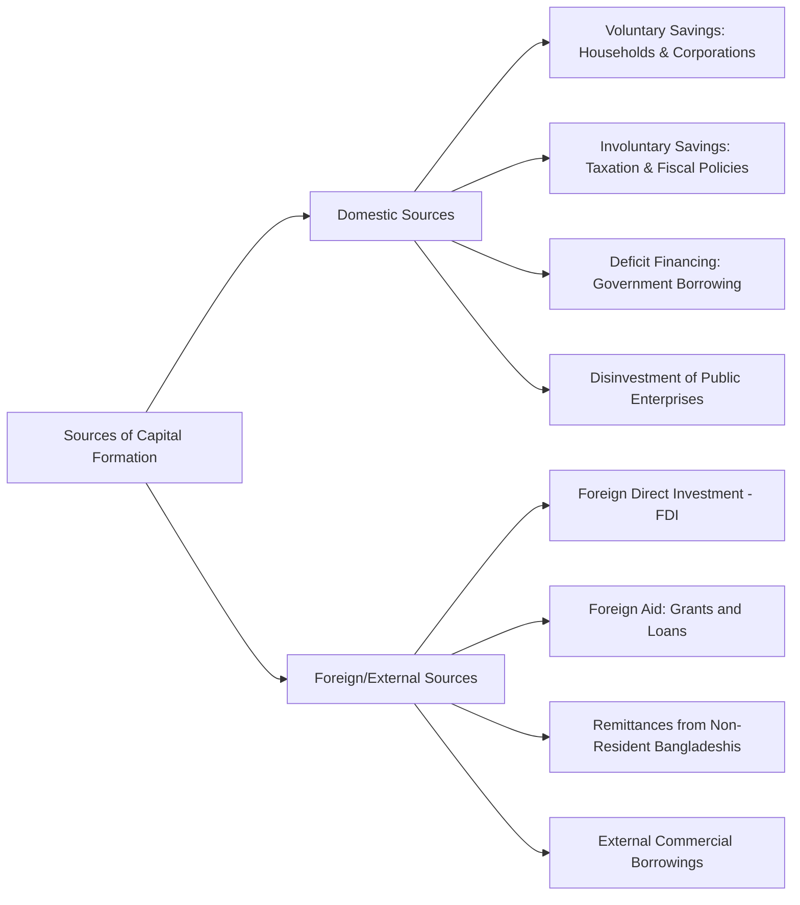

### (a)

#### Capital Formation as a Measure of Economic Development and Its Sources

##### Capital Formation as a Measure of Economic Development

Capital formation refers to the net addition to the physical stock of capital goods (such as machinery, equipment, buildings, and infrastructure) in an economy during a given period. It represents the process of diverting a portion of society's current income from consumption to investment. In the context of Bangladesh, capital formation serves as a critical measure and driver of economic development due to the following reasons:

- **Increases Productive Capacity:** By building roads, bridges, power plants, and industrial infrastructure, capital formation expands the country's production frontier, enabling higher output levels across agriculture, manufacturing, and services.
- **Enhances Labor Productivity:** Providing workers with better machinery, tools, and technical infrastructure elevates the output per worker, leading to real wage increases and higher living standards.
- **Promotes Technological Progress:** Modern capital equipment embeds advanced technology. Therefore, the rate of capital formation dictates how rapidly an economy can adopt and assimilate modern, efficient production techniques.
- **Generates Employment Opportunities:** The construction of physical capital and the subsequent operation of new factories and businesses create substantial direct and indirect employment, helping absorb the surplus labor force.
- **Breaks the Vicious Circle of Poverty:** Low income leads to low savings, low investment, and low capital formation, which perpetuates low income. Accelerating capital formation breaks this circle by elevating investment levels and driving continuous economic growth.

##### Sources of Capital Formation

The sources available to Bangladesh for mobilizing capital can be broadly categorized into domestic and foreign sources:

###### 1. Domestic Sources

- **Voluntary Savings:** This includes individual or household savings deposited in banking institutions, insurance policies, and national savings certificates, alongside corporate retained earnings reinvested into businesses.
- **Involuntary Savings (Taxation):** The government forces compulsory savings by raising revenue through direct taxes (income tax, corporate tax) and indirect taxes (VAT, customs duties). The surplus of government revenue over current expenditure is directed toward capital expenditure.
- **Deficit Financing:** When administrative revenues are insufficient, the government borrows from the central bank (by printing money) or commercial banks to fund development projects, acting as a forced mobilization of domestic resources.
- **Public Enterprise Profits:** Surplus revenues generated by state-owned enterprises, statutory corporations, and utilities that are plowed back into infrastructural development.

###### 2. Foreign / External Sources

- **Foreign Direct Investment (FDI):** Inflows of equity capital from multinational corporations investing directly in manufacturing, telecommunications, energy, and infrastructure projects.
- **Foreign Aid and Concessional Loans:** Official Development Assistance (ODA) received from bilateral partners (such as Japan, USA) and multilateral institutions (such as the World Bank, Asian Development Bank, Islamic Development Bank) in the form of grants and soft loans.
- **Remittances:** Inflows of foreign currency sent home by Bangladeshi expatriates working abroad. This acts as a massive source of liquidity that drives private residential investment, SME capital, and consumption-led economic activities.
- **External Commercial Borrowing:** Loans secured by local businesses or the sovereign government from international commercial capital markets at prevailing market interest rates.

### (b)

#### Role of Deficit Financing in Economic Development

Deficit financing is a financial practice where the government’s total expenditure exceeds its structural revenues (taxes, fees, and profits), and the gap is closed through borrowing from the central bank, commercial banking networks, or public debt instruments. For a developing country like Bangladesh, deficit financing plays a major, deliberate role in catalyzing economic development.

##### Key Contributions to Economic Development

- **Financing Large-Scale Infrastructure:** Developing countries often face severe resource constraints that prevent them from funding vital megaprojects (such as the Padma Bridge, Dhaka Metro Rail, and Deep Sea Ports) solely out of tax revenue. Deficit financing provides the upfront capital necessary to build these high-yielding economic foundations.
- **Mobilizing Unutilized Resources:** In an underdeveloped or developing economy, resources—especially structural surplus labor and unexploited raw materials—frequently sit idle due to lack of demand and capital. Government investment funded by deficits pulls these idle resources into the productive cycle.
- **Crowding-In Private Investment:** Public investments in transport, communication, and energy infrastructure lower the cost of doing business, making private investment projects viable and profitable, thereby inducing additional private capital accumulation.
- **Mitigating Economic Recessions:** During economic downturns or global shocks, private consumption and investment drop. Deficit-financed public spending acts as a counter-cyclical tool to stabilize aggregate demand and maintain momentum.

##### Associated Risks and Safe Limits

While deficit financing is highly effective for accelerating development, its utility depends directly on staying within manageable financial boundaries:

> [!warning] The Risk of Inflationary Pressures
> If deficit financing is channeled toward consumption, unproductive administrative expenses, or long-gestation projects without a near-term increase in consumer goods output, the domestic money supply expands faster than real output. This imbalance causes high structural inflation, which erodes real incomes, worsens income inequality, and destabilizes the macroeconomic environment.

- **Debt Sustainability Constraints:** Persistent and unmanaged deficit financing builds up high public debt. If the real GDP growth rate falls below the real cost of debt servicing, an increasing share of national revenue is diverted to pay interest, choking off future developmental expenditures.
- **Crowding-Out Effect:** If the government relies excessively on domestic commercial banks to fund its deficit, it reduces the supply of loanable funds available to the private sector and pushes up interest rates, which can stifle private commercial development.
