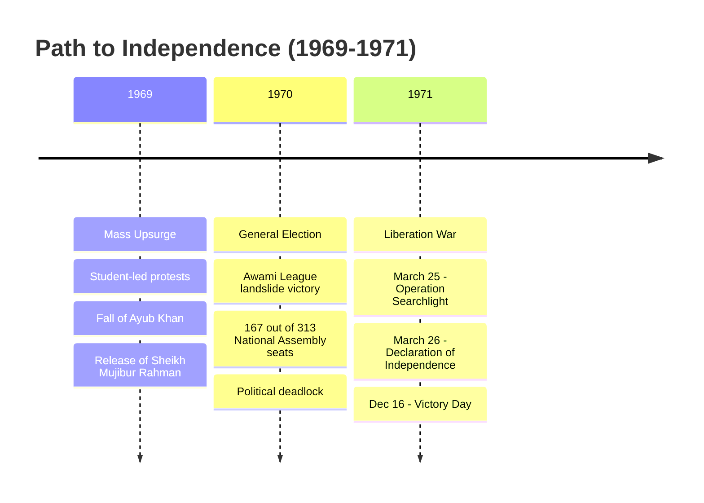

### (a)

#### History of Bangladesh: Mass Upsurge (1969), Election (1970), and Birth of Bangladesh (1971)

The emergence of Bangladesh as an independent nation was the culmination of long-standing political, economic, and cultural exploitation of East Pakistan by the West Pakistani ruling elite. The final phase of this struggle was marked by three seismic historical milestones:

##### 1. The Mass Upsurge of 1969

The Mass Upsurge (_Gono Obvuthon_) of 1969 was an unprecedented democratic movement in East Pakistan.

- **Triggers:** The discontent against the autocratic regime of President Ayub Khan reached its peak due to economic disparity, the deprivation of Bengalis, and the infamous **Agartala Conspiracy Case** (1968), which falsely accused Sheikh Mujibur Rahman and 34 others of treason.
- **The Movement:** In early 1969, the Central Students Action Committee formulated an 11-point demand that integrated the essence of Awami League's 6-point charter. The movement turned violent following the targeted killings of student leader Amanullah Asaduzzaman, Sergeant Zahurul Haq in custody, and Dr. Shamsuzzoha of Rajshahi University.
- **Outcome:** Facing absolute civil paralysis, the Ayub Khan regime collapsed. On February 22, 1969, the government unconditionally released Sheikh Mujibur Rahman and dropped all charges. The next day, he was formally honored with the title **"Bangabandhu"** (Friend of Bengal). Ayub Khan resigned in March 1969, handing power over to General Yahya Khan, who promised general elections.

##### 2. The General Election of 1970

The first-ever general elections in Pakistan were held on December 7, 1970, under the Legal Framework Order (LFO).

- **The Mandate:** The Awami League contested the election primarily on the platform of the **Six-Point Program**, which demanded absolute regional autonomy for East Pakistan.
- **The Results:** The Awami League achieved a historic landslide victory. In the National Assembly, it won **160 out of 162** directly elected seats allocated to East Pakistan, securing an absolute majority in the 313-seat all-Pakistan parliament. In the Provincial Assembly, it secured 288 out of 300 seats.
- **The Crisis:** The West Pakistani military junta and Zulfikar Ali Bhutto (leader of the Pakistan Peoples Party, which won the majority in West Pakistan) refused to accept the democratic verdict. They conspired to delay the convention of the National Assembly, which was scheduled for March 3, 1971, triggering massive civil disobedience across East Pakistan.

##### 3. The Birth of Bangladesh in 1971

The refusal to hand over power led directly to the Liberation War.

- **Non-Cooperation and March 7 Speech:** Bangabandhu gave a historic address on March 7, 1971, at the Racecourse Maidan, effectively calling for independence: _"The struggle this time is for our emancipation! The struggle this time is for our independence!"_
- **Operation Searchlight:** On the night of March 25, 1971, the Pakistani military launched a brutal, pre-planned genocide against unarmed Bengali citizens, targeting intellectuals, students, and law enforcement personnel.
- **Declaration of Independence:** In the early hours of **March 26, 1971**, just before his arrest by the Pakistani army, Bangabandhu Sheikh Mujibur Rahman formally declared the independence of Bangladesh via a wireless message.
- **The Liberation War:** A provisional government (the **Mujibnagar Government**) was formed on April 10, 1971, taking oath on April 17, with Bangabandhu as President (in absentia) and Tajuddin Ahmad as Prime Minister. For nine months, the Bengali freedom fighters (_Mukti Bahini_) waged a heroic guerrilla war against the occupation forces.
- **Victory:** Following joint operations with the Indian Allied Forces in December, the Pakistani military command surrendered unconditionally at the Ramna Racecourse on **December 16, 1971**. With the surrender of 93,000 Pakistani troops, Bangladesh was born as a sovereign, independent state.

### (b)

#### Features of the 1972 Constitution of Bangladesh

The Constitution of the People's Republic of Bangladesh was drafted within a year of independence by a Constitution Drafting Committee headed by Dr. Kamal Hossain. It was adopted by the Constituent Assembly on November 4, 1972, and came into effect on **December 16, 1972** (the first anniversary of Victory Day).

The key features of the original 1972 Constitution include:

- **Written and Rigid Character:** It is a comprehensive written document. It is classified as rigid because any amendment requires a two-thirds majority vote of the total number of members of the Jatiya Sangsad.
- **Four Fundamental Principles of State Policy:** The original constitution anchored the state on four structural pillars:
  1. _Nationalism:_ Unity based on Bengali culture, language, and shared identity.
  2. _Socialism:_ Establishing an exploitative-free society and ensuring social and economic justice.
  3. _Democracy:_ Ensuring fundamental human rights, freedoms, and effective political participation.
  4. _Secularism:_ Elimination of communalism, religious discrimination, and the political abuse of religion.
- **Parliamentary Form of Government:** It established a Westminster-style parliamentary system. The President acts as the constitutional head of state, while real executive power is vested in the Prime Minister, who leads the Cabinet and remains collectively accountable to the Parliament.
- **Unitary State Structure:** Bangladesh was designated as a unitary republic. All administrative power flows from the central government based in Dhaka, without any federal divisions or provincial legislative structures.
- **Unicameral Legislature:** The constitution provided for a single-chamber parliament named **Jatiya Sangsad** (National Parliament), consisting of directly elected representatives representing single-member geographic constituencies.
- **Fundamental Rights:** Part III of the Constitution explicitly guarantees basic fundamental rights to all citizens, including freedom of speech, assembly, movement, religion, and the right to constitutional remedies.
- **Independence of the Judiciary:** The constitution guaranteed the separation of the judiciary from the executive branch, ensuring that the Supreme Court could act neutrally as the guardian and interpreter of the constitution.
- **Universal Adult Suffrage:** It established the principle of "one person, one vote," granting voting rights to every citizen aged 18 and above, regardless of race, caste, religion, or gender.

### (c)

#### Legislative Branch of Bangladesh

The legislative branch of Bangladesh is a unicameral body known as the **Jatiya Sangsad** (House of the Nation or National Parliament). It serves as the supreme lawmaking organ of the state.

##### Structure and Composition

- **Total Seats:** The Jatiya Sangsad consists of **350 seats**.
- **Directly Elected Members (300):** 300 members are directly elected from single-member territorial constituencies using the first-past-the-post (FPTP) system based on universal adult suffrage.
- **Reserved Seats for Women (50):** To ensure gender representation, 50 seats are exclusively reserved for women. These seats are allocated to political parties proportionally based on their total share of elected seats in the 300-constituency general election.
- **Term of Office:** The standard tenure of the parliament is **5 years** from the date of its first sitting, unless it is dissolved earlier by the President upon the written advice of the Prime Minister.

##### Key Functions and Powers

- **Lawmaking:** The primary function is to enact, amend, repeal, and update laws for the country. Bills passed by the Parliament become law upon receiving assent from the President.
- **Financial Control:** The power of the purse belongs entirely to the legislature. No tax can be levied, and no public expenditure can be incurred without an Act of Parliament. The annual National Budget must be proposed and passed in the parliament.
- **Executive Accountability:** Parliament keeps checks and balances on the ruling cabinet through parliamentary standing committees, question-answer sessions, and motions of no confidence.

### (d)

#### Ways to Improve the Public Administration of Bangladesh

The public administration system of Bangladesh inherited a colonial-bureaucratic framework designed more for regulatory control than for citizen-centric socio-economic development. To improve efficiency, transparency, and responsiveness, the following reforms are highly recommended:

- **Implementation of Robust e-Governance and Digitalization:** Transitioning fully to paperless, AI-assisted workflows (Smart Governance) will minimize bureaucratic red tape, reduce manual processing delays, and curb institutional corruption by eliminating unnecessary physical interactions between citizens and public officials.
- **Institutionalizing Accountability and Transparency:** Strengthening independent oversight bodies like the Anti-Corruption Commission (ACC) and implementing the Office of the Ombudsman (as mandated by Article 77 of the Constitution) will ensure comprehensive structural monitoring.
- **Transition to Merit-Based Recruitment and Promotion:** Phasing out non-functional quotas and replacing seniority-based promotions with strict Performance Appraisal Systems (PAS) ensures that highly competent professionals fill critical policymaking roles.
- **Administrative Decentralization:** Transferring administrative, fiscal, and planning autonomy from central secretariats down to local government tiers (such as Upazila and Zila Parishads) will make governance responsive to grassroots development realities.
- **Continuous Capacity Building and Training:** Upgrading foundational and in-service training frameworks at institutions like the Bangladesh Public Administration Training Centre (BPATC) to emphasize modern financial management, strategic crisis handling, and public service ethics.
