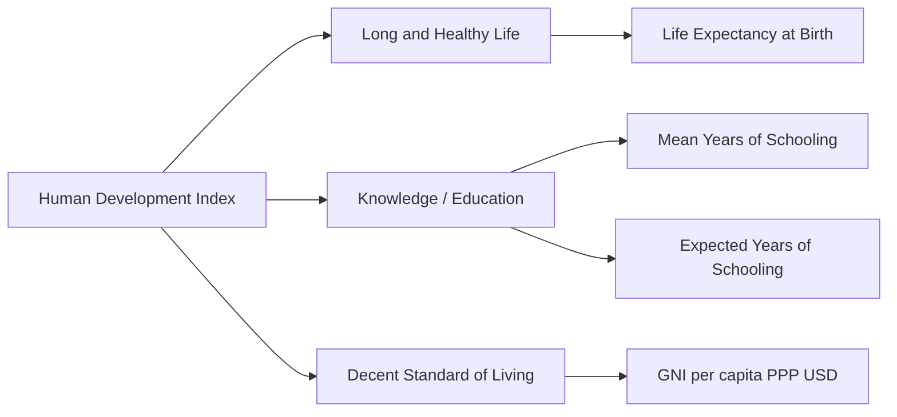

### (a)

#### Economic Growth vs. Economic Development and Obstacles to Development in Bangladesh

Economic growth does not equate to economic development. While the two terms are often used interchangeably in casual discourse, they represent fundamentally distinct economic phenomena in development economics:

- **Economic Growth:** This is a narrow, purely quantitative concept. It refers to a sustained increase in the country's real output of goods and services over a long period, typically measured by the annual percentage increase in the Real Gross Domestic Product (GDP) or Real Gross National Product (GNP). It focus entirely on the expansion of production capacity and macro income levels without regard to how that income is distributed or how it affects human well-being.
- **Economic Development:** This is a comprehensive, multi-dimensional qualitative and quantitative concept. It encompasses economic growth plus progressive structural, institutional, and socioeconomic changes. It involves the reduction of poverty, inequality, and unemployment, alongside structural shifts in production (e.g., from traditional agriculture to modern industrial and service sectors) and improvements in the overall quality of life, capabilities, and freedoms of the population.

|**Dimension**|**Economic Growth**|**Economic Development**|
|---|---|---|
|**Nature of Change**|Quantitative change only.|Both quantitative and qualitative changes.|
|**Scope**|Narrow; focuses on GDP, GNP, and per capita income.|Broad; includes structural shifts, human well-being, and institutional reforms.|
|**Indicators**|Real GDP, Real GNP, Per Capita Income.|Human Development Index (HDI), Gini Coefficient, Poverty Headcount Ratio, Life Expectancy.|
|**Structural Shift**|Does not guarantee structural change in production or society.|Requires transformation of structural and institutional systems.|
|**Target Group**|Focuses on output capacity.|Focuses on distribution of income, equity, and human enrichment.|

##### Obstacles to Economic Development in Bangladesh

Bangladesh faces several severe domestic and structural constraints that impede its transition from a developing nation to a fully developed economy:

- **Vicious Circle of Poverty:** A significant portion of the population faces low productivity, leading to low real income, which results in a low level of savings. Low savings restrict capital accumulation and investment, perpetuating low productivity and trapping segments of the economy in underdevelopment.
- **Inadequate Physical Infrastructure and Energy Deficits:** Insufficient and congested transport networks, port inefficiencies, and structural deficits in primary energy supplies (such as natural gas and stable electricity grids) raise production and transaction costs for businesses.
- **Narrow Export Basket (Over-concentration):** The economy exhibits a dangerous dependence on the Readymade Garments (RMG) sector, which accounts for over 80% of total export earnings. This structural lack of diversification exposes the nation to external demand shocks and post-LDC graduation challenges.
- **Financial Sector Instability:** High ratios of non-performing loans (NPLs) within commercial banking systems, weak corporate governance, capitalization deficits, and instances of capital flight weaken the credit allocation mechanism necessary for industrial investment.
- **Skill Mismatch and Deficiencies in Human Capital:** The prevailing educational system prioritizes conventional academic degrees rather than market-driven technical, vocational, and technological skills, creating structural unemployment and keeping labor productivity low.
- **Climate Change and Environmental Vulnerability:** Due to its adverse geographic location, Bangladesh faces recurring natural disasters—such as cyclones, flash floods, riverbank erosion, and salinity intrusion—which destroy infrastructure, displace populations, and divert crucial development funds toward climate adaptation and disaster relief.
- **Institutional and Bureaucratic Bottlenecks:** Complicated regulatory frameworks, administrative red tape, lack of transparency, and corruption weaken the ease of doing business, discourage foreign direct investment (FDI), and delay project implementations.

### (b)

#### Measurement of the Human Development Index (HDI)

The Human Development Index (HDI) is a summary composite index developed by the United Nations Development Programme (UNDP). It measures a country's average achievements in three basic dimensions of human development: health, knowledge, and standard of living.

The calculation of the HDI involves two primary phases: establishing dimensional indices and aggregating those indices into a single composite metric using a geometric mean.

##### Step 1: Calculating the Dimensional Indices

For each dimension, minimum and maximum goalposts (fixed thresholds) are set by the UNDP. The individual dimension index is calculated using the following linear transformation formula:

$\text{Dimension Index} = \frac{\text{Actual Value} - \text{Minimum Value}}{\text{Maximum Value} - \text{Minimum Value}}$

1. **Life Expectancy Index (Health):** Calculated using life expectancy at birth. The goalposts are typically fixed at a minimum of 20 years and a maximum of 85 years.

   $I_{\text{Health}} = \frac{\text{Actual Life Expectancy} - 20}{85 - 20}$
2. **Education Index (Knowledge):** This index is comprised of two sub-indicators:
   - _Mean Years of Schooling Index ($I_{\text{MYS}}$):_ Average number of years of education received by people aged 25 and older (Minimum: 0, Maximum: 15).
   - _Expected Years of Schooling Index ($I_{\text{EYS}}$):_ Number of years of schooling that a child of school-entrance age can expect to receive (Minimum: 0, Maximum: 18).
   - These sub-indices are combined via their arithmetic mean to create the total Education Index:

     $I_{\text{Education}} = \frac{I_{\text{MYS}} + I_{\text{EYS}}}{2}$
3. **Income Index (Standard of Living):** Measured by Gross National Income (GNI) per capita at Purchasing Power Parity (PPP) in constant international dollars. Because income has a diminishing marginal utility as it increases, the UNDP applies natural logarithms ($\ln$) to the actual and goalpost values:

   $I_{\text{Income}} = \frac{\ln(\text{Actual GNI per capita}) - \ln(100)}{\ln(75,000) - \ln(100)}$

##### Step 2: Aggregating the Indices via Geometric Mean

The overall Human Development Index is computed by taking the geometric mean of the three normalized dimensional indices. This ensuring that a low achievement in one dimension cannot be simply substituted by a high achievement in another:

$\text{HDI} = \sqrt[3]{I_{\text{Health}} \times I_{\text{Education}} \times I_{\text{Income}}}$

The resulting HDI value ranges strictly between $0$ and $1$, categorized into four tiers: Low, Medium, High, and Very High Human Development.

### (c)

#### Modern Economic Growth and Determinants of Economic Growth

The concept of **Modern Economic Growth (MEG)** was formulated by Nobel laureate Simon Kuznets to describe the economic epoch characterized by unprecedented rates of growth in population and per capita output starting since the Industrial Revolution. According to Kuznets, modern economic growth is distinguished from pre-modern growth by its reliance on sustained scientific and technological advancement and sweeping structural transformations.

Kuznets identified six distinct characteristics of Modern Economic Growth:

1. **High Rates of Per Capita Product and Population Growth:** A rapid and simultaneous expansion of national output and total population.
2. **High Rate of Total Factor Productivity (TFP) Growth:** Massive increases in efficiency and output per unit of input, driven primarily by technological progress.
3. **High Rate of Structural Transformation:** A systematic shift of labor and output away from agriculture toward industry, followed by a transition toward high-value services.
4. **High Rates of Social and Ideological Transformation:** Accompanied by rapid urbanization, modernization of institutions, and changes in socio-cultural attitudes.
5. **High International Reach:** The imperative for advanced economies to expand across national borders to secure global raw markets and input resources.
6. **Limited International Spread:** The benefits and implementation of modern economic growth remain concentrated among a minority of the world's population, creating a developmental divide between developed and developing nations.

##### Determinants of Economic Growth

Economic growth is determined by a combination of economic inputs and non-economic supporting structures:

##### Economic Factors

- **Capital Accumulation (Formation):** The rate at which a society adds to its net stock of physical capital (machinery, manufacturing plants, transport infrastructure, and power networks). Higher rates of savings lead to higher rates of capital investment, increasing output capacity.
- **Natural Resources:** The availability, quality, and sustainable extraction of land, water bodies, mineral reserves, natural gas, and maritime assets.
- **Technological Progress:** Inventions, process innovations, and automation that enhance production capabilities, enabling the economy to yield higher quantities of output from a fixed bundle of inputs.
- **Labor Supply and Human Capital:** The quantitative growth of the labor force combined with qualitative enhancements achieved via health care, education, and technical training.
- **Structural Diversification:** The reallocation of production factors from low-productivity traditional occupations to high-productivity, technologically complex modern sectors.

##### Non-Economic Factors

- **Political Stability and Governance:** A secure macro environment that protects property rights, enforces judicial contracts, and maintains policy consistency, reducing systemic risks for long-term investors.
- **Institutional Framework:** Transparent and streamlined public administration, effective financial market regulations, and the elimination of bureaucratic corruption and red tape.
- **Socio-Cultural Values:** Modern social attitudes that emphasize scientific literacy, individual entrepreneurship, work ethic, and secular education.

### (d)

#### The Kuznets Hypothesis and Causes of Increasing Income Inequality

The **Kuznets Hypothesis**, proposed by Simon Kuznets in 1955, postulates an "Inverted-U" relationship between economic growth and income distribution. It states that in the early stages of economic development, income inequality tends to worsen; however, as the country achieves higher levels of per capita income, inequality stabilizes and eventually decreases.

![[BBA Study/4th Semester/BCC 210/Solutions/Graphs/kuznets-curve.svg]]

- **The Early Phase (Rising Inequality):** When a country transitions from a low-income, agrarian economy to a modern industrial economy, capital and labor move to urban centers. Initially, only a small elite class of capital owners and highly skilled workers capture the high returns of the modern sector, while the vast majority of rural laborers remain in low-wage agriculture. This widening gap between sectors causes income inequality to increase.
- **The Turning Point and Mature Phase (Declining Inequality):** As the modern sector expands to encompass the entire economy, the surplus pool of rural labor is fully absorbed, forcing real wages to rise across all sectors. Simultaneously, widespread access to education democratizes skills, democratic institutions grow, and the state implements progressive taxation, welfare programs, and social safety nets, which systematically reduces income inequality.

##### Causes of Increasing Income Inequality with Economic Development

During the initial and intermediate stages of economic development, several market forces and structural dynamics combine to drive up income inequality:

- **Dual-Sector Intersectoral Shifts:** As modeled by Arthur Lewis, development is driven by shifting labor from a low-wage traditional sector to a high-wage modern sector. The massive wage premium paid to urban industrial workers relative to stagnant rural agricultural wages automatically widens the national income gap.
- **Concentration of Wealth and Capital Ownership:** In early development stages, capital is highly concentrated in the hands of a small group of private industrial entrepreneurs. As these individuals earn high profits and continuously reinvest them, their asset base compounds exponentially, while the real wages of the ordinary working class grow at a much slower rate.
- **Skill-Biased Technological Change:** Modern industrial growth relies heavily on advanced technologies, automation, and digital infrastructure. This creates a surge in demand and extremely high premiums for a tiny segment of highly skilled, tech-literate professionals, while displacing or suppressing the wages of low-skilled, manual workers.
- **Urban Bias in Infrastructure Investment:** Public and private investments, industrial zones, physical infrastructure, and high-quality educational facilities are disproportionately clustered in major metropolitan hubs (e.g., Dhaka and Chattogram in Bangladesh). This regional imbalance leaves rural areas disconnected from the primary drivers of growth, worsening the geographic income divide.
- **Regressive Fiscal Frameworks:** Many developing countries rely heavily on indirect taxes, such as Value Added Tax (VAT) and consumption duties, rather than direct income or property taxes on wealthy individuals. Since low-income households spend a larger fraction of their income on consumption, this structure places a disproportionate tax burden on the poor.
- **Financial Exclusion and Market Power:** Large corporate houses enjoy privileged access to institutional credit lines and banking capital at lower interest costs, allowing them to monopolize emerging market sectors. Small holders, informal merchants, and micro-entrepreneurs face high borrowing rates or outright formal credit exclusion, preventing them from scaling up their income.
