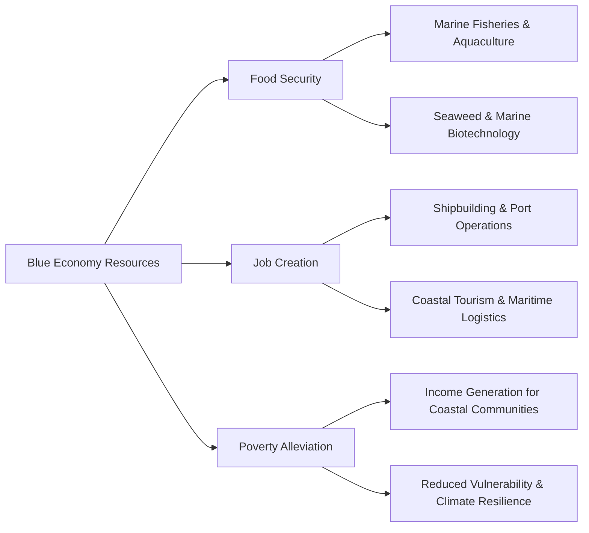

### (a)

#### Blue Economy: Definition and Contribution to Bangladesh's Development

The concept of the **Blue Economy** refers to the sustainable use of ocean and marine resources for economic growth, improved livelihoods, and jobs, while simultaneously preserving the health of the ocean ecosystem. It encompasses a wide range of economic sectors, including marine fisheries, aquaculture, maritime transport, coastal tourism, renewable ocean energy, ship-building, and marine biotechnology.

For Bangladesh, following the historic resolution of maritime boundary disputes with Myanmar (2012) and India (2014), the country acquired sovereign rights over **118,813 square kilometers** of territorial sea and an Exclusive Economic Zone (EEZ) in the Bay of Bengal. This vast maritime area offers massive potential to drive the country’s socio-economic transformation.

##### Contribution to Food Security, Job Creation, and Poverty Alleviation

##### 1. Food Security

- **Marine Fisheries and Aquaculture:** Marine sources contribute a significant portion of Bangladesh's total fish production. Developing deep-sea fishing capabilities allows for the sustainable harvest of unexploited pelagic and demersal fish stocks, directly addressing protein deficiencies.
- **Seaweed and Mariculture:** Cultivating seaweed, mollusks, and marine algae provides an alternative, nutrient-rich food source and input for the pharmaceutical and food processing industries.
- **Salt Production:** Modernizing coastal salt cultivation ensures a self-sufficient supply of iodized salt for the population.

##### 2. Job Creation

- **Traditional and Modern Maritime Sectors:** Expanding maritime trade via Chittagong, Mongla, and Payra ports increases employment in port management, cargo handling, and logistics.
- **Shipbuilding and Ship Recycling:** Bangladesh is an emerging player in global small-to-medium vessel shipbuilding. This labor-intensive industry provides thousands of technical engineering and artisanal jobs.
- **Coastal and Eco-Tourism:** Developing sustainable tourism infrastructure in Cox’s Bazar, Kuakata, and the Sundarbans creates non-traditional service-sector jobs for local youths.

##### 3. Poverty Alleviation

- **Livelihood Diversification for Coastal Communities:** Coastal districts face extreme vulnerability to climate change. The blue economy introduces alternative livelihoods (e.g., pearl culture, marine tourism, cage farming) that decrease reliance on climate-vulnerable agriculture.
- **Inclusion of Marginalized Populations:** Small-scale traditional fishermen can be empowered through micro-finance, modern safety gear, and cold-chain logistics, lifting them above the poverty line by cutting out exploitative middlemen.

### (b)

#### The 8th Five-Year Plan of Bangladesh (FY2021 – FY2025)

The **8th Five-Year Plan (8th FYP)**, titled _"Promoting Prosperity and Fostering Inclusiveness,"_ was designed to address the challenges of the post-COVID-19 recovery era, catalyze the transition toward Least Developed Country (LDC) graduation, and lay the groundwork for achieving the Sustainable Development Goals (SDGs) by 2030 and Vision 2041.

##### Core Objectives and Macroeconomic Targets

- **GDP Growth:** The plan targeted an ambitious acceleration of real GDP growth, aiming to elevate the growth rate to **8.51%** by the final year (FY2025).
- **Poverty Reduction:** It aimed to bring down the national upper poverty rate to **15.6%** and the extreme poverty rate to **7.4%** by 2025.
- **Job Creation:** A target was set to generate **11.33 million** domestic and overseas employment opportunities to absorb the growing labor force and leverage the demographic dividend.

##### Strategic Pillars of the 8th FYP

> [!info] Key Pillars of Strategy
>
> 1. **Rapid Recovery from COVID-19:** Restoring macroeconomic stability, supporting disrupted supply chains, and revitalizing micro, small, and medium enterprises (MSMEs).
> 2. **Incentivizing Labor-Intensive Export-Led Growth:** Diversifying exports beyond Readymade Garments (RMG) into pharmaceuticals, leather, light engineering, and ICT.
> 3. **Sustainable Development and Green Growth:** Integrating environmental conservation into industrial policy, aligning milestones with the _Bangladesh Delta Plan 2100_.
> 4. **Human Capital Development:** Allocating resources to reform education curricula (focusing on technical and vocational skills), and strengthening universal healthcare access.
> 5. **Social Protection:** Expanding the Social Safety Net Programs (SSNPs) through digitized cash transfers to reduce urban-rural inequality.

### (c)

#### Problems of Technology Transfer to LDCs

Technology transfer involves the transmission of physical assets, knowledge, and operational skills from developed nations to Least Developed Countries (LDCs). However, LDCs face severe friction during this process:

- **High Costs and Financial Constraints:** Industrial technology options are protected by strict intellectual property rights (IPRs), patents, and licensing fees. LDCs often lack the foreign foreign currency reserves required to procure advanced machinery.
- **Low Absorptive Capacity:** A major structural bottleneck is the absence of matching human capital. Without skilled engineers, technicians, and managers, LDCs cannot successfully operate, maintain, or repair imported technology.
- **Inappropriate Capital-Intensive Bias:** Technologies developed in advanced economies are designed to be capital-intensive and labor-saving (to suit high-wage environments). When transferred to labor-surplus LDCs, they can exacerbate local unemployment.
- **Technological Dependency:** Developed countries often export the hardware ("hardware-only" transfer) without sharing the underlying design architecture or source code. This leaves the receiving LDC perpetually dependent on foreign multinational corporations for maintenance, inputs, and upgrades.
- **Dumping of Obsolete Technologies:** Developed nations occasionally transfer outdated, energy-inefficient, or highly polluting technologies to LDCs where environmental regulations are weak.

##### Appropriate Package of Technology Transfer in Bangladesh

An **appropriate package** of technology transfer for Bangladesh must avoid unbundled, turnkey imports that create dependency. Instead, it must balance Bangladesh’s factor endowments—specifically its abundant, underutilized labor force and its vulnerability to climate change.

|**Dimension**|**Component Strategy**|
|---|---|
|**Technological Framework**|Shift from purely "Hardware" transfer to an integrated package combining **Hardware** (machinery), **Software** (processes, formulas), **Humanware** (operational capability training), and **Orgware** (institutional management setup).|
|**Factor Intensity**|Prioritize **labor-intensive, capital-saving adaptive technologies** in manufacturing to generate employment for the domestic workforce.|
|**Agricultural Modernization**|Focus on climate-resilient technologies: stress-tolerant seeds, precision agricultural tools, solar-powered irrigation, and localized post-harvest processing mechanisms.|
|**ICT & Digitization**|Promote open-source software frameworks, cloud computing capacity building, and digital public infrastructure to minimize expensive licensing outlays.|
|**Institutional Governance**|Condition foreign direct investment (FDI) agreements on compulsory **joint-venture partnerships** that mandate local knowledge spillovers and joint R\&D projects.|
