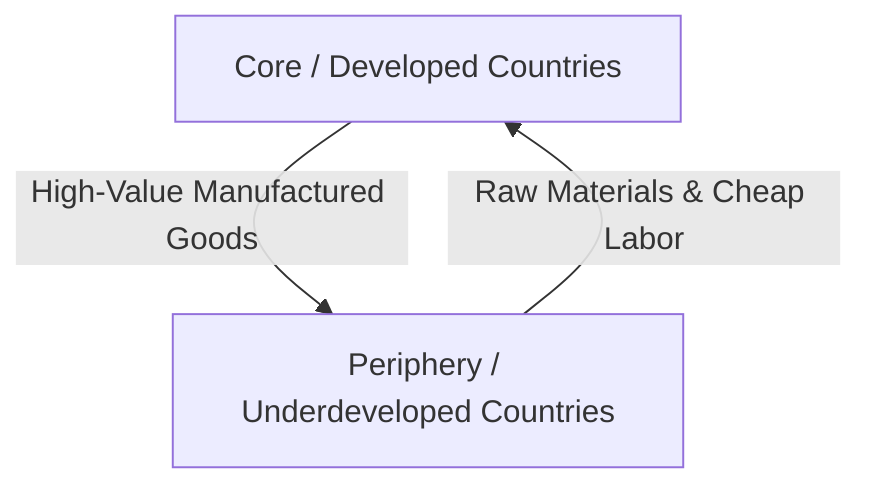

### (a)

#### Core Principles of Dependency Theory and the Core-Periphery Relationship

Dependency theory emerged in the late 1950s and 1960s as a critique of classical modernization theory, arguing that the underdevelopment of certain nations is not a natural stage of economic progress but a direct structural consequence of global capitalism.

##### Core Principles of Dependency Theory

- **The Core-Periphery Structure:** Global economic organization is characterized by an unequal structural division. The world is divided into the developed "Core" (metropolitan center) and the underdeveloped "Periphery" (satellite nations).
- **Unequal Exchange and Exploitation:** International trade is systematically structured to favor the core. The periphery exports low-value raw materials and agricultural commodities, while the core exports high-value manufactured products, leading to a permanent deterioration in the terms of trade for peripheral nations.
- **Extraction of Economic Surplus:** The capital and economic surplus generated within the periphery do not remain local for domestic reinvestment. Instead, they are systematically drained to the core through profit repatriation by multinational corporations (MNCs), external debt servicing, and unequal trade dynamics.
- **Historical Conditioning (Colonialism and Neocolonialism):** Underdevelopment is historically rooted in colonial domination. Although formal colonialism has ended, the contemporary international financial architecture (e.g., global trade rules, foreign aid conditions) maintains this dependence, functioning as neocolonialism.
- **External Determination of Growth:** The economic trajectory of the peripheral countries is conditioned and determined by the expansion, contraction, and technological needs of the core economies, rather than internal domestic priorities.

##### Explanation of the Relationship Between Developed and Underdeveloped Countries

Dependency theory explains that developed (core) and underdeveloped (periphery) countries are not separate entities moving along the same path at different speeds; rather, they are mutually reinforcing components of a single global capitalist system.

The core countries possess advanced industrial capabilities, technological monopolies, and financial dominance. They utilize this power to establish an international division of labor. The peripheral countries are restricted to producing primary commodities and providing cheap, low-skilled labor. Because primary goods have low income elasticity of demand compared to manufactured goods (the Prebisch-Singer hypothesis), the periphery must export more and more raw units just to buy the same amount of manufactured imports from the core. Consequently, the wealth and rapid accumulation of capital in developed nations directly depend on and cause the ongoing stagnation and structural underdevelopment of underdeveloped nations.

### (b)

#### Walt Rostow's Five Stages of Economic Development and the Role of Global Relations

Walt W. Rostow proposed a historical-linear model where all societies progress through five distinct stages of economic growth.

##### The Five Stages of Economic Development

1. **The Traditional Society:** An economy characterized by subsistence agricultural production, low productivity, rigid social structures, and limited access to modern science and technology.
2. **Preconditions for Take-off:** A transitional phase where insights from modern science begin to be translated into industry and agriculture. There is a rise in entrepreneurship, structural investment in transport and infrastructure (Social Overhead Capital), and the emergence of political transitions favoring economic modernization.
3. **The Take-off:** The decisive breakthrough stage where old barriers to growth are finally overcome. The rate of effective investment rises significantly (e.g., from $5\%$ to $10\%$ or more of national income), leading sector industries expand rapidly, and a self-sustaining growth momentum is established.
4. **The Drive to Maturity:** A long interval of sustained progress where the economy extends its capabilities beyond the initial leading industries. Approximately $10\%$ to $20\%$ of national income is steadily invested, technological sophistication spreads across all sectors, and the country becomes effectively integrated into international trade with a diversified industrial output.
5. **The Age of High Mass-Consumption:** The final stage where structural focus shifts from supply to demand, basic consumption needs are met, and the durable consumer goods and services sectors dominate. Resources are increasingly allocated to social welfare and security.

##### Facilitating the Move From Take-off to the Drive to Maturity Through Global Relations and Trade

The transition from the _take-off_ stage to the _drive to maturity_ represents a shift from localized, narrow industrial growth to generalized, technologically advanced nationwide development. Global relations and international trade facilitate this progression through several mechanisms:

- **Technological Diffusion and Knowledge Transfer:** During the drive to maturity, domestic industries must upgrade from basic manufacturing (e.g., textiles) to sophisticated production (e.g., heavy machinery, electronics). Global trade and foreign direct investment (FDI) act as conduits for transferring advanced foreign technologies, managerial expertise, and technical skills into the domestic economy.
- **Market Expansion and Economies of Scale:** The domestic market of a developing country is often insufficient to sustain diverse capital-intensive industries. Open global trade relations provide access to vast international markets, allowing domestic firms to expand output, lower per-unit costs via economies of scale, and remain globally competitive.
- **Import of Capital Goods:** To mature, an economy requires specialized capital equipment and machinery that it cannot yet produce domestically. Favorable global trade relationships allow a country to utilize foreign exchange earnings from its initial take-off exports to import these vital capital inputs.
- **Integration into Global Value Chains (GVCs):** Engaging in international trade forces domestic enterprises to meet global quality standards and specifications. This competitive pressure encourages continuous innovation, forces domestic capital deep into supply chains, and transitions the national workforce into higher-value-added occupational sectors.

### (c)

#### Solow Growth Model: Assumptions, Focus, Steady State, and Comparative Statics

The Solow-Swan growth model is an exogenous growth framework that explains long-run economic growth by looking at capital accumulation, labor or population growth, and increases in productivity (technological progress).

##### Key Assumptions of the Solow Growth Model

- **Constant Returns to Scale (CRS):** The production function exhibits CRS. If all inputs are scaled by a factor $\lambda$, output scales by the exact same factor: $\lambda Y = F(\lambda K, \lambda L)$.
- **Diminishing Marginal Returns:** Capital ($K$) and labor ($L$) exhibit positive but diminishing marginal productivities ($\frac{\partial Y}{\partial K} > 0, \frac{\partial^2 Y}{\partial K^2} < 0$).
- **Constant Substitution of Inputs:** Smooth substitution between capital and labor is assumed, typically represented via a Cobb-Douglas production function: $Y = K^\alpha (AL)^{1-\alpha}$.
- **Constant Exogenous Rates:** Population grows at a constant exogenous rate $n$, capital depreciates at a constant rate $\delta$, and technology grows at a constant rate $g$.
- **Closed Economy with Constant Savings Rate:** The economy has no foreign trade, and a constant fraction $s$ of total output is saved and invested ($I = S = sY$).
- **Full Employment:** All capital and labor resources in the economy are fully utilized at all times.

##### Main Focus and the Long-Run Steady State

The main focus of the Solow model is to isolate how capital accumulation per worker interacts with population growth and depreciation to determine the level of output per worker over time. It demonstrates that capital accumulation alone cannot sustain long-run growth due to diminishing marginal returns. Sustained long-run growth in per capita income can only be driven by exogenous technological progress ($g$).

The fundamental differential equation of the Solow model (expressed in intensive per-worker terms, assuming no technological change for simplicity, where $y = \frac{Y}{L}$, $k = \frac{K}{L}$, and $y = f(k)$) is:

$\dot{k} = sf(k) - (n + \delta)k$

Where:

- $\dot{k}$ is the change in capital per worker over time.
- $sf(k)$ is actual investment per worker.
- $(n + \delta)k$ is break-even investment (the investment needed to keep $k$ constant despite depreciation and population growth).

The **long-run steady state** is defined as the condition where capital per worker becomes constant over time, meaning $\dot{k} = 0$. At this point:

$sf(k^*) = (n + \delta)k^*$

Where $k^*$ is the steady-state level of capital per worker. At this equilibrium, output per worker ($y^* = f(k^*)$) also remains constant, and total output grows at the exact same rate as the population growth rate ($n$).

##### Effects of Changes in Savings Rate and Population Growth in the Long-Run Steady State

###### 1. Increase in the Saving Rate ($s$)

- **Mathematical/Graphical Effect:** An increase in the saving rate from $s_1$ to $s_2$ shifts the actual investment curve $sf(k)$ upward to $s_2f(k)$.
- **Adjustment Process:** At the old steady-state capital level $k_1^*$, actual investment now exceeds break-even investment ($s_2f(k_1^*) > (n+\delta)k_1^*$). This causes capital per worker ($\dot{k} > 0$) to accumulate.
- **Long-Run Steady State Outcome:** The economy reaches a new, higher steady state where $k_2^* > k_1^*$ and $y_2^* > y_1^*$.
- **Growth Rate Impact:** The growth rate of output per worker increases _temporarily_ during the transition phase. However, once the new steady state $k_2^*$ is reached, the long-run growth rate of per capita output returns to zero (or the exogenous rate of technical progress $g$). Thus, a higher saving rate creates a **level effect**, not a permanent long-run growth effect.

###### 2. Increase in the Population Growth Rate ($n$)

- **Mathematical/Graphical Effect:** An increase in the population growth rate from $n_1$ to $n_2$ increases the slope of the break-even investment line from $(n_1 + \delta)k$ to $(n_2 + \delta)k$.
- **Adjustment Process:** At the original steady-state capital level $k_1^*$, actual investment is now less than the required break-even investment ($s f(k_1^*) < (n_2 + \delta)k_1^*$). Capital is diluted across a faster-growing workforce faster than it can be replaced, causing capital per worker to fall ($\dot{k} < 0$).
- **Long-Run Steady State Outcome:** The economy settles into a new steady state characterized by a lower capital-labor ratio ($k_2^* < k_1^*$) and a lower steady-state output per worker ($y_2^* < y_1^*$).
- **Growth Rate Impact:** While total output growth increases in the long run to match the new population growth rate ($n_2$), the long-run standard of living measured by output per worker is permanently reduced.
