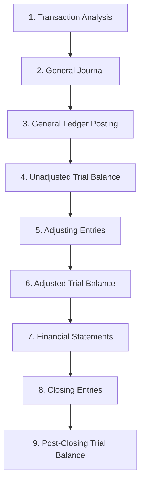

# The Accounting Information System & Cycle Mechanics

> [!abstract] Curriculum & Syllabus Context
>
> - **Course:** ACC 301 Intermediate Accounting
> - **Phase:** Phase 1: Conceptual & Procedural Foundations
> - **Target Reading:** Weygandt, Kieso, and Warfield, *Intermediate Accounting*, 18th Edition — **Chapter 2: The Accounting Information System**
> - **Syllabus Focus:** Debits and credits, transaction identification, journalizing, ledger posting, trial balances, adjusting entries (deferrals and accruals), financial statement preparation, closing process, cash-to-accrual conversions, reversing entries, and the 10-column worksheet.

---

### Section 1: Foundations of the Accounting Information System (AIS)
#### 1.1 Definition and Primary Objective of an AIS
> [!info] Key Definition
>
> An **Accounting Information System (AIS)** is a structured framework that collects, processes, categorizes, and summarizes transaction data to disseminate reliable, decision-useful financial information to internal and external stakeholders. The ultimate output of an AIS is the set of general-purpose financial statements (Income Statement, Statement of Retained Earnings/Stockholders' Equity, Balance Sheet, and Statement of Cash Flows).

#### 1.2 Core Principles of an Effective AIS
To deliver maximum value to decision-makers, every accounting system—whether manual or automated—must satisfy three fundamental principles:
1. **Cost-Effectiveness:** The benefits derived from the information produced by the system must exceed the costs of establishing, maintaining, and auditing it.
2. **Usefulness:** The output must be relevant, faithfully representative, timely, understandable, and comparable to meet user needs.
3. **Flexibility:** The system must adapt to technological changes, growth in transaction volume, evolving organizational structures, and new regulatory standard requirements.
#### 1.3 Computerized vs. Manual Systems & Modern Accounting Automation
- **Manual Accounting Systems:** Every step (journalizing, posting, calculating account balances, preparing trial balances, and drafting statements) is executed by hand. While impractical for large enterprises, studying manual mechanics is essential for understanding the underlying database architecture of computerized systems.
- **Computerized Systems (ERP & Off-the-Shelf):** Transaction data is entered once (often captured automatically at the point of sale or via electronic data interchange), and posting, trial balance generation, and financial statement consolidation occur automatically.
- **Emerging Technologies:**
  - **Robotic Process Automation (RPA / Bots):** Bots monitor incoming vendor invoice emails, extract invoice details into structured data files, perform 3-way matching with purchase orders and receiving reports, and execute accounts payable journal entries automatically.
  - **Blockchain Technology:** A decentralized, immutable, cryptographic digital ledger where transactions are stored in linked blocks. Blockchain provides verifiable, real-time audit trails that prevent retroactive alteration of accounting records.
#### 1.4 Double-Entry Accounting Mechanics and Equation Rules
Under the **double-entry accounting system**, every economic transaction exerts a dual effect on the accounting equation. Total debits recorded must identically equal total credits recorded for every transaction:
> [!quote] Formula & Derivation
>
> $$\text{Total Debits} = \text{Total Credits}$$

- **Terminology:**
  - **Debit ($\text{Dr.}$):** Refers strictly to the *left side* of a T-account.
  - **Credit ($\text{Cr.}$):** Refers strictly to the *right side* of a T-account.
  - Debits and credits do *not* mean increase or decrease in isolation; their direction depends on the specific account classification.
##### Expanded Accounting Equation and Normal Account Balances
> [!quote] Formula & Derivation
>
> $$\text{Assets} = \text{Liabilities} + \text{Common Stock} + \text{Retained Earnings} + \text{Revenues} - \text{Expenses} - \text{Dividends}$$

| Account Category | Classification | Normal Balance | Increase Direction | Decrease Direction |
| :--- | :--- | :--- | :--- | :--- |
| **Assets** | Real (Permanent) | Debit ($\text{Dr.}$) | Debit ($\text{Dr.}$) | Credit ($\text{Cr.}$) |
| **Liabilities** | Real (Permanent) | Credit ($\text{Cr.}$) | Credit ($\text{Cr.}$) | Debit ($\text{Dr.}$) |
| **Common Stock** | Real (Permanent) | Credit ($\text{Cr.}$) | Credit ($\text{Cr.}$) | Debit ($\text{Dr.}$) |
| **Retained Earnings** | Real (Permanent) | Credit ($\text{Cr.}$) | Credit ($\text{Cr.}$) | Debit ($\text{Dr.}$) |
| **Revenues** | Nominal (Temporary) | Credit ($\text{Cr.}$) | Credit ($\text{Cr.}$) | Debit ($\text{Dr.}$) |
| **Expenses** | Nominal (Temporary) | Debit ($\text{Dr.}$) | Debit ($\text{Dr.}$) | Credit ($\text{Cr.}$) |
| **Dividends / Drawings** | Nominal (Temporary) | Debit ($\text{Dr.}$) | Debit ($\text{Dr.}$) | Credit ($\text{Cr.}$) |

#### 1.5 Corporate vs. Non-Corporate Equity Structure Impact
The legal structure of a business dictates the specific equity accounts maintained in its ledger:
- **Corporations:** Maintain **Common Stock**, **Paid-in Capital in Excess of Par**, **Retained Earnings**, and **Dividends**. Capital contributed by owners is strictly segregated from earned capital retained in the business.
- **Proprietorships & Partnerships:** Maintain an **Owner's Capital** account (recording investments and accumulated profits) and an **Owner's Drawings** account (tracking personal withdrawals).

---
### Section 2: Transaction Analysis & The Recording Process
#### 2.1 The Accounting Cycle (9 Sequential Steps)
The accounting cycle represents a standardized sequence of accounting procedures executed during each fiscal period:

1. **Analyze** business transactions from source documents.
2. **Journalize** transactions in the book of original entry (General Journal).
3. **Post** journal entries to the general ledger accounts.
4. **Prepare an unadjusted trial balance**.
5. **Journalize and post adjusting entries** (deferrals and accruals).
6. **Prepare an adjusted trial balance**.
7. **Prepare financial statements** (Income Statement, Retained Earnings, Balance Sheet, Cash Flows).
8. **Journalize and post closing entries** (zero out nominal accounts).
9. **Prepare a post-closing trial balance** (optional, verifies permanent balances).
#### 2.2 Transaction Identification and Analysis
- **External Transactions:** Economic events involving an exchange between the enterprise and an outside entity (e.g., purchasing equipment from a vendor, paying rent to a landlord, issuing stock to investors).
- **Internal Transactions:** Economic events occurring entirely within the entity that alter its financial position (e.g., consuming supplies in operations, recognizing equipment depreciation).
- **Non-Transactions:** Business activities that do not alter assets, liabilities, or equity at the time of occurrence (e.g., interviewing a job candidate, placing a purchase order, negotiating a contract prior to performance).
#### 2.3 The Recording Process Mechanics
1. **The General Journal:** Known as the *book of original entry*. It records transactions in chronological order. Each entry discloses:
   - Date of transaction.
   - Account debited (entered at the extreme left margin) and amount in Debit column.
   - Account credited (indented to the right) and amount in Credit column.
   - Brief explanation.
2. **The General Ledger:** The entire collection of asset, liability, stockholders' equity, revenue, and expense accounts maintained by a firm. Accounts are structured in T-account or 3-column running-balance formats.
3. **Posting:** The systematic transfer of debit and credit amounts from the General Journal to the corresponding individual ledger accounts. Posting references ($\text{Ref.}$) link journal page numbers (e.g., $\text{J1}$) with ledger account numbers.
4. **Chart of Accounts:** A master list of all account titles and assigned numerical identifiers:
   - $101–199$: Asset accounts
   - $200–299$: Liability accounts
   - $300–399$: Stockholders' equity accounts
   - $400–499$: Revenue accounts
   - $500–799$: Operating expense accounts
   - $800–899$: Other revenues & gains
   - $900–999$: Other expenses & losses
#### 2.4 The Unadjusted Trial Balance
An **unadjusted trial balance** is a schedule listing all open ledger accounts and their debit or credit balances at a specific date.
- **Primary Purpose:** Proves the mathematical equality of total debits and total credits after posting.
- **Limitations (Errors Not Disclosed by a Balancing Trial Balance):**
  1. Complete omission of a transaction from the journal.
  2. Failure to post a valid journal entry.
  3. Posting a journal entry twice.
  4. Posting a correct debit or credit to the wrong account (e.g., debiting Maintenance Expense instead of Equipment).
  5. Offsetting errors made in recording transaction amounts.

---
### Section 3: The Adjusting Entry Process
#### 3.1 Theoretical Rationale for Adjusting Entries
In accordance with the **Revenue Recognition Principle** (recognize revenue in the accounting period in which the performance obligation is satisfied) and the **Expense Recognition Principle** (let expenses follow revenues / matching), adjusting entries are required at the end of each accounting period. They ensure that:
- Revenues and expenses are reported in the proper period on the Income Statement.
- Assets, liabilities, and equity are stated at appropriate balances on the Balance Sheet.
#### 3.2 Categorization Matrix of Adjusting Entries
> [!info] Classification of Adjustments
>
> $$ \text{Adjusting Entries} = \begin{cases} \text{Deferrals (Cash exchanged BEFORE recognition)} \begin{cases} \text{Prepaid Expenses (Asset } \downarrow \text{, Expense } \uparrow \text{)} \\ \text{Unearned Revenues (Liability } \downarrow \text{, Revenue } \uparrow \text{)} \end{cases} \\ \text{Accruals (Cash exchanged AFTER recognition)} \begin{cases} \text{Accrued Revenues (Asset } \uparrow \text{, Revenue } \uparrow \text{)} \\ \text{Accrued Expenses (Expense } \uparrow \text{, Liability } \uparrow \text{)} \end{cases} \end{cases} $$

---
#### 3.3 Deferrals: Detailed Technical Analysis
##### 1. Prepaid Expenses (Prepayments)
Expenses paid in cash and recorded as assets before they are consumed or expired.
- **Unadjusted Condition:** Assets are **overstated**; Expenses are **understated**.
- **Adjusting Entry Rule:** Debit an Expense account; Credit an Asset account.

*Case A: Supplies Accounting*
> [!quote] Formula & Derivation
>
> $$ \text{Supplies Used (Expense)} = \text{Beginning Supplies Balance} + \text{Supplies Purchased} - \text{Physical Ending Inventory} $$

$$ \begin{array}{llrr}
\text{Date} & \text{Account Titles and Explanation} & \text{Debit (\$)} & \text{Credit (\$)} \\
\hline
\text{End of Period} & \text{Supplies Expense} & \text{XXX} & \\
& \quad \text{Supplies} & & \text{XXX} \\
\end{array} $$

*Case B: Prepaid Insurance*
> [!quote] Formula & Derivation
>
> $$ \text{Insurance Expense Per Period} = \frac{\text{Total Premium Paid}}{\text{Total Policy Term (Months)}} \times \text{Months Expired} $$

$$ \begin{array}{llrr}
\text{Date} & \text{Account Titles and Explanation} & \text{Debit (\$)} & \text{Credit (\$)} \\
\hline
\text{End of Period} & \text{Insurance Expense} & \text{XXX} & \\
& \quad \text{Prepaid Insurance} & & \text{XXX} \\
\end{array} $$

*Case C: Depreciation of Long-Lived Assets*
Depreciation is a process of cost allocation, *not* asset valuation.
> [!quote] Formula & Derivation
>
> $$ \text{Annual Depreciation Expense (Straight-Line)} = \frac{\text{Historical Cost} - \text{Estimated Salvage Value}}{\text{Estimated Useful Life (Years)}} $$
> $$ \text{Monthly Depreciation Expense} = \frac{\text{Annual Depreciation Expense}}{12} $$

$$ \begin{array}{llrr}
\text{Date} & \text{Account Titles and Explanation} & \text{Debit (\$)} & \text{Credit (\$)} \\
\hline
\text{End of Period} & \text{Depreciation Expense} & \text{XXX} & \\
& \quad \text{Accumulated Depreciation—[Asset]} & & \text{XXX} \\
\end{array} $$
- **Contra-Asset Account:** Accumulated Depreciation is offset against the related asset account on the Balance Sheet.
> [!quote] Formula & Derivation
>
> $$ \text{Book Value (Carrying Value)} = \text{Historical Cost} - \text{Accumulated Depreciation} $$

##### 2. Unearned Revenues
Cash received from customers before the entity satisfies its performance obligation.
- **Unadjusted Condition:** Liabilities are **overstated**; Revenues are **understated**.
- **Adjusting Entry Rule:** Debit a Liability account (Unearned Revenue); Credit a Revenue account.

$$ \begin{array}{llrr}
\text{Date} & \text{Account Titles and Explanation} & \text{Debit (\$)} & \text{Credit (\$)} \\
\hline
\text{End of Period} & \text{Unearned Service Revenue} & \text{XXX} & \\
& \quad \text{Service Revenue} & & \text{XXX} \\
\end{array} $$

---
#### 3.4 Accruals: Detailed Technical Analysis
##### 1. Accrued Revenues
Revenues earned for services performed or goods delivered but not yet billed or collected in cash at the statement date.
- **Unadjusted Condition:** Assets are **understated**; Revenues are **understated**.
- **Adjusting Entry Rule:** Debit an Asset account (Accounts/Interest Receivable); Credit a Revenue account.

$$ \begin{array}{llrr}
\text{Date} & \text{Account Titles and Explanation} & \text{Debit (\$)} & \text{Credit (\$)} \\
\hline
\text{End of Period} & \text{Accounts Receivable} & \text{XXX} & \\
& \quad \text{Service Revenue} & & \text{XXX} \\
\end{array} $$
##### 2. Accrued Expenses
Expenses incurred but not yet paid in cash or recorded at the statement date.
- **Unadjusted Condition:** Expenses are **understated**; Liabilities are **understated**.
- **Adjusting Entry Rule:** Debit an Expense account; Credit a Liability account.

*Case A: Accrued Interest Expense*
> [!quote] Formula & Derivation
>
> $$ \text{Accrued Interest Amount} = \text{Principal (Face Value)} \times \text{Annual Interest Rate } (i) \times \text{Fraction of Year } \left(\frac{n}{12}\right) $$

$$ \begin{array}{llrr}
\text{Date} & \text{Account Titles and Explanation} & \text{Debit (\$)} & \text{Credit (\$)} \\
\hline
\text{End of Period} & \text{Interest Expense} & \text{XXX} & \\
& \quad \text{Interest Payable} & & \text{XXX} \\
\end{array} $$

*Case B: Accrued Salaries and Wages*
Calculated based on employee daily wage rates for unpaid days worked between the last payroll date and the period-end balance sheet date:

$$ \begin{array}{llrr}
\text{Date} & \text{Account Titles and Explanation} & \text{Debit (\$)} & \text{Credit (\$)} \\
\hline
\text{End of Period} & \text{Salaries and Wages Expense} & \text{XXX} & \\
& \quad \text{Salaries and Wages Payable} & & \text{XXX} \\
\end{array} $$

*Case C: Bad Debt Expense (Allowance Method)*
Estimation of uncollectible accounts receivable based on credit loss assessments:

$$ \begin{array}{llrr}
\text{Date} & \text{Account Titles and Explanation} & \text{Debit (\$)} & \text{Credit (\$)} \\
\hline
\text{End of Period} & \text{Bad Debt Expense} & \text{XXX} & \\
& \quad \text{Allowance for Doubtful Accounts} & & \text{XXX} \\
\end{array} $$
#### 3.5 Summary Table of Adjusting Entry Effects

| Adjustment Type | Account Debited | Account Credited | Effect if Entry Omitted |
| :--- | :--- | :--- | :--- |
| **Prepaid Expense** | Expense | Asset | Assets Overstated; Expenses Understated; Net Income Overstated |
| **Unearned Revenue** | Liability | Revenue | Liabilities Overstated; Revenues Understated; Net Income Understated |
| **Accrued Revenue** | Asset | Revenue | Assets Understated; Revenues Understated; Net Income Understated |
| **Accrued Expense** | Expense | Liability | Expenses Understated; Liabilities Understated; Net Income Overstated |

#### 3.6 The Adjusted Trial Balance
After posting all adjusting entries, the **adjusted trial balance** is prepared. It proves the equality of total debit and total credit balances across all ledger accounts including adjustments. The adjusted trial balance is the **primary direct source** used to construct financial statements.

---
### Section 4: Financial Statement Preparation & The Closing Process
#### 4.1 Order of Financial Statement Preparation
Financial statements must be prepared in strict sequential order due to data articulation across statements:
1. **Income Statement:** Reports revenues and expenses to compute **Net Income** (or Net Loss).
2. **Statement of Retained Earnings:** Takes beginning Retained Earnings, adds Net Income, subtracts Dividends, to compute **Ending Retained Earnings**.
3. **Balance Sheet:** Reports real accounts (Assets, Liabilities, Common Stock, and the newly calculated Ending Retained Earnings balance).
4. **Statement of Cash Flows:** Reports net cash flows from operating, investing, and financing activities.
#### 4.2 Nominal vs. Real Account Classifications
- **Real (Permanent) Accounts:** Asset, liability, and equity accounts (e.g., Cash, Accounts Receivable, Equipment, Accounts Payable, Common Stock, Retained Earnings). Their balances are carried forward from one fiscal period to the next. They are **never closed**.
- **Nominal (Temporary) Accounts:** Revenue, expense, and dividend accounts (e.g., Service Revenue, Rent Expense, Dividends). They measure economic performance during a specific time period. They must be **reduced to zero** at period-end.
#### 4.3 The Closing Process Mechanics
The closing process zeroes out all nominal accounts and transfers the period's net earnings/loss and dividend distributions into the permanent **Retained Earnings** account. A clearing account titled **Income Summary** is utilized temporarily.
##### The 4 Standard Closing Entries:
1. **Close Revenue Accounts to Income Summary:**
   $$ \begin{array}{llrr}
   \text{Date} & \text{Account Titles and Explanation} & \text{Debit (\$)} & \text{Credit (\$)} \\
   \hline
   \text{Dec 31} & \text{Service Revenue} & \text{XXX} & \\
   & \quad \text{Income Summary} & & \text{XXX} \\
   \end{array} $$
2. **Close Expense Accounts to Income Summary:**
   $$ \begin{array}{llrr}
   \text{Date} & \text{Account Titles and Explanation} & \text{Debit (\$)} & \text{Credit (\$)} \\
   \hline
   \text{Dec 31} & \text{Income Summary} & \text{XXX} & \\
   & \quad \text{Salaries and Wages Expense} & & \text{XXX} \\
   & \quad \text{Supplies Expense} & & \text{XXX} \\
   & \quad \text{Depreciation Expense} & & \text{XXX} \\
   & \quad \text{Rent Expense} & & \text{XXX} \\
   \end{array} $$
3. **Close Income Summary to Retained Earnings:**
   - *If Net Income (Credit balance in Income Summary):*
     $$ \begin{array}{llrr}
     \text{Date} & \text{Account Titles and Explanation} & \text{Debit (\$)} & \text{Credit (\$)} \\
     \hline
     \text{Dec 31} & \text{Income Summary} & \text{XXX} & \\
     & \quad \text{Retained Earnings} & & \text{XXX} \\
     \end{array} $$
   - *If Net Loss (Debit balance in Income Summary):*
     $$ \begin{array}{llrr}
     \text{Date} & \text{Account Titles and Explanation} & \text{Debit (\$)} & \text{Credit (\$)} \\
     \hline
     \text{Dec 31} & \text{Retained Earnings} & \text{XXX} & \\
     & \quad \text{Income Summary} & & \text{XXX} \\
     \end{array} $$
4. **Close Dividends to Retained Earnings (Directly, NOT through Income Summary):**
   *(Dividends are distributions of capital, not expenses of operations).*
   $$ \begin{array}{llrr}
   \text{Date} & \text{Account Titles and Explanation} & \text{Debit (\$)} & \text{Credit (\$)} \\
   \hline
   \text{Dec 31} & \text{Retained Earnings} & \text{XXX} & \\
   & \quad \text{Dividends} & & \text{XXX} \\
   \end{array} $$
#### 4.4 Post-Closing Trial Balance
A trial balance prepared immediately after posting all closing entries. It contains **only real (permanent) balance sheet accounts**. Its purpose is to verify that total debits equal total credits for permanent accounts carried forward into the next accounting period.
#### 4.5 Financial Statements for Merchandising Enterprises
Merchandising entities purchase inventory ready for resale. Their Income Statement features a **Gross Profit** section:
> [!quote] Formula & Derivation
>
> $$ \text{Net Sales} = \text{Gross Sales} - \text{Sales Discounts} - \text{Sales Returns and Allowances} $$
> $$ \text{Gross Profit} = \text{Net Sales} - \text{Cost of Goods Sold} $$
> $$ \text{Income from Operations} = \text{Gross Profit} - \text{Selling Expenses} - \text{Administrative Expenses} $$

---
### Section 5: Appendix Topics (Cash-to-Accrual, Reversing Entries, Worksheet)
#### 5.1 Appendix 2A: Cash-Basis vs. Accrual-Basis Accounting
- **Strict Cash Basis:** Revenue is recognized only when cash is received; expenses are recognized only when cash is paid. Ignores the revenue recognition and expense recognition principles. Violates GAAP.
- **Modified Cash Basis:** A hybrid approach where cash basis is followed for revenues and expenses, but long-term assets are capitalized and depreciated, and inventory is recorded (common in small professional service firms).
##### Conversion Formulas from Cash Basis to Accrual Basis
1. **Calculating Accrual Service Revenue from Cash Collections:**
> [!quote] Formula & Derivation
>
> $$ \text{Service Revenue}_{\text{Accrual}} = \text{Cash Collected} - \text{A/R}_{\text{Beg}} + \text{A/R}_{\text{End}} + \text{Unearned Revenue}_{\text{Beg}} - \text{Unearned Revenue}_{\text{End}} $$

2. **Calculating Accrual Operating Expenses from Cash Disbursements:**
> [!quote] Formula & Derivation
>
> $$ \text{Operating Expenses}_{\text{Accrual}} = \text{Cash Paid} + \text{Prepaid Expenses}_{\text{Beg}} - \text{Prepaid Expenses}_{\text{End}} - \text{Accrued Liabilities}_{\text{Beg}} + \text{Accrued Liabilities}_{\text{End}} + \text{Depreciation/Amortization} $$

#### 5.2 Appendix 2B: Reversing Entries
A **reversing entry** is an optional bookkeeping procedure made on the first day of a new accounting period that is the exact opposite of an adjusting entry made at the end of the previous period.
- **Purpose:** Simplifies subsequent routine cash recording on subsequent paydays or collection dates.
- **Guidelines for Reversing Entries:**
  1. **All Accruals** MUST be reversed (Accrued Revenues and Accrued Expenses).
  2. **Deferrals** recorded initially in nominal (income statement) accounts SHOULD be reversed.
  3. **Deferrals** recorded initially in real (balance sheet) accounts are **NOT** reversed.
  4. **Depreciation and Bad Debt adjustments** are **NEVER** reversed.
#### 5.3 Appendix 2C: The 10-Column Accounting Worksheet
An informal tool used by accountants to aggregate adjusting data, compute adjusted trial balances, and sort account balances into financial statement columns prior to formal drafting:
- **Columns (5 Pairs of Debit/Credit Columns):**
  1. Unadjusted Trial Balance ($\text{Dr.} / \text{Cr.}$)
  2. Adjustments ($\text{Dr.} / \text{Cr.}$)
  3. Adjusted Trial Balance ($\text{Dr.} / \text{Cr.}$)
  4. Income Statement ($\text{Dr.} / \text{Cr.}$)
  5. Balance Sheet ($\text{Dr.} / \text{Cr.}$)

---
### Section 6: Comprehensive Numerical Problem Walkthroughs

---

> [!example] Comprehensive Walkthrough 1: Complete Accounting Cycle Case (Kleene Window Washing Inc.)
>
> ##### Problem Fact Pattern
> Kleene Window Washing Inc. was incorporated on July 1, 2025. During July 2025, the following transaction events occurred:
> - **July 1:** Stockholders invested $\$12,000$ cash in exchange for 12,000 shares of $\$1$ par common stock.
> - **July 1:** Purchased truck/equipment for $\$8,000$, paying $\$2,000$ cash and signing a $\$6,000$ accounts payable/note.
> - **July 3:** Purchased cleaning supplies on account for $\$900$.
> - **July 5:** Paid $\$1,800$ cash for a 1-year insurance policy effective July 1.
> - **July 12:** Billed customers $\$3,700$ for window washing services performed.
> - **July 18:** Paid $\$1,500$ cash on account to creditors.
> - **July 20:** Paid $\$2,000$ cash for employee salaries.
> - **July 21:** Collected $\$1,600$ cash from customers billed on July 12.
> - **July 25:** Billed customers $\$2,500$ for services performed.
> - **July 31:** Paid $\$290$ cash for truck maintenance and repairs.
> - **July 31:** Declared and paid a $\$600$ cash dividend.
> ##### Adjustment Data at July 31, 2025:
> 1. Unbilled and uncollected service revenue at July 31: $\$1,700$.
> 2. Monthly depreciation on equipment: $\$180$.
> 3. Insurance expired during July: $\$1,800 \times \frac{1}{12} = \$150$.
> 4. Physical count shows $\$320$ of cleaning supplies on hand at July 31.
> 5. Accrued employee salaries unpaid at July 31: $\$400$.
> ---
> ##### Step 1: General Journal Entries for July Transactions
> $$ \begin{array}{llrr}
> \text{Date} & \text{Account Titles and Explanation} & \text{Debit (\$)} & \text{Credit (\$)} \\
> \hline
> \text{July 1} & \text{Cash} & 12,000 & \\
> & \quad \text{Common Stock} & & 12,000 \\
> & \text{\small(Issued 12,000 shares of stock for cash)} & & \\
> \hline
> \text{July 1} & \text{Equipment} & 8,000 & \\
> & \quad \text{Cash} & & 2,000 \\
> & \quad \text{Accounts Payable} & & 6,000 \\
> & \text{\small(Purchased equipment with cash and account payable)} & & \\
> \hline
> \text{July 3} & \text{Supplies} & 900 & \\
> & \quad \text{Accounts Payable} & & 900 \\
> & \text{\small(Purchased supplies on account)} & & \\
> \hline
> \text{July 5} & \text{Prepaid Insurance} & 1,800 & \\
> & \quad \text{Cash} & & 1,800 \\
> & \text{\small(Paid 1-year policy in advance)} & & \\
> \hline
> \text{July 12} & \text{Accounts Receivable} & 3,700 & \\
> & \quad \text{Service Revenue} & & 3,700 \\
> & \text{\small(Billed customers for services performed)} & & \\
> \hline
> \text{July 18} & \text{Accounts Payable} & 1,500 & \\
> & \quad \text{Cash} & & 1,500 \\
> & \text{\small(Paid cash on account to creditors)} & & \\
> \hline
> \text{July 20} & \text{Salaries and Wages Expense} & 2,000 & \\
> & \quad \text{Cash} & & 2,000 \\
> & \text{\small(Paid employee salaries)} & & \\
> \hline
> \text{July 21} & \text{Cash} & 1,600 & \\
> & \quad \text{Accounts Receivable} & & 1,600 \\
> & \text{\small(Collected cash from credit customers)} & & \\
> \hline
> \text{July 25} & \text{Accounts Receivable} & 2,500 & \\
> & \quad \text{Service Revenue} & & 2,500 \\
> & \text{\small(Billed customers for services performed)} & & \\
> \hline
> \text{July 31} & \text{Maintenance and Repairs Expense} & 290 & \\
> & \quad \text{Cash} & & 290 \\
> & \text{\small(Paid truck repair expenses)} & & \\
> \hline
> \text{July 31} & \text{Dividends} & 600 & \\
> & \quad \text{Cash} & & 600 \\
> & \text{\small(Declared and paid cash dividend)} & & \\
> \end{array} $$
> ---
> ##### Step 2: Unadjusted Trial Balance at July 31, 2025
> - **Cash Calculation:** $12,000 - 2,000 - 1,800 - 1,500 - 2,000 + 1,600 - 290 - 600 = \$5,410$
> - **Accounts Receivable Calculation:** $3,700 + 2,500 - 1,600 = \$4,600$
> - **Accounts Payable Calculation:** $6,000 + 900 - 1,500 = \$5,400$
> $$ \begin{array}{lrr}
> \multicolumn{3}{c}{\textbf{Kleene Window Washing Inc.}} \\
> \multicolumn{3}{c}{\textbf{Unadjusted Trial Balance}} \\
> \multicolumn{3}{c}{\textbf{July 31, 2025}} \\
> \hline
> \text{Account Title} & \text{Debit (\$)} & \text{Credit (\$)} \\
> \hline
> \text{Cash} & 5,410 & \\
> \text{Accounts Receivable} & 4,600 & \\
> \text{Supplies} & 900 & \\
> \text{Prepaid Insurance} & 1,800 & \\
> \text{Equipment} & 8,000 & \\
> \text{Accounts Payable} & & 5,400 \\
> \text{Common Stock} & & 12,000 \\
> \text{Dividends} & 600 & \\
> \text{Service Revenue } (\$3,700 + \$2,500) & & 6,200 \\
> \text{Maintenance and Repairs Expense} & 290 & \\
> \text{Salaries and Wages Expense} & 2,000 & \\
> \hline
> \textbf{Totals} & \mathbf{23,600} & \mathbf{23,600} \\
> \hline \hline
> \end{array} $$
> ---
> ##### Step 3: Adjusting Journal Entries at July 31, 2025
> $$ \begin{array}{llrr}
> \text{Date} & \text{Account Titles and Explanation} & \text{Debit (\$)} & \text{Credit (\$)} \\
> \hline
> \text{July 31} & \text{Accounts Receivable} & 1,700 & \\
> & \quad \text{Service Revenue} & & 1,700 \\
> & \text{\small(1. Accrued unbilled service revenue)} & & \\
> \hline
> \text{July 31} & \text{Depreciation Expense} & 180 & \\
> & \quad \text{Accumulated Depreciation—Equipment} & & 180 \\
> & \text{\small(2. Monthly equipment depreciation)} & & \\
> \hline
> \text{July 31} & \text{Insurance Expense} & 150 & \\
> & \quad \text{Prepaid Insurance} & & 150 \\
> & \text{\small(3. July expired insurance: \$1,800 / 12)} & & \\
> \hline
> \text{July 31} & \text{Supplies Expense } (\$900 - \$320) & 580 & \\
> & \quad \text{Supplies} & & 580 \\
> & \text{\small(4. Supplies consumed during July)} & & \\
> \hline
> \text{July 31} & \text{Salaries and Wages Expense} & 400 & \\
> & \quad \text{Salaries and Wages Payable} & & 400 \\
> & \text{\small(5. Accrued unpaid salaries at month-end)} & & \\
> \end{array} $$
> ---
> ##### Step 4: Adjusted Trial Balance at July 31, 2025
> $$ \begin{array}{lrr}
> \multicolumn{3}{c}{\textbf{Kleene Window Washing Inc.}} \\
> \multicolumn{3}{c}{\textbf{Adjusted Trial Balance}} \\
> \multicolumn{3}{c}{\textbf{July 31, 2025}} \\
> \hline
> \text{Account Title} & \text{Debit (\$)} & \text{Credit (\$)} \\
> \hline
> \text{Cash} & 5,410 & \\
> \text{Accounts Receivable } (\$4,600 + \$1,700) & 6,300 & \\
> \text{Supplies } (\$900 - \$580) & 320 & \\
> \text{Prepaid Insurance } (\$1,800 - \$150) & 1,650 & \\
> \text{Equipment} & 8,000 & \\
> \text{Accumulated Depreciation—Equipment} & & 180 \\
> \text{Accounts Payable} & & 5,400 \\
> \text{Salaries and Wages Payable} & & 400 \\
> \text{Common Stock} & & 12,000 \\
> \text{Dividends} & 600 & \\
> \text{Service Revenue } (\$6,200 + \$1,700) & & 7,900 \\
> \text{Salaries and Wages Expense } (\$2,000 + \$400) & 2,400 & \\
> \text{Supplies Expense} & 580 & \\
> \text{Maintenance and Repairs Expense} & 290 & \\
> \text{Depreciation Expense} & 180 & \\
> \text{Insurance Expense} & 150 & \\
> \hline
> \textbf{Totals} & \mathbf{25,880} & \mathbf{25,880} \\
> \hline \hline
> \end{array} $$
> ---
> ##### Step 5: Financial Statement Construction
> $$ \begin{array}{lrr}
> \multicolumn{3}{c}{\textbf{Kleene Window Washing Inc.}} \\
> \multicolumn{3}{c}{\textbf{Income Statement}} \\
> \multicolumn{3}{c}{\textbf{For the Month Ended July 31, 2025}} \\
> \hline
> \textbf{Revenues:} & & \\
> \quad \text{Service Revenue} & & \$7,900 \\
> \textbf{Expenses:} & & \\
> \quad \text{Salaries and Wages Expense} & \$2,400 & \\
> \quad \text{Supplies Expense} & 580 & \\
> \quad \text{Maintenance and Repairs Expense} & 290 & \\
> \quad \text{Depreciation Expense} & 180 & \\
> \quad \text{Insurance Expense} & 150 & \\
> \quad \text{Total Expenses} & & 3,600 \\
> \hline
> \textbf{Net Income} & & \mathbf{\$4,300} \\
> \hline \hline
> \end{array} $$
> $$ \begin{array}{lrr}
> \multicolumn{3}{c}{\textbf{Kleene Window Washing Inc.}} \\
> \multicolumn{3}{c}{\textbf{Retained Earnings Statement}} \\
> \multicolumn{3}{c}{\textbf{For the Month Ended July 31, 2025}} \\
> \hline
> \text{Retained Earnings, July 1, 2025} & & \$0 \\
> \text{Add: Net Income} & & 4,300 \\
> \hline
> \text{Subtotal} & & 4,300 \\
> \text{Less: Dividends} & & (600) \\
> \hline
> \textbf{Retained Earnings, July 31, 2025} & & \mathbf{\$3,700} \\
> \hline \hline
> \end{array} $$
> $$ \begin{array}{lrr}
> \multicolumn{3}{c}{\textbf{Kleene Window Washing Inc.}} \\
> \multicolumn{3}{c}{\textbf{Classified Balance Sheet}} \\
> \multicolumn{3}{c}{\textbf{As of July 31, 2025}} \\
> \hline
> \textbf{Assets} & & \\
> \text{Current Assets:} & & \\
> \quad \text{Cash} & \$5,410 & \\
> \quad \text{Accounts Receivable} & 6,300 & \\
> \quad \text{Supplies} & 320 & \\
> \quad \text{Prepaid Insurance} & 1,650 & \\
> \quad \text{Total Current Assets} & & \$13,680 \\
> \text{Property, Plant, and Equipment:} & & \\
> \quad \text{Equipment} & \$8,000 & \\
> \quad \text{Less: Accumulated Depreciation—Equipment} & (180) & 7,820 \\
> \hline
> \textbf{Total Assets} & & \mathbf{\$21,500} \\
> \hline \hline
> \textbf{Liabilities and Stockholders' Equity} & & \\
> \text{Current Liabilities:} & & \\
> \quad \text{Accounts Payable} & \$5,400 & \\
> \quad \text{Salaries and Wages Payable} & 400 & \\
> \quad \text{Total Current Liabilities} & & \$5,800 \\
> \text{Stockholders' Equity:} & & \\
> \quad \text{Common Stock} & \$12,000 & \\
> \quad \text{Retained Earnings} & 3,700 & 15,700 \\
> \hline
> \textbf{Total Liabilities and Stockholders' Equity} & & \mathbf{\$21,500} \\
> \hline \hline
> \end{array} $$
> ---
> ##### Step 6: Closing Journal Entries at July 31, 2025
> $$ \begin{array}{llrr}
> \text{Date} & \text{Account Titles and Explanation} & \text{Debit (\$)} & \text{Credit (\$)} \\
> \hline
> \text{July 31} & \text{Service Revenue} & 7,900 & \\
> & \quad \text{Income Summary} & & 7,900 \\
> & \text{\small(1. Close revenue accounts to Income Summary)} & & \\
> \hline
> \text{July 31} & \text{Income Summary} & 3,600 & \\
> & \quad \text{Salaries and Wages Expense} & & 2,400 \\
> & \quad \text{Supplies Expense} & & 580 \\
> & \quad \text{Maintenance and Repairs Expense} & & 290 \\
> & \quad \text{Depreciation Expense} & & 180 \\
> & \quad \text{Insurance Expense} & & 150 \\
> & \text{\small(2. Close expense accounts to Income Summary)} & & \\
> \hline
> \text{July 31} & \text{Income Summary } (\$7,900 - \$3,600) & 4,300 & \\
> & \quad \text{Retained Earnings} & & 4,300 \\
> & \text{\small(3. Close Net Income to Retained Earnings)} & & \\
> \hline
> \text{July 31} & \text{Retained Earnings} & 600 & \\
> & \quad \text{Dividends} & & 600 \\
> & \text{\small(4. Close Dividends directly to Retained Earnings)} & & \\
> \end{array} $$
> ---
> ##### Step 7: Post-Closing Trial Balance at July 31, 2025
> $$ \begin{array}{lrr}
> \multicolumn{3}{c}{\textbf{Kleene Window Washing Inc.}} \\
> \multicolumn{3}{c}{\textbf{Post-Closing Trial Balance}} \\
> \multicolumn{3}{c}{\textbf{July 31, 2025}} \\
> \hline
> \text{Account Title} & \text{Debit (\$)} & \text{Credit (\$)} \\
> \hline
> \text{Cash} & 5,410 & \\
> \text{Accounts Receivable} & 6,300 & \\
> \text{Supplies} & 320 & \\
> \text{Prepaid Insurance} & 1,650 & \\
> \text{Equipment} & 8,000 & \\
> \text{Accumulated Depreciation—Equipment} & & 180 \\
> \text{Accounts Payable} & & 5,400 \\
> \text{Salaries and Wages Payable} & & 400 \\
> \text{Common Stock} & & 12,000 \\
> \text{Retained Earnings} & & 3,700 \\
> \hline
> \textbf{Totals} & \mathbf{21,680} & \mathbf{21,680} \\
> \hline \hline
> \end{array} $$

---

> [!example] Comprehensive Walkthrough 2: Cash-to-Accrual Conversion Problem (Dr. Diane Windsor Dental Practice)
>
> ##### Problem Fact Pattern
> Dr. Diane Windsor keeps accounting records on a cash basis. In 2025, she collected $\$300,000$ from patients and paid $\$170,000$ for operating expenses, yielding a cash-basis excess of receipts over disbursements of $\$130,000$.
> The opening and closing balance sheet balances are as follows:
> - **Accounts Receivable:** Jan 1, 2025 = $\$12,000$; Dec 31, 2025 = $\$9,000$
> - **Unearned Service Revenue:** Jan 1, 2025 = $\$0$; Dec 31, 2025 = $\$4,000$
> - **Accrued Operating Liabilities:** Jan 1, 2025 = $\$2,000$; Dec 31, 2025 = $\$5,500$
> - **Prepaid Operating Expenses:** Jan 1, 2025 = $\$1,800$; Dec 31, 2025 = $\$2,700$
> ---
> ##### Step 1: Conversion of Cash Collections to Accrual Service Revenue
> $$ \text{Service Revenue}_{\text{Accrual}} = \text{Cash Receipts} - \text{A/R}_{\text{Beg}} + \text{A/R}_{\text{End}} + \text{Unearned}_{\text{Beg}} - \text{Unearned}_{\text{End}} $$
> $$ \text{Service Revenue}_{\text{Accrual}} = \$300,000 - \$12,000 + \$9,000 + \$0 - \$4,000 = \mathbf{\$293,000} $$
> ##### Proof of Logic:
> - $\$12,000$ collected this year was earned last year ($\text{A/R}_{\text{Beg}}$) $\rightarrow$ **Deduct**.
> - $\$9,000$ earned this year is not yet collected ($\text{A/R}_{\text{End}}$) $\rightarrow$ **Add**.
> - $\$4,000$ collected this year is for work to be performed next year ($\text{Unearned}_{\text{End}}$) $\rightarrow$ **Deduct**.
> ---
> ##### Step 2: Conversion of Cash Payments to Accrual Operating Expenses
> $$ \text{Expenses}_{\text{Accrual}} = \text{Cash Paid} + \text{Prepaid}_{\text{Beg}} - \text{Prepaid}_{\text{End}} - \text{Accrued Liab}_{\text{Beg}} + \text{Accrued Liab}_{\text{End}} $$
> $$ \text{Expenses}_{\text{Accrual}} = \$170,000 + \$1,800 - \$2,700 - \$2,000 + \$5,500 = \mathbf{\$172,600} $$
> ##### Proof of Logic:
> - $\$1,800$ paid last year expired and benefited this year ($\text{Prepaid}_{\text{Beg}}$) $\rightarrow$ **Add**.
> - $\$2,700$ paid this year benefits next year ($\text{Prepaid}_{\text{End}}$) $\rightarrow$ **Deduct**.
> - $\$2,000$ paid this year settled liabilities incurred last year ($\text{Accrued Liab}_{\text{Beg}}$) $\rightarrow$ **Deduct**.
> - $\$5,500$ incurred this year remains unpaid at year-end ($\text{Accrued Liab}_{\text{End}}$) $\rightarrow$ **Add**.
> ---
> ##### Step 3: Comparative Net Income Summary
> $$ \begin{array}{lrr}
> \textbf{Item} & \textbf{Cash Basis (\$)} & \textbf{Accrual Basis (\$)} \\
> \hline
> \text{Service Revenue / Collections} & 300,000 & 293,000 \\
> \text{Operating Expenses / Disbursements} & (170,000) & (172,600) \\
> \hline
> \textbf{Net Income / Excess Cash} & \mathbf{130,000} & \mathbf{120,400} \\
> \hline \hline
> \end{array} $$
> $$ \text{Accrual Net Income Adjustment} = \$130,000 - \$12,000 + \$9,000 - \$4,000 + \$1,800 - \$2,700 - \$2,000 + \$5,500 = \mathbf{\$120,400} $$
