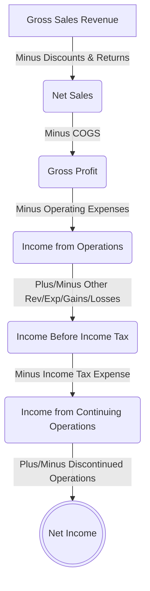
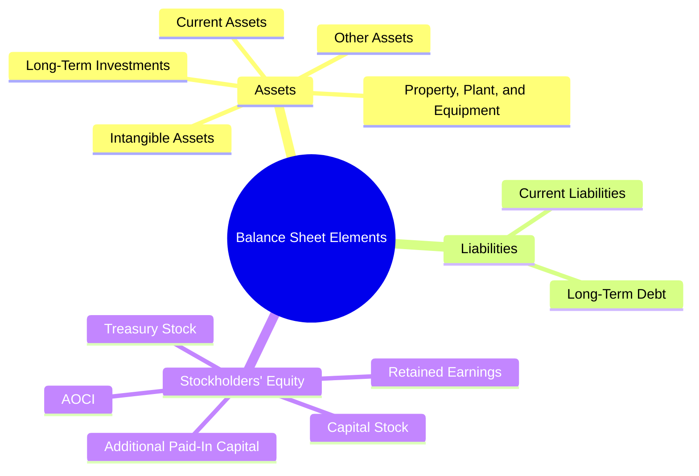

# Basic Financial Statement Structures

> [!abstract] Curriculum & Syllabus Context
>
> - **Course:** ACC 301 Intermediate Accounting
> - **Phase:** Phase 1: Conceptual & Procedural Foundations
> - **Target Reading:** Weygandt, Kieso, and Warfield, *Intermediate Accounting*, 18th Edition — **Chapter 3 (Sections 3.1–3.3) & Chapter 4 (Section 4.1)**
> - **Syllabus Focus:** Income statement uses and limitations, multiple-step and single-step formats, comprehensive income and OCI, discontinued operations, intraperiod tax allocation, statement of stockholders' equity, and classified balance sheet liquidity/solvency structure.

---

### Section 3.1: Income Statement Uses, Limitations, and Formats
> [!info] Key Definition
>
> The **Income Statement** (also termed the *Statement of Income* or *Statement of Earnings*) measures the financial results of an entity's operations over a specific period of time. It reflects the profitability and operating efficiency of the enterprise by matching revenues and gains against expenses and losses.

#### 1. Usefulness of the Income Statement
Financial statement users (investors, creditors, and management) utilize the income statement for three primary analytical purposes:
* **Evaluating Past Performance**: Historical operating results allow users to evaluate how management allocated capital and controlled operating costs relative to competitors.
* **Predicting Future Performance**: Recurring revenue and expense patterns provide a baseline for forecasting future net cash flows and earnings potential.
* **Assessing Risk and Uncertainty of Achieving Cash Flows**: Disaggregating performance into core operating components versus peripheral or non-recurring transactions highlights the stability and sustainability of earnings.
#### 2. Limitations of the Income Statement
> [!warning] Exam Pitfall / Exception
>
> Net income is not an absolute cash measure and is highly susceptible to manipulation and interpretation differences due to the following limitations:
> * **Omission of Unmeasurable Items**: High-value intangible attributes—such as brand equity, customer loyalty, human capital, and quality of customer service—are omitted because they cannot be measured with sufficient reliability under GAAP.
> * **Accounting Method Flexibility**: Income numbers are significantly impacted by the choice of accounting principles (e.g., FIFO vs. LIFO inventory costing, or straight-line vs. accelerated depreciation methods).
> * **Subjectivity and Estimation**: Relies heavily on estimates and managerial judgment (e.g., useful lives, residual values, bad debt percentages, and warranty obligations).

#### 3. Theoretical Approaches to Income Measurement
Accounting theory distinguishes between two primary conceptual frameworks for measuring income:
* **Transaction Approach**: Focuses on recording direct income-related activities (transactions and events) as they occur during the period. It classifies revenues, expenses, gains, and losses by function, product, or operational recurring nature.
* **Capital Maintenance Approach**: Determines net income based on the change in net assets (equity) over a period, adjusted for owner transactions.

> [!quote] Formula & Derivation: Capital Maintenance Approach
>
> $$ \text{Net Income} = \text{Ending Equity} - \text{Beginning Equity} - \text{Investments by Owners} + \text{Distributions to Owners} $$
> *Trade-off*: While simple, the capital maintenance approach fails to disclose the functional sources or operational drivers of performance.

#### 4. Elements of the Income Statement
Under SFAC No. 6, the four primary income statement elements are defined as:
* **Revenues**: Inflows or other enhancements of assets of an entity or settlements of its liabilities during a period from delivering or producing goods, rendering services, or other activities that constitute the entity's ongoing major or central operations.
* **Expenses**: Outflows or other using up of assets or incurrences of liabilities during a period from delivering or producing goods, rendering services, or carrying out other activities that constitute the entity's ongoing major or central operations.
* **Gains**: Increases in net assets (equity) from peripheral or incidental transactions of an entity, except those resulting from revenues or investments by owners.
* **Losses**: Decreases in net assets (equity) from peripheral or incidental transactions of an entity, except those resulting from expenses or distributions to owners.

---
#### 5. Multiple-Step Income Statement
The **Multiple-Step Income Statement** highlights intermediate components of profitability by segregating core operating activities from non-operating revenues, expenses, gains, and losses.

##### Standard Structure & Section Classifications
> [!quote] Formula & Derivation: Multiple-Step Components
>
> $$ \text{Net Sales} = \text{Gross Sales Revenue} - \text{Sales Discounts} - \text{Sales Returns and Allowances} $$
> $$ \text{Gross Profit} = \text{Net Sales Revenue} - \text{Cost of Goods Sold} $$
> $$ \text{Income from Operations} = \text{Gross Profit} - \text{Total Operating Expenses} $$
> $$ \text{Income Before Tax} = \text{Income from Operations} + \text{Total Other Rev/Gains} - \text{Total Other Exp/Losses} $$

* **Operating Expenses Section**: Costs incurred to support central operations disaggregated by function:
  * *Selling Expenses*: Sales commissions, advertising, delivery expense/freight-out, sales salaries, store depreciation.
  * *General and Administrative (G&A) Expenses*: Officers' salaries, office rent, legal and accounting fees, administrative depreciation, utilities.
* **Other Revenues and Gains**: Non-operating or peripheral inflows (e.g., interest revenue, dividend revenue, gain on disposal of equipment).
* **Other Expenses and Losses**: Non-operating or peripheral outflows (e.g., interest expense, casualty losses, inventory impairment).

---
#### 6. Single-Step Income Statement
The **Single-Step Income Statement** groups all revenues and gains together into one category and all expenses and losses into another, deriving net income through a single subtraction:

> [!quote] Formula & Derivation
>
> $$ \text{Net Income} = \text{Total Revenues and Gains} - \text{Total Expenses and Losses} $$

* **Theoretical Rationale**: A company does not realize any net profit until total revenues exceed total expenses. It avoids implying priority or preference of one type of revenue or expense over another.
* **Regulatory Requirement**: While GAAP permits both formats, the **SEC requires public companies** to present financial results in a multiple-step format to distinguish operating performance from non-operating activities.

---
#### 7. Basic Earnings Per Share (EPS)
EPS represents the dollar amount of net income earned per share of outstanding common stock. It is presented on the face of the income statement.

> [!quote] Formula & Derivation
>
> $$ \text{Basic EPS} = \frac{\text{Net Income} - \text{Preferred Dividends}}{\text{Weighted-Average Number of Common Shares Outstanding}} $$
> $$ WA_s = \sum \left( \text{Shares Outstanding during Period} \times \frac{\text{Months Outstanding}}{12} \right) $$

* **Preferred Dividends Deduction**: Subtract cumulative preferred dividends (declared or undeclared) or noncumulative preferred dividends declared during the period.
* *Stock Splits & Stock Dividends*: Restate share counts retrospectively for all periods presented prior to the split/dividend.

---
### Section 3.2: Special Income Items & Comprehensive Income

---
#### 1. Discontinued Operations
> [!info] Key Definition
>
> A **Discontinued Operation** represents a major strategic shift that has (or will have) a major effect on an entity's operations and financial results.

##### Criteria for Classification
1. **Component Elimination**: The company eliminates (or plans to dispose of) a component of a business—comprising operations and cash flows that can be clearly distinguished operationally and for financial reporting.
2. **Strategic Shift**: The elimination represents a strategic shift such as disposal of a major line of business, a major geographical area, or a major equity method investment.
##### Income Statement Presentation
Discontinued operations are presented separately **net of tax**, placed immediately below *Income from Continuing Operations*:

$$ \begin{array}{l}
\text{Income from Continuing Operations (After Tax)} \\
\pm \text{Discontinued Operations:} \\
\quad \text{Income (Loss) from Operations of Discontinued Component (Net of Tax)} \\
\quad \pm \text{Gain (Loss) on Disposal of Discontinued Component (Net of Tax)} \\
\hline
= \text{Net Income}
\end{array} $$

---
#### 2. Intraperiod Tax Allocation
**Intraperiod Tax Allocation** is the process of allocating total income tax expense for a fiscal period across specific financial statement components to prevent distortion.
##### Components Requiring Individual Tax Allocation
1. Income from Continuing Operations
2. Discontinued Operations
3. Other Comprehensive Income (OCI)
4. Prior Period Adjustments (Retained Earnings)

> [!quote] Formula & Derivation: Tax Effect Allocation
>
> $$ \text{Tax Effect of Item} = \text{Pretax Amount of Item} \times \text{Marginal Tax Rate } (t) $$
> * If an item is a **Gain**: $\text{After-Tax Gain} = \text{Pre-Tax Gain} \times (1 - t)$
> * If an item is a **Loss**: $\text{Tax Reduction} = \text{Pre-Tax Loss} \times t \implies \text{After-Tax Loss} = \text{Pre-Tax Loss} \times (1 - t)$

---
#### 3. Comprehensive Income
> [!info] Key Definition
>
> **Comprehensive Income** includes all changes in equity (net assets) during a period except those resulting from investments by owners and distributions to owners.

> [!quote] Formula & Derivation
>
> $$ \text{Comprehensive Income} = \text{Net Income} + \text{Other Comprehensive Income (OCI)} $$

##### Other Comprehensive Income (OCI) Items
Gains and losses that bypass the traditional Income Statement to avoid net income volatility:
1. Unrealized holding gains/losses on Available-for-Sale (AFS) debt securities.
2. Translation gains/losses on foreign currency financial statements.
3. Unrealized gains/losses on effective cash flow hedges.
4. Postretirement/pension plan actuarial gains/losses and prior service costs.
##### Presentation Formats
1. **One-Statement Approach (Statement of Comprehensive Income)**: Net income is reported as a subtotal, followed immediately by OCI items to arrive at Comprehensive Income.
2. **Two-Statement Approach**:
   * *Statement 1*: Traditional Income Statement ending at Net Income.
   * *Statement 2*: Comprehensive Income Statement beginning with Net Income, adding/subtracting OCI items to yield Comprehensive Income.

---
### Section 3.3: Stockholders' Equity Statements & Retained Earnings

---
#### 1. Retained Earnings Statement
**Retained Earnings** represents the cumulative earned capital of the enterprise that has been retained in the business rather than distributed as dividends.
##### Standard Reconciliation Formula
$$ \begin{array}{l}
\text{Beginning Retained Earnings (as previously reported)} \\
\pm \text{Prior Period Adjustments (Correction of Errors, net of tax)} \\
\pm \text{Cumulative Effect of Changes in Accounting Principle (net of tax)} \\
\hline
= \text{Beginning Retained Earnings (as adjusted)} \\
+ \text{Net Income} \quad (\text{or } - \text{Net Loss}) \\
- \text{Cash Dividends Declared} \\
- \text{Stock Dividends Declared} \\
\hline
= \text{Ending Retained Earnings}
\end{array} $$
* **Appropriated Retained Earnings**: Management or contractual covenants (e.g., bond indentures) may segregate a portion of retained earnings into *Appropriated Retained Earnings* (restricted) versus *Unappropriated Retained Earnings* (free for dividends). Total Retained Earnings equals the sum of both.

---
#### 2. Statement of Stockholders' Equity
The **Statement of Stockholders' Equity** (or *Statement of Changes in Equity*) is a required matrix-form financial statement that reconciles the beginning and ending balances of every equity account.
##### Accumulated Other Comprehensive Income (AOCI)
AOCI is a permanent balance sheet equity account that accumulates periodic OCI amounts over time.
> [!quote] Formula & Derivation
>
> $$ \text{Ending AOCI} = \text{Beginning AOCI} \pm \text{Current Period OCI} $$

---
### Section 4.1: Balance Sheet (Statement of Financial Position) Overview
> [!info] Key Definition
>
> The **Balance Sheet** (Statement of Financial Position) reports the assets, liabilities, and stockholders' equity of an enterprise at a specific point in time.

> [!quote] Formula & Derivation
>
> $$ \text{Assets} = \text{Liabilities} + \text{Stockholders' Equity} $$

---
#### 1. Usefulness & Financial Ratios
The balance sheet provides a basis for computing rates of return and assessing capital structure.
* **Liquidity**: The amount of time expected to elapse until an asset is converted into cash or a liability is paid.
* **Solvency**: The ability of a company to pay its debts as they mature. Higher debt-to-assets ratios signal lower solvency.
* **Financial Flexibility**: The ability of an enterprise to take effective actions to alter the amounts and timing of cash flows so it can respond to unexpected needs and opportunities.
#### 2. Limitations of the Balance Sheet
* **Historical Cost Bias**: Most assets and liabilities are reported at historical acquisition cost rather than current fair value.
* **Use of Judgments and Estimates**: Estimates are required for collectibility of receivables, inventory net realizable value, useful lives, and warranty liabilities.
* **Omission of Soft Assets**: Hard assets (inventory, PP&E) are recorded, but soft assets (intellectual capital, employee expertise, brand value) are omitted.

---
#### 3. Classification Standards on the Balance Sheet

##### A. Current Assets
**Current Assets** are cash and other assets expected to be converted to cash, sold, or consumed within **one year or the operating cycle, whichever is longer**.
* **Operating Cycle**: The average time required to acquire materials, produce inventory, sell goods, and collect cash from receivables.

| Current Asset Item | Basis of Valuation | Definition / Details |
| :--- | :--- | :--- |
| **Cash & Cash Equivalents** | Fair Value | Cash, demand deposits, and short-term liquid investments maturing within $\le 3$ months. |
| **Short-Term Investments** | Fair Value / Amortized Cost | Debt and equity securities classified as Trading, Available-for-Sale (AFS), or Held-to-Maturity. |
| **Receivables** | Net Realizable Value | Trade Accounts and Notes Receivable less Allowance for Doubtful Accounts. |
| **Inventories** | LCNRV / LCM | Merchandise, Raw Materials, Work in Process, and Finished Goods valued at lower-of-cost-or-net-realizable-value or lower-of-cost-or-market. |
| **Prepaid Expenses** | Historical Cost | Unexpired costs (prepaid rent, prepaid insurance) paid in advance. |

##### B. Noncurrent Assets
* **Long-Term Investments**: Assets held for long-term capital appreciation, securities held to control other entities, land held for speculation, or sinking funds.
* **Property, Plant, and Equipment (PP&E)**: Tangible, long-lived assets used in central ongoing operations (Land, Buildings, Machinery, Equipment). Reported at historical cost less Accumulated Depreciation.
* **Right-of-Use (ROU) Assets**: Assets recognized under operating and finance lease contracts.
* **Intangible Assets**: Long-lived assets lacking physical substance (Patents, Copyrights, Trademarks, Franchises, Goodwill). Amortized over limited useful lives; indefinite-life intangibles and goodwill are tested for impairment.
* **Other Assets**: Restricted cash, deferred tax assets, long-term prepaid expenses, or non-operating equipment.
##### C. Liabilities
* **Current Liabilities**: Obligations expected to be liquidated through the use of current assets or the creation of other current liabilities within one year or the operating cycle, whichever is longer.
  * *Includes*: Accounts Payable, Short-Term Notes Payable, Current Maturities of Long-Term Debt, Accrued Salaries/Interest, Unearned Revenues, Income Taxes Payable.
* **Long-Term Liabilities**: Obligations not expected to be liquidated within the current operating cycle.
  * *Includes*: Bonds Payable, Long-Term Notes Payable, Lease Liabilities, Deferred Tax Liabilities, Pension/Postretirement Obligations.
##### D. Stockholders' Equity
1. **Capital Stock**: Preferred Stock and Common Stock recorded at par or stated value.
2. **Additional Paid-In Capital (APIC)**: Excess consideration received over par/stated value.
3. **Retained Earnings**: Accumulated net income less dividends declared (Unappropriated and Appropriated).
4. **Accumulated Other Comprehensive Income (AOCI)**: Cumulative unrealized gains/losses from OCI.
5. **Treasury Stock**: Cost of company's own shares reacquired (subtracted from total equity).

---
### Step-by-Step Comprehensive Numerical Walkthroughs

---

> [!example] Problem 1: Income Statement, Comprehensive Income, and EPS Synthesis
>
> **Scenario**: Apex Corporate Solutions Inc. reports the following pre-tax trial balance amounts for the fiscal year ended December 31, 2025:
> * Gross Sales Revenue: $\$5,200,000$
> * Sales Discounts: $\$60,000$
> * Sales Returns and Allowances: $\$140,000$
> * Cost of Goods Sold: $\$2,800,000$
> * Selling Expenses: $\$420,000$
> * General and Administrative Expenses: $\$380,000$
> * Dividend Revenue: $\$25,000$
> * Gain on Sale of Plant Assets: $\$45,000$
> * Interest Expense: $\$90,000$
> * Loss from Casualty (Flood): $\$100,000$
> * Pre-tax Loss from Operations of Discontinued Logistics Division: $\$200,000$
> * Pre-tax Gain on Disposal of Discontinued Logistics Division: $\$80,000$
> * Unrealized Holding Gain on Available-for-Sale Debt Securities (Pre-tax): $\$60,000$
> **Additional Data**:
> * Effective Income Tax Rate: $25\%$ across all items.
> * Preferred Stock Dividends Declared and Paid: $\$30,000$.
> * Common Shares Outstanding: $200,000$ shares outstanding throughout 2025.
> ---
> ##### Step-by-Step Solution & Calculations
> **Step 1: Compute Net Sales & Operating Income**
> $$ \text{Net Sales} = \$5,200,000 - \$60,000 - \$140,000 = \$5,000,000 $$
> $$ \text{Gross Profit} = \$5,000,000 - \$2,800,000 = \$2,200,000 $$
> $$ \text{Total Operating Expenses} = \$420,000 + \$380,000 = \$800,000 $$
> $$ \text{Income from Operations} = \$2,200,000 - \$800,000 = \$1,400,000 $$
> **Step 2: Compute Other Revenues/Gains and Expenses/Losses**
> $$ \text{Other Revenues and Gains} = \$25,000 + \$45,000 = \$70,000 $$
> $$ \text{Other Expenses and Losses} = \$90,000 + \$100,000 = \$190,000 $$
> $$ \text{Income from Continuing Operations Before Tax} = \$1,400,000 + \$70,000 - \$190,000 = \$1,280,000 $$
> $$ \text{Income Tax Expense on Continuing Operations } (25\%) = \$1,280,000 \times 0.25 = \$320,000 $$
> $$ \text{Income from Continuing Operations (After Tax)} = \$1,280,000 - \$320,000 = \$960,000 $$
> **Step 3: Compute Intraperiod Tax Allocation for Discontinued Operations**
> * *Operating Loss of Discontinued Division*:
>   $$ \text{Pre-tax Loss} = -\$200,000 \implies \text{Tax Benefit } (25\%) = \$50,000 \implies \text{After-Tax Loss} = -\$150,000 $$
> * *Gain on Disposal of Discontinued Division*:
>   $$ \text{Pre-tax Gain} = \$80,000 \implies \text{Tax Expense } (25\%) = \$20,000 \implies \text{After-Tax Gain} = \$60,000 $$
> * *Net Discontinued Operations Loss*:
>   $$ \text{Net After-Tax Discontinued Operations Effect} = -\$150,000 + \$60,000 = -\$90,000 $$
> $$ \text{Net Income} = \$960,000 - \$90,000 = \$870,000 $$
> **Step 4: Compute Basic Earnings Per Share (EPS)**
> $$ \text{Shares Outstanding} = 200,000 $$
> $$ \text{EPS for Continuing Operations} = \frac{\$960,000 - \$30,000}{200,000} = \frac{\$930,000}{200,000} = \$4.65 \text{ per share} $$
> $$ \text{EPS for Discontinued Operations} = \frac{-\$90,000}{200,000} = -\$0.45 \text{ per share} $$
> $$ \text{Net Basic EPS} = \$4.65 - \$0.45 = \$4.20 \text{ per share} $$
> **Step 5: Compute Other Comprehensive Income & Total Comprehensive Income**
> $$ \text{Pre-tax Unrealized Gain on AFS Securities} = \$60,000 $$
> $$ \text{Tax Expense on OCI } (25\%) = \$60,000 \times 0.25 = \$15,000 $$
> $$ \text{Net OCI} = \$60,000 - \$15,000 = \$45,000 $$
> $$ \text{Total Comprehensive Income} = \text{Net Income } (\$870,000) + \text{OCI } (\$45,000) = \$915,000 $$
> ---
> ##### Apex Corporate Solutions Inc. — Multiple-Step Income Statement
> **For the Year Ended December 31, 2025**
> $$ \begin{array}{lrr}
> \textbf{Sales Revenue:} & & \\
> \quad \text{Gross Sales Revenue} & \$5,200,000 & \\
> \quad \text{Less: Sales Discounts} & (60,000) & \\
> \quad \text{Less: Sales Returns and Allowances} & (140,000) & \\
> \hline
> \textbf{Net Sales Revenue} & & \$5,000,000 \\
> \text{Cost of Goods Sold} & & (2,800,000) \\
> \hline
> \textbf{Gross Profit} & & \$2,200,000 \\
> \textbf{Operating Expenses:} & & \\
> \quad \text{Selling Expenses} & \$420,000 & \\
> \quad \text{General and Administrative Expenses} & 380,000 & (800,000) \\
> \hline
> \textbf{Income from Operations} & & \$1,400,000 \\
> \textbf{Other Revenues and Gains:} & & \\
> \quad \text{Dividend Revenue} & \$25,000 & \\
> \quad \text{Gain on Sale of Plant Assets} & 45,000 & 70,000 \\
> \textbf{Other Expenses and Losses:} & & \\
> \quad \text{Interest Expense} & (90,000) & \\
> \quad \text{Loss from Casualty (Flood)} & (100,000) & (190,000) \\
> \hline
> \textbf{Income Before Income Tax} & & \$1,280,000 \\
> \text{Income Tax Expense (25\%)} & & (320,000) \\
> \hline
> \textbf{Income from Continuing Operations} & & \$960,000 \\
> \textbf{Discontinued Operations:} & & \\
> \quad \text{Loss from Operations of Discontinued Division (net of \$50,000 tax benefit)} & \$(150,000) & \\
> \quad \text{Gain on Disposal of Discontinued Division (net of \$20,000 tax expense)} & 60,000 & (90,000) \\
> \hline
> \textbf{Net Income} & & \mathbf{\$870,000} \\
> \hline \hline
> \textbf{Per Share Data (200,000 shares):} & & \\
> \quad \text{Income from Continuing Operations} & & \$4.65 \\
> \quad \text{Discontinued Operations} & & (0.45) \\
> \hline
> \quad \textbf{Net Basic Earnings Per Share} & & \mathbf{\$4.20} \\
> \hline \hline
> \end{array} $$
> ---
> ##### Apex Corporate Solutions Inc. — Statement of Comprehensive Income (Two-Statement Approach)
> **For the Year Ended December 31, 2025**
> $$ \begin{array}{lr}
> \textbf{Net Income} & \$870,000 \\
> \textbf{Other Comprehensive Income (OCI):} & \\
> \quad \text{Unrealized Holding Gain on Available-for-Sale Debt Securities (net of \$15,000 tax)} & 45,000 \\
> \hline
> \textbf{Total Comprehensive Income} & \mathbf{\$915,000} \\
> \hline \hline
> \end{array} $$

---

> [!example] Problem 2: Statement of Stockholders' Equity Walkthrough
>
> **Scenario**: Vanguard Technologies Corp. presents the following opening balances at January 1, 2025:
> * Preferred Stock ($8\%$, $\$100$ par): $\$200,000$ ($2,000$ shares)
> * Common Stock ($\$5$ par): $\$500,000$ ($100,000$ shares)
> * Additional Paid-in Capital — Common Stock: $\$1,200,000$
> * Retained Earnings: $\$650,000$
> * Accumulated Other Comprehensive Income (AOCI): $\$80,000$ (credit)
> * Treasury Stock (Common): $\$0$
> **Transactions during 2025**:
> 1. Issued $20,000$ additional shares of common stock for $\$18$ per share.
> 2. Earned Net Income of $\$450,000$.
> 3. Recorded Other Comprehensive Loss of $\$25,000$ (net of tax) from foreign currency translation.
> 4. Declared and paid Preferred Dividends of $\$16,000$ ($8\% \times \$200,000$).
> 5. Declared and paid Common Cash Dividends of $\$0.50$ per share on all outstanding shares.
> 6. Purchased $5,000$ shares of Common Treasury Stock at $\$15$ per share.
> ---
> ##### Step-by-Step Solution & Matrix Assembly
> 7. **Issuance of Common Stock**:
>    * $\text{Shares Issued} = 20,000 \implies \Delta \text{Common Stock} = 20,000 \times \$5 = \$100,000$
>    * $\text{Proceeds} = 20,000 \times \$18 = \$360,000 \implies \Delta \text{APIC-Common} = \$360,000 - \$100,000 = \$260,000$
>    * Total Common Shares Outstanding for Dividends $= 100,000 + 20,000 = 120,000$ shares.
> 8. **Common Dividends Declared**:
>    * $\text{Common Dividend} = 120,000 \text{ shares} \times \$0.50 = \$60,000$
>    * Total Retained Earnings Deductions $= \text{Preferred } (\$16,000) + \text{Common } (\$60,000) = \$76,000$.
> 9. **Treasury Stock Purchase**:
>    * $\text{Cost} = 5,000 \text{ shares} \times \$15 = \$75,000 \implies$ Subtracted from Equity.
> ##### Vanguard Technologies Corp. — Statement of Stockholders' Equity
> **For the Year Ended December 31, 2025**
> $$ \begin{array}{lrrrrrrr}
> \hline
> \textbf{Item} & \textbf{Pref. Stock} & \textbf{Com. Stock} & \textbf{APIC-Com.} & \textbf{Ret. Earn.} & \textbf{AOCI} & \textbf{Treas. Stock} & \textbf{Total Equity} \\
> \hline
> \text{Bal. 1/1/25} & \$200,000 & \$500,000 & \$1,200,000 & \$650,000 & \$80,000 & \$0 & \$2,630,000 \\
> \text{Issue Stock} & - & 100,000 & 260,000 & - & - & - & 360,000 \\
> \text{Net Income} & - & - & - & 450,000 & - & - & 450,000 \\
> \text{OCI (Loss)} & - & - & - & - & (25,000) & - & (25,000) \\
> \text{Pref. Div.} & - & - & - & (16,000) & - & - & (16,000) \\
> \text{Com. Div.} & - & - & - & (60,000) & - & - & (60,000) \\
> \text{Pur. Treas.} & - & - & - & - & - & (75,000) & (75,000) \\
> \hline
> \mathbf{Bal. 12/31/25} & \mathbf{\$200,000} & \mathbf{\$600,000} & \mathbf{\$1,460,000} & \mathbf{\$964,000} & \mathbf{\$55,000} & \mathbf{\$(75,000)} & \mathbf{\$3,204,000} \\
> \hline \hline
> \end{array} $$

---

> [!example] Problem 3: Classified Balance Sheet Preparation (Report Form)
>
> **Scenario**: Meridian Logistics Corp. reports the following accounts as of December 31, 2025:
> * Cash & Cash Equivalents: $\$140,000$
> * Available-for-Sale Debt Investments (Short-term, Fair Value): $\$90,000$
> * Accounts Receivable: $\$320,000$
> * Allowance for Doubtful Accounts: $\$20,000$
> * Notes Receivable (Due in 6 months): $\$50,000$
> * Merchandise Inventory (at LCNRV): $\$480,000$
> * Prepaid Insurance (for 8 months): $\$18,000$
> * Land Held for Future Plant Site: $\$250,000$
> * Land (used in operations): $\$400,000$
> * Buildings: $\$1,800,000$
> * Accumulated Depreciation — Buildings: $\$450,000$
> * Equipment: $\$850,000$
> * Accumulated Depreciation — Equipment: $\$250,000$
> * Patents (Net of amortization): $\$110,000$
> * Goodwill: $\$180,000$
> * Accounts Payable: $\$210,000$
> * Notes Payable (Due in 3 months): $\$70,000$
> * Current Portion of Long-Term Debt: $\$40,000$
> * Accrued Salaries and Wages: $\$30,000$
> * Unearned Service Revenue: $\$25,000$
> * Bonds Payable ($8\%$, due 2035): $\$1,000,000$
> * Discount on Bonds Payable: $\$40,000$
> * Deferred Tax Liability (Long-term): $\$60,000$
> * Preferred Stock ($7\%$, $\$100$ par, $3,000$ shares outstanding): $\$300,000$
> * Common Stock ($\$1$ par, $500,000$ shares outstanding): $\$500,000$
> * Additional Paid-In Capital — Common Stock: $\$850,000$
> * Retained Earnings: $\$723,000$
> * Accumulated Other Comprehensive Income (Credit): $\$35,000$
> * Treasury Stock (Common, at cost, $2,000$ shares): $\$30,000$
> ---
> ##### Meridian Logistics Corp. — Classified Balance Sheet (Report Form)
> **As of December 31, 2025**
> $$ \begin{array}{lrr}
> \textbf{ASSETS} & & \\
> \textbf{Current Assets:} & & \\
> \quad \text{Cash and Cash Equivalents} & \$140,000 & \\
> \quad \text{Short-Term Investments (Available-for-Sale, at Fair Value)} & 90,000 & \\
> \quad \text{Accounts Receivable} & \$320,000 & \\
> \quad \text{Less: Allowance for Doubtful Accounts} & (20,000) & 300,000 \\
> \quad \text{Notes Receivable (Short-Term)} & & 50,000 \\
> \quad \text{Merchandise Inventory (at LCNRV)} & & 480,000 \\
> \quad \text{Prepaid Insurance} & & 18,000 \\
> \hline
> \quad \textbf{Total Current Assets} & & \mathbf{\$1,078,000} \\
> \textbf{Long-Term Investments:} & & \\
> \quad \text{Land Held for Future Plant Site} & & 250,000 \\
> \textbf{Property, Plant, and Equipment:} & & \\
> \quad \text{Land} & \$400,000 & \\
> \quad \text{Buildings} & \$1,800,000 & \\
> \quad \text{Less: Accumulated Depreciation — Buildings} & (450,000) & 1,350,000 \\
> \quad \text{Equipment} & \$850,000 & \\
> \quad \text{Less: Accumulated Depreciation — Equipment} & (250,000) & 600,000 \\
> \hline
> \quad \textbf{Total Property, Plant, and Equipment} & & \mathbf{\$2,350,000} \\
> \textbf{Intangible Assets:} & & \\
> \quad \text{Patents (net of amortization)} & \$110,000 & \\
> \quad \text{Goodwill} & 180,000 & 290,000 \\
> \hline
> \textbf{TOTAL ASSETS} & & \mathbf{\$3,968,000} \\
> \hline \hline
> & & \\
> \textbf{LIABILITIES AND STOCKHOLDERS' EQUITY} & & \\
> \textbf{Current Liabilities:} & & \\
> \quad \text{Accounts Payable} & \$210,000 & \\
> \quad \text{Notes Payable (Short-Term)} & 70,000 & \\
> \quad \text{Current Portion of Long-Term Debt} & 40,000 & \\
> \quad \text{Accrued Salaries and Wages} & 30,000 & \\
> \quad \text{Unearned Service Revenue} & 25,000 & \\
> \hline
> \quad \textbf{Total Current Liabilities} & & \mathbf{\$375,000} \\
> \textbf{Long-Term Liabilities:} & & \\
> \quad \text{Bonds Payable (8\%, due 2035)} & \$1,000,000 & \\
> \quad \text{Less: Discount on Bonds Payable} & (40,000) & \$960,000 \\
> \quad \text{Deferred Tax Liability (Long-Term)} & & 60,000 \\
> \hline
> \quad \textbf{Total Long-Term Liabilities} & & \mathbf{\$1,020,000} \\
> \hline
> \textbf{Total Liabilities} & & \mathbf{\$1,395,000} \\
> & & \\
> \textbf{Stockholders' Equity:} & & \\
> \quad \text{Preferred Stock (7\%, \$100 par, 3,000 shares issued/outstanding)} & \$300,000 & \\
> \quad \text{Common Stock (\$1 par, 500,000 shares issued)} & 500,000 & \\
> \quad \text{Additional Paid-in Capital — Common Stock} & 850,000 & \\
> \quad \text{Retained Earnings} & 723,000 & \\
> \quad \text{Accumulated Other Comprehensive Income (AOCI)} & 35,000 & \\
> \quad \text{Less: Treasury Stock (Common, 2,000 shares at cost)} & (30,000) & \\
> \hline
> \quad \textbf{Total Stockholders' Equity} & & \mathbf{\$2,573,000} \\
> \hline
> \textbf{TOTAL LIABILITIES AND STOCKHOLDERS' EQUITY} & & \mathbf{\$3,968,000} \\
> \hline \hline
> \end{array} $$
> ---
> ##### Key Financial Ratios & Working Capital Computation
> * **Working Capital**:
>   $$ \text{Working Capital} = \text{Current Assets} - \text{Current Liabilities} = \$1,078,000 - \$375,000 = \$703,000 $$
> * **Current Ratio**:
>   $$ \text{Current Ratio} = \frac{\text{Current Assets}}{\text{Current Liabilities}} = \frac{\$1,078,000}{\$375,000} = 2.87:1 $$
