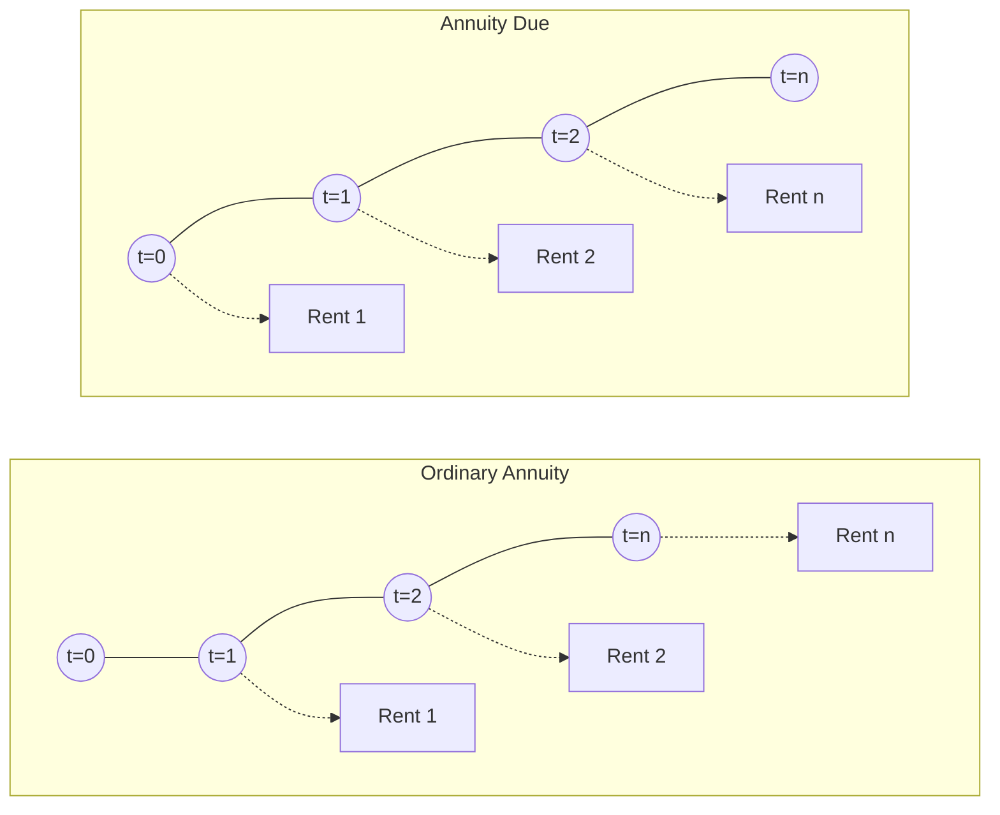

# The Mathematics of Interest & Time Value of Money

> [!abstract] Curriculum & Syllabus Context
>
> - **Course:** ACC 301 Intermediate Accounting
> - **Phase:** Phase 1: Conceptual & Procedural Foundations
> - **Target Reading:** Weygandt, Kieso, and Warfield, *Intermediate Accounting*, 18th Edition — **Chapter 5: Accounting and the Time Value of Money**
> - **Syllabus Focus:** Simple vs. compound interest, compounding frequency, future value and present value of single sums, ordinary annuities, annuities due, deferred annuities, bond valuation mathematics, and the expected cash flow approach (SFAC No. 7).

---

### Section 1: Fundamental Concepts & Nature of Interest
#### 1.1 Definition and Role of Time Value of Money in Accounting
> [!info] Key Definition
>
> The phrase **Time Value of Money (TVM)** indicates that a dollar received today is worth more than a dollar promised at some date in the future. This economic reality exists because money has earning power: today's dollar can be invested immediately to earn interest and grow to a larger sum in the future.

In financial reporting, accounting measurement relies heavily on TVM principles. While historical cost is used for property, plant, and equipment, and net realizable value for inventories, FASB standards increasingly require **fair value** and **present value-based measurements** for financial assets and liabilities. When market-based prices are unobservable (Level 3 inputs in the fair value hierarchy), present value techniques convert expected future cash flows into a single present value that reflects current fair value.

Major accounting applications requiring TVM discounting include:
* **Notes Receivable and Payable**: Valuing zero-interest-bearing or unrealistic interest-bearing notes.
* **Long-Term Debt & Bonds**: Determining the market price, discount/premium amortization, and effective interest expense of corporate bonds.
* **Leases**: Valuing right-of-use (ROU) assets and lease liabilities for finance and operating leases.
* **Pensions & Postretirement Benefits**: Measuring the Projected Benefit Obligation (PBO) and service cost components.
* **Asset Retirement Obligations (ARO) & Impairments**: Discounting future environmental remediation costs and calculating recoverable amounts for impaired long-lived assets.

---
#### 1.2 Components of the Interest Rate
Interest is the payment or return for the use of money. Lenders express interest as an annual percentage rate ($i$) rather than a flat dollar amount. In financial economics and accounting, the total required interest rate consists of three distinct risk/reward components:
1. **Pure Rate of Interest ($2\% - 4\%$)**: The theoretical interest rate charged if there were zero risk of default and zero expectation of price-level changes (inflation).
2. **Expected Inflation Rate ($0\% - \text{high}$)**: An additional percentage added by lenders to compensate for the anticipated loss of purchasing power over the transaction period.
   * *Risk-Free Rate of Return*: The sum of the pure rate of interest and the expected inflation rate. FASB requires using the risk-free rate when discounting expected cash flows if credit risk is already incorporated into probability-weighted cash flow estimates.
3. **Credit Risk Rate ($0\% - 5\%+$)**: An additional premium demanded by creditors to compensate for the specific default risk of the borrower (ranging from near zero for sovereign debt to high percentages for distressed corporate borrowers).

---
#### 1.3 Simple Interest vs. Compound Interest
* **Simple Interest**: Computed on the **principal amount only**, regardless of interest earned in prior periods.
* **Compound Interest**: Computed on the original principal **plus** any interest earned in previous periods that has been accumulated rather than paid or withdrawn. Compound interest represents the exponential growth of money over time.

> [!quote] Formula & Derivation: Interest Calculation
>
> $$ \text{Simple Interest} = p \times i \times n $$
> *(where $p = \text{principal}$, $i = \text{rate per period}$, and $n = \text{number of periods}$)*
> $$ \text{Compound Growth Factor} = (1 + i)^n $$

> [!example] Numerical Walkthrough: Simple vs. Compound Interest
>
> Assume Vasquez Company deposits $\$10,000$ at $9\%$ annual simple interest in Bank A, and $\$10,000$ at $9\%$ annual compound interest in Bank B, leaving both untouched for 3 years.
> **Bank A (Simple Interest)**:
> * Year 1 Interest: $\$10,000 \times 0.09 = \$900 \rightarrow$ Year 1 End Balance = $\$10,900$
> * Year 2 Interest: $\$10,000 \times 0.09 = \$900 \rightarrow$ Year 2 End Balance = $\$11,800$
> * Year 3 Interest: $\$10,000 \times 0.09 = \$900 \rightarrow$ Year 3 End Balance = **$\$12,700$**
> * Total Interest Earned = **$\$2,700.00$**
> **Bank B (Compound Interest)**:
> * Year 1 Interest: $\$10,000.00 \times 0.09 = \$900.00 \rightarrow$ Year 1 End Balance = $\$10,900.00$
> * Year 2 Interest: $\$10,900.00 \times 0.09 = \$981.00 \rightarrow$ Year 2 End Balance = $\$11,881.00$
> * Year 3 Interest: $\$11,881.00 \times 0.09 = \$1,069.29 \rightarrow$ Year 3 End Balance = **$\$12,950.29$**
> * Total Interest Earned = **$\$2,950.29$**
> *Compounding Advantage*: Bank B pays **$\$250.29$** more interest due to earning "interest on interest".

---
#### 1.4 Stated Rate vs. Effective Yield & Compounding Frequency
When interest is compounded more than once per year (e.g., semiannually, quarterly, monthly, daily), the stated annual rate differs from the actual yield earned.
* **Stated Rate (Nominal / Face Rate)**: The annual interest rate explicitly contracted in the debt agreement.
* **Effective Rate (Effective Yield)**: The actual annual rate of return earned, taking into account intra-year interest compounding.

> [!quote] Formula & Derivation: Effective Annual Yield
>
> $$ \text{Compounding Periods } (n) = \text{Years} \times m $$
> $$ \text{Interest Rate per Period } (i) = \frac{\text{Stated Annual Rate }}{m} $$
> *(where $m = \text{number of compounding intervals per year}$)*
> $$ \text{Effective Annual Yield } (i_{\text{eff}}) = \left(1 + \frac{r_{\text{stated}}}{m}\right)^m - 1 $$

##### Effect of Compounding Frequency on $\$10,000$ at $10\%$ Stated Rate for 1 Year:
$$ \begin{array}{llrr}
\textbf{Compounding Frequency } (m) & \textbf{Periodic Rate } (i) & \textbf{Effective Annual Rate } (i_{\text{eff}}) & \textbf{Year-End Accumulated Amount} \\
\hline
\text{Annual } (m=1) & 10.000\% & 10.000\% & \$11,000.00 \\
\text{Semiannual } (m=2) & 5.000\% & 10.250\% & \$11,025.00 \\
\text{Quarterly } (m=4) & 2.500\% & 10.381\% & \$11,038.10 \\
\text{Monthly } (m=12) & 0.833\% & 10.471\% & \$11,047.10 \\
\text{Daily } (m=365) & 0.0274\% & 10.516\% & \$11,051.60 \\
\hline \hline
\end{array} $$

---
### Section 2: Single-Sum Problems (Future Value & Present Value of 1)

---
#### 2.1 Future Value of a Single Sum ($FV$)
Future value measures the amount to which a known single principal sum ($PV$) will accumulate at a future point in time when compounded at interest rate $i$ for $n$ periods.

> [!quote] Formula & Derivation: Future Value
>
> **Mathematical Derivation:**
> * End of Period 1: $FV_1 = PV(1 + i)$
> * End of Period 2: $FV_2 = FV_1(1 + i) = PV(1 + i)(1 + i) = PV(1 + i)^2$
> * End of Period $n$: $FV_n = PV(1 + i)^n$
> $$ FV = PV \times (1 + i)^n = PV \times (FVF_{n,i}) $$
> *(where $FVF_{n,i} = (1 + i)^n$ is the Future Value Factor for $n$ periods at rate $i$)*

---
#### 2.2 Present Value of a Single Sum ($PV$)
Present value is the single sum that must be invested today at a specified interest rate $i$ to equal a known future sum ($FV$) at the end of $n$ periods. Discounting moves cash flows **backward** through time, stripping away accumulated interest.

> [!quote] Formula & Derivation: Present Value
>
> **Mathematical Derivation:**
> Rearranging the Future Value formula $FV = PV(1 + i)^n$:
> $$ PV = \frac{FV}{(1 + i)^n} = FV \times (1 + i)^{-n} $$
> $$ PV = FV \times (PVF_{n,i}) $$
> *(where $PVF_{n,i} = \frac{1}{(1 + i)^n} = (1 + i)^{-n}$ is the Present Value Factor for $n$ periods at rate $i$)*

---
#### 2.3 Solving for Unknowns ($n$ and $i$)
When both $PV$ and $FV$ are known, either the number of compounding periods ($n$) or the interest rate ($i$) can be computed algebraically or using interest tables.
1. **Solving for Number of Periods ($n$)**:
   $$ FVF_{n,i} = \frac{FV}{PV} \quad \text{or} \quad PVF_{n,i} = \frac{PV}{FV} $$
   Locate the resulting factor in the known $i\%$ column of the factor table and read the corresponding period row $n$.
2. **Solving for Interest Rate ($i$)**:
   $$ FVF_{n,i} = \frac{FV}{PV} \quad \text{or} \quad PVF_{n,i} = \frac{PV}{FV} $$
   Locate the resulting factor across the known $n$-period row of the factor table and read the corresponding interest column $i\%$.

---
#### 2.4 Numerical Problem Walkthroughs (Single Sums)
> [!example] Walkthrough 2.1: Future Value with Semiannual Compounding
>
> **Problem**: Amazon deposited $\$250,000,000$ on January 1, 2025, into a commitment fund for its second headquarters. The fund earns $10\%$ annual interest compounded semiannually. What will be the accumulated balance on December 31, 2028 (4 years)?
> * **Step 1: Identify variables**:
>   * $PV = \$250,000,000$
>   * $m = 2$ (semiannual)
>   * $\text{Years} = 4 \Rightarrow n = 4 \times 2 = 8 \text{ semiannual periods}$
>   * $\text{Annual } r = 10\% \Rightarrow i = \frac{10\%}{2} = 5\% \text{ per period}$
> * **Step 2: Apply formula**:
>   $$ FV = PV \times (1 + i)^n = \$250,000,000 \times (1.05)^8 $$
> * **Step 3: Calculate factor**:
>   $$ FVF_{8, 5\%} = (1.05)^8 = 1.4774554 $$
> * **Step 4: Compute final value**:
>   $$ FV = \$250,000,000 \times 1.4774554 = \mathbf{\$369,363,850} $$

> [!example] Walkthrough 2.2: Present Value of Non-Interest-Bearing Note
>
> **Problem**: A company accepts a 3-year, zero-interest-bearing note with a maturity value of $\$100,000$. The prevailing market interest rate for a note of similar credit risk is $9\%$ per annum. Calculate the initial present value (carrying amount) and the total implied interest discount.
> * **Step 1: Identify variables**:
>   * $FV = \$100,000$
>   * $n = 3 \text{ annual periods}$
>   * $i = 9\% \text{ per annum}$
> * **Step 2: Apply Present Value formula**:
>   $$ PV = FV \times (1 + i)^{-n} = \$100,000 \times (1.09)^{-3} $$
> * **Step 3: Calculate factor**:
>   $$ PVF_{3, 9\%} = (1.09)^{-3} = 0.772183 $$
> * **Step 4: Compute present value and discount**:
>   $$ PV = \$100,000 \times 0.772183 = \mathbf{\$77,218.30} $$
>   $$ \text{Discount on Notes Receivable} = \$100,000 - \$77,218.30 = \mathbf{\$22,781.70} $$

> [!example] Walkthrough 2.3: Solving for Unknown Interest Rate ($i$)
>
> **Problem**: Amazon needs $\$1,070,584$ in 5 years to purchase electric scooters. It currently has $\$800,000$ to invest today. At what annually compounded interest rate must the $\$800,000$ be invested to reach the target amount?
> * **Step 1: Identify variables**:
>   * $PV = \$800,000$, $FV = \$1,070,584$, $n = 5$
> * **Step 2: Compute $FVF_{5, i}$**:
>   $$ FVF_{5, i} = \frac{FV}{PV} = \frac{\$1,070,584}{\$800,000} = 1.338230 $$
> * **Step 3: Solve algebraically**:
>   $$ (1 + i)^5 = 1.338230 \Rightarrow 1 + i = (1.338230)^{1/5} = 1.06000 \Rightarrow i = \mathbf{6.00\%} $$

---
### Section 3: Annuities (Ordinary Annuity vs. Annuity Due)

---
#### 3.1 Characteristics & Classification of Annuities
> [!info] Key Definition
>
> An **Annuity** is a structured series of periodic monetary receipts or payments (called **rents**, $R$) that satisfy three strict criteria:
> 1. **Equal Dollar Amounts**: The periodic rents ($R$) are identical in magnitude.
> 2. **Equal Time Intervals**: The duration between consecutive rents is constant.
> 3. **Compounding Frequency**: Interest is compounded once per interval.

##### Classification: Timing of Rents

* **Ordinary Annuity**: Rents occur at the **end** of each period. The first rent earns no interest during the first period, and the final rent is deposited/withdrawn on the exact date of final valuation.
* **Annuity Due**: Rents occur at the **beginning** of each period. The first rent is deposited immediately at $t = 0$ and earns interest during period 1. Thus, every rent in an annuity due earns interest for **one additional period** compared to an ordinary annuity.

---
#### 3.2 Summary Matrix of Annuity Formulas
> [!quote] Formula & Derivation: Annuity Matrix
>
> $$ \begin{array}{llll}
> \textbf{Annuity Type} & \textbf{Timing of Rents} & \textbf{Future Value Formula} & \textbf{Present Value Formula} \\
> \hline
> \textbf{Ordinary Annuity} & \text{End of period} & FV\text{-}OA = R \times \left[\frac{(1+i)^n - 1}{i}\right] & PV\text{-}OA = R \times \left[\frac{1 - (1+i)^{-n}}{i}\right] \\
> \textbf{Annuity Due} & \text{Beginning of period} & FV\text{-}AD = FV\text{-}OA \times (1 + i) & PV\text{-}AD = PV\text{-}OA \times (1 + i) \\
> \hline \hline
> \end{array} $$

---
#### 3.3 Numerical Problem Walkthroughs (Annuities)
> [!example] Walkthrough 3.1: Future Value of Ordinary Annuity vs. Annuity Due
>
> **Problem**: An investor deposits $\$5,000$ annually for 5 years at an interest rate of $6\%$ per annum. Compute the accumulated future value assuming:
> (a) Deposits are made at the end of each year (Ordinary Annuity).
> (b) Deposits are made at the beginning of each year (Annuity Due).
> * **Case (a) Ordinary Annuity ($FV\text{-}OA$)**:
>   * $R = \$5,000$, $n = 5$, $i = 6\%$
>   * $FVF\text{-}OA_{5, 6\%} = \frac{(1.06)^5 - 1}{0.06} = \frac{1.3382256 - 1}{0.06} = 5.637093$
>   * $FV\text{-}OA = \$5,000 \times 5.637093 = \mathbf{\$28,185.46}$
> * **Case (b) Annuity Due ($FV\text{-}AD$)**:
>   * $FV\text{-}AD = FV\text{-}OA \times (1 + i) = \$28,185.46 \times 1.06 = \mathbf{\$29,876.59}$

> [!example] Walkthrough 3.2: Present Value of Ordinary Annuity vs. Annuity Due
>
> **Problem**: Space Odyssey Inc. leases a satellite for 4 years with annual payments of $\$4,800,000$. The discount rate is $5\%$ per annum. Calculate the present value of lease payments if:
> (a) Payments are made at the end of each year ($PV\text{-}OA$).
> (b) Payments are made at the beginning of each year ($PV\text{-}AD$).
> * **Case (a) Ordinary Annuity ($PV\text{-}OA$)**:
>   * $R = \$4,800,000$, $n = 4$, $i = 5\%$
>   * $PVF\text{-}OA_{4, 5\%} = \frac{1 - (1.05)^{-4}}{0.05} = \frac{1 - 0.822702}{0.05} = 3.545951$
>   * $PV\text{-}OA = \$4,800,000 \times 3.545951 = \mathbf{\$17,020,564.80}$
> * **Case (b) Annuity Due ($PV\text{-}AD$)**:
>   * $PV\text{-}AD = PV\text{-}OA \times (1 + i) = \$17,020,564.80 \times 1.05 = \mathbf{\$17,871,593.04}$

> [!example] Walkthrough 3.3: Sinking Fund Payment Calculation (Solving for $R$)
>
> **Problem**: A company needs to accumulate $\$14,000$ in 5 years for an equipment down payment. The fund earns $8\%$ annual interest compounded semiannually ($m = 2$). What equal semiannual deposit must be made at the end of each 6-month period?
> * **Step 1: Adjust parameters**:
>   * $FV\text{-}OA = \$14,000$
>   * $n = 5 \times 2 = 10 \text{ semiannual periods}$
>   * $i = \frac{8\%}{2} = 4\% \text{ per period}$
> * **Step 2: Formula and Factor**:
>   $$ FVF\text{-}OA_{10, 4\%} = \frac{(1.04)^{10} - 1}{0.04} = \frac{1.480244 - 1}{0.04} = 12.006107 $$
> * **Step 3: Solve for $R$**:
>   $$ \$14,000 = R \times 12.006107 \implies R = \frac{\$14,000}{12.006107} = \mathbf{\$1,166.07 \text{ per semiannual deposit}} $$

---
### Section 4: Advanced TVM Applications: Deferred Annuities, Long-Term Bonds, & Expected Cash Flows

---
#### 4.1 Deferred Annuities
A **Deferred Annuity** is an annuity in which rents begin two or more periods after the agreement date (the rents are deferred for $y$ periods).
##### 1. Future Value of a Deferred Annuity
Because no interest accumulates during the deferral period prior to the start of rents, the future value of a deferred annuity at time $n$ is identical to the future value of an ordinary annuity for the $n$ active rent periods.
##### 2. Present Value of a Deferred Annuity
To compute the present value of an ordinary annuity of $n$ rents deferred for $y$ periods ($t = y + 1$ to $y + n$), two equivalent methods exist:

> [!quote] Formula & Derivation: PV of Deferred Annuity
>
> * **Option 1: Single Table Subtraction Method**:
>   Subtract the $PVF\text{-}OA$ factor for the deferred period ($y$) from the $PVF\text{-}OA$ factor for total periods ($y + n$).
>   $$ PV_0 = R \times \left[ PVF\text{-}OA_{(y + n), i} - PVF\text{-}OA_{y, i} \right] $$
> * **Option 2: Two-Step Discounting Method**:
>   1. Calculate $PV$ of the $n$ rents at the end of the deferral period ($t = y$):
>      $$ PV_y = R \times (PVF\text{-}OA_{n, i}) $$
>   2. Discount $PV_y$ as a single sum back to $t = 0$ over $y$ periods:
>      $$ PV_0 = PV_y \times (1 + i)^{-y} $$

> [!example] Walkthrough 4.1: Present Value of a Deferred Annuity
>
> **Problem**: Campus Learning Systems purchases software copyright in exchange for 6 annual payments of $\$5,000$ each, with the first payment due 5 years from today (deferred 4 periods: $y = 4, n = 6$). The annual interest rate is $8\%$.
> * **Option 1 Method**:
>   * Total periods = $y + n = 4 + 6 = 10$ periods
>   * $PVF\text{-}OA_{10, 8\%} = 6.710081$
>   * $PVF\text{-}OA_{4, 8\%} = 3.312127$
>   * Net Factor = $6.710081 - 3.312127 = 3.397954$
>   * $PV_0 = \$5,000 \times 3.397954 = \mathbf{\$16,989.77}$
> * **Option 2 Method**:
>   * *Step 1*: $PV_4 = \$5,000 \times PVF\text{-}OA_{6, 8\%} = \$5,000 \times 4.622880 = \$23,114.40$
>   * *Step 2*: $PV_0 = \$23,114.40 \times (1.08)^{-4} = \$23,114.40 \times 0.735030 = \mathbf{\$16,989.78}$

---
#### 4.2 Valuation of Long-Term Bonds
A corporate bond produces **two distinct cash flows** for the investor/issuer:
1. **Principal (Face/Par Value)**: A single sum payable at the maturity date ($FV$).
2. **Periodic Interest Payments**: An ordinary annuity of cash payments ($R$) made each period over the bond's life.
   $$ R = \text{Face Value} \times \text{Stated Coupon Rate} \times \text{Fraction of Year} $$

> [!quote] Formula & Derivation: General Bond Valuation Formula
>
> $$ PV_{\text{Bond}} = \left[ \text{Face Value} \times (1 + i_{\text{market}})^{-n} \right] + \left[ R \times \left( \frac{1 - (1 + i_{\text{market}})^{-n}}{i_{\text{market}}} \right) \right] $$

> [!warning] Exam Pitfall / Exception
>
> **Bond Pricing Rules**:
> * If Stated Rate = Market Rate $\Rightarrow$ Sold at **Par Value** ($PV = \text{Face Value}$).
> * If Stated Rate < Market Rate $\Rightarrow$ Sold at a **Discount** ($PV < \text{Face Value}$).
> * If Stated Rate > Market Rate $\Rightarrow$ Sold at a **Premium** ($PV > \text{Face Value}$).

> [!example] Walkthrough 4.2: Comprehensive Bond Valuation
>
> **Problem**: Alltech Corporation issues $\$100,000$ of $5\%$ annual interest bonds on January 1, 2025, maturing in 5 years ($n = 5$). Interest is payable annually on December 31. The current market interest rate for bonds of similar risk is $6\%$. Calculate the issue price.
> * **Step 1: Identify Cash Flows**:
>   * Principal Cash Flow ($FV$) = $\$100,000$ due at $t = 5$
>   * Annual Interest Cash Flow ($R$) = $\$100,000 \times 5\% = \$5,000$ per year ($n = 5$)
>   * Discount Rate ($i_{\text{market}}$) = $6\%$
> * **Step 2: Present Value of Principal**:
>   $$ PV_{\text{Principal}} = \$100,000 \times (1.06)^{-5} = \$100,000 \times 0.747258 = \mathbf{\$74,725.80} $$
> * **Step 3: Present Value of Interest Annuity**:
>   $$ PV_{\text{Interest}} = \$5,000 \times PVF\text{-}OA_{5, 6\%} = \$5,000 \times 4.212364 = \mathbf{\$21,061.82} $$
> * **Step 4: Total Bond Issue Price**:
>   $$ PV_{\text{Bond}} = \$74,725.80 + \$21,061.82 = \mathbf{\$95,787.62} $$
>   $$ \text{Discount on Bonds Payable} = \$100,000 - \$95,787.62 = \mathbf{\$4,212.38} $$

---
#### 4.3 Expected Cash Flow Approach (FASB Statement of Concepts No. 7)
Historically, traditional present value accounting used a single "most likely" cash flow estimate and incorporated default/uncertainty risks into a subjective, risk-adjusted discount rate.

FASB Concepts Statement No. 7 specifies the **Expected Cash Flow Approach**, which evaluates a range of probable cash flows weighted by their probabilities. The probability-weighted cash flows are then discounted using the **risk-free rate of interest**.

> [!quote] Formula & Derivation: Expected Cash Flow
>
> $$ \text{Expected Cash Flow } E(CF) = \sum_{k=1}^{m} \left( \text{Cash Flow}_k \times \text{Probability}_k \right) $$

> [!example] Walkthrough 4.3: Warranty Liability Valuation
>
> **Problem**: Al's Appliance Outlet provides a 2-year warranty on sales. For 2025 sales, expected warranty cash outflows are estimated under three probability scenarios for Year 1 (2025) and Year 2 (2026). Calculate the warranty liability as of December 31, 2025, assuming a risk-free discount rate of $5\%$.
> ##### 1. Probability-Weighted Expected Outflows:
> $$ \begin{array}{lrrr}
> \textbf{Year 1 (2025)} & \textbf{Estimated Outflow} & \textbf{Probability} & \textbf{Expected Cash Flow} \\
> \hline
> \text{Scenario 1} & \$3,800 & 20\% & \$760 \\
> \text{Scenario 2} & \$6,300 & 50\% & \$3,150 \\
> \text{Scenario 3} & \$7,500 & 30\% & \$2,250 \\
> \hline
> \textbf{E(CF}_1\textbf{)} & & & \mathbf{\$6,160} \\
> \hline \hline
> \end{array} $$
> $$ \begin{array}{lrrr}
> \textbf{Year 2 (2026)} & \textbf{Estimated Outflow} & \textbf{Probability} & \textbf{Expected Cash Flow} \\
> \hline
> \text{Scenario 1} & \$5,400 & 30\% & \$1,620 \\
> \text{Scenario 2} & \$7,200 & 50\% & \$3,600 \\
> \text{Scenario 3} & \$8,400 & 20\% & \$1,680 \\
> \hline
> \textbf{E(CF}_2\textbf{)} & & & \mathbf{\$6,900} \\
> \hline \hline
> \end{array} $$
> ##### 2. Discounting Expected Cash Flows at $5\%$ Risk-Free Rate:
> * **Year 1 PV**: $\$6,160 \times (1.05)^{-1} = \$6,160 \times 0.952381 = \mathbf{\$5,866.67}$
> * **Year 2 PV**: $\$6,900 \times (1.05)^{-2} = \$6,900 \times 0.907029 = \mathbf{\$6,258.50}$
> * **Total Initial Warranty Liability (Fair Value)**:
>   $$ \text{Total PV} = \$5,866.67 + \$6,258.50 = \mathbf{\$12,125.17} $$
