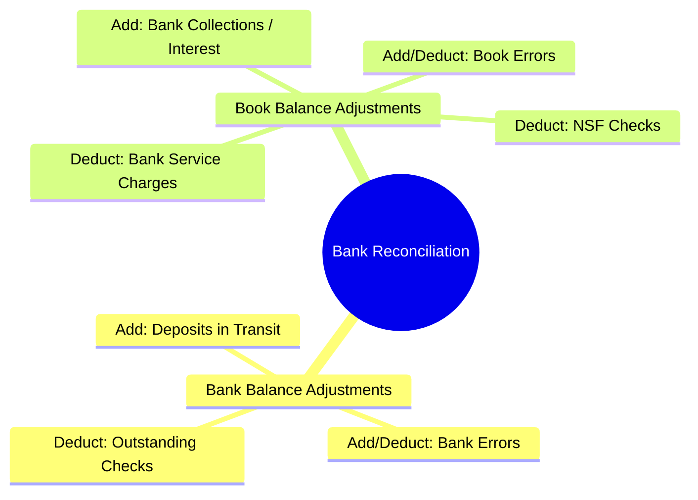
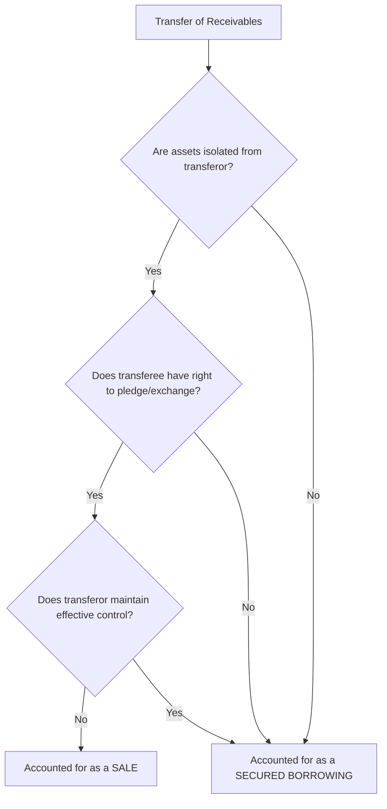

# Accounting for Receivables & Note Discounting

> [!abstract] Curriculum & Syllabus Context
>
> - **Course:** ACC 301 Intermediate Accounting
> - **Phase:** Phase 2: Asset Valuation & Cost Allocation
> - **Target Reading:** Weygandt, Kieso, and Warfield, *Intermediate Accounting*, 18th Edition — **Chapter 6: Cash and Receivables**
> - **Syllabus Focus:** Cash and cash equivalents, bank reconciliations, trade discounts, gross vs. net cash discount methods, CECL allowance method vs. direct write-off, notes receivable discounting with banks, and transfers/factoring of receivables (ASC 860).

---

### Section 1: Cash, Cash Equivalents, and Cash Controls
#### 1.1 Definitions and Classification Criteria
> [!info] Key Definition
>
> In corporate accounting, **Cash** represents the most liquid asset and serves as the standard medium of exchange and measurement basis for financial statements. To be classified as cash on the Balance Sheet, an item must be readily available for the payment of current obligations and free from contractual restrictions.

* **Cash Items**:
  * Coins, currency, and petty cash funds.
  * Demand deposits at financial institutions (checking, savings, and money market accounts with check-writing privileges).
  * Negotiable instruments: Certified checks, cashier's checks, personal checks, bank drafts, and money orders.
* **Cash Equivalents**:
  * Short-term, highly liquid investments that are (1) readily convertible to known amounts of cash, and (2) so near maturity ($\le 90$ days from date of purchase) that they present insignificant risk of changes in value due to interest rate fluctuations.
  * *Examples*: Treasury bills, commercial paper, certificates of deposit (CDs $\le 3$ months), and money market funds.

> [!warning] Exam Pitfall / Exception
>
> **Excluded & Reclassified Items**:
> * *Postdated Checks & I.O.U.s*: Classified as **Receivables**.
> * *Travel Advances*: Classified as **Receivables** (if collectable from employee) or **Prepaid Expenses**.
> * *Postage Stamps on Hand*: Classified as **Office Supplies Inventory** or **Prepaid Expenses**.
> * *Restricted Cash*: Separated from cash if material. Classified as a **Current Asset** if held for current operations/debt maturity, or as a **Noncurrent Asset** (Investments/Other Assets) if restricted for long-term purposes (e.g., plant expansion, bond sinking fund).
> * *Compensating Balances*: Minimum balance required by a bank against borrowing arrangements.
> * *Bank Overdrafts*: Occur when checks are written for more than the bank account balance. Reported under **Current Liabilities** as Accounts Payable. *Exception*: Right of offset exists when multiple accounts are held at the **same** financial institution.

---
#### 1.2 Bank Reconciliation Mechanics (Appendix 6A)
A bank reconciliation is a control schedule explaining the difference between the bank statement balance and the company’s general ledger book balance. Both sections are adjusted to arrive at the **Correct Cash Balance** (the true cash amount reported on the Balance Sheet).

> **Note**: Only items modifying the **Book Balance** require adjusting journal entries in the general ledger.

---
#### 1.3 Numerical Walkthrough 1: Bank Reconciliation & Adjusting Entries
> [!example] Numerical Problem: Bank Reconciliation
>
> **Scenario**: On October 31, 2025, Apex Corp. shows a general ledger Cash balance of $\$24,150$. The bank statement on the same date indicates a balance of $\$29,480$. Audit analysis reveals:
> 1. Deposit in transit on October 31: $\$4,200$.
> 2. Outstanding checks as of October 31: $\$6,800$.
> 3. Bank collected a $\$3,000$ non-interest-bearing note receivable for Apex, charging a $\$30$ collection fee.
> 4. Bank service charge for October: $\$50$.
> 5. Customer check from J. Doe for $\$480$ was returned marked NSF.
> 6. Check No. 842 for office supplies was recorded in the book as $\$890$ but correctly drawn and paid by the bank as $\$980$ (overstated expense by bookkeeper $\implies$ check written for $\$980$, recorded as $\$890$, so cash disbursed was understated by $\$90$).
> ##### Step-by-Step Solution & Schedule:
> $$ \begin{array}{lrr}
> \multicolumn{3}{c}{\textbf{Apex Corp. Bank Reconciliation}} \\
> \multicolumn{3}{c}{\textbf{As of October 31, 2025}} \\
> \hline
> \textbf{Balance per Bank Statement} & & \mathbf{\$29,480} \\
> \text{Add: Deposit in Transit} & & 4,200 \\
> \text{Deduct: Outstanding Checks} & & (6,800) \\
> \hline
> \textbf{Correct Cash Balance (Bank)} & & \mathbf{\$26,880} \\
> \hline \hline
> \textbf{Balance per Books} & & \mathbf{\$24,150} \\
> \text{Add: Note Collected by Bank (Net of \$30 fee: \$3,000 - \$30)} & \$2,970 & \\
> \text{Deduct: Bank Service Charge} & (50) & \\
> \text{Deduct: NSF Check (J. Doe)} & (480) & \\
> \text{Deduct: Book Error on Check No. 842 (\$980 - \$890)} & (90) & 2,350 \\
> \hline
> \textbf{Correct Cash Balance (Books)} & & \mathbf{\$26,880} \\
> \hline \hline
> \end{array} $$
> ##### Adjusting Journal Entries (October 31, 2025):
> $$ \begin{array}{llrr}
> \text{Date} & \text{Account Titles and Explanation} & \text{Debit (\$)} & \text{Credit (\$)} \\
> \hline
> \text{(1)} & \text{Cash} & 2,970 & \\
> & \text{Miscellaneous Expense (Collection Fee)} & 30 & \\
> & \quad \text{Notes Receivable} & & 3,000 \\
> \hline
> \text{(2)} & \text{Office Expense (Bank Charges)} & 50 & \\
> & \quad \text{Cash} & & 50 \\
> \hline
> \text{(3)} & \text{Accounts Receivable (J. Doe)} & 480 & \\
> & \quad \text{Cash} & & 480 \\
> \hline
> \text{(4)} & \text{Supplies Expense} & 90 & \\
> & \quad \text{Cash} & & 90 \\
> \end{array} $$

---
### Section 2: Recognition & Measurement of Accounts Receivable
#### 2.1 Classification and Transaction Price
Receivables are claims held against customers and others for money, goods, or services.
* **Trade Receivables**: Arise from credit sales of primary goods/services. Subclassified into:
  * *Accounts Receivable*: Oral promises to pay, typically short-term (30–60 days).
  * *Notes Receivable*: Formal written promises to pay a specific sum on a designated date.
* **Nontrade Receivables**: Arise from non-operational transactions (e.g., advances to officers/employees, tax refund claims, insurance claims, dividends/interest receivable). Reported separately on the Balance Sheet.

Under **ASC 606**, Accounts Receivable are recognized when performance obligations are satisfied and control transfers to the customer. Measurement is based on the **Transaction Price** (expected consideration).

---
#### 2.2 Trade Discounts vs. Cash Discounts (Gross vs. Net Method)
* **Trade Discounts**: Reductions from list price offered to trade customers. They are **never recorded** in the accounting records; sales are recognized net of trade discounts.
* **Cash Discounts (Sales Discounts)**: Inducements for prompt payment (e.g., $2/10, n/30$).
##### Theoretical Trade-Off:
* **Gross Method**: Records receivables and sales at invoice price. If discount is taken, it is debited to `Sales Discounts` (contra-revenue). It is simpler but fails to state receivables at net realizable value on sale date.
* **Net Method**: Records receivables and sales at invoice price minus cash discount. If customer fails to pay within discount period, the lost discount is credited to `Sales Discounts Forfeited` (other revenue/financing gain). **Theoretically superior** because it states receivables at net realizable value and measures management's financing earnings when credit is extended beyond the discount window.

> [!quote] Formula & Derivation: Annualized Interest Rate of Cash Discount
>
> For terms $d/t_d, n/t_n$ (e.g., $2/10, n/30$):
> $$ r_{\text{annual}} = \frac{d}{1 - d} \times \frac{365}{t_n - t_d} $$
> $$ \text{For } 2/10, n/30: \quad r_{\text{annual}} = \frac{0.02}{0.98} \times \frac{365}{30 - 10} = 2.0408\% \times 18.25 = \mathbf{37.245\%} $$

##### Comparative Journal Entry Table: Gross vs. Net Method
$$ \begin{array}{lllrr}
\textbf{Transaction} & \textbf{Method} & \textbf{Account Titles} & \textbf{Debit (\$)} & \textbf{Credit (\$)} \\
\hline
\text{Sale of \$10,000,} & \textbf{Gross} & \text{Accounts Receivable} & 10,000 & \\
\text{terms } 2/10, n/30 & & \quad \text{Sales Revenue} & & 10,000 \\
\cline{2-5}
& \textbf{Net} & \text{Accounts Receivable} & 9,800 & \\
& & \quad \text{Sales Revenue} & & 9,800 \\
\hline
\text{Payment of \$4,000} & \textbf{Gross} & \text{Cash} & 3,920 & \\
\text{received within 10 days} & & \text{Sales Discounts} & 80 & \\
& & \quad \text{Accounts Receivable} & & 4,000 \\
\cline{2-5}
& \textbf{Net} & \text{Cash} & 3,920 & \\
& & \quad \text{Accounts Receivable} & & 3,920 \\
\hline
\text{Payment of \$6,000} & \textbf{Gross} & \text{Cash} & 6,000 & \\
\text{received after 10 days} & & \quad \text{Accounts Receivable} & & 6,000 \\
\cline{2-5}
& \textbf{Net} & \text{Cash} & 6,000 & \\
& & \quad \text{Accounts Receivable} & & 5,880 \\
& & \quad \text{Sales Discounts Forfeited} & & 120 \\
\hline \hline
\end{array} $$

---
#### 2.3 Sales Returns and Allowances
Under ASC 606, right of return is variable consideration. At the time of sale, revenue is recorded only for consideration expected to be retained. At period-end, an adjusting entry estimates expected returns:

$$ \begin{array}{llrr}
\text{Account Titles} & & \text{Debit (\$)} & \text{Credit (\$)} \\
\hline
\text{Sales Returns and Allowances (Contra-Revenue)} & & \text{XXX} & \\
\quad \text{Refund Liability (Current Liability)} & & & \text{XXX} \\
\\
\text{Estimated Inventory Returns (Asset)} & & \text{XXX} & \\
\quad \text{Cost of Goods Sold} & & & \text{XXX} \\
\end{array} $$

---
### Section 3: Valuation of Accounts Receivable & Uncollectible Accounts
#### 3.1 Direct Write-Off Method vs. Allowance Method

| Feature | Direct Write-Off Method (Non-GAAP) | Allowance Method (GAAP) |
| :--- | :--- | :--- |
| **Timing of Expense** | Recorded when a specific account is deemed uncollectible. | Estimated and recorded at the end of each reporting period. |
| **Matching Principle** | Violates matching; expense is recognized in a later period than revenue. | Adheres to matching; matches expected bad debts to period of sale. |
| **Balance Sheet Valuation** | Receivables reported at gross face amount (overstated). | Receivables reported at Net Realizable Value ($\text{NRV} = \text{Gross A/R} - \text{Allowance}$). |
| **GAAP Permissibility** | Not allowed, unless uncollectible amounts are immaterial. | Mandatory under GAAP whenever bad debts are material. |

---
#### 3.2 Current Expected Credit Loss (CECL) Model & Aging of Receivables
GAAP requires the **Current Expected Credit Loss (CECL)** model. Companies must estimate expected credit losses over the full contractual life of receivables, considering historical loss rates, current economic conditions, and reasonable forward-looking forecasts.

> [!quote] Formula & Derivation: CECL Aging Schedule
>
> The **Percentage-of-Receivables (Aging Schedule)** approach categorizes trade accounts by age. Higher uncollectibility percentages are assigned to older age brackets:
> $$ \text{Target Allowance Balance} = \sum \left( \text{Gross A/R in Age Bracket}_k \times \text{Loss Percentage}_k \right) $$
> $$ \text{Bad Debt Expense Entry Amount} = \text{Target Allowance Balance} - \text{Unadjusted Credit Balance (or } + \text{Debit Balance)} $$

#### 3.3 Mechanics of Bad Debt Accounting
1. **Adjusting Entry for Estimated Bad Debts**:
   Debit `Bad Debt Expense`; Credit `Allowance for Doubtful Accounts`.
2. **Write-off of a Specific Customer Account**:
   Debit `Allowance for Doubtful Accounts`; Credit `Accounts Receivable (Customer)`.
   *Impact*: Gross A/R decreases, Allowance decreases by equal amount $\implies$ **Net Realizable Value remains unchanged**.
3. **Recovery of an Account Previously Written Off**:
   * *Step 1: Reinstatement*: Debit `Accounts Receivable`, Credit `Allowance for Doubtful Accounts`.
   * *Step 2: Collection*: Debit `Cash`, Credit `Accounts Receivable`.

---
#### 3.4 Numerical Walkthrough 2: Aging Schedule, Adjustments, Write-Off, and Recovery
> [!example] Numerical Problem: CECL Bad Debt Adjustments
>
> **Scenario**: Vertex Corp. has a Gross Accounts Receivable balance of $\$400,000$ at December 31, 2025. The unadjusted balance in `Allowance for Doubtful Accounts` is a $\$3,000$ **credit**.
> The company prepares the following Aging Schedule:
> $$ \begin{array}{lrcr}
> \textbf{Age Category} & \textbf{Gross Balance (\$)} & \textbf{Estimated Loss \%} & \textbf{Required Allowance (\$)} \\
> \hline
> \text{Under 30 days} & 220,000 & 1.5\% & 3,300 \\
> \text{31--60 days} & 100,000 & 4.0\% & 4,000 \\
> \text{61--90 days} & 50,000 & 10.0\% & 5,000 \\
> \text{Over 90 days} & 30,000 & 25.0\% & 7,500 \\
> \hline
> \textbf{Total} & \mathbf{\$400,000} & & \mathbf{\$19,800} \\
> \hline \hline
> \end{array} $$
> ##### Required Calculations:
> 1. Target Allowance = $\$19,800$.
> 2. Unadjusted Allowance Balance = $\$3,000$ Credit.
> 3. Bad Debt Expense = $\$19,800 - \$3,000 = \$16,800$.
> ##### Journal Entries:
> $$ \begin{array}{llrr}
> \text{Date} & \text{Account Titles and Explanation} & \text{Debit (\$)} & \text{Credit (\$)} \\
> \hline
> \text{Dec 31, 2025} & \text{Bad Debt Expense} & 16,800 & \\
> \text{(Year-End Adj)} & \quad \text{Allowance for Doubtful Accounts} & & 16,800 \\
> \hline
> \text{Feb 14, 2026} & \text{Allowance for Doubtful Accounts} & 2,500 & \\
> \text{(Write-off Vance)} & \quad \text{Accounts Receivable (Vance Co.)} & & 2,500 \\
> \hline
> \text{Nov 10, 2026} & \textbf{(a) Reinstate Receivable:} & & \\
> \text{(Recovery Vance)} & \text{Accounts Receivable (Vance Co.)} & 1,500 & \\
> & \quad \text{Allowance for Doubtful Accounts} & & 1,500 \\
> & \textbf{(b) Record Collection:} & & \\
> & \text{Cash} & 1,500 & \\
> & \quad \text{Accounts Receivable (Vance Co.)} & & 1,500 \\
> \end{array} $$
> *Balance Sheet Presentation (Dec 31, 2025)*:
> $$ \begin{array}{lr}
> \text{Accounts Receivable, Gross} & \$400,000 \\
> \text{Less: Allowance for Doubtful Accounts} & (19,800) \\
> \hline
> \text{Net Realizable Value} & \mathbf{\$380,200} \\
> \end{array} $$

---
### Section 4: Recognition, Valuation, and Discounting of Notes Receivable
#### 4.1 Fundamentals & Key Variables
> [!info] Key Definition
>
> A **Notes Receivable** is a written contractual promise (promissory note) specifying a maturity date, a principal (face amount), and a stated interest rate.

* **Stated Rate ($r_{\text{stated}}$)**: Face rate specified in the note contract. Determines cash interest paid.
* **Market / Effective Rate ($i$)**: Effective yield required by the market for debt instruments of similar risk. Used as the discount rate for Present Value calculations.
* **Zero-Interest-Bearing Notes**: Stated rate is $0\%$. Interest is implicitly embedded in the difference between the cash advanced/fair value and the maturity value.

---
#### 4.2 Mathematical Formulas for Notes Receivable
> [!quote] Formula & Derivation: Note Valuation & Amortization
>
> **Single-Sum Present Value (for Principal):**
> $$ \text{PV} = \text{Face Value} \times \frac{1}{(1+i)^n} $$
> **Ordinary Annuity Present Value (for Interest Streams):**
> $$ \text{PV-OA} = \text{PMT} \times \left[\frac{1 - (1+i)^{-n}}{i}\right] \quad \text{where } \text{PMT} = \text{Face Value} \times r_{\text{stated}} \times t $$
> **Amortization Dynamics (Effective-Interest Method):**
> $$ \text{Interest Revenue}_t = \text{Carrying Amount}_{t-1} \times i $$
> $$ \text{Cash Interest}_t = \text{Face Value} \times r_{\text{stated}} $$
> $$ \text{Discount Amortized}_t = \text{Interest Revenue}_t - \text{Cash Interest}_t $$
> $$ \text{Carrying Amount}_t = \text{Carrying Amount}_{t-1} + \text{Discount Amortized}_t $$

---
#### 4.3 Discounting Notes Receivable at a Bank
When a payee transfers an interest-bearing or non-interest-bearing note to a bank before maturity to raise immediate cash:

> [!quote] Formula & Derivation: Step-by-Step Discounting Equations
>
> 1. **Calculate Maturity Value (MV)**:
>    $$ \text{MV} = \text{Face Value} + \text{Total Interest to Maturity} $$
>    $$ \text{Total Interest} = \text{Face Value} \times r_{\text{stated}} \times \frac{\text{Note Term (Months)}}{12} $$
> 2. **Calculate Bank Discount Amount**:
>    $$ \text{Bank Discount} = \text{MV} \times d_{\text{bank}} \times \frac{\text{Discount Period (Months)}}{12} $$
>    $$ \text{Discount Period} = \text{Note Term} - \text{Time Held by Payee} $$
> 3. **Calculate Net Proceeds**:
>    $$ \text{Net Proceeds} = \text{MV} - \text{Bank Discount} $$
> 4. **Determine Gain or Loss / Interest Adjustment**:
>    $$ \text{Carrying Amount of Note} = \text{Face Value} + \text{Accrued Interest to Discount Date} $$
>    $$ \text{Gain (or Net Interest Revenue)} = \text{Net Proceeds} - \text{Carrying Amount} $$

---
#### 4.4 Numerical Walkthrough 3: Zero-Interest Note Amortization & Bank Discounting
> [!example] Part A: Zero-Interest-Bearing Note Amortization
>
> **Scenario**: On January 1, 2025, Horizon Corp. accepts a 3-year, $\$50,000$ zero-interest-bearing note in exchange for land with a fair value of $\$35,589$. The implicit market rate is $12\%$ ($12\%$ compounded annually: $\$50,000 \times 0.71178 = \$35,589$).
> **Amortization Schedule (Effective-Interest Method)**:
> $$ \begin{array}{|c|r|r|r|r|}
> \hline
> \textbf{Date} & \textbf{Cash Interest (\$)} & \textbf{Interest Revenue (\$)} & \textbf{Discount Amortized (\$)} & \textbf{Carrying Amount (\$)} \\
> \hline
> 1/1/2025 & - & - & - & 35,589.00 \\
> 12/31/2025 & 0.00 & 4,270.68 & 4,270.68 & 39,859.68 \\
> 12/31/2026 & 0.00 & 4,783.16 & 4,783.16 & 44,642.84 \\
> 12/31/2027 & 0.00 & 5,357.16 & 5,357.16 & 50,000.00 \\
> \hline
> \textbf{Total} & \mathbf{\$0.00} & \mathbf{\$14,411.00} & \mathbf{\$14,411.00} & \\
> \hline
> \end{array} $$
> *(Note: Year 3 interest revenue includes $\$0.02$ rounding adjustment).*
> **Journal Entries (Horizon Corp.)**:
> $$ \begin{array}{llrr}
> \text{Date} & \text{Account Titles} & \text{Debit (\$)} & \text{Credit (\$)} \\
> \hline
> \text{Jan 1, 2025} & \text{Notes Receivable} & 50,000.00 & \\
> & \quad \text{Discount on Notes Receivable} & & 14,411.00 \\
> & \quad \text{Land (or Sales Revenue)} & & 35,589.00 \\
> \hline
> \text{Dec 31, 2025} & \text{Discount on Notes Receivable} & 4,270.68 & \\
> & \quad \text{Interest Revenue} & & 4,270.68 \\
> \hline
> \text{Dec 31, 2027} & \text{Discount on Notes Receivable} & 5,357.16 & \\
> & \quad \text{Interest Revenue} & & 5,357.16 \\
> & \text{Cash} & 50,000.00 & \\
> & \quad \text{Notes Receivable} & & 50,000.00 \\
> \end{array} $$

> [!example] Part B: Discounting an Interest-Bearing Note at Bank
>
> **Scenario**: On April 1, 2025, Beacon Co. received a $\$60,000$, 6-month, $8\%$ interest-bearing note from a customer. On July 1, 2025 (after holding it for 3 months), Beacon discounts the note at City Bank at a bank discount rate of $10\%$.
> **Step-by-Step Discounting Calculations:**
> 1. **Maturity Value (MV)**:
>    $$ \text{Interest} = \$60,000 \times 0.08 \times \frac{6}{12} = \$2,400 \implies \text{MV} = \$60,000 + \$2,400 = \$62,400 $$
> 2. **Discount Period**: $6 \text{ months} - 3 \text{ months} = 3 \text{ months}$
> 3. **Bank Discount**:
>    $$ \text{Bank Discount} = \$62,400 \times 0.10 \times \frac{3}{12} = \$1,560 $$
> 4. **Net Proceeds**:
>    $$ \text{Net Proceeds} = \$62,400 - \$1,560 = \mathbf{\$60,840} $$
> 5. **Carrying Amount at Discount Date (July 1, 2025)**:
>    $$ \text{Accrued Interest (3 months)} = \$60,000 \times 0.08 \times \frac{3}{12} = \$1,200 \implies \text{Carrying Amount} = \$61,200 $$
> 6. **Net Interest Revenue / Loss on Discounting**:
>    $$ \text{Proceeds } (\$60,840) - \text{Carrying Amount } (\$61,200) = \mathbf{-\$360 \text{ (Interest Expense / Loss)}} $$
> **Journal Entry on Discount Date (July 1, 2025)**:
> $$ \begin{array}{llrr}
> \text{Account Titles} & & \text{Debit (\$)} & \text{Credit (\$)} \\
> \hline
> \text{Cash} & & 60,840 & \\
> \text{Interest Expense (or Loss on Discounting)} & & 360 & \\
> \quad \text{Notes Receivable} & & & 60,000 \\
> \quad \text{Interest Revenue (3 months accrued)} & & & 1,200 \\
> \end{array} $$

---
### Section 5: Disposition & Transfer of Receivables
#### 5.1 Secured Borrowing vs. Sale of Receivables (ASC 860)

To accelerate cash flow, companies assign, pledge, or factor receivables. Under **ASC 860**, a transfer of receivables is accounted for as a **Sale** only if all three conditions are satisfied:
1. **Transferred assets are isolated** from the transferor and its creditors.
2. **Transferee (Factor) has the right to pledge or exchange** the transferred assets.
3. **Transferor does not maintain effective control** over the transferred assets (e.g., no agreement to repurchase before maturity).

If any condition is not met, the transfer is accounted for as a **Secured Borrowing** (Pledging/Assignment).

---
#### 5.2 Mechanics of Factoring Transactions
* **Sale Without Recourse**: The factor assumes all credit risk and absorbs all bad debt losses. The seller recognizes an outright sale, derecognizes receivables, records cash proceeds, records a factor holdback (`Receivable from Factor`) for sales returns/allowances, and records a `Loss on Sale of Receivables`.
* **Sale With Recourse**: The seller guarantees payment to the factor for uncollectible accounts. The seller uses the **Financial Component Approach**:
  * A `Recourse Liability` is recorded at fair value for expected credit guarantee payments.
  * The loss on sale increases by the amount of the recourse liability.

> [!quote] Formula & Derivation: Structural Formulas for Factoring
>
> $$ \text{Net Proceeds (Cash Received)} = \text{Gross A/R} - \text{Finance Fee} - \text{Factor Holdback (Retention)} $$
> $$ \text{Receivable from Factor} = \text{Gross A/R} \times \text{Retention \%} $$
> $$ \text{Loss on Sale (Without Recourse)} = \text{Finance Fee} $$
> $$ \text{Loss on Sale (With Recourse)} = \text{Finance Fee} + \text{Fair Value of Recourse Liability} $$

---
#### 5.3 Numerical Walkthrough 4: Factoring With and Without Recourse
> [!example] Numerical Problem: Factoring Receivables
>
> **Scenario**: Crestview Corp. factors $\$300,000$ of accounts receivable to First Factors Inc. The factor assesses a $3\%$ finance fee and retains $5\%$ for customer sales returns and allowances.
> * *Case A*: Factored **Without Recourse**.
> * *Case B*: Factored **With Recourse**. Crestview estimates the fair value of the recourse liability to be $\$7,000$.
> **Base Calculations:**
> * Gross Accounts Receivable = $\$300,000$
> * Finance Fee ($3\%$ of $\$300,000$) = $\$9,000$
> * Factor Retention / Holdback ($5\%$ of $\$300,000$) = $\$15,000$
> * Net Cash Proceeds = $\$300,000 - \$9,000 - \$15,000 = \$276,000$
> **Loss Computations:**
> * *Case A (Without Recourse)*: Loss = $\$9,000$
> * *Case B (With Recourse)*: Loss = $\$9,000 + \$7,000 (\text{Recourse Liability}) = \$16,000$
> ##### Crestview Corp. (Seller) Journal Entries Comparison:
> $$ \begin{array}{llrr}
> \textbf{Case A: Without Recourse} & & \textbf{Debit (\$)} & \textbf{Credit (\$)} \\
> \hline
> \text{Cash} & & 276,000 & \\
> \text{Receivable from Factor} & & 15,000 & \\
> \text{Loss on Sale of Receivables} & & 9,000 & \\
> \quad \text{Accounts Receivable} & & & 300,000 \\
> \\
> \textbf{Case B: With Recourse} & & \textbf{Debit (\$)} & \textbf{Credit (\$)} \\
> \hline
> \text{Cash} & & 276,000 & \\
> \text{Receivable from Factor} & & 15,000 & \\
> \text{Loss on Sale of Receivables} & & 16,000 & \\
> \quad \text{Accounts Receivable} & & & 300,000 \\
> \quad \text{Recourse Liability} & & & 7,000 \\
> \end{array} $$

---
### Section 6: Comprehensive Review & Formulas Summary

| Concept / Metric                      | Formula / Mechanics                                                                                                                            |
| :------------------------------------ | :--------------------------------------------------------------------------------------------------------------------------------------------- |
| **Net Realizable Value (NRV)**        | $\text{NRV} = \text{Gross Accounts Receivable} - \text{Allowance for Doubtful Accounts}$                                                       |
| **Annualized Cash Discount Rate**     | $r_{\text{annual}} = \frac{\text{Discount \%}}{1 - \text{Discount \%}} \times \frac{365}{\text{Credit Days} - \text{Discount Days}}$           |
| **Present Value of Single Sum**       | $\text{PV} = \text{FV} \times (1 + i)^{-n}$                                                                                                    |
| **Present Value of Ordinary Annuity** | $\text{PV-OA} = \text{PMT} \times \left[\frac{1 - (1+i)^{-n}}{i}\right]$                                                                       |
| **Effective-Interest Revenue**        | $\text{Interest Revenue}_t = \text{Carrying Amount}_{t-1} \times i$                                                                            |
| **Bank Discount Proceeds**            | $\text{Proceeds} = \text{Maturity Value} - \left(\text{Maturity Value} \times d_{\text{bank}} \times \frac{\text{Discount Months}}{12}\right)$ |
| **Accounts Receivable Turnover**      | $\text{A/R Turnover} = \frac{\text{Net Credit Sales}}{\text{Average Net Accounts Receivable}}$                                                 |
| **Average Collection Period**         | $\text{Days Outstanding} = \frac{365}{\text{Accounts Receivable Turnover}}$                                                                    |
