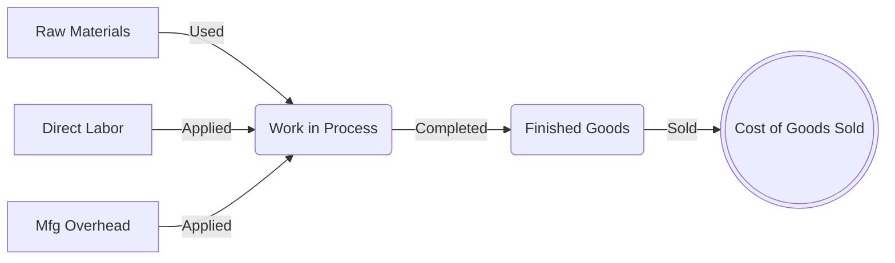

# Inventory Costing & Estimation

> [!abstract] Curriculum & Syllabus Context
>
> - **Course:** ACC 301 Intermediate Accounting
> - **Phase:** Phase 2: Asset Valuation & Cost Allocation
> - **Target Reading:** Weygandt, Kieso, and Warfield, *Intermediate Accounting*, 18th Edition — **Chapter 7 & Chapter 8: Inventories** (including IAS 2)
> - **Syllabus Focus:** Perpetual vs. periodic inventory systems, goods in transit and consignment, FIFO, LIFO, average cost, LIFO reserve and liquidations, dollar-value LIFO, inventory errors, LCNRV, LCM (ceiling/floor), purchase commitments, gross profit method, and retail inventory methods.

---

### Section 1: Overview, Inventory Classifications, and Control Systems
#### 1.1 Definition and Nature of Inventory
> [!info] Key Definition
>
> **Inventories** are asset items held for sale in the ordinary course of business, or goods that will be used or consumed in the production of goods to be sold. Inventory is frequently the largest current asset reported on the balance sheet for merchandising and manufacturing enterprises.

---
#### 1.2 Inventory Classifications: Merchandising vs. Manufacturing
1. **Merchandising Company**:
   - Purchases goods in a form ready for sale.
   - Requires a single balance sheet inventory account: **Merchandise Inventory** (or simply **Inventory**).
2. **Manufacturing Company**:
   - Produces goods for sale to merchandising concerns or end consumers.
   - Uses three primary inventory accounts:
     - **Raw Materials Inventory**: The cost of raw materials and components on hand that have been acquired but not yet placed into production.
     - **Work in Process (WIP) Inventory**: The cost of partially completed goods. Includes the cost of raw materials placed into production, direct labor applied specifically to those materials, and a ratable allocation of manufacturing overhead costs.
     - **Finished Goods Inventory**: The completed but unsold units on hand at the end of the fiscal period.
     - *Manufacturing/Factory Supplies Inventory*: Secondary materials (e.g., machine oils, cleaning solvents, fasteners) consumed during production but not directly incorporated as primary raw materials.

---
#### 1.3 Physical Cost Flow in Manufacturing
The flow of costs through a manufacturing accounting system follows a strict physical and financial sequence:

---
#### 1.4 Inventory Accounting Systems: Perpetual vs. Periodic
1. **Perpetual Inventory System**:
   - Continuously records changes in the `Inventory` account as transactions occur.
   - Purchases of goods or raw materials are debited directly to `Inventory`.
   - Freight-in is debited to `Inventory`; purchase returns, allowances, and discounts are credited directly to `Inventory`.
   - Cost of Goods Sold ($COGS$) is recognized simultaneously with each sale by debiting `Cost of Goods Sold` and crediting `Inventory`.
   - Maintains a subsidiary ledger of individual inventory items as a physical and dollar control mechanism.
   - An annual physical count is conducted to verify ledger accuracy and record shortages or overages via the `Inventory Over and Short` account.
2. **Periodic Inventory System**:
   - Determines ending inventory quantity and cost strictly at periodic intervals via a physical count ("taking a physical inventory").
   - Purchases are debited to a temporary nominal account, `Purchases`. Freight-in, purchase discounts, and purchase returns are recorded in separate temporary accounts (`Freight-In`, `Purchase Discounts`, `Purchase Returns and Allowances`).
   - $COGS$ is a residual computation determined at the end of the period using the Cost of Goods Sold Formula.

> [!quote] Formula & Derivation: Periodic COGS
>
> $$ \text{Cost of Goods Available for Sale} = \text{Beginning Inventory} + \text{Net Purchases} $$
> $$ \text{Net Purchases} = \text{Gross Purchases} + \text{Freight-In} - \text{Purchase Returns and Allowances} - \text{Purchase Discounts} $$
> $$ \text{Cost of Goods Sold} = \text{Cost of Goods Available for Sale} - \text{Ending Inventory (per Physical Count)} $$

---
#### 1.5 Comparative Journal Entry Analysis: Perpetual vs. Periodic
> [!example] Numerical Problem: Perpetual vs. Periodic Journal Entries
>
> **Scenario**:
> - **Beginning Inventory**: 100 units @ $\$10.00 = \$1,000$.
> - **Transaction 1**: Purchased 900 units @ $\$10.00 = \$9,000$ on account, terms $2/10, n/30$.
> - **Transaction 2**: Paid freight charges of $\$200$ in cash.
> - **Transaction 3**: Returned 50 defective units to supplier for full credit ($\$500$).
> - **Transaction 4**: Sold 600 units @ $\$20.00 = \$12,000$ on account.
> - **Transaction 5**: Paid for the purchase within the discount period.
> - **Transaction 6**: Physical count at year-end shows 340 units on hand (expected $100 + 900 - 50 - 600 = 350$ units; 10 units missing/stolen).
> $$ \begin{array}{lllrr}
> \textbf{Transaction} & \textbf{System} & \textbf{Account Titles} & \textbf{Debit (\$)} & \textbf{Credit (\$)} \\
> \hline
> \text{1. Purchase} & \textbf{Perpetual} & \text{Inventory} & 9,000 & \\
> & & \quad \text{Accounts Payable} & & 9,000 \\
> \cline{2-5}
> & \textbf{Periodic} & \text{Purchases} & 9,000 & \\
> & & \quad \text{Accounts Payable} & & 9,000 \\
> \hline
> \text{2. Freight-in} & \textbf{Perpetual} & \text{Inventory} & 200 & \\
> & & \quad \text{Cash} & & 200 \\
> \cline{2-5}
> & \textbf{Periodic} & \text{Freight-In} & 200 & \\
> & & \quad \text{Cash} & & 200 \\
> \hline
> \text{3. Returns} & \textbf{Perpetual} & \text{Accounts Payable} & 500 & \\
> & & \quad \text{Inventory} & & 500 \\
> \cline{2-5}
> & \textbf{Periodic} & \text{Accounts Payable} & 500 & \\
> & & \quad \text{Purchase Returns \& Allowances} & & 500 \\
> \hline
> \text{4. Sales} & \textbf{Perpetual} & \text{Accounts Receivable} & 12,000 & \\
> & & \quad \text{Sales Revenue} & & 12,000 \\
> & & \text{Cost of Goods Sold} & 6,000 & \\
> & & \quad \text{Inventory} & & 6,000 \\
> \cline{2-5}
> & \textbf{Periodic} & \text{Accounts Receivable} & 12,000 & \\
> & & \quad \text{Sales Revenue} & & 12,000 \\
> & & \quad \textit{(No COGS entry at point of sale)} & & \\
> \hline
> \text{5. Payment} & \textbf{Perpetual} & \text{Accounts Payable} & 8,500 & \\
> & & \quad \text{Inventory } (\$8,500 \times 0.02) & & 170 \\
> & & \quad \text{Cash} & & 8,330 \\
> \cline{2-5}
> & \textbf{Periodic} & \text{Accounts Payable} & 8,500 & \\
> & & \quad \text{Purchase Discounts } (\$8,500 \times 0.02) & & 170 \\
> & & \quad \text{Cash} & & 8,330 \\
> \hline
> \text{6. Year-End} & \textbf{Perpetual} & \text{Inventory Over \& Short} & 100 & \\
> \text{Adjustment} & & \quad \text{Inventory} & & 100 \\
> \cline{2-5}
> & \textbf{Periodic} & \text{Inventory (Ending)} & 3,400 & \\
> & & \text{Cost of Goods Sold (Plug)} & 6,130 & \\
> & & \text{Purchase Returns \& Allowances} & 500 & \\
> & & \text{Purchase Discounts} & 170 & \\
> & & \quad \text{Inventory (Beginning)} & & 1,000 \\
> & & \quad \text{Purchases} & & 9,000 \\
> & & \quad \text{Freight-In} & & 200 \\
> \hline \hline
> \end{array} $$

---
### Section 2: Goods and Costs Included in Inventory

---
#### 2.1 Goods Included in Inventory (Ownership Determination)
A business includes in inventory all goods to which it holds legal title and controls the future economic benefits, regardless of physical location.
1. **Goods in Transit**:
   - **FOB Shipping Point**: Title passes to the buyer when the supplier delivers the goods to the common carrier. The buyer owns the goods while in transit and must include them in ending inventory and accounts payable.
   - **FOB Destination**: Title passes to the buyer only when the common carrier delivers the goods to the buyer's premises. The seller owns the goods while in transit and includes them in its inventory.
2. **Consigned Goods**:
   - Under a consignment arrangement, the **consignor** (owner/manufacturer) ships goods to the **consignee** (dealer/agent) who accepts physical possession to sell the goods for a commission.
   - Legal title and control remain with the consignor. Consigned goods are included in the consignor's inventory at cost plus freight/handling incurred in shipping to the consignee.
   - The consignee makes no entry to its asset accounts for consigned goods received and must exclude them entirely from its physical inventory count.

> [!warning] Exam Pitfall / Exception
>
> **Special Sales Agreements**:
> - **Sales with Right of Return**: When a seller grants buyers a right of return, the seller recognizes revenue only for the net consideration expected to be received. It records a `Refund Liability` for expected returns and an asset account `Estimated Inventory Returns` to reflect inventory expected to be returned.
> - **Repurchase Agreements ("Parking Transactions")**: Arrangements where a company "sells" inventory to a third party but agrees to repurchase the inventory at a set price covering all acquisition and holding costs. The transfer of control is not met; the transaction is accounted for as a **secured borrowing**. The inventory remains on the transferor's balance sheet.
> - **Bill-and-Hold Arrangements**: A contract under which a seller bills a customer for a product but retains physical possession until a future delivery date. Revenue is recognized at billing *only if* the reason is substantive, the product is identified separately, ready for transfer, and cannot be used by the seller.

---
#### 2.2 Inventoriable Costs: Product Costs vs. Period Costs
1. **Product Costs (Inventoriable Costs)**:
   - Expenditures directly or indirectly incurred in bringing the inventory to the buyer's location and converting it into a salable condition.
   - Included in the inventory asset account on the balance sheet.
   - *Examples*: Invoice purchase price, freight-in charges, import duties, handling/unloading fees, storage/warehousing costs prior to sale (if necessary for production), insurance in transit, direct labor, and allocated manufacturing overhead.
2. **Period Costs**:
   - Expenditures indirectly related to the acquisition or production of goods that are difficult to assign to specific inventory units.
   - Expensed in the period incurred on the income statement.
   - *Examples*: Selling expenses, advertising, general administrative salaries, freight-out (delivery expense to customers), interest costs incurred to finance inventory acquisitions (interest capitalization is prohibited for routinely manufactured inventory under FASB ASC 835-20).

---
#### 2.3 Accounting for Cash Discounts (Purchase Discounts): Gross vs. Net Method
1. **Gross Method**:
   - Records the initial purchase and accounts payable at the full invoice price (gross amount).
   - If paid within the discount period, the discount taken is credited to `Purchase Discounts` (under periodic) or `Inventory` (under perpetual), which acts as a deduction from inventory cost / purchases.
   - If paid after the discount period, accounts payable is cleared at gross with no discount effect.
2. **Net Method**:
   - Records the initial purchase and accounts payable at the net invoice price (invoice price minus available cash discount).
   - If paid within the discount period, accounts payable is cleared at net for cash paid.
   - If paid after the discount period, the missed discount is debited to `Purchase Discounts Lost` (a financial expense reported under "Other Expenses and Losses").
   - *Theoretical Trade-off*: The net method is theoretically superior because it measures inventory at its net realizable value at acquisition and isolates management inefficiency (interest expense caused by failing to take prompt payment discounts). The gross method is widely used in practice due to simplicity and the cost constraint.

---
### Section 3: Inventory Cost Flow Assumptions
When identical inventory units are purchased at varying price levels over an accounting period, an objective cost flow assumption must be selected to allocate cost of goods available for sale between Ending Inventory and Cost of Goods Sold.

---
#### 3.1 Specific Identification
- Tracks the actual physical flow and exact invoice cost of each individual item sold and remaining in inventory.
- Applicable only when handling a small quantity of easily distinguishable, high-unit-cost items (e.g., automobiles, fine jewelry, custom real estate lots, artwork).
- *Theoretical Critique*: Perfectly matches actual costs with actual revenues. However, it allows management to manipulate net income by selectively delivering higher-cost or lower-cost identical lots to customers depending on earnings targets.

---
#### 3.2 First-In, First-Out (FIFO)
- Assumes that goods are consumed or sold in the exact chronological order in which they were acquired.
- The oldest costs are allocated to Cost of Goods Sold; the most recent costs are allocated to Ending Inventory.
- *Key Characteristics*:
  - Ending inventory reflects current replacement cost on the balance sheet.
  - Periodic and perpetual systems produce **identical** ending inventory and COGS balances under FIFO because the first costs in are always the first costs out regardless of when the calculation is performed.
  - In periods of rising prices (inflation): FIFO produces the highest ending inventory, lowest COGS, highest gross profit, highest net income, and highest income tax liability.
  - *Disadvantage*: Matches older historical costs against current inflated sales revenues on the income statement, creating "phantom" or "paper" profits.

---
#### 3.3 Last-In, First-Out (LIFO)
- Assumes that the most recent goods acquired are sold or consumed first.
- The newest costs are allocated to Cost of Goods Sold; the oldest costs (including original base-year layers) remain in Ending Inventory.
- *Key Characteristics*:
  - Excellent matching of current costs against current revenues on the income statement.
  - In periods of rising prices (inflation): LIFO produces the lowest ending inventory, highest COGS, lowest gross profit, lowest net income, and lowest income tax liability (resulting in significant tax-driven cash savings).
  - Periodic and perpetual systems produce **different** results under LIFO because perpetual LIFO applies the cost flow assumption continuously at the exact time of each sale, whereas periodic LIFO applies it to total purchases at the end of the period.
  - *Disadvantages*: Balance sheet inventory is severely understated because it reflects outdated historical costs. Subject to LIFO liquidation distortion.

---
#### 3.4 Average-Cost Method
Prices inventory items on the basis of the average cost of all similar goods available during the period.

> [!quote] Formula & Derivation: Average-Cost Methods
>
> **1. Weighted-Average Method (Periodic System)**:
> $$ \text{Weighted-Average Unit Cost} = \frac{\text{Total Cost of Goods Available for Sale}}{\text{Total Units Available for Sale}} $$
> $$ \text{Ending Inventory} = \text{Ending Units} \times \text{Weighted-Average Unit Cost} $$
> $$ \text{Cost of Goods Sold} = \text{Units Sold} \times \text{Weighted-Average Unit Cost} $$
> **2. Moving-Average Method (Perpetual System)**:
> - Calculates a new average unit cost after **every purchase**.
> - Sales made prior to a new purchase are costed at the moving-average unit cost established by preceding purchases.

---
#### 3.5 Comparative Mathematical Problem Walkthrough
> [!example] Numerical Problem: Cost Flow Assumptions Calculation
>
> **Data:**
> **ZenLife Inc.** had the following inventory transactions during March 2025:
> - **Beginning Inventory (March 1)**: 0 units.
> - **March 2 Purchase**: 2,000 units @ $\$4.00 = \$8,000$
> - **March 15 Purchase**: 6,000 units @ $\$4.40 = \$26,400$
> - **March 19 Sale**: 4,000 units @ $\$7.00$
> - **March 30 Purchase**: 2,000 units @ $\$4.75 = \$9,500$
> - **Total Goods Available for Sale**: 10,000 units = $\$43,900$
> - **Ending Inventory Units**: $10,000 - 4,000 = 6,000$ units.
> ##### 1. FIFO Method (Periodic and Perpetual - Identical)
> - **Ending Inventory (6,000 units)**: Comes from the most recent purchases.
>   - From March 30 Purchase: $2,000 \text{ units} \times \$4.75 = \$9,500$
>   - From March 15 Purchase: $4,000 \text{ units} \times \$4.40 = \$17,600$
>   - **Ending Inventory** = $\$9,500 + \$17,600 = \mathbf{\$27,100}$
> - **Cost of Goods Sold**:
>   - $\text{COGS} = \$43,900 - \$27,100 = \mathbf{\$16,800}$
> ##### 2. Periodic LIFO Method
> - **Ending Inventory (6,000 units)**: Comes from the earliest purchases.
>   - From March 2 Purchase: $2,000 \text{ units} \times \$4.00 = \$8,000$
>   - From March 15 Purchase: $4,000 \text{ units} \times \$4.40 = \$17,600$
>   - **Ending Inventory** = $\$8,000 + \$17,600 = \mathbf{\$25,600}$
> - **Cost of Goods Sold**:
>   - $\text{COGS} = \$43,900 - \$25,600 = \mathbf{\$18,300}$
> ##### 3. Perpetual LIFO Method
> - **March 2**: Balance = 2,000 units @ $\$4.00 = \$8,000$.
> - **March 15**: Balance = 2,000 units @ $\$4.00$ ($\$8,000$) + 6,000 units @ $\$4.40$ ($\$26,400$) = $\$34,400$.
> - **March 19 Sale (4,000 units)**: Taken from most recent purchase available on March 19 (March 15 batch @ $\$4.40$).
>   - $\text{COGS for Sale} = 4,000 \text{ units} \times \$4.40 = \mathbf{\$17,600}$
>   - Remaining Balance = 2,000 units @ $\$4.00$ ($\$8,000$) + 2,000 units @ $\$4.40$ ($\$8,800$) = $\$16,800$.
> - **March 30 Purchase**: Add 2,000 units @ $\$4.75 = \$9,500$.
>   - **Ending Inventory** = 2,000 @ $\$4.00$ ($\$8,000$) + 2,000 @ $\$4.40$ ($\$8,800$) + 2,000 @ $\$4.75$ ($\$9,500$) = $\mathbf{\$26,300}$
> - **Total COGS** = $\mathbf{\$17,600}$.
> ##### 4. Weighted-Average Method (Periodic)
> - $\text{Weighted-Average Unit Cost} = \frac{\$43,900}{10,000 \text{ units}} = \mathbf{\$4.39 \text{ per unit}}$
> - **Ending Inventory** = $6,000 \text{ units} \times \$4.39 = \mathbf{\$26,340}$
> - **Cost of Goods Sold** = $4,000 \text{ units} \times \$4.39 = \mathbf{\$17,560}$
> ##### 5. Moving-Average Method (Perpetual)
> - **March 2**: Balance = 2,000 units @ $\$4.00 = \$8,000$.
> - **March 15**: Added 6,000 units @ $\$4.40$ ($\$26,400$).
>   - Total Units = 8,000; Total Cost = $\$34,400$.
>   - New Moving-Average Unit Cost = $\frac{\$34,400}{8,000 \text{ units}} = \mathbf{\$4.30 \text{ per unit}}$
> - **March 19 Sale (4,000 units)**:
>   - $\text{COGS} = 4,000 \text{ units} \times \$4.30 = \mathbf{\$17,200}$
>   - Remaining Balance = 4,000 units @ $\$4.30 = \$17,200$.
> - **March 30 Purchase**: Added 2,000 units @ $\$4.75$ ($\$9,500$).
>   - Total Units = 6,000; Total Cost = $\$17,200 + \$9,500 = \$26,700$.
>   - New Moving-Average Unit Cost = $\frac{\$26,700}{6,000 \text{ units}} = \mathbf{\$4.45 \text{ per unit}}$
>   - **Ending Inventory** = $\mathbf{\$26,700}$.

---
#### 3.6 Financial Statement Summary Comparison (Rising Prices / Inflation)
$$ \begin{array}{lrrrr}
\textbf{Financial Statement Metric} & \textbf{FIFO} & \textbf{Weighted-Average} & \textbf{Perpetual LIFO} & \textbf{Periodic LIFO} \\
\hline
\text{Sales Revenue } (4,000 \times \$7) & \$28,000 & \$28,000 & \$28,000 & \$28,000 \\
\text{Cost of Goods Sold} & \mathbf{16,800} & \mathbf{17,560} & \mathbf{17,600} & \mathbf{18,300} \\
\hline
\text{Gross Profit} & \mathbf{11,200} & \mathbf{10,440} & \mathbf{10,400} & \mathbf{9,700} \\
\text{Operating Expenses} & 5,000 & 5,000 & 5,000 & 5,000 \\
\hline
\text{Income before Tax} & 6,200 & 5,440 & 5,400 & 4,700 \\
\text{Income Tax Expense (30\%)} & \mathbf{1,860} & \mathbf{1,632} & \mathbf{1,620} & \mathbf{1,410} \\
\hline
\textbf{Net Income} & \mathbf{\$4,340} & \mathbf{\$3,808} & \mathbf{\$3,780} & \mathbf{\$3,290} \\
\hline \hline
\textbf{Ending Inventory (Balance Sheet)} & \mathbf{\$27,100} & \mathbf{\$26,340} & \mathbf{\$26,300} & \mathbf{\$25,600} \\
\hline
\end{array} $$

---
### Section 4: Special LIFO Issues: LIFO Reserve, Liquidation, and Dollar-Value LIFO

---
#### 4.1 LIFO Reserve and LIFO Effect
Many firms maintain internal accounting records using FIFO or Average Cost (for manager performance evaluations, pricing, and administrative ease) but adjust to LIFO at year-end for financial reporting and tax compliance.

> [!quote] Formula & Derivation: LIFO Reserve
>
> **1. LIFO Reserve**: The contra-asset allowance account used to reduce internal FIFO/Average Cost inventory to LIFO valuation:
> $$ \text{LIFO Reserve} = \text{Inventory at FIFO / Internal Cost} - \text{Inventory at LIFO Cost} $$
> **2. LIFO Effect**: The annual adjustment required to update the LIFO Reserve balance, which directly adjusts $COGS$:
> $$ \text{LIFO Effect} = \text{Ending LIFO Reserve} - \text{Beginning LIFO Reserve} $$
> *Year-End Journal Entry (Increase in Reserve)*: `Dr. Cost of Goods Sold`, `Cr. Allowance to Reduce Inventory to LIFO`
> **3. Financial Statement Conversion Formulas for Analysts**:
> $$ \text{FIFO Ending Inventory} = \text{LIFO Ending Inventory} + \text{LIFO Reserve} $$
> $$ \text{FIFO Cost of Goods Sold} = \text{LIFO Cost of Goods Sold} - \Delta \text{LIFO Reserve} $$
> $$ \text{Adjusted Current Ratio (FIFO)} = \frac{\text{LIFO Current Assets} + \text{LIFO Reserve}}{\text{Current Liabilities}} $$

---
#### 4.2 LIFO Liquidation
> [!warning] Exam Pitfall / Exception
>
> **LIFO Liquidation** occurs when physical inventory quantities decline during a period ($\text{Ending Inventory Units} < \text{Beginning Inventory Units}$), forcing a company to erode older LIFO layers.
> - **Mechanism**: Outdated, low historical costs from previous LIFO base layers are matched against current high sales prices in inflationary periods.
> - **Distortion**: Artificially inflates gross margin and net income, generating an unintended tax liability ("LIFO liquidation profit"). Mandatory footnote disclosure of the dollar impact of LIFO liquidations on net income is required under GAAP/SEC rules.

---
#### 4.3 Dollar-Value LIFO Method
Dollar-Value LIFO overcomes the clerical costs of unit-LIFO and prevents layer liquidations by grouping broad categories of items into inventory pools and measuring changes in total **dollar value** rather than physical unit quantities.

> [!quote] Formula & Derivation: Dollar-Value LIFO Process
>
> 1. Obtain ending inventory at **current-year costs**.
> 2. Deflate ending inventory to **base-year costs** using the current price index:
>    $$ \text{Ending Inventory at Base-Year Cost} = \frac{\text{Ending Inventory at Current-Year Cost}}{\text{Price Index}} $$
> 3. Compare ending inventory at base-year cost with beginning inventory at base-year cost:
>    - If ending base-year cost > beginning base-year cost: A **new LIFO layer** has been formed in terms of base-year dollars.
>    - If ending base-year cost < beginning base-year cost: A **LIFO layer liquidation** has occurred. Peeling off occurs from the most recently added layers at their historical indices.
> 4. Price the new base-year layer by multiplying it by the **current-year price index**:
>    $$ \text{New Layer at Dollar-Value LIFO Cost} = \text{Base-Year Layer Addition} \times \text{Price Index} $$
> 5. Sum all historical LIFO layers to obtain total **Dollar-Value LIFO Ending Inventory**.

#### 4.4 Price Index Calculation: Double-Extension Method
Under the double-extension method, ending inventory units are extended at both current-year costs and base-year costs to calculate an internal price index:
$$ \text{Price Index} = \frac{\text{Ending Inventory for the Period at Current-Year Cost}}{\text{Ending Inventory for the Period at Base-Year Cost}} $$

---
#### 4.5 Comprehensive Dollar-Value LIFO Walkthrough
> [!example] Numerical Problem: Dollar-Value LIFO Evaluation
>
> **Data:**
> Monarch Company adopted Dollar-Value LIFO on Dec 31, 2022 (Base Year).
> - **Dec 31, 2022**: Current Cost = $\$200,000$; Price Index = $1.00$; Base-Year Cost = $\$200,000$.
> - **Dec 31, 2023**: Current Cost = $\$299,000$; Price Index = $1.15$; Base-Year Cost = $\$299,000 / 1.15 = \$260,000$.
> - **Dec 31, 2024**: Current Cost = $\$300,000$; Price Index = $1.20$; Base-Year Cost = $\$300,000 / 1.20 = \$250,000$.
> - **Dec 31, 2025**: Current Cost = $\$351,000$; Price Index = $1.30$; Base-Year Cost = $\$351,000 / 1.30 = \$270,000$.
> **Calculations:**
> 1. **Dec 31, 2022**:
>    - Base Layer: $\$200,000 \times 1.00 = \mathbf{\$200,000}$
> 2. **Dec 31, 2023**:
>    - Base-year cost = $\$260,000$. Increase over 2022 base ($\$200,000$) = $\$60,000$ base-year addition.
>    - 2022 Base Layer: $\$200,000 \times 1.00 = \$200,000$
>    - 2023 Layer: $\$60,000 \times 1.15 = \$69,000$
>    - **Dollar-Value LIFO Inventory (2023)** = $\$200,000 + \$69,000 = \mathbf{\$269,000}$
> 3. **Dec 31, 2024**:
>    - Base-year cost = $\$250,000$. Decrease from 2023 base ($\$260,000$) = $\$10,000$ base-year liquidation.
>    - Liquidate $\$10,000$ from the 2023 layer ($\$60,000 - \$10,000 = \$50,000$ remaining 2023 base layer).
>    - 2022 Base Layer: $\$200,000 \times 1.00 = \$200,000$
>    - 2023 Layer (Remaining): $\$50,000 \times 1.15 = \$57,500$
>    - **Dollar-Value LIFO Inventory (2024)** = $\$200,000 + \$57,500 = \mathbf{\$257,500}$
> 4. **Dec 31, 2025**:
>    - Base-year cost = $\$270,000$. Increase over 2024 base ($\$250,000$) = $\$20,000$ base-year addition.
>    - 2022 Base Layer: $\$200,000 \times 1.00 = \$200,000$
>    - 2023 Layer (Remaining): $\$50,000 \times 1.15 = \$57,500$
>    - 2025 Layer: $\$20,000 \times 1.30 = \$26,000$
>    - **Dollar-Value LIFO Inventory (2025)** = $\$200,000 + \$57,500 + \$26,000 = \mathbf{\$283,500}$

---
### Section 5: Inventory Misstatements and Error Analysis
Inventory errors directly misstate both the Balance Sheet and the Income Statement through the cost of goods sold relationship.

> [!quote] Formula & Derivation: COGS Equation
>
> $$ \text{Cost of Goods Sold} = \text{Beginning Inventory} + \text{Purchases} - \text{Ending Inventory} $$

#### 5.1 Misstatement of Ending Inventory
1. **Understatement of Ending Inventory (Year 1)**:
   - **Year 1 Income Statement**: $COGS$ Overstated $\rightarrow$ Net Income Understated.
   - **Year 1 Balance Sheet**: Inventory Understated $\rightarrow$ Retained Earnings Understated $\rightarrow$ Working Capital Understated $\rightarrow$ Current Ratio Understated.
   - **Counterbalancing Nature (Year 2)**: Beginning Inventory of Year 2 is understated $\rightarrow$ $COGS$ Year 2 Understated $\rightarrow$ Net Income Year 2 Overstated.
   - *Result*: The cumulative 2-year net income and ending Retained Earnings at the end of Year 2 are **correct**. The error counterbalances over a 2-year cycle.
2. **Overstatement of Ending Inventory (Year 1)**:
   - **Year 1 Income Statement**: $COGS$ Understated $\rightarrow$ Net Income Overstated.
   - **Year 1 Balance Sheet**: Inventory Overstated $\rightarrow$ Retained Earnings Overstated $\rightarrow$ Working Capital Overstated.
   - **Year 2 Effect**: Beginning Inventory Year 2 Overstated $\rightarrow$ $COGS$ Year 2 Overstated $\rightarrow$ Net Income Year 2 Understated.
#### 5.2 Omission of Purchase and Inventory (Goods Purchased on Account)
If purchases on account are unrecorded and omitted from the physical ending inventory count:
- **Income Statement**: $COGS$ is **unaffected** because the understatement of purchases is exactly offset by the understatement of ending inventory in the $COGS$ equation. Net Income is correct.
- **Balance Sheet**: Inventory (Current Assets) is Understated; Accounts Payable (Current Liabilities) is Understated by the same dollar amount. Retained Earnings and Working Capital are correct.
- **Financial Ratio Impact**: Current Ratio is **overstated** (if $\text{Current Ratio} > 1.0$), presenting a "window-dressing" distortion.
#### 5.3 Error Analysis Summary Matrix

| Error Type | Year 1 COGS | Year 1 Net Income | Year 1 Ending Inv. | Year 1 Ret. Earn. | Year 2 Net Income | Year 2 Ending Ret. Earn. |
| :--- | :---: | :---: | :---: | :---: | :---: | :---: |
| **Ending Inventory Understated** | Overstated | Understated | Understated | Understated | Overstated | Correct |
| **Ending Inventory Overstated** | Understated | Overstated | Overstated | Overstated | Understated | Correct |
| **Purchases & Ending Inv. Omitted** | Correct | Correct | Understated | Correct | Correct | Correct |

---
### Section 6: Lower-of-Cost-or-Net Realizable Value (LCNRV) & Lower-of-Cost-or-Market (LCM)

---
#### 6.1 Lower-of-Cost-or-Net Realizable Value (LCNRV)
> [!info] Key Definition
>
> Applied under U.S. GAAP for companies using **FIFO or Average Cost**, and under **IAS 2 (IFRS)** for all inventory cost flow methods. Inventory is written down below historical cost to $NRV$ when the utility or revenue-producing ability of the asset drops below cost.

> [!quote] Formula & Derivation: NRV
>
> $$ NRV = \text{Estimated Selling Price in Ordinary Course of Business} - \text{Estimated Costs of Completion} - \text{Estimated Costs of Disposal/Selling} $$

**Accounting Methods for LCNRV Adjustments**:
- **Cost-of-Goods-Sold Method**: Debits $COGS$ and credits `Inventory` (or `Allowance to Reduce Inventory to NRV`). Buries the loss inside $COGS$.
- **Loss Method**: Debits `Loss on Inventory Write-Down` (reported separately in operating expenses) and credits `Inventory`. Provides full disclosure.

---
#### 6.2 Lower-of-Cost-or-Market (LCM)
Under U.S. GAAP, companies using **LIFO or Retail Inventory Methods** are exempted from LCNRV and must apply the traditional **Lower-of-Cost-or-Market (LCM)** rule.
1. **Ceiling (Upper Limit)**: $NRV = \text{Estimated Selling Price} - \text{Costs to Complete & Sell}$. Prevents overstatement of obsolete/damaged inventory.
2. **Floor (Lower Limit)**: $NRV - \text{Normal Profit Margin}$. Prevents understatement of inventory and overstatement of losses in the current period.
3. **Designated Market Value**: The **middle value** among:
   - Replacement Cost ($RC$)
   - Ceiling ($NRV$)
   - Floor ($NRV - \text{Normal Profit Margin}$)
4. **Final Inventory Value**: The lower of **Historical Cost** or **Designated Market Value**.

---
#### 6.3 Comprehensive LCNRV vs. LCM Comparative Walkthrough
> [!example] Numerical Problem: LCM vs LCNRV Determination
>
> **Data:** Fowler Golf Inc. uses LIFO and evaluates three items at year-end:
> $$ \begin{array}{lrrr}
> \textbf{Per Unit Metric} & \textbf{Golf Bags} & \textbf{Shoes} & \textbf{Rain Suits} \\
> \hline
> \text{Historical Cost} & \mathbf{\$190.00} & \mathbf{\$106.00} & \mathbf{\$53.00} \\
> \text{Selling Price} & \$212.00 & \$145.00 & \$73.75 \\
> \text{Cost to Complete \& Sell} & \$19.00 & \$8.00 & \$2.50 \\
> \text{Replacement Cost (RC)} & \mathbf{\$203.00} & \mathbf{\$105.00} & \mathbf{\$51.00} \\
> \text{Normal Profit Margin} & \$32.00 & \$29.00 & \$21.25 \\
> \hline \hline
> \end{array} $$
> ##### Step 1: Compute Ceiling and Floor for Each Item
> - **Golf Bags**:
>   - Ceiling ($NRV$) = $\$212.00 - \$19.00 = \mathbf{\$193.00}$
>   - Floor ($NRV - \text{Margin}$) = $\$193.00 - \$32.00 = \mathbf{\$161.00}$
> - **Shoes**:
>   - Ceiling ($NRV$) = $\$145.00 - \$8.00 = \mathbf{\$137.00}$
>   - Floor ($NRV - \text{Margin}$) = $\$137.00 - \$29.00 = \mathbf{\$108.00}$
> - **Rain Suits**:
>   - Ceiling ($NRV$) = $\$73.75 - \$2.50 = \mathbf{\$71.25}$
>   - Floor ($NRV - \text{Margin}$) = $\$71.25 - \$21.25 = \mathbf{\$50.00}$
> ##### Step 2: Determine Designated Market Value (Middle of RC, Ceiling, Floor)
> - **Golf Bags**:
>   - Candidates: $RC = \$203.00$, Ceiling = $\$193.00$, Floor = $\$161.00$.
>   - Middle Value = **$\$193.00$** (Designated Market Value).
> - **Shoes**:
>   - Candidates: $RC = \$105.00$, Ceiling = $\$137.00$, Floor = $\$108.00$.
>   - Middle Value = **$\$108.00$** (Designated Market Value).
> - **Rain Suits**:
>   - Candidates: $RC = \$51.00$, Ceiling = $\$71.25$, Floor = $\$50.00$.
>   - Middle Value = **$\$51.00$** (Designated Market Value).
> ##### Step 3: Compare Historical Cost to Designated Market Value (LCM Rule)
> - **Golf Bags**:
>   - Historical Cost = $\$190.00$ vs. Designated Market = $\$193.00$.
>   - Final LCM Value = **$\$190.00$** (Cost is lower).
> - **Shoes**:
>   - Historical Cost = $\$106.00$ vs. Designated Market = $\$108.00$.
>   - Final LCM Value = **$\$106.00$** (Cost is lower).
> - **Rain Suits**:
>   - Historical Cost = $\$53.00$ vs. Designated Market = $\$51.00$.
>   - Final LCM Value = **$\$51.00$** (Market is lower $\rightarrow$ $\$2.00$ per unit write-down).
> ##### LCNRV Comparison (if FIFO/IAS 2 applied):
> - **Golf Bags**: $\min(\text{Cost } \$190, NRV \text{ } \$193) = \mathbf{\$190.00}$
> - **Shoes**: $\min(\text{Cost } \$106, NRV \text{ } \$137) = \mathbf{\$106.00}$
> - **Rain Suits**: $\min(\text{Cost } \$53, NRV \text{ } \$71.25) = \mathbf{\$53.00}$
> *(Note how LCM resulted in a write-down on Rain Suits whereas LCNRV did not!)*

---
### Section 7: Other Valuation Approaches: NRV, Relative Sales Value, and Purchase Commitments

---
#### 7.1 Valuation at Net Realizable Value (Above Cost)
Inventory may be reported at $NRV$ even if above historical cost under limited conditions:
1. Controlled market with a quoted price applicable to all quantities.
2. No significant costs of disposal.
3. Product is available for immediate delivery.
- *Applicable Industries*: Agricultural products (harvested crops, livestock held for sale), precious metals (gold, silver mining), meat-packing industry (where cost allocation per animal carcass is impractical).

---
#### 7.2 Relative Sales Value Method (Basket Purchases)
When a group of varying inventory units is acquired in a single lump-sum purchase ("basket purchase"), total cost is allocated on the basis of relative sales value.

> [!example] Numerical Problem: Relative Sales Value Allocation
>
> Woodland Developers purchases land for $\$1,000,000$, subdividing it into 400 lots across 3 grades:
> - **Grade A**: 100 lots @ $\$10,000$ retail = $\$1,000,000$
> - **Grade B**: 100 lots @ $\$6,000$ retail = $\$600,000$
> - **Grade C**: 200 lots @ $\$4,500$ retail = $\$900,000$
> - **Total Retail Value** = $\$1,000,000 + \$600,000 + \$900,000 = \mathbf{\$2,500,000}$
> - **Cost-to-Sales Ratio** = $\frac{\$1,000,000}{\$2,500,000} = \mathbf{40\%}$
> **Allocations**:
> - **Grade A Cost**: $40\% \times \$1,000,000 = \$400,000 \rightarrow \mathbf{\$4,000 \text{ per lot}}$
> - **Grade B Cost**: $40\% \times \$600,000 = \$240,000 \rightarrow \mathbf{\$2,400 \text{ per lot}}$
> - **Grade C Cost**: $40\% \times \$900,000 = \$360,000 \rightarrow \mathbf{\$1,800 \text{ per lot}}$

---
#### 7.3 Purchase Commitments (Noncancelable Contracts)
1. **Executory Nature**: Ordinary purchase commitments are executory contracts; no asset or liability is recognized until delivery occurs.
2. **Loss Recognition on Noncancelable Commitments**: If market price drops below the noncancelable contract price prior to delivery, the estimated loss must be recognized immediately:
   $$ \text{Loss Amount} = \text{Contract Units} \times (\text{Contract Unit Price} - \text{Year-End Market Unit Price}) $$
   *Year-End Loss Entry*: `Dr. Loss on Purchase Commitments`, `Cr. Estimated Liability on Purchase Commitments`
3. **Subsequent Fulfillment Entry**:
   `Dr. Inventory (at market price)`, `Dr. Estimated Liability on Purchase Commitments`, `Cr. Cash / Accounts Payable (at contract price)`

---
### Section 8: Inventory Estimation Techniques: Gross Profit & Retail Methods

---
#### 8.1 Gross Profit Method
Used to estimate ending inventory for interim reporting or casualty loss insurance claims (fire, flood) without a physical count.

> [!quote] Formula & Derivation: Gross Profit Inter-conversions & Estimation
>
> $$ \text{Gross Profit \% on Sales} = \frac{\text{Percentage Markup on Cost}}{100\% + \text{Percentage Markup on Cost}} $$
> $$ \text{Percentage Markup on Cost} = \frac{\text{Gross Profit \% on Sales}}{100\% - \text{Gross Profit \% on Sales}} $$
> **Estimation Steps:**
> 1. $\text{Goods Available for Sale at Cost} = \text{Beginning Inventory} + \text{Net Purchases}$.
> 2. $\text{Estimated COGS} = \text{Net Sales} \times (1 - \text{Gross Profit \% on Sales})$.
> 3. $\text{Estimated Ending Inventory} = \text{Goods Available for Sale} - \text{Estimated COGS}$.

---
#### 8.2 Retail Inventory Method
Converts ending inventory compiled at retail selling prices to estimated cost using a historical cost-to-retail percentage.
##### Terminology:
- **Markup**: An addition to the original retail price.
- **Markup Cancellation**: A reduction in a previously recorded markup (cannot exceed original markup).
- **Markdown**: A reduction below the original retail price.
- **Markdown Cancellation**: An increase in price following a markdown (cannot exceed original markdown).

---
#### 8.3 Conventional Retail Method (LCM) vs. Cost Method
> [!quote] Formula & Derivation: Retail Cost Ratios
>
> **1. Conventional Retail Method (Lower of Cost or Market)**:
> Computes the cost-to-retail percentage **before** deducting net markdowns. Excluding markdowns lowers the cost-to-retail ratio, resulting in a lower, more conservative ending inventory valuation approximating LCM.
> $$ \text{Cost-to-Retail Ratio (Conventional)} = \frac{\text{Goods Available at Cost}}{\text{Goods Available at Retail (excl. Markdowns)} + \text{Net Markups}} $$
> **2. Cost Retail Method**:
> Computes the cost-to-retail percentage **after** deducting net markdowns.
> $$ \text{Cost-to-Retail Ratio (Cost)} = \frac{\text{Goods Available at Cost}}{\text{Goods Available at Retail} + \text{Net Markups} - \text{Net Markdowns}} $$

---
#### 8.4 Treatment of Special Items in Retail Method

| Special Item | Impact on Cost Column | Impact on Retail Column | Notes |
| :--- | :---: | :---: | :--- |
| **Freight-in** | **Add** | No Effect | Increases cost of goods available. |
| **Purchase Returns** | **Deduct** | **Deduct** | Reduces goods available at both cost & retail. |
| **Purchase Discounts** | **Deduct** | No Effect | Deducted from cost column only. |
| **Net Markups** | No Effect | **Add** | Added in computing cost ratio. |
| **Net Markdowns** | No Effect | **Deduct** | Deducted *after* ratio in Conventional; deducted *before* ratio in Cost Method. |
| **Abnormal Shortage / Spoilage** | **Deduct** | **Deduct** | Deducted before computing cost ratio (treated as loss). |
| **Normal Shortage / Shrinkage** | No Effect | **Deduct** | Deducted *after* ratio from retail goods available to find Ending Retail. |
| **Employee Discounts** | No Effect | **Deduct** | Deducted *after* ratio from retail goods available (like sales). |

---
#### 8.5 Comprehensive Retail Method Walkthrough
> [!example] Numerical Problem: Conventional Retail Method
>
> **Data:**
> **Boylen Inc.** reports the following for 2025:
> - **Beginning Inventory**: Cost = $\$24,000$; Retail = $\$40,000$
> - **Net Purchases**: Cost = $\$240,000$; Retail = $\$350,000$
> - **Freight-In**: Cost = $\$10,000$; Retail = $\$0$
> - **Net Markups**: Retail = $\$10,000$
> - **Net Markdowns**: Retail = $\$7,000$
> - **Sales Revenue (Net)**: Retail = $\$301,000$
> - **Employee Discounts**: Retail = $\$3,000$
> - **Normal Shrinkage**: Retail = $\$2,000$
> ##### Conventional Retail Method Solution:
> $$ \begin{array}{lrr}
> \textbf{Account Item} & \textbf{Cost (\$)} & \textbf{Retail (\$)} \\
> \hline
> \text{Beginning Inventory} & 24,000 & 40,000 \\
> \text{Net Purchases} & 240,000 & 350,000 \\
> \text{Freight-In} & 10,000 & 0 \\
> \text{Net Markups} & 0 & 10,000 \\
> \hline
> \textbf{Subtotal (for Conventional Ratio)} & \mathbf{274,000} & \mathbf{400,000} \\
> \hline \hline
> \end{array} $$
> $$ \text{Conventional Cost-to-Retail Ratio} = \frac{\$274,000}{\$400,000} = \mathbf{68.50\%} $$
> $$ \begin{array}{lrr}
> \textbf{Account Item} & \textbf{Retail (\$)} \\
> \hline
> \text{Subtotal Retail (from above)} & 400,000 \\
> \text{Less Net Markdowns} & (7,000) \\
> \hline
> \textbf{Goods Available for Sale at Retail} & \mathbf{393,000} \\
> \text{Deductions from Retail:} & \\
> \quad \text{Net Sales Revenue} & (301,000) \\
> \quad \text{Employee Discounts} & (3,000) \\
> \quad \text{Normal Shrinkage} & (2,000) \\
> \hline
> \textbf{Ending Inventory at Retail} & \mathbf{\$87,000} \\
> \hline \hline
> \end{array} $$
> $$ \mathbf{\text{Ending Inventory at Cost (Conventional LCM)}} = \$87,000 \times 68.50\% = \mathbf{\$59,595.00} $$

---
### Section 9: Global Standards Alignment: IAS 2 vs. U.S. GAAP

---
#### 9.1 Comparative Standards Analysis Matrix

| Accounting Dimension | U.S. GAAP (ASC 330) | IFRS (IAS 2) |
| :--- | :--- | :--- |
| **LIFO Cost Flow Assumption** | **Permitted** (subject to LIFO Conformity Rule). | **Prohibited** (only FIFO, Average Cost, or Specific Identification allowed). |
| **Subsequent Measurement Rule** | **LCNRV** for FIFO/Average Cost; **LCM** (Replacement Cost with Ceiling & Floor) for LIFO/Retail. | **LCNRV for ALL inventory** without exception. Market is defined strictly as $NRV$. |
| **Reversal of Inventory Write-Downs** | **Prohibited**. Write-down establishes a permanent new cost basis. | **Required** if $NRV$ recovers in a subsequent period (credited to COGS/income up to original cost). |
| **Biological Assets & Agricultural Produce** | Measured at historical cost / LCNRV. | Measured at **Fair Value Less Costs to Sell** at point of harvest (IAS 41). |
| **Guidance Standard** | Detailed, rules-based provisions. | Principles-based standard. |

#### 9.2 Key Financial Analysis Implications
1. **LIFO vs. Non-LIFO Comparability**: Multinational financial comparisons require adjusting U.S. GAAP LIFO firms to FIFO using the LIFO Reserve before comparing with IFRS firms.
2. **Earnings Volatility**: IFRS allows write-down reversals, creating potential earnings volatility in recovery periods, whereas U.S. GAAP locks in lower cost bases, boosting gross margins in subsequent periods when written-down inventory is sold.
