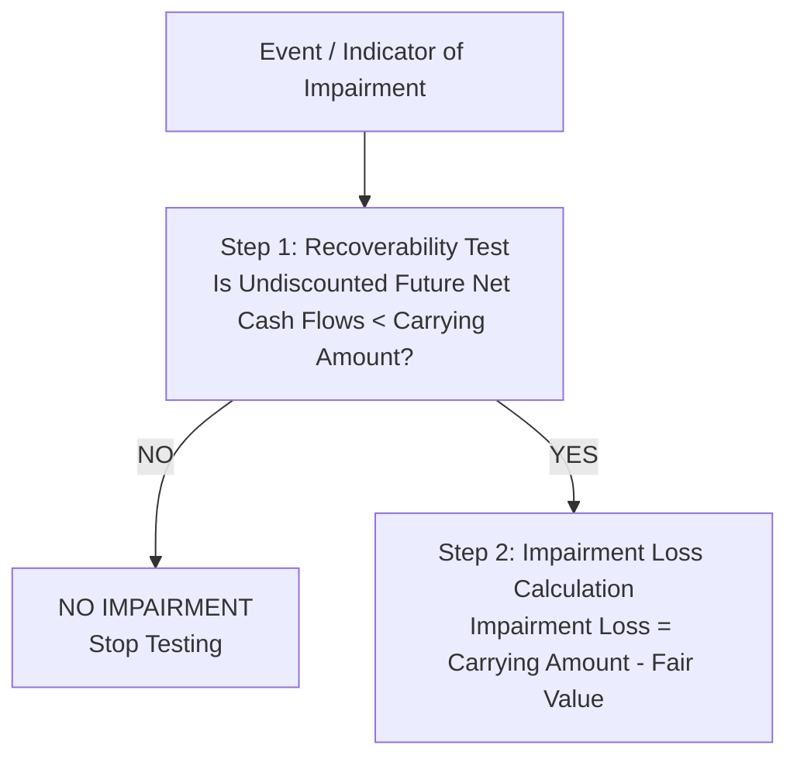

# Tangible Long-Lived Assets (PP&E)

> [!abstract] Curriculum & Syllabus Context
>
> - **Course:** ACC 301 Intermediate Accounting
> - **Phase:** Phase 2: Asset Valuation & Cost Allocation
> - **Target Reading:** Weygandt, Kieso, and Warfield, *Intermediate Accounting*, 18th Edition — **Chapter 9 & Chapter 10: Property, Plant, and Equipment** (including IAS 16 & IAS 36)
> - **Syllabus Focus:** Capitalization of acquisition costs, asset retirement obligations (ASC 410), interest capitalization during construction (ASC 835-20), nonmonetary asset exchanges (ASC 845), subsequent expenditures, depreciation methods (straight-line, activity, SYD, DDB), prospective revisions, impairment testing (US GAAP vs. IFRS), and depletion of natural resources.

---

### Section 1: Nature and Initial Measurement of Property, Plant, and Equipment (PP&E)
#### 1.1 Definition & Fundamental Characteristics
> [!info] Key Definition
>
> **Property, plant, and equipment (PP&E)**—also termed fixed assets, plant assets, or capital assets—are tangible long-lived resources held by an enterprise for use in central operations rather than for investment or resale to customers.

The three defining characteristics of PP&E are:
1. **Acquired for Use in Operations:** Assets must be actively employed in operational activities (e.g., factory buildings, machinery, delivery trucks). Idle buildings are reclassified as long-term investments; land held by real estate developers for subdivision and sale is classified as inventory.
2. **Long-Term in Nature and Usually Subject to Depreciation:** They yield economic service potential over multiple accounting periods. Their costs are systematically allocated to future periods via depreciation, with the exception of land, which has an indefinite life and is not depreciated.
3. **Physical Substance:** They are tangible assets characterized by physical existence, distinguishing them from intangible assets like patents or goodwill.

---
#### 1.2 Historical Cost Principle & Measurement Foundations
In accordance with US GAAP (ASC 360) and IAS 16, PP&E is initially measured and recorded at **historical cost**. Historical cost represents the cash or cash-equivalent price of obtaining the asset and executing all necessary expenditures to bring it to the location and condition required for its intended operational use.

**Rationale for Historical Cost:**
- **Verifiability:** Historical cost represents an arm's-length transaction backed by objective supporting documentation (invoices, deeds, contracts).
- **Reliability over Subjectivity:** Subsequent write-ups to fair value prior to sale are prohibited under US GAAP due to the subjective nature of estimating current market values for specialized capital assets.

---
#### 1.3 Cost Components by Asset Category
##### A. Cost of Land
Land is an asset with an indefinite economic life. All expenditures incurred to acquire land and ready it for its intended purpose are capitalized permanently into the `Land` account.

**Included Expenditures:**
- Cash purchase price and real estate broker commissions.
- Legal fees, title search fees, title insurance, and attorney fees.
- Accrued/unpaid property taxes or mortgages assumed by the buyer up to the purchase date.
- Site preparation costs: clearing, grading, filling, draining, and leveling the land.
- Demolition/razing of existing old structures on the land necessary for site preparation.
- *Less:* Proceeds received from the sale of salvaged materials recovered from demolished structures.
- Local government special assessments for permanent improvements (e.g., public pavements, sidewalks, sewers, and drainage mains).
##### B. Cost of Land Improvements
Land improvements are structural additions and enhancements made to land that possess **limited economic useful lives**.
- **Examples:** Driveways, parking lots, fences, outdoor security lighting, retaining walls, and sprinkler systems.
- **Accounting Treatment:** Recorded in a distinct account, `Land Improvements`, and depreciated over their estimated useful lives.
##### C. Cost of Buildings
The cost of buildings includes all direct expenditures related to acquisition or construction.
- **Purchased Buildings:** Purchase price, legal fees, title insurance, real estate agent fees, assumption of unpaid mortgages/taxes, and initial repair/remodeling costs required to prepare the building for occupancy.
- **Constructed Buildings:** Contractor contract price, architect fees, engineering fees, building permits, excavation costs, legal costs, direct construction supervision, and qualifying capitalized interest during the construction period.
##### D. Cost of Equipment
Equipment encompasses operational machinery, vehicles, office furniture, store fixtures, and computers.
- **Included Expenditures:** Cash purchase price (net of cash discounts), sales taxes, freight-in and shipping insurance, unloading/unpacking, special concrete foundations or wired platforms, assembly, installation, and trial run/testing costs.
- **Excluded Expenditures:** Fines for improper installation, damages incurred during unloading, and ongoing annual maintenance/insurance (expensed immediately).

---
#### 1.4 Asset Retirement Obligations (ARO) & Asset Retirement Costs (ARC) [ASC 410-20]
> [!info] Key Definition
>
> An **Asset Retirement Obligation (ARO)** is a legal obligation associated with the retirement, dismantling, or environmental remediation of a tangible long-lived asset resulting from its acquisition, construction, or normal operation.

##### Accounting Recognition Rules:
1. **Initial Recognition:** An ARO liability is recognized at its **fair value** in the period incurred if a reasonable estimate of fair value can be made. Fair value is measured as the present value of the expected future remediation cash flows discounted at a credit-adjusted risk-free rate.
2. **Capitalization into Asset (ARC):** The initial fair value of the ARO is capitalized as part of the carrying amount of the related long-lived asset, termed **Asset Retirement Cost (ARC)**.
3. **Subsequent Expense Allocation:**
   - **Depreciation:** The capitalized ARC is depreciated over the asset's useful life using a systematic depreciation method.
   - **Accretion Expense:** The ARO liability is accreted upward over time to reflect the passage of time.
4. **Settlement:** Upon final remediation, if actual settlement cost exceeds ARO liability balance $\rightarrow$ Loss on Settlement; if less $\rightarrow$ Gain on Settlement.

> [!quote] Formula & Derivation: ARO Present Value and Accretion
>
> $$ PV = \frac{CF_{\text{future}}}{(1 + r)^n} $$
> $$ \text{Accretion Expense}_t = \text{ARO Carrying Value}_{t-1} \times r $$

---

> [!example] Numerical Problem: Comprehensive PP&E Acquisition & ARO (Walkthrough 7.1)
>
> **Scenario:**
> On January 1, 2025, Apex Mining Co. purchased a tract of land containing an old warehouse for $\$1,500,000$ cash. Additional acquisition costs included:
> - Broker commissions: $\$60,000$
> - Legal and title search fees: $\$15,000$
> - Demolition of old warehouse: $\$40,000$
> - Salvaged timber/steel sales from old warehouse: $\$8,000$
> - Paving new employee parking lot (Land Improvement): $\$85,000$
> - Purchased mining machinery for $\$500,000$ cash subject to terms $2/10, n/30$ (paid within 10 days); sales tax $6\%$; freight-in $\$12,000$; installation platform $\$18,000$.
> - Apex is legally required to dismantle the machinery and decontaminate the site in 4 years. Estimated future restoration cost is $\$100,000$. The credit-adjusted risk-free rate is $8\%$.
> **Step 1: Calculate Cost of Land:**
> $$ \text{Total Land Cost} = \$1,500,000 + \$60,000 + \$15,000 + (\$40,000 - \$8,000) = \mathbf{\$1,607,000} $$
> **Step 2: Cost of Land Improvements:**
> $$ \text{Parking Lot Paving} = \mathbf{\$85,000} \quad (\text{Depreciated separately}) $$
> **Step 3: Calculate Cost of Machinery (excluding ARO):**
> $$ \text{Invoice Price (Net of 2\% Discount)} = \$500,000 \times 0.98 = \$490,000 $$
> $$ \text{Base Machinery Cost} = \$490,000 + (\$500,000 \times 0.06) + \$12,000 + \$18,000 = \mathbf{\$550,000} $$
> **Step 4: Calculate Present Value of ARO (ARC):**
> $$ PV = \$100,000 \times (1.08)^{-4} = \$100,000 \times 0.735030 = \mathbf{\$73,503} $$
> $$ \text{Total Initial Machinery Carrying Value (including ARC)} = \$550,000 + \$73,503 = \mathbf{\$623,503} $$
> **Step 5: Journal Entry on January 1, 2025:**
> $$ \begin{array}{llrr}
> \textbf{Date} & \textbf{Account Titles} & \textbf{Debit (\$)} & \textbf{Credit (\$)} \\
> \hline
> \text{Jan 1, 2025} & \text{Land} & 1,607,000 & \\
> & \text{Land Improvements} & 85,000 & \\
> & \text{Machinery (Base + ARC)} & 623,503 & \\
> & \quad \text{Cash} & & 2,242,000 \\
> & \quad \text{Asset Retirement Obligation} & & 73,503 \\
> \end{array} $$
> **Step 6: Year 1 Accretion & Depreciation Entries (December 31, 2025):**
> - Accretion Expense: $\$73,503 \times 8\% = \mathbf{\$5,880}$
> - Straight-Line Depreciation of Machinery (4-year life, $\$0$ salvage): $\frac{\$623,503}{4} = \mathbf{\$155,876}$
> $$ \begin{array}{llrr}
> \textbf{Date} & \textbf{Account Titles} & \textbf{Debit (\$)} & \textbf{Credit (\$)} \\
> \hline
> \text{Dec 31, 2025} & \text{Accretion Expense} & 5,880 & \\
> & \quad \text{Asset Retirement Obligation} & & 5,880 \\
> \hline
> \text{Dec 31, 2025} & \text{Depreciation Expense--Machinery} & 155,876 & \\
> & \quad \text{Accumulated Depreciation--Machinery} & & 155,876 \\
> \end{array} $$
> **Step 7: ARO Accretion Schedule Across 4 Years:**
> $$ \begin{array}{lrrr}
> \textbf{Year} & \textbf{Beginning ARO (\$)} & \textbf{Accretion Exp (8\%) (\$)} & \textbf{Ending ARO (\$)} \\
> \hline
> 2025 & 73,503 & 5,880 & 79,383 \\
> 2026 & 79,383 & 6,351 & 85,734 \\
> 2027 & 85,734 & 6,859 & 92,593 \\
> 2028 & 92,593 & 7,407 & 100,000 \\
> \hline \hline
> \end{array} $$
> **Step 8: Settlement Entry (December 31, 2028 - Actual Remediation Paid = $\$96,000$):**
> $$ \begin{array}{llrr}
> \textbf{Date} & \textbf{Account Titles} & \textbf{Debit (\$)} & \textbf{Credit (\$)} \\
> \hline
> \text{Dec 31, 2028} & \text{Asset Retirement Obligation} & 100,000 & \\
> & \quad \text{Cash} & & 96,000 \\
> & \quad \text{Gain on Settlement of ARO} & & 4,000 \\
> \end{array} $$

---
### Section 2: Capitalization of Interest During Construction [ASC 835-20]
#### 2.1 Theoretical Rationale & GAAP Criteria
Interest incurred during the construction of qualifying assets is considered a necessary cost of acquiring the asset and preparing it for its intended service.

**Capitalization Conditions:**
Interest capitalization begins when all three of the following conditions are met:
1. Expenditures for the asset have been made.
2. Activities necessary to ready the asset for its intended use are in progress.
3. Interest cost is being incurred.

Interest capitalization ends when the asset is substantially complete and ready for its intended use.

**Qualifying Assets:**
- Assets constructed for an entity's own use (e.g., self-constructed buildings, structures, machinery).
- Assets intended for sale or lease that are constructed as discrete projects (e.g., real estate developments, ships).
- *Non-Qualifying Assets:* Assets currently in use, idle assets, and routinely manufactured inventory.

---
#### 2.2 Mathematical Mechanics: Avoidable Interest vs. Actual Interest
US GAAP dictates that the amount of interest capitalized in an accounting period is the **lesser of Avoidable Interest and Actual Interest** incurred.

> [!quote] Formula & Derivation: Interest Capitalization
>
> $$ \text{Capitalized Interest} = \min(\text{Avoidable Interest}, \text{Actual Interest}) $$
> **Step 1: Compute Weighted-Average Accumulated Expenditures (WAE)**
> $$ \text{WAE} = \sum \left( \text{Expenditure}_i \times \frac{\text{Months Outstanding}_i}{12} \right) $$
> **Step 2: Determine Applicable Interest Rates**
> $$ \text{Weighted-Average General Rate} = \frac{\text{Total Actual Interest on General Debt}}{\text{Total Principal of General Debt}} $$
> **Step 3: Calculate Avoidable Interest**
> $$ \text{Avoidable Interest} = (\text{WAE}_{\text{specific}} \times r_{\text{specific}}) + [(\text{WAE} - \text{Specific Debt}) \times r_{\text{general}}] $$

> [!warning] Exam Pitfall / Exception
>
> **Prohibition on Netting Interest Income:** Under US GAAP, interest earned on temporary investments of unused loan proceeds CANNOT be netted against capitalized interest (must expense/capitalize gross interest and record interest income separately).

---

> [!example] Numerical Problem: Capitalization of Interest (Walkthrough 7.2)
>
> **Scenario:**
> On January 1, 2025, Horizon Corp. began construction of a new manufacturing plant for its own use. Total construction was completed on December 31, 2025. Expenditures during 2025 were:
> - January 1: $\$400,000$
> - April 1: $\$600,000$
> - July 1: $\$800,000$
> - November 1: $\$600,000$
> Horizon had the following debt outstanding throughout 2025:
> 1. **Specific Construction Loan:** 3-year, $10\%$ note specifically issued for the building on January 1, 2025: $\$1,000,000$.
> 2. **General Debt 1:** 5-year, $8\%$ bond payable: $\$2,000,000$.
> 3. **General Debt 2:** 10-year, $12\%$ note payable: $\$1,000,000$.
> **Step 1: Calculate Weighted-Average Accumulated Expenditures (WAE):**
> $$ \begin{array}{lrrr}
> \textbf{Date} & \textbf{Expenditure (\$)} & \textbf{Weight (Months/12)} & \textbf{WAE (\$)} \\
> \hline
> \text{Jan 1} & 400,000 & 12/12 & 400,000 \\
> \text{Apr 1} & 600,000 & 9/12 & 450,000 \\
> \text{Jul 1} & 800,000 & 6/12 & 400,000 \\
> \text{Nov 1} & 600,000 & 2/12 & 100,000 \\
> \hline
> \textbf{Total} & \mathbf{2,400,000} & & \mathbf{1,350,000} \\
> \hline \hline
> \end{array} $$
> **Step 2: Calculate Weighted-Average Rate on General Debt:**
> $$ \text{Total General Debt Interest} = (\$2,000,000 \times 8\%) + (\$1,000,000 \times 12\%) = \$160,000 + \$120,000 = \$280,000 $$
> $$ \text{Total General Debt Principal} = \$2,000,000 + \$1,000,000 = \$3,000,000 $$
> $$ r_{\text{general}} = \frac{\$280,000}{\$3,000,000} = \mathbf{9.3333\%} $$
> **Step 3: Calculate Avoidable Interest:**
> - Portion of WAE covered by Specific Construction Loan: $\$1,000,000 \times 10\% = \$100,000$
> - Excess WAE over Specific Debt: $(\$1,350,000 - \$1,000,000) \times 9.3333\% = \$32,667$
> $$ \text{Total Avoidable Interest} = \$100,000 + \$32,667 = \mathbf{\$132,667} $$
> **Step 4: Calculate Total Actual Interest:**
> $$ \text{Total Actual Interest} = \$100,000 \text{ (Specific)} + \$280,000 \text{ (General)} = \mathbf{\$380,000} $$
> **Step 5: Determine Capitalized Interest & Interest Expense:**
> $$ \text{Capitalized Interest} = \min(\$132,667, \$380,000) = \mathbf{\$132,667} $$
> $$ \text{Interest Expense to Income Statement} = \$380,000 - \$132,667 = \mathbf{\$247,333} $$
> **Step 6: Total Capitalized Cost of Building:**
> $$ \text{Total Cost} = \$2,400,000 + \$132,667 = \mathbf{\$2,532,667} $$
> **Step 7: Year-End Adjusting Journal Entry (December 31, 2025):**
> $$ \begin{array}{llrr}
> \textbf{Date} & \textbf{Account Titles} & \textbf{Debit (\$)} & \textbf{Credit (\$)} \\
> \hline
> \text{Dec 31, 2025} & \text{Building (Capitalized Interest)} & 132,667 & \\
> & \text{Interest Expense} & 247,333 & \\
> & \quad \text{Cash / Interest Payable} & & 380,000 \\
> \end{array} $$

---
### Section 3: Special Asset Valuation & Nonmonetary Exchange Scenarios
#### 3.1 Deferred-Payment Contracts
When PP&E is acquired under long-term credit terms, notes payable, or mortgages, the asset is recorded at the **present value of the consideration exchanged**.
- If no interest rate is stated, or if the stated rate is unreasonable, an interest rate must be **imputed** based on the buyer's incremental borrowing rate.
- **Discount Amortization:** The difference between the face value of the note and its present value is credited to `Discount on Notes Payable` and amortized over the note's term to `Interest Expense` using the **effective-interest method**.

---
#### 3.2 Lump-Sum (Basket) Purchases
When multiple distinct assets are acquired for a single lump-sum purchase price, the total acquisition cost is allocated among the individual assets based on their **relative fair values**:

> [!quote] Formula & Derivation: Lump-Sum Allocation
>
> $$ \text{Allocated Cost}_i = \text{Lump-Sum Purchase Price} \times \left( \frac{\text{Fair Value}_i}{\sum \text{Fair Values}} \right) $$

---
#### 3.3 Issuance of Corporate Stock
When PP&E is acquired via the issuance of stock, the transaction is measured at the **fair value of the stock issued** if actively traded; if the stock's fair value is not determinable, the fair value of the asset acquired is used.

---
#### 3.4 Nonmonetary Asset Exchanges [ASC 845]
Nonmonetary exchanges occur when an enterprise trades fixed assets for other nonmonetary assets.
##### A. Commercial Substance
> [!info] Key Definition
>
> An exchange possesses **commercial substance** if the entity's future cash flows change significantly as a result of the transaction (i.e., the economic positions of the parties alter).

##### B. Accounting Rules Matrix [ASC 845]
1. **Losses:** ALWAYS recognized immediately in full, regardless of commercial substance.
2. **Gains with Commercial Substance:** ALWAYS recognized immediately in full.
3. **Gains Lacking Commercial Substance (No Boot Received / Boot Paid):** Defer entire gain.
   $$ \text{Recorded Cost of New Asset} = \text{Book Value of Old Asset} + \text{Boot Paid} $$
4. **Gains Lacking Commercial Substance (Boot Received):**
   - **If Boot Received $< 25\%$ of Total Consideration:** Recognize a partial gain:
     $$ \text{Recognized Gain} = \text{Total Gain} \times \left( \frac{\text{Boot Received}}{\text{Boot Received} + \text{Fair Value of Asset Received}} \right) $$
     $$ \text{Recorded Cost of New Asset} = \text{Fair Value of New Asset} - \text{Deferred Gain} $$
   - **If Boot Received $\ge 25\%$ of Total Consideration:** Entire transaction is treated as a monetary exchange; 100% of the gain is recognized.

---

> [!example] Numerical Problem: Nonmonetary Asset Exchanges (Walkthrough 7.3)
>
> **Scenario:**
> Vanguard Corp. exchanges a heavy crane for a specialized excavator.
> - **Old Crane Data:** Original cost = $\$200,000$; Accumulated depreciation = $\$120,000$ (Book Value = $\$80,000$); Fair Value = $\$110,000$ (Unrealized Gain = $\$30,000$).
> **Case 1: Commercial Substance present. Vanguard pays $\$15,000$ cash boot. Fair Value of excavator = $\$125,000$.**
> $$ \text{Gain} = \$110,000 - \$80,000 = \mathbf{\$30,000} \text{ (Fully Recognized)} $$
> $$ \begin{array}{llrr}
> \textbf{Account Titles} & \textbf{Debit (\$)} & \textbf{Credit (\$)} \\
> \hline
> \text{Equipment--Excavator} & 125,000 & \\
> \text{Accumulated Depreciation--Crane} & 120,000 & \\
> \quad \text{Equipment--Crane} & & 200,000 \\
> \quad \text{Cash} & & 15,000 \\
> \quad \text{Gain on Disposal of Equipment} & & 30,000 \\
> \end{array} $$
> **Case 2: Commercial Substance present. Fair Value of Crane = $\$60,000$ (Unrealized Loss = $\$20,000$). Vanguard pays $\$15,000$ cash boot.**
> $$ \text{Loss} = \$80,000 - \$60,000 = \mathbf{\$20,000} \text{ (Fully Recognized)} $$
> $$ \begin{array}{llrr}
> \textbf{Account Titles} & \textbf{Debit (\$)} & \textbf{Credit (\$)} \\
> \hline
> \text{Equipment--Excavator} & 75,000 & \\
> \text{Accumulated Depreciation--Crane} & 120,000 & \\
> \text{Loss on Disposal of Equipment} & 20,000 & \\
> \quad \text{Equipment--Crane} & & 200,000 \\
> \quad \text{Cash} & & 15,000 \\
> \end{array} $$
> **Case 3: Lacks Commercial Substance. Vanguard pays $\$15,000$ cash boot.**
> $$ \text{Total Gain} = \$30,000 \quad \rightarrow \quad \text{Recognized Gain} = \mathbf{\$0} \text{ (Deferred)} $$
> $$ \text{Recorded Cost of Excavator} = \$80,000 + \$15,000 = \mathbf{\$95,000} $$
> $$ \begin{array}{llrr}
> \textbf{Account Titles} & \textbf{Debit (\$)} & \textbf{Credit (\$)} \\
> \hline
> \text{Equipment--Excavator} & 95,000 & \\
> \text{Accumulated Depreciation--Crane} & 120,000 & \\
> \quad \text{Equipment--Crane} & & 200,000 \\
> \quad \text{Cash} & & 15,000 \\
> \end{array} $$
> **Case 4: Lacks Commercial Substance. Fair Value of Crane = $\$110,000$. Vanguard receives $\$22,000$ cash boot and the excavator (Fair Value = $\$88,000$).**
> $$ \text{Boot Ratio} = \frac{\$22,000}{\$110,000} = 20\% \quad (< 25\% \rightarrow \text{Recognize Partial Gain}) $$
> $$ \text{Recognized Gain} = \$30,000 \times 20\% = \mathbf{\$6,000} $$
> $$ \text{Deferred Gain} = \$30,000 - \$6,000 = \$24,000 $$
> $$ \text{Recorded Cost of Excavator} = \$88,000 - \$24,000 = \mathbf{\$64,000} $$
> $$ \begin{array}{llrr}
> \textbf{Account Titles} & \textbf{Debit (\$)} & \textbf{Credit (\$)} \\
> \hline
> \text{Cash} & 22,000 & \\
> \text{Equipment--Excavator} & 64,000 & \\
> \text{Accumulated Depreciation--Crane} & 120,000 & \\
> \quad \text{Equipment--Crane} & & 200,000 \\
> \quad \text{Gain on Disposal of Equipment} & & 6,000 \\
> \end{array} $$

---
### Section 4: Costs Subsequent to Acquisition & Dispositions
#### 4.1 Capital vs. Revenue Expenditures
- **Capital Expenditures:** Costs that enhance the future economic benefits of an asset (extending useful life, increasing capacity/efficiency, or improving quality). Capitalized to asset accounts or debited to accumulated depreciation.
- **Revenue Expenditures:** Costs that maintain normal operating efficiency and performance. Expensed in the period incurred as `Maintenance and Repairs Expense`.
##### Categories of Subsequent Expenditures:
1. **Additions:** Extensions or enlargements of existing facilities. Capitalized as asset additions.
2. **Improvements & Replacements:**
   - *Substitution Approach:* If old asset cost/accumulated depreciation is known, remove old book value, record gain/loss, and capitalize new asset.
   - *Capitalize New Cost:* If old book value is unknown, capitalize new cost to asset if productivity/efficiency improves.
   - *Debit Accumulated Depreciation:* If expenditure extends useful life without increasing productivity.
3. **Rearrangement & Reinstallation:** Capitalized if material and benefits future periods.
4. **Repairs:** Ordinary repairs expensed; major overhauls capitalized.

---
#### 4.2 Dispositions of PP&E
When PP&E is retired, sold, or disposed of:
1. Update depreciation up to the exact date of disposal.
2. Remove Asset historical cost and Accumulated Depreciation balances.
3. Record cash/consideration received.
4. Recognize Gain or Loss on Disposal in operating income:
   $$ \text{Gain / Loss on Disposal} = \text{Net Disposal Proceeds} - \text{Book Value at Disposal Date} $$

**Involuntary Conversions:** Losses/gains from condemnation, fire, flood, or theft are recognized in full as operating gains/losses, even if proceeds are immediately reinvested in replacement assets.

---
### Section 5: Depreciation Concepts, Methods, & Rate Revisions
#### 5.1 Depreciation Fundamentals
Depreciation is a process of **cost allocation**, NOT asset valuation. It is the systematic allocation of an asset's depreciable base over its estimated useful life.

> [!quote] Formula & Derivation: Depreciable Base
>
> $$ \text{Depreciable Base} = \text{Historical Cost} - \text{Estimated Salvage Value} $$

---
#### 5.2 Depreciation Allocation Methods
> [!quote] Formula & Derivation: Depreciation Methods
>
> **A. Activity Method (Units of Output or Working Hours)**
> Assumes depreciation is a function of usage rather than time:
> $$ \text{Rate per Unit/Hour} = \frac{\text{Cost} - \text{Salvage Value}}{\text{Total Estimated Output Units/Hours}} $$
> $$ \text{Depreciation Expense}_t = \text{Units/Hours in Period } t \times \text{Rate per Unit/Hour} $$
> **B. Straight-Line Method**
> Assumes constant economic service potential per period:
> $$ \text{Annual Depreciation Expense} = \frac{\text{Cost} - \text{Salvage Value}}{\text{Estimated Useful Life } (n)} $$
> **C. Sum-of-the-Years'-Digits (SYD) Method (Accelerated)**
> Calculates decreasing depreciation using a declining fraction applied to a constant depreciable base:
> $$ S = \frac{n(n + 1)}{2} $$
> $$ \text{Depreciation Expense}_t = (\text{Cost} - \text{Salvage Value}) \times \left( \frac{\text{Remaining Useful Life at Start of Period}}{S} \right) $$
> **D. Double-Declining-Balance (DDB) Method (Accelerated)**
> Applies a constant declining rate (double the straight-line rate) to the **declining book value** of the asset:
> $$ \text{DDB Rate} = \frac{2}{n} $$
> $$ \text{Depreciation Expense}_t = \text{Book Value}_{t-1} \times \text{DDB Rate} \quad (\text{where } \text{Book Value}_0 = \text{Cost}) $$
> *(Constraint: Asset CANNOT be depreciated below salvage value. Final year expense is plugged).*
> **E. Composite & Group Depreciation Methods**
> Used for collection of assets. The composite/group rate is applied to total cost:
> $$ \text{Composite Rate} = \frac{\text{Total Annual Straight-Line Depreciation}}{\text{Total Historical Cost}} $$

---
#### 5.3 Revision of Depreciation Rates (Prospective Approach)
Changes in estimated useful life or salvage value are accounted for **prospectively** in current and future periods.

> [!quote] Formula & Derivation: Prospective Revision
>
> $$ \text{New Annual Depreciation} = \frac{\text{Book Value at Date of Revision} - \text{New Salvage Value}}{\text{New Remaining Useful Life}} $$

---

> [!example] Numerical Problem: Multi-Method Depreciation & Revision (Walkthrough 7.4)
>
> **Scenario:**
> On January 1, 2025, Titan Corp. purchased heavy machinery for $\$260,000$ with an estimated salvage value of $\$20,000$ and a 5-year useful life (total estimated working hours = 20,000 hours).
> - Hours worked: 2025 = 5,000 hours; 2026 = 6,000 hours.
> **Part A: Calculate 2025 and 2026 Depreciation under 4 Methods:**
> 1. **Straight-Line Method:**
>    $$ \text{Depreciable Base} = \$260,000 - \$20,000 = \$240,000 $$
>    $$ \text{Annual Expense} = \frac{\$240,000}{5} = \mathbf{\$48,000 \quad \text{per year}} $$
> 2. **Activity Method (Working Hours):**
>    $$ \text{Rate per Hour} = \frac{\$240,000}{20,000} = \mathbf{\$12.00 / hr} $$
>    $$ \text{2025 Expense} = 5,000 \times \$12 = \mathbf{\$60,000} $$
>    $$ \text{2026 Expense} = 6,000 \times \$12 = \mathbf{\$72,000} $$
> 3. **Sum-of-the-Years'-Digits (SYD) Method:**
>    $$ S = \frac{5(6)}{2} = 15 $$
>    $$ \text{2025 Expense} = \$240,000 \times \frac{5}{15} = \mathbf{\$80,000} $$
>    $$ \text{2026 Expense} = \$240,000 \times \frac{4}{15} = \mathbf{\$64,000} $$
> 4. **Double-Declining-Balance (DDB) Method:**
>    $$ \text{DDB Rate} = \frac{2}{5} = 40\% $$
>    $$ \text{2025 Expense} = \$260,000 \times 40\% = \mathbf{\$104,000} \quad (\text{End Book Value} = \$156,000) $$
>    $$ \text{2026 Expense} = \$156,000 \times 40\% = \mathbf{\$62,400} \quad (\text{End Book Value} = \$93,600) $$
> **Part B: Prospective Revision in 2027 (using Straight-Line):**
> On January 1, 2027, after 2 years of straight-line depreciation (Accumulated Depreciation = $\$96,000$; Book Value = $\$164,000$), Titan revises estimates: remaining useful life is extended to 5 more years (total life = 7 years), and new salvage value is $\$14,000$.
> $$ \text{Revised Annual Depreciation (2027–2031)} = \frac{\$164,000 - \$14,000}{5 \text{ years}} = \mathbf{\$30,000 / year} $$
> $$ \begin{array}{llrr}
> \textbf{Account Titles} & \textbf{Debit (\$)} & \textbf{Credit (\$)} \\
> \hline
> \text{Depreciation Expense} & 30,000 & \\
> \quad \text{Accumulated Depreciation--Machinery} & & 30,000 \\
> \end{array} $$

---
### Section 6: Asset Impairments (US GAAP vs. IFRS / IAS 36)
#### 6.1 US GAAP Two-Step Impairment Model [ASC 360]
Impairment occurs when the carrying amount of an asset is not recoverable.

> [!quote] Formula & Derivation: US GAAP Impairment Test
>
> **Step 1: Recoverability Test**
> Compare expected undiscounted future net cash flows from the asset's use and ultimate disposal to its carrying amount:
> - If $\sum \text{Undiscounted Cash Flows} \ge \text{Carrying Amount} \rightarrow$ NO impairment.
> - If $\sum \text{Undiscounted Cash Flows} < \text{Carrying Amount} \rightarrow$ Asset is IMPAIRED. Proceed to Step 2.
> **Step 2: Impairment Loss Calculation**
> $$ \text{Impairment Loss} = \text{Carrying Amount} - \text{Fair Value} $$

##### Subsequent Rules under US GAAP:
- **Assets Held for Use:** Impaired carrying value becomes new cost basis. **Restoration/reversal of impairment losses is strictly PROHIBITED**.
- **Assets Held for Disposal (Sale):** Measured at **Lower of Cost or Net Realizable Value** (Fair Value - Costs to Sell). Depreciation is suspended. Reversals of impairment losses ARE permitted up to carrying value prior to impairment.

---
#### 6.2 IFRS Comparison (IAS 16 & IAS 36)
> [!quote] Formula & Derivation: IFRS Impairment Test
>
> - **Single-Step Test:** Impairment loss is recognized whenever carrying amount exceeds **Recoverable Amount**.
>   $$ \text{Recoverable Amount} = \max(\text{Fair Value Less Costs to Sell}, \text{Value in Use}) $$
>   *(Value in Use = discounted present value of expected future cash flows)*.
> - **Reversal of Impairment:** IFRS PERMITS reversal of impairment losses for assets held for use if economic indicators improve.

---

> [!example] Numerical Problem: Asset Impairment (Walkthrough 7.5)
>
> **Scenario:**
> At December 31, 2025, Apex Corp. evaluates a manufacturing plant.
> - Historical Cost = $\$1,200,000$; Accumulated Depreciation = $\$400,000$ (Carrying Amount = $\$800,000$).
> - Expected undiscounted future net cash flows = $\$750,000$.
> - Fair Value (based on discounted cash flows) = $\$610,000$. Remaining useful life = 5 years ($\$0$ salvage).
> **Step 1: Recoverability Test:**
> $$ \sum \text{Undiscounted Cash Flows } (\$750,000) < \text{Carrying Amount } (\$800,000) $$
> $$ \mathbf{\text{Asset is Impaired!}} $$
> **Step 2: Calculate Impairment Loss:**
> $$ \text{Impairment Loss} = \$800,000 - \$610,000 = \mathbf{\$190,000} $$
> **Journal Entry (December 31, 2025):**
> $$ \begin{array}{llrr}
> \textbf{Account Titles} & \textbf{Debit (\$)} & \textbf{Credit (\$)} \\
> \hline
> \text{Loss on Impairment} & 190,000 & \\
> \quad \text{Accumulated Depreciation--Plant} & & 190,000 \\
> \end{array} $$
> **Post-Impairment Balance Sheet Presentation:**
> $$ \text{New Carrying Value} = \$1,200,000 - (\$400,000 + \$190,000) = \mathbf{\$610,000} $$
> **Revised Annual Depreciation (2026–2030):**
> $$ \text{New Annual Depreciation} = \frac{\$610,000}{5 \text{ years}} = \mathbf{\$122,000 / year} $$

---
### Section 7: Depletion of Natural Resources
#### 7.1 Depletion Base Categories
Natural resources (wasting assets) are physically consumed through extraction. Depletion base comprises four cost categories:
1. **Acquisition Costs:** Price paid to acquire property/lease rights.
2. **Exploration Costs:** Costs to locate resources. Capitalized if substantial or if using full-cost method.
3. **Development Costs:**
   - *Intangible Development Costs:* Drilling, shafts, wells, tunnels (capitalized to depletion base).
   - *Tangible Equipment Costs:* Heavy machinery/rigs capitalized SEPARATELY if reusable elsewhere.
4. **Restoration Costs (ARO):** Present value of required environmental restoration costs.

---
#### 7.2 Depletion Mechanics (Units-of-Production Method)
> [!quote] Formula & Derivation: Depletion
>
> $$ \text{Depletion Rate per Unit} = \frac{\text{Total Depletion Base} - \text{Salvage Value}}{\text{Total Estimated Extractable Units}} $$
> $$ \text{Depletion Incurred} = \text{Units Extracted} \times \text{Depletion Rate per Unit} $$

**Accounting Entries:**
$$ \begin{array}{llrr}
\textbf{Account Titles} & \textbf{Debit (\$)} & \textbf{Credit (\$)} \\
\hline
\text{Inventory (Extracted Resource)} & \text{XX,XXX} & \\
\quad \text{Resource Asset (or Accumulated Depletion)} & & \text{XX,XXX} \\
\\
\text{Cost of Goods Sold} & \text{YY,YYY} & \\
\quad \text{Inventory} & & \text{YY,YYY} \\
\end{array} $$

---
#### 7.3 Liquidating Dividends
Dividends paid to shareholders exceeding accumulated retained earnings represent a **return of capital** rather than a distribution of earnings:
$$ \begin{array}{llrr}
\textbf{Account Titles} & \textbf{Debit (\$)} & \textbf{Credit (\$)} \\
\hline
\text{Retained Earnings (Earned Portion)} & \text{XX,XXX} & \\
\text{Additional Paid-in Capital (Liquidating)} & \text{YY,YYY} & \\
\quad \text{Cash} & & \text{ZZ,ZZZ} \\
\end{array} $$

---

> [!example] Numerical Problem: Depletion & Natural Resources (Walkthrough 7.6)
>
> **Scenario:**
> Sierra Mining Co. acquired ore rights for $\$3,000,000$. Exploration costs totaled $\$400,000$. Intangible development costs were $\$800,000$. Present value of site restoration ARO is $\$200,000$. Land residual salvage value is $\$400,000$. Total estimated extractable ore = 2,000,000 tons.
> - In Year 1: Extracted 500,000 tons; Sold 400,000 tons at $\$8$/ton.
> **Step 1: Calculate Total Depletion Base:**
> $$ \text{Gross Base} = \$3,000,000 + \$400,000 + \$800,000 + \$200,000 = \$4,400,000 $$
> $$ \text{Net Depletion Base} = \$4,400,000 - \$400,000 = \mathbf{\$4,000,000} $$
> **Step 2: Calculate Depletion Rate per Ton:**
> $$ \text{Depletion Rate} = \frac{\$4,000,000}{2,000,000 \text{ tons}} = \mathbf{\$2.00 / ton} $$
> **Step 3: Year 1 Depletion & Cost Allocation:**
> $$ \text{Total Depletion Incurred (500k tons)} = 500,000 \times \$2.00 = \mathbf{\$1,000,000} $$
> $$ \text{Cost of Goods Sold (400k tons)} = 400,000 \times \$2.00 = \mathbf{\$800,000} $$
> $$ \text{Ending Inventory (100k tons)} = 100,000 \times \$2.00 = \mathbf{\$200,000} $$
> **Step 4: Journal Entries:**
> $$ \begin{array}{llrr}
> \textbf{Account Titles} & \textbf{Debit (\$)} & \textbf{Credit (\$)} \\
> \hline
> \text{Inventory--Ore} & 1,000,000 & \\
> \quad \text{Ore Mine (or Accumulated Depletion)} & & 1,000,000 \\
> \hline
> \text{Cash } (400,000 \times \$8) & 3,200,000 & \\
> \quad \text{Sales Revenue} & & 3,200,000 \\
> \hline
> \text{Cost of Goods Sold} & 800,000 & \\
> \quad \text{Inventory--Ore} & & 800,000 \\
> \end{array} $$

---
### Section 8: Summary Comparison of Standards (US GAAP vs. IFRS / IAS 16)

| Concept / Issue | US GAAP (ASC 360 / ASC 835) | IFRS (IAS 16 / IAS 36) |
| :--- | :--- | :--- |
| **Initial Measurement** | Historical cost. | Historical cost. |
| **Revaluation Option** | Prohibited. PP&E carried at historical cost less accumulated depreciation. | Permitted under Revaluation Model (Fair value gains to OCI Revaluation Surplus). |
| **Component Depreciation** | Permitted but rarely used in practice. | **Mandatory:** Each part of PP&E with a cost significant to total cost MUST be depreciated separately. |
| **Capitalization of Interest** | Required for qualifying assets. Netting interest income against capitalized interest is prohibited. | Required. Netting of interest income earned on temporary investment of specific loans IS required. |
| **Impairment Test Model** | **Two-Step Test:**  1. Undiscounted Cash Flows < Carrying Amount 2. Loss = Carrying Amount - Fair Value. | **Single-Step Test:**  Impairment Loss = Carrying Amount - Recoverable Amount ($\max(\text{FV less costs to sell}, \text{Value in Use})$). |
| **Impairment Reversals (Held for Use)** | **Strictly Prohibited**. | **Permitted** if economic conditions recover. |
