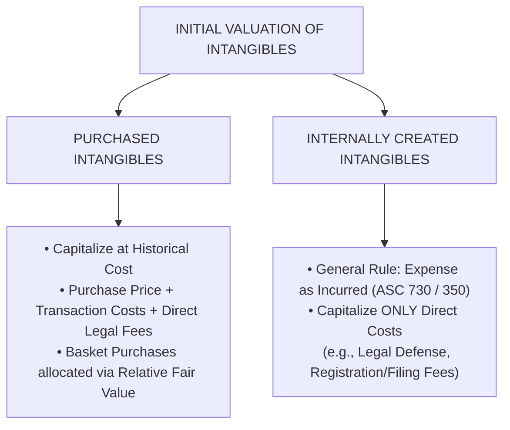
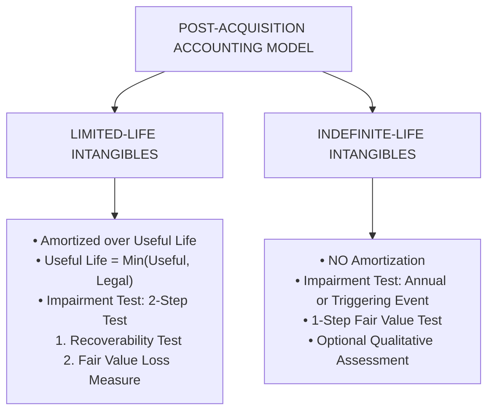
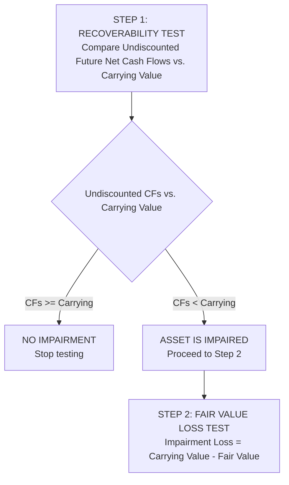
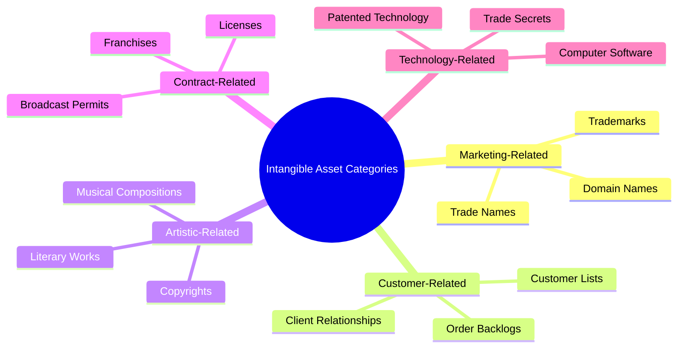

# Intangible Assets & Goodwill

> [!abstract] Curriculum & Syllabus Context
>
> - **Course:** ACC 301 Intermediate Accounting
> - **Phase:** Phase 2: Asset Valuation & Cost Allocation
> - **Target Reading:** Weygandt, Kieso, and Warfield, *Intermediate Accounting*, 18th Edition — **Chapter 11: Intangible Assets** (including IAS 38 & IAS 36)
> - **Syllabus Focus:** Characteristics of intangibles, valuation of purchased vs. internally created intangibles, amortization of finite-life intangibles, two-step impairment vs. annual fair value test, major classes (patents, copyrights, trademarks, franchises), purchased goodwill calculation, goodwill impairment (ASC 350), bargain purchases, and R&D accounting (ASC 730).

---

### 1. Fundamental Characteristics & Initial Valuation of Intangibles
#### 1.1 Definition & Core Characteristics
> [!info] Key Definition
>
> In financial accounting under US GAAP (ASC 350), **Intangible Assets** are defined as non-monetary assets that lack physical substance and are not financial instruments.

An intangible asset possesses two primary distinguishing characteristics:
1. **Lack of Physical Existence**: Unlike Property, Plant, and Equipment (PP&E), which can be seen, touched, and physically measured, intangible assets derive their economic value from the legal, contractual, or competitive rights and privileges granted to the holding entity.
2. **Non-Financial Instrument Nature**: Assets such as cash, bank deposits, accounts receivable, and debt or equity investments also lack physical substance. However, financial instruments derive their value from a contractual claim to receive cash or cash equivalents in the future. Intangibles do not represent a claim to a fixed or determinable sum of money.

Intangibles are expected to generate future economic benefits (cash inflows or cost savings) over multiple accounting periods and are therefore classified as **Noncurrent Assets** on the Classified Balance Sheet.

---
#### 1.2 Initial Valuation: Purchased vs. Internally Created Intangibles

The valuation of an intangible asset depends fundamentally on whether it was acquired externally from a third party or developed internally by the enterprise:
##### A. Purchased Intangible Assets
Intangible assets acquired from external parties are capitalized at **historical cost**. Cost is measured by the cash paid or the fair value of non-cash consideration given.

> [!quote] Formula & Derivation: Capitalized Cost & Basket Allocations
>
> $$ \text{Capitalized Cost} = \text{Purchase Price} + \text{Legal Fees} + \text{Filing/Registration Fees} + \text{Transaction Costs} $$
> When a group of intangibles (or a combination of tangible and intangible assets) is purchased in a **basket purchase**, the total lump-sum acquisition cost is allocated across the individual identifiable assets based on their **relative fair values**:
> $$ \text{Cost Allocated to Asset } i = \text{Total Lump-Sum Cost} \times \left( \frac{\text{Fair Value of Asset } i}{\sum \text{Fair Values of All Acquired Assets}} \right) $$

If an intangible is acquired in exchange for equity securities or other assets, its historical cost is measured by the **fair value of the consideration given** or the **fair value of the intangible received**, whichever is more clearly evident.
##### B. Internally Created Intangible Assets
Under US GAAP, costs incurred internally to create, develop, or maintain intangible assets are generally **expensed as incurred**.
- **Theoretical Rationale**: Internal costs incurred in generating intangibles (such as brand development, internal research, customer relationships, or advertising) bear no reliable or direct relationship to the ultimate fair value or future economic benefits generated by the asset. Capitalizing internal development costs creates severe subjectivity and risks overstating balance sheet assets.
- **Capitalizable Exceptions**: Only direct legal and administrative costs incurred in securing and perfecting the legal title of the internally created asset (such as registration fees, patent application costs, and attorney fees for successful patent defense) are capitalized as the initial cost basis of the intangible asset.

> [!warning] Exam Pitfall / Exception
>
> **Theoretical Trade-off: Relevance vs. Faithful Representation**
> The divergent treatment of purchased versus internally created intangibles highlights the fundamental trade-off between **Relevance** and **Faithful Representation**. While internally generated brands (e.g., Coca-Cola, Apple) carry immense economic value (relevance), accounting standard-setters mandate expensing internal development because estimating the timing and magnitude of future cash flows lacks verifiability and neutrality (faithful representation).

---
### 2. Amortization & Impairment Framework
Intangible assets are categorized into two structural classes for post-acquisition accounting: **Limited-Life (Finite) Intangibles** and **Indefinite-Life Intangibles**.

---
#### 2.1 Limited-Life (Finite) Intangible Assets
##### A. Amortization Mechanics
A limited-life intangible asset is systematically allocated to expense over its estimated **useful life**.

> [!quote] Formula & Derivation: Amortization Parameters
>
> **Useful Life Determination**:
> $$ n = \min(\text{Estimated Useful Economic Life}, \text{Legal/Contractual Life}) $$
> **Amortization Base**:
> $$ \text{Amortizable Base} = \text{Historical Cost} - \text{Residual Value} $$
> *(Residual value is presumed to be **zero**, unless there is a commitment from a third party to purchase it or a determinable active market.)*
> **Annual Amortization Expense (Straight-Line)**:
> $$ \text{Annual Amortization Expense} = \frac{\text{Cost} - \text{Residual Value}}{\min(\text{Useful Life}, \text{Legal Life})} $$

- **Journal Entry**: Amortization expense is debited, and the intangible asset account is credited directly (a contra-asset account such as *Accumulated Amortization* is permitted but rarely used in practice).
  $$ \begin{array}{llrr}
  \textbf{Account Titles} & & \textbf{Debit (\$)} & \textbf{Credit (\$)} \\
  \hline
  \text{Amortization Expense} & & \text{XXX} & \\
  \quad \text{Intangible Asset (e.g., Patents, Licenses)} & & & \text{XXX}
  \end{array} $$

---
##### B. Impairment Test for Limited-Life Intangibles (ASC 360 / ASC 350)
Limited-life intangibles are tested for impairment whenever events or changes in circumstances indicate that their carrying value may not be recoverable (triggering events).

1. **Step 1: Recoverability Test**:
   Compare the gross, undiscounted estimated future net cash flows expected from the use and ultimate disposition of the asset to its carrying amount:
   - If $\sum \text{Undiscounted Future Cash Flows} \ge \text{Carrying Value} \implies \text{No Impairment}$
   - If $\sum \text{Undiscounted Future Cash Flows} < \text{Carrying Value} \implies \text{Asset is Impaired} \implies \text{Proceed to Step 2}$
2. **Step 2: Measurement of Impairment Loss**:
   If impaired under Step 1, the impairment loss is calculated as the excess of the asset's carrying value over its **fair value**:
   $$ \text{Impairment Loss} = \text{Carrying Value} - \text{Fair Value} $$
3. **Accounting Entry & Post-Impairment Amortization**:
   $$ \begin{array}{llrr}
   \textbf{Account Titles} & & \textbf{Debit (\$)} & \textbf{Credit (\$)} \\
   \hline
   \text{Loss on Impairment} & & \text{XXX} & \\
   \quad \text{Intangible Asset} & & & \text{XXX}
   \end{array} $$
   After an impairment loss is recognized, the reduced carrying amount becomes the new cost basis of the asset. The asset's new cost basis is amortized prospectively over its remaining useful life. **Reversal of previously recognized impairment losses is strictly prohibited under US GAAP** for assets held and used.

---
#### 2.2 Indefinite-Life Intangible Assets (Excluding Goodwill)
##### A. Definition & Non-Amortization
An intangible asset is classified as having an **indefinite life** if analysis of all relevant legal, regulatory, contractual, competitive, and economic factors indicates there is no foreseeable limit on the period over which the asset is expected to generate net cash inflows for the entity.
- **Accounting Rule**: Indefinite-life intangibles are **NOT amortized**.
##### B. Impairment Test for Indefinite-Life Intangibles (ASC 350)
Indefinite-life intangibles are tested for impairment at least **annually**, or more frequently if triggering events indicate that the asset might be impaired.
- **One-Step Fair Value Test**: Because indefinite-life assets generate cash flows extending indefinitely into the future, the Step 1 recoverability test (undiscounted cash flows) is bypassed. The impairment test consists solely of a direct Fair Value Test:
  $$ \text{If } \text{Carrying Value} > \text{Fair Value} \implies \text{Impairment Loss} = \text{Carrying Value} - \text{Fair Value} $$
- **Optional Qualitative Assessment**: Under ASC 350, entities may perform an optional qualitative assessment to evaluate whether it is "more likely than not" (a likelihood $> 50\%$) that an indefinite-life intangible asset is impaired.
  - Qualitative factors include macroeconomic conditions, industry/market considerations, cost factor increases, and overall financial performance.
  - If the qualitative assessment concludes it is not more likely than not that the fair value is less than carrying value, the quantitative fair value test is bypassed.

---
### 3. Major Categories of Intangible Assets

---
#### 3.1 Marketing-Related Intangible Assets
- **Examples**: Trademarks, trade names, brand names, Internet domain names, and non-competition agreements.
- **Legal Protection**: Trademarks are registered with the U.S. Patent and Trademark Office for 10-year renewable periods. Because renewals are virtually unlimited at nominal cost, trademarks generally have **indefinite lives**.
- **Valuation**:
  - *Purchased*: Capitalize purchase price plus acquisition expenses.
  - *Internally Developed*: Capitalize attorney fees, registration costs, design fees, and successful legal defense costs. R&D costs incurred in developing the brand are expensed.
- **Accounting**: Unamortized if indefinite-life. Subject to annual one-step fair value impairment testing.
#### 3.2 Customer-Related Intangible Assets
- **Examples**: Customer lists, order or production backlogs, contractual and noncontractual customer relationships.
- **Accounting**: Classified as **limited-life intangibles**. Capitalized at acquisition cost and amortized using straight-line or an accelerated pattern of economic consumption over their estimated useful lives.
- **Impairment**: Tested under the ASC 360 two-step impairment model.
#### 3.3 Artistic-Related Intangible Assets
- **Examples**: Ownership rights to plays, literary works, musical compositions, paintings, photographs, motion pictures, and videos.
- **Copyright Protection**: Granted by federal statute for the **life of the creator plus 70 years**.
- **Accounting**: Classified as **limited-life intangibles**. Capitalized cost includes acquisition fees and successful legal defense costs. Amortized over their useful life if shorter than legal life ($n = \min(\text{Useful Life}, \text{Life of Author} + 70 \text{ years})$). Internal costs leading to copyrighted materials (R&D) are expensed as incurred.
#### 3.4 Contract-Related Intangible Assets
- **Examples**: Franchises, operating licenses, construction permits, broadcast rights, service contracts.
- **Franchise Mechanics**: Contractual agreement between franchisor and franchisee.
  - *Initial Franchise Fee*: Capitalized by the franchisee if it gives rise to long-term rights.
  - *Continuing Franchise Fees*: Expensed as incurred as operational expenses.
- **Accounting Treatment**:
  - *Definite-Term Franchise/License*: Amortized over the contractual term.
  - *Indefinite-Term / Perpetual Franchise*: Not amortized; evaluated annually for impairment via the one-step fair value test.
#### 3.5 Technology-Related Intangible Assets
- **Examples**: Patented technology, trade secrets, computer software.
- **Patent Rights**: A patent gives the holder exclusive right to use, manufacture, and sell a product or process for **20 years** from the date of application.
- **Valuation & Amortization**:
  - Capitalized cost includes purchase price, legal application fees, and costs of **successful legal defense**.
  - Unsuccessful legal defense costs and the unamortized carrying value of the patent are written off as an immediate loss.
  - Amortized over the shorter of legal life (20 years) or estimated economic useful life:
    $$ n = \min(\text{Useful Life}, 20 \text{ Years}) $$

---
### 4. Accounting for Goodwill & Business Combinations
#### 4.1 Conceptual Nature of Goodwill
> [!info] Key Definition
>
> **Goodwill** represents the future economic benefits arising from other assets acquired in a **business combination** that are not individually identified and separately recognized. It is a master valuation account ("plug" or residual). It cannot be purchased or sold independently; it can only be acquired as part of an entire business combination.

#### 4.2 Valuation Formula for Purchased Goodwill
Goodwill is recorded **only** when an entire business enterprise is acquired. Internally generated goodwill is **never capitalized**.

> [!quote] Formula & Derivation: Goodwill Calculation Matrix
>
> $$ \begin{array}{l}
> \textbf{Purchase Price Paid (Cash + Debt + Equity Transferred)} \\
> \text{Less: Fair Value of Identifiable Assets Acquired:} \\
> \quad \text{• Cash \& Receivables} \\
> \quad \text{• Inventory (Adjusted to Fair Value)} \\
> \quad \text{• Property, Plant \& Equipment (Adjusted to Fair Value)} \\
> \quad \text{• Unrecorded Identifiable Intangibles (Patents, Brands, Lists)} \\
> \text{Plus: Fair Value of Liabilities Assumed} \\
> \hline
> = \textbf{GOODWILL (If Positive)} \quad | \quad \textbf{BARGAIN PURCHASE GAIN (If Negative)} \\
> \hline \hline
> \end{array} $$

---
#### 4.3 Goodwill Impairment Testing (ASC 350)
Public entities do **not amortize goodwill**. Goodwill is tested for impairment at the **reporting unit** level at least annually.
##### Quantitative Goodwill Impairment Test
Under current US GAAP (ASC 350), goodwill impairment is measured using a single-step quantitative test:
1. **Compare Fair Value vs. Carrying Value of Reporting Unit**: Determine the fair value of the reporting unit (including goodwill) and compare it to the reporting unit's carrying amount (including goodwill).
2. **Loss Calculation**:
   $$ \text{If } \text{Fair Value of Reporting Unit} < \text{Carrying Value of Reporting Unit} \implies \text{Impairment Loss} $$
   $$ \text{Impairment Loss} = \text{Carrying Value of Reporting Unit} - \text{Fair Value of Reporting Unit} $$
   *Cap Constraint*: The recognized impairment loss **cannot exceed the total recorded carrying amount of goodwill** allocated to that reporting unit.
3. **Journal Entry**:
   $$ \begin{array}{llrr}
   \textbf{Account Titles} & & \textbf{Debit (\$)} & \textbf{Credit (\$)} \\
   \hline
   \text{Loss on Impairment of Goodwill} & & \text{XXX} & \\
   \quad \text{Goodwill} & & & \text{XXX}
   \end{array} $$
   *(Note: Goodwill impairment losses cannot be reversed in subsequent periods).*
##### Private Company Alternative (PCC / ASC 350-20)
Private companies may elect an accounting alternative developed by the Private Company Council (PCC):
- **Amortization**: Amortize goodwill on a straight-line basis over **10 years** (or less if a shorter useful life is justified).
- **Trigger-Based Impairment**: Test goodwill for impairment only when a triggering event occurs, rather than annually.

---
#### 4.4 Bargain Purchase Accounting
A **Bargain Purchase** occurs when the consideration transferred (purchase price) is *less* than the net fair value of the identifiable assets acquired and liabilities assumed (due to market imperfections, distressed sales, or forced liquidations).
- **Accounting Treatment**:
  1. The acquirer must reassess and verify the identification and fair value measurement of all acquired assets and assumed liabilities to ensure no omissions exist.
  2. Any remaining excess fair value over purchase price is recognized **immediately in earnings as a Gain on Acquisition (Bargain Purchase Gain)**:
     $$ \text{Bargain Purchase Gain} = \text{Fair Value of Net Identifiable Assets} - \text{Purchase Price} $$

  $$ \begin{array}{llrr}
  \textbf{Account Titles} & & \textbf{Debit (\$)} & \textbf{Credit (\$)} \\
  \hline
  \text{Identifiable Assets (at Fair Value)} & & \text{XXX} & \\
  \quad \text{Liabilities Assumed (at Fair Value)} & & & \text{XXX} \\
  \quad \text{Cash / Consideration Transferred} & & & \text{XXX} \\
  \quad \text{Gain on Acquisition (Income Statement)} & & & \text{XXX}
  \end{array} $$

---
### 5. Research & Development (R&D) Costs
#### 5.1 Defining R&D Activities (ASC 730 / SFAS No. 2)
> [!info] Key Definition
>
> - **Research**: Planned search or critical investigation aimed at discovery of new knowledge with the hope that such knowledge will be useful in developing a new product or process.
> - **Development**: Translation of research findings or other knowledge into a plan or design for a new product or process or for a significant improvement to an existing product or process.

---
#### 5.2 Accounting Rule for R&D Costs
Under US GAAP, **all Research and Development costs must be expensed as incurred**.

| R&D Cost Category | Accounting Treatment | Rule & Conditions |
| :--- | :--- | :--- |
| **Materials, Equipment, & Facilities** | **Expense Immediately** | If the item has **NO alternative future use** in other R&D projects or otherwise. |
| **Materials, Equipment, & Facilities** | **Capitalize & Depreciate** | If the item has **alternative future uses**. Capitalize as an asset; depreciate/allocate to R&D expense as consumed. |
| **Personnel Costs** | **Expense Immediately** | Salaries, wages, and benefits of research staff engaged in R&D. |
| **Purchased Intangibles (IPR&D)** | **Capitalize at Fair Value** | In-process R&D acquired in a business combination is capitalized as an indefinite-life intangible until completed or abandoned. |
| **Contracted Services** | **Expense Immediately** | Costs of R&D services performed by third parties on behalf of the company. |
| **Indirect Costs** | **Expense Immediately** | Reasonable allocation of indirect costs directly related to R&D. General & administrative costs are excluded unless directly billable. |

---
#### 5.3 Costs Similar to R&D

| Start-Up Costs | Operating Losses | Advertising | Software Costs |
| :--- | :--- | :--- | :--- |
| Expense as incurred (ASC 720-15). Includes activities related to opening a new facility or organizing a new corporate entity. | Expense as incurred (ASC 915). Losses incurred during the launch phase cannot be capitalized. | Expense when incurred or the first time the advertising takes place. | Expense until technological feasibility is established. |

---
### 6. Comprehensive Multi-Step Numerical Walkthroughs
> [!example] Walkthrough 1: Patent Acquisition, Legal Defense, Amortization, and Impairment
>
> **Scenario:**
> On January 1, 2024, **Helios Tech Corp.** purchased a product patent from an inventor for $\$480,000$ cash. The patent had a remaining legal life of 16 years, but Helios estimated its economic useful life would be 10 years.
> On July 1, 2025, Helios spent $\$70,000$ in legal fees to successfully defend the patent in an infringement lawsuit.
> On December 31, 2026, competitive technological advances caused a sharp drop in demand. Helios performed an impairment test. Estimated undiscounted future net cash flows from the patent were $\$280,000$. The fair value of the patent was estimated at $\$210,000$. Remaining useful life as of December 31, 2026, was revised to 5 years.
> **Step 1: 2024 Transactions**
> - Initial Cost (January 1, 2024) = $\$480,000$
> - Useful life $n = \min(10, 16) = 10 \text{ years}$.
> - 2024 Amortization = $\frac{\$480,000}{10} = \$48,000$.
> - Carrying Value at Dec 31, 2024 = $\$480,000 - \$48,000 = \$432,000$.
> **Step 2: 2025 Transactions**
> - Amortization for 1st half of 2025 (Jan 1 – June 30) = $\frac{\$48,000}{2} = \$24,000$.
> - Carrying Value on June 30, 2025 (before legal cost) = $\$432,000 - \$24,000 = \$408,000$.
> - Capitalize Successful Legal Defense (July 1, 2025) = $+\$70,000$.
> - New Carrying Base on July 1, 2025 = $\$408,000 + \$70,000 = \$478,000$.
> - Remaining useful life at July 1, 2025 = $10 - 1.5 = 8.5 \text{ years}$ ($102 \text{ months}$).
> - Amortization for 2nd half of 2025 (July 1 – Dec 31) = $\frac{\$478,000}{8.5} \times 0.5 = \frac{\$478,000}{17} = \$56,235.29$.
> - Carrying Value at Dec 31, 2025 = $\$478,000 - \$56,235.29 = \$421,764.71$.
> **Step 3: 2026 Amortization (Full Year)**
> - Annual Amortization Rate = $\frac{\$478,000}{8.5} = \$56,235.29$.
> - Carrying Value at Dec 31, 2026 (before impairment) = $\$421,764.71 - \$56,235.29 = \$365,529.42$.
> **Step 4: Impairment Test at December 31, 2026**
> - *Step 1: Recoverability Test*:
>   $$ \text{Undiscounted Future Cash Flows } (\$280,000) < \text{Carrying Value } (\$365,529.42) \implies \mathbf{\text{Asset is Impaired!}} $$
> - *Step 2: Fair Value Impairment Loss Measurement*:
>   $$ \text{Impairment Loss} = \$365,529.42 - \$210,000 (\text{Fair Value}) = \mathbf{\$155,529.42} $$
> **Step 5: Journal Entries**
> $$ \begin{array}{llrr}
> \textbf{Date} & \textbf{Account Titles} & \textbf{Debit (\$)} & \textbf{Credit (\$)} \\
> \hline
> \text{Dec 31, 2026} & \text{Amortization Expense} & 56,235.29 & \\
> & \quad \text{Patents} & & 56,235.29 \\
> \hline
> \text{Dec 31, 2026} & \text{Loss on Impairment of Patent} & 155,529.42 & \\
> & \quad \text{Patents} & & 155,529.42 \\
> \end{array} $$
> **Step 6: 2027 Prospective Amortization**
> - New Carrying Base = $\$210,000$. Revised remaining life = 5 years.
> - 2027 Annual Amortization = $\frac{\$210,000}{5} = \mathbf{\$42,000}$.

---

> [!example] Walkthrough 2: Business Combination, Goodwill Computation, & Impairment
>
> **Scenario:**
> On October 1, 2025, **Apex Conglomerate** acquired 100% of the net assets of **Vanguard Systems** for $\$3,800,000$ cash. Vanguard's balance sheet prior to acquisition showed total book value of assets of $\$3,100,000$ and total liabilities of $\$1,200,000$.
> An independent appraisal revealed the following fair values for Vanguard's accounts:
> - Accounts Receivable: Fair value $\$280,000$ (Book Value $\$300,000$)
> - Inventory: Fair value $\$650,000$ (Book Value $\$500,000$)
> - Property, Plant, and Equipment: Fair value $\$2,100,000$ (Book Value $\$1,600,000$)
> - Unrecorded Customer List: Fair value $\$350,000$ (Book Value $\$0$)
> - Unrecorded In-Process R&D (IPR&D): Fair value $\$200,000$ (Book Value $\$0$)
> - Total Liabilities Assumed: Fair value $\$1,200,000$ (Book Value $\$1,200,000$)
> On December 31, 2026, Vanguard operates as a reporting unit of Apex. The carrying value of Vanguard's total net assets (including Goodwill) is $\$3,650,000$. Apex determines the Fair Value of the Vanguard Reporting Unit is $\$3,100,000$.
> **Step 1: Calculate Fair Value of Net Identifiable Assets Acquired**
> $$ \begin{array}{lrr}
> \text{Accounts Receivable (Fair Value)} & \$280,000 & \\
> \text{Inventory (Fair Value)} & 650,000 & \\
> \text{Property, Plant, and Equipment (Fair Value)} & 2,100,000 & \\
> \text{Identifiable Intangible: Customer List} & 350,000 & \\
> \text{Identifiable Intangible: In-Process R\&D} & 200,000 & \\
> \hline
> \mathbf{\text{Total Fair Value of Identifiable Assets}} & \mathbf{\$3,580,000} & \\
> \text{Less: Fair Value of Liabilities Assumed} & (1,200,000) & \\
> \hline
> \mathbf{\text{Fair Value of Net Identifiable Assets}} & & \mathbf{\$2,380,000} \\
> \hline \hline
> \end{array} $$
> **Step 2: Compute Purchased Goodwill**
> $$ \text{Purchase Price (Consideration Transferred)} = \$3,800,000 $$
> $$ \text{Goodwill} = \$3,800,000 - \$2,380,000 = \mathbf{\$1,420,000} $$
> **Step 3: Acquisition Journal Entry (October 1, 2025)**
> $$ \begin{array}{llrr}
> \textbf{Account Titles} & & \textbf{Debit (\$)} & \textbf{Credit (\$)} \\
> \hline
> \text{Accounts Receivable} & & 280,000 & \\
> \text{Inventory} & & 650,000 & \\
> \text{Property, Plant, and Equipment} & & 2,100,000 & \\
> \text{Customer List (Intangible Asset)} & & 350,000 & \\
> \text{In-Process Research \& Development (Intangible)} & & 200,000 & \\
> \text{Goodwill} & & 1,420,000 & \\
> \quad \text{Liabilities Assumed} & & & 1,200,000 \\
> \quad \text{Cash} & & & 3,800,000
> \end{array} $$
> **Step 4: Goodwill Impairment Test (December 31, 2026)**
> - *Quantitative Impairment Assessment*:
>   $$ \text{Fair Value of Unit } (\$3,100,000) < \text{Carrying Value of Unit } (\$3,650,000) \implies \mathbf{\text{Goodwill is Impaired!}} $$
> - *Calculate Impairment Loss*:
>   $$ \text{Impairment Loss} = \$3,650,000 - \$3,100,000 = \mathbf{\$550,000} $$
>   *(Note: \$550,000 does not exceed the total Goodwill carrying value of \$1,420,000)*
> $$ \begin{array}{llrr}
> \textbf{Account Titles} & & \textbf{Debit (\$)} & \textbf{Credit (\$)} \\
> \hline
> \text{Loss on Impairment of Goodwill} & & 550,000 & \\
> \quad \text{Goodwill} & & & 550,000
> \end{array} $$
> - *Post-Impairment Goodwill Balance* = $\$1,420,000 - \$550,000 = \mathbf{\$870,000}$.

---

> [!example] Walkthrough 3: R&D Cost Classification & Financial Statement Impact
>
> **Scenario:**
> During 2025, **Nexus Bio-Labs Inc.** incurred the following cash expenditures:
> 1. Construction of a long-term research facility with alternative future uses: $\$1,500,000$ (10-year life, straight-line).
> 2. Acquisition of specialized laboratory equipment solely for a single R&D project (no alternative future use): $\$320,000$.
> 3. Salaries and wages for research scientists designing a new molecular compound: $\$450,000$.
> 4. Materials purchased for current and future R&D projects: $\$200,000$ (materials remaining in stock at year-end: $\$60,000$).
> 5. Legal fees incurred to successfully register a patent for a completed formula: $\$40,000$.
> 6. Start-up legal and state filing fees for a new subsidiary: $\$85,000$.
> 7. Executive management salaries (general overhead): $\$300,000$.
> **Classification & Income Statement Impact Analysis:**
> | Item Description | Amount (\$) | Accounting Classification & Rationale |
> | :--- | :--- | :--- |
> | **1. Research Facility** | $\$1,500,000$ | Capitalize as PP&E (Alternative Future Use). |
> | *(2025 Depreciation on Facility)* | $\$150,000$ | **Include in R&D Expense** ($\$1,500,000 / 10$). |
> | **2. Single-Project Equipment** | $\$320,000$ | **R&D Expense** (No Alternative Use). |
> | **3. Scientists Salaries** | $\$450,000$ | **R&D Expense** (Personnel Cost). |
> | **4. R&D Materials Consumed** | $\$140,000$ | **R&D Expense** ($\$200,000 - \$60,000$ ending stock). |
> | *(Ending Inventory - Asset)* | $\$60,000$ | Current Asset (Inventory on Balance Sheet). |
> | **5. Patent Registration Fees** | $\$40,000$ | Capitalize as Patent (Intangible Asset). |
> | **6. Start-up Filing Fees** | $\$85,000$ | **Operating Expense (Start-Up Cost)** (ASC 720-15). |
> | **7. Executive Salaries** | $\$300,000$ | **Operating Expense (G&A Expense)**. |
> **Total R&D Expense Reported on 2025 Income Statement:**
> $$ \text{Total 2025 R\&D Expense} = \$150,000 \text{ (Depr)} + \$320,000 + \$450,000 + \$140,000 = \mathbf{\$1,060,000} $$

---
### 7. Financial Statement Presentation & IFRS Alignment
#### 7.1 Financial Statement Presentation & Disclosures
##### A. Balance Sheet
- Intangible assets (excluding goodwill) are presented as a separate line item under **Noncurrent Assets**.
- **Goodwill** must be reported as a separate, distinct line item on the Balance Sheet.
- Gross carrying amount and accumulated amortization must be disclosed by major intangible class.
##### B. Income Statement
- Amortization expense and impairment losses for intangibles are included in **Income from Continuing Operations** (typically under *Operating Expenses* or *Other Expenses/Losses*).
- Total **R&D expenses** charged to operations must be disclosed in the financial statements or footnote notes for each reported period.

---
#### 7.2 Key Differences Between US GAAP and IFRS (IAS 38 & IAS 36)

| Accounting Issue | US GAAP | IFRS (IAS 38 / IAS 36) |
| :--- | :--- | :--- |
| **Internally Generated R&D** | Expense ALL R&D as incurred. | Expense Research; **Capitalize Development** once technical/economic feasibility is proven. |
| **Revaluation Model** | Prohibited (Cost Model only). | Permitted for finite intangibles if an active market exists. |
| **Impairment Test Model (Finite Intangibles)** | 2-Step Test: 1. Undiscounted Cash Flows 2. Fair Value Loss | 1-Step Recoverable Amount Test (Higher of Fair Value less Costs to Sell & Value-in-Use). |
| **Reversal of Impairment Losses** | Strictly Prohibited. | Permitted for finite intangibles (Prohibited for Goodwill). |

1. **Development Cost Capitalization**:
   - *US GAAP*: All research and development costs are expensed as incurred.
   - *IFRS (IAS 38)*: Costs in the *Research phase* are expensed. Costs in the *Development phase* **must be capitalized** as intangible assets once technical and economic feasibility, intent to complete, and ability to generate future economic benefits are established.
2. **Revaluation Model**:
   - *US GAAP*: Revaluation is strictly prohibited; all intangibles are measured at historical cost less amortization/impairments.
   - *IFRS (IAS 38)*: Permits the *Revaluation Model* (revaluation to fair value) for limited-life intangibles if an active market exists.
3. **Impairment Testing & Recoverable Amount**:
   - *US GAAP*: Uses a two-step impairment test (undiscounted cash flows recoverability test, then fair value loss).
   - *IFRS (IAS 36)*: Bypasses the undiscounted cash flow test and uses a one-step test. An impairment loss is recognized if carrying value exceeds the **Recoverable Amount** (defined as the higher of *Fair Value Less Costs to Sell* and *Value-in-Use* / discounted cash flows).
4. **Reversal of Impairment Losses**:
   - *US GAAP*: Prohibits reversal of impairment losses for all intangibles held and used.
   - *IFRS (IAS 36)*: **Permits reversal of impairment losses** for limited-life intangible assets if economic conditions or expected usage improves (goodwill impairment reversals remain prohibited).