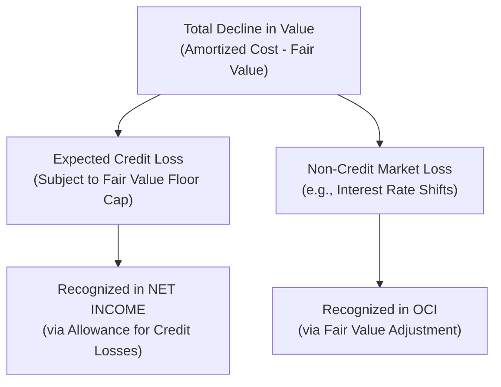
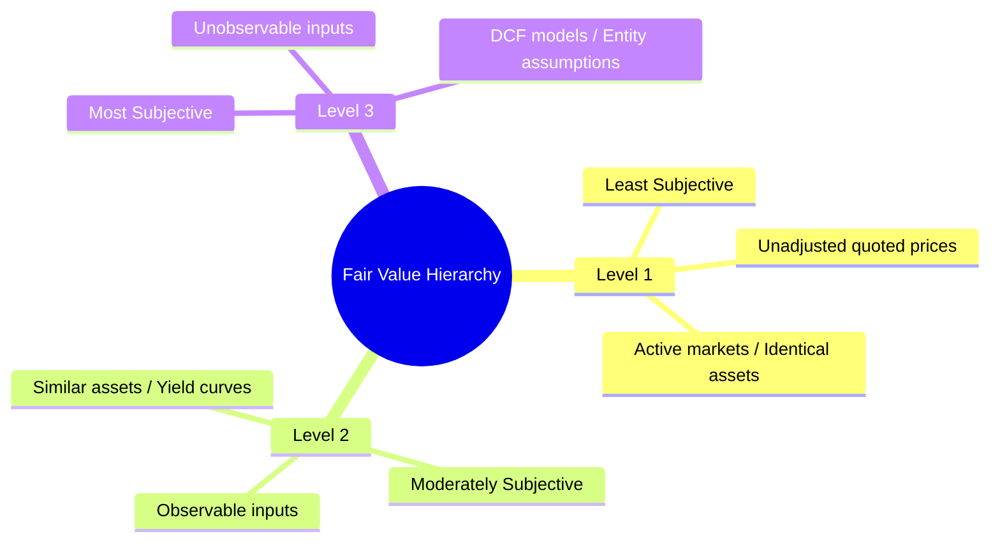

# Temporary Marketable Investments

> [!abstract] Curriculum & Syllabus Context
>
> - **Course:** ACC 301 Intermediate Accounting
> - **Phase:** Phase 2: Asset Valuation & Cost Allocation
> - **Target Reading:** Weygandt, Kieso, and Warfield, *Intermediate Accounting*, 18th Edition — **Chapter 16: Investments** (including IFRS 9)
> - **Syllabus Focus:** Trading debt securities, Available-for-Sale (AFS) debt securities, Held-to-Maturity (HTM) debt securities, marketable equity securities under ASC 321, fair value adjustments, reclassification adjustments upon sale, CECL credit loss impairments, fair value floor, fair value option (ASC 825), and IFRS 9 differences.

---

### I. Conceptual Foundations & Classification of Temporary Marketable Investments
#### 1. Nature of Financial Assets & Temporary Investments
> [!info] Key Definition
>
> A **financial asset** is any asset that represents a contractual right to receive cash or another financial instrument from another entity, or an equity instrument of another entity (FASB ASC Master Glossary). Unlike physical assets (e.g., PP&E or Inventory) which derive economic utility from physical use, financial assets derive their value from contractual monetary claims.
> **Temporary (or Short-Term) Marketable Investments** are financial assets consisting of debt and equity securities that meet two criteria for Current Asset classification:
> 1. **Readily Marketable (Liquidity Criterion):** Capable of being sold immediately in an active, liquid secondary market with publicly quoted prices.
> 2. **Management Intent (Operating Cycle Criterion):** Management must intend to sell or convert the security into cash within one year or the normal operating cycle, whichever is longer, to satisfy current liquidity needs.

---
#### 2. Classification Framework for Debt and Equity Securities
Accounting for investments depends on whether the instrument is a **Debt Security** or an **Equity Security**, as well as the investor's business model, degree of influence, and intent.

| Security Type | Management Intent / Ownership Level | Primary Accounting Classification | Valuation Basis | Treatment of Unrealized Holding Gains / Losses |
| :--- | :--- | :--- | :--- | :--- |
| **Debt Security** | Active, frequent buying and selling for short-term profit | **Trading Securities** (ASC 320) | Fair Value | Included in **Net Income** (Income Statement) |
| **Debt Security** | Neither active trading nor held-to-maturity; available for liquidity | **Available-for-Sale (AFS) Debt Securities** (ASC 320) | Fair Value | Included in **Other Comprehensive Income (OCI)** $\rightarrow$ Accumulated OCI (Balance Sheet) |
| **Debt Security** | Positive intent and ability to hold until legal maturity date | **Held-to-Maturity (HTM) Debt Securities** (ASC 320) | Amortized Cost | Not Recognized in Financial Statements (Disclosed in Notes) |
| **Equity Security** | Holdings $< 20\%$ voting stock (Passive / No Significant Influence) | **Marketable Equity Securities** (ASC 321) | Fair Value | Included in **Net Income** (Income Statement) |
| **Equity Security** | Holdings $20\% \text{ to } 50\%$ voting stock (Significant Influence) | **Equity Method Investments** (ASC 323) | Equity Basis (Cost $\pm$ Share of Investee Net Income/Loss $-$ Dividends) | Not Recognized (Carrying value adjusted for investee results) |
| **Equity Security** | Holdings $> 50\%$ voting stock (Controlling Interest) | **Consolidated Financial Statements** (ASC 810) | Consolidation | Not Applicable (Elimination of intercompany accounts) |

---
### II. Accounting for Temporary Debt Securities (ASC 320)
Debt securities represent a creditor relationship with an entity (e.g., U.S. Treasury bills, commercial paper, municipal bonds, and corporate debentures). When acquired, all debt securities are initially recorded at **cost**, which equals the cash price paid plus broker commissions, taxes, and other acquisition fees.
#### 1. Trading Debt Securities
**Definition & Intent:** Debt securities acquired with the specific strategy of frequent buying and selling to generate short-term profits on price fluctuations. They are classified strictly as **Current Assets** on the Balance Sheet.

> [!quote] Formula & Derivation: Trading Debt Securities
>
> **Interest Revenue:**
> $$ \text{Interest Revenue} = \text{Beginning Amortized Cost} \times \text{Effective Interest Rate} \times \frac{t}{12} $$
> $$ \text{Cash Interest Received} = \text{Face Value} \times \text{Stated Coupon Rate} \times \frac{t}{12} $$
> **Subsequent Measurement at Fair Value:**
> $$ \text{Unrealized Gain / Loss} = \text{Total Portfolio Fair Value} - \text{Total Portfolio Amortized Cost} $$

##### Journal Entries for Trading Securities:
$$ \begin{array}{llrr}
\textbf{Transaction} & \textbf{Account Titles} & \textbf{Debit (\$)} & \textbf{Credit (\$)} \\
\hline
\text{1. Initial Purchase} & \text{Debt Investments (Trading)} & \text{XXX} & \\
& \quad \text{Cash} & & \text{XXX} \\
\hline
\text{2. Receipt of Interest} & \text{Cash (or Interest Receivable)} & \text{XXX} & \\
& \text{Debt Investments (Discount Amortization)} & \text{XXX} & \\
& \quad \text{Interest Revenue} & & \text{XXX} \\
\hline
\text{3. Year-End FV Adj} & \text{Fair Value Adjustment (Trading)} & \text{XXX} & \\
\text{(Net Portfolio Gain)} & \quad \text{Unrealized Holding Gain or Loss—Income} & & \text{XXX} \\
\hline
\text{4. Year-End FV Adj} & \text{Unrealized Holding Gain or Loss—Income} & \text{XXX} & \\
\text{(Net Portfolio Loss)} & \quad \text{Fair Value Adjustment (Trading)} & & \text{XXX} \\
\end{array} $$

---
#### 2. Available-for-Sale (AFS) Debt Securities
**Definition & Intent:** Debt securities not classified as trading or held-to-maturity. They are held to provide liquidity, manage interest rate risk, or yield returns over a flexible holding period. If intended to be converted to cash within 12 months, they are reported under Current Assets.
##### Valuation & Accounting Mechanics:
* **Initial Acquisition & Amortization:** Recorded at cost. Premiums or discounts are amortized using the **Effective-Interest Method**.
* **Balance Sheet Presentation:** Reported at **Fair Value** using a valuation allowance ($Fair\ Value\ Adjustment$).
* **Unrealized Holding Gains and Losses:** Excluded from Net Income! Recognized in **Other Comprehensive Income (OCI)** and accumulate in Equity under **Accumulated Other Comprehensive Income (AOCI)**.
##### Journal Entries for AFS Debt Securities:
$$ \begin{array}{llrr}
\textbf{Transaction} & \textbf{Account Titles} & \textbf{Debit (\$)} & \textbf{Credit (\$)} \\
\hline
\text{1. Year-End FV Adj} & \text{Fair Value Adjustment (AFS)} & \text{XXX} & \\
\text{(Net Portfolio Gain)} & \quad \text{Unrealized Holding Gain or Loss—Equity (OCI)} & & \text{XXX} \\
\hline
\text{2. Year-End FV Adj} & \text{Unrealized Holding Gain or Loss—Equity (OCI)} & \text{XXX} & \\
\text{(Net Portfolio Loss)} & \quad \text{Fair Value Adjustment (AFS)} & & \text{XXX} \\
\end{array} $$

---
#### 3. Sale and Disposition of AFS Debt Securities & Reclassification Adjustments
When an AFS debt security is sold prior to maturity, a **Realized Gain or Loss** must be computed and reported in Net Income.

> [!quote] Formula & Derivation: AFS Sale & Reclassification
>
> $$ \text{Realized Gain or Loss on Sale} = \text{Net Sales Proceeds} - \text{Amortized Cost at Sale Date} $$
> **The Reclassification Adjustment Problem:**
> To eliminate double-counting when realized gains are moved from AOCI to Net Income, a reclassification adjustment is required:
> $$ \text{OCI for Period} = \text{Unrealized Holding G/L Generated in Period} - \text{Reclassification Adjustment for Realized G/L} $$

##### Complete Journal Entry Sequence for Sale of AFS Debt Security:
$$ \begin{array}{llrr}
\textbf{Transaction} & \textbf{Account Titles} & \textbf{Debit (\$)} & \textbf{Credit (\$)} \\
\hline
\text{1. Update Accruals} & \text{Cash (for accrued interest received)} & \text{XXX} & \\
\text{to Sale Date} & \text{Debt Investments (AFS)} & \text{XXX} & \\
& \quad \text{Interest Revenue} & & \text{XXX} \\
\hline
\text{2. Record Sale \&} & \text{Cash (Net Selling Price)} & \text{XXX} & \\
\text{Recognize Gain/Loss} & \text{Loss on Sale of Investments (if Realized Loss)} & \text{XXX} & \\
& \quad \text{Debt Investments (AFS) [Carrying Amortized Cost]} & & \text{XXX} \\
& \quad \text{Gain on Sale of Investments (if Realized Gain)} & & \text{XXX} \\
\end{array} $$

---
### III. Accounting for Temporary Marketable Equity Securities (ASC 321)
Under **FASB ASC 321** (effective post-2018), the historical distinction between Trading and Available-for-Sale equity securities was **eliminated** for investments with passive ownership ($<20\%$ voting power).
#### 1. The Fair Value Method (Holdings $< 20\%$)
All marketable equity securities with passive holdings ($<20\%$) must be measured at **Fair Value**, with all unrealized holding gains and losses recognized immediately in **Net Income**.

> [!quote] Formula & Derivation: Equity Securities Sale
>
> $$ \text{Realized Gain or Loss on Sale} = \text{Net Proceeds from Sale} - \text{Historical Cost} $$

##### Journal Entries for Equity Securities:
$$ \begin{array}{llrr}
\textbf{Transaction} & \textbf{Account Titles} & \textbf{Debit (\$)} & \textbf{Credit (\$)} \\
\hline
\text{1. Receipt of Dividend} & \text{Cash (or Dividend Receivable)} & \text{XXX} & \\
& \quad \text{Dividend Revenue (Net Income)} & & \text{XXX} \\
\hline
\text{2. Sale of Equity} & \text{Cash} & \text{XXX} & \\
\text{Securities} & \text{Loss on Sale of Equity Securities (if Loss)} & \text{XXX} & \\
& \quad \text{Equity Investments (Historical Cost)} & & \text{XXX} \\
& \quad \text{Gain on Sale of Equity Securities (if Gain)} & & \text{XXX} \\
\end{array} $$
#### 2. Practicability Exception for Nonmarketable Equity Securities
For equity investments that do not have readily determinable fair values (e.g., shares in private start-ups), entities may elect a **practicability exception**:
> [!quote] Formula & Derivation: Practicability Exception
>
> $$ \text{Carrying Value} = \text{Historical Cost} - \text{Impairments} \pm \text{Observable Price Changes for Similar Instruments} $$

---
### IV. Impairment of Marketable Securities & Credit Loss Models
#### 1. Current Expected Credit Loss (CECL) Model for HTM Debt Securities
For HTM debt investments, entities apply the **Current Expected Credit Loss (CECL)** model. Entities estimate lifetime expected credit losses based on historical experience, current economic conditions, and reasonable forecasts.

$$ \begin{array}{llrr}
\textbf{Account Titles} & & \textbf{Debit (\$)} & \textbf{Credit (\$)} \\
\hline
\text{Bad Debt Expense (Credit Loss)} & & \text{XXX} & \\
\quad \text{Allowance for Credit Losses (Contra-Asset)} & & & \text{XXX} \\
\end{array} $$

---
#### 2. Impairment Model for Available-for-Sale Debt Securities
Unlike HTM securities, AFS debt securities may be sold for liquidity or held for collection. Thus, impairment for AFS debt securities separates **Credit Losses** from **Non-Credit Market Losses** (e.g., general interest rate increases).

> [!quote] Formula & Derivation: Fair Value Floor
>
> Credit losses recognized in Net Income are capped at the **Fair Value Floor**:
> $$ \text{Fair Value Floor} = \text{Amortized Cost} - \text{Fair Value} $$

##### Impairment Allocation Decision Tree:
1. **If Fair Value $\ge$ Amortized Cost:** No impairment. Any unrealized gain is reported in OCI.
2. **If Fair Value $<$ Amortized Cost (Decline Exists):**
   * Calculate Expected Credit Loss ($\text{ECL}$).
   * **If $\text{ECL} \ge (\text{Amortized Cost} - \text{Fair Value})$:**
     * Credit Loss recognized in Net Income = $\text{Amortized Cost} - \text{Fair Value}$ (Full difference).
     * OCI Loss = $\$0$.
   * **If $\text{ECL} < (\text{Amortized Cost} - \text{Fair Value})$:**
     * Credit Loss recognized in Net Income = $\text{ECL}$.
     * Non-Credit Loss recognized in OCI = $(\text{Amortized Cost} - \text{Fair Value}) - \text{ECL}$.

---
### V. The Fair Value Option (ASC 825)
> [!warning] Exam Pitfall / Exception
>
> Entities have an **irrevocable option** to report specific financial assets (including AFS and HTM debt securities or equity method investments) at **Fair Value** on an instrument-by-instrument basis:
> * **Timing:** Elected at initial acquisition or origination of the asset.
> * **Accounting Treatment:** All subsequent changes in fair value are recognized immediately in **Net Income**, regardless of default classification.
> * **Impact on AFS Debt Securities:** Bypasses OCI; all unrealized gains/losses go directly to Net Income.

---
### VI. Financial Statement Presentation & Disclosure
#### 1. Balance Sheet
* **Current Assets:** Trading Debt Securities, Marketable Equity Securities, and Current AFS Debt Securities.
* **Valuation Accounts:** $Fair\ Value\ Adjustment$ displayed net against $Debt\ Investments$ or $Equity\ Investments$.
* **Stockholders' Equity:** Accumulated Other Comprehensive Income (AOCI) line item reflecting cumulative net unrealized gains/losses on AFS debt securities.
#### 2. Income Statement
* Interest/Dividend Revenue.
* Realized Gains and Losses on Sale.
* Unrealized Holding Gains/Losses on Trading Debt and Marketable Equity Securities.
* Credit Loss Impairments ($Bad\ Debt\ Expense$).
#### 3. Fair Value Hierarchy Disclosures (ASC 820)
Entities must categorize fair value measurements into a three-level inputs hierarchy in the note disclosures:

---
### VII. International Financial Reporting Standards (IFRS 9) Differences

| Feature / Standard | US GAAP (ASC 320 / 321) | IFRS (IFRS 9) |
| :--- | :--- | :--- |
| **Debt Classification** | Trading, Available-for-Sale (AFS), Held-to-Maturity (HTM) | **Amortized Cost** (Held for collection), **FVOCI** (Hold & Sell), or **FVTPL** (Trading) |
| **Equity Securities Gains/Losses** | ALL fair value changes on equity securities MUST go to **Net Income** | Option at inception to designate non-trading equity securities to **FVOCI** |
| **Recycling of Equity FVOCI Gains/Losses** | N/A (GAAP sends equity to Net Income) | **NO Recycling!** Cumulative OCI gains/losses transferred directly to Retained Earnings upon sale |
| **Reversal of Impairments** | Reversal permitted for AFS debt securities; Prohibited for HTM | Reversals **PERMITTED** for debt securities at amortized cost / FVOCI if credit improves |
| **LIFO & Revaluations** | LIFO allowed; Revaluations prohibited | LIFO prohibited; Revaluation model permitted for PP&E/Intangibles |

---
### VIII. Complete Numerical Walkthroughs with Solutions

---

> [!example] Walkthrough 1: Temporary Debt Securities Portfolio (Trading vs. AFS)
>
> On January 1, 2025, **Apex Capital Corp.** purchased two debt securities to manage short-term excess cash:
> 1. **Bond Alpha (Trading):** Purchased $\$200,000$ face value, $6\%$ bonds for $\$192,278$ (to yield $8\%$). Interest is payable semiannually on June 30 and December 31.
> 2. **Bond Beta (Available-for-Sale):** Purchased $\$300,000$ face value, $8\%$ bonds for $\$312,289$ (to yield $7\%$). Interest is payable semiannually on June 30 and December 31.
> **Additional Events:**
> * **December 31, 2025:** Fair values: Bond Alpha = $\$195,000$; Bond Beta = $\$308,000$.
> * **July 1, 2026:** Apex sold Bond Beta for $\$307,000$ plus cash interest.
> * **December 31, 2026:** Fair value of Bond Alpha = $\$193,500$.
> ##### Step-by-Step Solution & Journal Entries:
> **1. January 1, 2025 — Initial Purchases**
> $$ \begin{array}{llrr}
> \textbf{Account Titles} & & \textbf{Debit (\$)} & \textbf{Credit (\$)} \\
> \hline
> \text{Debt Investments (Trading)} & & 192,278 & \\
> \text{Debt Investments (AFS)} & & 312,289 & \\
> \quad \text{Cash} & & & 504,567 \\
> \end{array} $$
> **2. June 30, 2025 — First Semiannual Interest Receipt & Amortization**
> * **Bond Alpha (Trading):** Cash = $\$200,000 \times 3\% = \$6,000$; Interest Rev = $\$192,278 \times 4\% = \$7,691.12$; Amortization = $\$1,691.12$.
> * **Bond Beta (AFS):** Cash = $\$300,000 \times 4\% = \$12,000$; Interest Rev = $\$312,289 \times 3.5\% = \$10,930.12$; Amortization = $\$1,069.88$.
> $$ \begin{array}{llrr}
> \text{Cash} & & 6,000.00 & \\
> \text{Debt Investments (Trading)} & & 1,691.12 & \\
> \quad \text{Interest Revenue} & & & 7,691.12 \\
> \hline
> \text{Cash} & & 12,000.00 & \\
> \quad \text{Debt Investments (AFS)} & & & 1,069.88 \\
> \quad \text{Interest Revenue} & & & 10,930.12 \\
> \end{array} $$
> **3. December 31, 2025 — Second Semiannual Interest Receipt & Amortization**
> * **Bond Alpha (Trading):** Rev = $\$193,969.12 \times 4\% = \$7,758.76$; Amort = $\$1,758.76$. Ending Cost = $\$195,727.88$.
> * **Bond Beta (AFS):** Rev = $\$311,219.12 \times 3.5\% = \$10,892.67$; Amort = $\$1,107.33$. Ending Cost = $\$310,111.79$.
> $$ \begin{array}{llrr}
> \text{Cash} & & 6,000.00 & \\
> \text{Debt Investments (Trading)} & & 1,758.76 & \\
> \quad \text{Interest Revenue} & & & 7,758.76 \\
> \hline
> \text{Cash} & & 12,000.00 & \\
> \quad \text{Debt Investments (AFS)} & & & 1,107.33 \\
> \quad \text{Interest Revenue} & & & 10,892.67 \\
> \end{array} $$
> **4. December 31, 2025 — Year-End Fair Value Adjustments**
> * **Bond Alpha (Trading):** FV = $\$195,000.00$; Cost = $\$195,727.88$ $\implies$ Loss = $-\$727.88$.
> * **Bond Beta (AFS):** FV = $\$308,000.00$; Cost = $\$310,111.79$ $\implies$ Loss = $-\$2,111.79$.
> $$ \begin{array}{llrr}
> \text{Unrealized Holding Gain or Loss—Income} & & 727.88 & \\
> \quad \text{Fair Value Adjustment (Trading)} & & & 727.88 \\
> \hline
> \text{Unrealized Holding Gain or Loss—Equity (OCI)} & & 2,111.79 & \\
> \quad \text{Fair Value Adjustment (AFS)} & & & 2,111.79 \\
> \end{array} $$
> **5. July 1, 2026 — Sale of Bond Beta (AFS)**
> * Update Amortization (Jan 1 – Jun 30): Rev = $\$310,111.79 \times 3.5\% = \$10,853.91$; Amort = $\$1,146.09$. New Cost = $\$308,965.70$.
> * Record Sale: Proceeds = $\$307,000.00$; Cost = $\$308,965.70$ $\implies$ Realized Loss = $\$1,965.70$.
> $$ \begin{array}{llrr}
> \text{Cash (Interest portion)} & & 12,000.00 & \\
> \quad \text{Debt Investments (AFS)} & & & 1,146.09 \\
> \quad \text{Interest Revenue} & & & 10,853.91 \\
> \hline
> \text{Cash (Net Selling Price)} & & 307,000.00 & \\
> \text{Loss on Sale of Investments (Net Income)} & & 1,965.70 & \\
> \quad \text{Debt Investments (AFS)} & & & 308,965.70 \\
> \end{array} $$
> **6. December 31, 2026 — Reclassification Adjustment for Bond Beta (AFS)**
> * The AFS portfolio is now empty. The credit balance in the allowance account ($\$2,111.79$) must be reversed out of OCI to avoid double counting the loss now realized in Net Income.
> $$ \begin{array}{llrr}
> \text{Fair Value Adjustment (AFS)} & & 2,111.79 & \\
> \quad \text{Unrealized Holding Gain or Loss—Equity (OCI)} & & & 2,111.79 \\
> \end{array} $$

---

> [!example] Walkthrough 2: Marketable Equity Securities (ASC 321 Fair Value Method)
>
> On February 1, 2025, **Beacon Corp.** purchased shares in two publicly traded companies as temporary investments:
> * **Company X:** $10,000$ shares at $\$15.00$ per share $+$ $\$1,500$ fee (Total Cost $= \$151,500$).
> * **Company Y:** $5,000$ shares at $\$30.00$ per share $+$ $\$2,000$ fee (Total Cost $= \$152,000$).
> **Additional Events:**
> * **June 1, 2025:** Company X paid a cash dividend of $\$0.50$ per share.
> * **December 31, 2025:** Fair values: Co. X $= \$18.00$; Co. Y $= \$25.00$.
> * **April 15, 2026:** Sold all $10,000$ shares of Co. X at $\$21.00$ less $\$2,000$ fee.
> * **December 31, 2026:** Fair value of Co. Y $= \$32.00$.
> ##### Step-by-Step Journal Entries:
> **1. February 1, 2025 — Initial Acquisition**
> $$ \begin{array}{llrr}
> \textbf{Account Titles} & & \textbf{Debit (\$)} & \textbf{Credit (\$)} \\
> \hline
> \text{Equity Investments (Company X)} & & 151,500 & \\
> \text{Equity Investments (Company Y)} & & 152,000 & \\
> \quad \text{Cash} & & & 303,500 \\
> \end{array} $$
> **2. June 1, 2025 — Dividend Revenue**
> $$ \begin{array}{llrr}
> \text{Cash } (10,000 \times \$0.50) & & 5,000 & \\
> \quad \text{Dividend Revenue (Income Statement)} & & & 5,000 \\
> \end{array} $$
> **3. December 31, 2025 — Fair Value Adjustment**
> * Co. X FV = $\$180,000$; Cost = $\$151,500 \implies$ Gain = $+\$28,500$
> * Co. Y FV = $\$125,000$; Cost = $\$152,000 \implies$ Loss = $-\$27,000$
> * Net Unrealized Gain = $\$305,000 - \$303,500 = +\$1,500$
> $$ \begin{array}{llrr}
> \text{Fair Value Adjustment (Equity)} & & 1,500 & \\
> \quad \text{Unrealized Holding Gain or Loss—Income} & & & 1,500 \\
> \end{array} $$
> **4. April 15, 2026 — Sale of Company X Stock**
> * Net Proceeds = $(10,000 \times \$21.00) - \$2,000 = \$208,000$
> * Realized Gain = $\$208,000 - \$151,500 (\text{Cost}) = +\$56,500$
> $$ \begin{array}{llrr}
> \text{Cash} & & 208,000 & \\
> \quad \text{Equity Investments (Company X)} & & & 151,500 \\
> \quad \text{Gain on Sale of Equity Investments (Net Income)} & & & 56,500 \\
> \end{array} $$
> **5. December 31, 2026 — Year-End Fair Value Adjustment**
> * Remaining Portfolio (Company Y): Cost = $\$152,000$; FV = $\$160,000$.
> * Target Allowance = $+\$8,000$ (Debit).
> * Existing Allowance = $+\$1,500$ (Debit).
> * Adjustment Required = $\$8,000 - \$1,500 = +\$6,500$ (Debit).
> $$ \begin{array}{llrr}
> \text{Fair Value Adjustment (Equity)} & & 6,500 & \\
> \quad \text{Unrealized Holding Gain or Loss—Income} & & & 6,500 \\
> \end{array} $$

---

> [!example] Walkthrough 3: AFS Debt Security Impairment & Fair Value Floor
>
> On January 1, 2024, **Vanguard Holdings** purchased a corporate bond classified as Available-for-Sale for $\$1,000,000$ at par. At December 31, 2025, due to credit deterioration and interest rate increases, the bond's fair value dropped to $\$820,000$. Vanguard calculated an **Expected Credit Loss (ECL)** of $\$120,000$. Vanguard does not intend to sell the bond, and it is not more likely than not that Vanguard will be required to sell before recovery.
> **1. Calculate Fair Value Floor:**
> $$ \text{Fair Value Floor} = \$1,000,000 - \$820,000 = \$180,000 $$
> **2. Allocate Credit Loss vs. Non-Credit Loss:**
> * Total Loss in Value $= \$180,000$
> * Expected Credit Loss (ECL) $= \$120,000$
> * Since $\text{ECL} < \text{Fair Value Floor}$:
>   * **Credit Loss (Net Income)** $= \$120,000$
>   * **Non-Credit Loss (OCI)** $= \$180,000 - \$120,000 = \$60,000$
> **3. Journal Entry at December 31, 2025:**
> $$ \begin{array}{llrr}
> \textbf{Account Titles} & & \textbf{Debit (\$)} & \textbf{Credit (\$)} \\
> \hline
> \text{Bad Debt Expense (Credit Loss to Net Income)} & & 120,000 & \\
> \text{Unrealized Holding Gain or Loss—Equity (OCI)} & & 60,000 & \\
> \quad \text{Allowance for Credit Losses (Contra-Asset)} & & & 120,000 \\
> \quad \text{Fair Value Adjustment (AFS)} & & & 60,000 \\
> \end{array} $$
