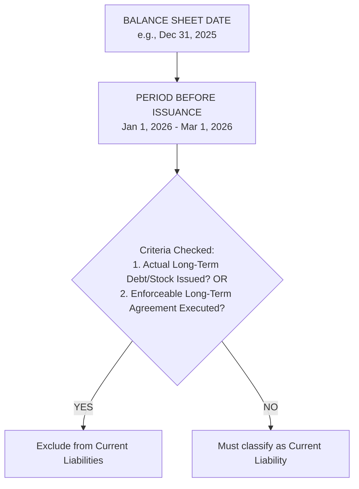

# Current & Contingent Liabilities

> [!abstract] Curriculum & Syllabus Context
>
> - **Course:** ACC 301 Intermediate Accounting
> - **Phase:** Phase 3: Liabilities & Owners' Equity
> - **Target Reading:** Weygandt, Kieso, and Warfield, *Intermediate Accounting*, 18th Edition — **Chapter 12: Current Liabilities and Contingencies** (including IAS 37)
> - **Syllabus Focus:** Nature and valuation of current liabilities, trade accounts payable (gross vs. net), short-term interest/zero-interest notes payable, sales taxes, payroll withholdings and employer taxes, compensated absences (ASC 710), unearned revenue and gift card breakage, refinancing of short-term debt (ASC 470), loss contingencies and accrual criteria (ASC 450), warranties, and IAS 37 provisions.

---

## 1. Nature, Definition, and Valuation of Current Liabilities
### 1.1 Definition of a Liability
> [!info] Key Definition
>
> Under the FASB Conceptual Framework (SFAC No. 6), **liabilities** are defined as probable future sacrifices of economic benefits arising from present obligations of a particular entity to transfer assets or provide services to other entities in the future as a result of past transactions or events.

A liability possesses three essential characteristics:
1. **Present Obligation**: It involves a present duty or responsibility to one or more other entities that entails settlement by probable future transfer or use of assets at a specified or determinable date, on occurrence of a specified event, or on demand.
2. **Unavoidable Sacrifice**: The duty or responsibility obligates a particular entity, leaving it little or no discretion to avoid the future sacrifice.
3. **Past Obligation Event**: The transaction or other event obligating the entity has already happened.

---
### 1.2 Definition and Operating Cycle Criteria for Current Liabilities
> [!info] Key Definition
>
> **Current liabilities** are obligations whose liquidation is reasonably expected to require the use of existing resources properly classified as current assets, or the creation of other current liabilities.

* **Operating Cycle**: The average time elapsed between the acquisition of materials/services and the final cash realization from the sale of products or services.
* **Rule of Thumb**: If the operating cycle is shorter than one year, the one-year criterion is used. If the operating cycle is longer than one year (e.g., tobacco or beverage aging industries), the operating cycle length is used for current asset and current liability classification.

---
### 1.3 Theoretical Valuation vs. Practical Valuation
Conceptually, liabilities should be recorded at the **present value** of the future cash outflows required to settle them:

> [!quote] Formula & Derivation: Present Value of a Liability
>
> $$ PV = \frac{CF_n}{(1 + i)^n} $$

* **Practical Valuation in Accounting**: Short-term liabilities are recorded and reported at their **full face value (maturity value)** rather than discounted present value.
* **Materiality & Cost Constraint**: The difference between the present value and the maturity value of short-term liabilities (due within one year) is immaterial, and the cost of tracking daily present value discounting outweighs the marginal benefit to decision-makers.

---
## 2. Payable Transactions & Mechanics
### 2.1 Accounts Payable (Trade Accounts Payable)
**Accounts payable** are balances owed to suppliers for goods, materials, or services purchased on open account (informal credit arrangements, typically 30 to 60 days).
#### Accounting Methods for Purchase Cash Discounts
When goods are bought under credit terms (e.g., $2/10, n/30$), companies can account for discounts using either the Gross Method or Net Method:

| Attribute | Gross Method | Net Method (Theoretically Preferred) |
| :--- | :--- | :--- |
| **Initial Purchases Recording** | Full invoice price (ignores discount). | Net invoice price after deducting prompt payment discount. |
| **Discounts Taken** | Recorded as `Purchase Discounts` (credited to COGS/Inventory). | No special entry (inventory/purchases already net). |
| **Discounts Missed/Lapsed** | No special entry (paid at full gross invoice). | Debited to `Purchase Discounts Lost` (Operating/Financing Expense). |
| **Period-End Valuation** | Payables reported at gross invoice value. | Payables reported at net realizable settlement value. |

> [!example] Numerical Problem: Gross vs. Net Method Walkthrough
>
> **Scenario**: On October 1, 2025, Company X purchases merchandise for $\$10,000$, terms $2/10, n/30$.
> * **Case A**: Payment made on October 10 (within discount period).
> * **Case B**: Payment made on October 31 (after discount period).
> ##### Gross Method Journal Entries:
> $$ \begin{array}{llrr}
> \textbf{Date / Event} & \textbf{Account Titles} & \textbf{Debit (\$)} & \textbf{Credit (\$)} \\
> \hline
> \text{Oct 1 (Purchase)} & \text{Purchases / Inventory} & 10,000 & \\
> & \quad \text{Accounts Payable} & & 10,000 \\
> \hline
> \text{Case A: Oct 10} & \text{Accounts Payable} & 10,000 & \\
> \text{(Paid in Discount Period)} & \quad \text{Purchase Discounts} & & 200 \\
> & \quad \text{Cash} & & 9,800 \\
> \hline
> \text{Case B: Oct 31} & \text{Accounts Payable} & 10,000 & \\
> \text{(Paid after Discount Period)} & \quad \text{Cash} & & 10,000 \\
> \end{array} $$
> ##### Net Method Journal Entries:
> $$ \begin{array}{llrr}
> \textbf{Date / Event} & \textbf{Account Titles} & \textbf{Debit (\$)} & \textbf{Credit (\$)} \\
> \hline
> \text{Oct 1 (Purchase Net)} & \text{Purchases / Inventory } (\$10,000 \times 0.98) & 9,800 & \\
> & \quad \text{Accounts Payable} & & 9,800 \\
> \hline
> \text{Case A: Oct 10} & \text{Accounts Payable} & 9,800 & \\
> \text{(Paid in Discount Period)} & \quad \text{Cash} & & 9,800 \\
> \hline
> \text{Case B: Oct 31} & \text{Accounts Payable} & 9,800 & \\
> \text{(Paid after Discount Period)} & \text{Purchase Discounts Lost} & 200 & \\
> & \quad \text{Cash} & & 10,000 \\
> \end{array} $$

---
### 2.2 Short-Term Notes Payable
**Notes payable** are formal written promissory notes to pay a specific sum of money at a specified future date. They can arise from supply purchases, bank loans, or equipment acquisitions.

> [!example] Numerical Problem: Interest-Bearing Notes
>
> **Scenario**: On November 1, 2025, Apex Corp. borrows $\$100,000$ cash from City Bank by signing a 6-month, $6\%$ note due May 1, 2026. Apex's fiscal year ends December 31.
> $$ \begin{array}{llrr}
> \textbf{Date} & \textbf{Account Titles} & \textbf{Debit (\$)} & \textbf{Credit (\$)} \\
> \hline
> \text{Nov 1, 2025} & \text{Cash} & 100,000 & \\
> & \quad \text{Notes Payable} & & 100,000 \\
> \hline
> \text{Dec 31, 2025} & \text{Interest Expense } (\$100,000 \times 6\% \times \frac{2}{12}) & 1,000 & \\
> \text{(Year-End Accrual)} & \quad \text{Interest Payable} & & 1,000 \\
> \hline
> \text{May 1, 2026} & \text{Notes Payable} & 100,000 & \\
> \text{(Maturity)} & \text{Interest Payable (accrued in 2025)} & 1,000 & \\
> & \text{Interest Expense (2026 portion: 4 months)} & 2,000 & \\
> & \quad \text{Cash} & & 103,000 \\
> \end{array} $$

> [!example] Numerical Problem: Zero-Interest-Bearing Notes
>
> **Scenario**: On November 1, 2025, Apex Corp. signs a $\$102,000$, 6-month zero-interest-bearing note to City Bank, receiving cash proceeds of $\$100,000$. Maturity date is May 1, 2026.
> $$ \begin{array}{llrr}
> \textbf{Date} & \textbf{Account Titles} & \textbf{Debit (\$)} & \textbf{Credit (\$)} \\
> \hline
> \text{Nov 1, 2025} & \text{Cash} & 100,000 & \\
> & \text{Discount on Notes Payable} & 2,000 & \\
> & \quad \text{Notes Payable} & & 102,000 \\
> \hline
> \text{Dec 31, 2025} & \text{Interest Expense } (\$2,000 \times \frac{2}{6}) & 667 & \\
> \text{(Year-End Adj)} & \quad \text{Discount on Notes Payable} & & 667 \\
> \hline
> \text{May 1, 2026} & \text{Interest Expense } (\$2,000 - \$667) & 1,333 & \\
> \text{(Maturity)} & \quad \text{Discount on Notes Payable} & & 1,333 \\
> & \text{Notes Payable} & 102,000 & \\
> & \quad \text{Cash} & & 102,000 \\
> \end{array} $$
> *(Note: `Discount on Notes Payable` is a contra liability account offsetting `Notes Payable` on the balance sheet).*

---
### 2.3 Sales Taxes Payable
Retailers act as collection agents for state and local government sales taxes.
* **Gross Method**: Cash received includes both sales price and sales tax.
* **Net Method**: Sales tax is recorded in a separate liability account at the time of sale.

> [!quote] Formula & Derivation: Sales Tax Extraction
>
> When Sales Tax is included in Cash Receipts:
> $$ \text{Sales Revenue} = \frac{\text{Total Cash Receipts}}{1 + \text{Sales Tax Rate}} $$
> $$ \text{Sales Tax Payable} = \text{Total Cash Receipts} - \text{Sales Revenue} $$

> [!example] Numerical Problem: Sales Tax Walkthrough
>
> **Scenario**: Total cash receipts = $\$21,200$ including a $6\%$ sales tax.
> $$ \text{Sales Revenue} = \frac{\$21,200}{1.06} = \mathbf{\$20,000} $$
> $$ \text{Sales Tax Payable} = \$21,200 - \$20,000 = \mathbf{\$1,200} $$
> $$ \begin{array}{llrr}
> \textbf{Account Titles} & & \textbf{Debit (\$)} & \textbf{Credit (\$)} \\
> \hline
> \text{Cash} & & 21,200 & \\
> \quad \text{Sales Revenue} & & & 20,000 \\
> \quad \text{Sales Taxes Payable} & & & 1,200 \\
> \end{array} $$

---
### 2.4 Payroll-Related Liabilities & Taxes
Payroll accounting distinguishes between **employee withholdings** (deductions from employee gross pay) and **employer payroll taxes** (additional payroll expenses incurred by the employer).
#### Key Components:
1. **FICA Taxes (Federal Insurance Contributions Act)**:
   * **OASDI**: $6.2\%$ on wages up to the social security wage base limit.
   * **Medicare**: $1.45\%$ on all wages without cap.
   * *Note*: FICA is matched 1:1 by the employer (both employee and employer pay $7.65\%$ total).
2. **FUTA (Federal Unemployment Tax Act)**: $0.8\%$ net tax on the first $\$7,000$ of wages per employee.
3. **SUTA (State Unemployment Tax Act)**: Typically $\sim 5.4\%$ (subject to state experience rating credits, e.g., net $2.5\%–4.0\%$) on the first $\$7,000$ of wages per employee.

> [!example] Numerical Problem: Comprehensive Payroll Walkthrough
>
> **Scenario**: Total weekly employee gross salaries = $\$50,000$.
> * Income Tax Withholding = $\$6,500$
> * Union Dues Withholding = $\$500$
> * FICA Tax Rate = $7.65\%$ (100% subject)
> * FUTA Tax Rate = $0.8\%$ (100% subject)
> * SUTA Tax Rate = $3.5\%$ (100% subject)
> **1. Entry to Record Gross Payroll & Employee Withholdings:**
> * Employee FICA Withholding = $\$50,000 \times 7.65\% = \$3,825$
> * Net Cash Take-Home Pay = $\$50,000 - \$6,500 - \$3,825 - \$500 = \mathbf{\$39,175}$
> $$ \begin{array}{llrr}
> \textbf{Account Titles} & & \textbf{Debit (\$)} & \textbf{Credit (\$)} \\
> \hline
> \text{Salaries and Wages Expense} & & 50,000 & \\
> \quad \text{Withholding Taxes Payable} & & & 6,500 \\
> \quad \text{FICA Taxes Payable (Employee)} & & & 3,825 \\
> \quad \text{Union Dues Payable} & & & 500 \\
> \quad \text{Cash / Salaries Payable} & & & 39,175 \\
> \end{array} $$
> **2. Entry to Record Employer Payroll Tax Expense:**
> * Employer FICA Match = $\$50,000 \times 7.65\% = \$3,825$
> * FUTA Tax = $\$50,000 \times 0.8\% = \$400$
> * SUTA Tax = $\$50,000 \times 3.5\% = \$1,750$
> * Total Employer Payroll Tax Expense = $\$3,825 + \$400 + \$1,750 = \mathbf{\$5,975}$
> $$ \begin{array}{llrr}
> \textbf{Account Titles} & & \textbf{Debit (\$)} & \textbf{Credit (\$)} \\
> \hline
> \text{Payroll Tax Expense} & & 5,975 & \\
> \quad \text{FICA Taxes Payable (Employer Match)} & & & 3,825 \\
> \quad \text{FUTA Taxes Payable} & & & 400 \\
> \quad \text{SUTA Taxes Payable} & & & 1,750 \\
> \end{array} $$

---
### 2.5 Compensated Absences (ASC 710)
**Compensated absences** are employee absences such as vacation, illness, holidays, and parental leave for which employees are paid.

> [!warning] Exam Pitfall / Exception
>
> **The 4 GAAP Conditions for Accrual (ASC 710):**
> An employer must accrue a liability for compensated absences if **ALL** four conditions are met:
> 1. The obligation is attributable to employees' services **already rendered**.
> 2. The obligation relates to rights that **vest** (employee is entitled even if terminated) or **accumulate** (unused rights carry forward to future periods).
> 3. Payment of the compensation is **probable**.
> 4. The amount can be **reasonably estimated**.
> *Sick Pay Special Rules*: Vested sick pay demands mandatory accrual. Accumulating *non-vested* sick pay accrual is optional.

> [!example] Numerical Problem: Compensated Absences
>
> **Scenario**: In 2025, 10 employees earn 2 weeks of vacation time each (total 20 weeks). Current wage rate = $\$500$/week. By Dec 31, 2025, no vacation was taken. In 2026, employees take the 20 weeks of vacation when wage rates increased to $\$550$/week.
> $$ \begin{array}{llrr}
> \textbf{Date / Event} & \textbf{Account Titles} & \textbf{Debit (\$)} & \textbf{Credit (\$)} \\
> \hline
> \text{Dec 31, 2025} & \text{Salaries and Wages Expense } (20 \times \$500) & 10,000 & \\
> \text{(Accrual)} & \quad \text{Salaries and Wages Payable (Vacation)} & & 10,000 \\
> \hline
> \text{2026} & \text{Salaries and Wages Payable} & 10,000 & \\
> \text{(Payment)} & \text{Salaries and Wages Expense (Rate Adjustment)} & 1,000 & \\
> & \quad \text{Cash } (20 \times \$550) & & 11,000 \\
> \end{array} $$

---
### 2.6 Bonus Plans
Bonus arrangements are supplementary employee compensation tied to performance (sales, net income).

> [!quote] Formula & Derivation: Income-Based Bonuses
>
> Let $B = \text{Bonus}$, $T = \text{Tax Rate} = 20\%$, $I = \text{Net Income before bonus and tax} = \$100,000$.
> **1. Bonus based on Income before Tax and before Bonus**:
> $$ B = 0.10 \times \$100,000 = \mathbf{\$10,000} $$
> **2. Bonus based on Income after Bonus, but before Tax**:
> $$ B = 0.10 \times (\$100,000 - B) \implies 1.10 B = \$10,000 \implies B = \mathbf{\$9,090.91} $$
> **3. Bonus based on Net Income after Tax and after Bonus**:
> $$ B = 0.10 \times (I - B - T) \quad \text{and} \quad T = 0.20 \times (I - B) $$
> $$ B = 0.10 \times [I - B - 0.20(I - B)] = 0.10 \times 0.80(I - B) = 0.08(I - B) $$
> $$ 1.08 B = 0.08 \times \$100,000 \implies B = \mathbf{\$7,407.41} $$

$$ \begin{array}{llrr}
\textbf{Account Titles} & & \textbf{Debit (\$)} & \textbf{Credit (\$)} \\
\hline
\text{Salaries and Wages Expense (Bonus)} & & B & \\
\quad \text{Bonus Payable / Salaries Payable} & & & B \\
\end{array} $$

---
## 3. Unearned Revenues & Deferred Liabilities
### 3.1 Unearned Revenues Framework
Unearned (deferred) revenues represent cash received before performance obligations are satisfied (under ASC 606). They represent a performance obligation liability to deliver goods or perform services in the future.

$$ \text{Initial Receipt: } \quad \text{Cash} \uparrow, \quad \text{Unearned Revenue (Liability)} \uparrow $$
$$ \text{Satisfaction of Obligation: } \quad \text{Unearned Revenue} \downarrow, \quad \text{Revenue} \uparrow $$

---
### 3.2 Specific Unearned Revenue Types
#### A. Ticket Sales (Sports, Concerts, Airlines)
Advance cash receipts for future games or flights.

> [!example] Numerical Problem: Ticket Sales Walkthrough
>
> **Scenario**: On Aug 1, 2025, University sells 10,000 season football tickets at $\$60$ each ($\$600,000$ total) for a 6-game home schedule.
> $$ \begin{array}{llrr}
> \textbf{Date / Event} & \textbf{Account Titles} & \textbf{Debit (\$)} & \textbf{Credit (\$)} \\
> \hline
> \text{Aug 1 (Receipt)} & \text{Cash} & 600,000 & \\
> & \quad \text{Unearned Ticket Revenue} & & 600,000 \\
> \hline
> \text{Sept 10 (Game 1)} & \text{Unearned Ticket Revenue } (\$600,000 / 6) & 100,000 & \\
> & \quad \text{Ticket Revenue} & & 100,000 \\
> \end{array} $$

#### B. Gift Cards & Gift Card Breakage Accounting
Gift cards represent unearned gift card revenue.
* **Gift Card Breakage**: The portion of gift card balances that customers will never redeem.
* **ASC 606 Breakage Recognition Rule**:
  1. If a company expects to be entitled to breakage, it recognizes expected breakage as revenue in proportion to the pattern of rights exercised by the customer (proportional method).
  2. If escheatment/unclaimed property laws apply, unredeemed amounts must be remitted to the state government, preventing breakage revenue recognition.

> [!example] Numerical Problem: Gift Card Breakage Walkthrough
>
> **Scenario**: Retailer sells 1,000 gift cards at $\$50$ each ($\$50,000$ cash). Historical data indicates $10\%$ of cards ($\$5,000$) will never be redeemed (breakage). Total expected redemptions = $\$45,000$.
> In Year 1, customers redeem $\$22,500$ of gift cards (50% of total expected redemptions).
> $$ \begin{array}{llrr}
> \textbf{Date / Event} & \textbf{Account Titles} & \textbf{Debit (\$)} & \textbf{Credit (\$)} \\
> \hline
> \text{Initial Sale} & \text{Cash} & 50,000 & \\
> & \quad \text{Unearned Gift Card Revenue} & & 50,000 \\
> \hline
> \text{Year 1 Redemptions} & \text{Unearned Gift Card Revenue} & 25,000 & \\
> \text{(\$22,500 + \$2,500)} & \quad \text{Sales Revenue} & & 25,000 \\
> \end{array} $$
> *(Proportional Breakage Recognized = $50\% \times \$5,000 = \$2,500$)*

#### C. Customer Advances & Refundable Deposits
* **Customer Advances**: Non-refundable prepayments for custom orders or long-term projects.
* **Refundable Deposits**: Cash collected to guarantee performance or cover potential asset damage (e.g., returnable container deposits). Classified as current vs. noncurrent depending on expected return timeframe.

---
## 4. Current Maturities of Long-Term Debt & Refinancing
### 4.1 Current Maturities of Long-Term Debt
The portion of bonds, mortgage notes, or other long-term debt that matures within the next operating cycle/year must be reclassified from long-term debt to current liabilities.

> [!warning] Exam Pitfall / Exception
>
> Current maturities are **NOT** classified as current liabilities if they are to be:
> 1. Retired by assets accumulated for this purpose that have not been shown as current assets (e.g., a noncurrent bond sinking fund).
> 2. Refinanced or retired from the proceeds of a new long-term debt issue or equity stock issuance.
> 3. Converted into capital stock.

---
### 4.2 Short-Term Obligations Expected to be Refinanced (ASC 470)
Short-term obligations due within one year can be excluded from current liabilities and classified as long-term debt if **BOTH** of the following conditions are met:
1. **Management Intent**: The company must intend to refinance the short-term obligation on a long-term basis.
2. **Demonstrated Ability**: The company must demonstrate the ability to consummate the refinancing by meeting at least **ONE** of the following criteria before the financial statements are issued:
   * **Actual Refinancing**: Actually issuing a long-term obligation or equity securities after the balance sheet date but before the financial statement issuance date.
   * **Financing Agreement**: Entering into a non-cancelable financing agreement with a financially capable lender that clearly permits refinancing the debt on a long-term basis.

> [!example] Numerical Problem: Refinancing Classification
>
> **Scenario**: At Dec 31, 2025, Company Z has $\$5,000,000$ of short-term notes payable due Feb 15, 2026. Financial statements are issued March 1, 2026.
> * **Scenario A**: On Feb 1, 2026, Company Z issues $\$4,000,000$ of long-term bonds and uses proceeds to pay off $\$4,000,000$ of short-term notes. The remaining $\$1,000,000$ is paid with cash from operations.
>   * **Classification at Dec 31, 2025**:
>     * Current Liabilities: $\$1,000,000$
>     * Long-Term Debt: $\$4,000,000$
> * **Scenario B**: On Jan 15, 2026, Company Z pays off the $\$5,000,000$ debt using working capital cash. On Feb 20, 2026, it issues $\$5,000,000$ in long-term debt.
>   * **Classification at Dec 31, 2025**: The full $\$5,000,000$ **MUST** be classified as a **Current Liability** because existing current assets were used to liquidate the debt before long-term financing was secured.

---
### 4.3 Debt Callable by Creditor (Debt Covenant Violations)
> [!warning] Exam Pitfall / Exception
>
> If a company violates a debt covenant in a long-term debt agreement:
> * The debt becomes **callable on demand** by the creditor and **must be reclassified as a Current Liability**.
> * **Exception**: The debt can remain classified as long-term if:
>   1. The creditor waives or loses the right to demand payment for more than one year from the balance sheet date; OR
>   2. It is probable that the company will cure the violation within a specified grace period.

---
## 5. Contingencies & ASC 450 Standards
### 5.1 Definition & Categorization
A **contingency** is an existing condition, situation, or set of circumstances involving uncertainty as to possible gain (gain contingency) or loss (loss contingency) to an enterprise that will ultimately be resolved when one or more future events occur or fail to occur.

---
### 5.2 Loss Contingencies Framework (ASC 450)
The FASB classifies the likelihood of a future loss event into three categories:

| Likelihood of Loss | Amount Can Be Reasonably Estimated | Amount Cannot Be Reasonably Estimated |
| :--- | :--- | :--- |
| **Probable (Likely to occur)** | **ACCRUE** (Record Loss & Liability in Financial Statements + Note Disclosure). | **DISCLOSE** in Footnotes. |
| **Reasonably Possible** | **DISCLOSE** in Footnotes. | **DISCLOSE** in Footnotes. |
| **Remote (Slight chance)** | **NO ENTRY & NO DISCLOSURE** (Except for guarantees). | **NO ENTRY & NO DISCLOSURE**. |

---
### 5.3 Accounting for Range of Loss Estimates
> [!warning] Exam Pitfall / Exception
>
> When a loss is probable and the reasonable estimate of loss is a **range**:
> * **US GAAP (ASC 450)**: If one amount within the range is a better estimate than any other, accrue that amount. If no amount within the range is a better estimate, **accrue the MINIMUM amount in the range** and disclose the remaining exposure in notes.
> * **IFRS (IAS 37)**: Accrue the **MIDPOINT (expected value)** of the range.

---
### 5.4 Major Loss Contingency Categories
#### A. Litigation, Claims, and Assessments
Factors evaluated:
1. Time period in which the underlying cause of action occurred (must have occurred on or before balance sheet date).
2. Probability of an unfavorable outcome.
3. Ability to make a reasonable estimate of loss.
*Unasserted Claims*: If an unasserted claim has not been filed, disclosure/accrual is required **ONLY IF** it is probable that a claim will be asserted AND there is a reasonable possibility of an unfavorable outcome.
#### B. Warranty Costs (ASC 606 & ASC 450)

| Attribute | Assurance-Type Warranty | Service-Type Warranty |
| :--- | :--- | :--- |
| **Nature** | Quality guarantee that product complies with agreed specifications. | Extended coverage providing separate service option. |
| **Performance Obligation** | Integrated with product sale (NOT a separate performance obligation). | Distinct, separate performance obligation. |
| **Accounting Treatment** | Accrue estimated warranty expense & liability in period of sale. | Defer revenue (`Unearned Warranty Revenue`) and recognize over warranty term. |

> [!example] Numerical Problem: Comprehensive Warranty Walkthrough
>
> **Scenario**: In 2025, Company Y sells 1,000 units for $\$2,000$ each ($\$2,000,000$ cash).
> 1. Includes 1-year **Assurance Warranty**. Estimated repair cost = $\$100$/unit. Actual 2025 warranty repairs paid = $\$30,000$.
> 2. Sells 400 **Service-Type Extended Warranties** (Years 2–3) for $\$300$ each ($\$120,000$ cash).
> $$ \begin{array}{llrr}
> \textbf{Date / Event} & \textbf{Account Titles} & \textbf{Debit (\$)} & \textbf{Credit (\$)} \\
> \hline
> \text{1. Sale of Goods} & \text{Cash} & 2,000,000 & \\
> & \quad \text{Sales Revenue} & & 2,000,000 \\
> \text{Assurance Accrual} & \text{Warranty Expense } (1,000 \times \$100) & 100,000 & \\
> & \quad \text{Warranty Liability} & & 100,000 \\
> \hline
> \text{2. Actual Repairs} & \text{Warranty Liability} & 30,000 & \\
> & \quad \text{Cash / Parts / Payroll} & & 30,000 \\
> \hline
> \text{3. Service Warranty} & \text{Cash} & 120,000 & \\
> & \quad \text{Unearned Warranty Revenue} & & 120,000 \\
> \end{array} $$
> *(The $\$120,000$ unearned revenue will be recognized straight-line over Years 2 and 3).*

#### C. Consideration Payable (Premiums & Coupons)
Promotional offers (premiums, box tops, coupons) create a liability at the time of sale.

> [!example] Numerical Problem: Premiums Walkthrough
>
> **Scenario**: Fluffy Cake Mix Co. offers a mixing bowl in exchange for 10 box tops + $\$1$.
> * Cost of mixing bowl = $\$2.00$ (Net cost to company = $\$2.00 - \$1.00 = \mathbf{\$1.00}$ per bowl).
> * Boxes of cake mix sold in 2025 = 300,000 boxes at $\$3$ each.
> * Estimated box top redemption rate = 60% of sales.
> * Actual box tops redeemed in 2025 = 60,000 box tops (6,000 bowls).
> $$ \begin{array}{llrr}
> \textbf{Date / Event} & \textbf{Account Titles} & \textbf{Debit (\$)} & \textbf{Credit (\$)} \\
> \hline
> \text{1. Purchase Bowls} & \text{Premium Inventory (Bowls)} & 20,000 & \\
> & \quad \text{Cash} & & 20,000 \\
> \hline
> \text{2. Sale of Cake Mix} & \text{Cash } (300,000 \times \$3) & 900,000 & \\
> & \quad \text{Sales Revenue} & & 900,000 \\
> \hline
> \text{3. Actual Redemptions} & \text{Cash } (6,000 \times \$1) & 6,000 & \\
> & \text{Premium Expense} & 6,000 & \\
> & \quad \text{Premium Inventory } (6,000 \times \$2) & & 12,000 \\
> \hline
> \text{4. Year-End Accrual} & \text{Premium Expense} & 12,000 & \\
> & \quad \text{Premium Liability} & & 12,000 \\
> \end{array} $$
> *(Calculation for Accrual: Total Expected Bowls = $300,000 \times 60\% / 10 = 18,000$. Future expected = $18,000 - 6,000 = 12,000$. Estimated Liability = $12,000 \times \$1.00 = \mathbf{\$12,000}$)*

---
### 5.5 Gain Contingencies
> [!warning] Exam Pitfall / Exception
>
> **Gain contingencies** are claims or rights to receive assets/settlements whose ultimate realization is uncertain.
> * **General Rule**: **Gain contingencies are NOT recognized/accrued in the financial statements** to prevent premature income recognition prior to realization.
> * **Footnote Disclosure**: Permitted only if the probability of realization is **extremely high**.

---
## 6. Financial Statement Presentation & Decision Analysis
### 6.1 Balance Sheet Presentation
Current liabilities are listed first in the liabilities section of the balance sheet.
* Common order: Accounts Payable / Notes Payable first, followed by Accrued Expenses, Unearned Revenues, and Current Portion of Long-Term Debt last.

---
### 6.2 Working Capital & Liquidity Ratios
> [!quote] Formula & Derivation: Liquidity Ratios
>
> **1. Working Capital**
> $$ \text{Working Capital} = \text{Current Assets} - \text{Current Liabilities} $$
> **2. Current Ratio**
> $$ \text{Current Ratio} = \frac{\text{Current Assets}}{\text{Current Liabilities}} $$
> **3. Acid-Test / Quick Ratio**
> $$ \text{Acid-Test Ratio} = \frac{\text{Cash} + \text{Short-Term Investments} + \text{Net Accounts Receivable}}{\text{Current Liabilities}} $$
> **4. Current Cash Debt Coverage Ratio**
> $$ \text{Current Cash Debt Coverage} = \frac{\text{Net Cash Provided by Operating Activities}}{\text{Average Current Liabilities}} $$

---
## 7. International Financial Reporting Standards (IFRS / IAS 37) Differences

| Dimension | US GAAP (ASC 450 / ASC 470) | IFRS (IAS 37 / IAS 1) |
| :--- | :--- | :--- |
| **Terminology** | Estimated Liabilities / Contingent Liabilities | **Provisions** (accrued liabilities) & **Contingent Liabilities** (disclosed only). |
| **Recognition Threshold** | Loss must be **"Probable"** (typically defined as ~75%–80%+ likelihood). | Provision recognized if outflow is **"More Likely Than Not"** (>50% probability). |
| **Measurement in Range** | Accrue the **MINIMUM** amount in the range if no estimate is better. | Accrue the **MIDPOINT / Expected Value** of the range. |
| **Discounting to Present Value** | Discounting is restricted to specific liabilities with fixed/determinable cash flows (e.g., ARO). | **Mandatory Discounting** when time value of money is material (using pre-tax discount rate). |
| **Onerous Contracts** | No general standard; recognized only under specific topic guidance. | **Mandatory Provision** for onerous contracts (unavoidable costs exceeding economic benefits). |
| **Restructuring Costs** | Accrued only when a liability is incurred (ASC 420 exit/disposal cost criteria). | Provision recognized once a detailed formal plan exists and valid expectation is raised (IAS 37). |
| **Refinancing Before Issuance** | Excluded from current liabilities if refinanced before financial statements are issued. | Excluded from current liabilities **ONLY IF** refinanced **on or before the balance sheet date**. |
