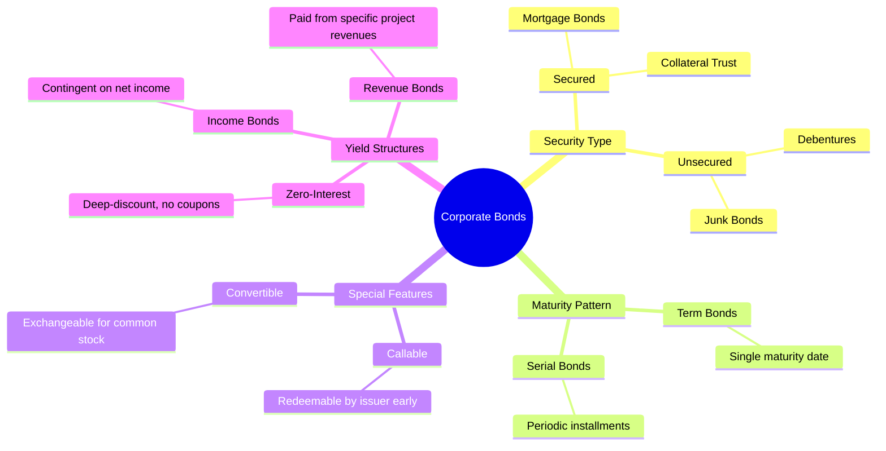
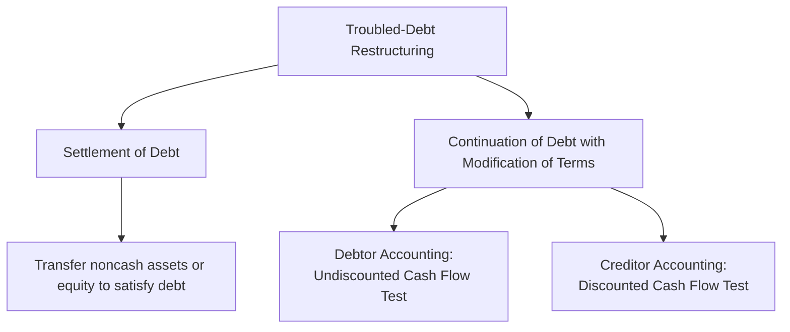

# Long-Term Liabilities (Debt Financing)

> [!abstract] Curriculum & Syllabus Context
>
> - **Course:** ACC 301 Intermediate Accounting
> - **Phase:** Phase 3: Liabilities & Owners' Equity
> - **Target Reading:** Weygandt, Kieso, and Warfield, *Intermediate Accounting*, 18th Edition — **Chapter 13: Long-Term Liabilities** (including IFRS 9)
> - **Syllabus Focus:** Nature and types of bonds payable, pricing and market yield mechanics, effective-interest amortization of discounts and premiums, bonds issued between interest dates, bond issue cost netting, early extinguishment gains/losses, long-term notes payable, installment mortgages, fair value option, and troubled-debt restructurings (ASC 470-60).

---

### 1. Nature, Types, and Pricing of Bonds Payable
#### Conceptual Definition & Valuation Foundation
> [!info] Key Definition
>
> **Long-term liabilities** represent obligations that are not reasonably expected to be liquidated using current assets or through the creation of other current liabilities within one year or the normal operating cycle, whichever is longer. Long-term liabilities are primarily composed of **bonds payable**, **long-term notes payable**, **mortgage obligations**, and **lease liabilities**.
> A **bond** is a contractual financial instrument issued by a corporation or governmental entity that divides a large long-term borrowing into smaller, standardized denominations (typically $\$1,000$ face value per bond). The contract between the issuer and the bondholders is known as the **bond indenture**, which specifies the maturity date, coupon/stated interest rate, interest payment dates, covenants, call/conversion features, and collateral obligations.

#### Classifications of Bonds

#### Mathematical Valuation & Pricing Mechanism
The market price of a bond is determined by the **present value of all future cash flows**, discounted at the prevailing **market rate of interest** (also called the *effective rate* or *effective yield*) on the issue date.

A bond produces two distinct cash flow streams:
1. **Principal (Face Value, $FV$)**: A single sum payable at maturity.
2. **Periodic Cash Interest Payments ($INT$)**: An ordinary annuity paid periodically (typically semiannually) based on the **stated (coupon) interest rate** ($r_{stated}$).

> [!quote] Formula & Derivation: Bond Valuation
>
> $$ INT = \text{Face Value} \times \frac{r_{stated}}{m} $$
> *(where $m$ is the number of interest compounding periods per year)*
> **The Bond Valuation Equation:**
> $$ \text{Price}_{\text{bond}} = FV \times \left( \frac{1}{(1+i)^n} \right) + INT \times \left( \frac{1 - (1+i)^{-n}}{i} \right) $$
> where:
> - $FV = \text{Face or Maturity Value of the Bond}$
> - $i = \frac{\text{Market Rate of Interest per Annum } (r_{market})}{m}$
> - $n = \text{Total Number of Compounding Periods } (\text{Years} \times m)$
> - $INT = \text{Periodic Cash Interest Payment}$

#### Stated Rate vs. Market Rate Trade-offs
> [!warning] Exam Pitfall / Exception
>
> The relationship between the **stated coupon rate** ($r_{stated}$) and the **market effective rate** ($r_{market}$) determines the issuance price:
> 1. **Issued at Par** ($r_{stated} = r_{market}$): The present value of future cash flows equals the face value.
> 2. **Issued at a Discount** ($r_{stated} < r_{market}$): Investors demand a higher yield than the coupon rate. To provide the market yield, the bond sells for *less* than face value. The discount represents an additional borrowing cost realized over the bond's life.
> 3. **Issued at a Premium** ($r_{stated} > r_{market}$): The coupon rate exceeds market yields, attracting high investor demand. The bond sells for *more* than face value. The premium represents a reduction of the net borrowing cost over the bond's life.

---
### 2. Accounting for Bond Issuances & Amortization Mechanics
#### Accounting Methods: Effective-Interest vs. Straight-Line
Under US GAAP (ASC 835-30), the **effective-interest method** is the required method for amortizing bond discounts and premiums because it produces a constant interest rate applied to the carrying amount of the debt at the beginning of each period. The **straight-line method** is permitted only if the resulting amortization does not materially differ from the effective-interest method. Under IFRS (IFRS 9), the effective-interest method is mandatory without exception.

> [!quote] Formula & Derivation: Core Effective-Interest Formulas
>
> For any period $t$:
> 1. **Cash Interest Paid**:
>    $$ \text{Cash Paid}_t = \text{Face Value} \times \frac{r_{stated}}{m} $$
> 2. **Bond Interest Expense**:
>    $$ \text{Interest Expense}_t = \text{Carrying Value}_{t-1} \times \frac{r_{market}}{m} $$
> 3. **Amortization Amount**:
>    $$ \text{Discount Amortized}_t = \text{Interest Expense}_t - \text{Cash Paid}_t $$
>    $$ \text{Premium Amortized}_t = \text{Cash Paid}_t - \text{Interest Expense}_t $$
> 4. **Carrying Value**:
>    $$ \text{Carrying Value}_t = \text{Carrying Value}_{t-1} + \text{Discount Amortized}_t $$
>    $$ \text{Carrying Value}_t = \text{Carrying Value}_{t-1} - \text{Premium Amortized}_t $$

#### Comparative Discount vs. Premium Journal Entries
$$ \begin{array}{llrr}
\textbf{Transaction} & \textbf{Account Titles} & \textbf{Debit (\$)} & \textbf{Credit (\$)} \\
\hline
\textbf{Discount Issuance} & \text{Cash} & \text{[PV Proceeds]} & \\
& \text{Discount on Bonds Payable} & \text{[Difference]} & \\
& \quad \text{Bonds Payable} & & \text{[Face Value]} \\
\hline
\textbf{Discount Period} & \text{Interest Expense} & \text{[CV } \times \text{ Eff. Rate]} & \\
\textbf{Interest Entry} & \quad \text{Discount on Bonds Payable} & & \text{[Exp - Cash]} \\
& \quad \text{Cash (or Interest Payable)} & & \text{[Face } \times \text{ Stated Rate]} \\
\hline \hline
\textbf{Premium Issuance} & \text{Cash} & \text{[PV Proceeds]} & \\
& \quad \text{Premium on Bonds Payable} & & \text{[Difference]} \\
& \quad \text{Bonds Payable} & & \text{[Face Value]} \\
\hline
\textbf{Premium Period} & \text{Interest Expense} & \text{[CV } \times \text{ Eff. Rate]} & \\
\textbf{Interest Entry} & \text{Premium on Bonds Payable} & \text{[Cash - Exp]} & \\
& \quad \text{Cash (or Interest Payable)} & & \text{[Face } \times \text{ Stated Rate]} \\
\hline
\end{array} $$
#### Accounting for Bonds Issued Between Interest Dates
When bonds are issued between interest payment dates, buyers pay the issuer the purchase price of the bonds **plus accrued interest** from the last interest payment date to the date of issue. The buyer is reimbursed for this advance payment when the issuer pays the full periodic interest payment on the next interest date.

$$ \begin{array}{llrr}
\textbf{Account Titles} & & \textbf{Debit (\$)} & \textbf{Credit (\$)} \\
\hline
\text{Cash} & & \text{[PV Proceeds + Accrued Int.]} & \\
\text{Discount on Bonds Payable (if any)} & & \text{[Discount Amount]} & \\
\quad \text{Bonds Payable} & & & \text{[Face Value]} \\
\quad \text{Premium on Bonds Payable (if any)} & & & \text{[Premium Amount]} \\
\quad \text{Interest Expense (or Interest Payable)} & & & \text{[Accrued Interest]} \\
\end{array} $$
#### Accounting for Bond Issue Costs
Under ASC 835-30 and IFRS 9, **bond issue costs** (e.g., legal fees, accounting fees, printing costs, underwriting commissions) are **netted against the initial carrying amount** of the bonds payable rather than recorded as a deferred asset. The reduced initial carrying amount increases the effective-interest rate over the life of the debt.

---
### 3. Extinguishment of Debt
#### Reacquisition before Maturity
**Extinguishment of debt** occurs when a company reacquires its outstanding bonds or debt securities prior to maturity.

> [!quote] Formula & Derivation: Early Extinguishment Gain/Loss
>
> 1. Compute the **Net Carrying Value (NCV)** of the debt on the reacquisition date:
>    $$ \text{NCV} = \text{Face Value} - \text{Unamortized Discount} + \text{Unamortized Premium} - \text{Unamortized Issue Costs} $$
> 2. Compute the **Reacquisition Price**: Total cash paid to extinguish the bonds (including call premiums and redemption expenses, but excluding accrued interest paid).
> 3. Recognize the **Gain or Loss on Extinguishment**:
>    $$ \text{Gain on Extinguishment} = \text{NCV} - \text{Reacquisition Price} \quad (\text{if } \text{NCV} > \text{Reacquisition Price}) $$
>    $$ \text{Loss on Extinguishment} = \text{Reacquisition Price} - \text{NCV} \quad (\text{if } \text{Reacquisition Price} > \text{NCV}) $$

$$ \begin{array}{llrr}
\textbf{Account Titles} & & \textbf{Debit (\$)} & \textbf{Credit (\$)} \\
\hline
\text{Bonds Payable} & & \text{[Face Value]} & \\
\text{Premium on Bonds Payable (if any)} & & \text{[Unamortized Bal.]} & \\
\text{Loss on Redemption of Bonds (if any)} & & \text{[Calculated Loss]} & \\
\quad \text{Discount on Bonds Payable (if any)} & & & \text{[Unamortized Bal.]} \\
\quad \text{Cash} & & & \text{[Reacquisition Price]} \\
\quad \text{Gain on Redemption of Bonds (if any)} & & & \text{[Calculated Gain]} \\
\end{array} $$
#### Refunding and In-Substance Defeasance
> [!warning] Exam Pitfall / Exception
>
> - **Refunding**: The replacement of an existing bond issue with a new bond issue. The gain or loss on the old issue is recognized immediately in income; it CANNOT be deferred or amortized over the life of the new debt.
> - **In-Substance Defeasance**: An arrangement where a debtor places risk-free assets (e.g., U.S. Treasury securities) in an irrevocable trust solely for satisfying the debt service of an outstanding obligation. Under US GAAP (ASC 405-20), in-substance defeasance does **not** constitute an accounting derecognition/extinguishment unless the debtor is legally released from being the primary obligor.

---
### 4. Long-Term Notes Payable & Mortgage Obligations
#### Valuation Principles
Like bonds, long-term notes payable are recorded at the **present value of future cash flows** (principal and interest) discounted at the market rate of interest.
1. **Notes Issued at Face Value**: Stated interest rate equals market rate; present value equals face value.
2. **Zero-Interest-Bearing Notes**: No stated cash interest payments; issued at a discount. The cash received equals the present value of the maturity payment discounted at the implicit interest rate. The discount is amortized to interest expense over the note term using the effective-interest method.
3. **Interest-Bearing Notes with Unreasonable Stated Rates**: When the stated interest rate differs from the prevailing market rate, the note is recorded at present value, and a discount or premium is established and amortized.
#### Notes Exchanged for Property, Goods, or Services (ASC 835-30)
In arm's-length exchanges, the stated interest rate is presumed fair unless:
1. No interest rate is stated.
2. The stated interest rate is unreasonable.
3. The face amount of the note is materially different from the current cash sales price of the property/services or the current fair value of the note.

In such cases, the note is recorded at either the **fair value of the property, goods, or services** received, or the **fair value (present value) of the note**, determined by discounting cash flows using an **imputed interest rate**.
#### Mortgage Notes Payable (Installment Notes)
A **mortgage note payable** is a promissory note secured by a document (mortgage) that pledges real property as collateral. Most mortgage notes require **equal periodic installment payments** consisting of both interest expense and principal reduction.

> [!quote] Formula & Derivation: Installment Amortization
>
> $$ \text{Periodic Payment} = \frac{\text{Initial Loan Principal}}{\text{PVF-OA}_{n, i}} $$
> $$ \text{Interest Component}_t = \text{Unpaid Principal}_{t-1} \times i $$
> $$ \text{Principal Reduction}_t = \text{Periodic Payment} - \text{Interest Component}_t $$
> $$ \text{Unpaid Principal}_t = \text{Unpaid Principal}_{t-1} - \text{Principal Reduction}_t $$

---
### 5. Reporting, Fair Value Option, and Financial Analysis
#### Balance Sheet Presentation & Off-Balance-Sheet Financing
- **Balance Sheet Presentation**: Long-term debt is reported in a separate long-term liabilities section.
- **Maturities Disclosure**: US GAAP requires disclosure of the aggregate maturity amounts and sinking fund requirements for all long-term debt for each of the **next five years** following the balance sheet date.
- **Off-Balance-Sheet Financing**: Attempts to borrow funds or construct assets without recording liabilities on the balance sheet. Regulatory responses (like ASC 842) have brought previously hidden items (e.g., operating leases) onto the balance sheet as Right-of-Use assets and Lease Liabilities.
#### Fair Value Option (ASC 825)
> [!info] Key Definition
>
> Companies may irrevocably elect the **Fair Value Option** for long-term financial liabilities on an instrument-by-instrument basis at initial recognition. The liability is revalued to fair value at each balance sheet date.
> **Income Statement vs. OCI Allocation**:
> 1. **General Market Risk Component**: Changes in fair value attributable to changes in benchmark market interest rates are recognized in **Net Income** (*Unrealized Holding Gain or Loss - Income*).
> 2. **Instrument-Specific Credit Risk Component**: Changes in fair value attributable to changes in the company's own credit risk/creditworthiness are recognized in **Other Comprehensive Income (OCI)** (*Unrealized Holding Gain or Loss - Equity*).

#### Long-Term Solvency Ratios
> [!quote] Formula & Derivation: Solvency Ratios
>
> 1. **Debt to Assets Ratio**: Measures the percentage of total assets funded by creditors:
>    $$ \text{Debt to Assets Ratio} = \frac{\text{Total Liabilities}}{\text{Total Assets}} $$
> 2. **Times Interest Earned Ratio**: Measures the company's ability to cover interest payments out of operating earnings:
>    $$ \text{Times Interest Earned} = \frac{\text{Net Income} + \text{Interest Expense} + \text{Income Tax Expense}}{\text{Interest Expense}} = \frac{\text{EBIT}}{\text{Interest Expense}} $$

---
### 6. Appendix 13A: Troubled-Debt Restructuring
#### Framework & Trigger Conditions
A **troubled-debt restructuring (TDR)** occurs when a creditor, for economic or legal reasons related to a debtor's financial difficulties, grants a concession to the debtor that it would not otherwise consider.

#### Settlement of Debt Accounting
Settlement involves transferring noncash assets (e.g., real estate, equipment) or issuing equity securities to satisfy the debt.

> [!quote] Formula & Derivation: Settlement of Debt
>
> **Debtor Accounting**:
> $$ \text{Gain/Loss on Disposition} = \text{Fair Value of Asset} - \text{Book Value of Asset} $$
> $$ \text{Gain on Restructuring} = \text{Carrying Value of Debt} - \text{Fair Value of Asset/Equity Transferred} $$
> **Creditor Accounting**:
> $$ \text{Loss on Settlement} = \text{Carrying Value of Receivable} - \text{Fair Value Received} $$

$$ \begin{array}{llrr}
\textbf{Account Titles (Debtor)} & & \textbf{Debit (\$)} & \textbf{Credit (\$)} \\
\hline
\text{Notes Payable} & & \text{[Carrying Value]} & \\
\text{Loss on Asset Disposal (if any)} & & \text{[Calculated Loss]} & \\
\quad \text{Asset (or Common Stock/APIC)} & & & \text{[Book Value]} \\
\quad \text{Gain on Asset Disposal (if any)} & & & \text{[Calculated Gain]} \\
\quad \text{Gain on Restructuring of Debt} & & & \text{[Calculated Gain]} \\
\end{array} $$
#### Continuation of Debt with Modification of Terms
Modifications may include: reducing the stated interest rate, extending maturity dates, reducing face value, or forgiving accrued interest.

> [!warning] Exam Pitfall / Exception
>
> **Non-Symmetric Accounting Treatment (Debtor vs. Creditor)**
> US GAAP prescribes highly non-symmetric accounting rules for debtors and creditors under term modifications:
> **Debtor Accounting (Undiscounted Cash Flow Test)**
> Compare **pre-restructuring carrying amount** to the **total UNDISCOUNTED future cash flows**.
> 1. *Case 1: No Gain* ($\text{Undiscounted CFs} \ge \text{Carrying Value}$): No gain recognized. Do not adjust carrying amount. Calculate a new effective-interest rate that equates PV to carrying amount.
> 2. *Case 2: Gain* ($\text{Undiscounted CFs} < \text{Carrying Value}$): Recognize **Gain on Restructuring**. Reduce carrying amount to total undiscounted future cash flows. The new effective-interest rate is **0%** (no interest expense in future periods).
> **Creditor Accounting (Discounted Expected Cash Flow Test)**
> Compare **pre-restructuring carrying amount** with the **PV of expected future cash flows DISCOUNTED at the loan's ORIGINAL effective-interest rate**.
> $$ \text{Creditor Impairment Loss} = \text{Carrying Amount} - \text{PV of Restructured Cash Flows} $$
> The loss is charged to **Bad Debt Expense** and credited to **Allowance for Doubtful Accounts**.

---
### 7. Comprehensive Numerical Walkthroughs
> [!example] Numerical Problem 1: Bond Pricing, Effective-Interest Amortization, and Early Retirement
>
> **Scenario**: On January 1, 2025, Apex Corp. issued $\$1,000,000$ face value of 5-year, $8\%$ bonds. Interest is payable semiannually on June 30 and December 31. On the date of issuance, the market rate of interest for similar bonds was $10\%$. On July 1, 2027 (after 2.5 years / 5 semiannual interest payments), Apex calls and extinguishes the entire bond issue at 101.
> ##### Step 1: Compute Initial Bond Proceeds & Discount
> - $FV = \$1,000,000$
> - Stated semiannual rate = $8\% / 2 = 4\%$
> - Semiannual Cash Interest ($INT$) = $\$1,000,000 \times 4\% = \$40,000$
> - Market semiannual rate ($i$) = $10\% / 2 = 5\%$
> - Total semiannual periods ($n$) = $5 \times 2 = 10$
> $$ PV \text{ of Principal} = \$1,000,000 \times 0.613913 = \$613,913 $$
> $$ PV \text{ of Interest} = \$40,000 \times 7.721735 = \$308,869 $$
> $$ \textbf{Total Selling Price} = \$613,913 + \$308,869 = \mathbf{\$922,782} $$
> $$ \textbf{Initial Discount} = \$1,000,000 - \$922,782 = \mathbf{\$77,218} $$
> $$ \begin{array}{llrr}
> \textbf{Account Titles (Jan 1, 2025)} & & \textbf{Debit (\$)} & \textbf{Credit (\$)} \\
> \hline
> \text{Cash} & & 922,782 & \\
> \text{Discount on Bonds Payable} & & 77,218 & \\
> \quad \text{Bonds Payable} & & & 1,000,000 \\
> \end{array} $$
> ##### Step 2: Amortization Schedule (First 5 Semiannual Periods)
> $$ \begin{array}{cccccc}
> \hline
> \textbf{Period} & \textbf{Date} & \textbf{Cash Paid (4\%)} & \textbf{Interest Exp (5\%)} & \textbf{Discount Amort.} & \textbf{Carrying Value} \\
> \hline
> 0 & 01/01/25 & - & - & - & \$922,782 \\
> 1 & 06/30/25 & \$40,000 & \$46,139 & \$6,139 & \$928,921 \\
> 2 & 12/31/25 & \$40,000 & \$46,446 & \$6,446 & \$935,367 \\
> 3 & 06/30/26 & \$40,000 & \$46,768 & \$6,768 & \$942,135 \\
> 4 & 12/31/26 & \$40,000 & \$47,107 & \$7,107 & \$949,242 \\
> 5 & 06/30/27 & \$40,000 & \$47,462 & \$7,462 & \$956,704 \\
> \hline \hline
> \end{array} $$
> *(Note: Interest Exp = Prev. Carrying Value $\times$ 5%. Discount Amort = Interest Exp - Cash Paid).*
> ##### Step 3: Extinguishment Accounting on July 1, 2027
> - Carrying Value on July 1, 2027 = $\$956,704$
> - Unamortized Discount on July 1, 2027 = $\$1,000,000 - \$956,704 = \$43,296$
> - Reacquisition Price = $\$1,000,000 \times 1.01 = \$1,010,000$
> - **Loss on Extinguishment**:
>   $$ \text{Loss} = \$1,010,000 - \$956,704 = \mathbf{\$53,296} $$
> $$ \begin{array}{llrr}
> \textbf{Account Titles (July 1, 2027)} & & \textbf{Debit (\$)} & \textbf{Credit (\$)} \\
> \hline
> \text{Bonds Payable} & & 1,000,000 & \\
> \text{Loss on Redemption of Bonds} & & 53,296 & \\
> \quad \text{Discount on Bonds Payable} & & & 43,296 \\
> \quad \text{Cash} & & & 1,010,000 \\
> \end{array} $$

---

> [!example] Numerical Problem 2: Troubled-Debt Restructuring (Non-Symmetric Debtor/Creditor Comparison)
>
> **Scenario**: On December 31, 2025, Metro Bank holds a $\$2,000,000, 10\%$ note receivable from Titan Corp., issued at par. Titan is in severe financial distress. Metro Bank agrees to a modification of terms on December 31, 2025:
> 1. Reduce principal from $\$2,000,000$ to $\$1,600,000$.
> 2. Extend maturity date for 3 years (due December 31, 2028).
> 3. Reduce interest rate from $10\%$ to $4\%$ per year, payable annually on December 31.
> ##### Step 1: Debtor Analysis (Titan Corp.)
> 4. **Total Undiscounted Future Cash Flows**:
>    - New Principal = $\$1,600,000$
>    - Annual Cash Interest = $\$1,600,000 \times 4\% = \$64,000$
>    - Total Undiscounted Cash Flows = $\$1,600,000 + (\$64,000 \times 3) = \mathbf{\$1,792,000}$
> 5. **Undiscounted Cash Flow Test**:
>    - Pre-restructure Carrying Value = $\$2,000,000$
>    - Since Undiscounted Cash Flows ($\$1,792,000$) < Carrying Value ($\$2,000,000$), Titan recognizes a **Gain on Restructuring**:
>      $$ \text{Gain} = \$2,000,000 - \$1,792,000 = \mathbf{\$208,000} $$
> 6. **Debtor Carrying Value & Future Interest**:
>    - New carrying value is adjusted to $\$1,792,000$. Effective interest rate is **0%**. Titan records **$\$0$ interest expense** over the next 3 years.
> $$ \begin{array}{llrr}
> \textbf{Account Titles (Titan Corp - Dec 31, 2025)} & & \textbf{Debit (\$)} & \textbf{Credit (\$)} \\
> \hline
> \text{Notes Payable} & & 208,000 & \\
> \quad \text{Gain on Restructuring of Debt} & & & 208,000 \\
> \end{array} $$
> ##### Step 2: Creditor Analysis (Metro Bank)
> 7. **Discounted Expected Cash Flows at Original Effective Rate (10%)**:
>    - $PV \text{ of New Principal} = \$1,600,000 \times 0.751315 = \$1,202,104$
>    - $PV \text{ of New Cash Interest} = \$64,000 \times 2.486852 = \$159,159$
>    - Total PV of Restructured Cash Flows = $\$1,202,104 + \$159,159 = \mathbf{\$1,361,263}$
> 8. **Creditor Impairment Loss**:
>    $$ \text{Impairment Loss} = \$2,000,000 - \$1,361,263 = \mathbf{\$638,737} $$
> $$ \begin{array}{llrr}
> \textbf{Account Titles (Metro Bank - Dec 31, 2025)} & & \textbf{Debit (\$)} & \textbf{Credit (\$)} \\
> \hline
> \text{Bad Debt Expense} & & 638,737 & \\
> \quad \text{Allowance for Doubtful Accounts} & & & 638,737 \\
> \end{array} $$
> 9. **Creditor Schedule for Future Years (Original Rate 10%)**:
>    - *Year 2026*: Cash Received = $\$64,000$; Interest Revenue = $\$1,361,263 \times 10\% = \$136,126$; Increase in Allowance = $\$136,126 - \$64,000 = \$72,126$.
> $$ \begin{array}{llrr}
> \textbf{Account Titles (Metro Bank - Dec 31, 2026)} & & \textbf{Debit (\$)} & \textbf{Credit (\$)} \\
> \hline
> \text{Cash} & & 64,000 & \\
> \text{Allowance for Doubtful Accounts} & & 72,126 & \\
> \quad \text{Interest Revenue} & & & 136,126 \\
> \end{array} $$

---
### 8. Key IFRS vs. US GAAP Differences (IAS 32 / IFRS 9)

| Feature / Issue | US GAAP (ASC 470 / ASC 835 / ASC 825) | IFRS (IAS 32 / IFRS 9) |
| :--- | :--- | :--- |
| **Amortization Method** | Effective-interest method required; straight-line allowed if not materially different. | Effective-interest method mandatory without exception. |
| **Balance Sheet Discount/Premium Presentation** | Reported as contra asset/liability or adjunct account to face value. | Net presentation on statement of financial position (no separate discount/premium accounts). |
| **Bond Issue Costs** | Netted against debt carrying amount and amortized via effective-interest rate. | Same treatment; netted against initial carrying value. |
| **Troubled Debt Restructurings** | Specific non-symmetric rules (undiscounted for debtor gain test vs. discounted for creditor loss). | No distinct TDR category; all restructurings with substantial modification (>10% PV change) are treated as debt extinguishments. |
| **Convertible Debt Accounting** | Recorded entirely as debt; no separation of equity component unless specific cash-settlement rules apply. | Mandatory bifurcation into debt liability component and equity conversion option component. |