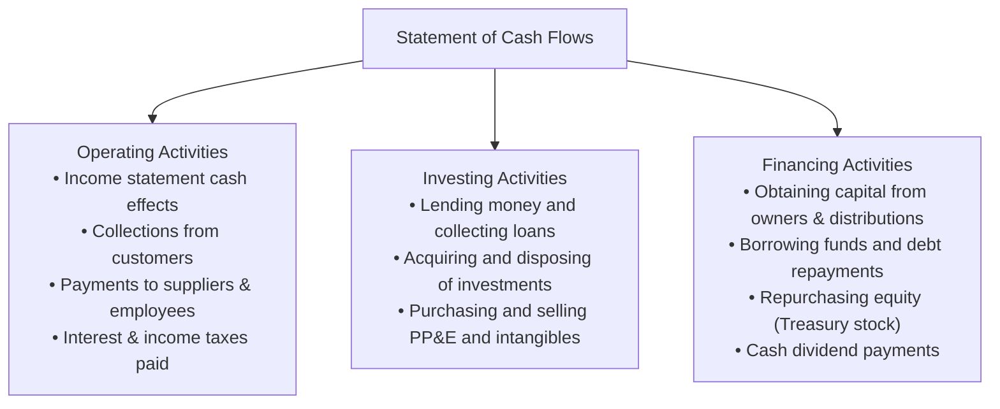
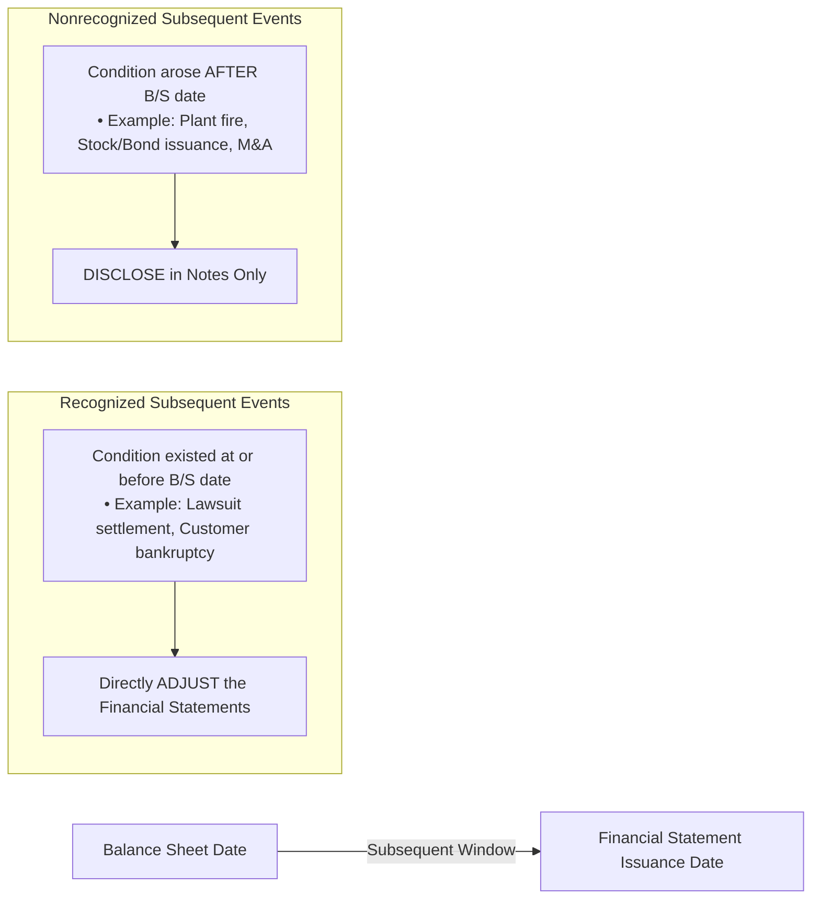

# Financial Statement Presentation, Cash Flows & Full Disclosure

> [!abstract] Curriculum & Syllabus Context
>
> - **Course:** ACC 301 Intermediate Accounting
> - **Phase:** Phase 4: Financial Statement Synthesis & Global Standards
> - **Target Reading:** Weygandt, Kieso, and Warfield, *Intermediate Accounting*, 18th Edition — **Chapters 22 & 23: Statement of Cash Flows and Full Disclosure** (including IAS 1 & IAS 7)
> - **Syllabus Focus:** Statement of cash flows purpose and definitions, operating, investing, and financing activity classifications, indirect vs. direct operating cash flow methods with all reconciliation adjustments, noncash investing/financing disclosures, free cash flow and cash coverage ratios, summary of significant accounting policies, subsequent events (Type 1 recognized vs. Type 2 nonrecognized), segment reporting (10% and 75% tests), and interim financial reporting.

---

### 1. Statement of Cash Flows: Overview, Purpose & Core Framework (ASC 230 / IAS 7)
#### Purpose & Utility
> [!info] Key Definition
>
> The **Statement of Cash Flows** reports the cash receipts, cash payments, and net change in cash and cash equivalents resulting from a company's operating, investing, and financing activities during a specific period. It reconciles the beginning and ending balances of cash and cash equivalents.

While the Income Statement measures profitability on an accrual basis and the Balance Sheet presents financial position at a single point in time, neither provides a comprehensive accounting of cash inflows and outflows. The Statement of Cash Flows bridges this gap, enabling investors and creditors to evaluate:
1. **Liquidity**: The entity's ability to generate future positive net cash flows to meet short-term operational obligations.
2. **Solvency & Financial Flexibility**: The entity's capacity to service long-term debt, pay dividends, and respond to unexpected opportunities or economic downturns.
3. **Quality of Earnings**: The underlying reasons for differences between Net Income (accrual basis) and Net Cash Provided by Operating Activities (cash basis).
4. **Capital Allocation**: The cash effects of both cash and noncash investing and financing transactions during the period.
#### Definition of Cash and Cash Equivalents
* **Cash**: Includes currency on hand and demand deposits in financial institutions (e.g., checking, savings, and money market accounts).
* **Cash Equivalents**: Short-term, highly liquid investments that are both:
  1. Readily convertible to known amounts of cash.
  2. So near their maturity (typically **three months or less** from the date of acquisition) that they present an insignificant risk of changes in value due to interest rate fluctuations (e.g., Treasury bills, commercial paper, and 90-day certificates of deposit).

---
#### The Three-Way Activity Classification Framework

1. **Operating Activities**:
   - Include the cash effects of transactions and events that enter into the determination of **Net Income**.
   - **Cash Inflows**: Cash receipts from sales of goods or services, collections on trade receivables, and receipts of interest revenue and dividend revenue.
   - **Cash Outflows**: Cash payments to suppliers for inventory, to employees for wages/salaries, to government authorities for income taxes, to lenders for interest expense, and for other operating expenses.
2. **Investing Activities**:
   - Include making and collecting loans, and acquiring and disposing of investments (debt and equity securities) and long-lived tangible/intangible assets (Property, Plant, and Equipment).
   - **Cash Inflows**: Principal collections on loans/notes receivable, proceeds from the sale of PP&E, and sales/redemptions of available-for-sale or held-to-maturity debt/equity investments.
   - **Cash Outflows**: Cash spent to purchase PP&E and intangible assets, cash disbursed for loans/notes receivable, and cash paid to acquire debt or equity securities of other entities.
3. **Financing Activities**:
   - Include obtaining resources from owners, providing them with a return on/of their investment, and borrowing money from creditors and repaying amounts borrowed.
   - **Cash Inflows**: Proceeds from issuing common or preferred stock and proceeds from issuing short-term or long-term debt (bonds, mortgage notes, bank loans).
   - **Cash Outflows**: Payment of cash dividends to stockholders, repurchases of common stock (treasury stock transactions), and principal repayments/redemptions of short-term and long-term debt.
#### Significant Noncash Investing and Financing Activities
> [!warning] Exam Pitfall / Exception
>
> Transactions that represent significant investing or financing activities but do **not** involve direct cash receipts or cash payments in the current period must be excluded from the body of the Statement of Cash Flows.
> To satisfy the **Full Disclosure Principle**, these transactions must be presented in a **supplementary schedule** at the bottom of the statement or disclosed in the notes:
> * Acquisition of PP&E or intangibles by issuing stock, notes, or bonds payable.
> * Conversion of convertible bonds or preferred stock into common stock.
> * Nonmonetary asset exchanges (e.g., trading land for a building).
> * Refinancing of long-term debt obligations.

---
### 2. Operating Cash Flow Mechanics: Indirect vs. Direct Method
US GAAP (ASC 230) and IFRS (IAS 7) permit two alternative methods for determining and presenting **Net Cash Flow Provided by (or Used in) Operating Activities**: the **Indirect Method** and the **Direct Method**. The resulting net cash flow from operating activities is mathematically identical under both methods.
#### A. The Indirect Method (Reconciliation Method)
The indirect method starts with accrual-basis **Net Income** and applies a series of adjustments to reconcile it to net operating cash flow.
##### Adjustment Categories:
1. **Add Back Noncash Expenses & Losses**:
   - Depreciation Expense
   - Amortization of Intangible Assets & Lease Right-of-Use Assets
   - Amortization of Bond Discount
   - Impairment Losses on PP&E, Intangibles, or Goodwill
   - Losses on Sale/Disposition of PP&E or Investments
   - Increases in Deferred Tax Liabilities / Decreases in Deferred Tax Assets
   - Bad Debt Expense (or increase in Allowance for Doubtful Accounts)
2. **Deduct Noncash Revenues & Gains**:
   - Amortization of Bond Premium
   - Gains on Sale/Disposition of PP&E or Investments
   - Equity in Net Income of Unconsolidated Investees (under Equity Method)
   - Unrealized Holding Gains on Trading Securities
   - Decreases in Deferred Tax Liabilities / Increases in Deferred Tax Assets
3. **Adjust for Changes in Operating Working Capital Accounts**:
   - **Current Assets**:
     * **Subtract** increases in operating current assets ($\Delta \text{A/R} > 0$, $\Delta \text{Inventory} > 0$, $\Delta \text{Prepaid Expenses} > 0$) because cash outflows exceeded recognized expenses or recorded revenues exceeded cash collections.
     * **Add** decreases in operating current assets because cash collections exceeded recorded revenues or recognized expenses exceeded cash outflows.
   - **Current Liabilities**:
     * **Add** increases in operating current liabilities ($\Delta \text{A/P} > 0$, $\Delta \text{Accrued Expenses} > 0$, $\Delta \text{Taxes Payable} > 0$) because expenses were recognized without immediate cash outflow.
     * **Subtract** decreases in operating current liabilities because cash outflows exceeded recognized current-period expenses.

> [!quote] Formula & Derivation: Master Formula for Indirect Operating Cash Flow
>
> $$ \begin{aligned}
> \text{Net Cash Provided by Operating Activities} &= \text{Net Income} \\
> &\quad + \text{Noncash Expenses (Depreciation, Amortization, Impairments)} \\
> &\quad - \text{Noncash Gains} + \text{Noncash Losses} \\
> &\quad - \Delta \text{Operating Current Assets} \\
> &\quad + \Delta \text{Operating Current Liabilities}
> \end{aligned} $$

---
#### B. The Direct Method (Condensed Cash Receipts and Disbursements)
The direct method adjusts each individual line item of the accrual-basis Income Statement to its direct cash equivalent.

| Accrual Income Statement Line | Direct Cash Equivalent Formula |
| :--- | :--- |
| **Sales Revenue** | $\text{Cash Receipts from Customers} = \text{Sales Revenue} - \Delta\text{A/R} + \Delta\text{Unearned Revenue}$ |
| **Cost of Goods Sold (COGS)** | $\text{Cash Paid to Suppliers} = \text{COGS} + \Delta\text{Inventory} - \Delta\text{A/P}$ |
| **Operating Expenses (SG&A)** | $\text{Cash Operating Expenses} = \text{Expenses (excl. Depr/Amort)} + \Delta\text{Prepaids} - \Delta\text{Accrued Liabilities}$ |
| **Income Tax Expense** | $\text{Cash Taxes Paid} = \text{Tax Expense} - \Delta\text{Taxes Payable} + \Delta\text{DTA} - \Delta\text{DTL}$ |

> [!quote] Formula & Derivation: Direct Method Conversion Formulas
>
> 1. **Cash Receipts from Customers**:
>    $$ \text{Cash Receipts} = \text{Net Sales Revenue} - (\text{Ending A/R} - \text{Beginning A/R}) + (\text{Ending Unearned} - \text{Beginning Unearned}) $$
> 2. **Cash Payments to Suppliers**:
>    $$ \text{Purchases} = \text{Cost of Goods Sold} + (\text{Ending Inventory} - \text{Beginning Inventory}) $$
>    $$ \text{Cash Paid to Suppliers} = \text{Purchases} - (\text{Ending A/P} - \text{Beginning A/P}) $$
> 3. **Cash Payments for Operating Expenses**:
>    $$ \begin{aligned}
>    \text{Cash Operating Expenses} &= \text{Operating Expenses (excl. Depr/Amort)} \\
>    &\quad + (\text{Ending Prepaids} - \text{Beginning Prepaids}) \\
>    &\quad - (\text{Ending Accrued Liabilities} - \text{Beginning Accrued Liabilities})
>    \end{aligned} $$
> 4. **Cash Payments for Income Taxes**:
>    $$ \text{Cash Taxes Paid} = \text{Income Tax Expense} - (\text{Ending Taxes Payable} - \text{Beginning Taxes Payable}) $$

> [!warning] Exam Pitfall / Exception
>
> **US GAAP Supplementary Reconciliation Requirement:** If an entity elects the **Direct Method**, US GAAP mandates that it must provide a **separate supplementary schedule** reconciling Net Income to Net Cash Provided by Operating Activities (effectively reproducing the Indirect Method in the notes).

---
### 3. Financial Statement Analysis: Free Cash Flow & Cash Debt Coverage
#### A. Free Cash Flow (FCF)
Free Cash Flow measures an entity's discretionary cash flow available for investment in growth, debt retirement, share buybacks, or dividend expansions after maintaining existing operational capacity.

> [!quote] Formula & Derivation: Free Cash Flow
>
> $$ \text{Free Cash Flow (FCF)} = \text{Net Cash Provided by Operating Activities} - \text{Capital Expenditures} - \text{Cash Dividends} $$
> * **Capital Expenditures (CapEx)**: Cash outflows required to maintain competitive physical facilities and plant capacity.
> * **Cash Dividends**: Preferred and common dividend distributions expected by equity capital providers.

#### B. Cash Flow Solvency & Liquidity Ratios
> [!quote] Formula & Derivation: Cash Coverage Ratios
>
> **1. Current Cash Debt Coverage Ratio (Short-Term Liquidity)**:
> $$ \text{Current Cash Debt Coverage} = \frac{\text{Net Cash Provided by Operating Activities}}{\text{Average Current Liabilities}} $$
> **2. Cash Debt Coverage Ratio (Long-Term Solvency)**:
> $$ \text{Cash Debt Coverage} = \frac{\text{Net Cash Provided by Operating Activities}}{\text{Average Total Liabilities}} $$

---
### 4. Full Disclosure Principle & Note Disclosures (ASC 235 / ASC 820 / IAS 1)
#### The Full Disclosure Principle
> [!info] Key Definition
>
> The **Full Disclosure Principle** requires that financial reports present all information of sufficient economic significance to influence the evaluation and decisions of an informed user.

##### The Information Spectrum & Trade-offs:
1. **Main Body of Financial Statements**: Formally recognized items that meet element definitions, are measurable with sufficient certainty, and are relevant and reliable.
2. **Notes to Financial Statements**: Amplify, clarify, or explain recognized items, quantitative disaggregations, or unrecognized financial positions.
3. **Supplementary Information**: Quantifiable data of high relevance but lower faithful representation (e.g., oil and gas reserve estimations).

---
#### Major Required Note Disclosures
1. **Summary of Significant Accounting Policies (Note 1 - ASC 235)**:
   - Mandatory first note detailing selection among acceptable alternatives (e.g., inventory cost flow assumptions, depreciation methods, revenue recognition policies, investment valuation methods).
2. **Fair Value Measurement Disclosures (ASC 820 / IFRS 13)**:
   - Valuation inputs prioritized across the Three-Level Fair Value Hierarchy (Level 1 observable active quotes through Level 3 unobservable models).
3. **Related-Party Transactions (ASC 850 / IAS 24)**:
   - Disclosures required when one party exercises significant control or influence over another. Must disclose relationship nature, transaction descriptions, dollar amounts, and open balances.
4. **Subsequent Events (ASC 855 / IAS 10)**:
   - Events occurring between the Balance Sheet date and the financial statement issuance date.

> [!warning] Exam Pitfall / Exception
>
> **Recognized vs. Nonrecognized Subsequent Events:**
> * **Recognized Events**: Provide additional evidence regarding conditions *existing at the balance sheet date*. Requires **direct financial statement adjustment**.
> * **Nonrecognized Events**: Provide evidence regarding conditions that *did not exist at the balance sheet date* but arose subsequently. Requires **note disclosure only**.

---
### 5. Segment Reporting & Interim Reporting (ASC 280 / ASC 270 / IFRS 8)
#### A. Segment Reporting (ASC 280 / IFRS 8)
Conglomerate and diversified corporations must report financial information about operating segments to prevent consolidated totals from obscuring distinct risk and return profiles.

> [!info] Key Definition
>
> An **Operating Segment** is a component of a company that engages in business activities, whose operating results are regularly reviewed by the **Chief Operating Decision Maker (CODM)** to allocate resources and assess performance, and for which discrete financial information is available.

> [!warning] Exam Pitfall / Exception
>
> **Quantitative Materiality Thresholds (The 10% Tests):**
> A segment is a **reportable segment** if it satisfies **at least one** of the following:
> 1. **10% Revenue Test**: Combined external and intersegment revenue $\ge 10\%$ of combined revenue of all operating segments.
> 2. **10% Profit/Loss Test**: Absolute operating profit or loss $\ge 10\%$ of the greater (in absolute amount) of:
>    - Combined operating profit of all profitable segments, or
>    - Combined operating loss of all loss-making segments.
> 3. **10% Asset Test**: Identifiable assets $\ge 10\%$ of combined identifiable assets of all operating segments.
> **The 75% Overall Revenue Test:**
> Total external revenue of all reportable segments must account for **at least 75%** of total consolidated revenue. Additional operating segments must be identified until this threshold is met.

---
#### B. Interim Financial Reporting (ASC 270 / IAS 34)
Interim reports cover reporting periods shorter than a full fiscal year (e.g., quarterly 10-Q reports).
##### Theoretical Frameworks:
1. **Discrete Approach**: Views each interim period as a standalone, distinct accounting period.
2. **Integral Approach (US GAAP Preference)**: Views each interim period as an integral part of the full fiscal year. Accruals, deferrals, and estimated annual effective tax rates are allocated across quarters based on forecasted annual operations.

> [!quote] Formula & Derivation: Interim Tax Expense
>
> $$ \text{YTD Tax Expense} = \text{YTD Pretax Income} \times \text{Estimated Annual Effective Tax Rate} $$

---
### 6. International Standards & Local Regulatory Frameworks
#### A. US GAAP vs. IFRS Comparison

| Reporting Feature | US GAAP (ASC 230 / ASC 280) | IFRS (IAS 1 / IAS 7 / IFRS 8) |
| :--- | :--- | :--- |
| **Interest Paid** | Operating Activity | Operating **OR** Financing Activity |
| **Interest Received** | Operating Activity | Operating **OR** Investing Activity |
| **Dividends Received** | Operating Activity | Operating **OR** Investing Activity |
| **Dividends Paid** | Financing Activity | Operating **OR** Financing Activity |
| **Bank Overdrafts** | Financing Liabilities | Component of Cash Equivalents (if integral part of cash management) |
| **Balance Sheet Presentation** | Order of Liquidity (Current first) | Reverse Order of Liquidity (Noncurrent first standard) |

---
#### B. Bangladesh Corporate Law & Regulatory Gaps
For companies operating in Bangladesh, corporate reporting is governed by national statutory frameworks alongside International Accounting Standards (IAS/IFRS adopted as BRS/BFRS):
1. **The Companies Act, 1994 (Schedule XI)**:
   - **Part I**: Prescribes the statutory format of the Balance Sheet (Statement of Financial Position), mandating asset and liability classifications.
   - **Part II**: Prescribes statutory disclosure requirements for the Profit & Loss Account (Income Statement), including gross turnover, managerial remuneration, material expense disclosures, and auditor fees.
   - **Part III**: Specifies audit and reporting rules for holding and subsidiary corporate structures.
2. **Securities and Exchange Rules, 1987 (Rule 12(2) & Schedules)**:
   - Administered by the **Bangladesh Securities and Exchange Commission (BSEC)** for publicly listed corporations.
   - Mandates preparation of Cash Flow Statements in accordance with IAS 7 / BFRS.
   - Requires annual submission of audited financial statements, quarterly interim reports, and a comprehensive **Corporate Governance Compliance Report** under BSEC Codes.

---
### 7. Comprehensive Numerical Problem Walkthrough
> [!example] Comprehensive Problem: Apex Synthetics Ltd. Cash Flow Construction
>
> **Scenario Data**: Apex Synthetics Ltd. presents the following comparative financial information for the years ended December 31, 2024, and December 31, 2025:
> ##### Comparative Balance Sheets:
> $$ \begin{array}{lrrr}
> \hline
> \textbf{Account Title} & \textbf{Dec 31, 2024 (\$)} & \textbf{Dec 31, 2025 (\$)} & \textbf{Change (\$)} \\
> \hline
> \textbf{Assets:} & & & \\
> \quad \text{Cash \& Cash Equivalents} & 25,000 & 68,000 & +43,000 \\
> \quad \text{Accounts Receivable (Net)} & 45,000 & 72,000 & +27,000 \\
> \quad \text{Inventory} & 80,000 & 115,000 & +35,000 \\
> \quad \text{Prepaid Insurance} & 6,000 & 4,000 & -2,000 \\
> \quad \text{Land} & 100,000 & 160,000 & +60,000 \\
> \quad \text{Equipment} & 220,000 & 310,000 & +90,000 \\
> \quad \text{Less: Accumulated Depreciation — Equipment} & (50,000) & (72,000) & -22,000 \\
> \hline
> \textbf{Total Assets} & \mathbf{426,000} & \mathbf{657,000} & \mathbf{+231,000} \\
> \hline \hline
> \textbf{Liabilities \& Stockholders' Equity:} & & & \\
> \quad \text{Accounts Payable} & 38,000 & 52,000 & +14,000 \\
> \quad \text{Accrued Salaries Payable} & 8,000 & 5,000 & -3,000 \\
> \quad \text{Income Taxes Payable} & 7,000 & 11,000 & +4,000 \\
> \quad \text{Bonds Payable} & 90,000 & 150,000 & +60,000 \\
> \quad \text{Common Stock (\$10 par)} & 200,000 & 260,000 & +60,000 \\
> \quad \text{Retained Earnings} & 83,000 & 179,000 & +96,000 \\
> \hline
> \textbf{Total Liabilities \& Stockholders' Equity} & \mathbf{426,000} & \mathbf{657,000} & \mathbf{+231,000} \\
> \hline \hline
> \end{array} $$
> ##### Income Statement for Year Ended December 31, 2025:
> $$ \begin{array}{lrr}
> \hline
> \multicolumn{3}{c}{\textbf{Apex Synthetics Ltd.}} \\
> \multicolumn{3}{c}{\textbf{Income Statement}} \\
> \multicolumn{3}{c}{\textbf{For the Year Ended December 31, 2025}} \\
> \hline
> \text{Sales Revenue} & & \$620,000 \\
> \text{Cost of Goods Sold} & & (340,000) \\
> \hline
> \textbf{Gross Profit} & & \$280,000 \\
> \text{Operating Expenses (excl. Depreciation)} & \$95,000 & \\
> \text{Depreciation Expense} & 30,000 & \\
> \text{Loss on Sale of Equipment} & 4,000 & (129,000) \\
> \hline
> \textbf{Operating Income} & & \$151,000 \\
> \text{Interest Expense} & & (11,000) \\
> \hline
> \textbf{Income Before Income Taxes} & & \$140,000 \\
> \text{Income Tax Expense} & & (35,000) \\
> \hline
> \textbf{Net Income} & & \mathbf{\$105,000} \\
> \hline \hline
> \end{array} $$
> ##### Additional Transaction Notes:
> 1. Equipment costing $\$30,000$ with accumulated depreciation of $\$8,000$ was sold for $\$18,000$ cash, generating a $\$4,000$ loss.
> 2. New equipment was purchased for $\$120,000$ cash.
> 3. Land costing $\$60,000$ was acquired via direct cash purchase.
> 4. Bonds payable with face value of $\$60,000$ were issued at par for cash.
> 5. Common stock was issued for cash: $\$60,000$ ($6,000$ shares at $\$10$ par).
> 6. Declared and paid cash dividends during 2025: $\$9,000$ ($\text{Net Income } \$105,000 - \Delta\text{Retained Earnings } \$96,000$).
> ---
> ##### Step 1: Operating Activities — Indirect Method
> $$ \begin{array}{lrr}
> \hline
> \multicolumn{3}{c}{\textbf{Cash Flows from Operating Activities (Indirect Method)}} \\
> \hline
> \text{Net Income} & & \$105,000 \\
> \text{Adjustments to reconcile Net Income to Net Operating Cash Flow:} & & \\
> \quad \text{Add: Depreciation Expense} & \$30,000 & \\
> \quad \text{Add: Loss on Sale of Equipment} & 4,000 & \\
> \quad \text{Deduct: Increase in Accounts Receivable} & (27,000) & \\
> \quad \text{Deduct: Increase in Inventory} & (35,000) & \\
> \quad \text{Add: Decrease in Prepaid Insurance} & 2,000 & \\
> \quad \text{Add: Increase in Accounts Payable} & 14,000 & \\
> \quad \text{Deduct: Decrease in Accrued Salaries Payable} & (3,000) & \\
> \quad \text{Add: Increase in Income Taxes Payable} & 4,000 & (11,000) \\
> \hline
> \textbf{Net Cash Provided by Operating Activities} & & \mathbf{\$94,000} \\
> \hline \hline
> \end{array} $$
> ---
> ##### Step 2: Operating Activities — Direct Method
> 7. **Cash Collections from Customers**:
>    $$ \text{Collections} = \$620,000 - \$27,000 (\Delta\text{A/R}) = \mathbf{\$593,000} $$
> 8. **Cash Paid to Suppliers**:
>    $$ \text{Purchases} = \$340,000 (\text{COGS}) + \$35,000 (\Delta\text{Inventory}) = \$375,000 $$
>    $$ \text{Cash Paid to Suppliers} = \$375,000 - \$14,000 (\Delta\text{A/P}) = \mathbf{\$361,000} $$
> 9. **Cash Paid for Operating Expenses**:
>    $$ \text{Cash Operating Exp} = \$95,000 - \$2,000 (\Delta\text{Prepaids}) + \$3,000 (\Delta\text{Accrued Salaries}) = \mathbf{\$96,000} $$
> 10. **Cash Paid for Interest**:
>    $$ \text{Cash Interest Paid} = \mathbf{\$11,000} $$
> 11. **Cash Paid for Income Taxes**:
>    $$ \text{Cash Taxes Paid} = \$35,000 - \$4,000 (\Delta\text{Taxes Payable}) = \mathbf{\$31,000} $$
> $$ \begin{array}{lrr}
> \hline
> \multicolumn{3}{c}{\textbf{Cash Flows from Operating Activities (Direct Method)}} \\
> \hline
> \text{Cash Receipts from Customers} & & \$593,000 \\
> \text{Cash Payments to Suppliers} & \$(361,000) & \\
> \text{Cash Payments for Operating Expenses} & (96,000) & \\
> \text{Cash Payments for Interest} & (11,000) & \\
> \text{Cash Payments for Income Taxes} & (31,000) & (499,000) \\
> \hline
> \textbf{Net Cash Provided by Operating Activities} & & \mathbf{\$94,000} \\
> \hline \hline
> \end{array} $$
> ---
> ##### Step 3: Cash Flows from Investing Activities
> $$ \begin{array}{lrr}
> \hline
> \multicolumn{3}{c}{\textbf{Cash Flows from Investing Activities}} \\
> \hline
> \text{Proceeds from Sale of Equipment} & \$18,000 & \\
> \text{Purchase of Equipment} & (120,000) & \\
> \text{Purchase of Land} & (60,000) & \\
> \hline
> \textbf{Net Cash Used in Investing Activities} & & \mathbf{\$(162,000)} \\
> \hline \hline
> \end{array} $$
> ---
> ##### Step 4: Cash Flows from Financing Activities
> $$ \begin{array}{lrr}
> \hline
> \multicolumn{3}{c}{\textbf{Cash Flows from Financing Activities}} \\
> \hline
> \text{Proceeds from Issuance of Bonds Payable} & \$60,000 & \\
> \text{Proceeds from Issuance of Common Stock} & 60,000 & \\
> \text{Payment of Cash Dividends} & (9,000) & \\
> \hline
> \textbf{Net Cash Provided by Financing Activities} & & \mathbf{\$111,000} \\
> \hline \hline
> \end{array} $$
> ---
> ##### Step 5: Net Change & Cash Reconciliation
> $$ \begin{array}{lr}
> \hline
> \multicolumn{2}{c}{\textbf{Statement of Cash Flows Summary Reconciliation}} \\
> \hline
> \text{Net Cash Provided by Operating Activities} & \$94,000 \\
> \text{Net Cash Used in Investing Activities} & (162,000) \\
> \text{Net Cash Provided by Financing Activities} & 111,000 \\
> \hline
> \textbf{Net Increase in Cash and Cash Equivalents} & \mathbf{\$43,000} \\
> \text{Cash and Cash Equivalents Balance, January 1, 2025} & 25,000 \\
> \hline
> \textbf{Cash and Cash Equivalents Balance, December 31, 2025} & \mathbf{\$68,000} \\
> \hline \hline
> \end{array} $$
> ---
> ##### Step 6: Free Cash Flow Analysis
> $$ \begin{aligned}
> \text{Free Cash Flow} &= \text{Operating Cash Flow} - \text{Capital Expenditures} - \text{Cash Dividends} \\
> &= \$94,000 - \$180,000 (\text{Equipment } \$120,000 + \text{Land } \$60,000) - \$9,000 \\
> &= \mathbf{-\$95,000}
> \end{aligned} $$
> *Interpretation*: While Apex generated strong operational cash flow ($\$94,000$), aggressive capital investment in productive capacity ($\$180,000$) created negative Free Cash Flow ($\mathbf{-\$95,000}$), which was bridged through long-term debt and equity capital raises ($\$120,000$ combined).
