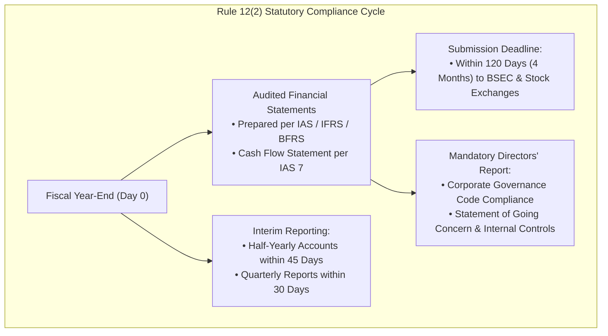

# Bangladesh Statutory Reporting Framework

> [!abstract] Curriculum & Syllabus Context
>
> - **Course:** ACC 301 Intermediate Accounting
> - **Phase:** Phase 4: Financial Statement Synthesis & Global Standards
> - **Target Reading:** **Companies Act, 1994 (Schedule XI)** & **Securities and Exchange Rules, 1987 (Rule 12(2))**
> - **Syllabus Focus:** Companies Act 1994 Schedule XI Part I statutory balance sheet format (Order of Permanence), Part II profit and loss disclosures (raw materials, turnover, managerial remuneration, auditor fees, plant capacity), Part III holding/subsidiary rules, BSEC Rule 12(2) compliance timeline and corporate governance code, and synthesis with IAS/IFRS.

---

### 1. Companies Act, 1994: Schedule XI Framework
> [!info] Key Definition
>
> In Bangladesh, while international standards (IAS/IFRS) are adopted by the Institute of Chartered Accountants of Bangladesh (ICAB), all registered corporate entities are legally bound by **Section 185 and Schedule XI of the Companies Act, 1994**. Schedule XI sets out the minimum statutory requirements for the layout and disclosure of corporate balance sheets and profit & loss accounts.

Schedule XI is divided into three distinct operational parts:
* **Part I**: Prescribed Form and Contents of the Balance Sheet.
* **Part II**: Prescribed Requirements and Disclosures for the Profit and Loss Account.
* **Part III**: Detailed Statutory Rules for Holding and Subsidiary Company Accounts.

---
### 2. Schedule XI, Part I: Statutory Balance Sheet Layout
Under Schedule XI, Part I, corporate balance sheets may be presented in either **horizontal format** or **vertical (statement) format**. The statute mandates the exact order of presentation and grouping of assets and liabilities.

> [!warning] Exam Pitfall / Exception
>
> Under Schedule XI, the presentation order is **opposite to US GAAP**:
> * **Liabilities & Capital** are presented first, beginning with permanent Share Capital down to short-term liabilities.
> * **Assets** are presented starting with long-term Property, Plant, and Equipment down to current, liquid assets (*Order of Permanence*).

#### Statutory Classification Layout (Schedule XI, Part I)
$$ \begin{array}{lrr}
\hline
\multicolumn{3}{c}{\textbf{[Company Name, Limited]}} \\
\multicolumn{3}{c}{\textbf{Balance Sheet as at [Date]}} \\
\hline
\textbf{Capital and Liabilities} & & \textbf{Amount (BDT)} \\
\hline
\textbf{1. Share Capital:} & & \\
\quad \text{Authorized Capital: [X] shares of BDT [Y] each} & & \text{XXX} \\
\cline{3-3}
\quad \text{Issued, Subscribed, and Paid-up Capital:} & & \\
\quad \quad \text{Shares allotted as fully paid up for cash} & \text{XXX} & \\
\quad \quad \text{Shares allotted as fully paid up without payment in cash} & \text{XXX} & \\
\quad \quad \text{Bonus Shares distributed} & \text{XXX} & \text{XXX} \\
\textbf{2. Reserves and Surplus:} & & \\
\quad \text{Capital Reserve / Capital Redemption Reserve} & \text{XXX} & \\
\quad \text{Share Premium Account} & \text{XXX} & \\
\quad \text{General Reserve \& Revenue Surplus (P\&L balance)} & \text{XXX} & \text{XXX} \\
\textbf{3. Secured Loans:} & & \\
\quad \text{Debentures / Bonds (specifying security nature)} & \text{XXX} & \\
\quad \text{Loans and Advances from Banks (secured against hypothecation)} & \text{XXX} & \text{XXX} \\
\textbf{4. Unsecured Loans:} & & \\
\quad \text{Short-term borrowings / Deposits / Other loans} & & \text{XXX} \\
\textbf{5. Current Liabilities and Provisions:} & & \\
\quad \text{Acceptances and Trade Creditors} & \text{XXX} & \\
\quad \text{Unclaimed Dividends} & \text{XXX} & \\
\quad \text{Provision for Taxation} & \text{XXX} & \\
\quad \text{Proposed Dividend} & \text{XXX} & \text{XXX} \\
\hline
\textbf{Total Capital and Liabilities} & & \mathbf{\text{XXXXX}} \\
\hline \hline
& & \\
\textbf{Property and Assets} & & \textbf{Amount (BDT)} \\
\hline
\textbf{1. Fixed Assets (PP\&E):} & & \\
\quad \text{Distinguishing Land, Buildings, Plant, Machinery, Vehicles} & & \\
\quad \text{Gross Historical Cost / Revalued Amount} & \text{XXX} & \\
\quad \text{Add: Additions during the year} & \text{XXX} & \\
\quad \text{Less: Disposals/Deductions during the year} & (\text{XXX}) & \\
\quad \text{Less: Cumulative Depreciation to date} & (\text{XXX}) & \text{XXX} \\
\textbf{2. Investments:} & & \\
\quad \text{Investments in Government Securities} & \text{XXX} & \\
\quad \text{Shares, Debentures, or Bonds of Subsidiaries} & \text{XXX} & \text{XXX} \\
\textbf{3. Current Assets, Loans, and Advances:} & & \\
\quad \textbf{A. Current Assets:} & & \\
\quad \quad \text{Inventories (Stores, Raw Materials, WIP, Finished Goods)} & \text{XXX} & \\
\quad \quad \text{Sundry Debtors (segregated into good, doubtful, bad)} & \text{XXX} & \\
\quad \quad \text{Cash and Bank Balances (distinguishing on-hand vs. bank)} & \text{XXX} & \\
\quad \textbf{B. Loans and Advances:} & & \\
\quad \quad \text{Advances to Employees / Prepayments} & \text{XXX} & \text{XXX} \\
\textbf{4. Miscellaneous Expenditure:} & & \\
\quad \text{Preliminary Expenses / Underwriting Commission (unwritten off)} & & \text{XXX} \\
\hline
\textbf{Total Property and Assets} & & \mathbf{\text{XXXXX}} \\
\hline \hline
\end{array} $$

---
### 3. Schedule XI, Part II: Statutory Profit & Loss Disclosures
Part II of Schedule XI outlines specific disclosures that must appear either on the face of the Profit & Loss Account or in accompanying statutory notes:
1. **Turnover & Sales**: Total gross sales revenue, indicating quantities sold where practicable, disaggregated by major product categories.
2. **Raw Material Consumption**: Total cost of raw materials consumed, disclosing quantities and major imported vs. indigenous categories.
3. **Managerial Remuneration**: Specific disclosure of all remuneration, commissions, bonuses, and perquisites paid to managing directors, directors, and top corporate managers.
4. **Auditor's Remuneration**: Detailed disaggregation of fees paid to statutory auditors:
   - As auditors (Statutory audit fee).
   - For taxation services.
   - For other advisory and certification services.
   - For reimbursement of out-of-pocket expenses.
5. **Industrial Capacity & Production**:
   - Licensed capacity.
   - Installed capacity.
   - Actual operational production during the fiscal period.
6. **Foreign Currency Transactions**: Earnings in foreign exchange classified by export sales, royalties, and fees; expenditures in foreign currency classified by imports of raw materials, capital goods, and foreign travel.

---
### 4. Securities and Exchange Rules, 1987: Rule 12(2) Mandates
For publicly listed companies trading on the **Dhaka Stock Exchange (DSE)** or **Chittagong Stock Exchange (CSE)**, the **Bangladesh Securities and Exchange Commission (BSEC)** imposes strict compliance mandates under **Rule 12(2)**:

#### Key Requirements of Rule 12(2):
1. **Mandatory Reporting Package**: Listed entities must submit to the Commission and Stock Exchanges:
   - Audited Balance Sheet.
   - Audited Profit and Loss Account.
   - **Statement of Cash Flows** (mandatory per IAS 7).
   - Statement of Changes in Equity.
   - Full explanatory notes.
2. **Statutory Submission Timeline**: Complete audited packages must be furnished within **120 days (4 months)** from the close of the financial year.
3. **Statutory Directors' Report Disclosures**:
   - Explanation of significant operational variations between quarterly and annual performance.
   - Disclosure of all related-party transactions.
   - Clear statement of internal accounting control efficiency and going concern validity.
   - **Corporate Governance Compliance Certificate** from a professional practicing Chartered Accountant (CA) or Cost & Management Accountant (CMA).

---
### 5. Synthesis: US GAAP vs. IFRS vs. Bangladesh Companies Act 1994

| Dimension | US GAAP (FASB ASC) | IFRS (IAS 1) | Bangladesh Companies Act, 1994 |
| :--- | :--- | :--- | :--- |
| **Balance Sheet Order** | **Order of Liquidity** (Current Assets $\rightarrow$ Noncurrent Assets) | Flexible (typically **Reverse Liquidity** / Noncurrent first) | **Order of Permanence** strictly mandated (Capital/PP&E first) |
| **Cash Flow Statement** | Mandatory (ASC 230) | Mandatory (IAS 7) | Required by BSEC Rule 12(2) for public companies; optional for small private firms under Act |
| **Statutory Format** | Flexible multi-step format standard | Flexible principles-based formats | **Prescribed Statutory Layout** under Schedule XI (Part I & Part II) |
| **Managerial / Auditor Breakdown** | General footnote disclosures | Related-party disclosures (IAS 24) | **Mandatory statutory line items** for audit, tax, perquisites, and capacity utilization |
