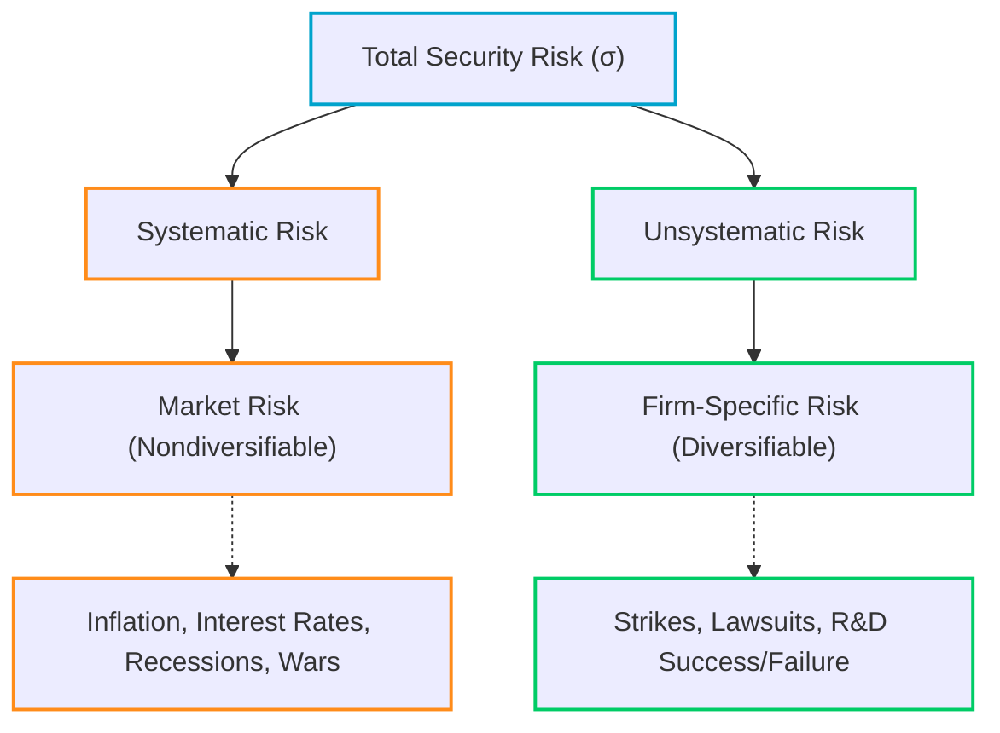

# Risk and Return: Pricing Market Risk

> [!abstract] Curriculum & Syllabus Context
>
> - **Course:** ACC 302 Financial Management
> - **Phase:** Phase 3: Risk and Return (Pricing Market Risk)
> - **Target Reading:** Smart & Zutter (16e) Chapter 8; Van Horne (13e) Chapter 5
> - **Syllabus Focus:** Return and risk definitions, discrete probability distributions, standard deviation, coefficient of variation (CV), Sharpe ratio, two-asset portfolio risk and covariance, systematic vs unsystematic risk, Beta derivation, CAPM equation, SML vs CML, and Alpha stock market equilibrium.

---

### LO 3.1: Fundamentals of Risk & Return for Single Assets

#### 1. Definition of Return and Risk
> [!info] Key Definition: Return & Risk
>
> * **Return ($R$ or $r_t$):** The total gain or loss experienced on an investment over a specified period, expressed as a percentage of its beginning-of-period market price.
> * **Risk:** The variability of actual realized returns around expected returns. The greater the variability/dispersion of possible outcomes, the riskier the asset.

> [!quote] Formula & Derivation: One-Period Return
>
> $$R_t = \frac{D_t + (P_t - P_{t-1})}{P_{t-1}}$$
> where:
> * $D_t$ = Cash distribution / dividend received during time period $t$.
> * $P_t$ = Price (market value) of the asset at the end of period $t$.
> * $P_{t-1}$ = Price (market value) of the asset at the beginning of period $t$ (time $t-1$).

* **Components of Return:**
  1. **Current Yield / Income Yield:** $\frac{D_t}{P_{t-1}}$ (periodic cash flows).
  2. **Capital Gains Yield:** $\frac{P_t - P_{t-1}}{P_{t-1}}$ (change in asset value).

#### 2. Investor Risk Preferences
Investors are generally classified into three risk attitude profiles:
1. **Risk Averse:** Investors who require an increase in expected return as compensation for accepting an increase in risk. Given two assets with equal expected returns, a risk-averse investor will choose the less risky one. (Financial management theory assumes investors are risk-averse on average).
2. **Risk Neutral:** Investors who choose investments strictly based on expected returns, completely disregarding risk.
3. **Risk Seeking:** Investors who prefer investments with greater risk, even if they offer lower expected returns (gambling behavior).

#### 3. Probability Distributions & Stand-Alone Risk
* **Probability ($P_i$ or $Pr_i$):** The quantitative chance that a given outcome will occur ($\sum_{i=1}^n P_i = 1.0$).
* **Discrete Probability Distribution:** A listing of all possible distinct outcomes and their specific probabilities.
* **Continuous Probability Distribution:** A probability distribution where the random variable can take on any value within a continuous range (represented by a smooth bell-shaped curve).
* **Normal Probability Distribution:** A symmetrical bell-shaped curve characterized by its mean ($\bar{r}$) and standard deviation ($\sigma$):
  - **68.26%** of outcomes fall within $\bar{r} \pm 1\sigma$.
  - **95.44%** of outcomes fall within $\bar{r} \pm 2\sigma$.
  - **99.73%** of outcomes fall within $\bar{r} \pm 3\sigma$.

#### 4. Statistical Measures of Stand-Alone Risk

> [!quote] Formula & Derivation: Statistical Risk Measures
>
> * **Expected Rate of Return ($\bar{R}$ or $\hat{r}$):**
>   $$\bar{R} = \sum_{i=1}^{n} R_i \cdot P_i \quad \text{(Historical Mean: } \bar{r}_{\text{avg}} = \frac{\sum_{t=1}^{N} r_t}{N})$$
> * **Variance ($\sigma^2$):**
>   $$\sigma^2 = \sum_{i=1}^{n} (R_i - \bar{R})^2 \cdot P_i \quad \text{(Historical Var: } s^2 = \frac{\sum (r_t - \bar{r}_{\text{avg}})^2}{N - 1})$$
> * **Standard Deviation ($\sigma$):**
>   $$\sigma = \sqrt{\sum_{i=1}^{n} (R_i - \bar{R})^2 \cdot P_i}$$
> * **Coefficient of Variation ($CV$):** (Measures relative risk per unit of return)
>   $$CV = \frac{\sigma}{\bar{R}}$$
> * **Sharpe Ratio:** (Measures excess return per unit of total risk)
>   $$\text{Sharpe Ratio} = \frac{\bar{R} - R_f}{\sigma}$$

---

### LO 3.2: Risk and Return in a Portfolio Context

#### 1. Portfolio Expected Return
* **Portfolio ($p$):** A combination or collection of two or more securities or assets held simultaneously.

> [!quote] Formula & Derivation: Portfolio Expected Return
>
> Portfolio expected return ($\bar{R}_p$ or $\hat{r}_p$) always equals the simple weighted average of the expected returns of the individual securities comprising the portfolio:
> $$\bar{R}_p = \sum_{j=1}^{m} W_j \cdot \bar{R}_j$$
> where $W_j$ is the proportion (weight) of total portfolio dollar value invested in asset $j$, and $\sum_{j=1}^{m} W_j = 1.0$.

#### 2. Portfolio Risk and Covariance
> [!warning] Key Exam Pitfall: Portfolio Risk
>
> Unlike portfolio expected return, **portfolio risk ($\sigma_p$) is generally NOT equal to the weighted average of individual asset standard deviations.** Portfolio risk depends heavily on the co-movement or covariance between security returns.

* **Covariance ($\sigma_{j,k}$ or $\text{Cov}(R_j, R_k)$):** A statistical measure of the degree to which two random variables (security returns) move together.
  $$\sigma_{j,k} = \sum_{i=1}^{n} (R_{j,i} - \bar{R}_j)(R_{k,i} - \bar{R}_k) P_i$$
* **Relationship between Covariance and Correlation Coefficient ($\rho_{j,k}$):**
  $$\sigma_{j,k} = \rho_{j,k} \cdot \sigma_j \cdot \sigma_k \quad \implies \quad \rho_{j,k} = \frac{\sigma_{j,k}}{\sigma_j \sigma_k}$$
  where $\rho_{j,k}$ is the correlation coefficient, bounded strictly between $-1.0$ and $+1.0$.

#### 3. Two-Asset Portfolio Standard Deviation Formula
> [!quote] Formula & Derivation: 2-Asset Risk
>
> $$\sigma_p = \sqrt{W_1^2 \sigma_1^2 + W_2^2 \sigma_2^2 + 2 W_1 W_2 \sigma_{1,2}}$$
> $$\sigma_p = \sqrt{W_1^2 \sigma_1^2 + W_2^2 \sigma_2^2 + 2 W_1 W_2 \sigma_1 \sigma_2 \rho_{1,2}}$$

#### 4. $m$-Asset Portfolio Standard Deviation (Variance-Covariance Matrix)
For an $m$-asset portfolio, the general variance formula is:
$$\sigma_p^2 = \sum_{j=1}^{m} \sum_{k=1}^{m} W_j W_k \sigma_{j,k}$$
- In a portfolio with $m$ assets, there are $m$ variance terms and $m(m-1)$ covariance terms. As $m$ grows large, total portfolio variance is dominated almost entirely by the covariances between assets, not individual asset variances.

#### 5. Role of Correlation in Diversification
* **Perfect Positive Correlation ($\rho = +1.0$):** Returns move in lockstep. $\sigma_p = W_1 \sigma_1 + W_2 \sigma_2$. **No diversification benefit / no risk reduction.**
* **Perfect Negative Correlation ($\rho = -1.0$):** Returns move in exact opposite directions. Risk can be completely eliminated ($\sigma_p = 0$) by choosing optimal weights.
* **Uncorrelated Assets ($\rho = 0.0$):** Risk is significantly reduced, but not completely eliminated.
* **General Diversification Principle ($\rho < +1.0$):** Whenever the correlation coefficient between assets is less than $+1.0$, combining them into a portfolio reduces overall portfolio standard deviation below the weighted average of individual standard deviations ($\sigma_p < \sum W_j \sigma_j$).

---

### LO 3.3: Systematic vs. Unsystematic Risk & Diversification

#### 1. Total Risk Breakdown

#### 2. Unsystematic Risk (Diversifiable / Firm-Specific / Idiosyncratic Risk)
* **Definition:** Risk unique to a specific company or industry, caused by random firm-level events.
* **Elimination:** Unsystematic events occur randomly across companies; negative events in one firm are offset by positive events in another. Holding a well-diversified portfolio of **20 to 30+ randomly selected stocks** effectively eliminates unsystematic risk ($\approx 0$).

#### 3. Systematic Risk (Nondiversifiable / Market Risk)
* **Definition:** Risk stemming from economy-wide factors that simultaneously affect all firms.
* **Impact:** Affects all securities systematically; **cannot be eliminated by diversification**.
* **Relevance to Pricing:** In competitive, efficient markets, rational investors diversify away unsystematic risk. Therefore, **markets compensate investors ONLY for bearing systematic risk**. No risk premium is provided for bearing diversifiable risk.

---

### LO 3.4: Capital Asset Pricing Model (CAPM) & Beta ($\beta$)

#### 1. Beta Coefficient ($\beta_j$): The Metric of Systematic Risk
* **Definition:** A relative index measuring a stock's sensitivity or volatility relative to the overall market portfolio.
* **Mathematical Derivation (Slope of Characteristic Line):**
  Beta is the slope of the linear regression line fitting excess returns of stock $j$ against excess returns of the market portfolio:
  $$\beta_j = \frac{\text{Cov}(R_j, R_m)}{\sigma_m^2} = \rho_{j,m} \frac{\sigma_j}{\sigma_m}$$
* **Interpretation of Beta Values:**
  - $\beta = 1.0$: Asset has average systematic risk; moves in tandem with the market.
  - $\beta > 1.0$: Asset is **aggressive** / more volatile than the market (e.g., tech, luxury goods).
  - $0 < \beta < 1.0$: Asset is **defensive** / less volatile than the market (e.g., utilities, consumer staples).
  - $\beta = 0.0$: Risk-free asset (e.g., U.S. Treasury bills).
  - $\beta < 0.0$: Asset moves inversely to the market (e.g., gold).

#### 2. Portfolio Beta ($\beta_p$)
The beta of a portfolio is strictly the weighted average of the betas of its constituent assets:
$$\beta_p = \sum_{j=1}^{m} W_j \cdot \beta_j$$

#### 3. Capital Asset Pricing Model (CAPM) Equation
> [!quote] Formula & Derivation: CAPM Equation
>
> The CAPM specifies the required rate of return for stock $j$ based on its systematic risk ($\beta_j$):
> $$\bar{R}_j = R_f + \beta_j (\bar{R}_m - R_f)$$
> where:
> * $\bar{R}_j$ = Required (or expected) rate of return on asset $j$.
> * $R_f$ = Risk-free rate of return.
> * $\bar{R}_m$ = Expected return on the market portfolio.
> * $(\bar{R}_m - R_f)$ = **Market Risk Premium ($RP_m$)**.
> * $\beta_j (\bar{R}_m - R_f)$ = **Stock $j$ Risk Premium ($RP_j$)**.

---

### LO 3.5: Security Market Line (SML) vs. Capital Market Line (CML) & Market Equilibrium

#### 1. Security Market Line (SML)
The SML is the graphical representation of the CAPM equation showing required return as a linear function of systematic risk ($\beta$).

![[BBA Study/AI Curated Notes/ACC 302 Financial Management/assets/acc302_security_market_line.svg]]

#### 2. Capital Market Line (CML)
* **Definition:** Shows the equilibrium relationship between expected return and **total risk** ($\sigma_p$) for **fully efficient portfolios**.
* **CML Equation:**
  $$\bar{R}_p = R_f + \left[ \frac{\bar{R}_m - R_f}{\sigma_m} \right] \sigma_p$$

| Feature | Security Market Line (SML) | Capital Market Line (CML) |
| :--- | :--- | :--- |
| **Risk Measure** | Systematic Risk ($\beta$) | Total Risk ($\sigma_p$) |
| **Applicability** | ALL individual assets & portfolios | ONLY efficient portfolios |
| **Slope** | Market Risk Premium ($RP_m = \bar{R}_m - R_f$) | Market Sharpe Ratio ($\frac{\bar{R}_m - R_f}{\sigma_m}$) |
| **Diversification Impact** | Ignores diversifiable risk | Assumes zero diversifiable risk |

#### 3. Dynamic Shifts in the SML
1. **Change in Inflationary Expectations ($\Delta IP$):** An increase in anticipated inflation raises the nominal risk-free rate. Result: **Parallel upward shift** of the entire SML.
2. **Change in Investor Risk Aversion:** An increase in market-wide risk aversion increases the Market Risk Premium. Result: **Rotation/Steepening of the SML** around the fixed $R_f$ intercept.
3. **Change in Asset Beta ($\Delta \beta_j$):** Result: **Movement along the fixed SML**.

#### 4. Stock Market Equilibrium and Alpha ($\alpha$)
* **Equilibrium Condition:** Expected rate of return ($\hat{r}$) equals required rate of return ($r$):
  $$\hat{r}_j = r_j = R_f + \beta_j (\bar{R}_m - R_f)$$
* **Alpha ($\alpha_j$):** The difference between actual/expected return and CAPM required return:
  $$\alpha_j = \hat{r}_j - r_j$$
* **Underpriced / Undervalued Stock ($\alpha > 0$):** Plots **above the SML**. Investor buying pressure bids up stock price, driving down expected return until $\hat{r}_j = r_j$.
* **Overpriced / Overvalued Stock ($\alpha < 0$):** Plots **below the SML**. Investor selling pressure depresses stock price, raising expected return until $\hat{r}_j = r_j$.

---

### High-Yield Numerical Problem Walkthroughs

> [!example] Problem 1: Discrete Single-Asset Expected Return, Volatility & CV
>
> An analyst estimates the following probability distribution for Stock A:
> 
> | Economic State | Probability ($P_i$) | Return ($R_i$) |
> | :--- | :--- | :--- |
> | Recession | 0.20 | -10.0% |
> | Normal | 0.50 | +12.0% |
> | Boom | 0.30 | +20.0% |
> 
> **Calculate:** Expected return ($\bar{R}$), Variance ($\sigma^2$), Standard Deviation ($\sigma$), and Coefficient of Variation ($CV$).
> 
> **Solution:**
> 1. **Expected Return ($\bar{R}$):**
>    $$\bar{R} = (0.20 \times -10\%) + (0.50 \times 12\%) + (0.30 \times 20\%) = -2.0\% + 6.0\% + 6.0\% = 10.0\%$$
> 2. **Variance ($\sigma^2$):**
>    $$\sigma^2 = (-10 - 10)^2(0.20) + (12 - 10)^2(0.50) + (20 - 10)^2(0.30)$$
>    $$\sigma^2 = (-20)^2(0.20) + (2)^2(0.50) + (10)^2(0.30) = 80 + 2 + 30 = 112.0\%^2$$
> 3. **Standard Deviation ($\sigma$):**
>    $$\sigma = \sqrt{112.0} \approx 10.583\%$$
> 4. **Coefficient of Variation ($CV$):**
>    $$CV = \frac{10.583\%}{10.0\%} = 1.0583$$

> [!example] Problem 2: Two-Asset Portfolio Risk & Diversification
>
> An investor places 60% of total capital in Asset X ($\bar{R}_X = 12.0\%$, $\sigma_X = 15.0\%$) and 40% in Asset Y ($\bar{R}_Y = 8.0\%$, $\sigma_Y = 10.0\%$). The correlation coefficient between X and Y is $\rho_{X,Y} = 0.20$.
> 
> **Calculate:** Portfolio Expected Return ($\bar{R}_p$) and Portfolio Standard Deviation ($\sigma_p$).
> 
> **Solution:**
> 1. **Portfolio Expected Return ($\bar{R}_p$):**
>    $$\bar{R}_p = (0.60 \times 12.0\%) + (0.40 \times 8.0\%) = 7.2\% + 3.2\% = 10.4\%$$
> 2. **Portfolio Standard Deviation ($\sigma_p$):**
>    $$\sigma_p = \sqrt{W_X^2 \sigma_X^2 + W_Y^2 \sigma_Y^2 + 2 W_X W_Y \sigma_X \sigma_Y \rho_{X,Y}}$$
>    $$\sigma_p = \sqrt{(0.60)^2 (15)^2 + (0.40)^2 (10)^2 + 2(0.60)(0.40)(15)(10)(0.20)}$$
>    $$\sigma_p = \sqrt{(0.36 \times 225) + (0.16 \times 100) + (14.4)}$$
>    $$\sigma_p = \sqrt{81 + 16 + 14.4} = \sqrt{111.4} \approx 10.55\%$$
>    *(Note: $\sigma_p = 10.55\%$ is lower than the weighted average standard deviation of $13.0\%$, demonstrating risk reduction through diversification).*

> [!example] Problem 3: Portfolio Beta Adjustment
>
> A money manager controls a $\$4,000,000$ portfolio consisting of 4 stocks:
> * Stock A: $\$400,000$ ($\beta_A = 1.50$)
> * Stock B: $\$600,000$ ($\beta_B = -0.50$)
> * Stock C: $\$1,000,000$ ($\beta_C = 1.25$)
> * Stock D: $\$2,000,000$ ($\beta_D = 0.75$)
> 
> **Calculate:**
> 1. Portfolio Beta ($\beta_p$).
> 2. Required rate of return if $R_f = 6.0\%$ and $\bar{R}_m = 14.0\%$.
> 3. New portfolio beta if Stock B is sold and replaced with $\$600,000$ of Stock E ($\beta_E = 1.75$).
> 
> **Solution:**
> 4. **Portfolio Beta ($\beta_p$):**
>    $$W_A = 0.10, \quad W_B = 0.15, \quad W_C = 0.25, \quad W_D = 0.50$$
>    $$\beta_p = (0.10 \times 1.50) + (0.15 \times -0.50) + (0.25 \times 1.25) + (0.50 \times 0.75)$$
>    $$\beta_p = 0.150 - 0.075 + 0.3125 + 0.375 = 0.7625$$
> 5. **Portfolio Required Return ($r_p$):**
>    $$r_p = 6.0\% + 0.7625(14.0\% - 6.0\%) = 6.0\% + 6.10\% = 12.10\%$$
> 6. **New Portfolio Beta ($\beta_{p,\text{new}}$):**
>    $$\beta_{p,\text{new}} = \beta_p - (W_B \cdot \beta_B) + (W_B \cdot \beta_E)$$
>    $$\beta_{p,\text{new}} = 0.7625 - (0.15 \times -0.50) + (0.15 \times 1.75) = 1.10$$