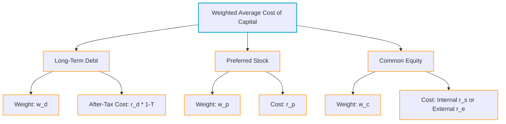

# Cost of Capital: Establishing the Hurdle Rate

> [!abstract] Curriculum & Syllabus Context
>
> 
> - **Course:** ACC 302 Financial Management
> - **Phase:** Phase 4: Cost of Capital (Establishing the Hurdle Rate)
> - **Target Reading:** Smart & Zutter (16e) Chapter 9; Van Horne (13e) Chapter 15
> - **Syllabus Focus:** Capital components, target capital structure weights, before-tax and after-tax cost of debt, cost of preferred stock, cost of retained earnings (CAPM, DCF, Bond-Yield-Plus-Risk-Premium), cost of new equity and flotation costs, retained earnings breakpoint, WACC, and MCC-IOS schedule intersection.

---

### LO 4.1: Overview of the Cost of Capital & Capital Components

#### 1. Definition and Fundamental Purpose
> [!info] Key Definition: Cost of Capital
>
> 
> **Cost of Capital:** The required rate of return that a firm must earn on its long-term investments in order to satisfy the expectations of its investors (bondholders, preferred stockholders, and common shareholders) and maintain the market value of its stock.

* **Role as a Hurdle Rate:** In capital budgeting decisions, the overall cost of capital serves as the benchmark or "hurdle rate." Projects with expected returns exceeding the cost of capital create positive Net Present Value ($NPV$), thereby increasing shareholder wealth. Projects earning less than the cost of capital destroy value.
* **Basic Premise:** The cost of capital is fundamentally an **opportunity cost**. It represents the return investors could earn on alternative investments of equivalent risk in the financial markets.

#### 2. Capital Components (WACC Breakdown)

* **Major Components Included:**
  1. **Long-Term Debt:** Outstanding corporate bonds and long-term bank loans.
  2. **Preferred Stock:** Perpetual or callable preferred shares.
  3. **Common Stock Equity:** Internal equity (retained earnings) and external equity (new common stock issues).
* **Exclusion of Spontaneous Liabilities:** Accounts payable, accruals (accrued wages/taxes), and deferred items are **excluded** from capital component cost calculations. Spontaneous short-term liabilities arise automatically from day-to-day operations and are accounted for by deducting them from current assets when computing Net Operating Working Capital ($NOWC$), rather than including them as explicit investor capital components in WACC.

#### 3. Capital Structure Weights: Book Value vs. Market Value vs. Target Weights
* **Book Value Weights:** Derived directly from the historical balance sheet balances. *Flaw:* Historical accounting costs do not reflect the current market value of investor claims or the actual opportunity cost.
* **Market Value Weights:** Calculated using the current market prices of the firm's securities multiplied by the total quantity of securities outstanding. *Advantage:* Reflects the true economic value of investor commitments.
* **Target Capital Structure Weights (The Theoretical Standard):** The ideal mix of debt, preferred stock, and common equity that the firm intends to raise to fund future long-term projects over time.

> [!warning] Key Exam Pitfall: Target vs. Historical Weights
>
> 
> **Always use Target Capital Structure Weights** (expressed in market value terms) when calculating WACC for forward-looking capital budgeting analysis. Never use historical book values if target/market data is available.

---

### LO 4.2: Component Cost of Long-Term Debt ($r_d$)

#### 1. Before-Tax Cost of Debt ($r_d$)
* **Definition:** The interest rate the firm must pay on **new** (marginal) long-term debt under prevailing financial market conditions.
* **Estimation Methods:**
  1. **Yield to Maturity (YTM):** The YTM on the firm's existing, noncallable, long-term bonds serves as the most accurate measure of $r_d$.
  2. **Market Yield Quotations:** Observing yields on newly issued bonds of competitor firms possessing identical credit ratings.
  3. **Investment Banker Quotes:** Direct quotes from underwriters indicating the interest rate required to float a new debt issue.

> [!warning] Key Exam Pitfall: Historical Coupon Rates
>
> 
> The historical/embedded coupon rate on past debt is completely **irrelevant** for capital budgeting because the cost of capital represents the cost of *new* marginal funds raised for new projects. Always use YTM.

#### 2. After-Tax Cost of Debt ($r_d(1-T)$)
* **Tax Deductibility of Interest:** Interest paid on corporate debt is a tax-deductible operating expense under corporate tax law, whereas preferred and common stock dividends are paid out of after-tax net income.

> [!quote] Formula & Derivation: After-Tax Cost of Debt
>
> 
> $$\text{After-Tax Cost of Debt} = r_d - \text{Tax Savings} = r_d - r_d T = r_d(1 - T)$$
> *Where:*
> * $r_d$ = Before-tax component cost of new debt (YTM)
> * $T$ = Marginal federal-plus-state corporate income tax rate

* **Economic Effect:** The tax deduction creates an "interest tax shield," effectively subsidizing a portion of the interest payment. Thus, the effective after-tax cost of debt is significantly lower than its nominal interest rate.
* **Limitation:** The tax deduction applies only if the firm generates sufficient taxable operating income ($EBIT$) to absorb the interest deduction.

#### 3. Flotation Costs on Debt
* When a firm uses investment bankers to issue new public debt, flotation costs ($F$) are incurred.
* If flotation costs are material, the net price received by the firm per bond ($P_n = P_0 - F$) replaces the market price ($P_0$) when solving for the internal rate of return / YTM ($r_d$) across the bond's maturity payment schedule.

---

### LO 4.3: Component Cost of Preferred Stock ($r_p$)

#### 1. Characteristics & Preferred Dividend Claims
* Preferred stock is a hybrid security paying a fixed periodic dividend ($D_p$).
* **No Tax Deductibility:** Unlike bond interest, preferred stock dividends are **not** tax-deductible for the issuing corporation. Therefore, no tax adjustment factor is applied to preferred stock costs.
  $$\text{After-Tax Cost of Preferred Stock} = r_p$$

#### 2. Mathematical Valuation & Yield Formula
For perpetual preferred stock paying a constant dividend $D_p$ and selling at net proceeds per share $P_p$:

> [!quote] Formula & Derivation: Cost of Preferred Stock
>
> 
> $$r_p = \frac{D_p}{P_p}$$
> *Where:*
> * $D_p$ = Annual preferred dividend per share ($\text{Par Value} \times \text{Stated Preferred Dividend \%}$)
> * $P_p$ = Net proceeds per share received by the firm ($P_0 - \text{Flotation Cost}$)

#### 3. Corporate Investor Tax Attraction
* While preferred stock lacks tax deductibility for the *issuer*, corporate *buyers* of preferred stock enjoy a corporate dividend exclusion (historically 70%).
* This tax shelter makes preferred stock attractive to institutional corporate buyers, driving down the pretax yield on preferred stock relative to corporate bonds of equivalent risk.

---

### LO 4.4: Cost of Internal Equity / Retained Earnings ($r_s$)

#### 1. The Opportunity Cost Principle
* Retained earnings represent net earnings after taxes and preferred dividends that management chooses to reinvest in the business rather than pay out as cash dividends to common stockholders.
* **Why Retained Earnings Are NOT Free:** After-tax net income belongs entirely to common stockholders. If management retains these funds, stockholders forfeit the opportunity to receive those funds as cash dividends and invest them in alternative securities of equal risk. 
* **Rule:** The cost of retained earnings ($r_s$) equals the required rate of return demanded by the firm's common stockholders.

#### 2. Method 1: The Capital Asset Pricing Model (CAPM) Approach
> [!quote] Formula & Derivation: CAPM Approach
>
> 
> $$r_s = r_{RF} + (r_M - r_{RF})b_i = r_{RF} + (RP_M)b_i$$
> *Where:*
> * $r_{RF}$ = Risk-free rate (e.g., 10-year U.S. Treasury bond yield)
> * $b_i$ = Firm's Beta coefficient (systematic risk)
> * $RP_M$ = Market Risk Premium ($r_M - r_{RF}$)

* **Pros & Cons:** Most widely used method in corporate practice. However, estimates can vary based on whether short-term or long-term Treasury rates are used, and historical betas may not perfectly predict future risk.

#### 3. Method 2: Discounted Cash Flow (DCF) / Dividend-Yield-Plus-Growth Approach
Based on the Constant-Growth Gordon Model ($P_0 = \frac{D_1}{r_s - g}$):

> [!quote] Formula & Derivation: DCF Approach
>
> 
> $$r_s = \hat{r}_s = \frac{D_1}{P_0} + \text{Expected } g$$
> *Where:*
> * $\frac{D_1}{P_0}$ = Expected Dividend Yield
> * $g$ = Sustainable constant dividend growth rate ($\text{ROE} \times \text{Retention Rate } b$)

* **Pros & Cons:** Directly reflects equity market pricing and cash flows. However, it assumes a constant perpetual growth rate ($g$) and requires a dividend-paying firm.

#### 4. Method 3: Bond-Yield-Plus-Risk-Premium Approach
A subjective, practical approach used when reliable market equity data or CAPM inputs are unavailable (e.g., closely held/private firms). Empirical studies show that the risk premium on a firm's common stock over its own long-term bonds historically ranges between 3% and 5%.

> [!quote] Formula & Derivation: Bond-Yield-Plus-Risk-Premium
>
> 
> $$r_s = \text{Own Long-Term Bond Yield } (r_d) + \text{Judgmental Equity Risk Premium } (3\% \text{ to } 5\%)$$

* **Averaging Alternative Estimates:** Financial managers typically evaluate all three methods to establish a reasonable range for $r_s$ and select a single point estimate within the consensus range.

---

### LO 4.5: Cost of External Common Equity ($r_e$), Flotation Costs, & Breakpoints

#### 1. Why External Equity Costs More Than Internal Equity
* When a firm exhausts its retained earnings and must issue **new common stock** (external equity), it incurs significant investment banking underwriting fees, legal fees, and market underpricing.
* These fees are collectively called **Flotation Costs ($F$)**.
* Because the firm receives only net proceeds ($P_0(1 - F)$) per share, each dollar raised must work harder to deliver the same required return to new shareholders.

#### 2. Constant-Growth DCF Model Adjusted for Flotation Costs ($r_e$)
> [!quote] Formula & Derivation: Cost of New Equity
>
> 
> $$r_e = \frac{D_1}{P_0(1 - F)} + g$$
> *Where:*
> * $F$ = Percentage flotation cost required to issue new stock (expressed as a decimal)
> * $P_0(1 - F)$ = Net proceeds per share received by the firm

#### 3. Flotation Cost Adjustment
> [!quote] Formula & Derivation: Flotation Adjustment
>
> 
> $$\text{Flotation Adjustment} = r_e - r_s = \left[ \frac{D_1}{P_0(1 - F)} + g \right] - \left[ \frac{D_1}{P_0} + g \right] = \frac{D_1}{P_0(1 - F)} - \frac{D_1}{P_0}$$
This dollar percentage adjustment is added to the firm's overall required return on equity ($r_s$) to establish $r_e$.

#### 4. Retained Earnings Breakpoint ($\text{BP}_{RE}$)
> [!info] Key Definition: Retained Earnings Breakpoint
>
> 
> The maximum total amount of new capital (from all financing sources combined) that the firm can raise before its retained earnings are completely exhausted and it is forced to issue new, more expensive common stock.

> [!quote] Formula & Derivation: Breakpoint Formula
>
> 
> $$\text{Retained Earnings Breakpoint } (\text{BP}_{RE}) = \frac{\text{Addition to Retained Earnings for the Year}}{\text{Target Equity Fraction } (w_c)}$$

---

### LO 4.6: Weighted Average Cost of Capital (WACC)

#### 1. The Composite WACC Equation
Combining the target weights and component costs of debt, preferred stock, and common equity yields the weighted average cost of capital:

> [!quote] Formula & Derivation: WACC Equation
>
> 
> $$WACC = w_d r_d (1 - T) + w_p r_p + w_c r_s$$
> *(If new common stock must be issued beyond the Retained Earnings Breakpoint, $r_e$ replaces $r_s$.)*
> 
> *Where:*
> * $w_d, w_p, w_c$ = Target capital structure proportions ($w_d + w_p + w_c = 1.0$)
> * $r_d(1 - T)$ = After-tax cost of long-term debt
> * $r_p$ = Cost of preferred stock
> * $r_s$ = Cost of retained earnings (internal equity)

#### 2. Factors Influencing WACC
* **Factors Beyond Firm Control:**
  1. *Interest Rates in the Economy:* Rising risk-free rates increase $r_d$ and $r_s$, pushing up WACC.
  2. *General Level of Stock Prices:* A falling stock market lowers stock prices ($P_0$), increasing dividend yields ($\frac{D_1}{P_0}$) and the cost of equity.
  3. *Tax Rates:* Higher corporate tax rates ($T$) lower the after-tax cost of debt $r_d(1-T)$, reducing WACC.
* **Factors Within Firm Control:**
  1. *Capital Structure Policy:* Changing target weights ($w_d, w_p, w_c$). Increasing debt initially lowers WACC, but excessive debt raises financial distress risk, spiking both $r_d$ and $r_s$.
  2. *Dividend Payout Policy:* Higher payout ratios leave less retained earnings, forcing the firm to reach its Retained Earnings Breakpoint sooner and incur higher $r_e$.
  3. *Investment / Business Risk Policy:* Investing in higher-risk assets increases the firm's business risk ($\beta$), elevating both $r_d$ and $r_s$.

---

### LO 4.7: Marginal Cost of Capital (MCC) & Investment Opportunity Schedule (IOS)

#### 1. Marginal Cost of Capital (MCC) and IOS Intersection
* **MCC Schedule:** A step-up graph showing the firm's WACC at different total amounts of new capital raised. The curve steps up at breakpoints (e.g., the Retained Earnings Breakpoint) when cheaper sources of capital are exhausted.
* **IOS Schedule:** A downward-stepping rank of the firm's available capital budgeting projects, ordered from highest rate of return (IRR) to lowest.
* **Optimal Capital Budget:** The intersection of the upward-sloping MCC schedule and the downward-sloping IOS schedule defines the Optimal Capital Budget (total dollar volume of investment) and the Marginal Hurdle Rate.

![[BBA Study/AI Curated Notes/ACC 302 Financial Management/assets/acc302_mcc_ios_schedule.svg]]

#### 2. Risk-Adjusted Costs of Capital (RADRs) for Projects of Differing Risk
* **The Single Hurdle Rate Fallacy:** Applying the composite corporate WACC to *all* projects regardless of risk causes severe capital misallocation:
  * *High-risk projects* with returns above corporate WACC (but below their risk-adjusted required return) will be incorrectly **accepted**.
  * *Low-risk projects* with returns below corporate WACC (but above their risk-adjusted required return) will be incorrectly **rejected**.

> [!quote] Formula & Derivation: Risk-Adjusted Hurdle Rate
>
> 
> $$\text{Project Hurdle Rate } (RADR) = \text{Corporate WACC} \pm \text{Risk Adjustment Factor } (\Delta r)$$
> * *High-Risk Category:* $WACC + 2\% \text{ to } 5\%$
> * *Average-Risk Category:* Composite Corporate $WACC$
> * *Low-Risk Category:* $WACC - 2\% \text{ to } 3\%$

---

### LO 4.8: High-Yield Numerical Problem Walkthroughs

> [!example] Problem 1: Calculating Cost of Equity via CAPM, DCF, and Bond-Yield-Plus-Risk-Premium
>
> 
> **Data:** $P_0 = \$23.00$, $D_0 = \$2.00$, $D_1 = \$2.14$, $g = 7\%$, $b = 1.6$, $r_{RF} = 9\%$, $r_M = 13\%$, Bond Yield $r_d = 12\%$, Judgmental Risk Premium = 4%.
> 
> **Calculations:**
> 1. **CAPM Approach:**
>    $$r_s = r_{RF} + (r_M - r_{RF})b = 9\% + (13\% - 9\%)(1.6) = 9\% + (4\%)(1.6) = 9\% + 6.4\% = 15.4\%$$
> 2. **DCF Approach:**
>    $$r_s = \frac{D_1}{P_0} + g = \frac{\$2.14}{\$23.00} + 0.07 = 9.30\% + 7\% = 16.30\%$$
> 3. **Bond-Yield-Plus-Risk-Premium Approach:**
>    $$r_s = r_d + \text{Risk Premium} = 12\% + 4\% = 16.0\%$$
> 4. **Average Estimate:**
>    $$\text{Average } r_s = \frac{15.4\% + 16.30\% + 16.0\%}{3} = 15.90\%$$

> [!example] Problem 2: WACC & Retained Earnings Breakpoint Calculation
>
> 
> **Data:** Target structure: 40% Debt, 60% Common Equity.
> * Before-tax cost of debt ($r_d$) = 12%, Tax rate ($T$) = 40% $\rightarrow$ After-tax $r_d(1-T) = 12\%(1 - 0.40) = 7.2\%$.
> * Current stock price $P_0 = \$22.50$, $D_0 = \$2.00$, $g = 7\%$.
> * Expected Addition to Retained Earnings = $\$66 \text{ Million}$.
> 
> **Calculations:**
> 1. **Cost of Common Equity ($r_s$):**
>    $$D_1 = \$2.00(1.07) = \$2.14$$
>    $$r_s = \frac{D_1}{P_0} + g = \frac{\$2.14}{\$22.50} + 0.07 = 9.51\% + 7\% = 16.51\%$$
> 2. **WACC using Retained Earnings:**
>    $$WACC = w_d r_d(1-T) + w_c r_s = 0.40(7.2\%) + 0.60(16.51\%) = 2.88\% + 9.91\% = 12.79\%$$
> 3. **Retained Earnings Breakpoint:**
>    $$\text{BP}_{RE} = \frac{\$66\text{ Million}}{0.60} = \$110.0\text{ Million}$$
>    *(Interpretation: The firm can raise up to $110 Million in total new capital before WACC jumps due to flotation costs on new equity).*
