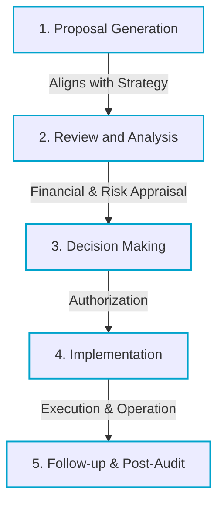

# Capital Budgeting Decisions: Long-Term Asset Investment

> [!abstract] Curriculum & Syllabus Context
>
> - **Course:** ACC 302 Financial Management
> - **Phase:** Phase 5: Capital Budgeting Decisions (Long-Term Asset Investment)
> - **Target Reading:** Smart & Zutter (16e) Chapters 10, 11 & 12; Van Horne (13e) Chapters 12, 13 & 14
> - **Syllabus Focus:** Capital budgeting steps, project classifications, relevant incremental cash flows, sunk vs opportunity costs, initial outlay, operating cash flows, terminal cash flows, evaluation techniques (PBP, DPBP, NPV, IRR, PI, MIRR), NPV profiles and crossover rates, unequal lives (Replacement Chain & EAA), and real options.

---

### LO 5.1: Concept, Importance, Steps, and Project Classifications in Capital Budgeting

#### 1. Concept and Strategic Importance of Capital Budgeting
> [!info] Key Definition: Capital Budgeting
>
> **Capital budgeting** is the process of evaluating, screening, and selecting long-term capital investments whose cash flows, costs, and returns extend beyond a single operating period or year.

* **Role in Firm Value:** Long-term assets define the operational foundation and risk profile of the firm. Because capital outlays are typically massive and largely irreversible, capital budgeting decisions directly dictate whether a firm creates or destroys shareholder value.
* **Key Distinction from Operational Decisions:** Unlike short-term working capital decisions, capital expenditures involve multi-year commitments of capital that carry substantial opportunity costs and structural operational leverage.

#### 2. The Five Steps in the Capital Budgeting Process

1. **Proposal Generation:** Capital investment ideas are generated across all administrative and operational levels of the firm (e.g., R&D, marketing, engineering, production) consistent with long-term strategic objectives.
2. **Review and Analysis:** Financial analysts conduct formal financial and strategic appraisals to estimate incremental cash flows, evaluate project risk, and apply quantitative decision criteria.
3. **Decision Making:** Capital expenditure choices are authorized according to corporate governance dollar thresholds (e.g., plant managers approve small equipment replacements; executive committees or the Board of Directors approve major expansions).
4. **Implementation:** Capital is disbursed, and physical assets are acquired, constructed, or installed. Large-scale capital projects are frequently executed in distinct stages.
5. **Follow-up & Post-Audit:** Implemented projects are continuously monitored. Actual operating cash flows are compared against initial forecasted projections to improve future estimation accuracy and trigger real option execution (expansion, contraction, or abandonment) if necessary.
#### 3. Classification of Capital Budgeting Projects
Projects are categorized into distinct administrative classes to dictate the level of financial scrutiny required:
* **Replacement (Maintenance / Cost Reduction):** Expenditures to replace worn-out equipment or upgrade serviceable but obsolete assets with modern, cost-reducing technology. Requires moderate to high technical analysis.
* **Expansion (Existing Products or New Markets):** Outlays to increase output of current product lines or expand distribution networks into new geographic territories. Requires detailed demand forecasting and high-level authorization.
* **Research and Development (R&D) & Innovation:** High-risk investments in proprietary technology, product development, or patent acquisition.
* **Safety, Environmental, and Mandatory Regulatory Projects:** Expenditures required by government mandates, environmental laws, or workplace safety standards. Often evaluated on a cost-effectiveness basis rather than direct revenue generation.

---
### LO 5.2: Capital Budgeting Cash Flow Estimation & Relevant Principles
#### 1. The Primacy of Cash Flows vs. Accounting Income
* **Cash vs. Accrual Income:** Value is created by realized cash flows, not accounting net income. Accounting income uses accrual matching principles that obscure actual cash timing and non-cash charges.
* **Reinvestment Ability:** Only free cash flow can be deposited, reinvested in new capital assets, or distributed to capital providers (debtholders and equity holders).
#### 2. Fundamental Principles for Estimating Relevant Cash Flows
> [!quote] Formula & Derivation: Incremental Cash Flows
>
> Represents the net change in total corporate cash flows that occurs *if and only if* a project is accepted:
> $$\text{Incremental Project Cash Flow} = \text{Corporate Cash Flow}_{\text{With Project}} - \text{Corporate Cash Flow}_{\text{Without Project}}$$

* **After-Tax Basis:** All revenues, operating expenses, tax shields, and salvage values must be evaluated after deducting applicable corporate income taxes.
* **Separation of Investment and Financing Decisions:** Project cash flows represent operating cash flows generated by assets. **Interest expenses, debt principal repayments, and cash dividends are excluded** from cash flow projections. Financing costs are captured entirely in the discount rate $WACC$ used to discount the cash flows.
#### 3. Handling Specific Cost & Revenue Categories
> [!warning] Key Exam Pitfall: Sunk Costs vs. Opportunity Costs
>
> **Sunk Costs are IRRELEVANT:** Outlays that have already been incurred or committed in the past (e.g., historical R&D, site feasibility studies) cannot be recovered regardless of the decision. They must be completely excluded.
> **Opportunity Costs are RELEVANT:** The highest cash return that could be generated by the next-best alternative use of an asset already owned by the firm must be charged as an upfront cash outflow.

* **Externalities & Within-Firm Interactions $RELEVANT$:** The impact that a new project has on the cash flows of existing operations:
  * *Cannibalization (Negative Externality):* When a new product reduces sales or cash flows of an existing product line. Must be deducted as a cost.
  * *Synergy / Cross-Selling (Positive Externality):* When a new project increases sales of existing business units. Must be added as a cash inflow benefit.
* **Net Operating Working Capital $NOWC$ Investment $RELEVANT$:** Upfront inventory and accounts receivable buildups minus spontaneous accounts payable increases. Working capital commitments require cash outlays at $t=0$ and are fully recovered as cash inflows at project termination $$t=N$$.
* **Depreciation Tax Shield $RELEVANT$:** Depreciation is a non-cash expense, but tax laws allow it as a deduction against operating income, providing a cash tax savings:
  $$\text{Depreciation Tax Shield} = \text{Depreciation Expense} \times T$$

---
### LO 5.3: Components of Project Cash Flows: Initial, Periodic, and Terminal

#### 1. Initial Cash Outflow $$CF_0$ or $ICO$$ at $t=0$
The net upfront cash investment required to place a capital project into service.

> [!quote] Formula & Derivation: Initial Cash Outflow
>
> **For Expansion Projects:**
> $$CF_0 = - \left[ \text{Asset Purchase Price} + \text{Installation \& Freight Costs} + \Delta\text{NOWC} \right]$$
> 
> **For Replacement Projects:**
> $$CF_0 = - \left[ \text{Cost of New Asset} + \text{Installation} \right] + \text{After-Tax Proceeds from Old Asset} - \Delta\text{NOWC}$$
> *Where:*
> $$\text{After-Tax Proceeds} = \text{Gross Sale Price} - \left[ (\text{Gross Sale Price} - \text{Book Value}) \times T \right]$$

#### 2. Interim Incremental Operating Cash Flows $$OCF_t$$ for $t = 1 \dots N$
The periodic after-tax cash flows generated during project operation.

> [!quote] Formula & Derivation: Operating Cash Flows
>
> **Standard Income Statement Method:**
> $$OCF_t = \text{EBIT}_t \times (1 - T) + \text{Depreciation}_t$$
> 
> **Direct Cash Formula:**
> $$OCF_t = (\Delta\text{Revenues}_t - \Delta\text{Operating Costs}_t)(1 - T) + (\Delta\text{Depreciation}_t \times T)$$

#### 3. Terminal Year Cash Flow $$CF_N$$ at $t = N$
The net cash flow realized upon project completion and windup.

> [!quote] Formula & Derivation: Terminal Cash Flow
>
> $$CF_N = OCF_N + \text{After-Tax Salvage Value of Asset} + \text{Recovery of } \Delta\text{NOWC}$$
> *Where:*
> $$\text{After-Tax Salvage Value} = \text{Gross Salvage Value} - T \times (\text{Gross Salvage Value} - \text{Book Value at } t=N)$$

---

### LO 5.4: Capital Budgeting Evaluation Techniques

#### 1. Payback Period $PBP$ and Discounted Payback Period $DPBP$
* **Payback Period $PBP$:** The exact number of years required for cumulative undiscounted cash inflows to recover the initial investment cost $$CF_0$$.
  > [!quote] Formula & Derivation: Payback Period
  > $$\text{PBP} = A + \frac{B}{C}$$
  > *Where $A$ is the last period with a negative cumulative cash flow, $B$ is the unrecovered cost at the start of period $A+1$, and $C$ is the total cash flow in period $A+1$.*
  * *Decision Rule:* Accept if $\text{PBP} \le \text{Maximum Acceptable Payback Threshold}$.
  * *Flaws:* Ignores the Time Value of Money $TVM$, ignores cash flows occurring after the payback horizon, and uses an arbitrary cutoff standard.
* **Discounted Payback Period $DPBP$:** The time required for cumulative **discounted** cash inflows to recover the initial outlay. Corrects the TVM flaw of standard payback, but still ignores cash flows beyond the cutoff point.

#### 2. Net Present Value $NPV$ — The Primary Decision Benchmark
* **Definition:** The present value of all expected incremental cash inflows discounted at the project's risk-adjusted cost of capital ($r$ or WACC) minus the present value of initial investment outlays.

> [!quote] Formula & Derivation: Net Present Value $NPV$
>
> $$\text{NPV} = \sum_{t=0}^{N} \frac{CF_t}{(1 + r)^t} = \sum_{t=1}^{N} \frac{CF_t}{(1 + r)^t} - CF_0$$
> 
> **Decision Criteria:**
> * *Independent Projects:* Accept if $\text{NPV} > \$0$; reject if $\text{NPV} < \$0$.
> * *Mutually Exclusive Projects:* Accept the project with the highest positive NPV.

#### 3. Internal Rate of Return $IRR$
* **Definition:** The exact discount rate that forces the present value of expected cash inflows to equal the initial cost, setting $\text{NPV} = \$0$.

> [!quote] Formula & Derivation: Internal Rate of Return $IRR$
>
> $$\sum_{t=0}^{N} \frac{CF_t}{(1 + \text{IRR})^t} = 0 \quad \implies \quad \sum_{t=1}^{N} \frac{CF_t}{(1 + \text{IRR})^t} = CF_0$$
> **Decision Criteria:** Accept if $\text{IRR} > \text{WACC}$ ($r$); reject if $\text{IRR} < \text{WACC}$.

#### 4. Profitability Index $PI$ / Benefit-Cost Ratio
* **Definition:** The ratio of the present value of future cash inflows to the initial cash outlay.
  $$\text{PI} = \frac{\sum_{t=1}^{N} \frac{CF_t}{(1 + r)^t}}{|CF_0|}$$
* **Decision Criteria:** Accept if $\text{PI} > 1.0$; reject if $\text{PI} < 1.0$. Measures relative profitability per dollar of capital spent.

#### 5. Modified Internal Rate of Return $MIRR$
* **Definition & Logic:** Eliminates the unrealistic reinvestment rate assumption of standard IRR by assuming that intermediate cash inflows are reinvested at the firm's WACC rather than the project's IRR.
  $$\text{PV of Costs} = \frac{\text{Terminal Value (TV)}}{(1 + \text{MIRR})^N}$$
  $$\sum_{t=0}^{N} \frac{\text{COF}_t}{(1 + r)^t} = \frac{\sum_{t=0}^{N} \text{CIF}_t (1 + r)^{N-t}}{(1 + \text{MIRR})^N}$$
* **Advantages:** Eliminates multiple IRR solutions for non-normal cash flows and provides a better indicator of actual project profitability.

#### 6. Economic Value Added $EVA$ Approach
* **Formula:**
  $$\text{EVA}_t = \text{NOPAT}_t - \text{Capital Charge}_t = [\text{EBIT}_t (1 - T)] - [\text{Invested Capital}_t \times \text{WACC}]$$
* **Project EVA:** Discounting annual EVAs at WACC yields a total value exactly equal to project NPV $$\sum \frac{\text{EVA}_t}{(1+\text{WACC})^t} = \text{NPV}$$.

---

### LO 5.5: Comparing NPV and IRR Techniques

#### 1. Reinvestment Rate Assumptions
* **NPV Assumption:** Assumes intermediate cash inflows can be reinvested at the firm's **cost of capital $WACC$**.
* **IRR Assumption:** Assumes cash inflows are reinvested at the project's own **IRR**.
* **Theoretical Superiority:** WACC is a realistic market opportunity cost rate at which capital can be raised or reinvested. Reinvestment at high IRRs is generally unrealistic in competitive markets.

#### 2. NPV Profiles & Crossover Rates
* **NPV Profile:** A plot of a project's NPV against a range of discount rates. The vertical axis intercept reflects total undiscounted net cash flows $$r = 0\%$$, and the horizontal axis intercept equals the project's IRR.
* **Crossover Rate:** The discount rate at which the NPV profiles of two mutually exclusive projects intersect $where $\text{NPV}_A = \text{NPV}_B$$. Calculated by finding the IRR of the incremental cash flows $$\Delta CF = CF_{A,t} - CF_{B,t}$$.

![[BBA Study/AI Curated Notes/ACC 302 Financial Management/assets/acc302_npv_profiles_crossover.svg]]

3. Causes of Ranking Conflicts
-
Ranking conflicts between NPV and IRR occur for mutually exclusive projects whenever the WACC is to the left of the crossover rate. This is caused by:
1. **Timing Differences:** Cash inflows for one project arrive early, while cash flows for the other arrive late.
2. **Scale / Size Differences:** The upfront capital outlays of the projects differ significantly in magnitude.

4. Non-Normal Cash Flows & Multiple IRRs
-
> [!warning] Key Exam Pitfall: Multiple IRRs
>
> **Normal Cash Flows:** A single cash outflow $$t=0$$ followed by a series of cash inflows (sign changes once). Yields a single unique IRR.
> **Non-Normal Cash Flows:** Cash sign changes more than once (e.g., strip mines requiring massive environmental restoration outlays at $t=N$). According to Descartes' Rule of Signs, this yields multiple positive real roots (multiple IRRs). In such cases, standard IRR is invalid and **NPV or MIRR must be used**.

-

LO 5.6: Evaluating Mutually Exclusive Projects with Unequal Lives
-

When comparing mutually exclusive, repeatable projects with significantly different operational lives, standard single-cycle NPV can give misleading results.

1. Replacement Chain (Common Life) Approach
-
* Projects are replicated over the lowest common multiple of their lives $$N_{\text{common}}$$.
* *Method:* Calculate the net present value of all cash flows across the common life horizon:
  $$\text{NPV}_{\text{chain}} = \sum_{t=1}^{R} \frac{\text{NPV}_n}{(1 + r)^{n(t-1)}}$$
  Where $n$ is project life and $R$ is the number of replications required.

2. Equivalent Annual Annuity $EAA$ / Annualized NPV $ANPV$ Method
-
* Converts a project's single-cycle NPV into an equivalent annual constant payment stream over its individual life $n$.

> [!quote] Formula & Derivation: Equivalent Annual Annuity $EAA$
>
> 1. Calculate standard single-cycle NPV at WACC ($r$).
> 2. Solve for the annuity payment $$\text{EAA}$$ using $PV = \text{NPV}$, $I/YR = r$, and $N = n$:
>    $$\text{EAA} = \frac{\text{NPV}}{\text{PVIFA}_{r, n}} = \frac{\text{NPV} \times r}{1 - (1 + r)^{-n}}$$
> *Decision Criteria:* Select the project with the highest positive EAA.

-

LO 5.7: Risk, Uncertainty, Real Options, and Capital Rationing
-

1. Project Risk Analysis Tools
-
> [!quote] Formula & Derivation: Break-Even & Risk Tools
>
> * **Operating Break-Even Analysis:**
>   $$Q_{BE} = \frac{\text{Fixed Costs (FC)}}{\text{Price (P)} - \text{Variable Cost per Unit (VC)}}$$
> * **Break-Even Cash Inflow (setting NPV = $0):**
>   $$\text{Break-Even Cash Inflow} = \frac{CF_0}{\text{PVIFA}_{r, n}}$$

* **Sensitivity Analysis:** Tests the effect on NPV of changing **one input variable at a time** (e.g., unit sales, price) while holding all other variables constant. The slope of the sensitivity line indicates risk sensitivity.
* **Scenario Analysis:** Evaluates the impact on NPV of simultaneously changing **multiple variables** to represent specific states of nature (Best-Case, Base-Case, Worst-Case).
  $$E(\text{NPV}) = \sum P_i \times \text{NPV}_i, \quad \sigma_{\text{NPV}} = \sqrt{\sum P_i [\text{NPV}_i - E(\text{NPV})]^2}$$
* **Monte Carlo Simulation:** Computerized statistical procedure that generates thousands of random outcomes by drawing inputs from specified probability distributions to construct a full probability distribution of project NPVs.

2. Risk-Adjusted Discount Rates (RADRs)
-
* **Concept:** Adjusts the project hurdle rate upward for projects with above-average risk and downward for projects with below-average risk:
  $$\text{RADR}_j = R_f + \beta_j $\text{WACC} - R_f$ \quad \text{or} \quad \text{RADR}_j = R_f + \beta_j $r_m - R_f$$$
* **Pure-Play Beta Approach:** Finding publicly traded single-product proxy firms to estimate beta $$\beta$$ for an unlisted corporate division or specialized capital project.

3. Real Options (Managerial / Strategic Options)
-
Opportunities embedded in real asset investments that allow managers to modify decisions in response to changing market conditions:
$$\text{Strategic / Total Project Value} = \text{Traditional Static NPV} + \text{Value of Real Options}$$
* **Types of Real Options:**
  1. *Abandonment / Shutdown Option:* The option to terminate a project early if cash flows prove inadequate.
  2. *Growth / Expansion Option:* The option to make follow-on investments or expand capacity.
  3. *Investment Timing Option:* The option to delay project execution until more market information is revealed.
  4. *Flexibility Option:* The ability to alter production inputs or outputs in response to price shifts.

4. Capital Rationing
-
* **Definition:** A corporate constraint where a fixed, limited capital budget is imposed, preventing the firm from accepting all positive NPV projects.
* **PI Ranking Method (Single-Period Constraints):** Projects are ranked in descending order of Profitability Index $$\text{PI}$$ to select the combination that maximizes total NPV within the budget limit.
* **NPV Combination Optimization:** Evaluates all feasible project combinations fitting within the dollar budget to select the bundle yielding the absolute maximum combined NPV.

-

LO 5.8: High-Yield Numerical Problem Walkthroughs
-

> [!example] Problem 1: Replacement Project Cash Flows & NPV
>
> **Scenario:** Apex Corp is evaluating replacing an old press with a new machine.
> * **New Machine:** Purchase price = $\$150,000$, installation = $\$10,000$. 3-year MACRS class (Rates: Year 1 = 33%, Year 2 = 45%, Year 3 = 15%, Year 4 = 7%).
> * **Old Machine:** Bought 2 years ago for $\$80,000$. Book value today = $\$22,400$. Can be sold today for $\$30,000$.
> * **Working Capital:** Requires an immediate $\$15,000$ increase in NOWC.
> * **Operating Savings:** Pre-tax operating costs decrease by $\$50,000$/year for 3 years.
> * **Terminal Value (Year 3):** New machine salvage value at $t=3$ is $\$20,000$. Old machine salvage value at $t=3$ would have been $\$0$. NOWC is fully recovered. Tax rate = 25%, WACC = 10%.
> 
> **Solution Steps:**
> 1. **Initial Outlay $$CF_0$$ at $t=0$:**
>    * Installed Cost = $\$150,000 + \$10,000 = \$160,000$.
>    * Gain on Sale of Old Machine = $\$30,000 - \$22,400 = \$7,600$.
>    * Tax on Sale = $\$7,600 \times 0.25 = \$1,900$.
>    * After-Tax Proceeds from Old Machine = $\$30,000 - \$1,900 = \$28,100$.
>    * $CF_0 = - \$160,000 + \$28,100 - \$15,000 = -\$146,900$.
> 
> 2. **Incremental Operating Cash Flows $$OCF_{1-3}$$:**
>    * After-tax cost savings = $\$50,000 \times $1 - 0.25$ = \$37,500$.
>    * *Year 1:*
>      * New Depr = $\$160,000 \times 0.33 = \$52,800$.
>      * Old Depr Remaining = $\$12,000$.
>      * $\Delta\text{Depreciation}_1 = \$52,800 - \$12,000 = \$40,800 \implies \text{Tax Shield}_1 = \$10,200$.
>      * $OCF_1 = \$37,500 + \$10,200 = \$47,700$.
>    * *Year 2:*
>      * New Depr = $\$160,000 \times 0.45 = \$72,000$.
>      * Old Depr Remaining = $\$5,600$.
>      * $\Delta\text{Depreciation}_2 = \$72,000 - \$5,600 = \$66,400 \implies \text{Tax Shield}_2 = \$16,600$.
>      * $OCF_2 = \$37,500 + \$16,600 = \$54,100$.
>    * *Year 3:*
>      * New Depr = $\$160,000 \times 0.15 = \$24,000$.
>      * Old Depr Remaining = $\$0$.
>      * $\Delta\text{Depreciation}_3 = \$24,000 - \$0 = \$24,000 \implies \text{Tax Shield}_3 = \$6,000$.
>      * $OCF_3 = \$37,500 + \$6,000 = \$43,500$.
> 
> 3. **Terminal Cash Flow $$CF_3$$ at $t=3$:**
>    * New Machine Book Value at $t=3$ = $\$160,000 \times 0.07 = \$11,200$.
>    * Gain on Sale = $\$20,000 - \$11,200 = \$8,800 \implies \text{Tax} = \$8,800 \times 0.25 = \$2,200$.
>    * After-Tax Salvage Value = $\$20,000 - \$2,200 = \$17,800$.
>    * Recovery of NOWC = $\$15,000$.
>    * Total Non-Operating Terminal Flow = $\$17,800 + \$15,000 = \$32,800$.
>    * Total $CF_3 = \$43,500 + \$32,800 = \$76,300$.
> 
> 4. **NPV Calculation:**
>    $$\text{NPV} = -146,900 + \frac{47,700}{(1.10)^1} + \frac{54,100}{(1.10)^2} + \frac{76,300}{(1.10)^3}$$
>    $$\text{NPV} = -146,900 + 43,363.64 + 44,710.74 + 57,325.32 = \$1,499.70$$
>    * *Decision:* Accept the replacement project because $\text{NPV} > \$0$.

> [!example] Problem 2: Unequal Lives Evaluation (EAA Approach)
>
> **Scenario:** Compare Project X $3-year life, $\text{NPV}_X = \$15,000$$ and Project Y $5-year life, $\text{NPV}_Y = \$22,000$$ at a WACC of 8%. Both projects are repeatable.
> 
> **Solution Steps:**
> 1. **Project X EAA:**
>    $$\text{PVIFA}_{8\%, 3} = \frac{1 - (1.08)^{-3}}{0.08} = 2.5771$$
>    $$\text{EAA}_X = \frac{\$15,000}{2.5771} = \$5,820.50$$
> 
> 2. **Project Y EAA:**
>    $$\text{PVIFA}_{8\%, 5} = \frac{1 - (1.08)^{-5}}{0.08} = 3.9927$$
>    $$\text{EAA}_Y = \frac{\$22,000}{3.9927} = \$5,510.06$$
> 
> 3. **Decision:** Choose **Project X** because its Equivalent Annual Annuity $$\text{EAA}_X = \$5,820.50$$ exceeds Project Y's $$\text{EAA}_Y = \$5,510.06$$, despite Project Y having a higher unadjusted single-cycle NPV.

