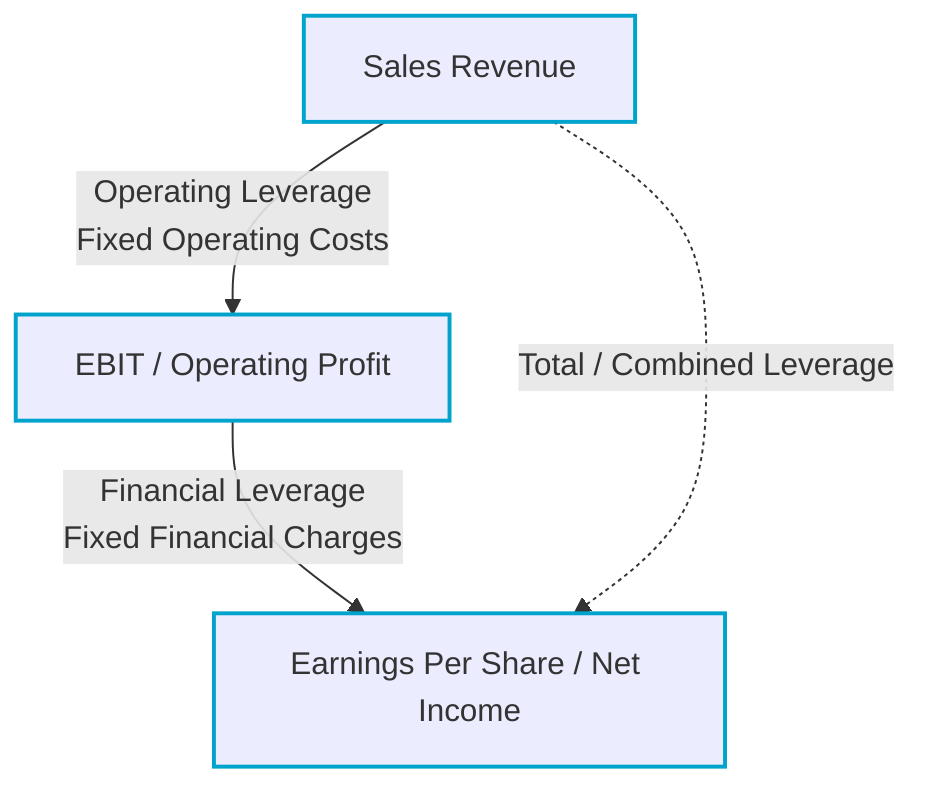

# Leverage and Capital Structure Decisions

> [!abstract] Curriculum & Syllabus Context
>
> - **Course:** ACC 302 Financial Management
> - **Phase:** Phase 6: Leverage and Capital Structure Decisions
> - **Target Reading:** Smart & Zutter (16e) Chapter 13; Van Horne (13e) Chapters 16 & 17
> - **Syllabus Focus:** Operating leverage and break-even analysis, DOL derivation, financial leverage and DFL, EBIT-EPS indifference analysis, DTL, business risk vs financial risk, capital structure theories (NOI, Traditional, M&M Proposition I & II with and without taxes, Trade-off theory, Pecking order), and Hamada equation for levering/unlevering Beta.

---

### Learning Objective 6.1: Concept and Types of Leverage

#### 1. Definition and Physical Analogy of Leverage
> [!info] Key Definition: Leverage
>
> **Leverage** in a financial context refers to the use of fixed costs (fixed operating costs or fixed financing charges) in an attempt to magnify or lever up potential returns to the firm's owners.

* **Mechanical Analogy:** Just as a mechanical lever uses a fulcrum to magnify a small physical force into a much larger applied force, fixed costs act as a financial fulcrum—causing a relatively small percentage change in sales or operating earnings to produce a much larger percentage change in operating income or earnings per share (EPS).
* **The Two-Edged Sword:** Leverage magnifies both gains and losses. While it boosts profitability when business conditions expand, it severely accelerates losses when revenues or operating earnings decline.

#### 2. The Three Types of Leverage

1. **Operating Leverage:**
   * Arises from the presence of **fixed operating costs** (e.g., automated plant depreciation, lease payments, fixed salaries, property taxes) in the firm's operations.
   * Measures the responsiveness of Earnings Before Interest and Taxes (EBIT) to changes in sales revenue.
   * Primarily determined by technology, capital intensity, and the firm's operating cost structure.
2. **Financial Leverage:**
   * Arises from the presence of **fixed financing costs** (e.g., interest on debt, fixed preferred stock dividends) in the firm's capital structure.
   * Measures the responsiveness of Earnings Per Share (EPS) or Net Income to changes in EBIT.
   * Directly results from managerial financing choices (unlike operating leverage, which is often constrained by production technology).
3. **Total (Combined) Leverage:**
   * Represents the combined numerical effect of operating leverage and financial leverage.
   * Measures the ultimate sensitivity of EPS to changes in sales volume.

---

### Learning Objective 6.2: Operating Leverage & Break-Even Analysis

#### 1. Operating Break-Even Analysis
Operating break-even analysis identifies the output quantity ($Q_{BE}$) or sales dollar volume ($S_{BE}$) required to cover all fixed and variable operating costs, where $EBIT = \$0$.

* **Key Variables:**
  * $P$ = Selling price per unit
  * $V$ = Variable operating cost per unit
  * $FC$ = Total fixed operating costs per period
  * $Q$ = Quantity of units produced and sold
  * $(P - V)$ = Unit Contribution Margin (amount of each dollar of sales remaining to cover fixed costs and contribute to EBIT)
  * $\frac{P - V}{P}$ = Contribution Margin Ratio

> [!quote] Formula & Derivation: Operating Break-Even
>
> $$\text{EBIT} = P(Q) - V(Q) - FC = Q(P - V) - FC$$
> Setting $\text{EBIT} = 0$:
> **Break-Even Quantity:**
> $$Q_{BE} = \frac{FC}{P - V}$$
> **Break-Even Sales Dollars:**
> $$S_{BE} = Q_{BE} \times P = \frac{FC}{1 - \frac{V}{P}}$$
> **Target Operating Income Quantity:**
> $$Q_{\text{target}} = \frac{FC + \text{EBIT}^*}{P - V}$$

#### 2. Degree of Operating Leverage (DOL)
The **Degree of Operating Leverage (DOL)** at a base sales level $Q$ is defined as the percentage change in EBIT resulting from a 1% change in sales volume:

> [!quote] Formula & Derivation: Degree of Operating Leverage (DOL)
>
> $$\text{DOL}_Q = \frac{\% \Delta \text{EBIT}}{\% \Delta \text{Sales}} = \frac{\frac{\Delta \text{EBIT}}{\text{EBIT}}}{\frac{\Delta Q}{Q}}$$
> 
> **Algebraic Computation Formulae:**
> $$\text{DOL}_Q = \frac{Q(P - V)}{Q(P - V) - FC} = \frac{\text{EBIT} + FC}{\text{EBIT}}$$
> $$\text{DOL}_{\text{Sales Dollars}} = \frac{\text{Sales} - \text{Total Variable Costs}}{\text{Sales} - \text{Total Variable Costs} - FC} = \frac{\text{Gross Operating Margin}}{\text{EBIT}}$$

* **Properties of DOL:**
  * As output $Q$ approaches the break-even point $Q_{BE}$ from above, $\text{DOL}_Q \to \infty$.
  * As output $Q$ grows far beyond break-even, $\text{DOL}_Q \to 1.0$.
  * Proximity to the break-even point—rather than the absolute dollar magnitude of fixed costs alone—determines a firm's operational sensitivity.

---

### Learning Objective 6.3: Financial Leverage & EBIT-EPS Indifference Analysis

#### 1. Degree of Financial Leverage (DFL)
The **Degree of Financial Leverage (DFL)** measures the sensitivity of EPS to changes in operating income (EBIT).

> [!quote] Formula & Derivation: Degree of Financial Leverage (DFL)
>
> $$\text{DFL}_{\text{EBIT}} = \frac{\% \Delta \text{EPS}}{\% \Delta \text{EBIT}}$$
> 
> **Algebraic Formula (Accounting for Interest $I$, Preferred Dividends $PD$, and Tax Rate $T$):**
> $$\text{DFL}_{\text{EBIT}} = \frac{\text{EBIT}}{\text{EBIT} - I - \frac{PD}{1 - T}}$$
> *(Note: Preferred dividends $PD$ must be grossed up by $\frac{1}{1-T}$ because they are paid out of after-tax income, whereas interest $I$ is tax-deductible).*

#### 2. EBIT-EPS Indifference Analysis
EBIT-EPS analysis evaluates financing alternatives (e.g., 100% Equity vs. 50% Debt / 50% Equity) by determining the level of EBIT at which two financing plans yield the exact same Earnings Per Share ($\text{EPS}$).

> [!quote] Formula & Derivation: EBIT-EPS Indifference Point
>
> $$\frac{(\text{EBIT}^* - I_1)(1 - T) - PD_1}{\text{NS}_1} = \frac{(\text{EBIT}^* - I_2)(1 - T) - PD_2}{\text{NS}_2}$$
> *Where:*
> * $\text{EBIT}^*$ = Indifference EBIT level
> * $I_1, I_2$ = Annual interest expense under Plans 1 and 2
> * $PD_1, PD_2$ = Annual preferred stock dividends under Plans 1 and 2
> * $T$ = Marginal corporate tax rate
> * $\text{NS}_1, \text{NS}_2$ = Number of common shares outstanding under Plans 1 and 2

* **Decision Rules:**
  * **If Expected EBIT > $\text{EBIT}^*$:** The higher-leveraged financing plan produces a higher EPS (favorable financial leverage).
  * **If Expected EBIT < $\text{EBIT}^*$:** The lower-leveraged / equity plan produces a higher EPS (unfavorable financial leverage).

#### 3. Degree of Total Leverage (DTL)
The **Degree of Total Leverage (DTL)** measures the combined sensitivity of EPS to changes in sales volume.

> [!quote] Formula & Derivation: Degree of Total Leverage (DTL)
>
> $$\text{DTL}_Q = \frac{\% \Delta \text{EPS}}{\% \Delta \text{Sales}} = \text{DOL}_Q \times \text{DFL}_{\text{EBIT}}$$
> 
> **Algebraic Formula:**
> $$\text{DTL}_Q = \frac{Q(P - V)}{Q(P - V) - FC - I - \frac{PD}{1 - T}}$$

---

### Learning Objective 6.4: Business Risk vs. Financial Risk

#### 1. Business Risk
> [!info] Key Definition: Business Risk
>
> **Business risk** is the fundamental risk inherent in the firm's operations assuming it uses zero debt financing ($\text{Debt} = 0$).

* **Measurement:** Measured statistically by the standard deviation or coefficient of variation of Return on Invested Capital ($\sigma_{\text{ROIC}}$ or $\text{CV}_{\text{ROIC}}$), or $CV_{\text{EBIT}}$.
* **Key Determinants:**
  1. *Demand Variability:* Stability of product demand.
  2. *Sales Price Variability:* Price volatility in output markets.
  3. *Input Cost Variability:* Volatility of raw materials and labor costs.
  4. *Ability to Adjust Selling Prices:* Pass-through power for cost inflation.
  5. *Product Obsolescence & High-Tech Life Cycles:* Rate of technological change.
  6. *Foreign Exchange & Political Exposure:* Multinational operations.
  7. *Operating Leverage:* Extent of fixed operating costs.

#### 2. Financial Risk
> [!info] Key Definition: Financial Risk
>
> **Financial risk** is the additional risk concentrated on common stockholders as a direct consequence of using fixed-cost financial leverage (debt and preferred stock).

* **Components of Financial Risk:**
  1. *Risk of Financial Distress / Cash Insolvency:* The increased probability that cash earnings will be insufficient to meet mandatory contractual debt service obligations.
  2. *Magnified EPS Volatility:* Added dispersion in ROE and EPS beyond basic business risk.
* **Total Risk Relationship:**
  $$\text{Total Firm Risk } (\text{CV}_{\text{EPS}}) = \text{Business Risk } (\text{CV}_{\text{EBIT}}) + \text{Financial Risk}$$
  $$\text{CV}_{\text{EPS}} = \text{CV}_{\text{EBIT}} \times \text{DFL}_{\text{EBIT}}$$

---

### Learning Objective 6.5: Capital Structure Concepts & Capital Structure Theories

#### 1. Fundamental Definitions
* **Capital Structure:** The proportion or mix of permanent long-term financing represented by long-term debt, preferred stock, and common stock equity.
* **Target Capital Structure:** The specific mix of debt, preferred stock, and equity that management intends to maintain over time.
* **Optimal Capital Structure:** The capital structure mix that minimizes the firm's Weighted Average Cost of Capital (WACC) and simultaneously maximizes the firm's stock price / intrinsic value.

#### 2. Early Capital Structure Theories: NOI vs. Traditional Approach
* **Net Operating Income (NOI) Approach (Durand):** Asserts that the overall capitalization rate ($k_o$ / WACC) and total firm value ($V$) remain **completely constant** regardless of the debt ratio ($B/S$). As cheap debt is added, equity holders demand a higher return on equity ($k_e$) due to increased financial risk, exactly offsetting the debt advantage.
* **Traditional Approach:** Assumes that an **optimal capital structure exists**. Initially, the cost of equity $k_e$ increases slowly and does not completely offset the benefit of cheaper debt, causing WACC to fall. Beyond an optimal debt threshold, financial risk penalties cause $k_e$ and $k_i$ to rise rapidly, driving WACC up.

#### 3. Modigliani & Miller (M&M) Capital Structure Hypotheses

> [!quote] Formula & Derivation: M&M Proposition I & II (No Taxes - 1958)
>
> **M&M Proposition I:** Capital structure is **irrelevant**. Firm value is determined by operating earning power, not financing. (Proved via "homemade leverage" arbitrage).
> $$V_L = V_U = \frac{\text{EBIT}}{WACC}$$
> 
> **M&M Proposition II:** Required return on levered equity ($r_L$) increases linearly with the debt-to-equity ratio, keeping WACC constant.
> $$r_L = r_U + (r_U - r_d)\frac{D}{E}$$

> [!quote] Formula & Derivation: M&M with Corporate Taxes (1963)
>
> Because interest is tax-deductible, debt generates a valuable **Interest Tax Shield**. 
> $$V_L = V_U + T_c D$$
> *Implication:* The optimal capital structure is **100% Debt** (assuming no bankruptcy costs).

* **Miller's Model with Personal Taxes (1977):** Introduced personal tax rates on interest income ($T_{pd}$) and stock income ($T_{ps}$). If $(1 - T_{pd}) = (1 - T_c)(1 - T_{ps})$, the gain from leverage is zero, restoring capital structure irrelevance.

#### 4. Real-World Trade-Off, Agency, Signaling, and Pecking Order Theories
* **Trade-Off Theory (Static Trade-Off):** Firms trade off the incremental **tax shield benefits** of debt against the incremental costs of **potential financial distress and bankruptcy**.
  $$V_L = V_U + PV(\text{Interest Tax Shields}) - PV(\text{Financial Distress}) - PV(\text{Agency Costs})$$
* **Agency Costs & Free Cash Flow Hypothesis:** 
  * Debt introduces conflicts (Asset Substitution / Risk Shifting and Underinvestment).
  * *Free Cash Flow (Jensen):* Debt forces managers to pay out cash rather than squandering excess free cash flow on empire-building.
* **Signaling Theory & Asymmetric Information:** Managers possess better information than outside investors.
  * *Issuing Debt:* A **positive signal** that management expects strong future cash flows.
  * *Issuing Equity:* A **negative signal** indicating the stock is overvalued.
  * *Reserve Borrowing Capacity:* Firms deliberately maintain low debt to preserve borrowing ability for future good investments.
* **Pecking Order Hypothesis (Myers & Majluf):** Firms do not target a rigid debt ratio. They finance investments in a strict hierarchy due to flotation costs and signaling:
  1. Internally generated funds (Retained Earnings).
  2. Debt financing.
  3. External equity (Last resort).

#### 5. Adjusting Beta for Financial Leverage: The Hamada Equation
Robert Hamada combined the CAPM with M&M's tax framework to quantify the effect of financial leverage on a firm's Beta.

> [!quote] Formula & Derivation: The Hamada Equation
>
> $$b_L = b_U \left[ 1 + (1 - T)\left(\frac{D}{E}\right) \right]$$
> *Where:*
> * $b_L$ = Levered Beta (reflecting both business risk and financial risk)
> * $b_U$ = Unlevered Beta (reflecting basic business risk only)
> * $T$ = Marginal corporate tax rate
> * $\frac{D}{E}$ = Debt-to-Equity ratio in market value terms
> 
> **Unlevering Formula:**
> $$b_U = \frac{b_L}{1 + (1 - T)\left(\frac{D}{E}\right)}$$

---

### Learning Objective 6.6: High-Yield Numerical Problem Walkthroughs

> [!example] Problem 1: Operating Break-Even and DOL Calculation
>
> **Scenario:** A company sells a product for $P = \$25$ per unit, with variable costs $V = \$15$ per unit and annual fixed operating costs $FC = \$140,000$.
> 1. Calculate the operating break-even quantity ($Q_{BE}$).
> 2. Calculate the EBIT at sales of $Q = 18,000$ units.
> 3. Calculate the DOL at $Q = 18,000$ units.
> 
> **Solution:**
> 4. **Break-Even Quantity:**
>    $$Q_{BE} = \frac{FC}{P - V} = \frac{\$140,000}{\$25 - \$15} = \frac{\$140,000}{\$10} = 14,000 \text{ units}$$
> 5. **EBIT at 18,000 units:**
>    $$\text{EBIT} = Q(P - V) - FC = 18,000(\$10) - \$140,000 = \$180,000 - \$140,000 = \$40,000$$
> 6. **Degree of Operating Leverage (DOL):**
>    $$\text{DOL}_{18,000} = \frac{Q(P - V)}{\text{EBIT}} = \frac{18,000 \times \$10}{\$40,000} = \frac{\$180,000}{\$40,000} = 4.50$$

> [!example] Problem 2: EBIT-EPS Indifference Point
>
> **Scenario:** Firm $X$ has $\$20,000,000$ in total capital and requires $\$5,000,000$ in additional capital for expansion. Tax rate $T = 40\%$.
> * **Plan 1 (Common Stock):** Issue $100,000$ new shares at $\$50$/share. Total shares $\text{NS}_1 = 300,000$. Interest $I_1 = \$0$.
> * **Plan 2 (Debt):** Issue $\$5,000,000$ in debt at $12\%$ interest. Total shares $\text{NS}_2 = 200,000$. Interest $I_2 = \$600,000$.
> Calculate the EBIT indifference point ($\text{EBIT}^*$).
> 
> **Solution:**
> $$\frac{(\text{EBIT}^* - \$0)(1 - 0.40)}{300,000} = \frac{(\text{EBIT}^* - \$600,000)(1 - 0.40)}{200,000}$$
> $$\frac{0.60 \text{EBIT}^*}{300,000} = \frac{0.60 \text{EBIT}^* - \$360,000}{200,000}$$
> Cross-multiplying:
> $$200,000(0.60 \text{EBIT}^*) = 300,000(0.60 \text{EBIT}^* - \$360,000)$$
> $$120,000 \text{EBIT}^* = 180,000 \text{EBIT}^* - \$108,000,000,000$$
> $$60,000 \text{EBIT}^* = \$108,000,000,000$$
> $$\text{EBIT}^* = \$1,800,000$$

> [!example] Problem 3: Levering Beta with the Hamada Equation
>
> **Scenario:** Cyclone Software has a current capital structure of 25% debt ($w_d = 0.25$) and 75% equity ($w_e = 0.75$), with a levered beta $b_L = 1.40$. Tax rate $T = 40\%$. Calculate the new levered beta if the firm changes its capital structure to 50% debt ($w_d = 0.50$) and 50% equity ($w_e = 0.50$).
> 
> **Solution:**
> 1. **Current Debt-to-Equity Ratio:**
>    $$\left(\frac{D}{E}\right)_1 = \frac{0.25}{0.75} = 0.3333$$
> 2. **Unlever the Current Beta ($b_U$):**
>    $$b_U = \frac{b_L}{1 + (1 - T)\left(\frac{D}{E}\right)_1} = \frac{1.40}{1 + (0.60)(0.3333)} = \frac{1.40}{1.20} = 1.1667$$
> 3. **New Debt-to-Equity Ratio:**
>    $$\left(\frac{D}{E}\right)_2 = \frac{0.50}{0.50} = 1.00$$
> 4. **Re-lever Beta for the Target Capital Structure ($b_{L,\text{new}}$):**
>    $$b_{L,\text{new}} = b_U \left[ 1 + (1 - T)\left(\frac{D}{E}\right)_2 \right] = 1.1667 \times [1 + (0.60)(1.00)] = 1.1667 \times 1.60 = 1.8667$$
